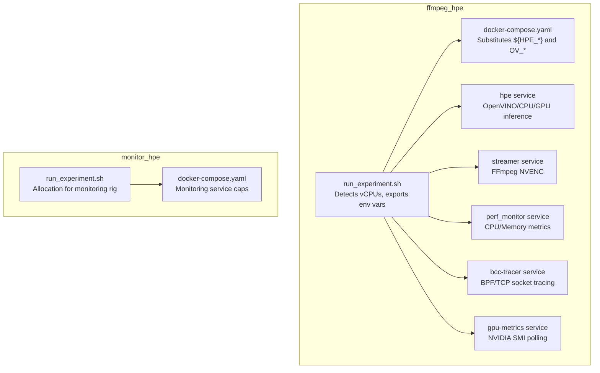
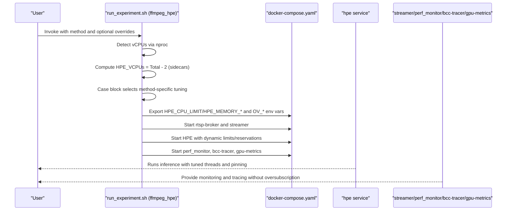
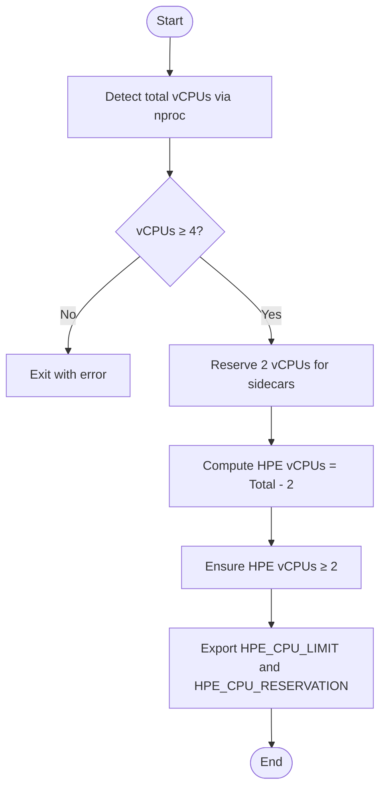
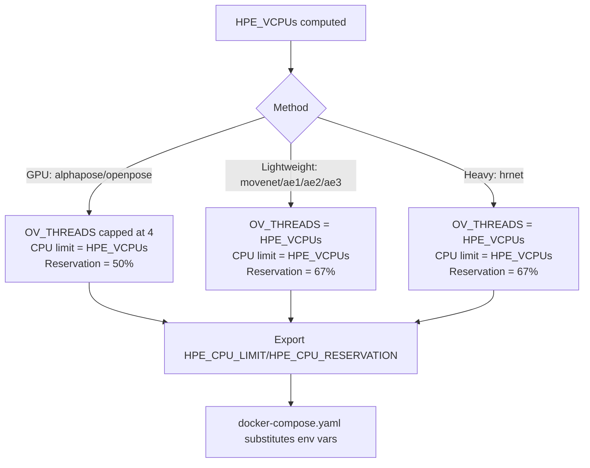
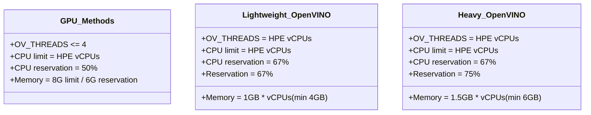
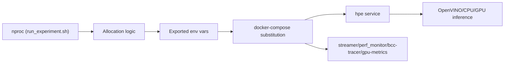

# Dynamic Resource Allocation

<cite>
**Referenced Files in This Document**
- [DYNAMIC_RESOURCE_ALLOCATION.md](file://ffmpeg_hpe/DYNAMIC_RESOURCE_ALLOCATION.md)
- [RESOURCE_ALLOCATION.md](file://monitor_hpe/RESOURCE_ALLOCATION.md)
- [run_experiment.sh (ffmpeg_hpe)](file://ffmpeg_hpe/run_experiment.sh)
- [run_experiment.sh (monitor_hpe)](file://monitor_hpe/run_experiment.sh)
- [docker-compose.yaml (ffmpeg_hpe)](file://ffmpeg_hpe/docker-compose.yaml)
- [docker-compose.yaml (monitor_hpe)](file://monitor_hpe/docker-compose.yaml)
- [entrypoint.sh (ffmpeg_hpe)](file://ffmpeg_hpe/entrypoint.sh)
- [main.py](file://main.py)
</cite>

## Table of Contents
1. [Introduction](#introduction)
2. [Project Structure](#project-structure)
3. [Core Components](#core-components)
4. [Architecture Overview](#architecture-overview)
5. [Detailed Component Analysis](#detailed-component-analysis)
6. [Dependency Analysis](#dependency-analysis)
7. [Performance Considerations](#performance-considerations)
8. [Troubleshooting Guide](#troubleshooting-guide)
9. [Conclusion](#conclusion)

## Introduction
This document explains the dynamic resource allocation system that automatically optimizes container placement based on available hardware resources. It covers:
- vCPU detection using nproc
- Sidecar container resource reservation strategy (2 vCPUs reserved for monitoring and tracing)
- Proportional allocation distributing remaining CPU resources among HPE containers
- Per-method resource tuning for AlphaPose, OpenPose, MoveNet, and HRNet variants
- Memory allocation calculations, thread scaling strategies, and CPU pinning configurations
- Examples for different system configurations and troubleshooting allocation conflicts

## Project Structure
The dynamic allocation spans two experiment rigs:
- ffmpeg_hpe: end-to-end streaming pipeline with GPU metrics and BPF tracing
- monitor_hpe: focused monitoring rig with CPU pinning and latency mode

Key files:
- ffmpeg_hpe/run_experiment.sh: orchestrates detection, allocation, and container lifecycle
- ffmpeg_hpe/docker-compose.yaml: defines services and dynamic resource substitution
- monitor_hpe/run_experiment.sh: mirrors allocation logic for the monitoring rig
- monitor_hpe/docker-compose.yaml: defines monitoring service resource caps
- ffmpeg_hpe/entrypoint.sh: optional GPU metrics launcher
- main.py: HPE entrypoint that consumes OpenVINO environment variables

**Diagram sources**
- [run_experiment.sh (ffmpeg_hpe):99-178](file://ffmpeg_hpe/run_experiment.sh#L99-L178)
- [docker-compose.yaml (ffmpeg_hpe):69-133](file://ffmpeg_hpe/docker-compose.yaml#L69-L133)
- [run_experiment.sh (monitor_hpe):12-33](file://monitor_hpe/run_experiment.sh#L12-L33)
- [docker-compose.yaml (monitor_hpe):1-60](file://monitor_hpe/docker-compose.yaml#L1-L60)

**Section sources**
- [DYNAMIC_RESOURCE_ALLOCATION.md:1-167](file://ffmpeg_hpe/DYNAMIC_RESOURCE_ALLOCATION.md#L1-L167)
- [RESOURCE_ALLOCATION.md:1-290](file://monitor_hpe/RESOURCE_ALLOCATION.md#L1-L290)

## Core Components
- vCPU detection: Uses nproc to auto-detect total vCPUs and reserves 2 vCPUs for sidecars (streamer, perf_monitor, bcc-tracer, gpu-metrics).
- Proportional allocation: Remaining CPUs are assigned to the HPE service with CPU limit equal to allocated vCPUs and a reservation fraction depending on method.
- Per-method tuning: GPU methods cap CPU threads at 4; lightweight OpenVINO methods scale threads to available vCPUs; HRNet variants increase memory scaling.
- Environment variable export: run_experiment.sh exports HPE_CPU_LIMIT, HPE_CPU_RESERVATION, HPE_MEMORY_LIMIT, HPE_MEMORY_RESERVATION, OV_THREADS, OV_MODE, OV_CPU_PINNING, OV_HYPER_THREADING for docker-compose substitution.
- Docker Compose substitution: ffmpeg_hpe/docker-compose.yaml uses ${HPE_*} and ${OV_*} variables to apply dynamic limits and reservations.

**Section sources**
- [DYNAMIC_RESOURCE_ALLOCATION.md:21-98](file://ffmpeg_hpe/DYNAMIC_RESOURCE_ALLOCATION.md#L21-L98)
- [run_experiment.sh (ffmpeg_hpe):99-178](file://ffmpeg_hpe/run_experiment.sh#L99-L178)
- [docker-compose.yaml (ffmpeg_hpe):109-123](file://ffmpeg_hpe/docker-compose.yaml#L109-L123)

## Architecture Overview
The system integrates detection, allocation, and deployment across multiple containers. The HPE service receives OpenVINO tuning via environment variables, while sidecars remain bounded to prevent contention.

**Diagram sources**
- [run_experiment.sh (ffmpeg_hpe):99-178](file://ffmpeg_hpe/run_experiment.sh#L99-L178)
- [docker-compose.yaml (ffmpeg_hpe):69-133](file://ffmpeg_hpe/docker-compose.yaml#L69-L133)

## Detailed Component Analysis

### vCPU Detection and Sidecar Reservation
- Detection: Total vCPUs are read using nproc.
- Reservation: Fixed 2 vCPUs reserved for sidecars to avoid scheduler contention.
- Minimum requirement: Script enforces a minimum of 4 vCPUs; otherwise, it exits with an error.
- Allocation: HPE vCPUs = Total vCPUs − 2, with a floor ensuring at least 2 vCPUs for HPE.

**Diagram sources**
- [run_experiment.sh (ffmpeg_hpe):103-115](file://ffmpeg_hpe/run_experiment.sh#L103-L115)
- [DYNAMIC_RESOURCE_ALLOCATION.md:99-103](file://ffmpeg_hpe/DYNAMIC_RESOURCE_ALLOCATION.md#L99-L103)

**Section sources**
- [run_experiment.sh (ffmpeg_hpe):103-115](file://ffmpeg_hpe/run_experiment.sh#L103-L115)
- [DYNAMIC_RESOURCE_ALLOCATION.md:99-103](file://ffmpeg_hpe/DYNAMIC_RESOURCE_ALLOCATION.md#L99-L103)

### Proportional CPU Allocation and Docker Substitution
- CPU limit: Equal to HPE vCPUs (floating-point format).
- CPU reservation: 50% for GPU methods, 67% for lightweight OpenVINO methods, 67% for HRNet variants.
- Docker Compose: Substitutes ${HPE_CPU_LIMIT} and ${HPE_CPU_RESERVATION} in the hpe service deploy.resources.limits and reservations blocks.

**Diagram sources**
- [run_experiment.sh (ffmpeg_hpe):125-165](file://ffmpeg_hpe/run_experiment.sh#L125-L165)
- [docker-compose.yaml (ffmpeg_hpe):109-123](file://ffmpeg_hpe/docker-compose.yaml#L109-L123)

**Section sources**
- [run_experiment.sh (ffmpeg_hpe):125-165](file://ffmpeg_hpe/run_experiment.sh#L125-L165)
- [docker-compose.yaml (ffmpeg_hpe):109-123](file://ffmpeg_hpe/docker-compose.yaml#L109-L123)

### Per-Method Resource Tuning
- GPU methods (AlphaPose, OpenPose):
  - OV_THREADS capped at 4 (PyTorch/CUDA handles heavy lifting; CPU threads used for preprocessing/postprocessing).
  - CPU limit equals allocated HPE vCPUs; reservation 50%.
  - Memory: 8G limit, 6G reservation.
- Lightweight OpenVINO (MoveNet, AE variants):
  - OV_THREADS = HPE vCPUs.
  - CPU limit equals allocated HPE vCPUs; reservation 67%.
  - Memory: 1 GB per vCPU, minimum 4 GB; reservation 67%.
- Heavy OpenVINO (HRNet variants):
  - OV_THREADS = HPE vCPUs.
  - CPU limit equals allocated HPE vCPUs; reservation 67%.
  - Memory: 1.5 GB per vCPU, minimum 6 GB; reservation 75%.

**Diagram sources**
- [DYNAMIC_RESOURCE_ALLOCATION.md:37-53](file://ffmpeg_hpe/DYNAMIC_RESOURCE_ALLOCATION.md#L37-L53)
- [run_experiment.sh (ffmpeg_hpe):126-154](file://ffmpeg_hpe/run_experiment.sh#L126-L154)

**Section sources**
- [DYNAMIC_RESOURCE_ALLOCATION.md:35-53](file://ffmpeg_hpe/DYNAMIC_RESOURCE_ALLOCATION.md#L35-L53)
- [run_experiment.sh (ffmpeg_hpe):126-154](file://ffmpeg_hpe/run_experiment.sh#L126-L154)

### Memory Allocation Calculations
- GPU methods: Fixed 8 GB memory limit and 6 GB reservation.
- Lightweight OpenVINO: Memory = max(HPE vCPUs, 4) GB; reservation ≈ 67%.
- Heavy OpenVINO (HRNet): Memory = max(ceil(1.5 × HPE vCPUs), 6) GB; reservation ≈ 75%.

These values are exported as HPE_MEMORY_LIMIT and HPE_MEMORY_RESERVATION and applied in docker-compose.

**Section sources**
- [DYNAMIC_RESOURCE_ALLOCATION.md:37-53](file://ffmpeg_hpe/DYNAMIC_RESOURCE_ALLOCATION.md#L37-L53)
- [run_experiment.sh (ffmpeg_hpe):137-154](file://ffmpeg_hpe/run_experiment.sh#L137-L154)
- [docker-compose.yaml (ffmpeg_hpe):117-122](file://ffmpeg_hpe/docker-compose.yaml#L117-L122)

### Thread Scaling Strategies and CPU Pinning
- Thread scaling:
  - GPU methods: Cap threads at 4 to align with CPU-bound preprocessing/postprocessing.
  - Lightweight OpenVINO: Scale threads linearly with HPE vCPUs.
  - Heavy OpenVINO: Scale threads linearly with HPE vCPUs.
- CPU pinning and hyper-threading:
  - OV_CPU_PINNING enabled for consistent measurements.
  - OV_HYPER_THREADING disabled for predictable CPU cycles.
- OpenVINO mode:
  - OV_MODE set to latency for single-stream responsiveness.

These environment variables are exported and consumed by the HPE service.

**Section sources**
- [DYNAMIC_RESOURCE_ALLOCATION.md:37-53](file://ffmpeg_hpe/DYNAMIC_RESOURCE_ALLOCATION.md#L37-L53)
- [run_experiment.sh (ffmpeg_hpe):167-169](file://ffmpeg_hpe/run_experiment.sh#L167-L169)
- [docker-compose.yaml (ffmpeg_hpe):95-99](file://ffmpeg_hpe/docker-compose.yaml#L95-L99)

### Example Allocations Across System Configurations
- 4 vCPU VM:
  - HPE vCPUs: 2 (sidecars: 2)
  - GPU methods: 2 CPUs limit, 1.0 CPU reservation, 8G memory limit
  - Lightweight OpenVINO: 2 CPUs limit, 1.3 CPU reservation, 4G memory limit
  - HRNet: 2 CPUs limit, 1.3 CPU reservation, 6G memory limit
- 8 vCPU VM:
  - HPE vCPUs: 6 (sidecars: 2)
  - GPU methods: 6 CPUs limit, 3.0 CPU reservation, 8G memory limit
  - Lightweight OpenVINO: 6 CPUs limit, 4.0 CPU reservation, 6G memory limit
  - HRNet: 6 CPUs limit, 4.0 CPU reservation, 9G memory limit
- 16 vCPU VM:
  - HPE vCPUs: 14 (sidecars: 2)
  - GPU methods: 14 CPUs limit, 7.0 CPU reservation, 8G memory limit
  - Lightweight OpenVINO: 14 CPUs limit, 9.3 CPU reservation, 14G memory limit
  - HRNet: 14 CPUs limit, 9.3 CPU reservation, 21G memory limit

**Section sources**
- [DYNAMIC_RESOURCE_ALLOCATION.md:30-34](file://ffmpeg_hpe/DYNAMIC_RESOURCE_ALLOCATION.md#L30-L34)
- [DYNAMIC_RESOURCE_ALLOCATION.md:115-132](file://ffmpeg_hpe/DYNAMIC_RESOURCE_ALLOCATION.md#L115-L132)

### Monitoring and Sidecar Resource Caps
- Sidecar services are intentionally capped to minimize contention:
  - streamer: ~0.75 CPU, 512 MB memory
  - perf_monitor: ~0.25 CPU, 256 MB memory
  - bcc-tracer: ~0.5 CPU, 512 MB memory
  - gpu-metrics: ~0.1 CPU, 128 MB memory
- Total sidecar headroom: ~1.6 CPUs; fixed 2 vCPUs reserved to ensure HPE measurements remain unaffected.

**Section sources**
- [DYNAMIC_RESOURCE_ALLOCATION.md:100-103](file://ffmpeg_hpe/DYNAMIC_RESOURCE_ALLOCATION.md#L100-L103)
- [docker-compose.yaml (ffmpeg_hpe):17-27](file://ffmpeg_hpe/docker-compose.yaml#L17-L27)
- [docker-compose.yaml (ffmpeg_hpe):43-55](file://ffmpeg_hpe/docker-compose.yaml#L43-L55)
- [docker-compose.yaml (ffmpeg_hpe):188-194](file://ffmpeg_hpe/docker-compose.yaml#L188-L194)
- [docker-compose.yaml (ffmpeg_hpe):156-162](file://ffmpeg_hpe/docker-compose.yaml#L156-L162)

### Optional GPU Metrics Collection
- The ffmpeg_hpe entrypoint conditionally starts GPU metrics collection when enabled and ensures cleanup on exit.

**Section sources**
- [entrypoint.sh (ffmpeg_hpe):4-13](file://ffmpeg_hpe/entrypoint.sh#L4-L13)

## Dependency Analysis
The dynamic allocation relies on:
- run_experiment.sh to detect vCPUs, compute allocations, and export environment variables
- docker-compose.yaml to apply dynamic limits and reservations
- HPE service to consume OpenVINO tuning via environment variables
- Sidecar services to remain bounded and avoid contention

**Diagram sources**
- [run_experiment.sh (ffmpeg_hpe):103-178](file://ffmpeg_hpe/run_experiment.sh#L103-L178)
- [docker-compose.yaml (ffmpeg_hpe):95-123](file://ffmpeg_hpe/docker-compose.yaml#L95-L123)

**Section sources**
- [run_experiment.sh (ffmpeg_hpe):99-178](file://ffmpeg_hpe/run_experiment.sh#L99-L178)
- [docker-compose.yaml (ffmpeg_hpe):95-123](file://ffmpeg_hpe/docker-compose.yaml#L95-L123)

## Performance Considerations
- CPU pinning and disabling hyper-threading improve measurement repeatability and reduce variability.
- Thread scaling should match workload characteristics: capped threads for GPU methods, scaled threads for CPU-bound OpenVINO models.
- Memory scaling should reflect model complexity: fixed for GPU methods, linear for lightweight OpenVINO, and stepped for HRNet variants.
- Ensure sidecar caps are respected to avoid scheduler contention that could mask true HPE performance.

[No sources needed since this section provides general guidance]

## Troubleshooting Guide
- Allocation conflicts or insufficient CPU:
  - Verify detected vCPUs and allocation printouts; ensure at least 4 vCPUs.
  - Confirm docker stats shows correct CPU limits and reservations.
- Out-of-memory errors:
  - Review printed memory allocation; override HPE_MEMORY_LIMIT if needed.
  - Consider increasing VM RAM or reducing model complexity.
- Lower-than-expected performance:
  - Check that OV_THREADS matches the allocated HPE vCPUs.
  - Validate CPU pinning and hyper-threading settings are applied.
  - Ensure sidecars are not oversubscribed and not competing for CPU.

**Section sources**
- [DYNAMIC_RESOURCE_ALLOCATION.md:146-161](file://ffmpeg_hpe/DYNAMIC_RESOURCE_ALLOCATION.md#L146-L161)
- [run_experiment.sh (ffmpeg_hpe):171-178](file://ffmpeg_hpe/run_experiment.sh#L171-L178)

## Conclusion
The dynamic resource allocation system automatically detects available vCPUs, reserves capacity for sidecars, and proportionally distributes CPU and memory resources to HPE containers. Per-method tuning ensures optimal performance across GPU-accelerated and CPU-based backends, while CPU pinning and hyper-threading controls improve measurement consistency. The design is portable across 4–32+ vCPU systems and maintains backward compatibility.