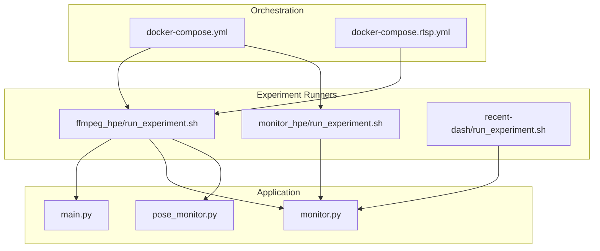
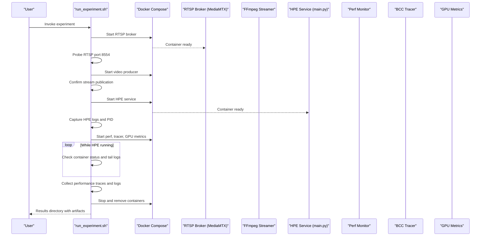
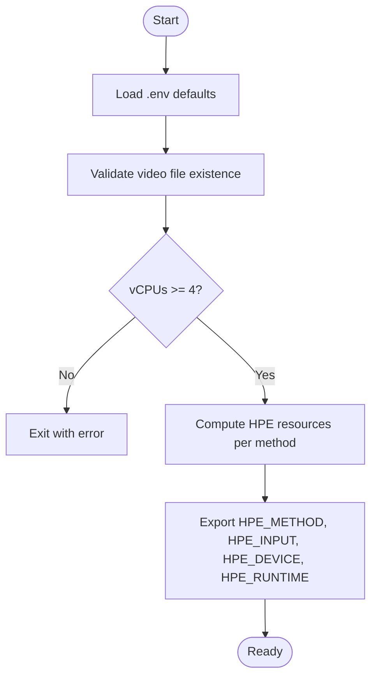
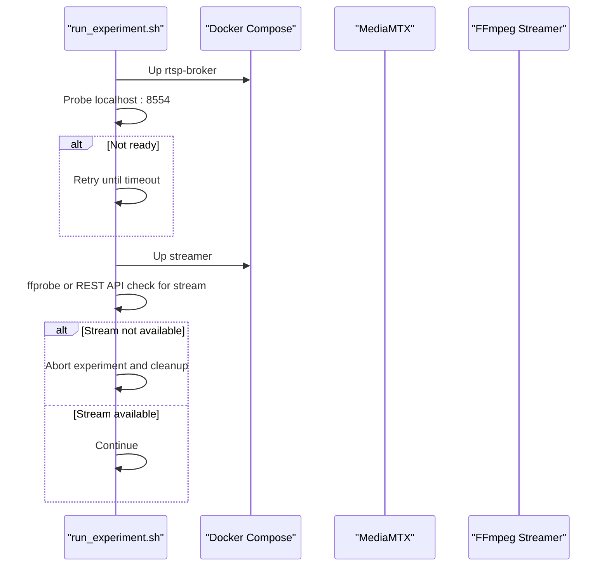
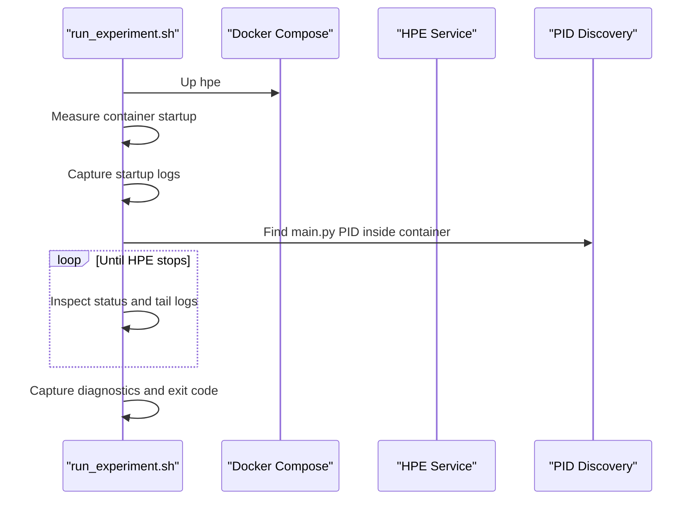
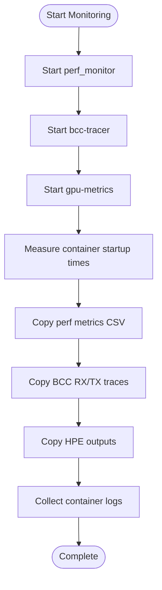
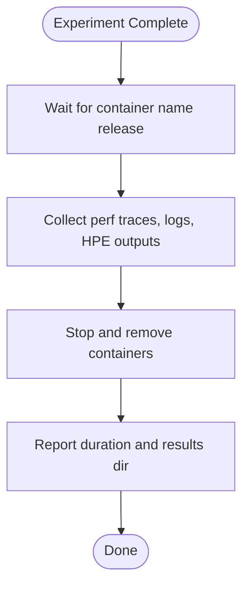
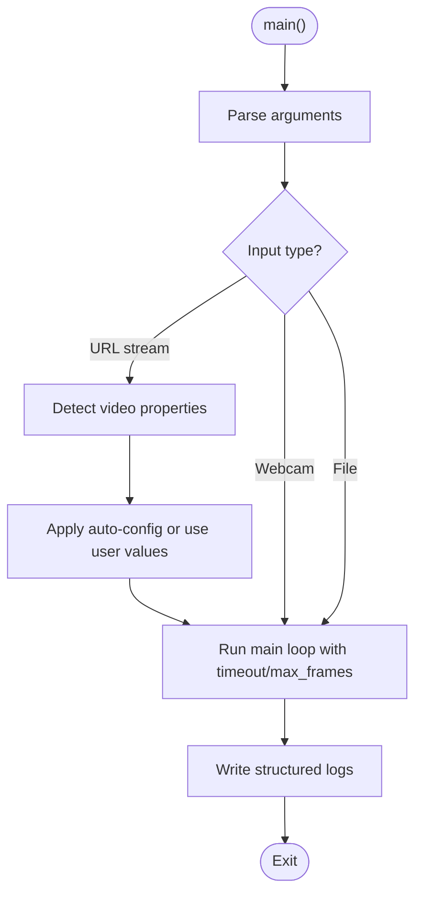
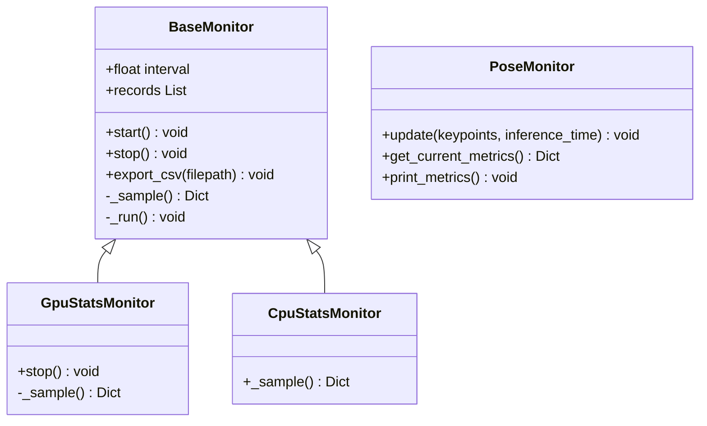
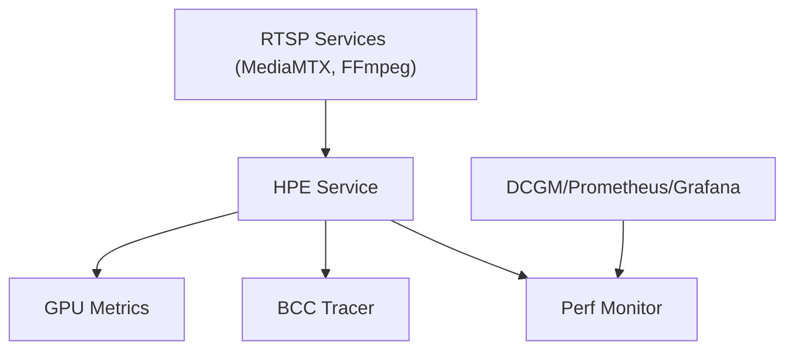

# Experiment Lifecycle Management

<cite>
**Referenced Files in This Document**
- [docker-compose.yml](file://docker-compose.yml)
- [docker-compose.rtsp.yml](file://docker-compose.rtsp.yml)
- [ffmpeg_hpe/run_experiment.sh](file://ffmpeg_hpe/run_experiment.sh)
- [monitor_hpe/run_experiment.sh](file://monitor_hpe/run_experiment.sh)
- [recent-dash/run_experiment.sh](file://recent-dash/run_experiment.sh)
- [main.py](file://main.py)
- [monitor.py](file://monitor.py)
- [pose_monitor.py](file://pose_monitor.py)
</cite>

## Table of Contents
1. [Introduction](#introduction)
2. [Project Structure](#project-structure)
3. [Core Components](#core-components)
4. [Architecture Overview](#architecture-overview)
5. [Detailed Component Analysis](#detailed-component-analysis)
6. [Dependency Analysis](#dependency-analysis)
7. [Performance Considerations](#performance-considerations)
8. [Troubleshooting Guide](#troubleshooting-guide)
9. [Conclusion](#conclusion)
10. [Appendices](#appendices)

## Introduction
This document describes the complete experiment lifecycle for video processing and human pose estimation (HPE) experiments orchestrated with Docker Compose. It covers initialization (environment loading, video validation), orchestration (sequential startup of RTSP broker, video producer, HPE service, and monitoring containers), execution monitoring (status checks, logs, performance data), graceful shutdown and cleanup, and result aggregation. It also documents error handling, timeouts, diagnostics, and customization guidance for adapting the lifecycle to new scenarios.

## Project Structure
The experiment lifecycle spans three primary areas:
- Orchestration and infrastructure: Docker Compose files define services for metrics, RTSP streaming, and dash caching.
- Experiment runners: Shell scripts coordinate container startup, readiness checks, monitoring, and result collection.
- Application logic: The HPE service entry point parses arguments, detects video properties, and executes the selected method.

**Diagram sources**
- [docker-compose.yml:1-30](file://docker-compose.yml#L1-L30)
- [docker-compose.rtsp.yml:1-37](file://docker-compose.rtsp.yml#L1-L37)
- [ffmpeg_hpe/run_experiment.sh:1-481](file://ffmpeg_hpe/run_experiment.sh#L1-L481)
- [monitor_hpe/run_experiment.sh:1-235](file://monitor_hpe/run_experiment.sh#L1-L235)
- [recent-dash/run_experiment.sh:1-286](file://recent-dash/run_experiment.sh#L1-L286)
- [main.py:1-242](file://main.py#L1-L242)
- [monitor.py:1-171](file://monitor.py#L1-L171)
- [pose_monitor.py:1-170](file://pose_monitor.py#L1-L170)

**Section sources**
- [docker-compose.yml:1-30](file://docker-compose.yml#L1-L30)
- [docker-compose.rtsp.yml:1-37](file://docker-compose.rtsp.yml#L1-L37)
- [ffmpeg_hpe/run_experiment.sh:1-481](file://ffmpeg_hpe/run_experiment.sh#L1-L481)
- [monitor_hpe/run_experiment.sh:1-235](file://monitor_hpe/run_experiment.sh#L1-L235)
- [recent-dash/run_experiment.sh:1-286](file://recent-dash/run_experiment.sh#L1-L286)
- [main.py:1-242](file://main.py#L1-L242)
- [monitor.py:1-171](file://monitor.py#L1-L171)
- [pose_monitor.py:1-170](file://pose_monitor.py#L1-L170)

## Core Components
- Environment variable loader: Loads defaults from a .env file while allowing caller overrides.
- Video file validator: Ensures the specified video exists under the videos directory.
- Dynamic resource allocator: Computes CPU/memory limits/reservations based on detected vCPUs and HPE method.
- RTSP orchestration: Starts MediaMTX broker, validates port readiness, starts FFmpeg streamer, and confirms stream publication.
- HPE service controller: Starts the HPE container with method/device/runtime selection, captures logs, and monitors status.
- Monitoring stack: Launches performance monitor, BCC tracer, and GPU metrics containers; collects CSV outputs and logs.
- Result collector: Copies performance traces, metrics, and HPE outputs to a timestamped results directory.
- Graceful shutdown: Stops all containers, removes named containers, and reports duration.

**Section sources**
- [ffmpeg_hpe/run_experiment.sh:4-17](file://ffmpeg_hpe/run_experiment.sh#L4-L17)
- [ffmpeg_hpe/run_experiment.sh:90-97](file://ffmpeg_hpe/run_experiment.sh#L90-L97)
- [ffmpeg_hpe/run_experiment.sh:103-165](file://ffmpeg_hpe/run_experiment.sh#L103-L165)
- [ffmpeg_hpe/run_experiment.sh:206-234](file://ffmpeg_hpe/run_experiment.sh#L206-L234)
- [ffmpeg_hpe/run_experiment.sh:235-256](file://ffmpeg_hpe/run_experiment.sh#L235-L256)
- [ffmpeg_hpe/run_experiment.sh:260-304](file://ffmpeg_hpe/run_experiment.sh#L260-L304)
- [ffmpeg_hpe/run_experiment.sh:306-331](file://ffmpeg_hpe/run_experiment.sh#L306-L331)
- [ffmpeg_hpe/run_experiment.sh:332-350](file://ffmpeg_hpe/run_experiment.sh#L332-L350)
- [ffmpeg_hpe/run_experiment.sh:352-382](file://ffmpeg_hpe/run_experiment.sh#L352-L382)
- [ffmpeg_hpe/run_experiment.sh:394-431](file://ffmpeg_hpe/run_experiment.sh#L394-L431)
- [ffmpeg_hpe/run_experiment.sh:431-466](file://ffmpeg_hpe/run_experiment.sh#L431-L466)

## Architecture Overview
The lifecycle orchestrates a pipeline: RTSP broker and video producer supply a stream; the HPE service consumes the stream and produces outputs; monitoring containers gather performance and tracing data; finally, results are aggregated and containers are cleaned up.

**Diagram sources**
- [ffmpeg_hpe/run_experiment.sh:206-382](file://ffmpeg_hpe/run_experiment.sh#L206-L382)
- [docker-compose.rtsp.yml:1-37](file://docker-compose.rtsp.yml#L1-L37)
- [main.py:51-188](file://main.py#L51-L188)

## Detailed Component Analysis

### Environment Setup and Validation
- Loads .env defaults if present, honoring caller-provided overrides.
- Validates the video file exists under the videos directory and exports VIDEO_FILE_NAME for downstream use.
- Detects vCPUs and enforces a minimum requirement before proceeding.
- Computes dynamic resource allocations (CPU limit/reservation, memory limit/reservation, OpenVINO threads) per HPE method.

**Diagram sources**
- [ffmpeg_hpe/run_experiment.sh:4-17](file://ffmpeg_hpe/run_experiment.sh#L4-L17)
- [ffmpeg_hpe/run_experiment.sh:90-97](file://ffmpeg_hpe/run_experiment.sh#L90-L97)
- [ffmpeg_hpe/run_experiment.sh:103-165](file://ffmpeg_hpe/run_experiment.sh#L103-L165)
- [ffmpeg_hpe/run_experiment.sh:235-256](file://ffmpeg_hpe/run_experiment.sh#L235-L256)

**Section sources**
- [ffmpeg_hpe/run_experiment.sh:4-17](file://ffmpeg_hpe/run_experiment.sh#L4-L17)
- [ffmpeg_hpe/run_experiment.sh:90-97](file://ffmpeg_hpe/run_experiment.sh#L90-L97)
- [ffmpeg_hpe/run_experiment.sh:103-165](file://ffmpeg_hpe/run_experiment.sh#L103-L165)
- [ffmpeg_hpe/run_experiment.sh:235-256](file://ffmpeg_hpe/run_experiment.sh#L235-L256)

### RTSP Broker and Video Producer Startup
- Starts the RTSP broker (MediaMTX) and probes port 8554 from the host to confirm readiness.
- Starts the FFmpeg streamer and waits for the RTSP stream to become available using ffprobe or the MediaMTX REST API.
- Implements a timeout mechanism to avoid indefinite blocking.

**Diagram sources**
- [ffmpeg_hpe/run_experiment.sh:206-234](file://ffmpeg_hpe/run_experiment.sh#L206-L234)
- [ffmpeg_hpe/run_experiment.sh:260-304](file://ffmpeg_hpe/run_experiment.sh#L260-L304)
- [docker-compose.rtsp.yml:1-37](file://docker-compose.rtsp.yml#L1-L37)

**Section sources**
- [ffmpeg_hpe/run_experiment.sh:206-234](file://ffmpeg_hpe/run_experiment.sh#L206-L234)
- [ffmpeg_hpe/run_experiment.sh:260-304](file://ffmpeg_hpe/run_experiment.sh#L260-L304)
- [docker-compose.rtsp.yml:1-37](file://docker-compose.rtsp.yml#L1-L37)

### HPE Service Initialization and Execution
- Selects HPE method, device, and runtime based on method classification.
- Starts the HPE service and measures container instantiation time.
- Captures initial logs and attempts to discover the main.py PID for monitoring.
- Monitors the HPE container status, collecting logs periodically and capturing diagnostics upon exit.

**Diagram sources**
- [ffmpeg_hpe/run_experiment.sh:306-350](file://ffmpeg_hpe/run_experiment.sh#L306-L350)
- [ffmpeg_hpe/run_experiment.sh:352-382](file://ffmpeg_hpe/run_experiment.sh#L352-L382)

**Section sources**
- [ffmpeg_hpe/run_experiment.sh:306-350](file://ffmpeg_hpe/run_experiment.sh#L306-L350)
- [ffmpeg_hpe/run_experiment.sh:352-382](file://ffmpeg_hpe/run_experiment.sh#L352-L382)

### Monitoring Containers and Data Collection
- Starts performance monitor, BCC tracer, and GPU metrics containers.
- Measures startup times for monitoring containers.
- Copies performance CSVs, BCC traces, and HPE outputs to the results directory.
- Collects container logs for post-mortem analysis.

**Diagram sources**
- [ffmpeg_hpe/run_experiment.sh:319-431](file://ffmpeg_hpe/run_experiment.sh#L319-L431)

**Section sources**
- [ffmpeg_hpe/run_experiment.sh:319-431](file://ffmpeg_hpe/run_experiment.sh#L319-L431)

### Graceful Shutdown and Cleanup
- Waits for the HPE container to fully release its name.
- Collects performance data and logs.
- Stops and removes all containers, including named ones.
- Reports total experiment duration and results directory location.

**Diagram sources**
- [ffmpeg_hpe/run_experiment.sh:384-466](file://ffmpeg_hpe/run_experiment.sh#L384-L466)

**Section sources**
- [ffmpeg_hpe/run_experiment.sh:384-466](file://ffmpeg_hpe/run_experiment.sh#L384-L466)

### HPE Application Entry Point
- Parses arguments for method, input, device, timeout, and frame limits.
- Auto-detects video properties for URL streams and adjusts configuration accordingly.
- Routes to the appropriate HPE implementation and logs structured events for session start/end and detections.

**Diagram sources**
- [main.py:51-188](file://main.py#L51-L188)

**Section sources**
- [main.py:51-188](file://main.py#L51-L188)

### Monitoring Utilities
- Threaded monitors for GPU and CPU metrics with CSV export support.
- Pose-specific metrics monitor computing FPS, inference time, and centroid statistics with rolling windows.

**Diagram sources**
- [monitor.py:32-171](file://monitor.py#L32-L171)
- [pose_monitor.py:8-170](file://pose_monitor.py#L8-L170)

**Section sources**
- [monitor.py:32-171](file://monitor.py#L32-L171)
- [pose_monitor.py:8-170](file://pose_monitor.py#L8-L170)

## Dependency Analysis
- The RTSP orchestration depends on MediaMTX and FFmpeg streamer services defined in the RTSP compose file.
- The HPE service depends on the RTSP stream availability and is configured via environment variables set by the runner.
- Monitoring containers depend on the HPE service being healthy and producing measurable outputs.

**Diagram sources**
- [docker-compose.rtsp.yml:1-37](file://docker-compose.rtsp.yml#L1-L37)
- [docker-compose.yml:1-30](file://docker-compose.yml#L1-L30)
- [ffmpeg_hpe/run_experiment.sh:319-331](file://ffmpeg_hpe/run_experiment.sh#L319-L331)

**Section sources**
- [docker-compose.rtsp.yml:1-37](file://docker-compose.rtsp.yml#L1-L37)
- [docker-compose.yml:1-30](file://docker-compose.yml#L1-L30)
- [ffmpeg_hpe/run_experiment.sh:319-331](file://ffmpeg_hpe/run_experiment.sh#L319-L331)

## Performance Considerations
- Resource allocation is dynamically tuned per HPE method to balance CPU and memory usage.
- OpenVINO threading and CPU pinning are configured to reduce overhead and improve latency.
- Monitoring containers are started after the HPE service to minimize interference with inference timing.
- CSV export and log collection are performed after experiment completion to avoid runtime overhead during measurement.

[No sources needed since this section provides general guidance]

## Troubleshooting Guide
Common failure modes and diagnostics:
- RTSP broker not ready: The runner probes port 8554 and retries up to a timeout. If unreachable, it continues with a warning and proceeds.
- Stream not published: The runner validates stream availability using ffprobe or the MediaMTX REST API. If unavailable, it aborts with instructions to check logs.
- HPE container exit with non-zero code: The runner captures the exit code and warns that results may be incomplete.
- Missing HPE outputs: The runner checks for CSV/JSON files in the results directory and warns if none are found.
- Diagnostics capture: The runner prints container lists, HPE logs, and RTSP reachability for quick triage.

Operational tips:
- Ensure the video file exists under the videos directory and matches the expected name.
- Verify sufficient vCPUs (minimum 4) and adjust method selection accordingly.
- Check Prometheus and Grafana endpoints for metrics exposure if GPU monitoring is enabled.

**Section sources**
- [ffmpeg_hpe/run_experiment.sh:214-233](file://ffmpeg_hpe/run_experiment.sh#L214-L233)
- [ffmpeg_hpe/run_experiment.sh:268-304](file://ffmpeg_hpe/run_experiment.sh#L268-L304)
- [ffmpeg_hpe/run_experiment.sh:374-382](file://ffmpeg_hpe/run_experiment.sh#L374-L382)
- [ffmpeg_hpe/run_experiment.sh:444-452](file://ffmpeg_hpe/run_experiment.sh#L444-L452)
- [ffmpeg_hpe/run_experiment.sh:43-67](file://ffmpeg_hpe/run_experiment.sh#L43-L67)

## Conclusion
The experiment lifecycle is a robust, automated pipeline that initializes environment and resources, orchestrates RTSP streaming and HPE execution, monitors performance and traces, and aggregates results with comprehensive diagnostics. Its modular design supports customization of methods, devices, and parameters while maintaining reliable cleanup and reporting.

[No sources needed since this section summarizes without analyzing specific files]

## Appendices

### Customization and Extension Guidelines
- Modify HPE method/device/runtime by adjusting environment variables exported by the runner before starting services.
- Extend the experiment by adding new monitoring containers or altering compose files; ensure the runner copies relevant outputs to the results directory.
- Integrate additional diagnostics by enhancing the diagnostics capture routine to include new service logs or metrics endpoints.
- Parameter tuning: Adjust OpenVINO threads, CPU limits, and memory reservations per workload requirements.

[No sources needed since this section provides general guidance]