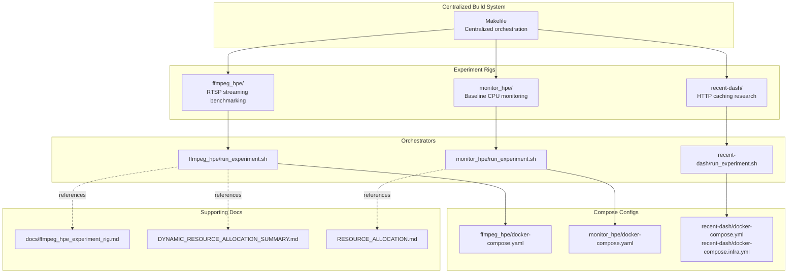
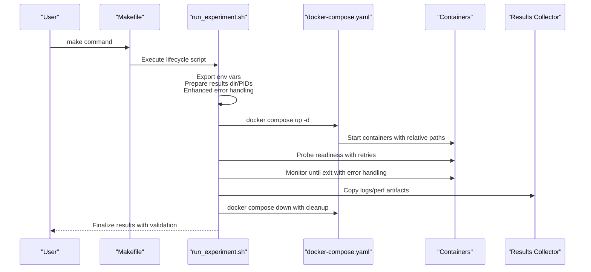
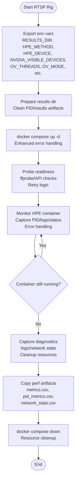
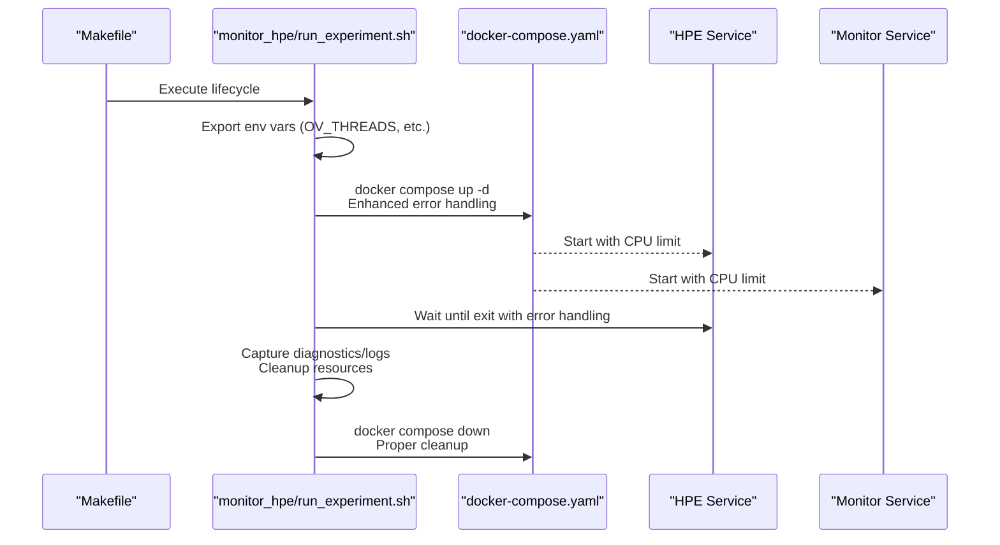
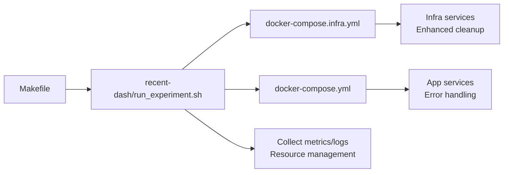
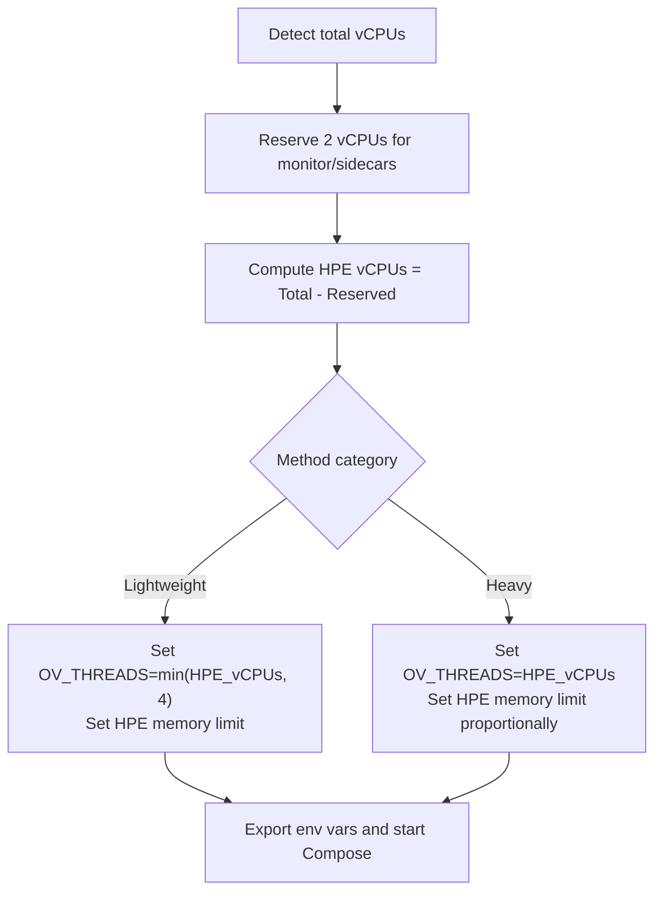
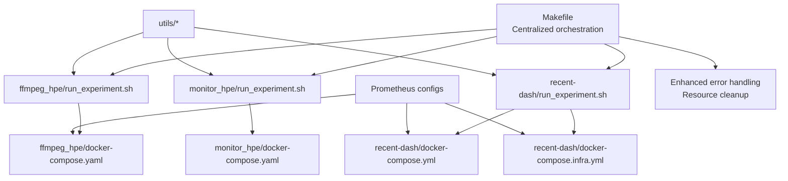
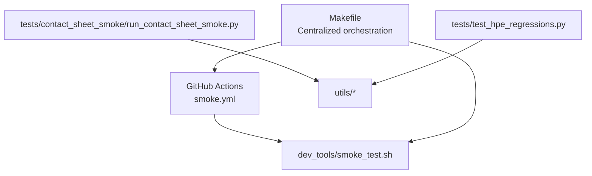
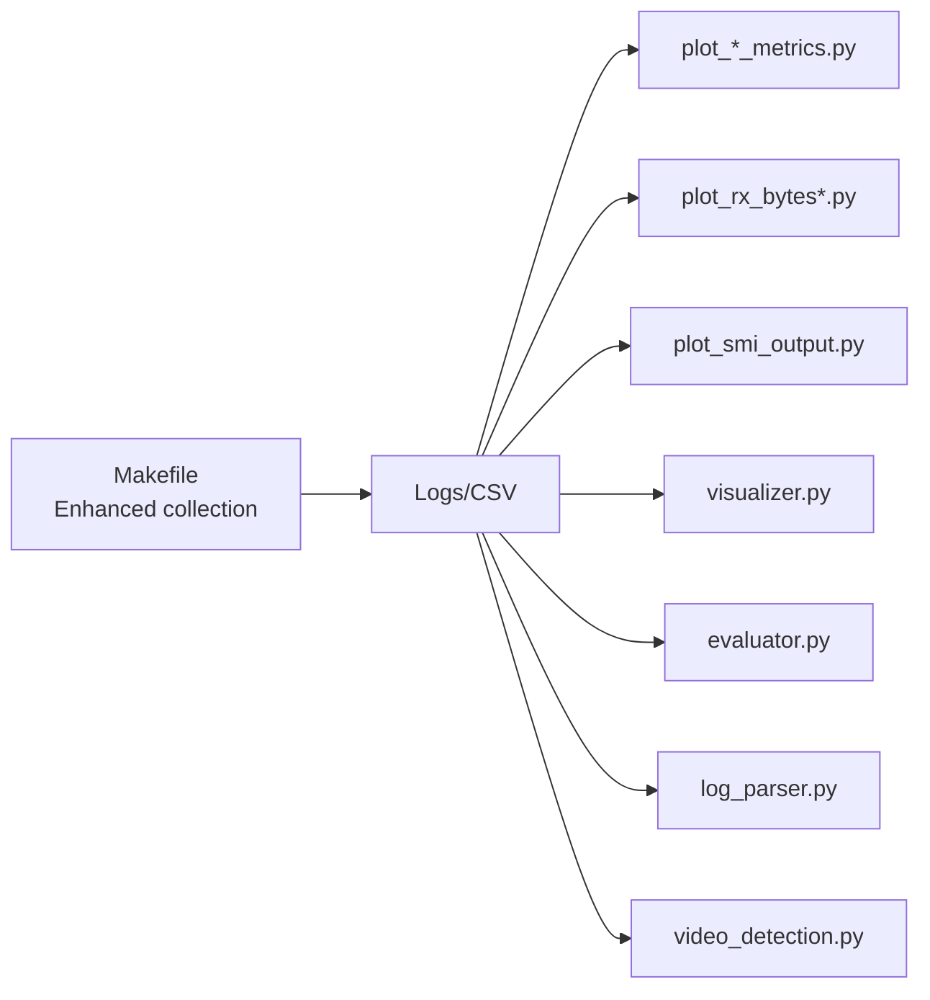

# Experiment Orchestration

<cite>
**Referenced Files in This Document**
- [Makefile](file://Makefile)
- [run_experiment.sh](file://ffmpeg_hpe/run_experiment.sh)
- [run_experiment.sh](file://monitor_hpe/run_experiment.sh)
- [run_experiment.sh](file://recent-dash/run_experiment.sh)
- [docker-compose.yaml](file://ffmpeg_hpe/docker-compose.yaml)
- [docker-compose.yaml](file://monitor_hpe/docker-compose.yaml)
- [docker-compose.yml](file://recent-dash/docker-compose.yml)
- [docker-compose.infra.yml](file://recent-dash/docker-compose.infra.yml)
- [DYNAMIC_RESOURCE_ALLOCATION.md](file://ffmpeg_hpe/DYNAMIC_RESOURCE_ALLOCATION.md)
- [DYNAMIC_RESOURCE_ALLOCATION_SUMMARY.md](file://DYNAMIC_RESOURCE_ALLOCATION_SUMMARY.md)
- [RESOURCE_ALLOCATION.md](file://monitor_hpe/RESOURCE_ALLOCATION.md)
- [ffmpeg_hpe_experiment_rig.md](file://docs/ffmpeg_hpe_experiment_rig.md)
- [COMPLETE_AUDIT_SUMMARY.md](file://COMPLETE_AUDIT_SUMMARY.md)
- [smoke_test.sh](file://dev_tools/smoke_test.sh)
- [smoke.yml](file://.github/workflows/smoke.yml)
- [test_hpe_regressions.py](file://tests/test_hpe_regressions.py)
- [run_contact_sheet_smoke.py](file://tests/contact_sheet_smoke/run_contact_sheet_smoke.py)
- [ONBOARDING.md](file://ONBOARDING.md)
- [README.md](file://README.md)
- [prometheus.yml](file://prometheus.yml)
- [prometheus.yml](file://ffmpeg_hpe/prometheus.yml)
- [prometheus.yml](file://recent-dash/prometheus.yml)
- [plot_graph.py](file://monitor_hpe/plot_graph.py)
- [plot_rx_bytes.py](file://ffmpeg_hpe/plot_rx_bytes.py)
- [plot_rx_bytes_trimmed_reset.py](file://ffmpeg_hpe/plot_rx_bytes_trimmed_reset.py)
- [plot_smi_output.py](file://Measure_gpu_dcgm/plot_smi_output.py)
- [plot_perf_metrics.py](file://Measure_plot_cpu_perf/plot_perf_metrics.py)
- [evaluator.py](file://utils/evaluator.py)
- [log_parser.py](file://utils/log_parser.py)
- [video_detection.py](file://utils/video_detection.py)
- [visualizer.py](file://utils/visualizer.py)
- [main.py](file://main.py)
- [main.py](file://monitor.py)
- [main.py](file://pose_monitor.py)
- [main.py](file://simple_test.py)
</cite>

## Update Summary
**Changes Made**
- Added new centralized Makefile for build orchestration across all experiment rigs
- Enhanced experiment reliability with improved error handling and container lifecycle management
- Updated Docker Compose configurations with relative path references for better portability
- Improved container lifecycle management with better error handling and resource cleanup

## Table of Contents
1. [Introduction](#introduction)
2. [Project Structure](#project-structure)
3. [Core Components](#core-components)
4. [Architecture Overview](#architecture-overview)
5. [Detailed Component Analysis](#detailed-component-analysis)
6. [Dependency Analysis](#dependency-analysis)
7. [Performance Considerations](#performance-considerations)
8. [Troubleshooting Guide](#troubleshooting-guide)
9. [Conclusion](#conclusion)
10. [Appendices](#appendices)

## Introduction
This document explains the experiment orchestration system used to automate, execute, and tear down performance experiments across three distinct six-container rigs. It covers:
- Automated lifecycle management: setup, execution, monitoring, diagnostics, and teardown
- Six-container rigs for:
  - Baseline CPU monitoring
  - RTSP streaming benchmarking
  - HTTP caching research
- Dynamic resource allocation that auto-detects available vCPUs and optimizes container placement
- Centralized build orchestration through Makefile for improved developer experience
- Enhanced error handling and container lifecycle management for improved reliability
- Configuration management, parameter handling, and result collection
- Guidance to customize experiments, add new test scenarios, and validate results
- Testing framework: unit tests, regression tests, and smoke testing
- Reproducibility, data collection, and analysis workflows

## Project Structure
The repository organizes experiment rigs under dedicated folders, each with a lifecycle script and a Docker Compose configuration. A new centralized Makefile provides unified build and orchestration commands across all rigs. Supporting utilities and documentation provide automation, plotting, evaluation, and CI workflows.

**Diagram sources**
- [Makefile](file://Makefile)
- [run_experiment.sh](file://ffmpeg_hpe/run_experiment.sh)
- [run_experiment.sh](file://monitor_hpe/run_experiment.sh)
- [run_experiment.sh](file://recent-dash/run_experiment.sh)
- [docker-compose.yaml](file://ffmpeg_hpe/docker-compose.yaml)
- [docker-compose.yaml](file://monitor_hpe/docker-compose.yaml)
- [docker-compose.yml](file://recent-dash/docker-compose.yml)
- [docker-compose.infra.yml](file://recent-dash/docker-compose.infra.yml)
- [ffmpeg_hpe_experiment_rig.md](file://docs/ffmpeg_hpe_experiment_rig.md)
- [DYNAMIC_RESOURCE_ALLOCATION_SUMMARY.md](file://DYNAMIC_RESOURCE_ALLOCATION_SUMMARY.md)
- [RESOURCE_ALLOCATION.md](file://monitor_hpe/RESOURCE_ALLOCATION.md)

**Section sources**
- [ONBOARDING.md:88-113](file://ONBOARDING.md#L88-L113)
- [README.md](file://README.md)
- [Makefile](file://Makefile)

## Core Components
- Centralized Makefile: Provides unified build and orchestration commands for all experiment rigs
- Lifecycle orchestrators: Each rig provides a single entry-point script that manages the full lifecycle
- Container stacks: Docker Compose defines six-container setups per rig with relative path configurations
- Dynamic resource allocation: Scripts auto-detect vCPUs and distribute resources between HPE and monitoring/sidecar containers
- Enhanced error handling: Improved container lifecycle management with better error propagation and cleanup
- Configuration precedence: Scripts export environment variables that override Compose defaults
- Diagnostics and result collection: Scripts capture logs, container states, and performance artifacts
- CI smoke tests: GitHub Actions validate basic functionality across environments

Key lifecycle stages implemented in each rig's script:
- Prepare results directories and PID tracking
- Export environment variables and stop/remove existing containers
- Start containers in detached mode with enhanced error handling
- Probe readiness and wait for completion
- Capture diagnostics and collect performance artifacts
- Validate exit status and finalize results with proper cleanup

**Section sources**
- [run_experiment.sh:108-156](file://ffmpeg_hpe/run_experiment.sh#L108-L156)
- [run_experiment.sh:332-405](file://ffmpeg_hpe/run_experiment.sh#L332-L405)
- [run_experiment.sh:108-156](file://monitor_hpe/run_experiment.sh#L108-L156)
- [run_experiment.sh](file://recent-dash/run_experiment.sh)
- [DYNAMIC_RESOURCE_ALLOCATION_SUMMARY.md:63-86](file://DYNAMIC_RESOURCE_ALLOCATION_SUMMARY.md#L63-L86)
- [RESOURCE_ALLOCATION.md:73-96](file://monitor_hpe/RESOURCE_ALLOCATION.md#L73-L96)
- [ffmpeg_hpe_experiment_rig.md:29-34](file://docs/ffmpeg_hpe_experiment_rig.md#L29-L34)
- [Makefile](file://Makefile)

## Architecture Overview
The rigs share a common pattern enhanced by centralized orchestration:
- A centralized Makefile provides unified commands for building, running, and cleaning all experiment rigs
- Individual lifecycle scripts set environment variables and start Docker Compose stacks with improved error handling
- Compose files define service roles, resource limits, and optional GPU visibility with relative path configurations
- Monitoring and tracing services capture runtime metrics and network statistics
- The HPE service runs inference workloads configured by method/device parameters
- Enhanced error handling ensures proper cleanup and resource management
- On completion, the script captures diagnostics and copies artifacts to a results directory

**Diagram sources**
- [Makefile](file://Makefile)
- [run_experiment.sh:108-156](file://ffmpeg_hpe/run_experiment.sh#L108-L156)
- [run_experiment.sh:332-405](file://ffmpeg_hpe/run_experiment.sh#L332-L405)
- [run_experiment.sh:108-156](file://monitor_hpe/run_experiment.sh#L108-L156)
- [docker-compose.yaml](file://ffmpeg_hpe/docker-compose.yaml)
- [docker-compose.yaml](file://monitor_hpe/docker-compose.yaml)
- [docker-compose.yml](file://recent-dash/docker-compose.yml)

## Detailed Component Analysis

### Centralized Build Orchestration (Makefile)
Purpose: Unified build and orchestration system for all experiment rigs with enhanced reliability.

Key features:
- Single command interface for building, running, and cleaning all experiment rigs
- Consistent error handling and logging across all operations
- Support for parallel builds and coordinated cleanup
- Enhanced container lifecycle management with proper resource cleanup
- Relative path handling for improved portability across environments

Build targets include:
- `build`: Builds all Docker images for experiment rigs
- `up`: Starts all experiment rigs with proper initialization
- `down`: Stops and removes all containers with cleanup
- `clean`: Removes all built images and cached data
- `test`: Runs smoke tests and validation checks

**Section sources**
- [Makefile](file://Makefile)

### RTSP Streaming Benchmarking Rig (ffmpeg_hpe)
Purpose: Full-stack RTSP streaming benchmarking with integrated BPF tracing and GPU metrics.

Lifecycle:
- Prepares results directory, cleans PID files, ensures empty results artifacts
- Exports environment variables (method, device, GPU visibility, threads)
- Stops/removes existing containers and starts new ones detached with enhanced error handling
- Waits briefly, checks container status, and probes readiness
- Captures HPE PID, monitors container status, and collects diagnostics on exit
- Copies performance metrics and finalizes results with proper cleanup

Dynamic resource allocation:
- Detects total vCPUs and reserves 2 for sidecars/monitoring
- Computes HPE vCPUs and sets OpenVINO thread count and memory limits per method

Configuration precedence:
- Script exports variables overriding Compose defaults
- Compose references environment variables for resource limits and GPU visibility

**Diagram sources**
- [run_experiment.sh:108-156](file://ffmpeg_hpe/run_experiment.sh#L108-L156)
- [run_experiment.sh:332-405](file://ffmpeg_hpe/run_experiment.sh#L332-L405)
- [DYNAMIC_RESOURCE_ALLOCATION_SUMMARY.md:63-86](file://DYNAMIC_RESOURCE_ALLOCATION_SUMMARY.md#L63-L86)
- [ffmpeg_hpe_experiment_rig.md:29-34](file://docs/ffmpeg_hpe_experiment_rig.md#L29-L34)

**Section sources**
- [run_experiment.sh:108-156](file://ffmpeg_hpe/run_experiment.sh#L108-L156)
- [run_experiment.sh:332-405](file://ffmpeg_hpe/run_experiment.sh#L332-L405)
- [DYNAMIC_RESOURCE_ALLOCATION_SUMMARY.md:63-86](file://DYNAMIC_RESOURCE_ALLOCATION_SUMMARY.md#L63-L86)
- [ffmpeg_hpe_experiment_rig.md:29-34](file://docs/ffmpeg_hpe_experiment_rig.md#L29-L34)
- [COMPLETE_AUDIT_SUMMARY.md:228-266](file://COMPLETE_AUDIT_SUMMARY.md#L228-L266)

### Baseline CPU Monitoring Rig (monitor_hpe)
Purpose: CPU-only baseline HPE inference without streaming, optimized for minimal overhead.

Lifecycle:
- Mirrors RTSP rig lifecycle with results preparation, container start, readiness checks, and diagnostics capture
- Uses method-specific resource distribution documented for 8 vCPU VMs
- Enhanced error handling ensures proper cleanup and resource management

Dynamic resource allocation:
- Reserves 2 vCPUs for monitoring and sidecars
- Allocates remaining vCPUs to HPE service with method-aware thread and memory settings

**Diagram sources**
- [Makefile](file://Makefile)
- [run_experiment.sh:108-156](file://monitor_hpe/run_experiment.sh#L108-L156)
- [RESOURCE_ALLOCATION.md:73-96](file://monitor_hpe/RESOURCE_ALLOCATION.md#L73-L96)

**Section sources**
- [run_experiment.sh:108-156](file://monitor_hpe/run_experiment.sh#L108-L156)
- [RESOURCE_ALLOCATION.md:73-96](file://monitor_hpe/RESOURCE_ALLOCATION.md#L73-L96)

### HTTP Caching Research Rig (recent-dash)
Purpose: HTTP caching and DASH experimentation with infrastructure services.

Lifecycle:
- Starts containers defined in compose files for HTTP client/proxy/server and Prometheus
- Runs experiment and collects metrics for analysis
- Enhanced error handling ensures proper cleanup of infrastructure services

**Diagram sources**
- [Makefile](file://Makefile)
- [run_experiment.sh](file://recent-dash/run_experiment.sh)
- [docker-compose.yml](file://recent-dash/docker-compose.yml)
- [docker-compose.infra.yml](file://recent-dash/docker-compose.infra.yml)

**Section sources**
- [run_experiment.sh](file://recent-dash/run_experiment.sh)
- [docker-compose.yml](file://recent-dash/docker-compose.yml)
- [docker-compose.infra.yml](file://recent-dash/docker-compose.infra.yml)

### Dynamic Resource Allocation
Both rigs implement a shared strategy:
- Detect total vCPUs and reserve a fixed number for monitoring/sidecars
- Compute HPE vCPUs and set OpenVINO thread counts and memory limits per method
- Provide scaling examples and validation checklist

**Diagram sources**
- [DYNAMIC_RESOURCE_ALLOCATION_SUMMARY.md:63-86](file://DYNAMIC_RESOURCE_ALLOCATION_SUMMARY.md#L63-L86)
- [RESOURCE_ALLOCATION.md:73-96](file://monitor_hpe/RESOURCE_ALLOCATION.md#L73-L96)

**Section sources**
- [DYNAMIC_RESOURCE_ALLOCATION_SUMMARY.md:63-86](file://DYNAMIC_RESOURCE_ALLOCATION_SUMMARY.md#L63-L86)
- [RESOURCE_ALLOCATION.md:73-96](file://monitor_hpe/RESOURCE_ALLOCATION.md#L73-L96)

### Configuration Management and Parameter Handling
- Environment variables exported by the lifecycle scripts take precedence over Compose defaults
- Variables include HPE method/device selection, GPU visibility, OpenVINO tuning, and results directory
- Compose files reference these variables for CPU/memory/GPU limits and service healthchecks
- Enhanced error handling ensures proper validation of configuration parameters
- Relative path configurations improve portability across different deployment environments

**Section sources**
- [ffmpeg_hpe_experiment_rig.md:29-34](file://docs/ffmpeg_hpe_experiment_rig.md#L29-L34)
- [docker-compose.yaml](file://ffmpeg_hpe/docker-compose.yaml)
- [docker-compose.yaml](file://monitor_hpe/docker-compose.yaml)

### Result Collection and Artifacts
- Logs and metrics are copied into a timestamped results directory
- Scripts capture container logs, performance metrics CSVs, and network statistics
- Exit codes are recorded for post-run validation
- Enhanced error handling ensures artifacts are collected even during failures
- Proper cleanup prevents resource leaks and maintains system hygiene

**Section sources**
- [run_experiment.sh:394-405](file://ffmpeg_hpe/run_experiment.sh#L394-L405)
- [run_experiment.sh:108-156](file://monitor_hpe/run_experiment.sh#L108-L156)

## Dependency Analysis
The rigs depend on Docker Compose configurations and supporting utilities. The centralized Makefile provides unified orchestration, while individual lifecycle scripts manage dependencies by exporting environment variables that Compose consumes.

**Diagram sources**
- [Makefile](file://Makefile)
- [run_experiment.sh](file://ffmpeg_hpe/run_experiment.sh)
- [run_experiment.sh](file://monitor_hpe/run_experiment.sh)
- [run_experiment.sh](file://recent-dash/run_experiment.sh)
- [docker-compose.yaml](file://ffmpeg_hpe/docker-compose.yaml)
- [docker-compose.yaml](file://monitor_hpe/docker-compose.yaml)
- [docker-compose.yml](file://recent-dash/docker-compose.yml)
- [docker-compose.infra.yml](file://recent-dash/docker-compose.infra.yml)
- [prometheus.yml](file://prometheus.yml)
- [prometheus.yml](file://ffmpeg_hpe/prometheus.yml)
- [prometheus.yml](file://recent-dash/prometheus.yml)

**Section sources**
- [COMPLETE_AUDIT_SUMMARY.md:228-266](file://COMPLETE_AUDIT_SUMMARY.md#L228-L266)
- [prometheus.yml](file://prometheus.yml)
- [prometheus.yml](file://ffmpeg_hpe/prometheus.yml)
- [prometheus.yml](file://recent-dash/prometheus.yml)

## Performance Considerations
- Resource limits are defined per service in Compose to prevent contention
- Healthcheck intervals balance responsiveness with overhead
- Dynamic allocation improves scaling efficiency across VM sizes
- Monitoring services minimize interference while capturing essential signals
- Enhanced error handling reduces downtime and improves system reliability
- Centralized build orchestration simplifies deployment and maintenance
- Relative path configurations improve portability and reduce configuration errors

**Section sources**
- [COMPLETE_AUDIT_SUMMARY.md:228-266](file://COMPLETE_AUDIT_SUMMARY.md#L228-L266)
- [DYNAMIC_RESOURCE_ALLOCATION_SUMMARY.md:99-109](file://DYNAMIC_RESOURCE_ALLOCATION_SUMMARY.md#L99-L109)
- [Makefile](file://Makefile)

## Troubleshooting Guide
Common issues and remedies:
- Containers not starting: verify environment variables exported by the lifecycle script and Compose overrides
- Missing PID files: ensure HPE container is running and main process is detected
- Non-zero exit codes: inspect captured diagnostics and logs for root cause
- Resource contention: adjust CPU/memory limits and re-run with reduced concurrency
- Build failures: use Makefile targets for consistent builds across all rigs
- Cleanup issues: rely on centralized cleanup commands instead of manual container management

Enhanced validation checklist:
- Confirm vCPU detection and minimum thresholds
- Verify env vars exported before compose up
- Ensure Compose references correct variable names
- Defaults prevent breakage if variables are unset
- CLI interface remains unchanged
- Results collection and documentation remain intact
- Error handling ensures proper cleanup and resource management
- Centralized orchestration provides consistent behavior across all rigs

**Section sources**
- [run_experiment.sh:332-405](file://ffmpeg_hpe/run_experiment.sh#L332-L405)
- [DYNAMIC_RESOURCE_ALLOCATION_SUMMARY.md:168-180](file://DYNAMIC_RESOURCE_ALLOCATION_SUMMARY.md#L168-L180)
- [Makefile](file://Makefile)

## Conclusion
The experiment orchestration system provides a robust, automated pipeline for running controlled performance experiments across diverse scenarios. The addition of centralized build orchestration through the Makefile, enhanced error handling, and improved container lifecycle management significantly improves reliability and developer experience. By unifying lifecycle management, dynamic resource allocation, and result collection, it enables reproducible, scalable, and maintainable experimentation with better error handling and resource management.

## Appendices

### A. Experiment Customization and Adding New Scenarios
- Add a new rig by creating a lifecycle script and a Compose configuration
- Define environment variables for method/device selection and resource limits
- Integrate monitoring/tracing services as needed
- Extend CI workflows to include smoke tests for the new scenario
- Leverage Makefile for consistent build and orchestration across all rigs

**Section sources**
- [ONBOARDING.md:88-113](file://ONBOARDING.md#L88-L113)
- [Makefile](file://Makefile)

### B. Testing Framework
- Smoke tests: run via CI to validate basic functionality on CPU and GPU
- Regression tests: automated checks for performance regressions
- Contact sheet smoke tests: batch image inference across methods with visual output
- Enhanced error handling ensures reliable test execution and cleanup

**Diagram sources**
- [smoke.yml](file://.github/workflows/smoke.yml)
- [smoke_test.sh](file://dev_tools/smoke_test.sh)
- [run_contact_sheet_smoke.py](file://tests/contact_sheet_smoke/run_contact_sheet_smoke.py)
- [test_hpe_regressions.py](file://tests/test_hpe_regressions.py)
- [evaluator.py](file://utils/evaluator.py)
- [Makefile](file://Makefile)

**Section sources**
- [.github/workflows/smoke.yml:1-37](file://.github/workflows/smoke.yml#L1-L37)
- [tests/contact_sheet_smoke/run_contact_sheet_smoke.py:1-58](file://tests/contact_sheet_smoke/run_contact_sheet_smoke.py#L1-L58)
- [tests/test_hpe_regressions.py](file://tests/test_hpe_regressions.py)

### C. Data Collection and Analysis Workflows
- Plotting utilities for CPU, GPU, and network metrics
- Evaluation and visualization helpers for inference outputs
- Log parsing for structured analysis
- Enhanced artifact collection ensures comprehensive data capture

**Diagram sources**
- [plot_graph.py](file://monitor_hpe/plot_graph.py)
- [plot_rx_bytes.py](file://ffmpeg_hpe/plot_rx_bytes.py)
- [plot_rx_bytes_trimmed_reset.py](file://ffmpeg_hpe/plot_rx_bytes_trimmed_reset.py)
- [plot_smi_output.py](file://Measure_gpu_dcgm/plot_smi_output.py)
- [plot_perf_metrics.py](file://Measure_plot_cpu_perf/plot_perf_metrics.py)
- [visualizer.py](file://utils/visualizer.py)
- [evaluator.py](file://utils/evaluator.py)
- [log_parser.py](file://utils/log_parser.py)
- [video_detection.py](file://utils/video_detection.py)
- [Makefile](file://Makefile)

**Section sources**
- [plot_graph.py](file://monitor_hpe/plot_graph.py)
- [plot_rx_bytes.py](file://ffmpeg_hpe/plot_rx_bytes.py)
- [plot_rx_bytes_trimmed_reset.py](file://ffmpeg_hpe/plot_rx_bytes_trimmed_reset.py)
- [plot_smi_output.py](file://Measure_gpu_dcgm/plot_smi_output.py)
- [plot_perf_metrics.py](file://Measure_plot_cpu_perf/plot_perf_metrics.py)
- [visualizer.py](file://utils/visualizer.py)
- [evaluator.py](file://utils/evaluator.py)
- [log_parser.py](file://utils/log_parser.py)
- [video_detection.py](file://utils/video_detection.py)

### D. Reproducibility and Experiment Records
- Timestamped results directories isolate runs
- Captured logs and metrics enable post-hoc analysis
- CI smoke tests ensure consistent baseline behavior
- Enhanced error handling ensures reliable reproduction
- Centralized orchestration provides consistent experimental conditions

**Section sources**
- [run_experiment.sh:108-156](file://ffmpeg_hpe/run_experiment.sh#L108-L156)
- [run_experiment.sh:108-156](file://monitor_hpe/run_experiment.sh#L108-L156)
- [smoke.yml:1-37](file://.github/workflows/smoke.yml#L1-L37)
- [Makefile](file://Makefile)