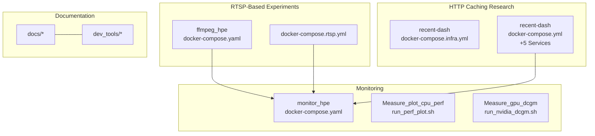
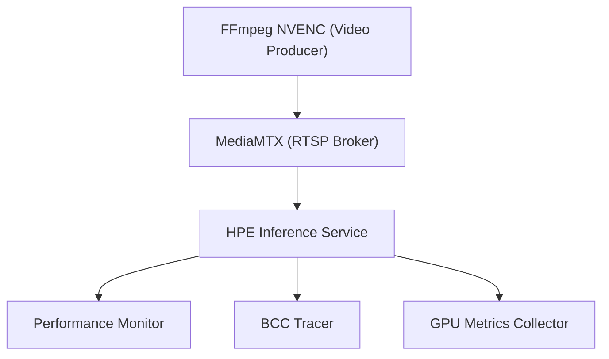
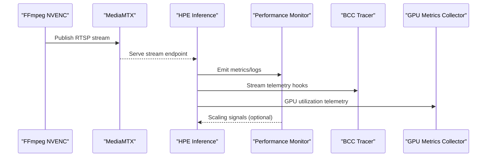
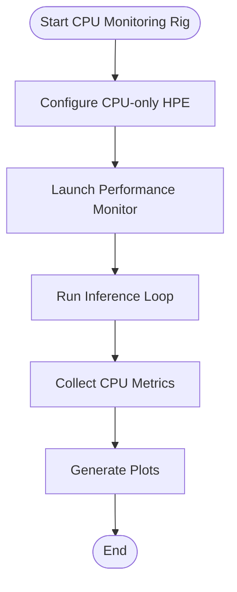
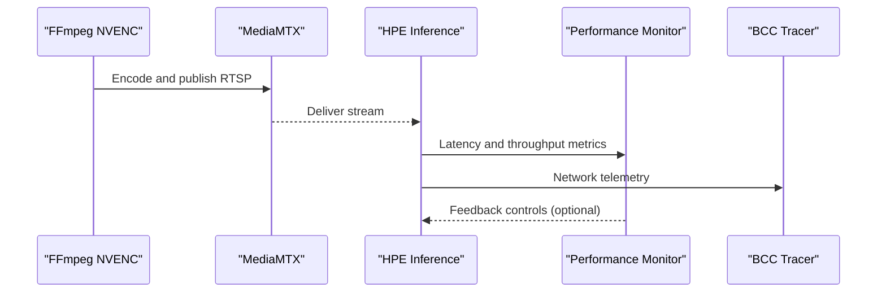
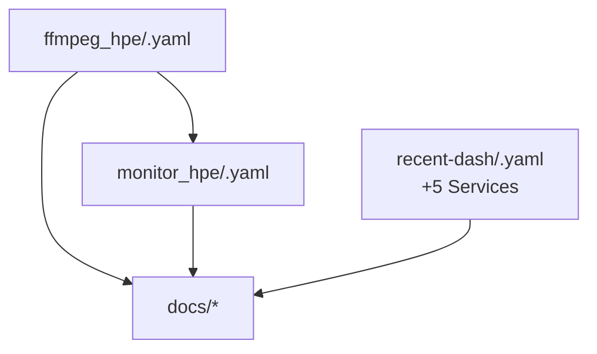

# Experiment Types and Rigs

<cite>
**Referenced Files in This Document**
- [docker-compose.yaml](file://docker-compose.yaml)
- [docker-compose.rtsp.yml](file://docker-compose.rtsp.yml)
- [docker-compose.perf.yml](file://monitor_hpe/docker-compose.perf.yml)
- [docker-compose.yaml](file://monitor_hpe/docker-compose.yaml)
- [docker-compose.infra.yml](file://recent-dash/docker-compose.infra.yml)
- [docker-compose.yml](file://recent-dash/docker-compose.yml)
- [README.md](file://README.md)
- [README.md](file://dev_tools/README.md)
- [README.md](file://docs/bcc-bpf-tracing.md)
- [README.md](file://docs/docker-services.md)
- [README.md](file://docs/experiment-scripts.md)
- [README.md](file://docs/project-architecture-diagram.md)
- [README.md](file://docs/plotting-analysis.md)
- [README.md](file://docs/ffmpeg_hpe_experiment_rig.md)
- [README.md](file://docs/hpe-methods.md)
- [README.md](file://docs/ebpf-tracing-diagram.md)
- [README.md](file://docs/session-report-2026-05-06.md)
- [run_experiment.sh](file://ffmpeg_hpe/run_experiment.sh)
- [run_experiment_bcc.sh](file://ffmpeg_hpe/run_experiment_bcc.sh)
- [run_perf_plot.sh](file://Measure_plot_cpu_perf/run_perf_plot.sh)
- [run_nvidia_dcgm.sh](file://Measure_gpu_dcgm/run_nvidia_dcgm.sh)
- [trace_video_traffic.sh](file://ffmpeg_hpe/bpftrace-tracer/trace_video_traffic.sh)
- [bcc_rx_bytes.py](file://ffmpeg_hpe/bpftrace-tracer/bcc_rx_bytes.py)
- [bcc_tx_bytes.py](file://ffmpeg_hpe/bpftrace-tracer/bcc_tx_bytes.py)
- [HTTP-Client.launch.sh](file://recent-dash/HTTP-Client.launch.sh)
- [HTTP-Proxy.launch.sh](file://recent-dash/HTTP-Proxy.launch.sh)
- [HTTP-Server.launch.sh](file://recent-dash/HTTP-Server.launch.sh)
- [investigate_proxy_cache.sh](file://recent-dash/investigate_proxy_cache.sh)
- [README.md](file://recent-dash/README.md)
</cite>

## Update Summary
**Changes Made**
- Enhanced HTTP caching research rig documentation with comprehensive five-service architecture details
- Added detailed service descriptions, build instructions, and run lifecycle explanations
- Updated troubleshooting guidance for DASH/HTTP caching experiments
- Expanded performance monitoring and tracing capabilities documentation

## Table of Contents
1. [Introduction](#introduction)
2. [Project Structure](#project-structure)
3. [Core Components](#core-components)
4. [Architecture Overview](#architecture-overview)
5. [Detailed Component Analysis](#detailed-component-analysis)
6. [Dependency Analysis](#dependency-analysis)
7. [Performance Considerations](#performance-considerations)
8. [Troubleshooting Guide](#troubleshooting-guide)
9. [Conclusion](#conclusion)
10. [Appendices](#appendices)

## Introduction
This document explains the experiment types and containerized rigs used in the HPE (Human Pose Estimation) benchmarking system. It covers:
- The six-container experiment architecture: RTSP broker (MediaMTX), video producer (FFmpeg NVENC), HPE inference service, performance monitor, BCC tracer, and GPU metrics collector
- Baseline CPU monitoring rig for isolated performance analysis
- RTSP streaming benchmarking rig for end-to-end latency measurement
- HTTP caching research rig for web-based streaming optimization with comprehensive five-service architecture
- Container orchestration strategy, inter-container communication patterns, and resource allocation
- Guidance for selecting experiment types and troubleshooting rig-specific issues

## Project Structure
The repository organizes experiments and rigs across several top-level areas:
- ffmpeg_hpe: RTSP-based HPE experiments, tracing, and metrics collection
- monitor_hpe: CPU/GPU performance monitoring and scaling
- recent-dash: HTTP caching and proxy research infrastructure with comprehensive DASH/HTTP adaptive bitrate caching experiment rig
- dev_tools: development utilities and server demos
- docs: conceptual and procedural documentation
- measure_*: auxiliary measurement scripts for CPU and GPU metrics



**Diagram sources**
- [docker-compose.yaml](file://ffmpeg_hpe/docker-compose.yaml)
- [docker-compose.rtsp.yml](file://docker-compose.rtsp.yml)
- [docker-compose.yaml](file://monitor_hpe/docker-compose.yaml)
- [docker-compose.infra.yml](file://recent-dash/docker-compose.infra.yml)
- [docker-compose.yml](file://recent-dash/docker-compose.yml)

**Section sources**
- [README.md](file://README.md)
- [README.md](file://docs/docker-services.md)

## Core Components
The benchmarking system orchestrates containers for:
- RTSP broker (MediaMTX): streams video feeds to consumers
- Video producer (FFmpeg NVENC): encodes and publishes RTSP streams
- HPE inference service: performs pose estimation on incoming video
- Performance monitor: tracks CPU/GPU metrics and process performance
- BCC tracer: captures network-level packet statistics for video traffic
- GPU metrics collector: gathers NVIDIA DCGM telemetry

Rig-specific compositions are defined via docker-compose files and orchestrated with launch scripts.

**Section sources**
- [README.md](file://docs/ffmpeg_hpe_experiment_rig.md)
- [README.md](file://docs/hpe-methods.md)
- [README.md](file://docs/bcc-bpf-tracing.md)

## Architecture Overview
The six-container architecture coordinates around MediaMTX as the central RTSP hub. FFmpeg NVENC produces encoded streams, HPE inference consumes those streams, and monitoring/tracing containers collect performance and network telemetry.



**Diagram sources**
- [docker-compose.yaml](file://ffmpeg_hpe/docker-compose.yaml)
- [docker-compose.rtsp.yml](file://docker-compose.rtsp.yml)
- [run_experiment.sh](file://ffmpeg_hpe/run_experiment.sh)
- [run_experiment_bcc.sh](file://ffmpeg_hpe/run_experiment_bcc.sh)

## Detailed Component Analysis

### Six-Container Experiment Rig
This rig integrates MediaMTX, FFmpeg NVENC, HPE inference, performance monitor, BCC tracer, and GPU metrics collector. Orchestration is handled by docker-compose with explicit service definitions and inter-service links.

Key orchestration elements:
- Services: media server, producer, inference, monitor, tracer, metrics
- Networks: internal bridge networks for service discovery and isolation
- Volumes: shared directories for logs, traces, and plots
- Ports: RTSP port exposure and optional HTTP metrics endpoints

Inter-container communication:
- MediaMTX exposes RTSP endpoints consumed by HPE inference
- HPE inference emits metrics and logs consumed by monitor and tracer
- Tracer and metrics containers subscribe to host/network namespaces for visibility

Resource allocation:
- CPU and memory limits per service to prevent contention
- GPU device pass-through for inference acceleration
- Dedicated CPU cores for producer and inference for low-latency guarantees



**Diagram sources**
- [docker-compose.yaml](file://ffmpeg_hpe/docker-compose.yaml)
- [docker-compose.rtsp.yml](file://docker-compose.rtsp.yml)
- [run_experiment.sh](file://ffmpeg_hpe/run_experiment.sh)

**Section sources**
- [docker-compose.yaml](file://ffmpeg_hpe/docker-compose.yaml)
- [docker-compose.rtsp.yml](file://docker-compose.rtsp.yml)
- [run_experiment.sh](file://ffmpeg_hpe/run_experiment.sh)
- [run_experiment_bcc.sh](file://ffmpeg_hpe/run_experiment_bcc.sh)

### Baseline CPU Monitoring Rig
Purpose: isolate and quantify CPU overhead of HPE inference under controlled conditions. This rig focuses on CPU metrics and process behavior without GPU acceleration or external streaming.

Components:
- CPU performance monitor container
- HPE inference service configured for CPU-only mode
- Optional lightweight video source for sustained load

Orchestration:
- docker-compose.yaml defines CPU-focused services and resource constraints
- Launch script initializes monitoring and inference with deterministic profiles



**Diagram sources**
- [docker-compose.yaml](file://monitor_hpe/docker-compose.yaml)
- [run_perf_plot.sh](file://Measure_plot_cpu_perf/run_perf_plot.sh)

**Section sources**
- [docker-compose.yaml](file://monitor_hpe/docker-compose.yaml)
- [docker-compose.perf.yml](file://monitor_hpe/docker-compose.perf.yml)
- [run_perf_plot.sh](file://Measure_plot_cpu_perf/run_perf_plot.sh)

### RTSP Streaming Benchmarking Rig
Purpose: measure end-to-end latency and throughput across the RTSP pipeline. This rig validates MediaMTX performance, FFmpeg encoding characteristics, and HPE inference latency.

Components:
- MediaMTX for RTSP distribution
- FFmpeg NVENC producer with configurable resolution/FPS
- HPE inference consuming RTSP streams
- Performance monitor and BCC tracer for latency and bandwidth analysis

Orchestration:
- docker-compose.rtsp.yml sets up the streaming chain
- Scripts coordinate producer timing, stream quality, and measurement windows



**Diagram sources**
- [docker-compose.rtsp.yml](file://docker-compose.rtsp.yml)
- [docker-compose.yaml](file://ffmpeg_hpe/docker-compose.yaml)
- [run_experiment.sh](file://ffmpeg_hpe/run_experiment.sh)

**Section sources**
- [docker-compose.rtsp.yml](file://docker-compose.rtsp.yml)
- [run_experiment.sh](file://ffmpeg_hpe/run_experiment.sh)

### HTTP Caching Research Rig
Purpose: evaluate HTTP caching strategies for web-based streaming delivery. This rig simulates client-server-proxy interactions and measures cache hit rates, latency, and bandwidth savings using a comprehensive five-service architecture.

#### Five-Service Architecture
The recent-dash rig implements a sophisticated five-service architecture designed specifically for DASH/HTTP adaptive bitrate caching experiments:

**Services Overview:**
| Service | Purpose | Key Characteristics |
|---------|---------|-------------------|
| `http_server` | Origin HTTP server for DASH content | Provides DASH manifests and segmented video content |
| `http_proxy` | DASH caching/ABR proxy under measurement | Implements caching policies and adaptive bitrate algorithms |
| `http_client` | HTTP client endpoint exposing DASH manifest URL | Serves as player endpoint for VLC/media players |
| `perf_monitor` | Performance monitoring for proxy processes | Samples CPU/RSS metrics from proxy PID file |
| `trace_container` | DASH-only network traffic tracing | Captures TCP payload bytes for video streams only |

#### Build and Deployment Process
The rig follows a comprehensive build and deployment lifecycle:

**Build Phase:**
```bash
cd recent-dash
docker compose build
```

**Run Phase:**
```bash
cd recent-dash
./run_experiment.sh
```

The default run duration is 500 seconds with configurable overrides:
```bash
EXPERIMENT_DURATION_SECONDS=120 ./run_experiment.sh
```

#### Advanced Readiness Checking
The rig implements sophisticated readiness checking beyond basic container startup:

```text
http://localhost:<EXPOSED_HTTP_CLIENT_PORT>/manifest.mpd
```

Configurable readiness parameters:
- `READINESS_TIMEOUT_SECONDS`: Default 60 seconds (maximum wait)
- `READINESS_POLL_SECONDS`: Default 2 seconds (polling interval)

#### DASH-Only Network Tracing
The tracing system implements precise DASH video byte filtering:

**Trace Directions:**
| Direction | Meaning | CSV column |
|-----------|---------|------------|
| origin server `:80` -> proxy | bytes received by proxy from origin DASH server | `proxy_rx_video_bytes` |
| proxy `:80` -> client | bytes sent by proxy to DASH client/player | `proxy_tx_video_bytes` |

**Trace Configuration Defaults:**
```bash
DASH_TRACE_INTERFACE=any
TRACE_INTERVAL_MS=10
```

#### Resource Management
Comprehensive resource allocation with environment variable overrides:

| Service | CPU Limit | Memory Limit | Environment Variables |
|---------|-----------|--------------|----------------------|
| `http_server` | 0.5 | 512M | `HTTP_SERVER_CPU_LIMIT`, `HTTP_SERVER_MEMORY_LIMIT` |
| `http_proxy` | 1.0 | 1G | `HTTP_PROXY_CPU_LIMIT`, `HTTP_PROXY_MEMORY_LIMIT` |
| `http_client` | 0.5 | 512M | `HTTP_CLIENT_CPU_LIMIT`, `HTTP_CLIENT_MEMORY_LIMIT` |
| `perf_monitor` | 0.25 | 256M | `PERF_MONITOR_CPU_LIMIT`, `PERF_MONITOR_MEMORY_LIMIT` |
| `trace_container` | 0.5 | 256M | `TRACE_CONTAINER_CPU_LIMIT`, `TRACE_CONTAINER_MEMORY_LIMIT` |

#### Result Collection and Analysis
Each run generates comprehensive result artifacts:

**Result Directory Structure:**
```text
results_<label>_<cpu_model>_<timestamp>/
  container_timing.txt
  logs/
    http_server.log
    http_proxy.log
    http_client.log
    perf_monitor.log
    trace_container.log
  perf/
    perf_metrics.csv
  traces/
    trace.csv
  results.txt
```

**Key Result Files:**
- `perf/perf_metrics.csv`: Proxy CPU/RSS samples from `perf_monitor`
- `traces/trace.csv`: DASH-only proxy RX/TX TCP payload bytes
- `logs/*.log`: Container logs captured before teardown
- `container_timing.txt`: Container startup timing summary
- `results.txt`: Run metadata summary

#### Manual Playback Support
During experiments, manual playback is supported through VLC or other DASH-capable players:
```text
http://localhost:<EXPOSED_HTTP_CLIENT_PORT>/manifest.mpd
```

**Section sources**
- [README.md](file://recent-dash/README.md)
- [docker-compose.infra.yml](file://recent-dash/docker-compose.infra.yml)
- [docker-compose.yml](file://recent-dash/docker-compose.yml)
- [investigate_proxy_cache.sh](file://recent-dash/investigate_proxy_cache.sh)

## Dependency Analysis
The rigs share common patterns:
- Docker Compose orchestration across multiple stacks
- Inter-service networking via named volumes and internal DNS
- Shared scripts for launching experiments and collecting metrics
- Documentation-driven configuration and validation



**Diagram sources**
- [docker-compose.yaml](file://ffmpeg_hpe/docker-compose.yaml)
- [docker-compose.yaml](file://monitor_hpe/docker-compose.yaml)
- [docker-compose.yml](file://recent-dash/docker-compose.yml)

**Section sources**
- [README.md](file://docs/docker-services.md)
- [README.md](file://docs/experiment-scripts.md)

## Performance Considerations
- CPU monitoring rig: minimize external I/O; pin CPU cores; disable GPU to isolate compute overhead
- RTSP rig: tune producer FPS/resolution; ensure adequate buffer sizes; monitor queue depths
- HTTP caching rig: configure cache TTLs and invalidation; measure hit ratios; correlate with bandwidth reduction
- Tracing and metrics: avoid sampling bias; ensure sufficient capture duration; validate correlation between CPU/GPU metrics and inference latency
- **Updated** Recent-dash rig: optimize proxy resource allocation for DASH adaptive bitrate processing; configure trace intervals for high-throughput scenarios

## Troubleshooting Guide
Common rig-specific issues and resolutions:
- RTSP streaming stalls or latency spikes:
  - Verify MediaMTX configuration and network connectivity
  - Confirm producer encoding parameters match consumer expectations
  - Inspect BCC tracer logs for packet loss or retransmissions
- HPE inference performance degradation:
  - Check GPU utilization and thermal throttling
  - Adjust batch sizes and threading parameters
  - Validate model precision and hardware compatibility
- CPU monitoring anomalies:
  - Ensure CPU-only mode is enabled for the inference service
  - Review process scheduling and affinity settings
- HTTP caching inefficiencies:
  - Inspect cache headers and vary-by rules
  - Analyze request patterns and cache warming strategies
  - Validate proxy logs for cache misses and errors
  - **Updated** Recent-dash rig: verify DASH manifest accessibility via readiness checks; confirm trace container privileges for packet capture; validate proxy PID detection for performance monitoring

**Section sources**
- [README.md](file://docs/bcc-bpf-tracing.md)
- [README.md](file://docs/plotting-analysis.md)
- [README.md](file://docs/hpe-methods.md)
- [README.md](file://recent-dash/README.md)

## Conclusion
The HPE benchmarking system provides four complementary rigs:
- Six-container RTSP pipeline for integrated latency and throughput analysis
- Baseline CPU monitoring rig for isolated compute profiling
- RTSP streaming benchmarking rig for end-to-end pipeline validation
- HTTP caching research rig with comprehensive five-service architecture for web delivery optimization

Each rig leverages Docker Compose for orchestration, shared scripts for automation, and comprehensive documentation for reproducibility. The recent-dash rig represents a significant enhancement with detailed service architectures, advanced tracing capabilities, and sophisticated resource management. Select the rig aligned with your use case and adjust resource allocation and parameters according to workload characteristics.

## Appendices

### Container Orchestration Strategy
- Use separate docker-compose files per rig to maintain modularity
- Leverage named networks for service discovery while isolating sensitive components
- Persist logs and plots via volumes for post-experiment analysis
- Parameterize resource limits and environment variables for reproducible runs
- **Updated** Implement readiness probes for HTTP-based services beyond basic container startup

**Section sources**
- [README.md](file://docs/docker-services.md)

### Inter-Container Communication Patterns
- RTSP: producer publishes to MediaMTX; consumers connect via RTSP URLs
- HTTP: client requests via proxy; server responds with cacheable headers
- Metrics: inference service emits structured logs; monitors scrape and aggregate
- **Updated** DASH: proxy maintains cache state; client consumes adaptive bitrate segments; trace container monitors specific TCP payload streams

**Section sources**
- [README.md](file://docs/project-architecture-diagram.md)

### Resource Allocation Guidelines
- CPU: allocate dedicated cores for producer and inference; cap memory to prevent swapping
- GPU: enable device passthrough; set compute mode to exclusive process for isolation
- Storage: mount persistent volumes for logs and plots; ensure adequate disk throughput
- Networking: reserve ports for MediaMTX and metrics; configure firewall rules if needed
- **Updated** HTTP caching: provision larger memory limits for proxy services; configure trace container with appropriate CPU allocation for tcpdump processing

**Section sources**
- [README.md](file://docs/ffmpeg_hpe_experiment_rig.md)
- [README.md](file://recent-dash/README.md)