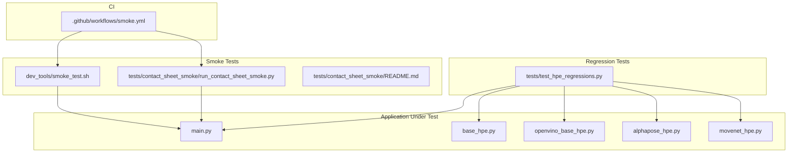
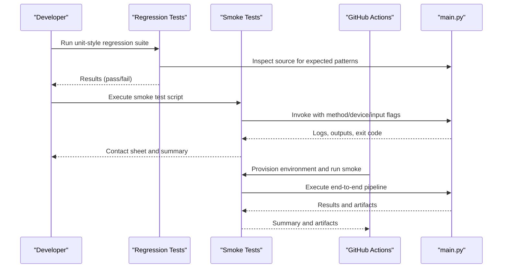
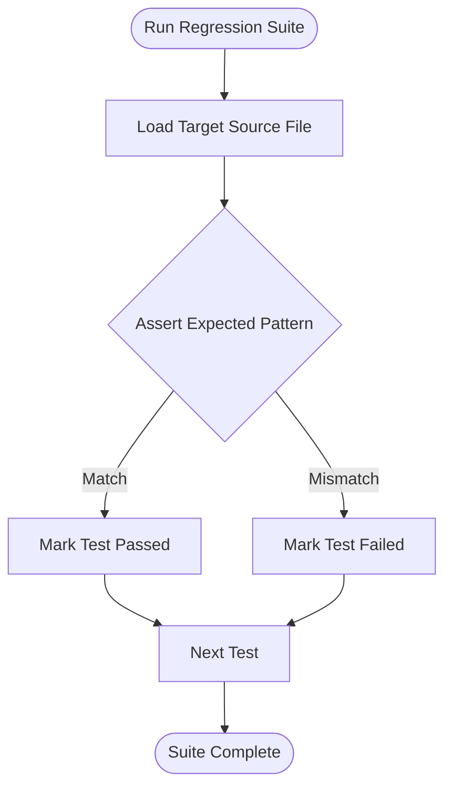
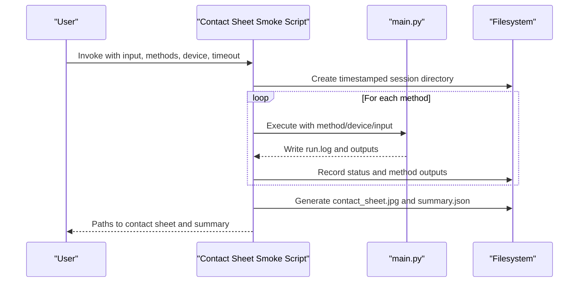
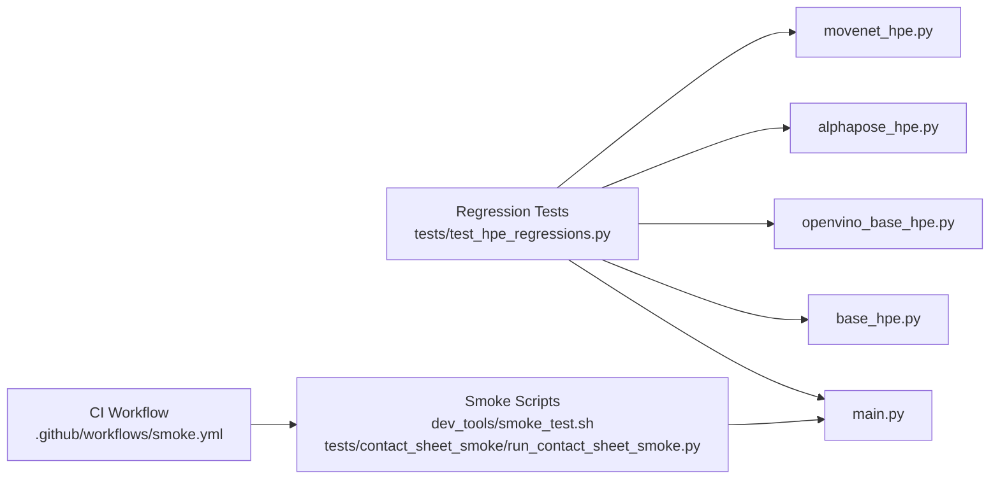

# Testing and Validation Framework

<cite>
**Referenced Files in This Document**
- [tests/test_hpe_regressions.py](file://tests/test_hpe_regressions.py)
- [tests/contact_sheet_smoke/run_contact_sheet_smoke.py](file://tests/contact_sheet_smoke/run_contact_sheet_smoke.py)
- [tests/contact_sheet_smoke/README.md](file://tests/contact_sheet_smoke/README.md)
- [dev_tools/smoke_test.sh](file://dev_tools/smoke_test.sh)
- [.github/workflows/smoke.yml](file://.github/workflows/smoke.yml)
- [simple_test.py](file://simple_test.py)
- [main.py](file://main.py)
- [base_hpe.py](file://base_hpe.py)
- [openvino_base_hpe.py](file://openvino_base_hpe.py)
- [alphapose_hpe.py](file://alphapose_hpe.py)
- [movenet_hpe.py](file://movenet_hpe.py)
</cite>

## Table of Contents
1. [Introduction](#introduction)
2. [Project Structure](#project-structure)
3. [Core Components](#core-components)
4. [Architecture Overview](#architecture-overview)
5. [Detailed Component Analysis](#detailed-component-analysis)
6. [Dependency Analysis](#dependency-analysis)
7. [Performance Considerations](#performance-considerations)
8. [Troubleshooting Guide](#troubleshooting-guide)
9. [Conclusion](#conclusion)
10. [Appendices](#appendices)

## Introduction
This document describes the comprehensive testing and validation framework for the Human Pose Estimation (HPE) system. It covers unit tests, regression tests, and smoke testing procedures, along with the test execution workflow, test data management, and result validation processes. It also details the regression testing methodology for comparing performance metrics across different HPE backends and configurations, and documents the smoke testing framework for rapid validation of experiment setups and basic functionality verification. Guidance is included for writing new tests, interpreting results, integrating testing into the development workflow, and ensuring test isolation, data persistence, and continuous integration considerations.

## Project Structure
The testing framework is organized around three primary areas:
- Regression tests: Automated unit-style tests validating source code behavior and architectural assumptions.
- Smoke tests: Rapid validation scripts for verifying end-to-end functionality across HPE methods.
- Continuous integration: GitHub Actions workflow that executes smoke tests in CI environments.

**Diagram sources**
- [tests/test_hpe_regressions.py:1-103](file://tests/test_hpe_regressions.py#L1-L103)
- [dev_tools/smoke_test.sh:1-42](file://dev_tools/smoke_test.sh#L1-L42)
- [tests/contact_sheet_smoke/run_contact_sheet_smoke.py:1-210](file://tests/contact_sheet_smoke/run_contact_sheet_smoke.py#L1-L210)
- [.github/workflows/smoke.yml:1-37](file://.github/workflows/smoke.yml#L1-L37)
- [main.py](file://main.py)
- [base_hpe.py](file://base_hpe.py)
- [openvino_base_hpe.py](file://openvino_base_hpe.py)
- [alphapose_hpe.py](file://alphapose_hpe.py)
- [movenet_hpe.py](file://movenet_hpe.py)

**Section sources**
- [tests/test_hpe_regressions.py:1-103](file://tests/test_hpe_regressions.py#L1-L103)
- [dev_tools/smoke_test.sh:1-42](file://dev_tools/smoke_test.sh#L1-L42)
- [tests/contact_sheet_smoke/run_contact_sheet_smoke.py:1-210](file://tests/contact_sheet_smoke/run_contact_sheet_smoke.py#L1-L210)
- [.github/workflows/smoke.yml:1-37](file://.github/workflows/smoke.yml#L1-L37)

## Core Components
- Regression tests: Validate source code assumptions and architectural decisions by inspecting source files and asserting expected patterns and behaviors.
- Smoke tests: Execute end-to-end runs across multiple HPE methods with controlled inputs and produce structured outputs for quick validation.
- CI integration: Automates smoke testing in Ubuntu environments using micromamba-managed environments.

Key capabilities:
- Regression tests assert method routing, model adapter usage, preprocessing/postprocessing behavior, and loop logic.
- Smoke tests support single-image and batch scenarios, with optional timeouts and failure tolerance.
- CI workflow ensures baseline validation on pull requests and pushes.

**Section sources**
- [tests/test_hpe_regressions.py:8-102](file://tests/test_hpe_regressions.py#L8-L102)
- [dev_tools/smoke_test.sh:28-41](file://dev_tools/smoke_test.sh#L28-L41)
- [tests/contact_sheet_smoke/run_contact_sheet_smoke.py:61-101](file://tests/contact_sheet_smoke/run_contact_sheet_smoke.py#L61-L101)
- [.github/workflows/smoke.yml:32-37](file://.github/workflows/smoke.yml#L32-L37)

## Architecture Overview
The testing architecture comprises:
- Regression tests that statically analyze source code to enforce behavioral contracts.
- Smoke tests that orchestrate end-to-end execution via the main application entry point.
- CI jobs that provision environments and execute smoke tests deterministically.

**Diagram sources**
- [tests/test_hpe_regressions.py:8-102](file://tests/test_hpe_regressions.py#L8-L102)
- [dev_tools/smoke_test.sh:28-41](file://dev_tools/smoke_test.sh#L28-L41)
- [tests/contact_sheet_smoke/run_contact_sheet_smoke.py:61-101](file://tests/contact_sheet_smoke/run_contact_sheet_smoke.py#L61-L101)
- [main.py](file://main.py)

## Detailed Component Analysis

### Regression Testing Framework
Purpose:
- Enforce architectural and behavioral expectations by inspecting source code and asserting specific patterns.

Key behaviors validated:
- Filtering logic and scoring thresholds in MoveNet.
- Delegation of model loading to the processing loop in the main entry point.
- Route selection for OpenPose and AlphaPose adapters.
- OpenVINO configuration and model type identification.
- Preprocessing and postprocessing behavior for OpenPose and HigherHRNet.
- Timeout loop logic and fallback order for video capture and HTTP sources.
- Zero timeout semantics and integration with max frames.

Execution:
- Tests run via the standard Python unittest runner.
- Each test reads relevant source files and asserts expected substrings or structural markers.

Validation methodology:
- String-based assertions on source code content.
- Structural checks around specific method boundaries and conditional blocks.

**Diagram sources**
- [tests/test_hpe_regressions.py:8-102](file://tests/test_hpe_regressions.py#L8-L102)

**Section sources**
- [tests/test_hpe_regressions.py:8-102](file://tests/test_hpe_regressions.py#L8-L102)

### Smoke Testing Framework
Purpose:
- Rapidly validate experiment setups and basic functionality across HPE methods using representative inputs.

Components:
- Single-script smoke test: Executes predefined method/device/input combinations and reports pass/fail.
- Contact sheet smoke test: Runs multiple methods on a single image, captures outputs, and generates a visual contact sheet with per-method logs and status.

Execution workflow:
- Command-line driven invocation of the main application with method, device, and input flags.
- Optional JSON output for batch image processing.
- Per-method logging and status tracking with optional timeouts.

Output management:
- Timestamped session directories containing per-method subfolders with run logs and outputs.
- Summary JSON capturing input, device, and contact sheet location.
- Contact sheet image combining per-method outputs for visual comparison.

**Diagram sources**
- [tests/contact_sheet_smoke/run_contact_sheet_smoke.py:61-101](file://tests/contact_sheet_smoke/run_contact_sheet_smoke.py#L61-L101)
- [tests/contact_sheet_smoke/run_contact_sheet_smoke.py:118-165](file://tests/contact_sheet_smoke/run_contact_sheet_smoke.py#L118-L165)
- [tests/contact_sheet_smoke/run_contact_sheet_smoke.py:168-206](file://tests/contact_sheet_smoke/run_contact_sheet_smoke.py#L168-L206)

**Section sources**
- [dev_tools/smoke_test.sh:28-41](file://dev_tools/smoke_test.sh#L28-L41)
- [tests/contact_sheet_smoke/run_contact_sheet_smoke.py:16-58](file://tests/contact_sheet_smoke/run_contact_sheet_smoke.py#L16-L58)
- [tests/contact_sheet_smoke/run_contact_sheet_smoke.py:61-101](file://tests/contact_sheet_smoke/run_contact_sheet_smoke.py#L61-L101)
- [tests/contact_sheet_smoke/run_contact_sheet_smoke.py:118-165](file://tests/contact_sheet_smoke/run_contact_sheet_smoke.py#L118-L165)
- [tests/contact_sheet_smoke/run_contact_sheet_smoke.py:168-206](file://tests/contact_sheet_smoke/run_contact_sheet_smoke.py#L168-L206)
- [tests/contact_sheet_smoke/README.md:1-25](file://tests/contact_sheet_smoke/README.md#L1-L25)

### Continuous Integration Smoke Tests
Purpose:
- Automate smoke testing in CI to catch regressions early.

Workflow:
- Checks out the repository.
- Sets up a micromamba-managed environment named "hpe".
- Installs PyTorch and project requirements.
- Optionally builds AlphaPose extensions.
- Executes the smoke test script with CPU device.

Environment provisioning:
- Uses micromamba to create and manage the environment.
- Ensures reproducible dependency installation aligned with README.

**Section sources**
- [.github/workflows/smoke.yml:1-37](file://.github/workflows/smoke.yml#L1-L37)

### Performance Measurement and Regression Methodology
While dedicated performance benchmarks are external to this repository, the framework supports performance-oriented validation through:
- Controlled inputs and fixed timeouts to ensure deterministic execution.
- Structured logging and per-method outputs for later analysis.
- Integration with GPU metrics collection scripts for downstream performance analysis.

Recommended approach:
- Use the contact sheet smoke test to establish a baseline set of outputs.
- Compare outputs across HPE backends and configurations by correlating per-method logs and images.
- Integrate GPU metrics collection scripts to gather utilization and throughput metrics for each backend.

**Section sources**
- [tests/contact_sheet_smoke/run_contact_sheet_smoke.py:48-57](file://tests/contact_sheet_smoke/run_contact_sheet_smoke.py#L48-L57)

## Dependency Analysis
The testing components depend on the main application entry point and core HPE modules. Regression tests depend on source code inspection, while smoke tests depend on end-to-end execution.

**Diagram sources**
- [tests/test_hpe_regressions.py:8-102](file://tests/test_hpe_regressions.py#L8-L102)
- [dev_tools/smoke_test.sh:28-41](file://dev_tools/smoke_test.sh#L28-L41)
- [tests/contact_sheet_smoke/run_contact_sheet_smoke.py:61-101](file://tests/contact_sheet_smoke/run_contact_sheet_smoke.py#L61-L101)
- [main.py](file://main.py)
- [base_hpe.py](file://base_hpe.py)
- [openvino_base_hpe.py](file://openvino_base_hpe.py)
- [alphapose_hpe.py](file://alphapose_hpe.py)
- [movenet_hpe.py](file://movenet_hpe.py)
- [.github/workflows/smoke.yml:32-37](file://.github/workflows/smoke.yml#L32-L37)

**Section sources**
- [tests/test_hpe_regressions.py:8-102](file://tests/test_hpe_regressions.py#L8-L102)
- [dev_tools/smoke_test.sh:28-41](file://dev_tools/smoke_test.sh#L28-L41)
- [tests/contact_sheet_smoke/run_contact_sheet_smoke.py:61-101](file://tests/contact_sheet_smoke/run_contact_sheet_smoke.py#L61-L101)
- [.github/workflows/smoke.yml:32-37](file://.github/workflows/smoke.yml#L32-L37)

## Performance Considerations
- Deterministic execution: Use fixed inputs and timeouts to ensure repeatable results.
- Artifact correlation: Store per-method outputs and logs for cross-backend comparisons.
- Metrics collection: Integrate GPU and CPU metrics collection scripts to gather performance data alongside functional outputs.
- Environment consistency: Leverage CI-provisioned environments to minimize variance across runs.

[No sources needed since this section provides general guidance]

## Troubleshooting Guide
Common issues and resolutions:
- Missing models: Some smoke tests skip AlphaPose if pretrained models are not present. Ensure model directories exist or run with alternative methods.
- Conda environment: CI uses micromamba-managed environments; local runs can fall back to system Python if conda is unavailable.
- Timeouts: Contact sheet smoke tests include per-model timeouts; adjust timeout values if processing larger inputs.
- Failure tolerance: Use the allow-failures option to generate the contact sheet even if some models fail.

Interpreting results:
- Status files indicate OK or FAIL with exit codes or timeout details.
- Summary JSON provides input, device, and contact sheet locations for quick navigation.
- Contact sheet visually compares outputs across methods.

**Section sources**
- [dev_tools/smoke_test.sh:32-36](file://dev_tools/smoke_test.sh#L32-L36)
- [tests/contact_sheet_smoke/run_contact_sheet_smoke.py:90-95](file://tests/contact_sheet_smoke/run_contact_sheet_smoke.py#L90-L95)
- [tests/contact_sheet_smoke/run_contact_sheet_smoke.py:203-205](file://tests/contact_sheet_smoke/run_contact_sheet_smoke.py#L203-L205)

## Conclusion
The testing and validation framework combines regression tests for architectural enforcement, smoke tests for rapid end-to-end validation, and CI automation for continuous quality assurance. Together, they provide a robust foundation for ensuring correctness, stability, and performance across HPE backends and configurations.

[No sources needed since this section summarizes without analyzing specific files]

## Appendices

### Writing New Regression Tests
- Identify the module and behavior to validate.
- Add a new test method that reads the relevant source file and asserts expected patterns.
- Keep assertions focused and deterministic; avoid brittle string matching.
- Run the test suite to confirm coverage and correctness.

**Section sources**
- [tests/test_hpe_regressions.py:8-102](file://tests/test_hpe_regressions.py#L8-L102)

### Writing New Smoke Tests
- Extend the contact sheet smoke test or create a new script that invokes the main application with desired flags.
- Ensure per-method logging and status tracking.
- Produce a summary JSON and visual artifacts for easy interpretation.
- Integrate with CI if appropriate.

**Section sources**
- [tests/contact_sheet_smoke/run_contact_sheet_smoke.py:16-58](file://tests/contact_sheet_smoke/run_contact_sheet_smoke.py#L16-L58)
- [tests/contact_sheet_smoke/run_contact_sheet_smoke.py:61-101](file://tests/contact_sheet_smoke/run_contact_sheet_smoke.py#L61-L101)
- [tests/contact_sheet_smoke/run_contact_sheet_smoke.py:168-206](file://tests/contact_sheet_smoke/run_contact_sheet_smoke.py#L168-L206)

### Interpreting Test Results
- Regression tests: Review pass/fail messages and source diffs to understand failures.
- Smoke tests: Examine status files, logs, and contact sheets; use summary JSON for navigation.
- CI: Monitor job logs for environment setup and smoke test execution outcomes.

**Section sources**
- [tests/test_hpe_regressions.py:8-102](file://tests/test_hpe_regressions.py#L8-L102)
- [tests/contact_sheet_smoke/run_contact_sheet_smoke.py:191-199](file://tests/contact_sheet_smoke/run_contact_sheet_smoke.py#L191-L199)

### Integrating Testing into Development Workflow
- Run regression tests locally before committing changes to maintain architectural integrity.
- Execute smoke tests against representative inputs to validate end-to-end functionality.
- Use CI smoke tests as a mandatory gate for pull requests and merges.
- Document test expectations and outputs in PR templates and READMEs.

**Section sources**
- [.github/pull_request_template.md:12-23](file://.github/pull_request_template.md#L12-L23)
- [.github/workflows/smoke.yml:32-37](file://.github/workflows/smoke.yml#L32-L37)

### Test Isolation and Data Persistence
- Isolation: Each smoke test method runs independently with its own output directory and status file.
- Data persistence: Timestamped sessions preserve logs and outputs for later analysis.
- Cleanup: Ensure temporary artifacts are stored under controlled directories (e.g., out/) and do not pollute the repository root.

**Section sources**
- [tests/contact_sheet_smoke/run_contact_sheet_smoke.py:176-181](file://tests/contact_sheet_smoke/run_contact_sheet_smoke.py#L176-L181)
- [tests/contact_sheet_smoke/run_contact_sheet_smoke.py:191-199](file://tests/contact_sheet_smoke/run_contact_sheet_smoke.py#L191-L199)