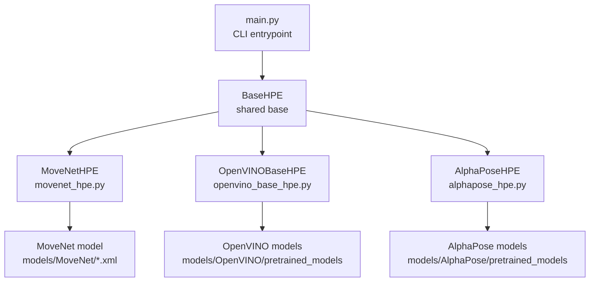
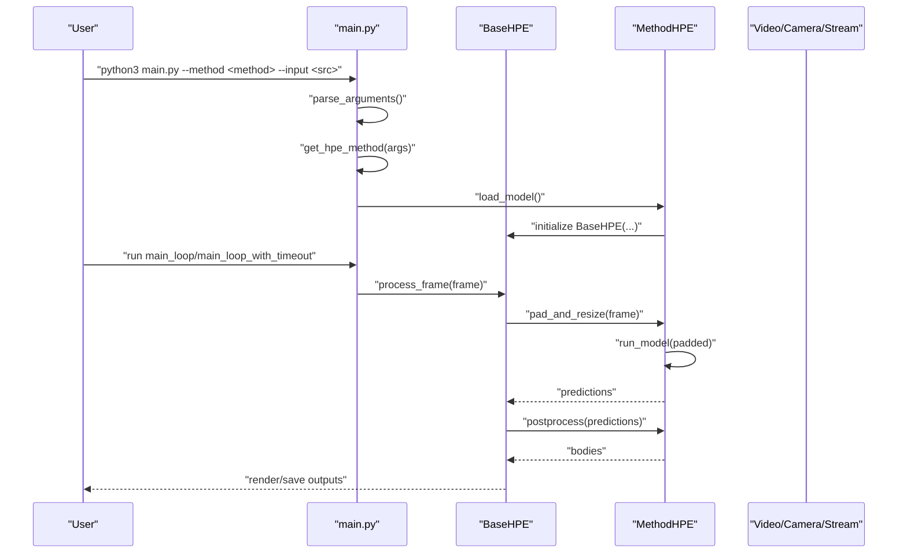
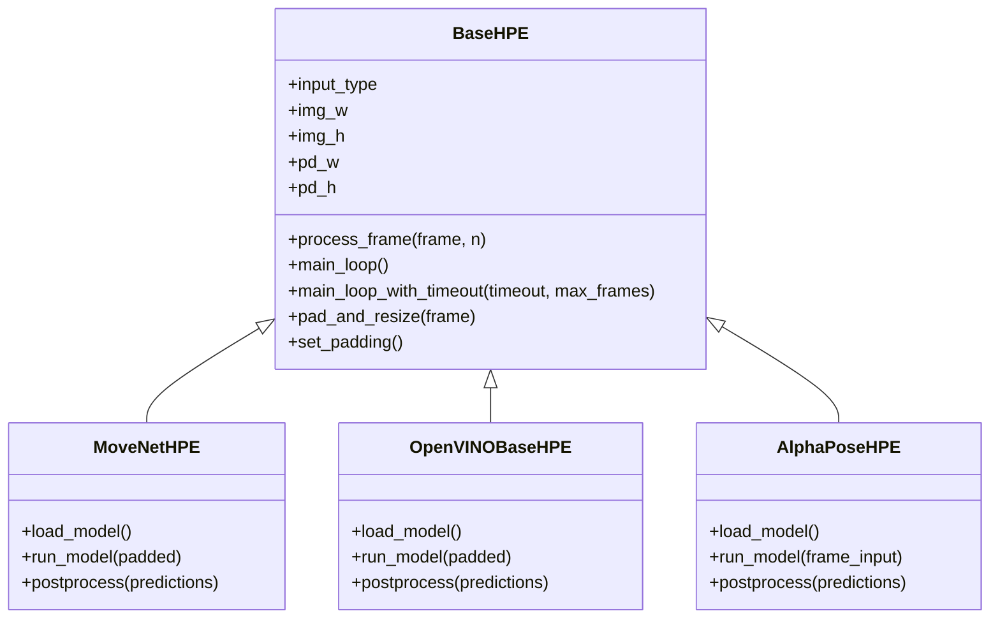
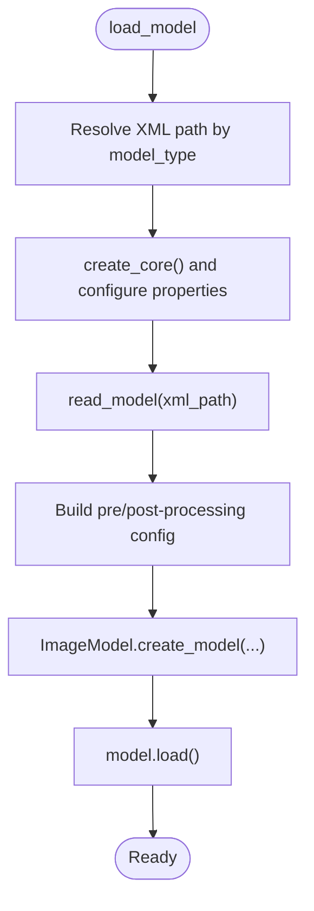
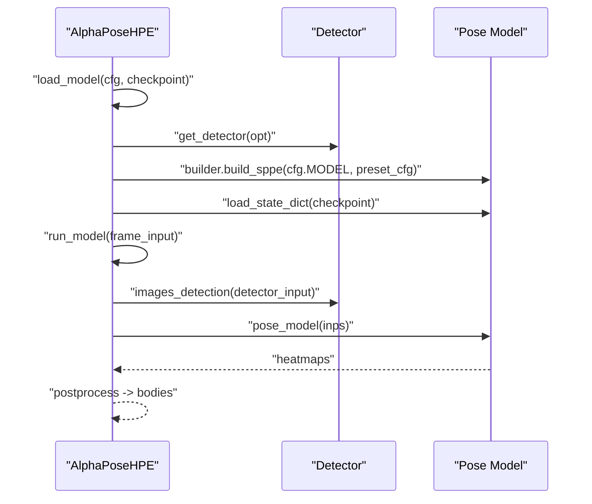
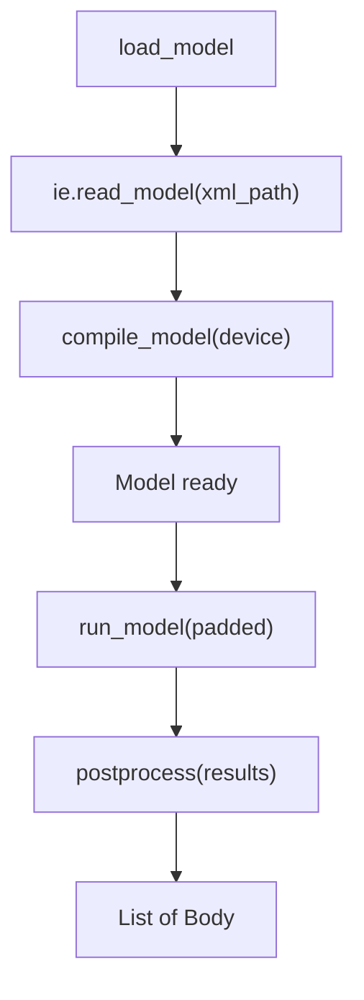
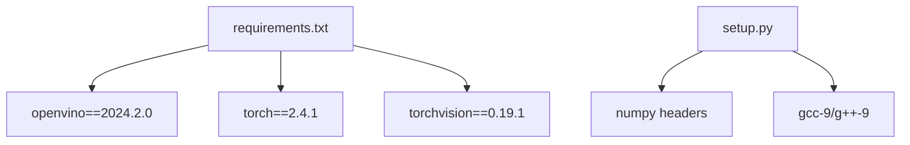

# Getting Started

<cite>
**Referenced Files in This Document**
- [README.md](file://README.md)
- [requirements.txt](file://requirements.txt)
- [setup.py](file://setup.py)
- [models/AlphaPose/build_extensions.sh](file://models/AlphaPose/build_extensions.sh)
- [models/AlphaPose/pretrained_models/256x192_res50_lr1e-3_1x.yaml](file://models/AlphaPose/pretrained_models/256x192_res50_lr1e-3_1x.yaml)
- [main.py](file://main.py)
- [base_hpe.py](file://base_hpe.py)
- [openvino_base_hpe.py](file://openvino_base_hpe.py)
- [movenet_hpe.py](file://movenet_hpe.py)
- [alphapose_hpe.py](file://alphapose_hpe.py)
- [dev_tools/smoke_test.sh](file://dev_tools/smoke_test.sh)
- [build_ffmpeg_cuda.sh](file://build_ffmpeg_cuda.sh)
- [check_stream_compat.sh](file://check_stream_compat.sh)
- [ffmpeg_hpe/docker-compose.yaml](file://ffmpeg_hpe/docker-compose.yaml)
</cite>

## Table of Contents
1. [Introduction](#introduction)
2. [Project Structure](#project-structure)
3. [Core Components](#core-components)
4. [Architecture Overview](#architecture-overview)
5. [Detailed Component Analysis](#detailed-component-analysis)
6. [Dependency Analysis](#dependency-analysis)
7. [Performance Considerations](#performance-considerations)
8. [Troubleshooting Guide](#troubleshooting-guide)
9. [Conclusion](#conclusion)
10. [Appendices](#appendices)

## Introduction
This guide helps you install and run the Human Pose Estimation framework on Ubuntu 20.04. It covers:
- Environment prerequisites (Python 3.8.10, OpenVINO 2024.2.0, NVIDIA CUDA)
- Conda environment setup and dependency installation
- AlphaPose extension building
- Downloading and placing required pre-trained models
- Verification steps and basic usage examples

The framework supports multiple methods: MoveNet, AlphaPose, OpenPose, HigherHRNet, and EfficientHRNet variants. It integrates OpenCV, PyTorch, OpenVINO, and optional hardware acceleration via FFmpeg with CUDA.

## Project Structure
At a high level, the repository provides:
- A unified entry point to select a method and input source
- Method-specific implementations under shared base classes
- Pre-trained models organized by method
- Scripts for building extensions and verifying setups

**Diagram sources**
- [main.py:22-99](file://main.py#L22-L99)
- [base_hpe.py:36-546](file://base_hpe.py#L36-L546)
- [movenet_hpe.py:12-111](file://movenet_hpe.py#L12-L111)
- [openvino_base_hpe.py:55-260](file://openvino_base_hpe.py#L55-L260)
- [alphapose_hpe.py:33-125](file://alphapose_hpe.py#L33-L125)

**Section sources**
- [README.md:17-125](file://README.md#L17-L125)
- [main.py:22-99](file://main.py#L22-L99)

## Core Components
- CLI entrypoint: parses arguments, selects method, loads model, and runs processing loops
- BaseHPE: common logic for input detection, padding/resizing, inference timing, saving outputs, and rendering
- Method-specific classes:
  - MoveNetHPE: OpenVINO-based multipose model
  - OpenVINOBaseHPE: OpenVINO pipelines for OpenPose, HigherHRNet, and EfficientHRNet variants
  - AlphaPoseHPE: PyTorch-based pose estimation with detector integration

Key behaviors:
- Automatic selection of PyNvCodec vs OpenCV for video decoding
- HTTP stream support with timeouts and frame limits
- JSON/COCO CSV export and optional image/video saving

**Section sources**
- [main.py:47-99](file://main.py#L47-L99)
- [base_hpe.py:36-546](file://base_hpe.py#L36-L546)
- [openvino_base_hpe.py:55-260](file://openvino_base_hpe.py#L55-L260)
- [movenet_hpe.py:12-111](file://movenet_hpe.py#L12-L111)
- [alphapose_hpe.py:33-125](file://alphapose_hpe.py#L33-L125)

## Architecture Overview
The system routes user commands to a selected method, which loads the appropriate model and processes frames through a standardized pipeline.

**Diagram sources**
- [main.py:22-99](file://main.py#L22-L99)
- [base_hpe.py:405-519](file://base_hpe.py#L405-L519)
- [openvino_base_hpe.py:262-276](file://openvino_base_hpe.py#L262-L276)
- [movenet_hpe.py:83-111](file://movenet_hpe.py#L83-L111)
- [alphapose_hpe.py:126-294](file://alphapose_hpe.py#L126-L294)

## Detailed Component Analysis

### Installation and Setup

#### Prerequisites
- Ubuntu 20.04
- Python 3.8.10
- OpenVINO 2024.2.0
- NVIDIA CUDA Toolkit and PyTorch CUDA matching the environment

These are documented in the repository’s top-level README.

**Section sources**
- [README.md:7-16](file://README.md#L7-L16)

#### Conda Environment and Dependencies
- Create a conda environment with the specified Python version
- Install PyTorch and related packages
- Install pinned dependencies from requirements.txt

Notes:
- The environment should include PyTorch with CUDA 12.1 and OpenVINO 2024.2.0 as per the README
- The requirements.txt lists pinned versions for reproducibility

**Section sources**
- [README.md:82-88](file://README.md#L82-L88)
- [requirements.txt:1-100](file://requirements.txt#L1-L100)

#### AlphaPose Extension Building
- The AlphaPose detector requires native extensions
- The build script sets compilers and invokes per-module setup scripts
- Ensure NumPy headers are available during compilation

**Section sources**
- [README.md:90-93](file://README.md#L90-L93)
- [models/AlphaPose/build_extensions.sh:1-25](file://models/AlphaPose/build_extensions.sh#L1-L25)
- [setup.py:1-37](file://setup.py#L1-L37)

#### Pre-trained Models
Place the following models in their designated locations as instructed in the README:

- AlphaPose
  - fast_res50_256x192.pth
  - yolov3-spp.weights
- MoveNet
  - movenet_multipose_lightning_256x256_FP32.bin
- OpenPose
  - human-pose-estimation-0001.bin
- HigherHRNet
  - higher-hrnet-w32-human-pose-estimation.bin
- EfficientHRNet variants
  - human-pose-estimation-0005.bin
  - human-pose-estimation-0006.bin
  - human-pose-estimation-0007.bin

Verification:
- The AlphaPose YAML config references detector weights and model image sizes
- The OpenVINO base class maps model types to XML paths

**Section sources**
- [README.md:21-70](file://README.md#L21-L70)
- [models/AlphaPose/pretrained_models/256x192_res50_lr1e-3_1x.yaml:1-66](file://models/AlphaPose/pretrained_models/256x192_res50_lr1e-3_1x.yaml#L1-L66)
- [openvino_base_hpe.py:22-53](file://openvino_base_hpe.py#L22-L53)

### Basic Usage Examples
Run the following examples after installing the environment and placing models:

- MoveNet single image
  - Command: see [README.md:99-100](file://README.md#L99-L100)
- AlphaPose directory of images
  - Command: see [README.md:102-103](file://README.md#L102-L103)
- EfficientHRNet1 video
  - Command: see [README.md:105-106](file://README.md#L105-L106)
- Help
  - Command: see [README.md:108-109](file://README.md#L108-L109)

Developer utilities:
- Stream a local video via HTTP and process it
  - Commands: see [README.md:117-123](file://README.md#L117-L123)

**Section sources**
- [README.md:95-123](file://README.md#L95-L123)

### Verification Steps
- Use the smoke test script to validate the environment and basic functionality
  - See [dev_tools/smoke_test.sh:28-41](file://dev_tools/smoke_test.sh#L28-L41)
- Confirm model paths exist for the chosen method
  - OpenVINO XML paths are mapped in the base class
  - AlphaPose YAML and weights are referenced in the implementation

**Section sources**
- [dev_tools/smoke_test.sh:1-42](file://dev_tools/smoke_test.sh#L1-L42)
- [openvino_base_hpe.py:22-53](file://openvino_base_hpe.py#L22-L53)
- [alphapose_hpe.py:24-25](file://alphapose_hpe.py#L24-L25)

## Architecture Overview

**Diagram sources**
- [base_hpe.py:36-546](file://base_hpe.py#L36-L546)
- [movenet_hpe.py:12-111](file://movenet_hpe.py#L12-L111)
- [openvino_base_hpe.py:55-314](file://openvino_base_hpe.py#L55-L314)
- [alphapose_hpe.py:33-334](file://alphapose_hpe.py#L33-L334)

## Detailed Component Analysis

### OpenVINO Base Pipeline
- Model selection by type maps to XML paths and input sizes
- CPU performance tuning via OpenVINO properties
- Supports PyNvCodec for GPU-accelerated decoding when available
- Handles HTTP streams with FFmpeg backend and fallbacks

**Diagram sources**
- [openvino_base_hpe.py:183-260](file://openvino_base_hpe.py#L183-L260)

**Section sources**
- [openvino_base_hpe.py:22-53](file://openvino_base_hpe.py#L22-L53)
- [openvino_base_hpe.py:153-182](file://openvino_base_hpe.py#L153-L182)
- [openvino_base_hpe.py:183-260](file://openvino_base_hpe.py#L183-L260)

### AlphaPose Pipeline
- Loads detector and pose model from YAML and checkpoint
- Uses GPU when available; supports multi-GPU via DataParallel
- Performs detection and pose estimation with GPU-accelerated preprocessing

**Diagram sources**
- [alphapose_hpe.py:69-125](file://alphapose_hpe.py#L69-L125)
- [alphapose_hpe.py:126-294](file://alphapose_hpe.py#L126-L294)
- [models/AlphaPose/pretrained_models/256x192_res50_lr1e-3_1x.yaml:1-66](file://models/AlphaPose/pretrained_models/256x192_res50_lr1e-3_1x.yaml#L1-L66)

**Section sources**
- [alphapose_hpe.py:24-25](file://alphapose_hpe.py#L24-L25)
- [alphapose_hpe.py:41-67](file://alphapose_hpe.py#L41-L67)
- [alphapose_hpe.py:69-125](file://alphapose_hpe.py#L69-L125)
- [alphapose_hpe.py:126-294](file://alphapose_hpe.py#L126-L294)

### MoveNet Pipeline
- Loads OpenVINO model for multipose inference
- Converts frames to expected input layout and runs inference
- Postprocesses outputs to Body objects

**Diagram sources**
- [movenet_hpe.py:58-86](file://movenet_hpe.py#L58-L86)
- [movenet_hpe.py:87-111](file://movenet_hpe.py#L87-L111)

**Section sources**
- [movenet_hpe.py:20-31](file://movenet_hpe.py#L20-L31)
- [movenet_hpe.py:58-111](file://movenet_hpe.py#L58-L111)

## Dependency Analysis
- OpenVINO 2024.2.0 is required and referenced in requirements.txt
- PyTorch CUDA 12.1 and corresponding torch version are specified in the README
- AlphaPose extensions require NumPy headers and specific compilers

**Diagram sources**
- [requirements.txt:57-91](file://requirements.txt#L57-L91)
- [setup.py:4-8](file://setup.py#L4-L8)
- [setup.py:6-12](file://setup.py#L6-L12)

**Section sources**
- [requirements.txt:57-91](file://requirements.txt#L57-L91)
- [setup.py:1-37](file://setup.py#L1-L37)
- [README.md:7-16](file://README.md#L7-L16)

## Performance Considerations
- OpenVINO CPU tuning
  - Performance mode, threads, streams, CPU pinning, and hyper-threading can be configured via environment variables
  - See [openvino_base_hpe.py:72-86](file://openvino_base_hpe.py#L72-L86) and [openvino_base_hpe.py:153-182](file://openvino_base_hpe.py#L153-L182)
- FFmpeg with CUDA/NPP/NVENC
  - A dedicated script builds FFmpeg with hardware acceleration for improved pipeline throughput
  - See [build_ffmpeg_cuda.sh:157-183](file://build_ffmpeg_cuda.sh#L157-L183)
- Stream compatibility
  - Use the compatibility checker to validate codecs, resolution, FPS, and accessibility
  - See [check_stream_compat.sh:1-90](file://check_stream_compat.sh#L1-L90)

**Section sources**
- [openvino_base_hpe.py:72-86](file://openvino_base_hpe.py#L72-L86)
- [openvino_base_hpe.py:153-182](file://openvino_base_hpe.py#L153-L182)
- [build_ffmpeg_cuda.sh:157-183](file://build_ffmpeg_cuda.sh#L157-L183)
- [check_stream_compat.sh:1-90](file://check_stream_compat.sh#L1-L90)

## Troubleshooting Guide
Common issues and resolutions:
- Missing AlphaPose models or weights
  - Ensure the YAML and checkpoint are placed as described in the README
  - Reference: [README.md:25-33](file://README.md#L25-L33), [alphapose_hpe.py:24-25](file://alphapose_hpe.py#L24-L25)
- AlphaPose extension build failures
  - Verify NumPy headers and compilers are set
  - Reference: [models/AlphaPose/build_extensions.sh:4-8](file://models/AlphaPose/build_extensions.sh#L4-L8), [setup.py:4](file://setup.py#L4)
- OpenVINO model path errors
  - Confirm model_type matches available configs and XML paths
  - Reference: [openvino_base_hpe.py:22-53](file://openvino_base_hpe.py#L22-L53)
- HTTP stream problems
  - Use the compatibility checker and adjust OpenCV FFMPEG options if needed
  - Reference: [check_stream_compat.sh:75-90](file://check_stream_compat.sh#L75-L90)
- Smoke test failures
  - Validate environment activation and device selection
  - Reference: [dev_tools/smoke_test.sh:10-19](file://dev_tools/smoke_test.sh#L10-L19)

**Section sources**
- [README.md:25-33](file://README.md#L25-L33)
- [models/AlphaPose/build_extensions.sh:4-8](file://models/AlphaPose/build_extensions.sh#L4-L8)
- [setup.py:4](file://setup.py#L4)
- [openvino_base_hpe.py:22-53](file://openvino_base_hpe.py#L22-L53)
- [check_stream_compat.sh:75-90](file://check_stream_compat.sh#L75-L90)
- [dev_tools/smoke_test.sh:10-19](file://dev_tools/smoke_test.sh#L10-L19)

## Conclusion
You now have a complete path to install the Human Pose Estimation framework, build required extensions, place pre-trained models, and run your first pose estimation examples. Use the provided scripts and environment settings to validate your setup and optimize performance with OpenVINO and FFmpeg CUDA.

## Appendices

### Appendix A: Command-Line Arguments
- Method selection: --method
- Input source: --input
- Output controls: --output_dir, --json, --csv, --save_video, --save_image
- Device: --device (CPU/GPU)
- Detection batch size: --detbatch
- Timeout and frame limits for streams: --timeout, --max_frames

Reference: [main.py:47-62](file://main.py#L47-L62)

**Section sources**
- [main.py:47-62](file://main.py#L47-L62)

### Appendix B: Docker-Based Streaming Pipeline
- A docker-compose stack demonstrates end-to-end streaming with FFmpeg and metrics containers
- Useful for validating HTTP stream ingestion and GPU utilization

Reference: [ffmpeg_hpe/docker-compose.yaml:1-201](file://ffmpeg_hpe/docker-compose.yaml#L1-L201)

**Section sources**
- [ffmpeg_hpe/docker-compose.yaml:1-201](file://ffmpeg_hpe/docker-compose.yaml#L1-L201)