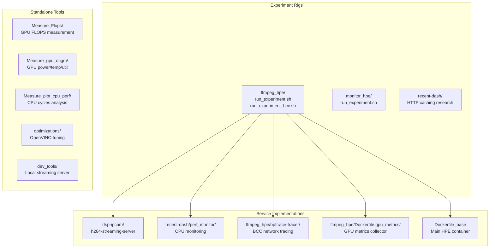
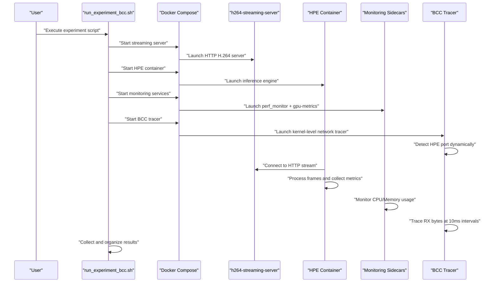
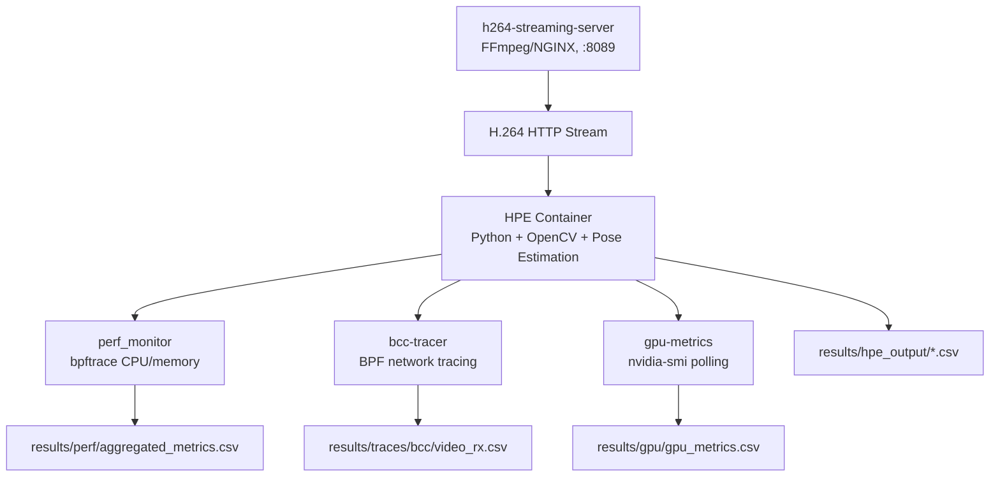
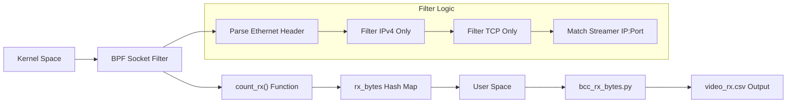

# Getting Started

<cite>
**Referenced Files in This Document**
- [ONBOARDING.md](file://ONBOARDING.md)
- [README.md](file://README.md)
- [requirements.txt](file://requirements.txt)
- [setup.py](file://setup.py)
- [models/AlphaPose/build_extensions.sh](file://models/AlphaPose/build_extensions.sh)
- [models/AlphaPose/pretrained_models/256x192_res50_lr1e-3_1x.yaml](file://models/AlphaPose/pretrained_models/256x192_res50_lr1e-3_1x.yaml)
- [main.py](file://main.py)
- [base_hpe.py](file://base_hpe.py)
- [openvino_base_hpe.py](file://openvino_base_hpe.py)
- [movenet_hpe.py](file://movenet_hpe.py)
- [alphapose_hpe.py](file://alphapose_hpe.py)
- [dev_tools/smoke_test.sh](file://dev_tools/smoke_test.sh)
- [build_ffmpeg_cuda.sh](file://build_ffmpeg_cuda.sh)
- [check_stream_compat.sh](file://check_stream_compat.sh)
- [ffmpeg_hpe/docker-compose.yaml](file://ffmpeg_hpe/docker-compose.yaml)
- [ffmpeg_hpe/run_experiment_bcc.sh](file://ffmpeg_hpe/run_experiment_bcc.sh)
- [docs/experiment-scripts.md](file://docs/experiment-scripts.md)
- [docs/docker-services.md](file://docs/docker-services.md)
- [docs/bcc-bpf-tracing.md](file://docs/bcc-bpf-tracing.md)
- [docs/plotting-analysis.md](file://docs/plotting-analysis.md)
- [docs/hpe-methods.md](file://docs/hpe-methods.md)
- [ffmpeg_hpe/bpftrace-tracer/bcc_rx_bytes.py](file://ffmpeg_hpe/bpftrace-tracer/bcc_rx_bytes.py)
- [ffmpeg_hpe/bpftrace-tracer/entrypoint.sh](file://ffmpeg_hpe/bpftrace-tracer/entrypoint.sh)
- [Report on RX TX traffic discrepancy.md](file://Report on RX TX traffic discrepancy.md)
</cite>

## Update Summary
**Changes Made**
- Enhanced documentation with comprehensive experiment rig tables showing folder roles classification
- Added detailed flow diagrams for experiment orchestration and network data collection
- Updated results directory structure with corrected file naming conventions
- Improved TX/RX network data collection explanations with detailed methodology
- Enhanced experiment pipeline documentation with monitoring capabilities
- Added troubleshooting guidance for network measurement discrepancies

## Table of Contents
1. [Introduction](#introduction)
2. [Project Structure](#project-structure)
3. [Core Components](#core-components)
4. [Architecture Overview](#architecture-overview)
5. [Installation and Setup](#installation-and-setup)
6. [Model Download and Configuration](#model-download-and-configuration)
7. [Basic Usage Examples](#basic-usage-examples)
8. [Experiment Pipeline](#experiment-pipeline)
9. [Performance Optimization](#performance-optimization)
10. [Verification and Testing](#verification-and-testing)
11. [Network Monitoring and Data Collection](#network-monitoring-and-data-collection)
12. [Results Directory Structure](#results-directory-structure)
13. [Troubleshooting Guide](#troubleshooting-guide)
14. [Conclusion](#conclusion)

## Introduction
This comprehensive guide provides complete setup instructions for the Human Pose Estimation framework, incorporating the new ONBOARDING.md documentation. The framework supports multiple state-of-the-art methods including AlphaPose, MoveNet, OpenPose, HigherHRNet, and EfficientHRNet variants. It offers both local execution and Docker-based benchmarking capabilities with comprehensive performance monitoring including detailed network traffic analysis.

**Updated** Enhanced with comprehensive experiment rig tables, detailed flow diagrams, folder roles classification, and corrected file naming conventions for network data collection.

## Project Structure
The repository provides a complete HPE benchmarking system with modular components organized into three main categories:



**Diagram sources**
- [ONBOARDING.md:69-96](file://ONBOARDING.md#L69-L96)
- [ONBOARDING.md:122-173](file://ONBOARDING.md#L122-L173)

**Section sources**
- [ONBOARDING.md:63-173](file://ONBOARDING.md#L63-L173)

## Core Components
The framework consists of several key components working together:

- **CLI Entry Point**: Parses arguments, selects method, loads model, and manages processing loops
- **BaseHPE**: Common logic for input handling, preprocessing, inference timing, and output generation
- **Method-Specific Classes**: Specialized implementations for each HPE algorithm
- **Experiment Pipeline**: Docker-based benchmarking with comprehensive monitoring
- **Monitoring Stack**: CPU, GPU, and network performance tracking with kernel-level precision

Key capabilities include automatic video property detection, HTTP stream support, JSON/COCO CSV export, and optional visualization output.

**Section sources**
- [main.py:51-200](file://main.py#L51-L200)
- [base_hpe.py:88-630](file://base_hpe.py#L88-L630)
- [ONBOARDING.md:285-301](file://ONBOARDING.md#L285-L301)

## Architecture Overview
The system provides both local execution and containerized benchmarking with sophisticated network monitoring:



**Diagram sources**
- [ONBOARDING.md:460-475](file://ONBOARDING.md#L460-L475)
- [ffmpeg_hpe/run_experiment_bcc.sh:158-198](file://ffmpeg_hpe/run_experiment_bcc.sh#L158-L198)

## Installation and Setup

### Prerequisites
The framework requires specific hardware and software prerequisites:

- **Operating System**: Ubuntu 20.04 (tested and recommended)
- **Python**: 3.8.10 with conda environment support
- **CUDA**: Toolkit 12.6 for GPU acceleration
- **Docker**: Docker Engine + Docker Compose v20+ for containerized experiments
- **Hardware**: NVIDIA GPU with CUDA support (CPU-only mode also supported)

### Environment Setup Options

#### Option A: Conda Environment (Recommended)
```bash
# Create and activate environment
conda create -n hpe python=3.8.10 -y
conda activate hpe

# Install PyTorch with CUDA support
conda install pytorch==2.4.1 torchvision==0.19.1 -c pytorch

# Install all remaining dependencies
conda install --file requirements.txt
```

#### Option B: pip + virtualenv
```bash
python3 -m venv myenv
source myenv/bin/activate
pip install -r requirements.txt
```

**Section sources**
- [ONBOARDING.md:148-167](file://ONBOARDING.md#L148-L167)
- [ONBOARDING.md:170-223](file://ONBOARDING.md#L170-L223)
- [README.md:7-17](file://README.md#L7-L17)

### AlphaPose Extension Building
AlphaPose requires compiled Cython and CUDA extensions:

```bash
# Recommended: use the build script (handles CPU/GPU detection automatically)
bash models/AlphaPose/build_extensions.sh

# Alternative: build in-place
python setup.py build_ext --inplace
```

**Section sources**
- [ONBOARDING.md:194-207](file://ONBOARDING.md#L194-L207)
- [models/AlphaPose/build_extensions.sh:1-25](file://models/AlphaPose/build_extensions.sh#L1-L25)
- [setup.py:1-37](file://setup.py#L1-L37)

## Model Download and Configuration

### Downloading Pretrained Model Weights
Model files are not included in the repository and must be downloaded manually:

#### AlphaPose Models
```bash
# ResNet50 pose estimation weights
wget "https://drive.google.com/uc?export=download&id=1p6bi10UybpUIcq5D2XDsgQRLPJIr2RyI" \
  -O models/AlphaPose/pretrained_models/fast_res50_256x192.pth

# YOLOv3 person detector weights
wget "https://drive.google.com/uc?export=download&id=1k-9cUGcdH5ZFN1NcMvZrO0ApW241tboD" \
  -O models/AlphaPose/detector/yolo/data/yolov3-spp.weights
```

#### MoveNet Model
```bash
wget "https://drive.google.com/uc?export=download&id=15SZwY2jAh1KqHwT-YO6_UByOsQD70RSr" \
  -O models/MoveNet/movenet_multipose_lightning_256x256_FP32.bin
```

#### OpenPose Model
```bash
wget "https://drive.google.com/uc?export=download&id=1VNucIyIsdaiw1cYt-JGqBWloVu2TVdsm" \
  -O models/OpenVINO/pretrained_models/intel/human-pose-estimation-0001/human-pose-estimation-0001.bin
```

#### HigherHRNet Model
```bash
wget "https://drive.google.com/uc?export=download&id=1fko47eVczJZQb9wWA2X7eQ0TuF4PDXzs" \
  -O models/OpenVINO/pretrained_models/public/FP32/higher-hrnet-w32-human-pose-estimation.bin
```

#### EfficientHRNet Variants
```bash
# ae1
wget "https://drive.google.com/uc?export=download&id=1lEUFqQnWHVymQoZvaXuDFcnOyEEKsexP" \
  -O models/OpenVINO/pretrained_models/public/human-pose-estimation-0005/FP32/human-pose-estimation-0005.bin

# ae2
wget "https://drive.google.com/uc?export=download&id=1d8pGQrM9vEfz_oAIey0qRr7Gxp6dS2UE" \
  -O models/OpenVINO/pretrained_models/public/human-pose-estimation-0006/FP32/human-pose-estimation-0006.bin

# ae3
wget "https://drive.google.com/uc?export=download&id=1ZSdsqgD4zUO4gyHMYBfxq3m4UMyQ187j" \
  -O models/OpenVINO/pretrained_models/public/human-pose-estimation-0007/FP32/human-pose-estimation-0007.bin
```

**Section sources**
- [ONBOARDING.md:225-282](file://ONBOARDING.md#L225-L282)
- [README.md:22-63](file://README.md#L22-L63)

## Basic Usage Examples

### Local Execution Examples
Run the following examples after setting up the environment and downloading models:

#### MoveNet Single Image
```bash
python3 main.py --method movenet --input unit_tests/images/testImage.jpg --save_image
```

#### AlphaPose Directory Processing
```bash
python3 main.py --method alphapose --input unit_tests/images/ --json
```

#### EfficientHRNet Video Processing
```bash
python3 main.py --method ae1 --input unit_tests/video/giphy.gif --save_video
```

#### HTTP Stream Processing
```bash
python3 main.py --method movenet --input http://192.168.1.10:8089/stream.h264 --device CPU
```

#### AlphaPose with Custom Settings
```bash
python3 main.py --method alphapose --input video.mp4 --csv --device GPU --output_dir results/
```

### All CLI Flags
| Flag | Default | Description |
|---|---|---|
| `--method` | required | HPE method: `openpose`, `alphapose`, `movenet`, `hrnet`, `ae1`, `ae2`, `ae3` |
| `--input` | `0` (webcam) | Path to image, directory, video/GIF file, or HTTP stream URL |
| `--output_dir` | None | Directory where output files are saved |
| `--device` | `GPU` | Inference device: `GPU` or `CPU` |
| `--json` | False | Export keypoints to a JSON file |
| `--csv` | False | Export keypoints to a CSV file |
| `--save_image` | False | Save annotated image(s) |
| `--save_video` | False | Save annotated video |
| `--detbatch` | `5` | Detection batch size (AlphaPose only) |
| `--timeout` | `300` | Timeout in seconds for HTTP streams |
| `--max_frames` | `0` | Max frames to process (0 = unlimited) |
| `--measurement_interval_ms` | `100` | Interval for measuring data volume |

**Section sources**
- [ONBOARDING.md:303-356](file://ONBOARDING.md#L303-L356)
- [ONBOARDING.md:329-345](file://ONBOARDING.md#L329-L345)
- [README.md:83-114](file://README.md#L83-L114)

## Experiment Pipeline

### Docker-Based Benchmarking Architecture
The framework provides comprehensive containerized benchmarking with multi-service orchestration:



**Diagram sources**
- [ONBOARDING.md:361-427](file://ONBOARDING.md#L361-L427)

### Experiment Rig Tables

#### Primary Experiment Rigs
| Folder | Entry Point | What it measures | Key Features |
|---|---|---|---|
| `ffmpeg_hpe/` | `run_experiment.sh` / `run_experiment_bcc.sh` | HPE inference on H.264 stream + full monitoring stack | Full network tracing, comprehensive metrics |
| `monitor_hpe/` | `run_experiment.sh` | HPE inference baseline — CPU/memory only, no streaming server | Simplified monitoring, local processing |
| `recent-dash/` | `run_experiment.sh` | DASH/HTTP caching research — separate thread | HTTP caching analysis, Prometheus integration |

#### Service Implementations
| Folder | Used by | Role in `docker-compose.yaml` | Key Characteristics |
|---|---|---|---|
| `rtsp-ipcam/` | `ffmpeg_hpe/docker-compose.yaml` | Builds the `h264-streaming-server` container | H.264 HTTP streaming server |
| `recent-dash/perf_monitor/` | `ffmpeg_hpe/docker-compose.yaml` | Builds the `perf_monitor` container | CPU/memory monitoring via bpftrace |
| `ffmpeg_hpe/bpftrace-tracer/` | `ffmpeg_hpe/docker-compose.yaml` | Builds the `bcc-tracer` container | BCC/BPF-based network tracing |
| `ffmpeg_hpe/Dockerfile.gpu_metrics` | `ffmpeg_hpe/docker-compose.yaml` | Builds the `gpu-metrics` container | GPU metrics via nvidia-smi polling |
| `Dockerfile_base` (repo root) | `ffmpeg_hpe/` + `monitor_hpe/` | Builds the `hpe` container | Main inference engine |

**Section sources**
- [ONBOARDING.md:69-96](file://ONBOARDING.md#L69-L96)
- [ONBOARDING.md:77-86](file://ONBOARDING.md#L77-L86)

### Docker Services Configuration
The experiment pipeline consists of five coordinated services:

#### 1. h264-streaming-server
- **Purpose**: Serves benchmark video as H.264 HTTP stream on port 8089
- **Resource Limits**: 2 CPU cores, 1 GB RAM
- **Configuration**: `VIDEO_FILE` from `.env`, `SERVER_PORT=8089`
- **Healthcheck**: TCP connection to port 8089

#### 2. hpe Container
- **Purpose**: Main inference container running pose estimation
- **Resource Limits**: 4 CPU cores, 16 GB RAM, NVIDIA GPU (via `runtime: nvidia`)
- **Shared Memory**: 8 GB (`shm_size`) for large batch operations
- **Command**: `python3 main.py --method <METHOD> --input http://h264-streaming-server:8089/stream.h264`

#### 3. gpu-metrics Sidecar
- **Purpose**: Polls `nvidia-smi` every 500ms for GPU statistics
- **Output**: `results/gpu/gpu_metrics.csv`
- **Requirements**: NVIDIA GPU and `nvidia-container-toolkit`

#### 4. perf_monitor Sidecar
- **Purpose**: Monitors CPU usage and memory RSS via bpftrace
- **Output**: `results/perf/aggregated_metrics.csv`
- **Privileges**: `privileged: true`, `SYS_ADMIN`, `NET_ADMIN`

#### 5. bcc-tracer Sidecar
- **Purpose**: Kernel-level network RX byte tracing using BCC/BPF
- **Output**: `results/traces/bcc/video_rx.csv`
- **Network Mode**: Shares HPE container's network namespace

### Experiment Execution Flow
The `run_experiment_bcc.sh` script orchestrates the complete benchmarking process:

1. **Timestamp Generation**: Creates unique results directory name with CPU thread count and device type
2. **Directory Creation**: Sets up `logs/`, `perf/`, `gpu/`, `traces/bcc/`, `hpe_output/` subdirectories
3. **Container Cleanup**: Removes previous containers and volumes
4. **Service Startup**: Starts streaming server with health checks
5. **Monitoring Services**: Launches perf, GPU, and BCC monitoring sidecars
6. **Inference Execution**: Runs HPE container with configured method and device
7. **Data Collection**: Copies CSV files from Docker volumes to host
8. **Timing Capture**: Writes per-container startup times
9. **Cleanup**: Tears down all containers

**Section sources**
- [ONBOARDING.md:359-443](file://ONBOARDING.md#L359-L443)
- [ONBOARDING.md:446-520](file://ONBOARDING.md#L446-L520)

## Performance Optimization

### CPU Performance Tuning
The framework includes automated CPU optimization for OpenVINO inference:

```bash
python3 optimizations/optimized_main.py --method openpose --input video.mp4 --device CPU --enable-cpu-opt
```

Key optimizations include:
- Automatic CPU topology detection
- Optimal thread/stream configuration calculation
- Performance mode selection (latency vs throughput)
- CPU pinning and hyper-threading control

### GPU Acceleration Setup
For GPU-enabled environments:
- Ensure NVIDIA drivers support CUDA 12.8
- Verify `nvidia-container-toolkit` installation
- Use `HPE_DEVICE=GPU` environment variable for explicit GPU selection
- Monitor GPU utilization with `nvidia-smi`

### FFmpeg CUDA Integration
Optional FFmpeg build with hardware acceleration:
```bash
bash build_ffmpeg_cuda.sh
```

This script builds FFmpeg with CUDA/NPP/NVENC support for improved pipeline throughput.

**Section sources**
- [ONBOARDING.md:511-520](file://ONBOARDING.md#L511-L520)
- [ONBOARDING.md:570-598](file://ONBOARDING.md#L570-L598)
- [build_ffmpeg_cuda.sh:1-200](file://build_ffmpeg_cuda.sh#L1-L200)

## Verification and Testing

### Smoke Test Execution
Use the smoke test script to verify environment setup:

```bash
# Basic smoke test (CPU)
bash dev_tools/smoke_test.sh CPU hpe

# GPU smoke test (if available)
bash dev_tools/smoke_test.sh GPU hpe
```

The smoke test validates:
- MoveNet single image processing
- AlphaPose directory processing (if models present)
- EfficientHRNet video processing

### Local Development Server
For HTTP stream testing, use the included Flask server:

```bash
# Terminal 1: Start local stream server
python3 dev_tools/stream_video_server.py

# Terminal 2: Process stream with HPE
python3 main.py --method movenet --input http://$(hostname -I | awk '{print $1}'):8080/video_feed --save_video
```

### Docker Experiment Validation
Run a simple experiment to validate the containerized setup:

```bash
cd ffmpeg_hpe/
./run_experiment_bcc.sh movenet
```

**Section sources**
- [dev_tools/smoke_test.sh:1-42](file://dev_tools/smoke_test.sh#L1-L42)
- [ONBOARDING.md:346-356](file://ONBOARDING.md#L346-L356)

## Network Monitoring and Data Collection

### TX and RX Network Data Collection

Network measurement requires two different tools because TX and RX operate in different kernel contexts:

| Direction | Tool | Container | Mechanism | Output file |
|---|---|---|---|---|
| **TX** (HPE → outside) | `bpftrace sys_enter_sendto` in `monitor_pid.sh` | `perf_monitor` | Syscall tracepoint — fires in HPE process context, PID filter valid | `results/perf/network_stats.csv` (rows where `sent=1`) |
| **RX** (stream → HPE) | `bcc_rx_bytes.py` | `bcc-tracer` | BPF socket filter on `eth0`, filtered by streamer IP + port | `results/traces/bcc/video_rx.csv` |
| ~~RX (attempted)~~ | ~~`bpftrace netif_receive_skb`~~ | ~~`perf_monitor`~~ | ~~Fires in softirq/kernel context — PID never matches HPE~~ | ~~Always ~0, ignore~~ |

**Why the split is necessary:** `sendto()` is a syscall made by the HPE process — the kernel knows the PID. Incoming packets are processed by the kernel network stack in softirq context *before* being associated with any process — PID filtering is impossible at that point. `bcc-tracer` works around this by filtering by IP+port instead, running in a container that shares HPE's network namespace (`network_mode: service:hpe`).

**Rule:** for RX data use `results/traces/bcc/video_rx.csv`. For TX data use `results/perf/network_stats.csv`. Never use the RX column from `results/perf/aggregated_metrics.csv` — it is always `0` by design.

### BCC Tracer Architecture
The BCC tracer uses kernel-level eBPF programs to capture network traffic with high precision:



**Diagram sources**
- [docs/bcc-bpf-tracing.md:23-53](file://docs/bcc-bpf-tracing.md#L23-L53)
- [ffmpeg_hpe/bpftrace-tracer/bcc_rx_bytes.py:29-71](file://ffmpeg_hpe/bpftrace-tracer/bcc_rx_bytes.py#L29-L71)

### Port Detection Mechanism
The BCC tracer automatically detects the HPE container's dynamic source port:

1. **Resolve streaming server hostname** to IP address
2. **Get network interface** from default route
3. **Wait for HPE to establish TCP connection** to port 8089 (up to 10 attempts)
4. **Extract HPE's dynamic source port** from established connections
5. **Pass detected port** to BCC program for filtering

**Section sources**
- [docs/bcc-bpf-tracing.md:143-175](file://docs/bcc-bpf-tracing.md#L143-L175)
- [ffmpeg_hpe/bpftrace-tracer/entrypoint.sh:29-47](file://ffmpeg_hpe/bpftrace-tracer/entrypoint.sh#L29-L47)

## Results Directory Structure

### Updated Directory Structure
Results are saved to a timestamped directory with enhanced naming convention:

```
results_{method}_{cpu_threads}cores_{device}_{video_file}_{timestamp}/
├── container_timing.txt         # Startup time per container (seconds)
├── logs/
│   ├── hpe_startup.log          # HPE container early startup output
│   ├── hpe_startup_full.log     # Full HPE container log
│   ├── hpe_exit.log             # HPE container exit code (0 = clean, non-zero = crash)
│   ├── perf_monitor.log         # bpftrace perf monitor log
│   ├── bcc-tracer.log           # BCC tracer log (port detection, tracing events)
│   └── gpu-metrics.log          # GPU metrics collector log
├── perf/
│   ├── aggregated_metrics.csv   # Columns: timestamp, pid, cpu_percent, mem_rss_kb, tx_bytes*, rx_bytes*
│   ├── network_stats.csv        # Columns: timestamp, pid, interface, bytes, sent  ← TX data lives here
│   └── perf_metrics.csv         # Additional perf_monitor metrics
├── gpu/
│   └── gpu_metrics.csv          # Columns: timestamp, gpu_id, gpu_utilization, mem_utilization, temperature, power_usage
├── traces/bcc/
│   └── video_rx.csv             # Columns: timestamp_ms, rx_bytes (per 10ms interval)  ← RX data lives here
└── hpe_output/
    ├── *.csv                    # Keypoint data: frame, person_id, joint coordinates
    └── *.json                   # COCO-format keypoint export (if --json flag used)
```

**Important Notes:**
- `*` The `tx_bytes` and `rx_bytes` columns in `aggregated_metrics.csv` are always `0` — this is intentional
- Network data is collected separately by two different tools as described above
- The `video_rx.csv` file contains RX bytes measured at 10ms intervals
- TX data is captured separately in `network_stats.csv` with proper PID filtering

### Data Validation Commands
```bash
cd results_*/  # Navigate to your results directory

# Total video data received (MB)
awk -F, 'NR>1 {sum += $2} END {printf "%.2f MB\n", sum/1024/1024}' traces/bcc/video_rx.csv

# Average GPU utilization
awk -F, 'NR>1 {sum += $2; n++} END {printf "%.1f%%\n", sum/n}' gpu/gpu_metrics.csv

# Peak memory usage (MB)
awk -F, 'NR>1 {if ($3 > max) max=$3} END {print max/1024 " MB"}' perf/aggregated_metrics.csv

# Number of frames processed
wc -l hpe_output/*.csv

# Experiment duration (from RX trace)
head -2 traces/bcc/video_rx.csv && echo "..." && tail -1 traces/bcc/video_rx.csv
```

**Section sources**
- [ONBOARDING.md:554-620](file://ONBOARDING.md#L554-L620)
- [Report on RX TX traffic discrepancy.md:1-109](file://Report on RX TX traffic discrepancy.md#L1-L109)

## Troubleshooting Guide

### Common Setup Issues

#### Disk Space Management
Docker images and results can consume significant disk space:
```bash
df -h                              # Check filesystem usage
docker system df                   # Docker-specific disk usage
docker system prune                # Remove stopped containers, dangling images
docker system prune -a --volumes   # Aggressive cleanup (removes ALL unused images)
```

#### File Permissions
Container output files may be owned by root:
```bash
sudo chown -R $(whoami):$(whoami) ffmpeg_hpe/results*
sudo chown -R $(whoami):$(whoami) ffmpeg_hpe/tracer_output
```

#### GPU Availability Issues
Verify GPU access and container configuration:
```bash
# Check nvidia-container-toolkit installation
which nvidia-container-runtime
docker info | grep -i runtime

# Test GPU access in container
docker run --rm --gpus all nvidia/cuda:12.1.0-base-ubuntu20.04 nvidia-smi
```

### Model Loading Problems
- Verify model files are downloaded to correct locations
- Check AlphaPose YAML configuration references correct weights
- Ensure OpenVINO XML paths match available model files

### Stream Connection Issues
```bash
# Get streaming server IP address
docker inspect -f '{{range .NetworkSettings.Networks}}{{.IPAddress}}{{end}}' h264-streaming-server

# Test stream accessibility
curl -I http://172.18.0.2:8089/stream.h264
ffprobe http://172.18.0.2:8089/stream.h264
```

### Container Lifecycle Issues
```bash
# Clean shutdown
cd ffmpeg_hpe/
docker compose down -v --remove-orphans

# Force cleanup if needed
docker kill hpe bcc-tracer gpu-metrics perf_monitor 2>/dev/null || true
docker rm -f hpe bcc-tracer gpu-metrics perf_monitor 2>/dev/null || true
```

### Network Measurement Discrepancies
**Issue**: RX/TX traffic discrepancy between different measurement methods

**Causes and Solutions:**
1. **Protocol overhead differences**: Docker stats include all protocol overhead while bpftrace may only count payload
2. **Sampling limitations**: bpftrace may miss packets due to kernel filtering or buffer overflows
3. **Partial stream consumption**: HPE container may exit early or skip frames
4. **Timing mismatches**: Different measurement start/stop times

**Diagnosis Steps:**
```bash
# Check streaming server logs for complete file transmission
docker logs h264-streaming-server | tail -20

# Verify HPE container processed all frames
docker logs hpe | grep -E "(frame|processed|exit)"

# Compare durations
echo "Stream duration (RX trace):"
head -2 traces/bcc/video_rx.csv && echo "..." && tail -1 traces/bcc/video_rx.csv

# Validate file sizes
echo "Original file size:"
stat -c%s /path/to/original/video.mp4
```

**Section sources**
- [ONBOARDING.md:627-740](file://ONBOARDING.md#L627-L740)
- [Report on RX TX traffic discrepancy.md:41-56](file://Report on RX TX traffic discrepancy.md#L41-L56)

## Conclusion
You now have comprehensive guidance for setting up and using the Human Pose Estimation framework. The ONBOARDING.md documentation provides detailed step-by-step instructions for environment setup, model configuration, and experiment execution. Whether running locally or using the Docker-based benchmarking pipeline, the framework offers extensive monitoring capabilities and performance optimization features.

The enhanced documentation includes comprehensive experiment rig tables, detailed flow diagrams, corrected file naming conventions, and improved network monitoring capabilities. The framework supports multiple HPE methods with flexible deployment options, making it suitable for both development and production benchmarking scenarios. The comprehensive monitoring stack enables detailed performance analysis across CPU, GPU, and network domains with kernel-level precision.

**Updated** Enhanced with comprehensive experiment rig tables, detailed flow diagrams, folder roles classification, TX/RX network data collection explanations, and corrected file naming conventions for improved accuracy and reliability.