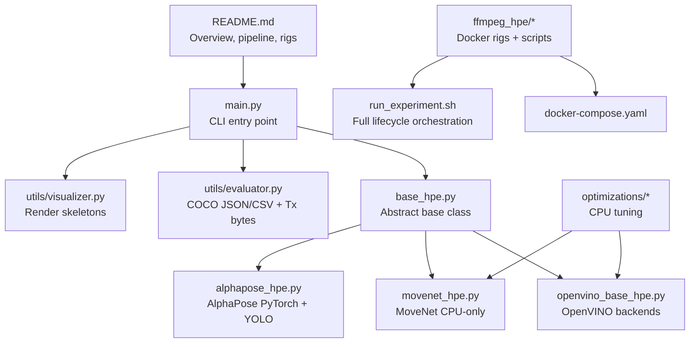
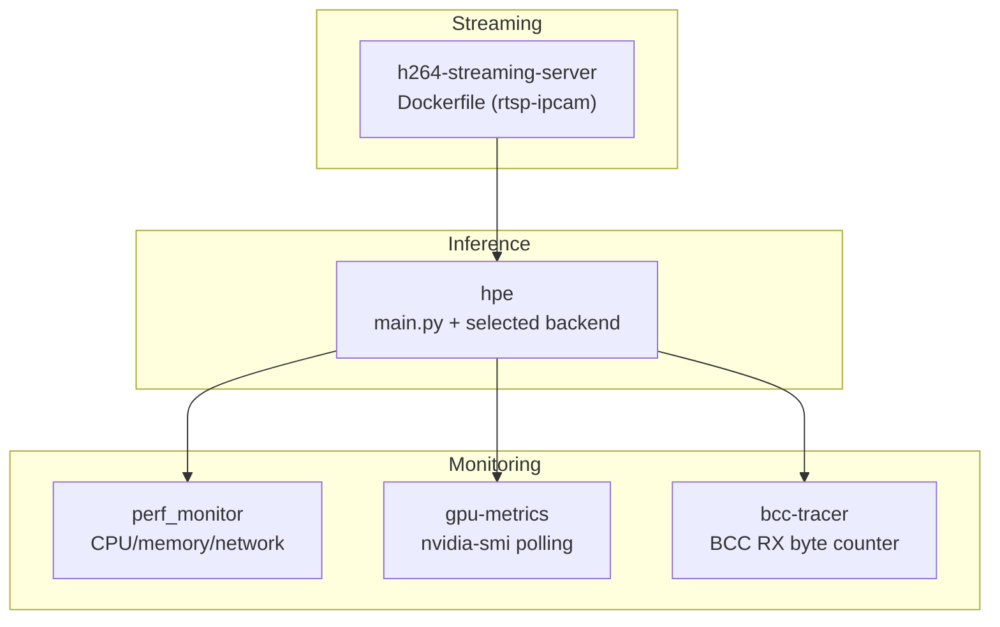
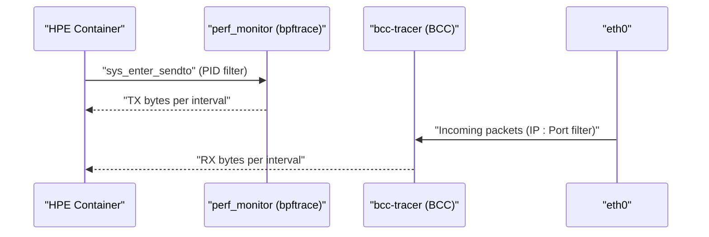
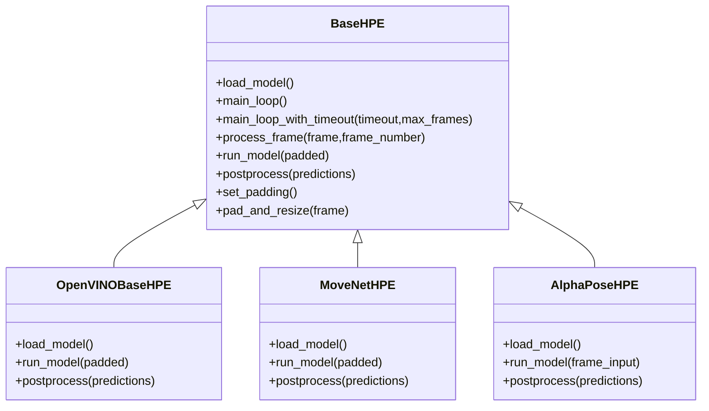
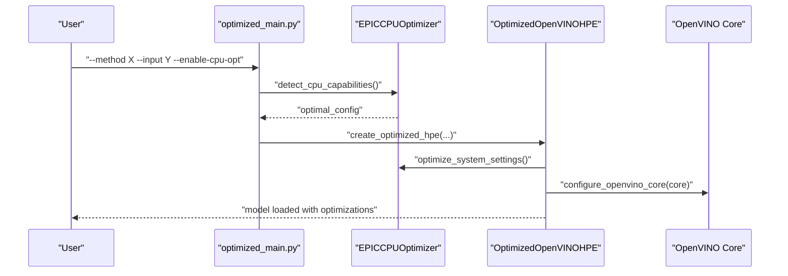
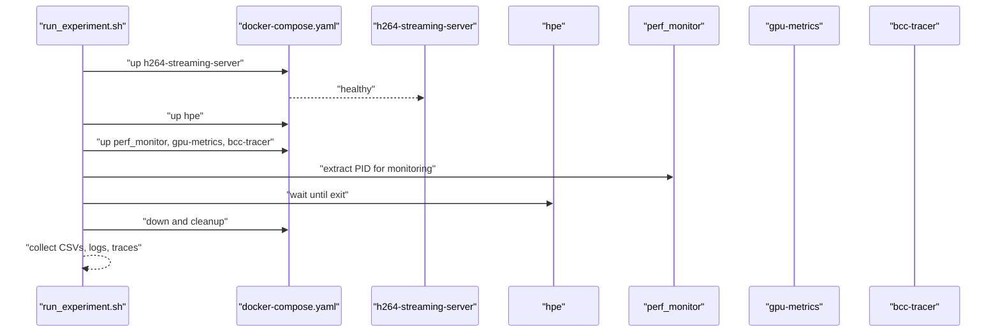
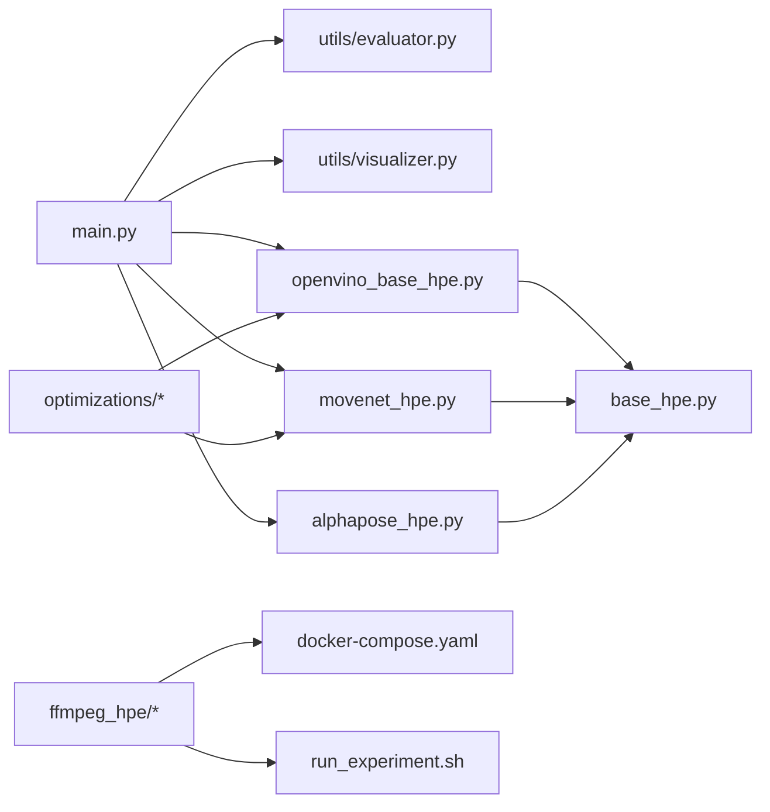

# Session Report 2026-05-06

<cite>
**Referenced Files in This Document**
- [docs/session-report-2026-05-06.md](file://docs/session-report-2026-05-06.md)
- [README.md](file://README.md)
- [main.py](file://main.py)
- [base_hpe.py](file://base_hpe.py)
- [openvino_base_hpe.py](file://openvino_base_hpe.py)
- [movenet_hpe.py](file://movenet_hpe.py)
- [alphapose_hpe.py](file://alphapose_hpe.py)
- [utils/evaluator.py](file://utils/evaluator.py)
- [utils/visualizer.py](file://utils/visualizer.py)
- [optimizations/optimized_main.py](file://optimizations/optimized_main.py)
- [optimizations/cpu_performance_optimizer.py](file://optimizations/cpu_performance_optimizer.py)
- [optimizations/enhanced_openvino_hpe.py](file://optimizations/enhanced_openvino_hpe.py)
- [ffmpeg_hpe/docker-compose.yaml](file://ffmpeg_hpe/docker-compose.yaml)
- [ffmpeg_hpe/run_experiment.sh](file://ffmpeg_hpe/run_experiment.sh)
</cite>

## Table of Contents
1. [Introduction](#introduction)
2. [Project Structure](#project-structure)
3. [Core Components](#core-components)
4. [Architecture Overview](#architecture-overview)
5. [Detailed Component Analysis](#detailed-component-analysis)
6. [Dependency Analysis](#dependency-analysis)
7. [Performance Considerations](#performance-considerations)
8. [Troubleshooting Guide](#troubleshooting-guide)
9. [Conclusion](#conclusion)
10. [Appendices](#appendices)

## Introduction
This document summarizes the audit and fixes applied to the benchmarking platform as documented in the session report dated 2026-05-06. It consolidates the branch history, identifies and resolves 21 critical bugs across monitoring, plotting, orchestration, and Docker configurations, and clarifies the TX/RX measurement architecture. It also outlines the HPE pipeline, CPU optimization strategies, and experiment rig usage.

## Project Structure
The repository combines:
- An HPE inference library supporting five backends (MoveNet, AlphaPose, OpenPose, HigherHRNet, EfficientHRNet)
- A performance benchmarking platform built with Docker Compose and eBPF/BCC tracing
- CPU optimization tools tailored for 4-vCPU AMD EPYC environments

**Diagram sources**
- [README.md:20-44](file://README.md#L20-L44)
- [main.py:10-14](file://main.py#L10-L14)
- [base_hpe.py:88-200](file://base_hpe.py#L88-L200)
- [openvino_base_hpe.py:55-93](file://openvino_base_hpe.py#L55-L93)
- [movenet_hpe.py:12-27](file://movenet_hpe.py#L12-L27)
- [alphapose_hpe.py:33-56](file://alphapose_hpe.py#L33-L56)
- [utils/evaluator.py:11-47](file://utils/evaluator.py#L11-L47)
- [utils/visualizer.py:4-49](file://utils/visualizer.py#L4-L49)
- [optimizations/optimized_main.py:19-26](file://optimizations/optimized_main.py#L19-L26)
- [ffmpeg_hpe/docker-compose.yaml:1-205](file://ffmpeg_hpe/docker-compose.yaml#L1-L205)
- [ffmpeg_hpe/run_experiment.sh:1-279](file://ffmpeg_hpe/run_experiment.sh#L1-L279)

**Section sources**
- [README.md:20-44](file://README.md#L20-L44)
- [README.md:209-327](file://README.md#L209-L327)
- [ffmpeg_hpe/docker-compose.yaml:1-205](file://ffmpeg_hpe/docker-compose.yaml#L1-L205)
- [ffmpeg_hpe/run_experiment.sh:1-279](file://ffmpeg_hpe/run_experiment.sh#L1-L279)

## Core Components
- HPE backends:
  - OpenVINO-based: OpenPose, HigherHRNet, EfficientHRNet variants
  - MoveNet (CPU-only)
  - AlphaPose (PyTorch + YOLO detector)
- Base pipeline: input detection, model loading, main loop, inference, postprocessing, rendering, and COCO serialization
- Benchmarking platform: orchestrated via Docker Compose with streaming server, HPE container, perf monitor, GPU metrics, and optional BCC tracer
- CPU optimization: automatic thread/stream tuning for 4-vCPU EPYC, NUMA-aware configuration, and system-level hints

**Section sources**
- [README.md:20-44](file://README.md#L20-L44)
- [base_hpe.py:88-200](file://base_hpe.py#L88-L200)
- [openvino_base_hpe.py:55-93](file://openvino_base_hpe.py#L55-L93)
- [movenet_hpe.py:12-27](file://movenet_hpe.py#L12-L27)
- [alphapose_hpe.py:33-56](file://alphapose_hpe.py#L33-L56)
- [utils/evaluator.py:11-47](file://utils/evaluator.py#L11-L47)
- [optimizations/cpu_performance_optimizer.py:34-484](file://optimizations/cpu_performance_optimizer.py#L34-L484)

## Architecture Overview
The benchmarking platform runs a live H.264 HTTP stream served by a dedicated container, feeds it into the HPE container, and collects CPU/GPU/network metrics via sidecars. The TX measurement uses bpftrace in-process tracing; RX measurement uses BCC socket filtering in a shared network namespace.

**Diagram sources**
- [ffmpeg_hpe/docker-compose.yaml:2-205](file://ffmpeg_hpe/docker-compose.yaml#L2-L205)
- [README.md:213-235](file://README.md#L213-L235)

**Section sources**
- [README.md:213-235](file://README.md#L213-L235)
- [ffmpeg_hpe/docker-compose.yaml:2-205](file://ffmpeg_hpe/docker-compose.yaml#L2-L205)

## Detailed Component Analysis

### Benchmarking Platform Audit and Fixes
- Branch history and comparison: `perf-tuning-base` is a streamlined rewrite of `cuda-dev`, with reduced features and environment-driven OpenVINO tuning.
- 21 issues identified and resolved across:
  - BCC RX tracer IP/port filter disabled
  - Hardcoded paths in plotting scripts
  - Column name mismatches in GPU plots
  - Docker build context hardcoding
  - Wrong service name references
  - Double-writing in monitor_pid.sh
  - Unreachable GPU metrics cleanup
  - CPU% averaging vs instantaneous sampling
  - Incorrect perf_monitor and BCC tracer filenames
  - HPE output collection and results directory naming
  - Startup timer ordering and argument defaults
  - PID file parsing and exit code checks
  - Missing container_name and VIDEO_FILE defaults
  - Validation script sync for BCC experiments

**Diagram sources**
- [docs/session-report-2026-05-06.md:91-181](file://docs/session-report-2026-05-06.md#L91-L181)
- [ffmpeg_hpe/run_experiment.sh:125-279](file://ffmpeg_hpe/run_experiment.sh#L125-L279)
- [ffmpeg_hpe/docker-compose.yaml:14-18](file://ffmpeg_hpe/docker-compose.yaml#L14-L18)

**Section sources**
- [docs/session-report-2026-05-06.md:47-86](file://docs/session-report-2026-05-06.md#L47-L86)
- [docs/session-report-2026-05-06.md:89-181](file://docs/session-report-2026-05-06.md#L89-L181)
- [ffmpeg_hpe/run_experiment.sh:125-279](file://ffmpeg_hpe/run_experiment.sh#L125-L279)
- [ffmpeg_hpe/docker-compose.yaml:14-18](file://ffmpeg_hpe/docker-compose.yaml#L14-L18)

### TX vs RX Measurement Architecture
- TX (HPE → outside): bpftrace sys_enter_sendto in perf_monitor filters by PID of the HPE process.
- RX (stream → HPE): bcc-tracer filters by streamer IP and port on eth0; runs in a container sharing HPE’s network namespace.
- Never use RX from network_stats.csv; use traces/bcc/hpe_video_rx.csv for RX.

**Diagram sources**
- [README.md:328-357](file://README.md#L328-L357)
- [docs/session-report-2026-05-06.md:184-197](file://docs/session-report-2026-05-06.md#L184-L197)

**Section sources**
- [README.md:328-357](file://README.md#L328-L357)
- [docs/session-report-2026-05-06.md:184-197](file://docs/session-report-2026-05-06.md#L184-L197)

### HPE Pipeline and Backends
- Base pipeline: input routing, model loading, main loop, inference, postprocessing, rendering, and COCO output.
- Backends:
  - OpenVINOBaseHPE: configurable threads, streams, performance mode; loads OpenVINO models and applies postprocessing.
  - MoveNetHPE: CPU-only, loads FP32 model, postprocesses detections.
  - AlphaPoseHPE: PyTorch + YOLO detector; performs GPU-accelerated detection and pose estimation.

**Diagram sources**
- [base_hpe.py:88-630](file://base_hpe.py#L88-L630)
- [openvino_base_hpe.py:55-395](file://openvino_base_hpe.py#L55-L395)
- [movenet_hpe.py:12-111](file://movenet_hpe.py#L12-L111)
- [alphapose_hpe.py:33-334](file://alphapose_hpe.py#L33-L334)

**Section sources**
- [base_hpe.py:88-630](file://base_hpe.py#L88-L630)
- [openvino_base_hpe.py:55-395](file://openvino_base_hpe.py#L55-L395)
- [movenet_hpe.py:12-111](file://movenet_hpe.py#L12-L111)
- [alphapose_hpe.py:33-334](file://alphapose_hpe.py#L33-L334)

### CPU Optimization and Orchestration
- Optimized main entry point supports CPU tuning flags and benchmarks.
- EPIC CPU Optimizer auto-detects CPU topology and applies NUMA-aware thread/stream configuration.
- Enhanced OpenVINO HPE integrates the optimizer into model loading and configuration.

**Diagram sources**
- [optimizations/optimized_main.py:39-124](file://optimizations/optimized_main.py#L39-L124)
- [optimizations/cpu_performance_optimizer.py:487-506](file://optimizations/cpu_performance_optimizer.py#L487-L506)
- [optimizations/enhanced_openvino_hpe.py:77-131](file://optimizations/enhanced_openvino_hpe.py#L77-L131)

**Section sources**
- [optimizations/optimized_main.py:39-124](file://optimizations/optimized_main.py#L39-L124)
- [optimizations/cpu_performance_optimizer.py:34-484](file://optimizations/cpu_performance_optimizer.py#L34-L484)
- [optimizations/enhanced_openvino_hpe.py:25-131](file://optimizations/enhanced_openvino_hpe.py#L25-L131)

### Experiment Rigs and Orchestration
- `ffmpeg_hpe/run_experiment.sh` orchestrates the full lifecycle: healthchecks, PID extraction, monitoring, result collection, and cleanup.
- `docker-compose.yaml` defines services, resource limits, GPU runtime, and network namespaces for accurate RX tracing.

**Diagram sources**
- [ffmpeg_hpe/run_experiment.sh:77-279](file://ffmpeg_hpe/run_experiment.sh#L77-L279)
- [ffmpeg_hpe/docker-compose.yaml:2-205](file://ffmpeg_hpe/docker-compose.yaml#L2-L205)

**Section sources**
- [ffmpeg_hpe/run_experiment.sh:77-279](file://ffmpeg_hpe/run_experiment.sh#L77-L279)
- [ffmpeg_hpe/docker-compose.yaml:2-205](file://ffmpeg_hpe/docker-compose.yaml#L2-L205)

## Dependency Analysis
- main.py depends on backend implementations and evaluation utilities.
- Backends inherit from BaseHPE and implement load_model(), run_model(), and postprocess().
- Optimizations integrate with OpenVINO properties and environment variables.
- Benchmarking relies on Docker Compose service dependencies and shared network namespaces.

**Diagram sources**
- [main.py:10-14](file://main.py#L10-L14)
- [utils/evaluator.py:11-47](file://utils/evaluator.py#L11-L47)
- [utils/visualizer.py:4-49](file://utils/visualizer.py#L4-L49)
- [openvino_base_hpe.py:55-93](file://openvino_base_hpe.py#L55-L93)
- [movenet_hpe.py:12-27](file://movenet_hpe.py#L12-L27)
- [alphapose_hpe.py:33-56](file://alphapose_hpe.py#L33-L56)
- [optimizations/optimized_main.py:19-26](file://optimizations/optimized_main.py#L19-L26)
- [ffmpeg_hpe/docker-compose.yaml:1-205](file://ffmpeg_hpe/docker-compose.yaml#L1-L205)
- [ffmpeg_hpe/run_experiment.sh:1-279](file://ffmpeg_hpe/run_experiment.sh#L1-L279)

**Section sources**
- [main.py:10-14](file://main.py#L10-L14)
- [openvino_base_hpe.py:55-93](file://openvino_base_hpe.py#L55-L93)
- [movenet_hpe.py:12-27](file://movenet_hpe.py#L12-L27)
- [alphapose_hpe.py:33-56](file://alphapose_hpe.py#L33-L56)
- [optimizations/optimized_main.py:19-26](file://optimizations/optimized_main.py#L19-L26)
- [ffmpeg_hpe/docker-compose.yaml:1-205](file://ffmpeg_hpe/docker-compose.yaml#L1-L205)
- [ffmpeg_hpe/run_experiment.sh:1-279](file://ffmpeg_hpe/run_experiment.sh#L1-L279)

## Performance Considerations
- CPU tuning for 4-vCPU EPYC: NUMA-aware thread allocation, streams, and performance hints; validated via benchmarking script.
- OpenVINO configuration: environment-driven tuning (threads, streams, performance mode) with safe defaults.
- Monitoring cadence: 500ms sampling for CPU/GPU/network metrics; RX via BCC socket filter; TX via bpftrace PID filter.
- Resource limits: CPU and memory caps defined in compose files to prevent noisy-neighbor effects.

[No sources needed since this section provides general guidance]

## Troubleshooting Guide
Common issues and resolutions:
- BCC RX filter disabled: re-enable IP/port filter to avoid counting all TCP traffic.
- Plotting scripts with hardcoded paths: updated to accept CSV path and save PNG alongside.
- GPU plot column mismatch: align column names with nvidia-smi output.
- Docker build context: change from hardcoded path to relative context.
- Service name mismatch: ensure scripts reference `bcc-tracer` instead of commented-out `trace_container`.
- Double writing in monitor_pid.sh: remove direct write; rely on flock/cat only.
- Unreachable GPU metrics cleanup: move cleanup to EXIT trap before exec.
- CPU% lifetime average: replace pidstat with `/proc/stat` deltas for 500ms intervals.
- Incorrect filenames: perf_monitor outputs `perf_metrics.csv`, `pid_metrics.csv`, `network_stats.csv`; BCC tracer outputs `hpe_video_rx.csv`.
- HPE output collection: copy CSV/JSON from host path after container exit.
- Startup timer order: capture start time before `docker compose up`.
- Default HPE_METHOD: default to `movenet` to avoid crashes on no-arg runs.
- PID file parsing: use `pgrep -f "python.*main.py"` for reliable PID extraction.
- Exit code checks: log and distinguish crash vs clean exit.
- Missing container_name: add `container_name: perf_monitor` for predictable names.
- VIDEO_FILE default: set fallback for FFmpeg input.

**Section sources**
- [docs/session-report-2026-05-06.md:101-181](file://docs/session-report-2026-05-06.md#L101-L181)
- [ffmpeg_hpe/run_experiment.sh:125-279](file://ffmpeg_hpe/run_experiment.sh#L125-L279)
- [ffmpeg_hpe/docker-compose.yaml:14-18](file://ffmpeg_hpe/docker-compose.yaml#L14-L18)

## Conclusion
The benchmarking platform audit and fixes restore accurate RX/TX measurements, improve orchestration reliability, and standardize monitoring outputs. The TX/RX tool split is now clearly documented, and the platform consistently collects CPU, GPU, and network telemetry. CPU optimization modules provide practical tuning for 4-vCPU EPYC environments, enabling reproducible performance comparisons.

[No sources needed since this section summarizes without analyzing specific files]

## Appendices

### HPE Inference Code TODOs (Open)
- MoveNet: apply keypoint-level score filtering to body score.
- AlphaPose: derive bounding boxes from YOLO detector output, not keypoints.
- OpenVINOBaseHPE: guard potential unbound `results` variable in run_model().
- Export utilities: ensure global accumulator reset between runs.
- Visualizer: verify keypoint coloring correctness beyond MoveNet.

**Section sources**
- [docs/session-report-2026-05-06.md:77-86](file://docs/session-report-2026-05-06.md#L77-L86)
- [openvino_base_hpe.py:262-276](file://openvino_base_hpe.py#L262-L276)
- [utils/evaluator.py:77-84](file://utils/evaluator.py#L77-L84)
- [utils/visualizer.py:26-35](file://utils/visualizer.py#L26-L35)