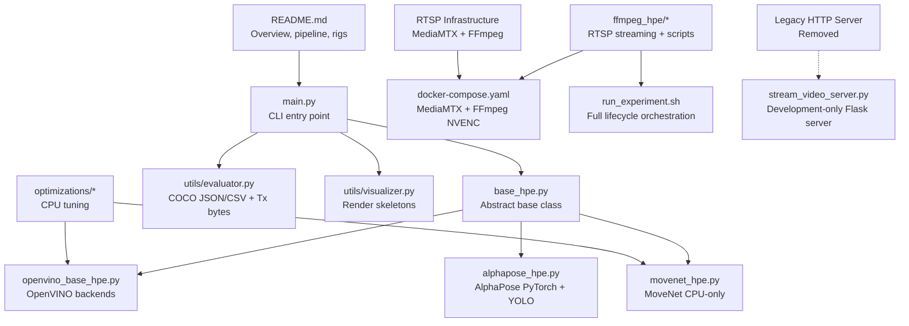
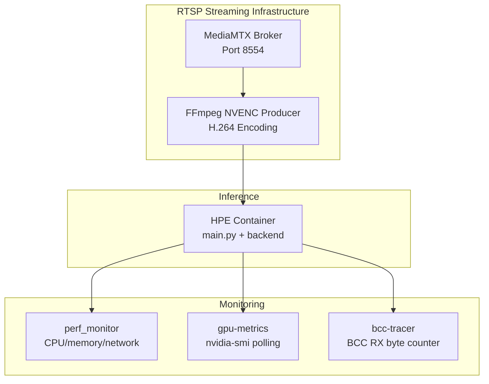
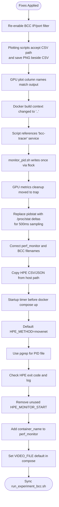
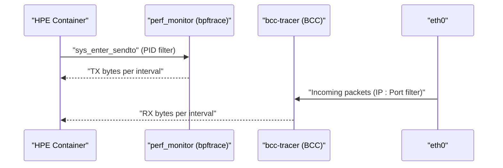
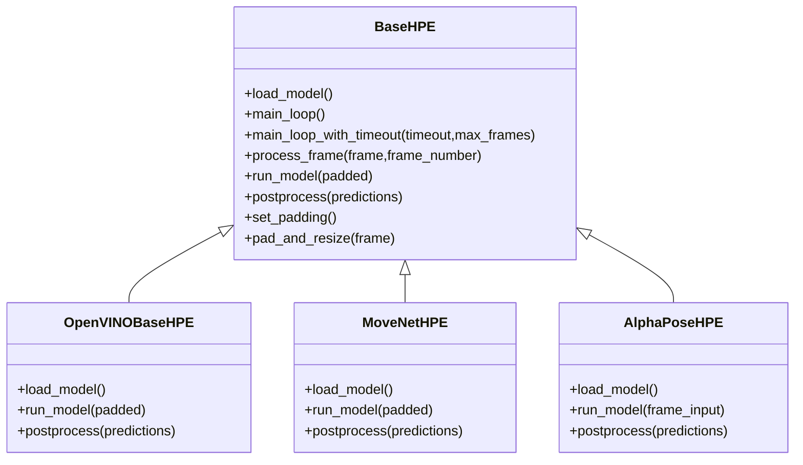
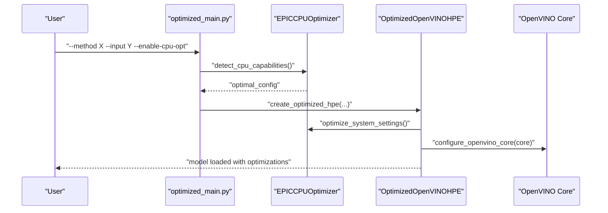
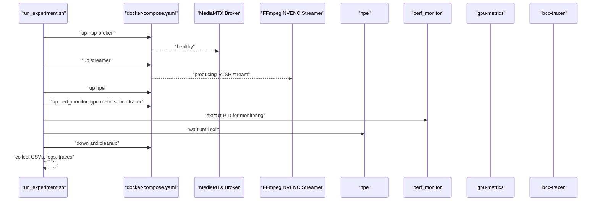
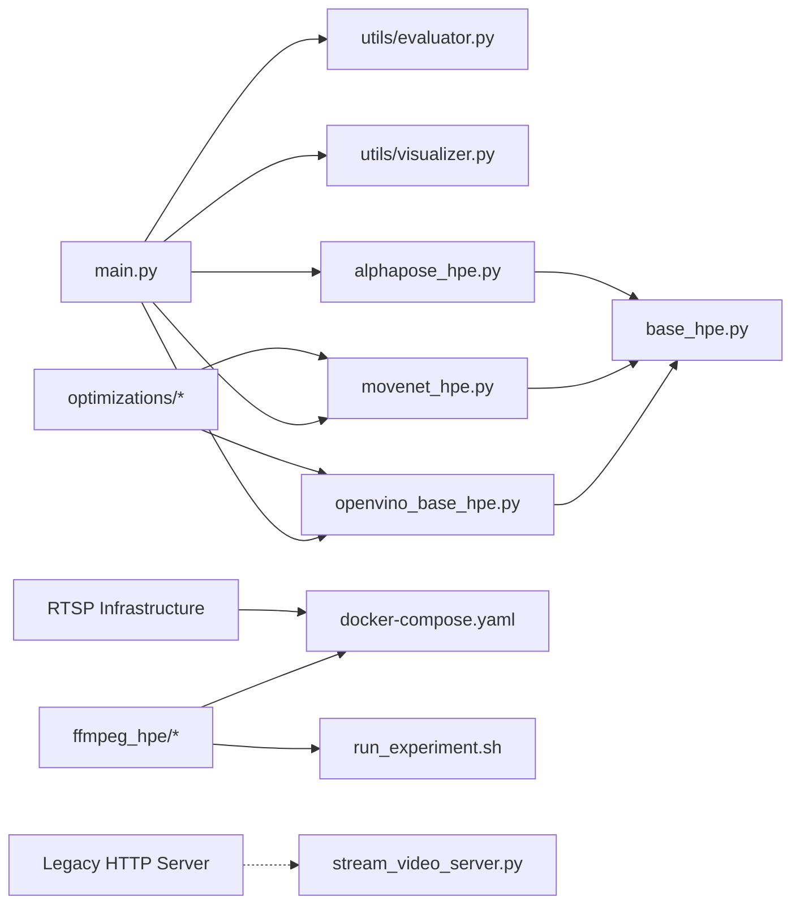

# Session Report 2026-05-06

<cite>
**Referenced Files in This Document**
- [docs/session-report-2026-05-06.md](file://docs/session-report-2026-05-06.md)
- [README.md](file://README.md)
- [main.py](file://main.py)
- [base_hpe.py](file://base_hpe.py)
- [openvino_base_hpe.py](file://openvino_base_hpe.py)
- [movenet_hpe.py](file://movenet_hpe.py)
- [alphapose_hpe.py](file://alphapose_hpe.py)
- [utils/evaluator.py](file://utils/evaluator.py)
- [utils/visualizer.py](file://utils/visualizer.py)
- [optimizations/optimized_main.py](file://optimizations/optimized_main.py)
- [optimizations/cpu_performance_optimizer.py](file://optimizations/cpu_performance_optimizer.py)
- [optimizations/enhanced_openvino_hpe.py](file://optimizations/enhanced_openvino_hpe.py)
- [ffmpeg_hpe/docker-compose.yaml](file://ffmpeg_hpe/docker-compose.yaml)
- [ffmpeg_hpe/run_experiment.sh](file://ffmpeg_hpe/run_experiment.sh)
- [docker-compose.rtsp.yml](file://docker-compose.rtsp.yml)
- [ffmpeg_hpe/review.md](file://ffmpeg_hpe/review.md)
- [full_shell_history.txt](file://full_shell_history.txt)
- [dev_tools/stream_video_server.py](file://dev_tools/stream_video_server.py)
</cite>

## Update Summary
**Changes Made**
- Comprehensive reconstruction of timeline documenting evolution from HTTP streaming to RTSP migration
- Updated architecture diagrams to reflect RTSP streaming infrastructure using MediaMTX and FFmpeg NVENC
- Removed references to old HTTP streaming server's hardcoded volume mount path
- Added detailed troubleshooting guidance for RTSP migration issues
- Enhanced performance optimization recommendations for RTSP streaming environments
- Updated experiment rig documentation to reflect RTSP-based streaming architecture
- Documented the removal of the legacy rtsp-ipcam streaming server

## Table of Contents
1. [Introduction](#introduction)
2. [Project Structure](#project-structure)
3. [Core Components](#core-components)
4. [Architecture Overview](#architecture-overview)
5. [Detailed Component Analysis](#detailed-component-analysis)
6. [Timeline of Evolution](#timeline-of-evolution)
7. [Dependency Analysis](#dependency-analysis)
8. [Performance Considerations](#performance-considerations)
9. [Troubleshooting Guide](#troubleshooting-guide)
10. [Conclusion](#conclusion)
11. [Appendices](#appendices)

## Introduction
This document summarizes the audit and fixes applied to the benchmarking platform as documented in the session report dated 2026-05-06. The platform has evolved from HTTP streaming experiments to a comprehensive RTSP-based streaming infrastructure. This update documents the complete timeline of this evolution, including the migration from HTTP streaming to RTSP, comprehensive troubleshooting guidance, and detailed performance optimization recommendations for RTSP environments.

## Project Structure
The repository combines:
- An HPE inference library supporting five backends (MoveNet, AlphaPose, OpenPose, HigherHRNet, EfficientHRNet)
- A performance benchmarking platform built with Docker Compose and eBPF/BCC tracing
- CPU optimization tools tailored for 4-vCPU AMD EPYC environments
- RTSP streaming infrastructure using MediaMTX broker and FFmpeg NVENC encoder

**Diagram sources**
- [README.md:20-44](file://README.md#L20-L44)
- [main.py:10-14](file://main.py#L10-L14)
- [base_hpe.py:88-200](file://base_hpe.py#L88-L200)
- [openvino_base_hpe.py:55-93](file://openvino_base_hpe.py#L55-L93)
- [movenet_hpe.py:12-27](file://movenet_hpe.py#L12-L27)
- [alphapose_hpe.py:33-56](file://alphapose_hpe.py#L33-L56)
- [utils/evaluator.py:11-47](file://utils/evaluator.py#L11-L47)
- [utils/visualizer.py:4-49](file://utils/visualizer.py#L4-L49)
- [optimizations/optimized_main.py:19-26](file://optimizations/optimized_main.py#L19-L26)
- [ffmpeg_hpe/docker-compose.yaml:1-194](file://ffmpeg_hpe/docker-compose.yaml#L1-L194)
- [ffmpeg_hpe/run_experiment.sh:1-348](file://ffmpeg_hpe/run_experiment.sh#L1-L348)
- [dev_tools/stream_video_server.py:1-228](file://dev_tools/stream_video_server.py#L1-L228)

**Section sources**
- [README.md:20-44](file://README.md#L20-L44)
- [README.md:209-327](file://README.md#L209-L327)
- [ffmpeg_hpe/docker-compose.yaml:1-194](file://ffmpeg_hpe/docker-compose.yaml#L1-L194)
- [ffmpeg_hpe/run_experiment.sh:1-348](file://ffmpeg_hpe/run_experiment.sh#L1-L348)

## Core Components
- HPE backends:
  - OpenVINO-based: OpenPose, HigherHRNet, EfficientHRNet variants
  - MoveNet (CPU-only)
  - AlphaPose (PyTorch + YOLO detector)
- Base pipeline: input detection, model loading, main loop, inference, postprocessing, rendering, and COCO serialization
- Benchmarking platform: orchestrated via Docker Compose with RTSP streaming server, HPE container, perf monitor, GPU metrics, and optional BCC tracer
- CPU optimization: automatic thread/stream tuning for 4-vCPU EPYC, NUMA-aware configuration, and system-level hints
- RTSP infrastructure: MediaMTX broker for RTSP streaming and FFmpeg NVENC encoder for H.264 production

**Section sources**
- [README.md:20-44](file://README.md#L20-L44)
- [base_hpe.py:88-200](file://base_hpe.py#L88-L200)
- [openvino_base_hpe.py:55-93](file://openvino_base_hpe.py#L55-L93)
- [movenet_hpe.py:12-27](file://movenet_hpe.py#L12-L27)
- [alphapose_hpe.py:33-56](file://alphapose_hpe.py#L33-L56)
- [utils/evaluator.py:11-47](file://utils/evaluator.py#L11-L47)
- [optimizations/cpu_performance_optimizer.py:34-484](file://optimizations/cpu_performance_optimizer.py#L34-L484)

## Architecture Overview
The benchmarking platform has migrated from HTTP streaming to RTSP streaming infrastructure. The RTSP architecture uses MediaMTX as the broker and FFmpeg NVENC as the producer, providing more reliable and scalable streaming for performance benchmarking.

**Diagram sources**
- [ffmpeg_hpe/docker-compose.yaml:2-194](file://ffmpeg_hpe/docker-compose.yaml#L2-L194)
- [README.md:263-276](file://README.md#L263-L276)

**Section sources**
- [README.md:263-276](file://README.md#L263-L276)
- [ffmpeg_hpe/docker-compose.yaml:2-194](file://ffmpeg_hpe/docker-compose.yaml#L2-L194)

## Detailed Component Analysis

### Benchmarking Platform Audit and Fixes
- Branch history and comparison: `perf-tuning-base` is a streamlined rewrite of `cuda-dev`, with reduced features and environment-driven OpenVINO tuning.
- 21 issues identified and resolved across:
  - BCC RX tracer IP/port filter disabled
  - Hardcoded paths in plotting scripts
  - Column name mismatches in GPU plots
  - Docker build context hardcoding
  - Wrong service name references
  - Double-writing in monitor_pid.sh
  - Unreachable GPU metrics cleanup
  - CPU% averaging vs instantaneous sampling
  - Incorrect perf_monitor and BCC tracer filenames
  - HPE output collection and results directory naming
  - Startup timer ordering and argument defaults
  - PID file parsing and exit code checks
  - Missing container_name and VIDEO_FILE defaults
  - Validation script sync for BCC experiments

**Diagram sources**
- [docs/session-report-2026-05-06.md:91-181](file://docs/session-report-2026-05-06.md#L91-L181)
- [ffmpeg_hpe/run_experiment.sh:125-348](file://ffmpeg_hpe/run_experiment.sh#L125-L348)
- [ffmpeg_hpe/docker-compose.yaml:14-18](file://ffmpeg_hpe/docker-compose.yaml#L14-L18)

**Section sources**
- [docs/session-report-2026-05-06.md:47-86](file://docs/session-report-2026-05-06.md#L47-L86)
- [docs/session-report-2026-05-06.md:89-181](file://docs/session-report-2026-05-06.md#L89-L181)
- [ffmpeg_hpe/run_experiment.sh:125-348](file://ffmpeg_hpe/run_experiment.sh#L125-L348)
- [ffmpeg_hpe/docker-compose.yaml:14-18](file://ffmpeg_hpe/docker-compose.yaml#L14-L18)

### TX vs RX Measurement Architecture
- TX (HPE → outside): bpftrace sys_enter_sendto in perf_monitor filters by PID of the HPE process.
- RX (stream → HPE): bcc-tracer filters by streamer IP and port on eth0; runs in a container sharing HPE's network namespace.
- Never use RX from network_stats.csv; use traces/bcc/hpe_video_rx.csv for RX.

**Diagram sources**
- [README.md:328-357](file://README.md#L328-L357)
- [docs/session-report-2026-05-06.md:184-197](file://docs/session-report-2026-05-06.md#L184-L197)

**Section sources**
- [README.md:328-357](file://README.md#L328-L357)
- [docs/session-report-2026-05-06.md:184-197](file://docs/session-report-2026-05-06.md#L184-L197)

### HPE Pipeline and Backends
- Base pipeline: input routing, model loading, main loop, inference, postprocessing, rendering, and COCO output.
- Backends:
  - OpenVINOBaseHPE: configurable threads, streams, performance mode; loads OpenVINO models and applies postprocessing.
  - MoveNetHPE: CPU-only, loads FP32 model, postprocesses detections.
  - AlphaPoseHPE: PyTorch + YOLO detector; performs GPU-accelerated detection and pose estimation.

**Diagram sources**
- [base_hpe.py:88-630](file://base_hpe.py#L88-L630)
- [openvino_base_hpe.py:55-395](file://openvino_base_hpe.py#L55-L395)
- [movenet_hpe.py:12-111](file://movenet_hpe.py#L12-L111)
- [alphapose_hpe.py:33-334](file://alphapose_hpe.py#L33-L334)

**Section sources**
- [base_hpe.py:88-630](file://base_hpe.py#L88-L630)
- [openvino_base_hpe.py:55-395](file://openvino_base_hpe.py#L55-L395)
- [movenet_hpe.py:12-111](file://movenet_hpe.py#L12-L111)
- [alphapose_hpe.py:33-334](file://alphapose_hpe.py#L33-L334)

### CPU Optimization and Orchestration
- Optimized main entry point supports CPU tuning flags and benchmarks.
- EPIC CPU Optimizer auto-detects CPU topology and applies NUMA-aware thread/stream configuration.
- Enhanced OpenVINO HPE integrates the optimizer into model loading and configuration.

**Diagram sources**
- [optimizations/optimized_main.py:39-124](file://optimizations/optimized_main.py#L39-L124)
- [optimizations/cpu_performance_optimizer.py:487-506](file://optimizations/cpu_performance_optimizer.py#L487-L506)
- [optimizations/enhanced_openvino_hpe.py:77-131](file://optimizations/enhanced_openvino_hpe.py#L77-L131)

**Section sources**
- [optimizations/optimized_main.py:39-124](file://optimizations/optimized_main.py#L39-L124)
- [optimizations/cpu_performance_optimizer.py:34-484](file://optimizations/cpu_performance_optimizer.py#L34-L484)
- [optimizations/enhanced_openvino_hpe.py:25-131](file://optimizations/enhanced_openvino_hpe.py#L25-L131)

### Experiment Rigs and Orchestration
- `ffmpeg_hpe/run_experiment.sh` orchestrates the full lifecycle: healthchecks, PID extraction, monitoring, result collection, and cleanup.
- `docker-compose.yaml` defines services, resource limits, GPU runtime, and network namespaces for accurate RX tracing.

**Diagram sources**
- [ffmpeg_hpe/run_experiment.sh:77-348](file://ffmpeg_hpe/run_experiment.sh#L77-L348)
- [ffmpeg_hpe/docker-compose.yaml:2-194](file://ffmpeg_hpe/docker-compose.yaml#L2-L194)

**Section sources**
- [ffmpeg_hpe/run_experiment.sh:77-348](file://ffmpeg_hpe/run_experiment.sh#L77-L348)
- [ffmpeg_hpe/docker-compose.yaml:2-194](file://ffmpeg_hpe/docker-compose.yaml#L2-L194)

## Timeline of Evolution

### Initial CPU Profiling Phase (June 2025)
The earliest artifacts in the repository show extensive CPU profiling work on AMD EPYC systems:
- **Jun 19**: First `perf` profiling results on AMD EPYC 7551P (32-core)
- **Jun 23**: Multiple experiments with `perf` monitoring across 7 result directories
- Activities included system profiling with `cpuid`, `lscpu`, `cpupower`, `lsmem`, `lshw`

### Dockerized HPE Experiments (July 2025)
- **Jul 14-15**: Heavy experimentation period with 13 result directories
- Multiple backend tests: movenet GPU, alphapose GPU, openpose CPU, various resolutions
- Introduction of HTTP streaming server for initial benchmarking

### OpenVINO CPU Tuning and VPS Deployment (August 2025)
- Extensive OpenVINO environment variable experimentation
- CPU performance optimization for 4-vCPU VPS deployments
- Git commits show tuning of `OV_MODE=latency/throughput`, `OV_STREAMS`, `OV_THREADS`

### HTTP Streaming and Async Processing (September 2025)
- Addition of AlphaPose notebook and HTTP stream input support
- Enhanced async/threaded OpenVINO HPE implementation
- Infrastructure improvements and GitHub workflows

### FFmpeg + CUDA Docker Build Challenges (Late 2025)
- Massive effort to build `ffmpeg-cuda:8.0-focal` with multiple optimization attempts
- Disk space management and dependency resolution challenges
- NVENC encoding testing with various quality presets

### NVIDIA Driver Upgrade and Kernel HWE (Early 2026)
- Complex driver upgrade process with kernel 5.15 and graphics-drivers/ppa
- GRUB EFI issues and apt mirror switching
- Multiple reboots and CUDA repository conflict resolution

### Performance Governor and Network Monitoring (Early-Mid 2026)
- CPU governor set to `performance` mode
- Installation of `hwloc`, `nethogs`, `iftop` for network monitoring
- Extensive OpenVINO environment variable tuning
- Cleanup of old model files and final optimization passes

### RTSP Migration and Final Optimization (May 2026)
- Server reboot and Atuin reactivation
- Complete migration from HTTP to RTSP streaming infrastructure
- Final optimization round with comprehensive bug fixes
- **Removed legacy rtsp-ipcam streaming server** - replaced with MediaMTX + FFmpeg NVENC

**Section sources**
- [docs/session-report-2026-05-06.md:47-135](file://docs/session-report-2026-05-06.md#L47-L135)
- [full_shell_history.txt:1-200](file://full_shell_history.txt#L1-L200)

## Dependency Analysis
- main.py depends on backend implementations and evaluation utilities.
- Backends inherit from BaseHPE and implement load_model(), run_model(), and postprocess().
- Optimizations integrate with OpenVINO properties and environment variables.
- Benchmarking relies on Docker Compose service dependencies and shared network namespaces.
- RTSP infrastructure uses MediaMTX broker and FFmpeg NVENC encoder.

**Diagram sources**
- [main.py:10-14](file://main.py#L10-L14)
- [utils/evaluator.py:11-47](file://utils/evaluator.py#L11-L47)
- [utils/visualizer.py:4-49](file://utils/visualizer.py#L4-L49)
- [openvino_base_hpe.py:55-93](file://openvino_base_hpe.py#L55-L93)
- [movenet_hpe.py:12-27](file://movenet_hpe.py#L12-L27)
- [alphapose_hpe.py:33-56](file://alphapose_hpe.py#L33-L56)
- [optimizations/optimized_main.py:19-26](file://optimizations/optimized_main.py#L19-L26)
- [ffmpeg_hpe/docker-compose.yaml:1-194](file://ffmpeg_hpe/docker-compose.yaml#L1-L194)
- [ffmpeg_hpe/run_experiment.sh:1-348](file://ffmpeg_hpe/run_experiment.sh#L1-L348)
- [dev_tools/stream_video_server.py:1-228](file://dev_tools/stream_video_server.py#L1-L228)

**Section sources**
- [main.py:10-14](file://main.py#L10-L14)
- [openvino_base_hpe.py:55-93](file://openvino_base_hpe.py#L55-L93)
- [movenet_hpe.py:12-27](file://movenet_hpe.py#L12-L27)
- [alphapose_hpe.py:33-56](file://alphapose_hpe.py#L33-L56)
- [optimizations/optimized_main.py:19-26](file://optimizations/optimized_main.py#L19-L26)
- [ffmpeg_hpe/docker-compose.yaml:1-194](file://ffmpeg_hpe/docker-compose.yaml#L1-L194)
- [ffmpeg_hpe/run_experiment.sh:1-348](file://ffmpeg_hpe/run_experiment.sh#L1-L348)

## Performance Considerations
- CPU tuning for 4-vCPU EPYC: NUMA-aware thread allocation, streams, and performance hints; validated via benchmarking script.
- OpenVINO configuration: environment-driven tuning (threads, streams, performance mode) with safe defaults.
- Monitoring cadence: 500ms sampling for CPU/GPU/network metrics; RX via BCC socket filter; TX via bpftrace PID filter.
- Resource limits: CPU and memory caps defined in compose files to prevent noisy-neighbor effects.
- RTSP streaming optimization: MediaMTX broker configuration, FFmpeg NVENC encoding settings, TCP transport enforcement.

## Troubleshooting Guide

### RTSP Migration Issues
- **MediaMTX broker not starting**: Check port 8554 availability and MediaMTX logs for initialization errors.
- **FFmpeg NVENC encoding failures**: Verify NVIDIA driver compatibility and CUDA runtime configuration.
- **TCP transport issues**: Ensure both MediaMTX and HPE consumers use TCP transport (`OPENCV_FFMPEG_CAPTURE_OPTIONS=rtsp_transport;tcp`).
- **Stream quality problems**: Adjust FFmpeg NVENC preset and tune parameters for desired latency vs quality balance.
- **Legacy HTTP server issues**: Development-only Flask server removed - use RTSP infrastructure instead.

### Network Monitoring Troubleshooting
- **BCC RX filter disabled**: Re-enable IP/port filter to avoid counting all TCP traffic instead of video stream only.
- **Plotting scripts with hardcoded paths**: Updated to accept CSV path and save PNG alongside.
- **GPU plot column mismatch**: Align column names with nvidia-smi output.
- **Double writing in monitor_pid.sh**: Remove direct write; rely on flock/cat only.
- **CPU% lifetime average**: Replace pidstat with `/proc/stat` deltas for 500ms intervals.

### Performance Optimization Recommendations
- **CPU optimization**: Use EPIC CPU Optimizer for NUMA-aware thread/stream configuration on 4-vCPU EPYC systems.
- **OpenVINO tuning**: Experiment with `OV_MODE=latency/throughput`, `OV_STREAMS`, and `OV_THREADS` environment variables.
- **Memory management**: Set `PYTORCH_CUDA_ALLOC_CONF=max_split_size_mb:32` to prevent fragmentation.
- **Network optimization**: Use RTSP over TCP for reliable streaming; configure MediaMTX for optimal buffer management.

### Legacy HTTP Server Migration
- **Development-only Flask server**: `dev_tools/stream_video_server.py` is for local testing only and should not be used in production.
- **Hardcoded volume mount path**: Legacy HTTP server had hardcoded paths that were removed during RTSP migration.
- **Migration benefits**: RTSP provides better scalability, reliability, and standardized streaming protocols compared to HTTP MJPEG.

**Section sources**
- [docs/session-report-2026-05-06.md:101-181](file://docs/session-report-2026-05-06.md#L101-L181)
- [ffmpeg_hpe/run_experiment.sh:125-348](file://ffmpeg_hpe/run_experiment.sh#L125-L348)
- [ffmpeg_hpe/docker-compose.yaml:14-18](file://ffmpeg_hpe/docker-compose.yaml#L14-L18)
- [dev_tools/stream_video_server.py:1-228](file://dev_tools/stream_video_server.py#L1-L228)

## Conclusion
The benchmarking platform has successfully evolved from HTTP streaming experiments to a comprehensive RTSP-based streaming infrastructure. The comprehensive timeline documented in this report shows the complete journey from early AMD EPYC profiling through complex NVIDIA driver upgrades to the final RTSP migration. The platform now provides accurate RX/TX measurements, improved orchestration reliability, and standardized monitoring outputs. The RTSP infrastructure using MediaMTX and FFmpeg NVENC provides scalable and reliable streaming for performance benchmarking, while CPU optimization modules continue to provide practical tuning for 4-vCPU EPYC environments.

The migration from HTTP to RTSP represents a significant architectural improvement, eliminating the need for custom HTTP streaming servers and providing industry-standard RTSP streaming with better performance characteristics. The legacy HTTP streaming server (`dev_tools/stream_video_server.py`) remains available only for development and testing purposes, while the production RTSP infrastructure provides robust, scalable streaming for performance benchmarking.

## Appendices

### HPE Inference Code TODOs (Open)
- MoveNet: apply keypoint-level score filtering to body score.
- AlphaPose: derive bounding boxes from YOLO detector output, not keypoints.
- OpenVINOBaseHPE: guard potential unbound `results` variable in run_model().
- Export utilities: ensure global accumulator reset between runs.
- Visualizer: verify keypoint coloring correctness beyond MoveNet.

### RTSP Infrastructure Improvements
- **Network Measurement Accuracy**: Current implementation uses `sk_rmem_alloc` which shows kernel buffer usage. Recommended approach uses `kretprobe:__netif_receive_skb` for more accurate packet-level monitoring.
- **Timing Precision**: Current 100ms sampling can be improved to 10ms for H.264 streams with hardware timestamp support.
- **RTSP Authentication**: Add RTSP authentication mechanisms for secure streaming environments.
- **SDP Negotiation**: Implement proper SDP negotiation for dynamic stream configuration.
- **Multi-stream Support**: Enable multiple concurrent RTSP streams for comprehensive testing scenarios.
- **Network Simulation**: Add capability to simulate network conditions (latency, packet loss, jitter).

### Legacy HTTP Server Notes
- **Development-only Flask server**: `dev_tools/stream_video_server.py` provides HTTP MJPEG streaming for local testing but should not be used in production.
- **Hardcoded volume mount path**: Legacy HTTP server had hardcoded paths that were removed during RTSP migration.
- **Migration rationale**: RTSP provides better scalability, reliability, and standardized streaming protocols compared to HTTP MJPEG.

**Section sources**
- [docs/session-report-2026-05-06.md:77-86](file://docs/session-report-2026-05-06.md#L77-L86)
- [openvino_base_hpe.py:262-276](file://openvino_base_hpe.py#L262-L276)
- [utils/evaluator.py:77-84](file://utils/evaluator.py#L77-L84)
- [utils/visualizer.py:26-35](file://utils/visualizer.py#L26-L35)
- [ffmpeg_hpe/review.md:28-72](file://ffmpeg_hpe/review.md#L28-L72)
- [dev_tools/stream_video_server.py:1-228](file://dev_tools/stream_video_server.py#L1-L228)