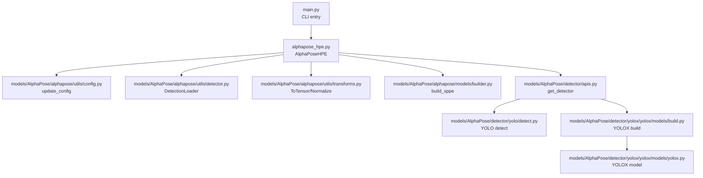
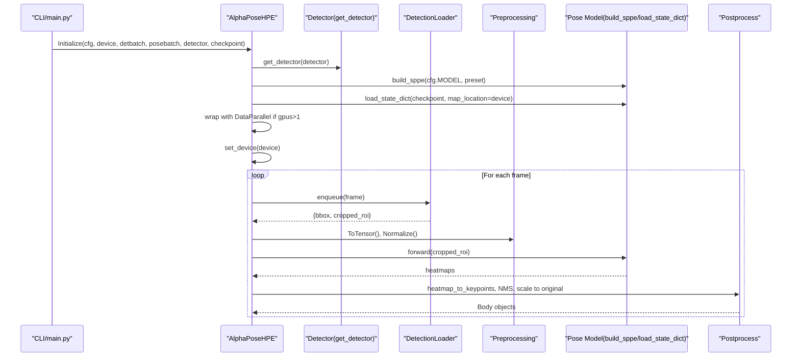
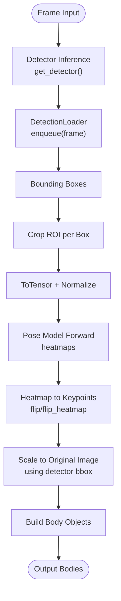
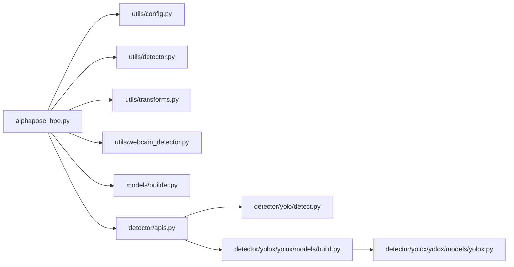

# AlphaPose Backend

<cite>
**Referenced Files in This Document**
- [alphapose_hpe.py](file://alphapose_hpe.py)
- [original.py](file://original.py)
- [base_hpe.py](file://base_hpe.py)
- [main.py](file://main.py)
- [hpe-methods.md](file://docs/hpe-methods.md)
- [bug.md](file://bug.md)
- [models/AlphaPose/alphapose/__init__.py](file://models/AlphaPose/alphapose/__init__.py)
- [models/AlphaPose/alphapose/utils/config.py](file://models/AlphaPose/alphapose/utils/config.py)
- [models/AlphaPose/alphapose/utils/detector.py](file://models/AlphaPose/alphapose/utils/detector.py)
- [models/AlphaPose/alphapose/utils/transforms.py](file://models/AlphaPose/alphapose/utils/transforms.py)
- [models/AlphaPose/alphapose/utils/webcam_detector.py](file://models/AlphaPose/alphapose/utils/webcam_detector.py)
- [models/AlphaPose/alphapose/models/builder.py](file://models/AlphaPose/alphapose/models/builder.py)
- [models/AlphaPose/detector/apis.py](file://models/AlphaPose/detector/apis.py)
- [models/AlphaPose/detector/yolo/detect.py](file://models/AlphaPose/detector/yolo/detect.py)
- [models/AlphaPose/detector/yolox/yolox/models/build.py](file://models/AlphaPose/detector/yolox/yolox/models/build.py)
- [models/AlphaPose/detector/yolox/yolox/models/yolox.py](file://models/AlphaPose/detector/yolox/yolox/models/yolox.py)
- [models/AlphaPose/pretrained_models/256x192_res50_lr1e-3_1x.yaml](file://models/AlphaPose/pretrained_models/256x192_res50_lr1e-3_1x.yaml)
- [models/AlphaPose/pretrained_models/fast_res50_256x192.pth](file://models/AlphaPose/pretrained_models/fast_res50_256x192.pth)
</cite>

## Table of Contents
1. [Introduction](#introduction)
2. [Project Structure](#project-structure)
3. [Core Components](#core-components)
4. [Architecture Overview](#architecture-overview)
5. [Detailed Component Analysis](#detailed-component-analysis)
6. [Dependency Analysis](#dependency-analysis)
7. [Performance Considerations](#performance-considerations)
8. [Troubleshooting Guide](#troubleshooting-guide)
9. [Conclusion](#conclusion)
10. [Appendices](#appendices)

## Introduction
This document explains the AlphaPose backend implementation used for top-down human pose estimation. It covers the two-stage pipeline: person detection with a YOLO-based detector followed by pose estimation with an AlphaPose model. It documents initialization parameters (detbatch, cfg, device, posebatch, detector, checkpoint), model loading, inference pipeline, device configuration, multi-GPU behavior, threading, coordinate transformation, and post-processing. It also provides troubleshooting guidance and performance optimization tips.

## Project Structure
The AlphaPose backend integrates with a shared HPE framework. The key files are:
- Allocated HPE implementation: [alphapose_hpe.py](file://alphapose_hpe.py)
- Original implementation reference: [original.py](file://original.py)
- Shared base class and types: [base_hpe.py](file://base_hpe.py)
- CLI entry and method selection: [main.py](file://main.py)
- General HPE methods overview: [hpe-methods.md](file://docs/hpe-methods.md)
- Known issues and loop/timeout diagnostics: [bug.md](file://bug.md)
- AlphaPose package entry points and model builder: [models/AlphaPose/alphapose/__init__.py](file://models/AlphaPose/alphapose/__init__.py), [models/AlphaPose/alphapose/models/builder.py](file://models/AlphaPose/alphapose/models/builder.py)
- AlphaPose utilities: [models/AlphaPose/alphapose/utils/config.py](file://models/AlphaPose/alphapose/utils/config.py), [models/AlphaPose/alphapose/utils/detector.py](file://models/AlphaPose/alphapose/utils/detector.py), [models/AlphaPose/alphapose/utils/transforms.py](file://models/AlphaPose/alphapose/utils/transforms.py), [models/AlphaPose/alphapose/utils/webcam_detector.py](file://models/AlphaPose/alphapose/utils/webcam_detector.py)
- Detector APIs and YOLO/YOLOX models: [models/AlphaPose/detector/apis.py](file://models/AlphaPose/detector/apis.py), [models/AlphaPose/detector/yolo/detect.py](file://models/AlphaPose/detector/yolo/detect.py), [models/AlphaPose/detector/yolox/yolox/models/build.py](file://models/AlphaPose/detector/yolox/yolox/models/build.py), [models/AlphaPose/detector/yolox/yolox/models/yolox.py](file://models/AlphaPose/detector/yolox/yolox/models/yolox.py)
- Default configuration and checkpoint: [models/AlphaPose/pretrained_models/256x192_res50_lr1e-3_1x.yaml](file://models/AlphaPose/pretrained_models/256x192_res50_lr1e-3_1x.yaml), [models/AlphaPose/pretrained_models/fast_res50_256x192.pth](file://models/AlphaPose/pretrained_models/fast_res50_256x192.pth)

**Diagram sources**
- [main.py](file://main.py)
- [alphapose_hpe.py](file://alphapose_hpe.py)
- [models/AlphaPose/alphapose/utils/config.py](file://models/AlphaPose/alphapose/utils/config.py)
- [models/AlphaPose/alphapose/utils/detector.py](file://models/AlphaPose/alphapose/utils/detector.py)
- [models/AlphaPose/alphapose/utils/transforms.py](file://models/AlphaPose/alphapose/utils/transforms.py)
- [models/AlphaPose/alphapose/models/builder.py](file://models/AlphaPose/alphapose/models/builder.py)
- [models/AlphaPose/detector/apis.py](file://models/AlphaPose/detector/apis.py)
- [models/AlphaPose/detector/yolo/detect.py](file://models/AlphaPose/detector/yolo/detect.py)
- [models/AlphaPose/detector/yolox/yolox/models/build.py](file://models/AlphaPose/detector/yolox/yolox/models/build.py)
- [models/AlphaPose/detector/yolox/yolox/models/yolox.py](file://models/AlphaPose/detector/yolox/yolox/models/yolox.py)

**Section sources**
- [main.py](file://main.py)
- [alphapose_hpe.py](file://alphapose_hpe.py)
- [hpe-methods.md](file://docs/hpe-methods.md)

## Core Components
- AlphaPoseHPE class encapsulates the end-to-end pipeline:
  - Initialization parameters: detbatch, cfg, device, posebatch, detector, checkpoint, gpus
  - Detector initialization via get_detector
  - Pose model construction and loading via builder.build_sppe and load_state_dict
  - Multi-GPU wrapping with DataParallel when applicable
  - Preprocessing transforms (ToTensor, Normalize)
  - Inference and post-processing to produce Body objects with keypoints and bounding boxes
- BaseHPE defines the shared interface and types (Body, Padding) used across HPE implementations.

Key implementation references:
- Initialization and model loading: [alphapose_hpe.py](file://alphapose_hpe.py)
- Base types and interface: [base_hpe.py](file://base_hpe.py)
- Method selection in CLI: [main.py](file://main.py)

**Section sources**
- [alphapose_hpe.py](file://alphapose_hpe.py)
- [base_hpe.py](file://base_hpe.py)
- [main.py](file://main.py)

## Architecture Overview
AlphaPose uses a top-down pipeline:
1. Person detection (YOLO/YOLOX) produces bounding boxes.
2. Each detected person ROI is cropped and preprocessed.
3. Pose estimation model predicts heatmaps.
4. Heatmaps are converted to keypoints and refined into Body objects.

**Diagram sources**
- [main.py](file://main.py)
- [alphapose_hpe.py](file://alphapose_hpe.py)
- [models/AlphaPose/detector/apis.py](file://models/AlphaPose/detector/apis.py)
- [models/AlphaPose/alphapose/utils/detector.py](file://models/AlphaPose/alphapose/utils/detector.py)
- [models/AlphaPose/alphapose/utils/transforms.py](file://models/AlphaPose/alphapose/utils/transforms.py)
- [models/AlphaPose/alphapose/models/builder.py](file://models/AlphaPose/alphapose/models/builder.py)

## Detailed Component Analysis

### Initialization and Parameterization
- Parameters:
  - cfg: Path to YAML configuration for AlphaPose model/preset
  - device: "GPU" or "CPU"
  - detbatch: Detection batch size
  - posebatch: Pose estimation batch size
  - detector: Detector backend identifier ("yolo", "yolox", etc.)
  - checkpoint: Path to pose model weights
  - gpus: GPU device IDs for multi-GPU (single-GPU path shown)
- Device mapping:
  - GPU: "0"
  - CPU: "-1"
- Defaults:
  - cfg defaults to a ResNet-50 preset YAML
  - checkpoint defaults to a pretrained fast_res50 weight file

Implementation references:
- Parameter defaults and device mapping: [alphapose_hpe.py](file://alphapose_hpe.py)
- CLI method selection and passing detbatch: [main.py](file://main.py)
- Default assets: [models/AlphaPose/pretrained_models/256x192_res50_lr1e-3_1x.yaml](file://models/AlphaPose/pretrained_models/256x192_res50_lr1e-3_1x.yaml), [models/AlphaPose/pretrained_models/fast_res50_256x192.pth](file://models/AlphaPose/pretrained_models/fast_res50_256x192.pth)

**Section sources**
- [alphapose_hpe.py](file://alphapose_hpe.py)
- [main.py](file://main.py)
- [models/AlphaPose/pretrained_models/256x192_res50_lr1e-3_1x.yaml](file://models/AlphaPose/pretrained_models/256x192_res50_lr1e-3_1x.yaml)
- [models/AlphaPose/pretrained_models/fast_res50_256x192.pth](file://models/AlphaPose/pretrained_models/fast_res50_256x192.pth)

### Detector Initialization and Selection
- Detector selection via get_detector
- Supported detectors include YOLO and YOLOX variants
- Detection batch size controlled by detbatch

References:
- Detector API: [models/AlphaPose/detector/apis.py](file://models/AlphaPose/detector/apis.py)
- YOLO detection entry: [models/AlphaPose/detector/yolo/detect.py](file://models/AlphaPose/detector/yolo/detect.py)
- YOLOX build and model: [models/AlphaPose/detector/yolox/yolox/models/build.py](file://models/AlphaPose/detector/yolox/yolox/models/build.py), [models/AlphaPose/detector/yolox/yolox/models/yolox.py](file://models/AlphaPose/detector/yolox/yolox/models/yolox.py)

**Section sources**
- [models/AlphaPose/detector/apis.py](file://models/AlphaPose/detector/apis.py)
- [models/AlphaPose/detector/yolo/detect.py](file://models/AlphaPose/detector/yolo/detect.py)
- [models/AlphaPose/detector/yolox/yolox/models/build.py](file://models/AlphaPose/detector/yolox/yolox/models/build.py)
- [models/AlphaPose/detector/yolox/yolox/models/yolox.py](file://models/AlphaPose/detector/yolox/yolox/models/yolox.py)

### Pose Model Loading and Configuration
- Pose model built via builder.build_sppe using MODEL and DATA_PRESET from cfg
- Weights loaded from checkpoint using map_location=device
- Optional multi-GPU wrapping with DataParallel when gpus > 1
- Model moved to device and set to eval mode

References:
- Model builder: [models/AlphaPose/alphapose/models/builder.py](file://models/AlphaPose/alphapose/models/builder.py)
- Configuration update: [models/AlphaPose/alphapose/utils/config.py](file://models/AlphaPose/alphapose/utils/config.py)

**Section sources**
- [alphapose_hpe.py](file://alphapose_hpe.py)
- [models/AlphaPose/alphapose/models/builder.py](file://models/AlphaPose/alphapose/models/builder.py)
- [models/AlphaPose/alphapose/utils/config.py](file://models/AlphaPose/alphapose/utils/config.py)

### Inference Pipeline
- Detection phase:
  - DetectionLoader enqueues frames and returns detection results (bounding boxes)
- Cropping and preprocessing:
  - Each detection yields a person ROI
  - ToTensor and Normalize applied to convert to model-ready tensors
- Pose estimation:
  - Forward pass on pose model produces heatmaps
- Post-processing:
  - Heatmap to keypoint conversion using flip/flip_heatmap utilities
  - Keypoints scaled to original image coordinates using detector-provided scaling factors
  - Body objects constructed with bounding boxes, scores, and keypoints

References:
- Detection loader and webcam detector: [models/AlphaPose/alphapose/utils/detector.py](file://models/AlphaPose/alphapose/utils/detector.py), [models/AlphaPose/alphapose/utils/webcam_detector.py](file://models/AlphaPose/alphapose/utils/webcam_detector.py)
- Transforms and heatmap utilities: [models/AlphaPose/alphapose/utils/transforms.py](file://models/AlphaPose/alphapose/utils/transforms.py)
- Coordinate conversion utilities: [models/AlphaPose/alphapose/utils/transforms.py](file://models/AlphaPose/alphapose/utils/transforms.py)

**Diagram sources**
- [models/AlphaPose/detector/apis.py](file://models/AlphaPose/detector/apis.py)
- [models/AlphaPose/alphapose/utils/detector.py](file://models/AlphaPose/alphapose/utils/detector.py)
- [models/AlphaPose/alphapose/utils/transforms.py](file://models/AlphaPose/alphapose/utils/transforms.py)
- [alphapose_hpe.py](file://alphapose_hpe.py)

**Section sources**
- [alphapose_hpe.py](file://alphapose_hpe.py)
- [models/AlphaPose/alphapose/utils/detector.py](file://models/AlphaPose/alphapose/utils/detector.py)
- [models/AlphaPose/alphapose/utils/transforms.py](file://models/AlphaPose/alphapose/utils/transforms.py)

### Device Configuration, Multi-GPU, and Threading
- Device selection:
  - "GPU" maps to device ID "0"
  - "CPU" maps to device ID "-1"
- Multi-GPU:
  - When gpus > 1, the pose model is wrapped with DataParallel and moved to device
- Threading:
  - DetectionLoader runs in a separate thread
  - Torch global threads set to a fixed value at module import

References:
- Device mapping and multi-GPU: [alphapose_hpe.py](file://alphapose_hpe.py)
- Detection thread and loader: [models/AlphaPose/alphapose/utils/detector.py](file://models/AlphaPose/alphapose/utils/detector.py)
- Torch thread setting: [alphapose_hpe.py](file://alphapose_hpe.py)

**Section sources**
- [alphapose_hpe.py](file://alphapose_hpe.py)
- [models/AlphaPose/alphapose/utils/detector.py](file://models/AlphaPose/alphapose/utils/detector.py)

### Coordinate Transformation and Post-processing
- Scaling:
  - Detector bounding boxes are scaled to padded-frame coordinates and then rescaled to original image coordinates
- Keypoint conversion:
  - Heatmaps converted to keypoints using provided utilities
- Body assembly:
  - Body objects include bounding box, average keypoint score, and arrays of keypoints and normalized coordinates

References:
- Coordinate scaling and Body construction: [alphapose_hpe.py](file://alphapose_hpe.py)

**Section sources**
- [alphapose_hpe.py](file://alphapose_hpe.py)

## Dependency Analysis
The AlphaPose backend depends on:
- AlphaPose utilities for configuration, detection, transforms, and webcam detection
- Detector APIs for YOLO/YOLOX backends
- PyTorch for model building and inference
- Optional multi-GPU support via DataParallel

**Diagram sources**
- [alphapose_hpe.py](file://alphapose_hpe.py)
- [models/AlphaPose/alphapose/utils/config.py](file://models/AlphaPose/alphapose/utils/config.py)
- [models/AlphaPose/alphapose/utils/detector.py](file://models/AlphaPose/alphapose/utils/detector.py)
- [models/AlphaPose/alphapose/utils/transforms.py](file://models/AlphaPose/alphapose/utils/transforms.py)
- [models/AlphaPose/alphapose/utils/webcam_detector.py](file://models/AlphaPose/alphapose/utils/webcam_detector.py)
- [models/AlphaPose/alphapose/models/builder.py](file://models/AlphaPose/alphapose/models/builder.py)
- [models/AlphaPose/detector/apis.py](file://models/AlphaPose/detector/apis.py)
- [models/AlphaPose/detector/yolo/detect.py](file://models/AlphaPose/detector/yolo/detect.py)
- [models/AlphaPose/detector/yolox/yolox/models/build.py](file://models/AlphaPose/detector/yolox/yolox/models/build.py)
- [models/AlphaPose/detector/yolox/yolox/models/yolox.py](file://models/AlphaPose/detector/yolox/yolox/models/yolox.py)

**Section sources**
- [alphapose_hpe.py](file://alphapose_hpe.py)
- [models/AlphaPose/detector/apis.py](file://models/AlphaPose/detector/apis.py)

## Performance Considerations
- Batch sizes:
  - detbatch controls detection throughput; larger batches improve throughput but increase latency
  - posebatch controls pose estimation throughput; tune for GPU memory limits
- Device selection:
  - Prefer GPU for real-time performance; CPU fallback available
- Multi-GPU:
  - DataParallel can utilize multiple GPUs; ensure dataset and model support it
- Preprocessing:
  - Efficient ToTensor and Normalize reduce overhead
- Threading:
  - Detection thread decouples IO from computation; adjust torch thread count if needed
- Memory:
  - Large posebatch or high-resolution inputs increase VRAM usage; reduce posebatch or input size accordingly

[No sources needed since this section provides general guidance]

## Troubleshooting Guide
Common issues and resolutions:
- Stuck loop or slow progress:
  - Symptoms: long processing times, repeated “skipping inference” messages
  - Likely causes: detection thread stuck/failing, infinite loop in main loop
  - Suggested fixes: add frame counting and timeout, ensure proper termination conditions
- Detection thread problems:
  - Verify detector initialization and DetectionLoader operation
- Resource limitations:
  - Reduce posebatch or switch to CPU to avoid out-of-memory errors

References:
- Loop/timeout diagnostics and suggested fixes: [bug.md](file://bug.md)
- Detection loader and webcam detector: [models/AlphaPose/alphapose/utils/detector.py](file://models/AlphaPose/alphapose/utils/detector.py), [models/AlphaPose/alphapose/utils/webcam_detector.py](file://models/AlphaPose/alphapose/utils/webcam_detector.py)

**Section sources**
- [bug.md](file://bug.md)
- [models/AlphaPose/alphapose/utils/detector.py](file://models/AlphaPose/alphapose/utils/detector.py)
- [models/AlphaPose/alphapose/utils/webcam_detector.py](file://models/AlphaPose/alphapose/utils/webcam_detector.py)

## Conclusion
The AlphaPose backend implements a robust top-down pipeline combining a YOLO-based detector and an AlphaPose pose model. Its design supports configurable batch sizes, flexible device selection, and optional multi-GPU acceleration. Proper tuning of batch sizes, device allocation, and preprocessing ensures efficient real-time performance. The provided post-processing pipeline converts heatmaps to keypoints and scales them to original image coordinates, producing structured Body objects ready for downstream visualization or analytics.

[No sources needed since this section summarizes without analyzing specific files]

## Appendices

### Initialization Parameters Reference
- cfg: Path to AlphaPose YAML configuration
- device: "GPU" or "CPU"
- detbatch: Detection batch size
- posebatch: Pose estimation batch size
- detector: Detector backend identifier
- checkpoint: Path to pose model weights
- gpus: GPU device IDs for multi-GPU

References:
- Defaults and device mapping: [alphapose_hpe.py](file://alphapose_hpe.py)
- CLI parameter passing: [main.py](file://main.py)

**Section sources**
- [alphapose_hpe.py](file://alphapose_hpe.py)
- [main.py](file://main.py)