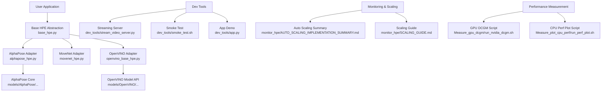
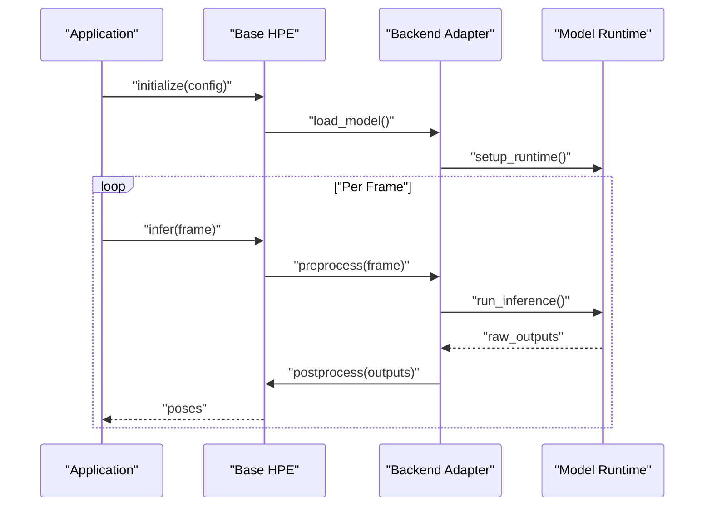
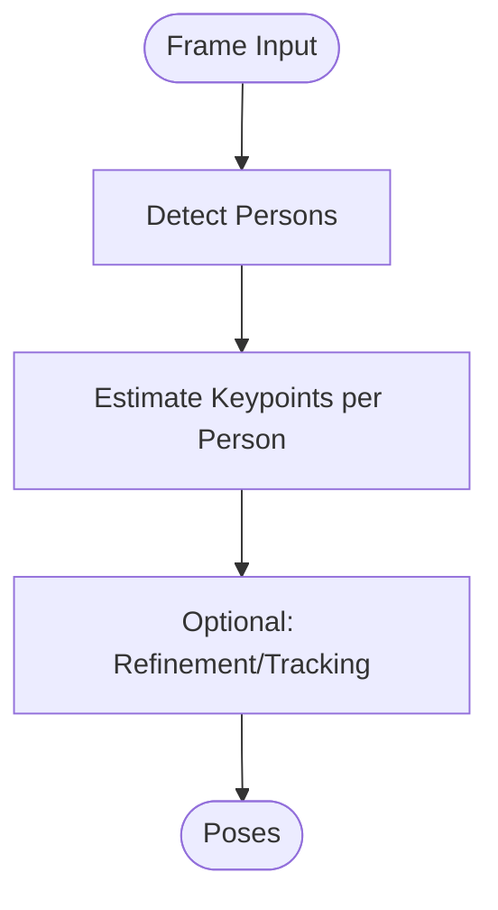
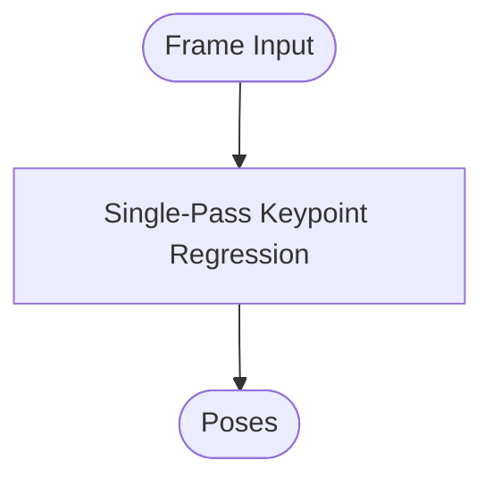
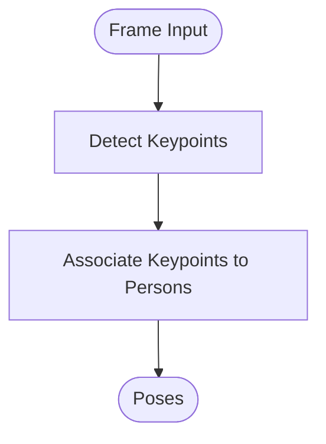
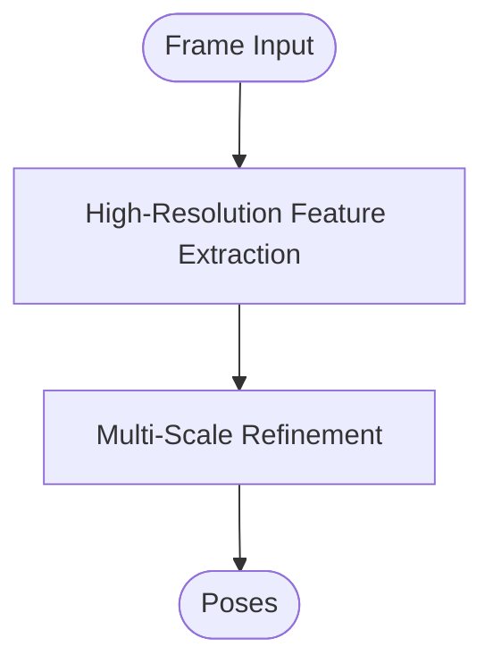
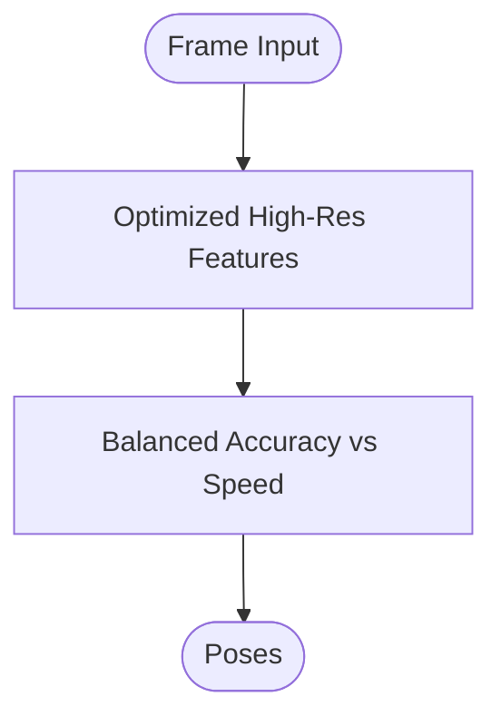
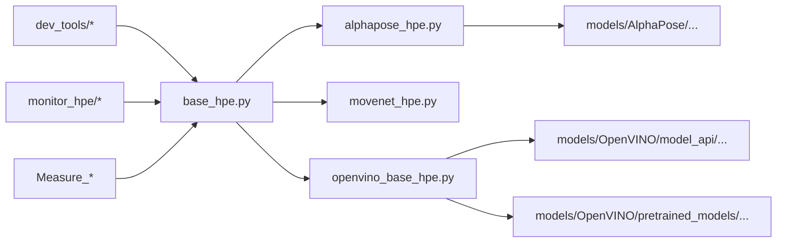
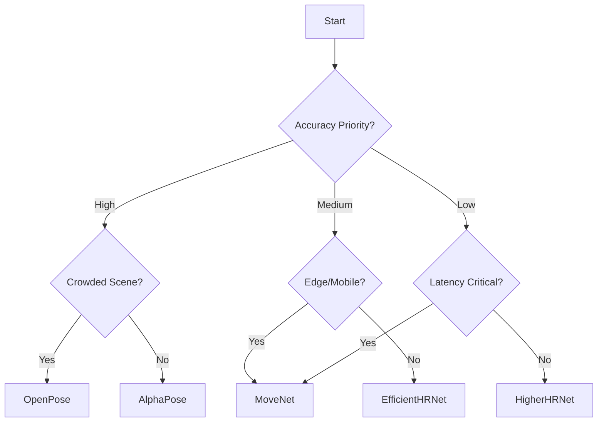

# Backend Comparison and Selection Guide

<cite>
**Referenced Files in This Document**
- [README.md](file://README.md)
- [docs/hpe-methods.md](file://docs/hpe-methods.md)
- [base_hpe.py](file://base_hpe.py)
- [alphapose_hpe.py](file://alphapose_hpe.py)
- [movenet_hpe.py](file://movenet_hpe.py)
- [openvino_base_hpe.py](file://openvino_base_hpe.py)
- [models/AlphaPose/alphapose/__init__.py](file://models/AlphaPose/alphapose/__init__.py)
- [models/AlphaPose/detector/apis.py](file://models/AlphaPose/detector/apis.py)
- [models/AlphaPose/pretrained_models/256x192_res50_lr1e-3_1x.yaml](file://models/AlphaPose/pretrained_models/256x192_res50_lr1e-3_1x.yaml)
- [models/OpenVINO/model_api/models/open_pose.py](file://models/OpenVINO/model_api/models/open_pose.py)
- [models/OpenVINO/model_api/models/hpe_associative_embedding.py](file://models/OpenVINO/model_api/models/hpe_associative_embedding.py)
- [models/OpenVINO/pretrained_models/intel/human-pose-estimation-0001/human-pose-estimation-0001.xml](file://models/OpenVINO/pretrained_models/intel/human-pose-estimation-0001/human-pose-estimation-0001.xml)
- [models/OpenVINO/pretrained_models/public/higher-hrnet-w32-human-pose-estimation.xml](file://models/OpenVINO/pretrained_models/public/higher-hrnet-w32-human-pose-estimation.xml)
- [dev_tools/app.py](file://dev_tools/app.py)
- [dev_tools/stream_video_server.py](file://dev_tools/stream_video_server.py)
- [dev_tools/smoke_test.sh](file://dev_tools/smoke_test.sh)
- [monitor_hpe/AUTO_SCALING_IMPLEMENTATION_SUMMARY.md](file://monitor_hpe/AUTO_SCALING_IMPLEMENTATION_SUMMARY.md)
- [monitor_hpe/SCALING_GUIDE.md](file://monitor_hpe/SCALING_GUIDE.md)
- [OPENVINO_CONFIG_USEFULNESS_ANALYSIS.md](file://OPENVINO_CONFIG_USEFULNESS_ANALYSIS.md)
- [OPTIMIZATION_PLAN.md](file://OPTIMIZATION_PLAN.md)
- [COMMIT_3161ac1_ANALYSIS.md](file://COMMIT_3161ac1_ANALYSIS.md)
- [REMAINING_ISSUES_ANALYSIS.md](file://REMAINING_ISSUES_ANALYSIS.md)
- [DYNAMIC_RESOURCE_ALLOCATION_SUMMARY.md](file://DYNAMIC_RESOURCE_ALLOCATION_SUMMARY.md)
- [Measure_gpu_dcgm/run_nvidia_dcgm.sh](file://Measure_gpu_dcgm/run_nvidia_dcgm.sh)
- [Measure_plot_cpu_perf/run_perf_plot.sh](file://Measure_plot_cpu_perf/run_perf_plot.sh)
</cite>

## Table of Contents
1. [Introduction](#introduction)
2. [Project Structure](#project-structure)
3. [Core Components](#core-components)
4. [Architecture Overview](#architecture-overview)
5. [Detailed Component Analysis](#detailed-component-analysis)
6. [Dependency Analysis](#dependency-analysis)
7. [Performance Considerations](#performance-considerations)
8. [Troubleshooting Guide](#troubleshooting-guide)
9. [Conclusion](#conclusion)
10. [Appendices](#appendices)

## Introduction
This document provides a comprehensive comparison guide for Human Pose Estimation (HPE) backends available in the repository, focusing on practical selection criteria and operational guidance. It covers:
- AlphaPose (top-down)
- MoveNet (lightweight)
- OpenPose (bottom-up)
- HigherHRNet (high-resolution)
- EfficientHRNet (optimized)

The guide compares these implementations across accuracy, speed, memory usage, computational requirements, and hardware dependencies, and offers decision trees, configuration recommendations, tuning guidelines, migration strategies, and throughput optimization techniques grounded in the repository’s code and documentation.

## Project Structure
The repository organizes HPE implementations under modular Python entry points and shared base abstractions, with model-specific adapters and pre-trained assets. Supporting scripts enable performance measurement, monitoring, and scaling.

**Diagram sources**
- [base_hpe.py](file://base_hpe.py)
- [alphapose_hpe.py](file://alphapose_hpe.py)
- [movenet_hpe.py](file://movenet_hpe.py)
- [openvino_base_hpe.py](file://openvino_base_hpe.py)
- [models/AlphaPose/alphapose/__init__.py](file://models/AlphaPose/alphapose/__init__.py)
- [models/OpenVINO/model_api/models/open_pose.py](file://models/OpenVINO/model_api/models/open_pose.py)
- [dev_tools/stream_video_server.py](file://dev_tools/stream_video_server.py)
- [dev_tools/smoke_test.sh](file://dev_tools/smoke_test.sh)
- [dev_tools/app.py](file://dev_tools/app.py)
- [monitor_hpe/AUTO_SCALING_IMPLEMENTATION_SUMMARY.md](file://monitor_hpe/AUTO_SCALING_IMPLEMENTATION_SUMMARY.md)
- [monitor_hpe/SCALING_GUIDE.md](file://monitor_hpe/SCALING_GUIDE.md)
- [Measure_gpu_dcgm/run_nvidia_dcgm.sh](file://Measure_gpu_dcgm/run_nvidia_dcgm.sh)
- [Measure_plot_cpu_perf/run_perf_plot.sh](file://Measure_plot_cpu_perf/run_perf_plot.sh)

**Section sources**
- [README.md](file://README.md)
- [docs/hpe-methods.md](file://docs/hpe-methods.md)
- [base_hpe.py](file://base_hpe.py)

## Core Components
- Base HPE abstraction defines a unified interface for loading models, preprocessing frames, running inference, and post-processing outputs. This enables consistent benchmarking and switching between backends.
- AlphaPose adapter integrates top-down pose estimation with detection and tracking components.
- MoveNet adapter targets lightweight inference suitable for edge devices.
- OpenVINO adapter provides optimized inference via Intel’s inference engine with multiple model variants.

Key implementation references:
- [Base HPE interface](file://base_hpe.py)
- [AlphaPose adapter](file://alphapose_hpe.py)
- [MoveNet adapter](file://movenet_hpe.py)
- [OpenVINO adapter](file://openvino_base_hpe.py)

**Section sources**
- [base_hpe.py](file://base_hpe.py)
- [alphapose_hpe.py](file://alphapose_hpe.py)
- [movenet_hpe.py](file://movenet_hpe.py)
- [openvino_base_hpe.py](file://openvino_base_hpe.py)

## Architecture Overview
The runtime architecture follows a pipeline: input frame -> preprocessor -> backend-specific inference -> postprocessor -> output. The base abstraction ensures consistent control flow across backends.

**Diagram sources**
- [base_hpe.py](file://base_hpe.py)
- [alphapose_hpe.py](file://alphapose_hpe.py)
- [movenet_hpe.py](file://movenet_hpe.py)
- [openvino_base_hpe.py](file://openvino_base_hpe.py)

## Detailed Component Analysis

### AlphaPose (Top-Down)
- Approach: Detection-first pipeline followed by pose estimation per detected person.
- Strengths: High accuracy for dense scenes and precise keypoint localization.
- Trade-offs: Slower than lightweight models; higher memory/CPU usage due to detection and per-person refinement.
- Typical use cases: Studio-quality pose analysis, research, and scenarios prioritizing accuracy over throughput.
- Configuration highlights:
  - Preprocessing resolution and normalization align with pretrained configuration.
  - Pretrained model configuration file referenced below.
- References:
  - [AlphaPose core initialization](file://models/AlphaPose/alphapose/__init__.py)
  - [Detector APIs](file://models/AlphaPose/detector/apis.py)
  - [Pretrained model config](file://models/AlphaPose/pretrained_models/256x192_res50_lr1e-3_1x.yaml)
  - [AlphaPose adapter](file://alphapose_hpe.py)

**Diagram sources**
- [models/AlphaPose/detector/apis.py](file://models/AlphaPose/detector/apis.py)
- [models/AlphaPose/alphapose/__init__.py](file://models/AlphaPose/alphapose/__init__.py)
- [alphapose_hpe.py](file://alphapose_hpe.py)

**Section sources**
- [alphapose_hpe.py](file://alphapose_hpe.py)
- [models/AlphaPose/alphapose/__init__.py](file://models/AlphaPose/alphapose/__init__.py)
- [models/AlphaPose/detector/apis.py](file://models/AlphaPose/detector/apis.py)
- [models/AlphaPose/pretrained_models/256x192_res50_lr1e-3_1x.yaml](file://models/AlphaPose/pretrained_models/256x192_res50_lr1e-3_1x.yaml)

### MoveNet (Lightweight)
- Approach: Single-pass, compact model optimized for speed and resource efficiency.
- Strengths: Fast inference, low memory footprint; suitable for edge and real-time constraints.
- Trade-offs: Slightly lower accuracy than top-down or HRNet variants; may struggle with occlusions and crowded scenes.
- Typical use cases: Edge devices, mobile deployments, and latency-critical applications.
- References:
  - [MoveNet adapter](file://movenet_hpe.py)

**Diagram sources**
- [movenet_hpe.py](file://movenet_hpe.py)

**Section sources**
- [movenet_hpe.py](file://movenet_hpe.py)

### OpenPose (Bottom-Up)
- Approach: Simultaneously detects keypoints and associates them into person instances without explicit detection.
- Strengths: Robust in crowded scenes; good balance of accuracy and speed.
- Trade-offs: Requires careful tuning of association parameters; can be heavier than lightweight models.
- Typical use cases: Crowded environments, surveillance, and multi-person scenarios.
- References:
  - [OpenVINO OpenPose model](file://models/OpenVINO/model_api/models/open_pose.py)
  - [OpenVINO HPE associative embedding model](file://models/OpenVINO/model_api/models/hpe_associative_embedding.py)
  - [OpenVINO adapter](file://openvino_base_hpe.py)

**Diagram sources**
- [models/OpenVINO/model_api/models/open_pose.py](file://models/OpenVINO/model_api/models/open_pose.py)
- [models/OpenVINO/model_api/models/hpe_associative_embedding.py](file://models/OpenVINO/model_api/models/hpe_associative_embedding.py)
- [openvino_base_hpe.py](file://openvino_base_hpe.py)

**Section sources**
- [openvino_base_hpe.py](file://openvino_base_hpe.py)
- [models/OpenVINO/model_api/models/open_pose.py](file://models/OpenVINO/model_api/models/open_pose.py)
- [models/OpenVINO/model_api/models/hpe_associative_embedding.py](file://models/OpenVINO/model_api/models/hpe_associative_embedding.py)

### HigherHRNet (High-Resolution)
- Approach: High-resolution pose estimation with multi-scale refinement.
- Strengths: Excellent accuracy for fine details and complex poses.
- Trade-offs: Higher computational cost; requires more memory and GPU resources.
- Typical use cases: Research-grade analysis, broadcast production, and scenarios demanding pixel-accurate poses.
- References:
  - [HigherHRNet OpenVINO model](file://models/OpenVINO/pretrained_models/public/higher-hrnet-w32-human-pose-estimation.xml)
  - [OpenVINO adapter](file://openvino_base_hpe.py)

**Diagram sources**
- [models/OpenVINO/pretrained_models/public/higher-hrnet-w32-human-pose-estimation.xml](file://models/OpenVINO/pretrained_models/public/higher-hrnet-w32-human-pose-estimation.xml)
- [openvino_base_hpe.py](file://openvino_base_hpe.py)

**Section sources**
- [openvino_base_hpe.py](file://openvino_base_hpe.py)
- [models/OpenVINO/pretrained_models/public/higher-hrnet-w32-human-pose-estimation.xml](file://models/OpenVINO/pretrained_models/public/higher-hrnet-w32-human-pose-estimation.xml)

### EfficientHRNet (Optimized)
- Approach: Optimized HRNet variant designed for efficiency while retaining high-resolution capabilities.
- Strengths: Good balance of accuracy and performance; reduced computational overhead compared to standard HRNet.
- Trade-offs: Still heavier than MoveNet; benefits most on capable GPUs.
- Typical use cases: Production systems requiring strong accuracy with acceptable latency.
- References:
  - [EfficientHRNet OpenVINO model 0001](file://models/OpenVINO/pretrained_models/intel/human-pose-estimation-0001/human-pose-estimation-0001.xml)
  - [OpenVINO adapter](file://openvino_base_hpe.py)

**Diagram sources**
- [models/OpenVINO/pretrained_models/intel/human-pose-estimation-0001/human-pose-estimation-0001.xml](file://models/OpenVINO/pretrained_models/intel/human-pose-estimation-0001/human-pose-estimation-0001.xml)
- [openvino_base_hpe.py](file://openvino_base_hpe.py)

**Section sources**
- [openvino_base_hpe.py](file://openvino_base_hpe.py)
- [models/OpenVINO/pretrained_models/intel/human-pose-estimation-0001/human-pose-estimation-0001.xml](file://models/OpenVINO/pretrained_models/intel/human-pose-estimation-0001/human-pose-estimation-0001.xml)

## Dependency Analysis
- Backends depend on a shared base abstraction for consistent lifecycle management.
- AlphaPose depends on its internal dataset and model builders, plus detector/tracker integrations.
- OpenVINO backends rely on model API adapters and pre-trained XML/weights assets.
- Dev tools and monitoring utilities support performance measurement and scaling.

**Diagram sources**
- [base_hpe.py](file://base_hpe.py)
- [alphapose_hpe.py](file://alphapose_hpe.py)
- [movenet_hpe.py](file://movenet_hpe.py)
- [openvino_base_hpe.py](file://openvino_base_hpe.py)
- [models/AlphaPose/alphapose/__init__.py](file://models/AlphaPose/alphapose/__init__.py)
- [models/OpenVINO/model_api/models/open_pose.py](file://models/OpenVINO/model_api/models/open_pose.py)
- [models/OpenVINO/pretrained_models/intel/human-pose-estimation-0001/human-pose-estimation-0001.xml](file://models/OpenVINO/pretrained_models/intel/human-pose-estimation-0001/human-pose-estimation-0001.xml)

**Section sources**
- [base_hpe.py](file://base_hpe.py)
- [alphapose_hpe.py](file://alphapose_hpe.py)
- [movenet_hpe.py](file://movenet_hpe.py)
- [openvino_base_hpe.py](file://openvino_base_hpe.py)

## Performance Considerations
- Throughput and latency: Use the streaming server and performance measurement scripts to evaluate backend performance under realistic workloads.
- GPU utilization: Monitor GPU metrics during experiments to correlate throughput with resource usage.
- CPU profiling: Use CPU performance plotting scripts to analyze host-side bottlenecks.
- Scaling: Apply auto-scaling and dynamic resource allocation strategies to maintain target latency under varying loads.

Practical references:
- [Streaming server](file://dev_tools/stream_video_server.py)
- [Smoke test](file://dev_tools/smoke_test.sh)
- [GPU DCGM script](file://Measure_gpu_dcgm/run_nvidia_dcgm.sh)
- [CPU perf plot script](file://Measure_plot_cpu_perf/run_perf_plot.sh)
- [Auto scaling summary](file://monitor_hpe/AUTO_SCALING_IMPLEMENTATION_SUMMARY.md)
- [Scaling guide](file://monitor_hpe/SCALING_GUIDE.md)
- [Dynamic resource allocation summary](file://DYNAMIC_RESOURCE_ALLOCATION_SUMMARY.md)

**Section sources**
- [dev_tools/stream_video_server.py](file://dev_tools/stream_video_server.py)
- [dev_tools/smoke_test.sh](file://dev_tools/smoke_test.sh)
- [Measure_gpu_dcgm/run_nvidia_dcgm.sh](file://Measure_gpu_dcgm/run_nvidia_dcgm.sh)
- [Measure_plot_cpu_perf/run_perf_plot.sh](file://Measure_plot_cpu_perf/run_perf_plot.sh)
- [monitor_hpe/AUTO_SCALING_IMPLEMENTATION_SUMMARY.md](file://monitor_hpe/AUTO_SCALING_IMPLEMENTATION_SUMMARY.md)
- [monitor_hpe/SCALING_GUIDE.md](file://monitor_hpe/SCALING_GUIDE.md)
- [DYNAMIC_RESOURCE_ALLOCATION_SUMMARY.md](file://DYNAMIC_RESOURCE_ALLOCATION_SUMMARY.md)

## Troubleshooting Guide
- Smoke testing: Run the smoke test script to validate environment setup and basic functionality across backends.
- Streaming diagnostics: Use the streaming server to reproduce end-to-end latency and throughput issues.
- Monitoring: Leverage auto-scaling and scaling guides to stabilize performance under load.
- Model asset verification: Confirm presence and compatibility of OpenVINO model assets and YAML configs for AlphaPose.

References:
- [Smoke test](file://dev_tools/smoke_test.sh)
- [Streaming server](file://dev_tools/stream_video_server.py)
- [Auto scaling summary](file://monitor_hpe/AUTO_SCALING_IMPLEMENTATION_SUMMARY.md)
- [Scaling guide](file://monitor_hpe/SCALING_GUIDE.md)
- [AlphaPose YAML config](file://models/AlphaPose/pretrained_models/256x192_res50_lr1e-3_1x.yaml)

**Section sources**
- [dev_tools/smoke_test.sh](file://dev_tools/smoke_test.sh)
- [dev_tools/stream_video_server.py](file://dev_tools/stream_video_server.py)
- [monitor_hpe/AUTO_SCALING_IMPLEMENTATION_SUMMARY.md](file://monitor_hpe/AUTO_SCALING_IMPLEMENTATION_SUMMARY.md)
- [monitor_hpe/SCALING_GUIDE.md](file://monitor_hpe/SCALING_GUIDE.md)
- [models/AlphaPose/pretrained_models/256x192_res50_lr1e-3_1x.yaml](file://models/AlphaPose/pretrained_models/256x192_res50_lr1e-3_1x.yaml)

## Conclusion
Selecting the optimal HPE backend depends on balancing accuracy, speed, memory, and hardware constraints:
- Choose AlphaPose for highest accuracy in controlled or studio-like settings.
- Prefer MoveNet for edge and latency-critical deployments where slight accuracy reduction is acceptable.
- Select OpenPose for robust multi-person scenarios without explicit detection.
- Use HigherHRNet for research-grade or broadcast-quality accuracy.
- Opt for EfficientHRNet for a balanced, optimized high-resolution solution.

Ground your choice in measured benchmarks using the provided scripts and adjust configurations per workload.

## Appendices

### Decision Trees for Backend Selection

[No sources needed since this diagram shows conceptual workflow, not actual code structure]

### Configuration Recommendations and Tuning Guidelines
- Resolution and batch size: Adjust input resolution to meet latency budgets; increase batch size on capable GPUs for throughput.
- OpenVINO: Switch precision (FP16/FP32) and model variants to trade off accuracy and speed.
- AlphaPose: Validate detector thresholds and post-processing parameters for your domain.
- MoveNet: Keep default settings for minimal tuning; focus on resolution and device placement.
- Monitoring: Use GPU and CPU performance scripts to validate assumptions and iterate tuning.

References:
- [OpenVINO usefulness analysis](file://OPENVINO_CONFIG_USEFULNESS_ANALYSIS.md)
- [Optimization plan](file://OPTIMIZATION_PLAN.md)
- [Commit analysis](file://COMMIT_3161ac1_ANALYSIS.md)
- [Remaining issues analysis](file://REMAINING_ISSUES_ANALYSIS.md)

**Section sources**
- [OPENVINO_CONFIG_USEFULNESS_ANALYSIS.md](file://OPENVINO_CONFIG_USEFULNESS_ANALYSIS.md)
- [OPTIMIZATION_PLAN.md](file://OPTIMIZATION_PLAN.md)
- [COMMIT_3161ac1_ANALYSIS.md](file://COMMIT_3161ac1_ANALYSIS.md)
- [REMAINING_ISSUES_ANALYSIS.md](file://REMAINING_ISSUES_ANALYSIS.md)

### Migration Strategies Between Backends
- Maintain a common base interface to swap implementations without changing application logic.
- Preserve input/output schemas to ease swapping AlphaPose, MoveNet, OpenPose, HigherHRNet, or EfficientHRNet.
- Validate calibration and preprocessing steps for each backend to avoid performance regressions.
- Use the streaming server and smoke tests to regression-test migrations.

References:
- [Base HPE abstraction](file://base_hpe.py)
- [Streaming server](file://dev_tools/stream_video_server.py)
- [Smoke test](file://dev_tools/smoke_test.sh)

**Section sources**
- [base_hpe.py](file://base_hpe.py)
- [dev_tools/stream_video_server.py](file://dev_tools/stream_video_server.py)
- [dev_tools/smoke_test.sh](file://dev_tools/smoke_test.sh)