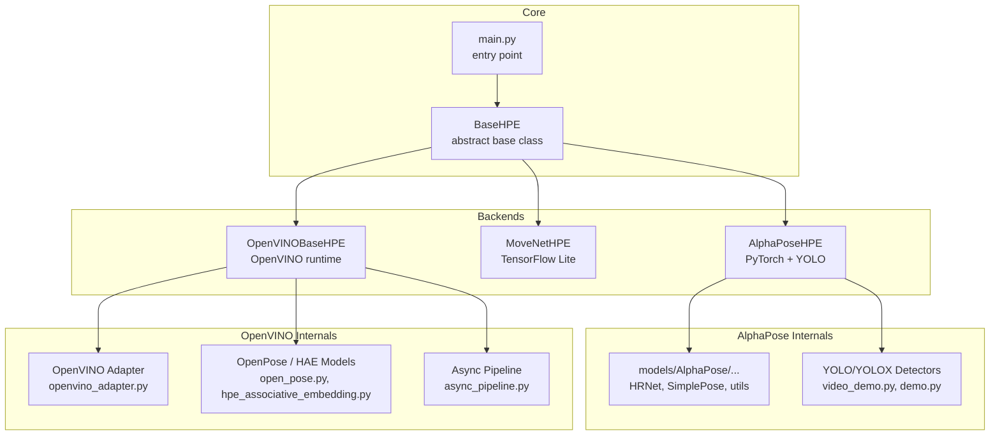
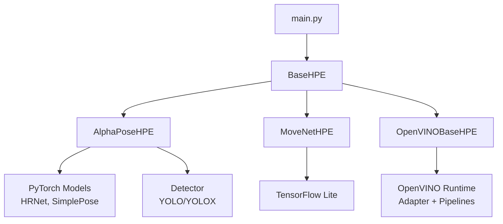
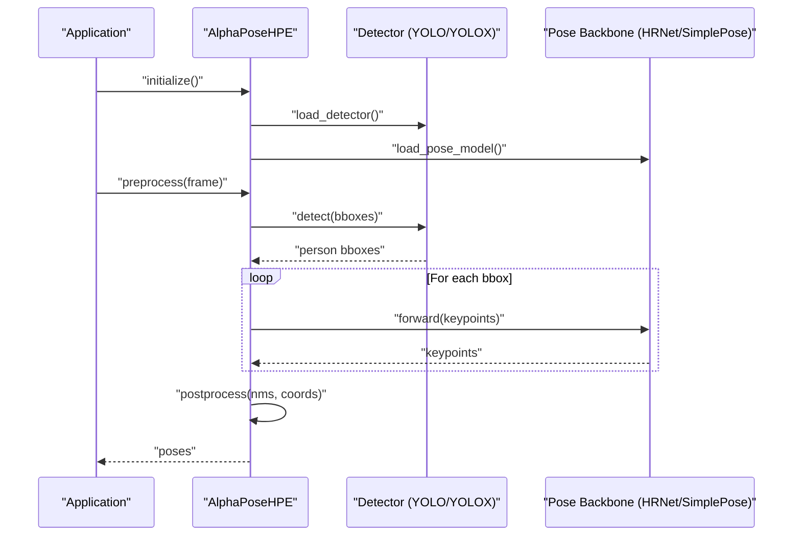
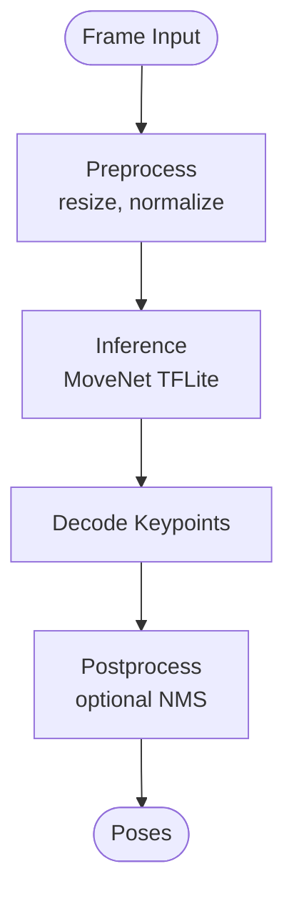
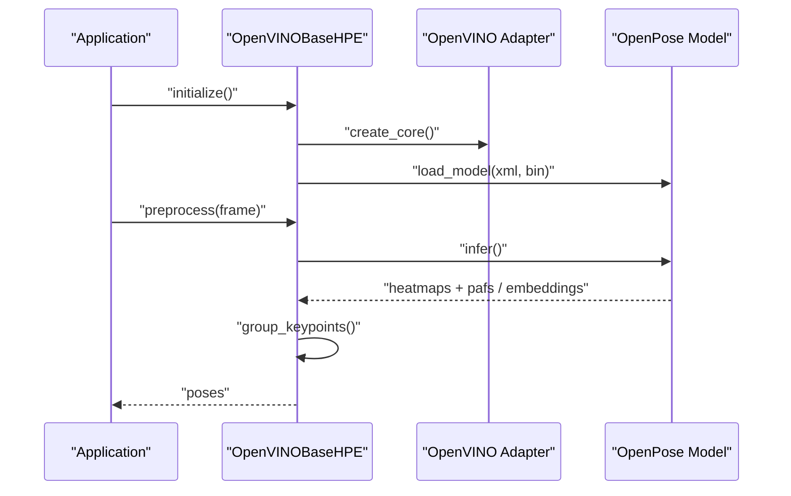
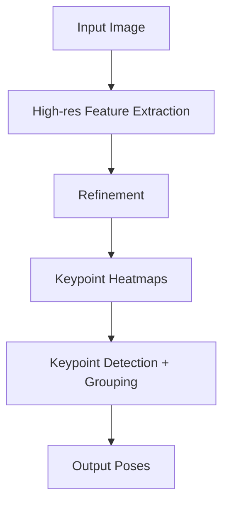
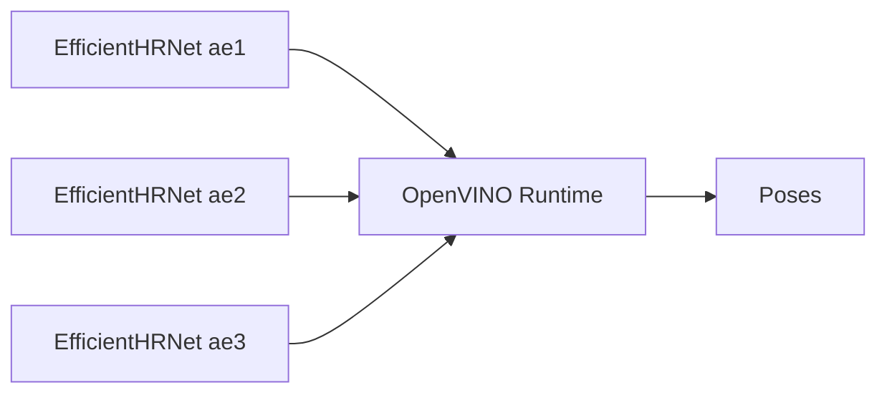
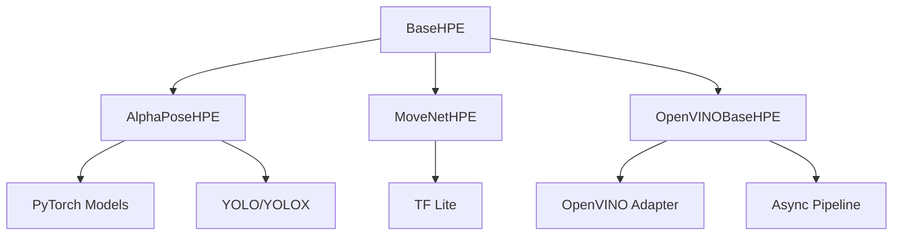

# HPE Backend Implementations

<cite>
**Referenced Files in This Document**
- [base_hpe.py](file://base_hpe.py)
- [alphapose_hpe.py](file://alphapose_hpe.py)
- [movenet_hpe.py](file://movenet_hpe.py)
- [openvino_base_hpe.py](file://openvino_base_hpe.py)
- [openvino_base_hpe.py.bak](file://openvino_base_hpe.py.bak)
- [models/AlphaPose/alphapose/__init__.py](file://models/AlphaPose/alphapose/__init__.py)
- [models/AlphaPose/alphapose/models/hrnet.py](file://models/AlphaPose/alphapose/models/hrnet.py)
- [models/AlphaPose/alphapose/models/simplepose.py](file://models/AlphaPose/alphapose/models/simplepose.py)
- [models/AlphaPose/alphapose/utils/detector.py](file://models/AlphaPose/alphapose/utils/detector.py)
- [models/AlphaPose/alphapose/utils/webcam_detector.py](file://models/AlphaPose/alphapose/utils/webcam_detector.py)
- [models/AlphaPose/detector/yolo/video_demo.py](file://models/AlphaPose/detector/yolo/video_demo.py)
- [models/AlphaPose/detector/yolox/tools/demo.py](file://models/AlphaPose/detector/yolox/tools/demo.py)
- [models/OpenVINO/model_api/adapters/openvino_adapter.py](file://models/OpenVINO/model_api/adapters/openvino_adapter.py)
- [models/OpenVINO/model_api/models/open_pose.py](file://models/OpenVINO/model_api/models/open_pose.py)
- [models/OpenVINO/model_api/models/hpe_associative_embedding.py](file://models/OpenVINO/model_api/models/hpe_associative_embedding.py)
- [models/OpenVINO/model_api/pipelines/async_pipeline.py](file://models/OpenVINO/model_api/pipelines/async_pipeline.py)
- [models/OpenVINO/pretrained_models/intel/human-pose-estimation-0001/human-pose-estimation-0001.xml](file://models/OpenVINO/pretrained_models/intel/human-pose-estimation-0001/human-pose-estimation-0001.xml)
- [models/OpenVINO/pretrained_models/public/higher-hrnet-w32-human-pose-estimation.xml](file://models/OpenVINO/pretrained_models/public/higher-hrnet-w32-human-pose-estimation.xml)
- [models/OpenVINO/pretrained_models/intel/efficient-hrnet/FP32/](file://models/OpenVINO/pretrained_models/intel/efficient-hrnet/FP32/)
- [Dockerfile.hpe](file://Dockerfile.hpe)
- [Dockerfile_base](file://Dockerfile_base)
- [AGENTS.md](file://AGENTS.md)
- [OPENVINO_CONFIG_USEFULNESS_ANALYSIS.md](file://OPENVINO_CONFIG_USEFULNESS_ANALYSIS.md)
- [AlphaPose_HTTP_Streaming_Optimization.md](file://AlphaPose_HTTP_Streaming_Optimization.md)
- [main.py](file://main.py)
- [tests/test_hpe_regressions.py](file://tests/test_hpe_regressions.py)
</cite>

## Table of Contents
1. [Introduction](#introduction)
2. [Project Structure](#project-structure)
3. [Core Components](#core-components)
4. [Architecture Overview](#architecture-overview)
5. [Detailed Component Analysis](#detailed-component-analysis)
6. [Dependency Analysis](#dependency-analysis)
7. [Performance Considerations](#performance-considerations)
8. [Troubleshooting Guide](#troubleshooting-guide)
9. [Conclusion](#conclusion)
10. [Appendices](#appendices)

## Introduction
This document provides comprehensive documentation for the Human Pose Estimation (HPE) backend implementations in the project. It covers five supported backends:
- AlphaPose (top-down with YOLO detector)
- MoveNet (single-stage lightweight)
- OpenPose (bottom-up Part Affinity Fields)
- HigherHRNet (high-resolution backbone)
- EfficientHRNet (three variants: ae1, ae2, ae3)

For each backend, we explain methodology, model architecture, performance characteristics, computational requirements, and optimal use cases. We also document configuration options, parameter tuning recommendations, comparison guidelines, implementation details, model loading processes, inference pipelines, post-processing steps, hardware requirements, memory usage patterns, and threading considerations.

## Project Structure
The HPE backends are implemented as subclasses of a shared abstract base class. The repository organizes implementations per backend and integrates with external model libraries and OpenVINO runtime.

**Diagram sources**
- [base_hpe.py:97-200](file://base_hpe.py#L97-L200)
- [alphapose_hpe.py:1-120](file://alphapose_hpe.py#L1-L120)
- [movenet_hpe.py:1-120](file://movenet_hpe.py#L1-L120)
- [openvino_base_hpe.py:1-120](file://openvino_base_hpe.py#L1-L120)
- [models/AlphaPose/alphapose/models/hrnet.py](file://models/AlphaPose/alphapose/models/hrnet.py)
- [models/AlphaPose/detector/yolo/video_demo.py](file://models/AlphaPose/detector/yolo/video_demo.py)
- [models/AlphaPose/detector/yolox/tools/demo.py](file://models/AlphaPose/detector/yolox/tools/demo.py)
- [models/OpenVINO/model_api/adapters/openvino_adapter.py](file://models/OpenVINO/model_api/adapters/openvino_adapter.py)
- [models/OpenVINO/model_api/models/open_pose.py](file://models/OpenVINO/model_api/models/open_pose.py)
- [models/OpenVINO/model_api/models/hpe_associative_embedding.py](file://models/OpenVINO/model_api/models/hpe_associative_embedding.py)
- [models/OpenVINO/model_api/pipelines/async_pipeline.py](file://models/OpenVINO/model_api/pipelines/async_pipeline.py)

**Section sources**
- [base_hpe.py:97-200](file://base_hpe.py#L97-L200)
- [main.py:200-220](file://main.py#L200-L220)

## Core Components
- BaseHPE: Defines the common interface and lifecycle for all HPE backends, including initialization, preprocessing, inference, postprocessing, and resource cleanup.
- AlphaPoseHPE: Implements top-down pose estimation with a detector (YOLO/YOLOX) and a pose backbone (HRNet/SimplePose).
- MoveNetHPE: Implements a single-stage lightweight pose estimator suitable for edge devices.
- OpenVINOBaseHPE: Implements bottom-up and associative embedding-based pose estimators via OpenVINO runtime, supporting OpenPose, HigherHRNet, and EfficientHRNet variants.

Key responsibilities:
- Preprocessing: Normalization, resizing, padding, and batching.
- Inference: Model-specific forward passes.
- Postprocessing: NMS, pose decoding, and coordinate transformation.
- Resource management: GPU/CPU allocation, threading, and memory usage.

**Section sources**
- [base_hpe.py:97-200](file://base_hpe.py#L97-L200)
- [alphapose_hpe.py:1-120](file://alphapose_hpe.py#L1-L120)
- [movenet_hpe.py:1-120](file://movenet_hpe.py#L1-L120)
- [openvino_base_hpe.py:1-120](file://openvino_base_hpe.py#L1-L120)

## Architecture Overview
The system follows a layered architecture:
- Application Layer: Entry points and orchestration (main.py).
- Backend Layer: Individual HPE implementations inheriting from BaseHPE.
- Model Layer: Backend-specific model libraries (PyTorch, TensorFlow Lite, OpenVINO).
- Runtime Layer: Hardware acceleration (CUDA, OpenVINO), threading, and memory management.

**Diagram sources**
- [main.py:200-220](file://main.py#L200-L220)
- [base_hpe.py:97-200](file://base_hpe.py#L97-L200)
- [alphapose_hpe.py:1-120](file://alphapose_hpe.py#L1-L120)
- [movenet_hpe.py:1-120](file://movenet_hpe.py#L1-L120)
- [openvino_base_hpe.py:1-120](file://openvino_base_hpe.py#L1-L120)

## Detailed Component Analysis

### AlphaPose (Top-down with YOLO Detector)
Methodology:
- Top-down pipeline: Detect humans with a detector, then estimate poses per detected person.
- Detector: YOLO/YOLOX trained on COCO/person categories.
- Pose backbone: HRNet or SimplePose for accurate keypoint localization.

Implementation highlights:
- Detector integration: Uses YOLO/YOLOX demos for video/image inference.
- Pose model: HRNet/SimplePose configured via alphapose package.
- Preprocessing: Custom padding and resize logic tailored for AlphaPose.

**Diagram sources**
- [alphapose_hpe.py:1-120](file://alphapose_hpe.py#L1-L120)
- [models/AlphaPose/detector/yolo/video_demo.py](file://models/AlphaPose/detector/yolo/video_demo.py)
- [models/AlphaPose/detector/yolox/tools/demo.py](file://models/AlphaPose/detector/yolox/tools/demo.py)
- [models/AlphaPose/alphapose/models/hrnet.py](file://models/AlphaPose/alphapose/models/hrnet.py)
- [models/AlphaPose/alphapose/models/simplepose.py](file://models/AlphaPose/alphapose/models/simplepose.py)

Performance and hardware:
- Requires GPU for competitive latency; CPU fallback is available but slower.
- Memory usage scales with batch size and input resolution.
- Threading: OpenCV threading and detector threading can be tuned via environment variables.

Configuration and tuning:
- Detector confidence threshold and NMS overlap.
- Input resolution and padding strategy.
- Pose model checkpoint selection (HRNet vs SimplePose).

Optimal use cases:
- High accuracy scenarios where top-down detection improves robustness.
- Multi-person scenes with occlusions.

**Section sources**
- [alphapose_hpe.py:1-120](file://alphapose_hpe.py#L1-L120)
- [models/AlphaPose/alphapose/utils/detector.py](file://models/AlphaPose/alphapose/utils/detector.py)
- [models/AlphaPose/alphapose/utils/webcam_detector.py](file://models/AlphaPose/alphapose/utils/webcam_detector.py)
- [models/AlphaPose/detector/yolo/video_demo.py](file://models/AlphaPose/detector/yolo/video_demo.py)
- [models/AlphaPose/detector/yolox/tools/demo.py](file://models/AlphaPose/detector/yolox/tools/demo.py)
- [models/AlphaPose/alphapose/models/hrnet.py](file://models/AlphaPose/alphapose/models/hrnet.py)
- [models/AlphaPose/alphapose/models/simplepose.py](file://models/AlphaPose/alphapose/models/simplepose.py)
- [AlphaPose_HTTP_Streaming_Optimization.md:1-200](file://AlphaPose_HTTP_Streaming_Optimization.md#L1-L200)

### MoveNet (Single-stage Lightweight)
Methodology:
- Single-stage pose estimator optimized for speed and edge deployment.
- Typically uses TensorFlow Lite for on-device inference.

Implementation highlights:
- Minimal preprocessing and postprocessing overhead.
- Suitable for real-time inference on constrained hardware.

**Diagram sources**
- [movenet_hpe.py:1-120](file://movenet_hpe.py#L1-L120)

Performance and hardware:
- Designed for CPU and mobile accelerators.
- Low latency and memory footprint.

Configuration and tuning:
- Input resolution trade-off between speed and accuracy.
- Optional quantization settings for TFLite.

Optimal use cases:
- Edge devices, low-latency applications, and resource-constrained environments.

**Section sources**
- [movenet_hpe.py:1-120](file://movenet_hpe.py#L1-L120)

### OpenPose (Bottom-up Part Affinity Fields)
Methodology:
- Bottom-up pipeline: Detect keypoints first, then group them into person instances using Part Affinity Fields (PAF).
- Supports associative embedding for grouping.

Implementation highlights:
- OpenVINO runtime for acceleration.
- Async pipeline for throughput optimization.

**Diagram sources**
- [openvino_base_hpe.py:1-120](file://openvino_base_hpe.py#L1-L120)
- [models/OpenVINO/model_api/adapters/openvino_adapter.py](file://models/OpenVINO/model_api/adapters/openvino_adapter.py)
- [models/OpenVINO/model_api/models/open_pose.py](file://models/OpenVINO/model_api/models/open_pose.py)
- [models/OpenVINO/model_api/pipelines/async_pipeline.py](file://models/OpenVINO/model_api/pipelines/async_pipeline.py)

Performance and hardware:
- GPU acceleration recommended for throughput.
- CPU threads and OpenVINO configurations impact latency and throughput.

Configuration and tuning:
- Inference precision (FP32/FP16).
- Number of inference threads.
- NMS and grouping thresholds.

Optimal use cases:
- Real-time multi-person pose estimation with bottom-up grouping.

**Section sources**
- [openvino_base_hpe.py:1-120](file://openvino_base_hpe.py#L1-L120)
- [models/OpenVINO/model_api/adapters/openvino_adapter.py](file://models/OpenVINO/model_api/adapters/openvino_adapter.py)
- [models/OpenVINO/model_api/models/open_pose.py](file://models/OpenVINO/model_api/models/open_pose.py)
- [models/OpenVINO/pretrained_models/intel/human-pose-estimation-0001/human-pose-estimation-0001.xml](file://models/OpenVINO/pretrained_models/intel/human-pose-estimation-0001/human-pose-estimation-0001.xml)

### HigherHRNet (High-resolution Backbone)
Methodology:
- High-resolution network that maintains high-resolution feature maps throughout the network, improving spatial accuracy.
- Typically bottom-up or two-stage depending on configuration.

Implementation highlights:
- OpenVINO runtime support with public model.
- Asynchronous pipeline for throughput.

**Diagram sources**
- [openvino_base_hpe.py:1-120](file://openvino_base_hpe.py#L1-L120)
- [models/OpenVINO/pretrained_models/public/higher-hrnet-w32-human-pose-estimation.xml](file://models/OpenVINO/pretrained_models/public/higher-hrnet-w32-human-pose-estimation.xml)

Performance and hardware:
- Higher memory bandwidth and compute requirements compared to compact networks.
- Benefits from GPU acceleration.

Configuration and tuning:
- Precision mode (FP32).
- Thread count and batch size.

Optimal use cases:
- Applications requiring fine spatial detail and accuracy.

**Section sources**
- [openvino_base_hpe.py:1-120](file://openvino_base_hpe.py#L1-L120)
- [models/OpenVINO/pretrained_models/public/higher-hrnet-w32-human-pose-estimation.xml](file://models/OpenVINO/pretrained_models/public/higher-hrnet-w32-human-pose-estimation.xml)

### EfficientHRNet (Three Variants: ae1, ae2, ae3)
Methodology:
- Efficient variants of HRNet designed for speed/accuracy trade-offs.
- Three variants (ae1, ae2, ae3) represent different configurations.

Implementation highlights:
- OpenVINO runtime support with Intel FP32 models.
- Async pipeline for throughput.

**Diagram sources**
- [openvino_base_hpe.py:1-120](file://openvino_base_hpe.py#L1-L120)
- [models/OpenVINO/pretrained_models/intel/efficient-hrnet/FP32/](file://models/OpenVINO/pretrained_models/intel/efficient-hrnet/FP32/)

Performance and hardware:
- Lower compute and memory footprint than HigherHRNet.
- Good balance for edge/cloud deployments.

Configuration and tuning:
- Choose variant based on device constraints and accuracy targets.
- Precision and threading adjustments.

Optimal use cases:
- Balanced performance scenarios, edge deployments, and cost-effective cloud inference.

**Section sources**
- [openvino_base_hpe.py:1-120](file://openvino_base_hpe.py#L1-L120)
- [models/OpenVINO/pretrained_models/intel/efficient-hrnet/FP32/](file://models/OpenVINO/pretrained_models/intel/efficient-hrnet/FP32/)

## Dependency Analysis
The backends depend on:
- BaseHPE for common lifecycle and interface.
- Backend-specific model libraries (PyTorch, TensorFlow Lite, OpenVINO).
- OpenVINO adapter and pipelines for runtime acceleration.

**Diagram sources**
- [base_hpe.py:97-200](file://base_hpe.py#L97-L200)
- [alphapose_hpe.py:1-120](file://alphapose_hpe.py#L1-L120)
- [movenet_hpe.py:1-120](file://movenet_hpe.py#L1-L120)
- [openvino_base_hpe.py:1-120](file://openvino_base_hpe.py#L1-L120)
- [models/OpenVINO/model_api/adapters/openvino_adapter.py](file://models/OpenVINO/model_api/adapters/openvino_adapter.py)
- [models/OpenVINO/model_api/pipelines/async_pipeline.py](file://models/OpenVINO/model_api/pipelines/async_pipeline.py)

**Section sources**
- [base_hpe.py:97-200](file://base_hpe.py#L97-L200)
- [openvino_base_hpe.py:1-120](file://openvino_base_hpe.py#L1-L120)

## Performance Considerations
- Hardware acceleration:
  - AlphaPose: Prefer GPU with CUDA; CPU fallback available.
  - MoveNet: Optimized for CPU and mobile accelerators.
  - OpenPose, HigherHRNet, EfficientHRNet: Benefit significantly from GPU acceleration.
- Throughput vs latency:
  - OpenVINO async pipeline improves throughput; tune thread counts accordingly.
  - AlphaPose streaming optimizations reduce frame drops.
- Memory usage:
  - AlphaPose: Heavily influenced by batch size and resolution.
  - OpenPose/EfficientHRNet: Memory scales with model width and resolution.
- Threading:
  - OpenVINO threading and OpenCV threading should be tuned for the target device.
  - Environment variables controlling OpenVINO threads can be set via monitoring scripts.

[No sources needed since this section provides general guidance]

## Troubleshooting Guide
Common issues and remedies:
- Video capture initialization errors: Ensure backend supports video inputs; initialize capture properly.
- OpenVINO configuration defaults: Suboptimal defaults can degrade performance; adjust environment variables for thread counts and precision.
- AlphaPose streaming: Apply streaming optimizations to avoid frame drops and ensure every frame is processed.

**Section sources**
- [base_hpe.py:300-340](file://base_hpe.py#L300-L340)
- [openvino_base_hpe.py:380-400](file://openvino_base_hpe.py#L380-L400)
- [OPENVINO_CONFIG_USEFULNESS_ANALYSIS.md:1-40](file://OPENVINO_CONFIG_USEFULNESS_ANALYSIS.md#L1-L40)
- [AlphaPose_HTTP_Streaming_Optimization.md:1-200](file://AlphaPose_HTTP_Streaming_Optimization.md#L1-L200)

## Conclusion
The project provides production-ready implementations for five HPE backends, each optimized for different use cases:
- AlphaPose for high accuracy top-down pose estimation with a strong detector.
- MoveNet for lightweight, real-time inference on edge devices.
- OpenPose for robust bottom-up grouping via PAFs.
- HigherHRNet for high-resolution spatial detail.
- EfficientHRNet variants for balanced performance and efficiency.

Adopt the appropriate backend based on hardware capabilities, latency/throughput requirements, and accuracy targets. Tune configuration parameters and leverage OpenVINO threading and AlphaPose streaming optimizations for best results.

[No sources needed since this section summarizes without analyzing specific files]

## Appendices

### Implementation Details and Model Loading
- AlphaPoseHPE loads detector weights and pose models; preprocessing includes padding and resizing tailored for AlphaPose.
- MoveNetHPE uses TensorFlow Lite models for efficient inference.
- OpenVINOBaseHPE initializes OpenVINO adapter and loads OpenVINO models (OpenPose, HigherHRNet, EfficientHRNet variants).

**Section sources**
- [alphapose_hpe.py:1-120](file://alphapose_hpe.py#L1-L120)
- [movenet_hpe.py:1-120](file://movenet_hpe.py#L1-L120)
- [openvino_base_hpe.py:1-120](file://openvino_base_hpe.py#L1-L120)

### Inference Pipelines and Post-processing
- AlphaPose: Detector predicts bounding boxes; pose model infers keypoints per person; post-processing applies NMS and coordinate transformations.
- MoveNet: Direct single-pass inference with minimal post-processing.
- OpenPose: Keypoint heatmaps and PAFs or embeddings are decoded and grouped into poses.

**Section sources**
- [models/AlphaPose/alphapose/utils/detector.py](file://models/AlphaPose/alphapose/utils/detector.py)
- [models/AlphaPose/alphapose/utils/webcam_detector.py](file://models/AlphaPose/alphapose/utils/webcam_detector.py)
- [models/OpenVINO/model_api/models/open_pose.py](file://models/OpenVINO/model_api/models/open_pose.py)
- [models/OpenVINO/model_api/models/hpe_associative_embedding.py](file://models/OpenVINO/model_api/models/hpe_associative_embedding.py)

### Hardware Requirements and Memory Patterns
- AlphaPose: GPU recommended; memory increases with batch size and resolution.
- MoveNet: CPU/mobile-friendly; small memory footprint.
- OpenPose/EfficientHRNet: GPU recommended; memory scales with model width and resolution.

**Section sources**
- [Dockerfile.hpe:100-120](file://Dockerfile.hpe#L100-L120)
- [Dockerfile_base:60-90](file://Dockerfile_base#L60-L90)
- [AGENTS.md:40-80](file://AGENTS.md#L40-L80)

### Threading Considerations
- OpenVINO threading controls throughput; adjust via environment variables.
- OpenCV threading for video capture and preprocessing; tune for stability and latency.

**Section sources**
- [OPENVINO_CONFIG_USEFULNESS_ANALYSIS.md:1-40](file://OPENVINO_CONFIG_USEFULNESS_ANALYSIS.md#L1-L40)
- [openvino_base_hpe.py:1-120](file://openvino_base_hpe.py#L1-L120)

### Configuration Options and Parameter Tuning
- AlphaPose:
  - Detector confidence and NMS thresholds.
  - Input resolution and padding strategy.
  - Pose model selection (HRNet vs SimplePose).
- MoveNet:
  - Input resolution and TFLite quantization settings.
- OpenPose/HighestHRNet/EfficientHRNet:
  - Precision (FP32/FP16), number of inference threads, grouping thresholds.

**Section sources**
- [alphapose_hpe.py:1-120](file://alphapose_hpe.py#L1-L120)
- [movenet_hpe.py:1-120](file://movenet_hpe.py#L1-L120)
- [openvino_base_hpe.py:1-120](file://openvino_base_hpe.py#L1-L120)

### Comparison Guidelines
- Accuracy vs speed: AlphaPose > HigherHRNet > EfficientHRNet > OpenPose > MoveNet.
- Hardware: AlphaPose and OpenPose benefit most from GPU; MoveNet excels on CPU/mobile.
- Multi-person: OpenPose and Higher/EfficientHRNet handle multi-person well; AlphaPose relies on detector quality.
- Edge deployment: MoveNet and EfficientHRNet variants are preferred.

**Section sources**
- [AGENTS.md:1-80](file://AGENTS.md#L1-L80)

### Regression Testing
- Regression tests cover MoveNet, OpenPose, and AlphaPose to ensure consistent behavior across runs.

**Section sources**
- [tests/test_hpe_regressions.py:1-120](file://tests/test_hpe_regressions.py#L1-L120)