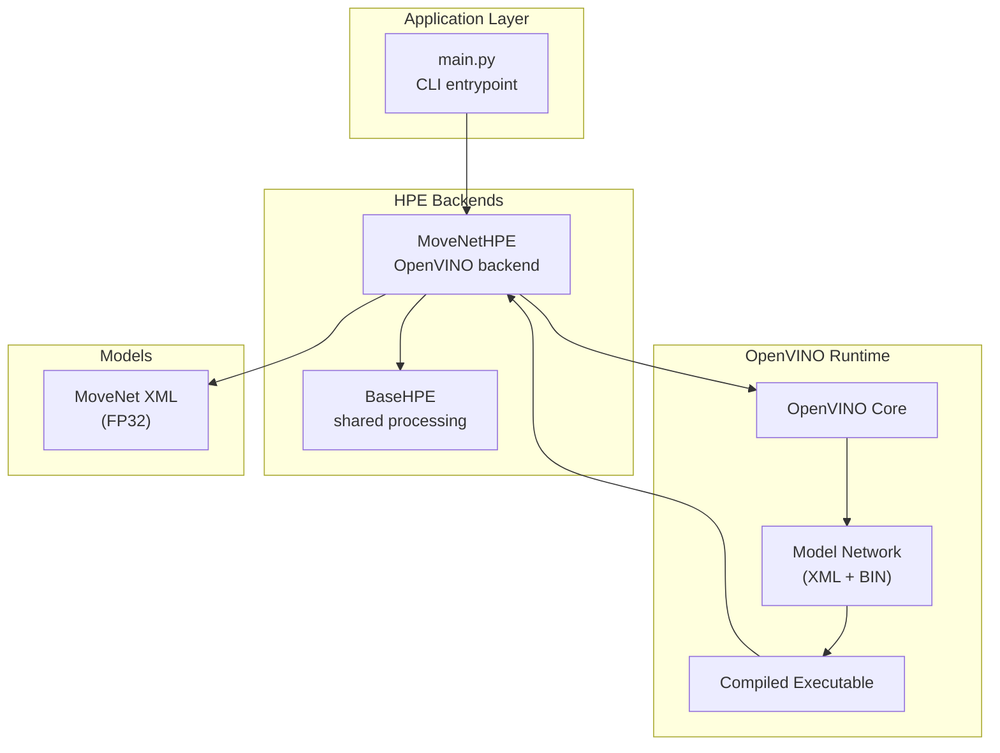
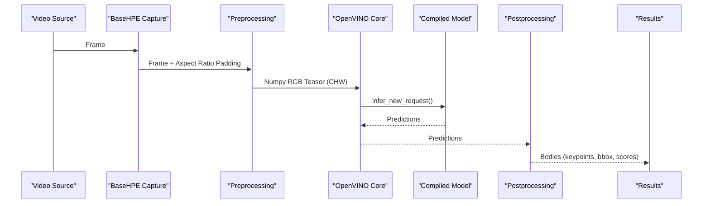
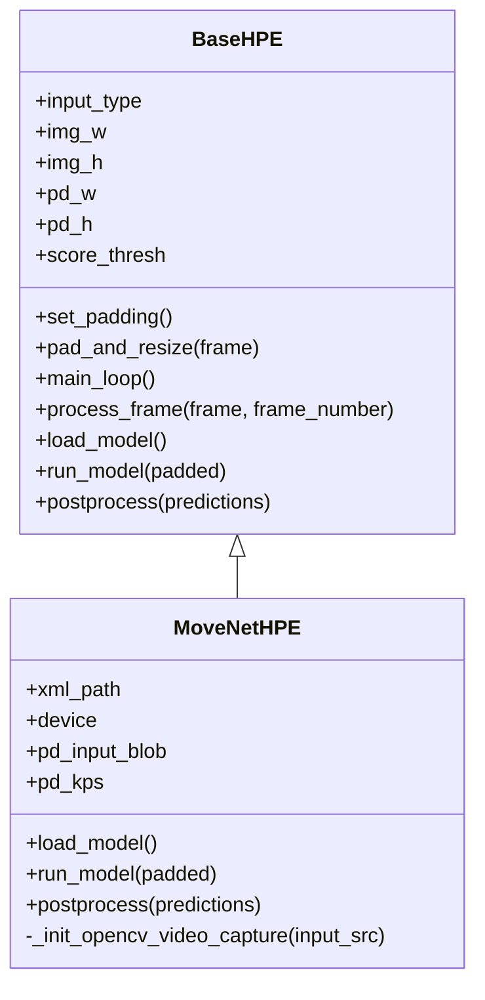
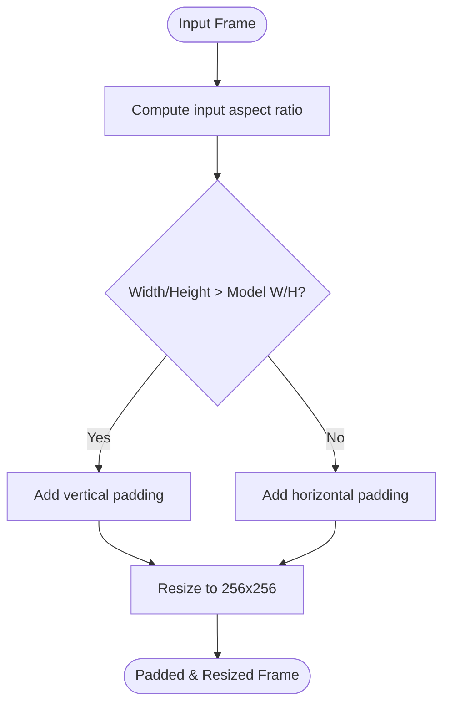
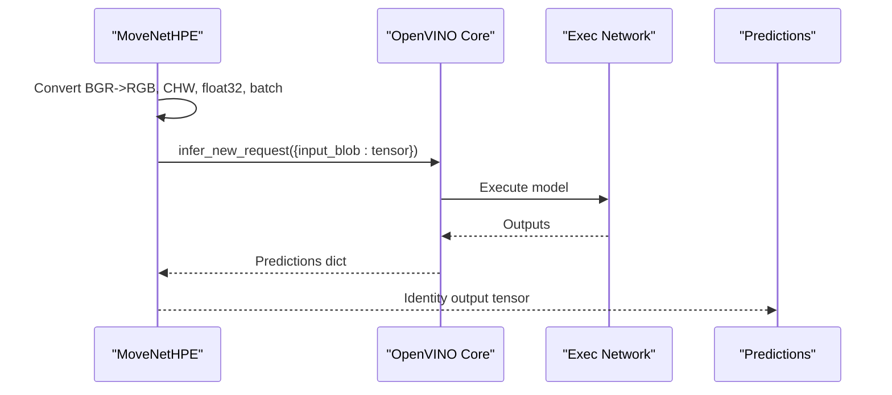
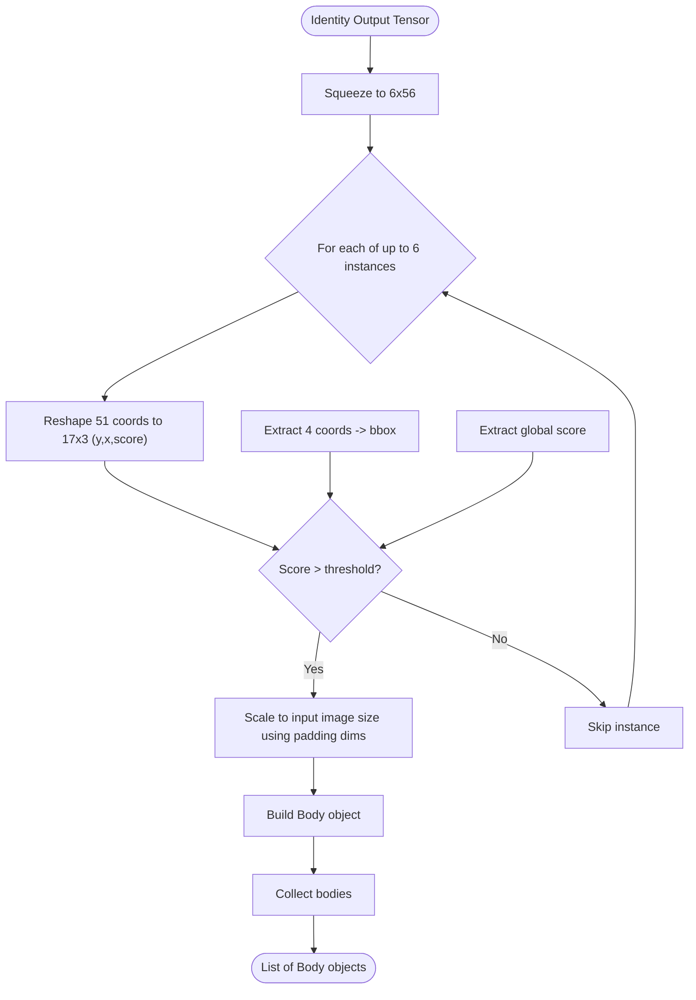
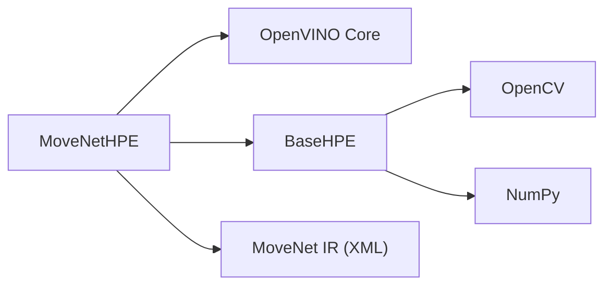

# MoveNet Backend

<cite>
**Referenced Files in This Document**
- [movenet_hpe.py](file://movenet_hpe.py)
- [base_hpe.py](file://base_hpe.py)
- [main.py](file://main.py)
- [human-pose-estimation-0001.xml](file://models/OpenVINO/pretrained_models/intel/human-pose-estimation-0001/human-pose-estimation-0001.xml)
- [image_model.py](file://models/OpenVINO/model_api/models/image_model.py)
- [hpe_associative_embedding.py](file://models/OpenVINO/model_api/models/hpe_associative_embedding.py)
</cite>

## Table of Contents
1. [Introduction](#introduction)
2. [Project Structure](#project-structure)
3. [Core Components](#core-components)
4. [Architecture Overview](#architecture-overview)
5. [Detailed Component Analysis](#detailed-component-analysis)
6. [Dependency Analysis](#dependency-analysis)
7. [Performance Considerations](#performance-considerations)
8. [Troubleshooting Guide](#troubleshooting-guide)
9. [Conclusion](#conclusion)

## Introduction
This document describes the MoveNet backend implementation used for real-time pose estimation. The backend leverages a single-stage, multi-person approach using OpenVINO-compatible MoveNet models. It focuses on:
- Lightweight inference using OpenVINO runtime
- Multi-person pose detection with COCO-compatible keypoints
- Real-time processing with configurable confidence thresholds and bounding boxes
- Edge-friendly deployment considerations

The implementation is built on top of a shared BaseHPE framework that provides video streaming, padding/resizing, rendering, and COCO-format export capabilities.

## Project Structure
The MoveNet backend is implemented as a specialized HPE backend that inherits from the shared BaseHPE class. It integrates with OpenVINO for model loading and inference, and uses the BaseHPE infrastructure for video handling, preprocessing, and postprocessing.

**Diagram sources**
- [main.py](file://main.py)
- [movenet_hpe.py](file://movenet_hpe.py)
- [base_hpe.py](file://base_hpe.py)

**Section sources**
- [movenet_hpe.py](file://movenet_hpe.py)
- [base_hpe.py](file://base_hpe.py)
- [main.py](file://main.py)

## Core Components
- MoveNetHPE: Specialized backend for MoveNet using OpenVINO runtime. Handles model loading, preprocessing, inference, and postprocessing.
- BaseHPE: Shared framework providing video capture, padding/resizing, rendering, COCO export, and timing utilities.
- OpenVINO Core: Loads and compiles the MoveNet model for the selected device.

Key responsibilities:
- Initialization parameters: model path, device selection, confidence threshold, and model input dimensions.
- Model loading: Reads XML and compiles for CPU (GPU is explicitly disabled for this backend).
- Preprocessing: Maintains aspect ratio by padding and resizing to the model’s fixed input size.
- Inference: Executes the compiled model and returns predictions.
- Postprocessing: Converts outputs to COCO-style keypoints, bounding boxes, and per-person scores.

**Section sources**
- [movenet_hpe.py](file://movenet_hpe.py)
- [base_hpe.py](file://base_hpe.py)

## Architecture Overview
The MoveNet backend follows a straightforward pipeline:
- Input video frames are captured and resized to maintain aspect ratio.
- Frames are converted to the model’s expected layout and dtype.
- The compiled OpenVINO model is executed to produce pose outputs.
- Outputs are parsed into per-person keypoints, bounding boxes, and scores.
- Bodies are filtered by confidence threshold and rendered/exported.

**Diagram sources**
- [movenet_hpe.py](file://movenet_hpe.py)
- [base_hpe.py](file://base_hpe.py)

## Detailed Component Analysis

### MoveNetHPE Class
MoveNetHPE extends BaseHPE and encapsulates OpenVINO-specific logic for MoveNet. It defines:
- Default model path pointing to a MoveNet multipose FP32 model.
- Device selection with explicit CPU fallback for GPU.
- Fixed model input size (256x256).
- Preprocessing and inference steps tailored to MoveNet outputs.

Initialization parameters:
- xml_path: Path to the OpenVINO IR XML file.
- device: Target device for inference (CPU/GPU). GPU is rejected and forced to CPU.
- pd_w/pd_h: Model input width and height (fixed at 256x256).
- score_thresh: Confidence threshold for filtering detected persons.

Model loading and compilation:
- Uses OpenVINO Core to read the model and compile for the selected device.
- Prints input/output blob information and shapes for verification.

Inference pipeline:
- Converts BGR to RGB, transposes to CHW, adds batch dimension, and casts to float32.
- Executes the compiled model and returns the prediction dictionary.

Postprocessing:
- Squeezes the identity output to a 6x56 tensor.
- Iterates over up to six detected instances:
  - Reshapes keypoints to 17 joints with (y, x, score).
  - Extracts bounding box as two points and a global score.
  - Applies confidence threshold.
  - Converts normalized coordinates back to input image space using padding dimensions.
  - Builds Body objects with normalized and absolute coordinates.

Rendering and export:
- Uses BaseHPE rendering and COCO export utilities with the configured score threshold.

**Diagram sources**
- [base_hpe.py](file://base_hpe.py)
- [movenet_hpe.py](file://movenet_hpe.py)

**Section sources**
- [movenet_hpe.py](file://movenet_hpe.py)
- [base_hpe.py](file://base_hpe.py)

### Preprocessing and Padding
The BaseHPE class ensures the input maintains the original aspect ratio by adding padding on only one side (bottom or right). The padded frame is then resized to the model’s fixed input size (256x256). This preserves spatial relationships and minimizes distortion for pose estimation.

**Diagram sources**
- [base_hpe.py](file://base_hpe.py)

**Section sources**
- [base_hpe.py](file://base_hpe.py)

### Inference Pipeline
The MoveNetHPE inference pipeline is streamlined for speed and simplicity:
- Frame conversion: BGR -> RGB, CHW layout, float32 dtype, batch dimension.
- Model execution: Single forward pass via OpenVINO’s infer_new_request.
- Output retrieval: Identity output is accessed by name and squeezed to a compact tensor.

**Diagram sources**
- [movenet_hpe.py](file://movenet_hpe.py)

**Section sources**
- [movenet_hpe.py](file://movenet_hpe.py)

### Postprocessing and Output Format
MoveNetHPE parses the model output into a list of Body objects:
- Each instance contains:
  - Keypoints: 17 COCO joints with (x, y, score).
  - Bounding box: Two points defining a rectangle.
  - Global score: Instance confidence.
- Filtering: Only instances with a score above the threshold are retained.
- Coordinate mapping: Converts normalized coordinates to absolute pixel positions using padding dimensions.

COCO keypoint format:
- The backend produces 17 keypoints in COCO order.
- Confidence thresholding applies to the instance score.
- Bounding boxes are derived from the model’s per-instance box output.

**Diagram sources**
- [movenet_hpe.py](file://movenet_hpe.py)

**Section sources**
- [movenet_hpe.py](file://movenet_hpe.py)

### Integration with BaseHPE
BaseHPE provides:
- Video capture abstraction supporting files, URLs, and webcams.
- Timing and FPS reporting.
- Rendering and saving outputs.
- COCO JSON/CSV export with configurable intervals.
- Padding and resizing utilities.

MoveNetHPE integrates with BaseHPE by implementing load_model, run_model, and postprocess, while leveraging BaseHPE’s main loop and rendering/export logic.

**Section sources**
- [base_hpe.py](file://base_hpe.py)
- [movenet_hpe.py](file://movenet_hpe.py)

## Dependency Analysis
- MoveNetHPE depends on OpenVINO runtime for model loading and inference.
- It relies on BaseHPE for video handling, preprocessing, rendering, and export.
- The model is expected to be an OpenVINO IR (XML/BIN) with a fixed input shape and a single identity output.

**Diagram sources**
- [movenet_hpe.py](file://movenet_hpe.py)
- [base_hpe.py](file://base_hpe.py)

**Section sources**
- [movenet_hpe.py](file://movenet_hpe.py)
- [base_hpe.py](file://base_hpe.py)

## Performance Considerations
- Device selection: GPU is explicitly disabled for this backend and falls back to CPU. This simplifies deployment on systems without GPU drivers but may limit throughput.
- Model input size: Fixed 256x256 input reduces memory footprint and accelerates inference on edge devices.
- Preprocessing overhead: Minimal operations (padding, resize, layout change) keep preprocessing latency low.
- Batch size: The backend does not implement batching; each frame is processed individually.
- Output parsing: Simple reshaping and thresholding minimize postprocessing cost.
- Rendering/export: Optional and only performed when enabled.

Edge device optimization strategies:
- Prefer CPU execution on edge devices without dedicated accelerators.
- Use lower resolution inputs if acceptable for accuracy.
- Disable rendering/export when not needed to reduce overhead.
- Tune score_thresh to reduce downstream processing of low-confidence detections.

[No sources needed since this section provides general guidance]

## Troubleshooting Guide
Common issues and resolutions:
- Model path errors: Ensure xml_path points to a valid OpenVINO IR XML file.
- Device compatibility: GPU is not supported by this backend; confirm CPU fallback is used.
- Video input problems: Verify OpenCV/FFmpeg backend supports the input URL or file format.
- Low FPS: Disable rendering/export, increase score_thresh, or reduce input resolution.
- Incorrect coordinate mapping: Confirm padding dimensions are computed correctly by BaseHPE.

**Section sources**
- [movenet_hpe.py](file://movenet_hpe.py)
- [base_hpe.py](file://base_hpe.py)

## Conclusion
The MoveNet backend delivers a lightweight, single-stage, multi-person pose estimation solution optimized for real-time performance on edge devices. By leveraging OpenVINO and the shared BaseHPE framework, it provides a robust pipeline for preprocessing, inference, and postprocessing, with configurable confidence thresholds and COCO-compatible outputs. Deployment is simplified through CPU-centric execution and minimal preprocessing overhead.