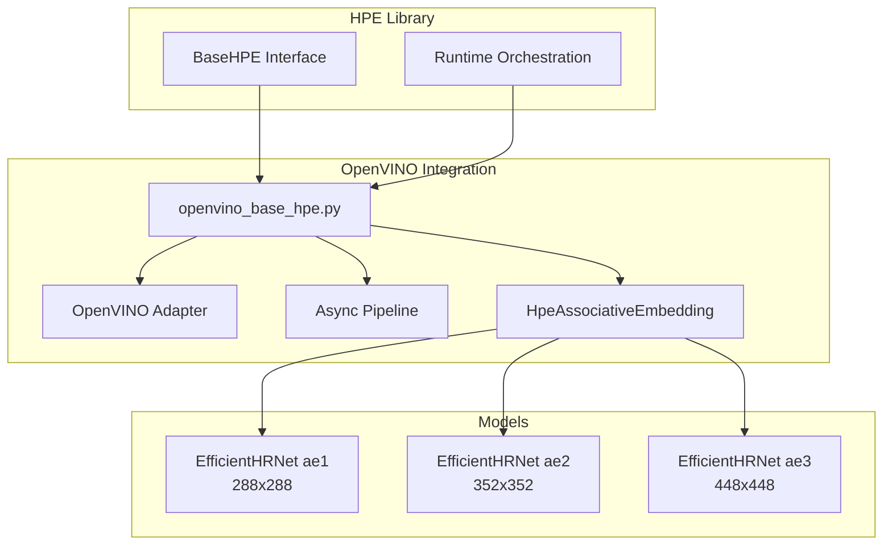
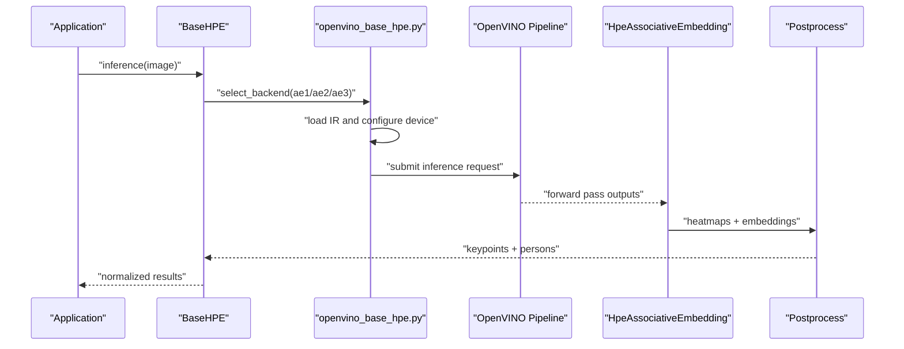
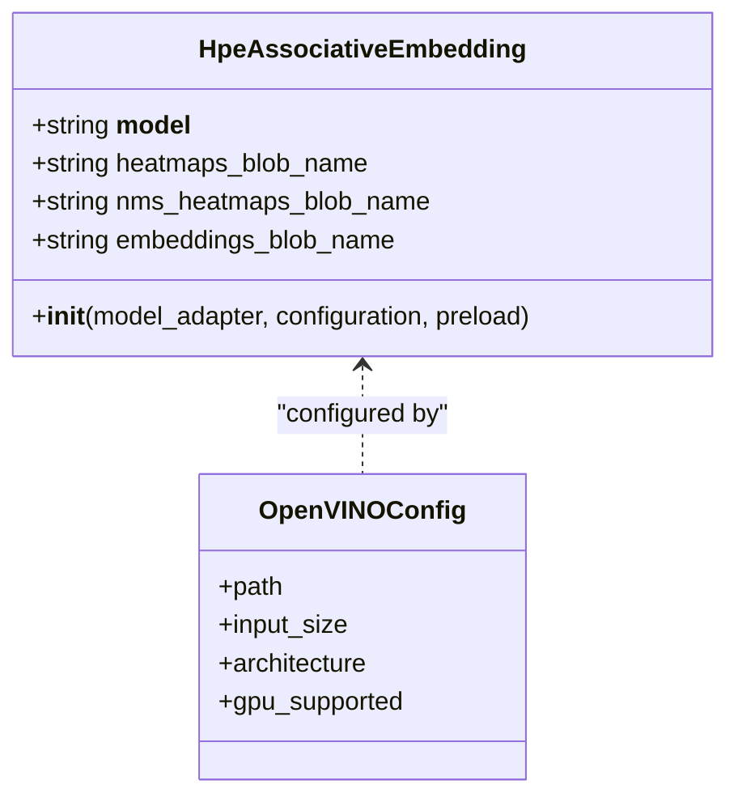
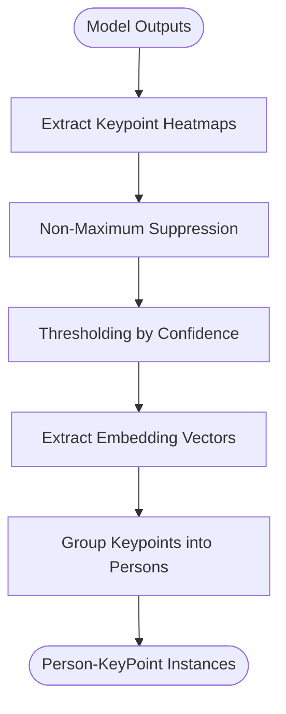
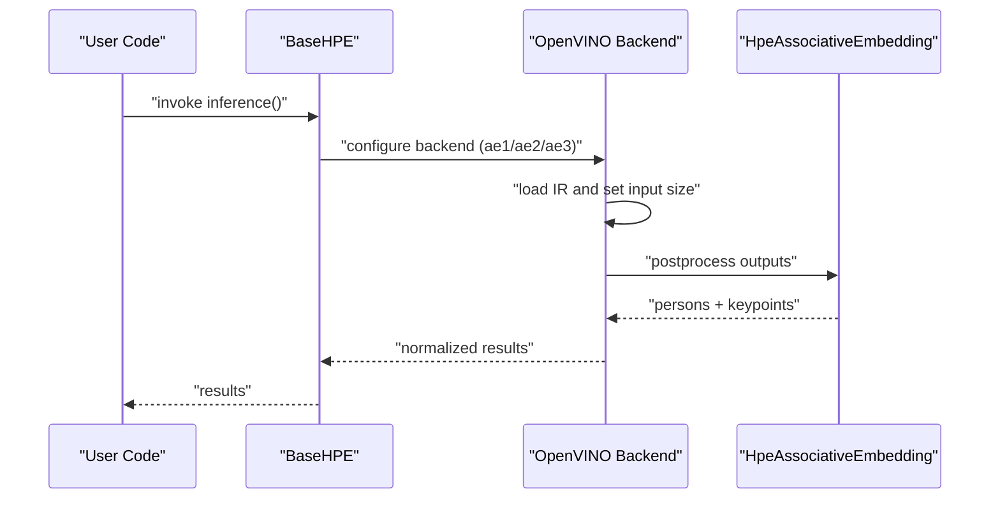
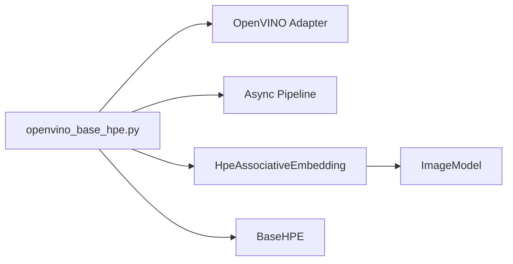

# EfficientHRNet Backends

<cite>
**Referenced Files in This Document**
- [openvino_base_hpe.py](file://openvino_base_hpe.py)
- [openvino_base_hpe.py.bak](file://openvino_base_hpe.py.bak)
- [hpe_associative_embedding.py](file://models/OpenVINO/model_api/models/hpe_associative_embedding.py)
- [base_hpe.py](file://base_hpe.py)
- [README.md](file://README.md)
- [ONBOARDING.md](file://ONBOARDING.md)
- [monitor_hpe/USAGE.md](file://monitor_hpe/USAGE.md)
- [monitor_hpe/AUTO_SCALING_IMPLEMENTATION_SUMMARY.md](file://monitor_hpe/AUTO_SCALING_IMPLEMENTATION_SUMMARY.md)
- [OPENVINO_CONFIG_USEFULNESS_ANALYSIS.md](file://OPENVINO_CONFIG_USEFULNESS_ANALYSIS.md)
- [dev_tools/smoke_test.sh](file://dev_tools/smoke_test.sh)
</cite>

## Table of Contents
1. [Introduction](#introduction)
2. [Project Structure](#project-structure)
3. [Core Components](#core-components)
4. [Architecture Overview](#architecture-overview)
5. [Detailed Component Analysis](#detailed-component-analysis)
6. [Dependency Analysis](#dependency-analysis)
7. [Performance Considerations](#performance-considerations)
8. [Troubleshooting Guide](#troubleshooting-guide)
9. [Conclusion](#conclusion)
10. [Appendices](#appendices)

## Introduction
This document explains the three EfficientHRNet OpenVINO backend variants (ae1, ae2, ae3) integrated into the unified Human Pose Estimation (HPE) framework. It covers the associative embedding methodology used by EfficientHRNet for 2D human pose estimation, detailing the keypoint detection and grouping processes. We document the three model variants with their specific input resolutions (288x288, 352x352, 448x448), the trade-offs between accuracy and computational cost, and the OpenVINO optimization benefits including model conversion, inference engine configuration, and GPU acceleration support. The document also describes the unified BaseHPE interface implementation, how the different resolutions integrate with the shared preprocessing and postprocessing pipeline, and provides selection guidance and hardware-specific tuning recommendations.

## Project Structure
The EfficientHRNet OpenVINO backends are part of a broader HPE library that supports multiple methods (AlphaPose, OpenPose, HigherHRNet, EfficientHRNet, MoveNet). The OpenVINO integration is implemented in a dedicated module that exposes a unified BaseHPE interface. The EfficientHRNet variants are configured as OpenVINO models with specific input sizes and architecture metadata.

Key structural elements:
- Unified HPE interface and runtime orchestration
- OpenVINO model adapter and pipelines
- Associative embedding postprocessing for EfficientHRNet
- Model configurations for ae1, ae2, ae3 and related models

**Diagram sources**
- [openvino_base_hpe.py:23-54](file://openvino_base_hpe.py#L23-L54)
- [hpe_associative_embedding.py:27-37](file://models/OpenVINO/model_api/models/hpe_associative_embedding.py#L27-L37)

**Section sources**
- [README.md:27](file://README.md#L27)
- [openvino_base_hpe.py:23-54](file://openvino_base_hpe.py#L23-L54)

## Core Components
- Unified BaseHPE interface: Provides a consistent API for invoking pose estimation across backends, including pre/post-processing hooks and result normalization.
- OpenVINO backend: Loads OpenVINO IR models, configures inference engines, and manages asynchronous pipelines for throughput.
- HpeAssociativeEmbedding postprocessor: Implements the EfficientHRNet associative embedding pipeline to decode heatmaps and embeddings into person-keypoint instances.
- Model configurations: Define model paths, input sizes, architectures, and GPU support flags for ae1, ae2, ae3 and related models.

Key implementation references:
- Model configuration dictionary with input sizes and architecture metadata
- HpeAssociativeEmbedding class initialization and blob name resolution
- BaseHPE interface definition and usage

**Section sources**
- [openvino_base_hpe.py:23-54](file://openvino_base_hpe.py#L23-L54)
- [hpe_associative_embedding.py:27-37](file://models/OpenVINO/model_api/models/hpe_associative_embedding.py#L27-L37)
- [base_hpe.py](file://base_hpe.py)

## Architecture Overview
The EfficientHRNet OpenVINO backends follow a layered architecture:
- Application layer invokes BaseHPE with a selected backend identifier (ae1/ae2/ae3).
- OpenVINO backend resolves the model configuration, loads the IR, and initializes the OpenVINO adapter and pipeline.
- The HpeAssociativeEmbedding postprocessor decodes model outputs into keypoints and groups them into persons using embedding similarity and NMS.
- Results are normalized and returned via the unified BaseHPE interface.

**Diagram sources**
- [openvino_base_hpe.py:23-54](file://openvino_base_hpe.py#L23-L54)
- [hpe_associative_embedding.py:27-37](file://models/OpenVINO/model_api/models/hpe_associative_embedding.py#L27-L37)

## Detailed Component Analysis

### EfficientHRNet Variants (ae1, ae2, ae3)
- ae1: 288x288 input resolution, optimized for speed and low latency.
- ae2: 352x352 input resolution, balanced accuracy and performance.
- ae3: 448x448 input resolution, higher accuracy at increased computational cost.

Each variant is exposed as an OpenVINO model with FP32 precision and GPU support enabled. The model configurations specify input size and architecture metadata for unified handling.

**Diagram sources**
- [hpe_associative_embedding.py:27-37](file://models/OpenVINO/model_api/models/hpe_associative_embedding.py#L27-L37)
- [openvino_base_hpe.py:23-54](file://openvino_base_hpe.py#L23-L54)

**Section sources**
- [openvino_base_hpe.py:30-47](file://openvino_base_hpe.py#L30-L47)

### Associative Embedding Methodology
EfficientHRNet employs associative embedding to detect keypoints and group them into persons:
- Keypoint heatmap detection: Each keypoint class produces a heatmap indicating likely locations.
- Embedding vectors: Each heatmap location predicts a compact embedding vector that encodes spatial proximity.
- NMS and thresholding: Heatmaps are processed with NMS to suppress overlapping detections.
- Grouping: Embeddings are used to associate nearby detections into person instances via clustering or graph matching.
- Final output: Person-keypoint pairs with confidence scores.

**Diagram sources**
- [hpe_associative_embedding.py:27-37](file://models/OpenVINO/model_api/models/hpe_associative_embedding.py#L27-L37)

**Section sources**
- [hpe_associative_embedding.py:27-37](file://models/OpenVINO/model_api/models/hpe_associative_embedding.py#L27-L37)

### Unified BaseHPE Interface Implementation
The BaseHPE interface defines the contract for all HPE backends. The OpenVINO backend integrates by:
- Selecting the appropriate model configuration by backend identifier.
- Loading the OpenVINO IR and initializing the adapter and pipeline.
- Preprocessing input frames to match the model’s input size.
- Running inference and applying the HpeAssociativeEmbedding postprocessor.
- Returning standardized results.

**Diagram sources**
- [openvino_base_hpe.py:23-54](file://openvino_base_hpe.py#L23-L54)
- [hpe_associative_embedding.py:27-37](file://models/OpenVINO/model_api/models/hpe_associative_embedding.py#L27-L37)

**Section sources**
- [base_hpe.py](file://base_hpe.py)
- [openvino_base_hpe.py:23-54](file://openvino_base_hpe.py#L23-L54)

### Progressive Resolution Trade-offs
- ae1 (288x288): Lower memory footprint and faster inference; suitable for latency-sensitive applications.
- ae2 (352x352): Balanced trade-off between speed and accuracy; recommended default for most deployments.
- ae3 (448x448): Highest accuracy but higher compute and memory usage; suited for offline or high-quality scenarios.

These trade-offs are reflected in observed performance characteristics and scaling behavior across environments.

**Section sources**
- [monitor_hpe/AUTO_SCALING_IMPLEMENTATION_SUMMARY.md:145](file://monitor_hpe/AUTO_SCALING_IMPLEMENTATION_SUMMARY.md#L145)
- [monitor_hpe/USAGE.md:104](file://monitor_hpe/USAGE.md#L104)

### OpenVINO Optimization Benefits
- Model conversion: EfficientHRNet models are provided as OpenVINO IR (XML/CBIN) for CPU/GPU acceleration.
- Inference engine configuration: Unified configuration enables device selection and performance tuning.
- GPU acceleration: All EfficientHRNet variants are marked GPU supported, enabling acceleration on compatible devices.
- Asynchronous pipelines: Throughput-oriented execution with configurable batch sizes and threads.

**Section sources**
- [openvino_base_hpe.py:23-54](file://openvino_base_hpe.py#L23-L54)
- [OPENVINO_CONFIG_USEFULNESS_ANALYSIS.md](file://OPENVINO_CONFIG_USEFULNESS_ANALYSIS.md)

## Dependency Analysis
The OpenVINO backend depends on:
- OpenVINO runtime and model API for loading and inference.
- HpeAssociativeEmbedding for postprocessing.
- BaseHPE for the unified interface contract.

**Diagram sources**
- [openvino_base_hpe.py:23-54](file://openvino_base_hpe.py#L23-L54)
- [hpe_associative_embedding.py:27-37](file://models/OpenVINO/model_api/models/hpe_associative_embedding.py#L27-L37)

**Section sources**
- [openvino_base_hpe.py:23-54](file://openvino_base_hpe.py#L23-L54)
- [hpe_associative_embedding.py:27-37](file://models/OpenVINO/model_api/models/hpe_associative_embedding.py#L27-L37)

## Performance Considerations
- Throughput vs. latency: Higher resolution (ae3) increases latency and memory usage; ae1 prioritizes speed.
- GPU utilization: EfficientHRNet variants leverage GPU acceleration when available; ensure proper device configuration.
- Multi-threading: OpenVINO backends benefit from multi-threading; tune thread counts per workload.
- Batch processing: Asynchronous pipelines enable batching for improved throughput.

Practical guidance:
- Use ae1 for real-time streaming with strict latency budgets.
- Use ae2 for general-purpose deployments balancing quality and speed.
- Use ae3 for offline processing or when highest accuracy is required.

**Section sources**
- [monitor_hpe/USAGE.md:298](file://monitor_hpe/USAGE.md#L298)
- [monitor_hpe/AUTO_SCALING_IMPLEMENTATION_SUMMARY.md:145](file://monitor_hpe/AUTO_SCALING_IMPLEMENTATION_SUMMARY.md#L145)
- [dev_tools/smoke_test.sh:37](file://dev_tools/smoke_test.sh#L37)

## Troubleshooting Guide
Common issues and remedies:
- Model path errors: Verify model XML paths in the configuration dictionary.
- Device compatibility: Ensure GPU acceleration is enabled and drivers are installed if targeting GPU.
- Memory pressure: Reduce input resolution (ae1) or batch size; adjust thread counts.
- Performance bottlenecks: Profile inference stages; consider disabling non-essential postprocessing steps.

Validation references:
- Model configuration entries for EfficientHRNet variants
- OpenVINO configuration and pipeline usage
- Smoke testing scripts exercising ae1

**Section sources**
- [openvino_base_hpe.py:23-54](file://openvino_base_hpe.py#L23-L54)
- [dev_tools/smoke_test.sh:37](file://dev_tools/smoke_test.sh#L37)

## Conclusion
The EfficientHRNet OpenVINO backends (ae1, ae2, ae3) provide a scalable and optimized solution for 2D human pose estimation. By leveraging OpenVINO’s model conversion and inference pipeline, they deliver consistent performance across CPU and GPU platforms while maintaining a unified interface. The progressive increase in input resolution offers predictable trade-offs between accuracy and computational cost, enabling deployment flexibility across diverse application requirements.

## Appendices

### Appendix A: Variant Selection Guide
- Choose ae1 for latency-critical streaming applications.
- Choose ae2 for balanced performance and accuracy.
- Choose ae3 for offline or high-fidelity scenarios.

**Section sources**
- [ONBOARDING.md:342](file://ONBOARDING.md#L342)
- [monitor_hpe/USAGE.md:104](file://monitor_hpe/USAGE.md#L104)

### Appendix B: Hardware-Specific Tuning Recommendations
- CPU: Enable multi-threading; adjust number of inference threads based on core count.
- GPU: Ensure OpenVINO GPU plugin is available; verify driver compatibility.
- Memory: Monitor peak memory during inference; reduce resolution or batch size if needed.

**Section sources**
- [OPENVINO_CONFIG_USEFULNESS_ANALYSIS.md](file://OPENVINO_CONFIG_USEFULNESS_ANALYSIS.md)
- [monitor_hpe/USAGE.md:298](file://monitor_hpe/USAGE.md#L298)