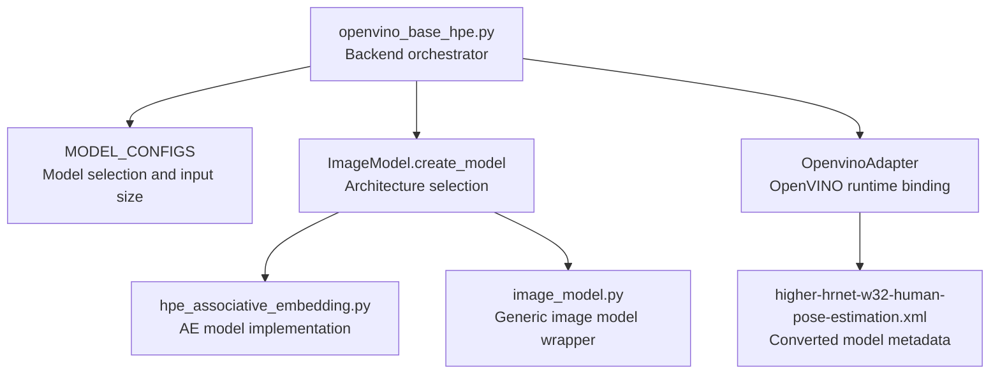
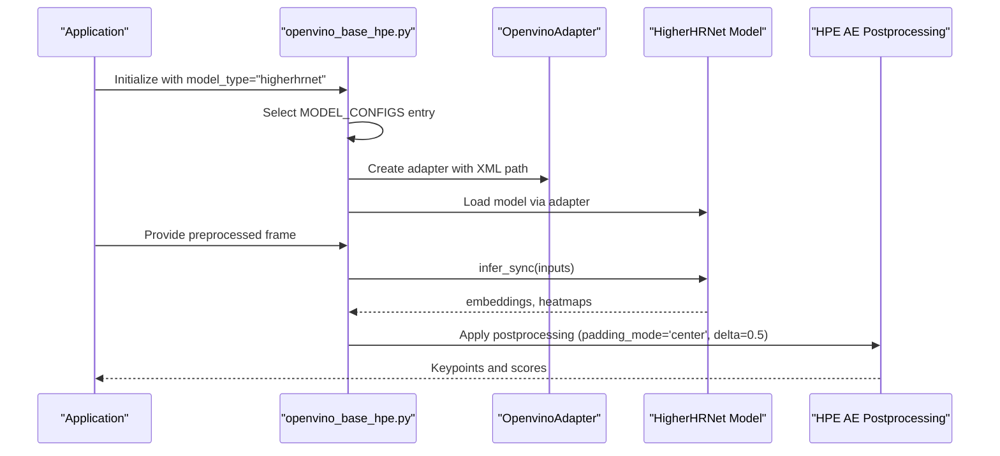
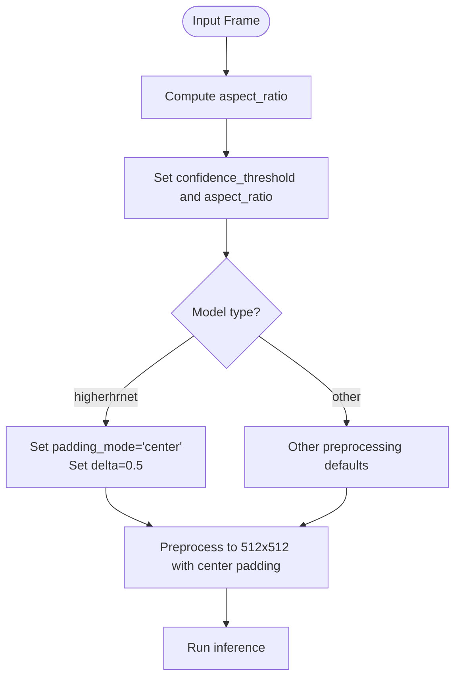
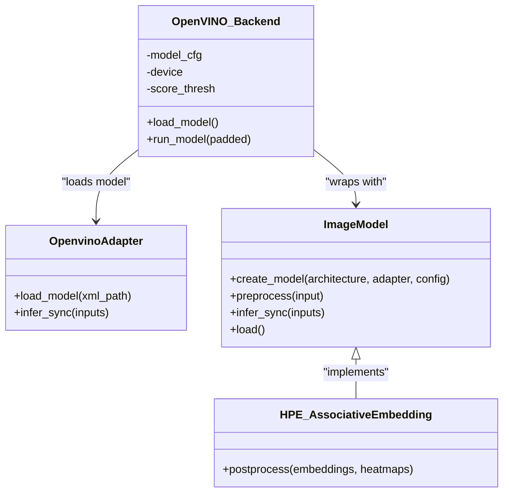
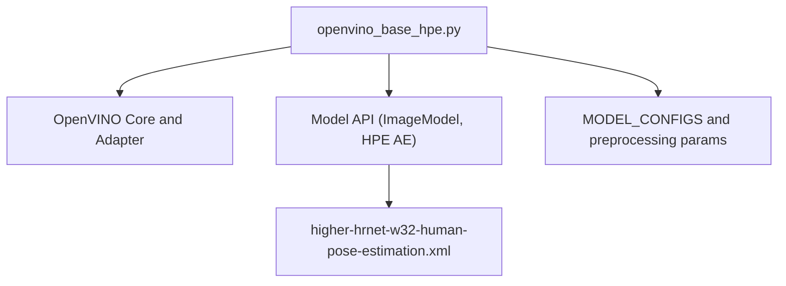

# HigherHRNet Backend

<cite>
**Referenced Files in This Document**
- [openvino_base_hpe.py](file://openvino_base_hpe.py)
- [openvino_base_hpe.py.bak](file://openvino_base_hpe.py.bak)
- [hpe_associative_embedding.py](file://models/OpenVINO/model_api/models/hpe_associative_embedding.py)
- [image_model.py](file://models/OpenVINO/model_api/models/image_model.py)
- [model.py](file://open_model_zoo/models/public/higher-hrnet-w32-human-pose-estimation/model.py)
- [higher-hrnet-w32-human-pose-estimation.xml](file://models/OpenVINO/pretrained_models/public/F32/higher-hrnet-w32-human-pose-estimation.xml)
- [ONBOARDING.md](file://ONBOARDING.md)
- [README.md](file://README.md)
- [Dockerfile.hpe](file://Dockerfile.hpe)
- [Dockerfile_base](file://Dockerfile_base)
- [Dockerfile_combined_multistage_app](file://Dockerfile_combined_multistage_app)
- [Dockerfile_cuda_ffmpeg_hpe](file://Dockerfile_cuda_ffmpeg_hpe)
- [Dockerfile_with_opencv](file://Dockerfile_with_opencv)
- [alphapose_experiment.ipynb](file://alphapose_experiment.ipynb)
- [TASK_6_COMPLETION_SUMMARY.md](file://TASK_6_COMPLETION_SUMMARY.md)
- [branch-diff_cuda-dev_vs_feat-ov-epyc-4vcpu.md](file://branch-diff_cuda-dev_vs_feat-ov-epyc-4vcpu.md)
</cite>

## Table of Contents
1. [Introduction](#introduction)
2. [Project Structure](#project-structure)
3. [Core Components](#core-components)
4. [Architecture Overview](#architecture-overview)
5. [Detailed Component Analysis](#detailed-component-analysis)
6. [Dependency Analysis](#dependency-analysis)
7. [Performance Considerations](#performance-considerations)
8. [Troubleshooting Guide](#troubleshooting-guide)
9. [Conclusion](#conclusion)
10. [Appendices](#appendices)

## Introduction
This document explains the HigherHRNet OpenVINO backend implementation used for top-down human pose estimation. It covers the high-resolution representation learning methodology, the multi-scale convolutional architecture, and the hourglass-style processing pipeline. It also documents the model’s unique characteristics (512x512 input resolution, center padding mode, delta parameter), OpenVINO optimization benefits (model conversion, inference engine configuration, CPU-only deployment), and how HigherHRNet differs from bottom-up approaches like OpenPose. Guidance is provided on configuration parameters, performance and memory characteristics, and when to choose HigherHRNet over other backends.

## Project Structure
The HigherHRNet OpenVINO backend integrates with the model API and OpenVINO runtime. The key elements include:
- Model configuration and selection
- Preprocessing configuration (including padding_mode and delta)
- Model adapter and inference pipeline
- Model-specific configuration and metadata

**Diagram sources**
- [openvino_base_hpe.py:23-53](file://openvino_base_hpe.py#L23-L53)
- [hpe_associative_embedding.py](file://models/OpenVINO/model_api/models/hpe_associative_embedding.py)
- [image_model.py](file://models/OpenVINO/model_api/models/image_model.py)
- [higher-hrnet-w32-human-pose-estimation.xml](file://models/OpenVINO/pretrained_models/public/F32/higher-hrnet-w32-human-pose-estimation.xml)

**Section sources**
- [openvino_base_hpe.py:23-53](file://openvino_base_hpe.py#L23-L53)
- [openvino_base_hpe.py:115-123](file://openvino_base_hpe.py#L115-L123)
- [openvino_base_hpe.py:238-261](file://openvino_base_hpe.py#L238-L261)

## Core Components
- Model configuration dictionary defines HigherHRNet with a 512x512 input size and HPE-associative-embedding architecture. It also marks GPU support as false, indicating CPU-only deployment.
- Preprocessing configuration sets padding_mode to "center" and delta to 0.5 specifically for HigherHRNet, ensuring proper center-padding behavior and scale normalization during inference.
- The model adapter binds to the OpenVINO runtime, loading the FP32 XML model and preparing it for inference.

Key configuration highlights:
- Input size: 512x512
- Padding mode: "center"
- Delta: 0.5
- Architecture: HPE-associative-embedding
- GPU support: False (CPU-only)

**Section sources**
- [openvino_base_hpe.py:23-53](file://openvino_base_hpe.py#L23-L53)
- [openvino_base_hpe.py:238-261](file://openvino_base_hpe.py#L238-L261)
- [openvino_base_hpe.py:115-123](file://openvino_base_hpe.py#L115-L123)

## Architecture Overview
HigherHRNet employs a high-resolution representation learning approach with multi-scale convolutional processing and hourglass-style refinement. The OpenVINO backend loads a converted FP32 model and applies preprocessing tailored to HigherHRNet’s requirements, including center padding and delta scaling. The model outputs embeddings and heatmaps, enabling top-down pose estimation with precise localization.

**Diagram sources**
- [openvino_base_hpe.py:23-53](file://openvino_base_hpe.py#L23-L53)
- [openvino_base_hpe.py:238-261](file://openvino_base_hpe.py#L238-L261)
- [hpe_associative_embedding.py](file://models/OpenVINO/model_api/models/hpe_associative_embedding.py)

## Detailed Component Analysis

### HigherHRNet Model Configuration
- Input resolution: 512x512
- Architecture: HPE-associative-embedding
- GPU support: Disabled (CPU-only)
- Preprocessing parameters: padding_mode="center", delta=0.5

These settings ensure the model receives properly centered and scaled inputs, aligning with the high-resolution representation learning paradigm.

**Section sources**
- [openvino_base_hpe.py:23-53](file://openvino_base_hpe.py#L23-L53)
- [openvino_base_hpe.py:238-261](file://openvino_base_hpe.py#L238-L261)

### Preprocessing Pipeline for HigherHRNet
The preprocessing configuration enables:
- Center padding to maintain aspect ratio while filling the 512x512 input
- Delta scaling to normalize the scale factor applied during resizing

**Diagram sources**
- [openvino_base_hpe.py:238-261](file://openvino_base_hpe.py#L238-L261)

**Section sources**
- [openvino_base_hpe.py:238-261](file://openvino_base_hpe.py#L238-L261)

### OpenVINO Runtime Binding and Model Loading
- The backend constructs an OpenVINO core and applies CPU performance hints.
- An OpenVINO adapter loads the FP32 XML model and prepares it for synchronous inference.
- The model is then wrapped by the appropriate ImageModel implementation for postprocessing.

**Diagram sources**
- [openvino_base_hpe.py:92-123](file://openvino_base_hpe.py#L92-L123)
- [openvino_base_hpe.py:238-261](file://openvino_base_hpe.py#L238-L261)
- [hpe_associative_embedding.py](file://models/OpenVINO/model_api/models/hpe_associative_embedding.py)
- [image_model.py](file://models/OpenVINO/model_api/models/image_model.py)

**Section sources**
- [openvino_base_hpe.py:92-123](file://openvino_base_hpe.py#L92-L123)
- [openvino_base_hpe.py:238-261](file://openvino_base_hpe.py#L238-L261)

### Model Metadata and Conversion Details
- The model is converted from ONNX with an input shape of [1, 3, 512, 512].
- Mean and scale values are applied during conversion to match the model’s preprocessing expectations.
- The output nodes include embeddings and heatmaps.

**Section sources**
- [higher-hrnet-w32-human-pose-estimation.xml:34200-34212](file://models/OpenVINO/pretrained_models/public/F32/higher-hrnet-w32-human-pose-estimation.xml#L34200-L34212)

### Top-Down vs Bottom-Up Pose Estimation
- HigherHRNet is a top-down method that estimates poses per detected person, leveraging high-resolution feature maps for precise localization.
- Bottom-up methods (e.g., OpenPose) first detect parts and then associate them into instances, often at lower resolution.

This distinction influences accuracy, speed, and memory usage trade-offs.

**Section sources**
- [README.md:139-145](file://README.md#L139-L145)

## Dependency Analysis
The HigherHRNet OpenVINO backend depends on:
- OpenVINO runtime and adapter for model loading and inference
- Model API wrappers for preprocessing and postprocessing
- Model-specific configuration and metadata

**Diagram sources**
- [openvino_base_hpe.py:23-53](file://openvino_base_hpe.py#L23-L53)
- [openvino_base_hpe.py:92-123](file://openvino_base_hpe.py#L92-L123)
- [higher-hrnet-w32-human-pose-estimation.xml](file://models/OpenVINO/pretrained_models/public/F32/higher-hrnet-w32-human-pose-estimation.xml)

**Section sources**
- [openvino_base_hpe.py:23-53](file://openvino_base_hpe.py#L23-L53)
- [openvino_base_hpe.py:92-123](file://openvino_base_hpe.py#L92-L123)

## Performance Considerations
- Input resolution: 512x512 increases computational and memory demands compared to smaller resolutions.
- CPU-only deployment: Suitable for environments without GPUs; performance varies by CPU architecture and OpenVINO CPU optimizations.
- Benchmarking: The project includes comparative throughput observations for HigherHRNet on CPU.

Optimization tips:
- Enable OpenVINO CPU performance hints and thread tuning.
- Prefer FP32 for stability on CPU; switch to FP16 only if supported and beneficial.
- Use center padding and delta consistently to avoid repeated preprocessing overhead.

**Section sources**
- [openvino_base_hpe.py:92-123](file://openvino_base_hpe.py#L92-L123)
- [TASK_6_COMPLETION_SUMMARY.md:206](file://TASK_6_COMPLETION_SUMMARY.md#L206)
- [TASK_6_COMPLETION_SUMMARY.md:352](file://TASK_6_COMPLETION_SUMMARY.md#L352)

## Troubleshooting Guide
Common issues and remedies:
- Incorrect input size: Ensure the input is resized to 512x512 with center padding enabled.
- Wrong preprocessing parameters: Set padding_mode="center" and delta=0.5 for HigherHRNet.
- CPU performance bottlenecks: Verify OpenVINO CPU configuration and adjust threads; confirm model is loaded as FP32.
- Model path errors: Confirm the XML path exists and is readable by the adapter.

**Section sources**
- [openvino_base_hpe.py:238-261](file://openvino_base_hpe.py#L238-L261)
- [openvino_base_hpe.py:92-123](file://openvino_base_hpe.py#L92-L123)

## Conclusion
HigherHRNet delivers high-resolution top-down pose estimation with strong accuracy but at higher computational and memory cost. The OpenVINO backend supports CPU-only deployment with explicit configuration for center padding and delta scaling. Choose HigherHRNet when precision matters and resources permit; otherwise, consider lighter alternatives like EfficientHRNet or bottom-up methods like OpenPose.

## Appendices

### Choosing HigherHRNet
- Use HigherHRNet when:
  - High-resolution feature maps and precise localization are required
  - Accuracy is prioritized over throughput
  - CPU-only deployment is acceptable
- Consider alternatives when:
  - Lower latency or reduced memory footprint is needed
  - Multi-person scenes benefit from bottom-up association

**Section sources**
- [ONBOARDING.md:50](file://ONBOARDING.md#L50)
- [ONBOARDING.md:335-374](file://ONBOARDING.md#L335-L374)

### Configuration Reference
- padding_mode: "center"
- delta: 0.5
- input_size: 512x512
- architecture: HPE-associative-embedding
- gpu_supported: False

**Section sources**
- [openvino_base_hpe.py:23-53](file://openvino_base_hpe.py#L23-L53)
- [openvino_base_hpe.py:238-261](file://openvino_base_hpe.py#L238-L261)

### Deployment Notes
- Model artifacts are fetched via download steps in Dockerfiles; ensure network access and disk space for the FP32 binary.
- The notebook demonstrates initializing HigherHRNet via the backend.

**Section sources**
- [Dockerfile.hpe:114](file://Dockerfile.hpe#L114)
- [Dockerfile_base:77](file://Dockerfile_base#L77)
- [Dockerfile_combined_multistage_app:176](file://Dockerfile_combined_multistage_app#L176)
- [Dockerfile_cuda_ffmpeg_hpe:95](file://Dockerfile_cuda_ffmpeg_hpe#L95)
- [Dockerfile_with_opencv:251](file://Dockerfile_with_opencv#L251)
- [alphapose_experiment.ipynb:115](file://alphapose_experiment.ipynb#L115)