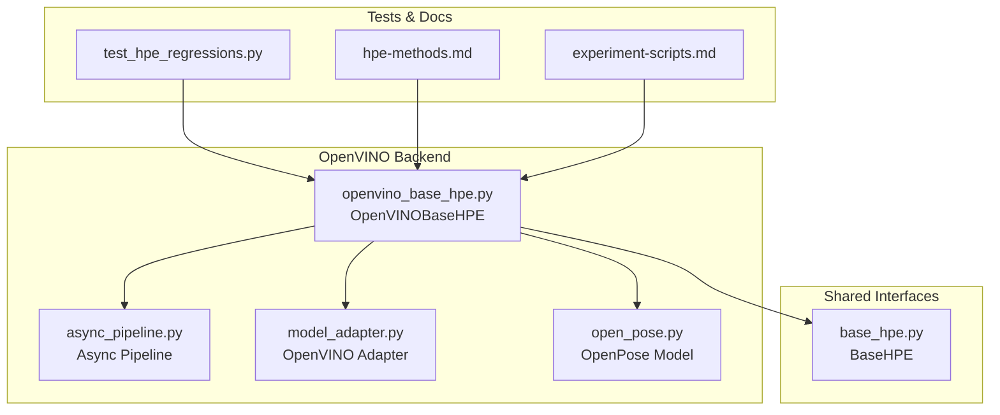
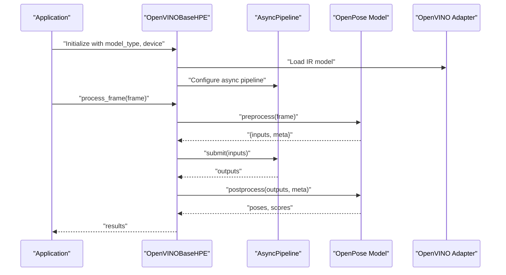
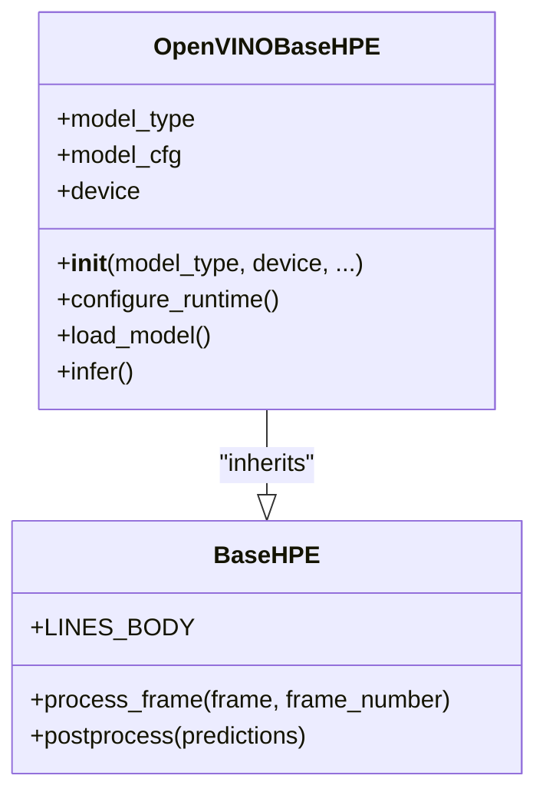
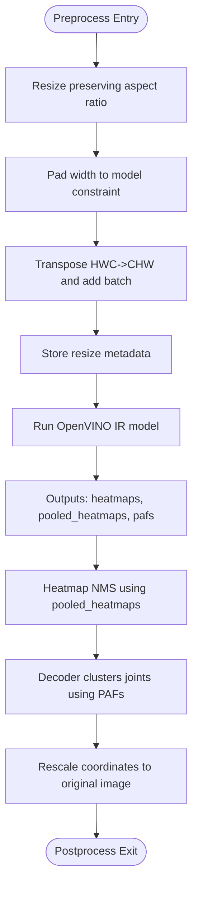
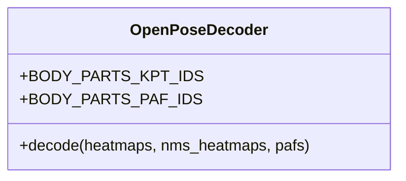
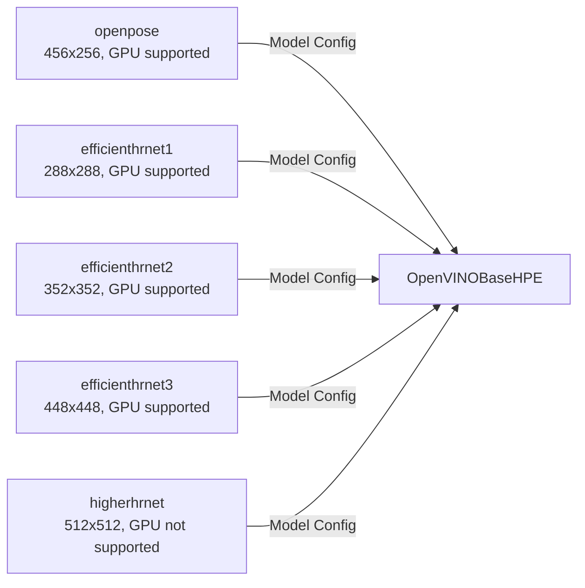
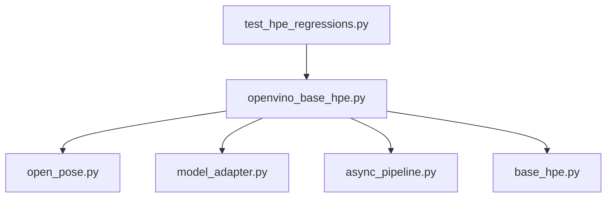

# OpenPose Backend

<cite>
**Referenced Files in This Document**
- [openvino_base_hpe.py](file://openvino_base_hpe.py)
- [base_hpe.py](file://base_hpe.py)
- [open_pose.py](file://models/OpenVINO/model_api/models/open_pose.py)
- [model_adapter.py](file://models/OpenVINO/model_api/adapters/model_adapter.py)
- [async_pipeline.py](file://models/OpenVINO/model_api/pipelines/async_pipeline.py)
- [test_hpe_regressions.py](file://tests/test_hpe_regressions.py)
- [hpe-methods.md](file://docs/hpe-methods.md)
- [experiment-scripts.md](file://docs/experiment-scripts.md)
</cite>

## Table of Contents
1. [Introduction](#introduction)
2. [Project Structure](#project-structure)
3. [Core Components](#core-components)
4. [Architecture Overview](#architecture-overview)
5. [Detailed Component Analysis](#detailed-component-analysis)
6. [Dependency Analysis](#dependency-analysis)
7. [Performance Considerations](#performance-considerations)
8. [Troubleshooting Guide](#troubleshooting-guide)
9. [Conclusion](#conclusion)
10. [Appendices](#appendices)

## Introduction
This document explains the OpenPose OpenVINO backend implementation used for real-time human pose estimation. It covers the bottom-up approach, part affinity field (PAF) computation, joint detection methodology, model architecture, input preprocessing requirements, confidence thresholds, and OpenVINO optimization benefits such as model conversion, inference engine configuration, and GPU acceleration. It also documents the unified BaseHPE interface, integration with shared preprocessing and postprocessing pipelines, configuration parameters (including upsample_ratio and padding modes), and practical guidance for model selection, optimization, and hardware-specific tuning.

## Project Structure
The OpenPose OpenVINO backend is implemented as a thin wrapper around the Model API’s OpenPose model. The key files are:
- An OpenVINO-specific base class that manages model configuration, device selection, and runtime parameters
- The OpenPose Model API implementation that performs preprocessing, inference, decoding, and postprocessing
- Adapter and pipeline modules that integrate with the OpenVINO runtime and enable asynchronous inference
- Tests validating the OpenVINO integration and preprocessing behavior

**Diagram sources**
- [openvino_base_hpe.py:56-120](file://openvino_base_hpe.py#L56-L120)
- [open_pose.py:29-137](file://models/OpenVINO/model_api/models/open_pose.py#L29-L137)
- [model_adapter.py](file://models/OpenVINO/model_api/adapters/model_adapter.py)
- [async_pipeline.py](file://models/OpenVINO/model_api/pipelines/async_pipeline.py)
- [base_hpe.py](file://base_hpe.py)
- [test_hpe_regressions.py:40-67](file://tests/test_hpe_regressions.py#L40-L67)
- [hpe-methods.md](file://docs/hpe-methods.md)
- [experiment-scripts.md](file://docs/experiment-scripts.md)

**Section sources**
- [openvino_base_hpe.py:23-54](file://openvino_base_hpe.py#L23-L54)
- [open_pose.py:29-137](file://models/OpenVINO/model_api/models/open_pose.py#L29-L137)

## Core Components
- OpenVINOBaseHPE: Provides model configuration, device selection, and runtime parameters. Supports multiple architectures and GPU acceleration where available.
- OpenPose Model: Implements preprocessing, inference, NMS-based heatmap filtering, decoder-based pose linking using PAFs, and coordinate rescaling.
- OpenVINO Adapter and Async Pipeline: Integrate with the OpenVINO runtime and enable asynchronous inference for throughput optimization.
- BaseHPE: Shared interface enabling unified preprocessing and postprocessing across methods.

Key capabilities:
- Bottom-up pose estimation with part affinity fields (PAFs)
- Heatmap NMS and decoder-based pose clustering
- Coordinate rescaling to match original image scale
- Environment-driven configuration for threads, streams, and CPU pinning

**Section sources**
- [openvino_base_hpe.py:56-120](file://openvino_base_hpe.py#L56-L120)
- [open_pose.py:29-137](file://models/OpenVINO/model_api/models/open_pose.py#L29-L137)
- [base_hpe.py](file://base_hpe.py)

## Architecture Overview
The OpenPose OpenVINO backend follows a layered architecture:
- Application layer: OpenVINOBaseHPE orchestrates model loading, preprocessing, inference, and postprocessing
- Model API layer: OpenPose model encapsulates OpenVINO graph execution and decoding logic
- Runtime layer: OpenVINO adapter and async pipeline manage device allocation and inference scheduling

**Diagram sources**
- [openvino_base_hpe.py:65-120](file://openvino_base_hpe.py#L65-L120)
- [open_pose.py:128-136](file://models/OpenVINO/model_api/models/open_pose.py#L128-L136)
- [async_pipeline.py](file://models/OpenVINO/model_api/pipelines/async_pipeline.py)
- [model_adapter.py](file://models/OpenVINO/model_api/adapters/model_adapter.py)

## Detailed Component Analysis

### OpenVINOBaseHPE: Unified Interface and Device Configuration
- Maintains a registry of supported models with input sizes and GPU support flags
- Accepts device selection and environment-driven runtime parameters (threads, streams, CPU pinning, hyper-threading)
- Integrates with the shared BaseHPE interface for preprocessing and postprocessing
- Special handling for OpenPose and HigherHRNet to avoid redundant rescaling during preprocessing

**Diagram sources**
- [openvino_base_hpe.py:56-120](file://openvino_base_hpe.py#L56-L120)
- [base_hpe.py](file://base_hpe.py)

**Section sources**
- [openvino_base_hpe.py:23-54](file://openvino_base_hpe.py#L23-L54)
- [openvino_base_hpe.py:65-120](file://openvino_base_hpe.py#L65-L120)
- [test_hpe_regressions.py:48-67](file://tests/test_hpe_regressions.py#L48-L67)

### OpenPose Model: Preprocessing, Inference, and Postprocessing
- Preprocessing:
  - Resize to model input while preserving aspect ratio
  - Pad to width to ensure divisibility and maintain aspect ratio
  - Convert to CHW layout and batch dimension
  - Store scaling metadata for later rescaling
- Inference:
  - Executes the OpenVINO IR graph to produce heatmaps, pooled heatmaps, and PAFs
- Postprocessing:
  - Applies heatmap NMS using pooled heatmaps
  - Uses decoder to cluster joints into poses via PAFs
  - Rescales coordinates to original image scale using stored metadata

**Diagram sources**
- [open_pose.py:110-136](file://models/OpenVINO/model_api/models/open_pose.py#L110-L136)

**Section sources**
- [open_pose.py:110-136](file://models/OpenVINO/model_api/models/open_pose.py#L110-L136)

### Decoder and PAF Computation
- The decoder uses predefined body part connections and PAF indices to associate keypoints into person instances
- It relies on the model outputs (heatmaps and PAFs) to form pose candidates and refine them using PAF scores

**Diagram sources**
- [open_pose.py:139-143](file://models/OpenVINO/model_api/models/open_pose.py#L139-L143)

**Section sources**
- [open_pose.py:139-143](file://models/OpenVINO/model_api/models/open_pose.py#L139-L143)

### Model Registry and Input Sizes
- The backend supports multiple architectures with distinct input sizes and GPU support flags
- OpenPose uses a fixed input size of 456x256, while other architectures support larger resolutions

**Diagram sources**
- [openvino_base_hpe.py:23-54](file://openvino_base_hpe.py#L23-L54)

**Section sources**
- [openvino_base_hpe.py:23-54](file://openvino_base_hpe.py#L23-L54)

## Dependency Analysis
- OpenVINOBaseHPE depends on:
  - OpenPose Model for inference and decoding
  - OpenVINO Adapter for model loading and execution
  - Async Pipeline for asynchronous inference scheduling
  - BaseHPE for shared preprocessing and postprocessing
- Tests validate:
  - OpenVINO adapter usage for OpenPose
  - Correct architecture preservation
  - Preprocessing behavior for OpenPose and HigherHRNet (avoiding extra rescaling)

**Diagram sources**
- [openvino_base_hpe.py:56-120](file://openvino_base_hpe.py#L56-L120)
- [open_pose.py:29-137](file://models/OpenVINO/model_api/models/open_pose.py#L29-L137)
- [model_adapter.py](file://models/OpenVINO/model_api/adapters/model_adapter.py)
- [async_pipeline.py](file://models/OpenVINO/model_api/pipelines/async_pipeline.py)
- [base_hpe.py](file://base_hpe.py)
- [test_hpe_regressions.py:40-67](file://tests/test_hpe_regressions.py#L40-L67)

**Section sources**
- [test_hpe_regressions.py:40-67](file://tests/test_hpe_regressions.py#L40-L67)

## Performance Considerations
- OpenVINO optimization benefits:
  - Model conversion to IR format enables optimized inference
  - Asynchronous pipeline improves throughput by overlapping pre/postprocessing with inference
  - GPU acceleration support for compatible models reduces latency
- Runtime configuration:
  - Threads, streams, CPU pinning, and hyper-threading can be controlled via environment variables
  - Device selection defaults to GPU for OpenPose but can be overridden
- Practical tips:
  - Prefer GPU for OpenPose when available
  - Tune streams and threads for workload characteristics
  - Use appropriate input size for accuracy/performance balance

**Section sources**
- [openvino_base_hpe.py:74-78](file://openvino_base_hpe.py#L74-L78)
- [hpe-methods.md](file://docs/hpe-methods.md)
- [experiment-scripts.md](file://docs/experiment-scripts.md)

## Troubleshooting Guide
- Unsupported model type:
  - Ensure the model type exists in the registry and is supported on the selected device
- Preprocessing anomalies:
  - Verify that OpenPose and HigherHRNet use the original frame for preprocessing and skip extra rescaling steps
- Environment configuration:
  - Confirm environment variables for threads, streams, CPU pinning, and hyper-threading are set appropriately
- Device selection:
  - Check method-based defaults and override via command-line or environment as needed

**Section sources**
- [openvino_base_hpe.py:65-78](file://openvino_base_hpe.py#L65-L78)
- [test_hpe_regressions.py:48-67](file://tests/test_hpe_regressions.py#L48-L67)
- [hpe-methods.md](file://docs/hpe-methods.md)
- [experiment-scripts.md](file://docs/experiment-scripts.md)

## Conclusion
The OpenPose OpenVINO backend provides a robust, optimized solution for real-time human pose estimation. By leveraging OpenVINO’s IR models, asynchronous pipelines, and GPU acceleration, it achieves low-latency inference suitable for streaming scenarios. The unified BaseHPE interface ensures consistent preprocessing and postprocessing across methods, while environment-driven configuration enables flexible tuning for diverse hardware setups.

## Appendices

### Configuration Parameters and Tuning Options
- Model selection:
  - Choose OpenPose for 456x256 input and GPU support
  - Consider EfficientHRNet variants for larger resolutions and GPU support
  - HigherHRNet supports larger resolutions but is not GPU-accelerated in this backend
- Preprocessing:
  - Input size per model type is defined in the registry
  - Padding mode is constant zero-padding to meet width constraints
- Confidence thresholds:
  - Adjust via the OpenPose decoder and postprocessing stages as needed
- Performance tuning:
  - Threads, streams, CPU pinning, and hyper-threading can be configured via environment variables
  - Device defaults favor GPU for OpenPose; override as needed

**Section sources**
- [openvino_base_hpe.py:23-54](file://openvino_base_hpe.py#L23-L54)
- [open_pose.py:110-136](file://models/OpenVINO/model_api/models/open_pose.py#L110-L136)
- [openvino_base_hpe.py:74-78](file://openvino_base_hpe.py#L74-L78)
- [hpe-methods.md](file://docs/hpe-methods.md)
- [experiment-scripts.md](file://docs/experiment-scripts.md)