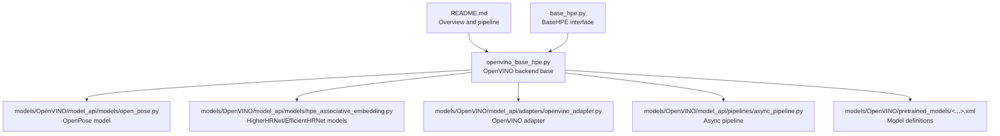
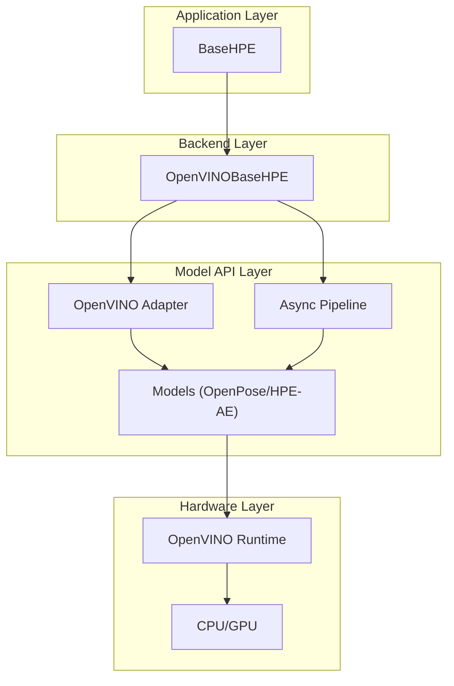
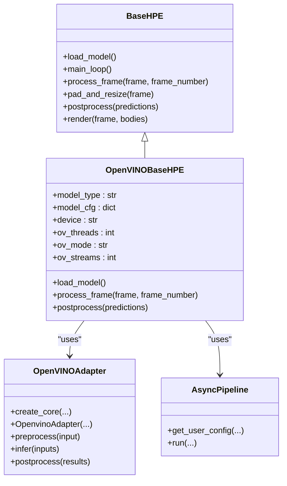
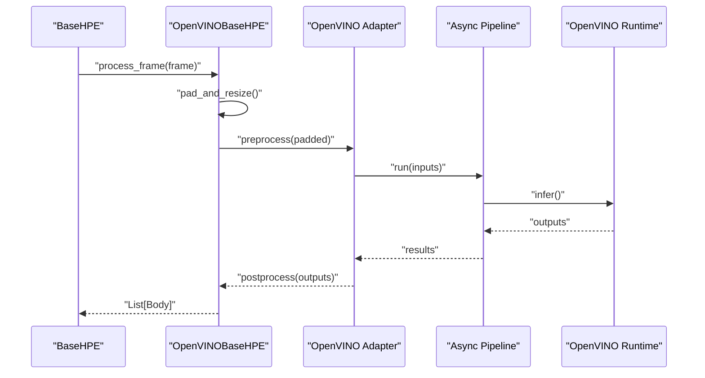
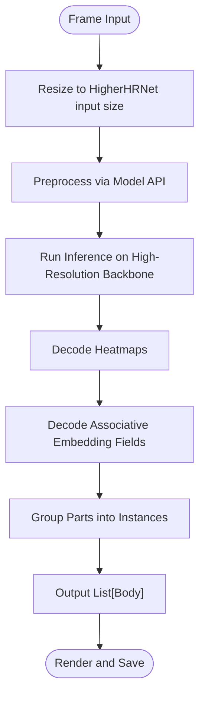
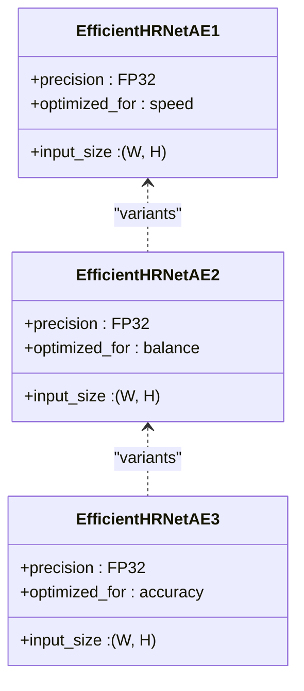
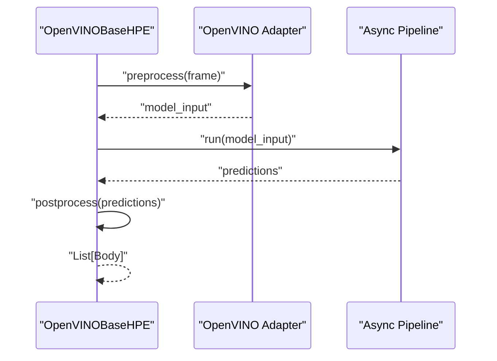
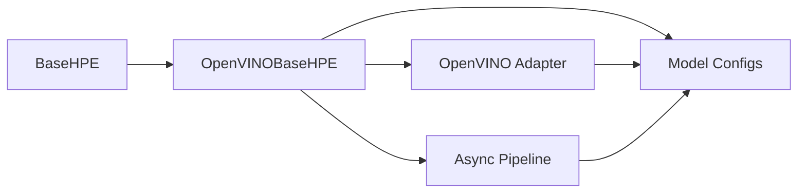

# OpenVINO Backends

<cite>
**Referenced Files in This Document**
- [README.md](file://README.md)
- [openvino_base_hpe.py](file://openvino_base_hpe.py)
- [openvino_base_hpe.py.bak](file://openvino_base_hpe.py.bak)
- [base_hpe.py](file://base_hpe.py)
- [models/OpenVINO/model_api/models/open_pose.py](file://models/OpenVINO/model_api/models/open_pose.py)
- [models/OpenVINO/model_api/models/hpe_associative_embedding.py](file://models/OpenVINO/model_api/models/hpe_associative_embedding.py)
- [models/OpenVINO/model_api/adapters/openvino_adapter.py](file://models/OpenVINO/model_api/adapters/openvino_adapter.py)
- [models/OpenVINO/model_api/pipelines/async_pipeline.py](file://models/OpenVINO/model_api/pipelines/async_pipeline.py)
- [models/OpenVINO/pretrained_models/intel/human-pose-estimation-0001/human-pose-estimation-0001.xml](file://models/OpenVINO/pretrained_models/intel/human-pose-estimation-0001/human-pose-estimation-0001.xml)
- [tests/test_hpe_regressions.py](file://tests/test_hpe_regressions.py)
</cite>

## Table of Contents
1. [Introduction](#introduction)
2. [Project Structure](#project-structure)
3. [Core Components](#core-components)
4. [Architecture Overview](#architecture-overview)
5. [Detailed Component Analysis](#detailed-component-analysis)
6. [Dependency Analysis](#dependency-analysis)
7. [Performance Considerations](#performance-considerations)
8. [Troubleshooting Guide](#troubleshooting-guide)
9. [Conclusion](#conclusion)
10. [Appendices](#appendices)

## Introduction
This document explains the OpenVINO-backed human pose estimation implementations in the repository, covering OpenPose, HigherHRNet, and the three EfficientHRNet variants (ae1, ae2, ae3). It describes the bottom-up approach used by OpenPose, the high-resolution backbone methodology of HigherHRNet, and the unified BaseHPE interface that all OpenVINO backends implement. It also documents model loading, preprocessing, inference execution, and post-processing, along with configuration parameters, model precision options (FP16, FP32), and performance characteristics. Guidance is provided for model selection, optimization techniques, and hardware-specific tuning for production deployments.

## Project Structure
The OpenVINO backends are implemented as part of a unified HPE framework. The key files include:
- A base HPE interface that defines the shared pipeline (loading, preprocessing, inference, post-processing).
- An OpenVINO-specific base class that encapsulates model configuration, device selection, and runtime parameters.
- Model API components that integrate with OpenVINO’s model adapter and pipelines.
- Pre-trained models organized by architecture and precision.

**Diagram sources**
- [README.md:45-59](file://README.md#L45-L59)
- [openvino_base_hpe.py:56-120](file://openvino_base_hpe.py#L56-L120)
- [models/OpenVINO/model_api/models/open_pose.py](file://models/OpenVINO/model_api/models/open_pose.py)
- [models/OpenVINO/model_api/models/hpe_associative_embedding.py](file://models/OpenVINO/model_api/models/hpe_associative_embedding.py)
- [models/OpenVINO/model_api/adapters/openvino_adapter.py](file://models/OpenVINO/model_api/adapters/openvino_adapter.py)
- [models/OpenVINO/model_api/pipelines/async_pipeline.py](file://models/OpenVINO/model_api/pipelines/async_pipeline.py)

**Section sources**
- [README.md:20-59](file://README.md#L20-L59)

## Core Components
- Unified BaseHPE interface: Defines the shared pipeline and controls input detection, model loading, main loop, and output serialization.
- OpenVINOBaseHPE: Implements the OpenVINO backend, including model configuration discovery, device selection, threading and stream parameters, and integration with the Model API.
- Model API: Provides adapters and pipelines to load and run OpenVINO models efficiently, supporting asynchronous inference and pre/post-processing abstractions.
- Pre-trained models: XML and bin files for OpenPose, HigherHRNet, and EfficientHRNet variants, with FP32 and FP16 options where available.

Key capabilities:
- Bottom-up pose estimation via OpenPose.
- Associative embedding-based pose estimation via HigherHRNet and EfficientHRNet variants.
- Unified preprocessing and post-processing across backends.
- Configurable OpenVINO runtime parameters for CPU and GPU devices.

**Section sources**
- [base_hpe.py](file://base_hpe.py)
- [openvino_base_hpe.py:56-120](file://openvino_base_hpe.py#L56-L120)
- [models/OpenVINO/model_api/adapters/openvino_adapter.py](file://models/OpenVINO/model_api/adapters/openvino_adapter.py)
- [models/OpenVINO/model_api/pipelines/async_pipeline.py](file://models/OpenVINO/model_api/pipelines/async_pipeline.py)

## Architecture Overview
The OpenVINO backends follow a layered architecture:
- Application layer: BaseHPE orchestrates input handling and output generation.
- Backend layer: OpenVINOBaseHPE manages model selection, configuration, and runtime parameters.
- Model API layer: Adapters and pipelines handle OpenVINO model loading, preprocessing, inference, and post-processing.
- Hardware layer: OpenVINO runtime executes models on CPU or GPU with configurable streams and threads.

**Diagram sources**
- [openvino_base_hpe.py:56-120](file://openvino_base_hpe.py#L56-L120)
- [models/OpenVINO/model_api/adapters/openvino_adapter.py](file://models/OpenVINO/model_api/adapters/openvino_adapter.py)
- [models/OpenVINO/model_api/pipelines/async_pipeline.py](file://models/OpenVINO/model_api/pipelines/async_pipeline.py)

## Detailed Component Analysis

### OpenVINOBaseHPE: Unified Backend Implementation
OpenVINOBaseHPE extends the BaseHPE interface and centralizes OpenVINO-specific logic:
- Model configuration registry enumerates supported models, input sizes, architectures, and GPU support flags.
- Device selection supports CPU and GPU with runtime parameterization via environment variables.
- Threading, stream, and CPU pinning parameters are configurable for throughput and latency tuning.
- Integrates with the Model API to load models and execute preprocessing/inference/post-processing.

**Diagram sources**
- [openvino_base_hpe.py:56-120](file://openvino_base_hpe.py#L56-L120)
- [models/OpenVINO/model_api/adapters/openvino_adapter.py](file://models/OpenVINO/model_api/adapters/openvino_adapter.py)
- [models/OpenVINO/model_api/pipelines/async_pipeline.py](file://models/OpenVINO/model_api/pipelines/async_pipeline.py)

**Section sources**
- [openvino_base_hpe.py:23-53](file://openvino_base_hpe.py#L23-L53)
- [openvino_base_hpe.py:65-120](file://openvino_base_hpe.py#L65-L120)

### OpenPose Backend (Bottom-Up Approach)
OpenPose uses a bottom-up approach:
- Single-shot inference predicts heatmaps and pafs (part affinity fields).
- Keypoints are detected from heatmaps; associations are formed using PAFs to group parts into instances.
- The OpenVINO implementation leverages the OpenVINO Model API to load the OpenPose model, apply preprocessing, run inference, and decode poses from outputs.

**Diagram sources**
- [openvino_base_hpe.py:65-120](file://openvino_base_hpe.py#L65-L120)
- [models/OpenVINO/model_api/adapters/openvino_adapter.py](file://models/OpenVINO/model_api/adapters/openvino_adapter.py)
- [models/OpenVINO/model_api/pipelines/async_pipeline.py](file://models/OpenVINO/model_api/pipelines/async_pipeline.py)

**Section sources**
- [models/OpenVINO/model_api/models/open_pose.py](file://models/OpenVINO/model_api/models/open_pose.py)
- [models/OpenVINO/pretrained_models/intel/human-pose-estimation-0001/human-pose-estimation-0001.xml](file://models/OpenVINO/pretrained_models/intel/human-pose-estimation-0001/human-pose-estimation-0001.xml)

### HigherHRNet Backend (High-Resolution Backbone Methodology)
HigherHRNet employs a high-resolution backbone:
- Maintains high-resolution feature maps throughout the network to preserve spatial details.
- Uses dense prediction heads to produce per-pixel heatmaps, enabling precise localization.
- The OpenVINO implementation integrates with the HPE associative embedding model class to process outputs and reconstruct poses.

**Diagram sources**
- [models/OpenVINO/model_api/models/hpe_associative_embedding.py](file://models/OpenVINO/model_api/models/hpe_associative_embedding.py)
- [openvino_base_hpe.py:48-53](file://openvino_base_hpe.py#L48-L53)

**Section sources**
- [openvino_base_hpe.py:48-53](file://openvino_base_hpe.py#L48-L53)

### EfficientHRNet Variants (ae1, ae2, ae3)
EfficientHRNet variants differ primarily in input resolution and computational efficiency:
- Variant 1: Lower resolution input size optimized for speed.
- Variant 2: Balanced resolution and accuracy.
- Variant 3: Higher resolution input size for improved accuracy at increased cost.
- All variants use associative embedding decoding and are supported by the same HPE associative embedding model class.

**Diagram sources**
- [openvino_base_hpe.py:30-47](file://openvino_base_hpe.py#L30-L47)

**Section sources**
- [openvino_base_hpe.py:30-47](file://openvino_base_hpe.py#L30-L47)

### Model Loading, Preprocessing, Inference, and Post-processing
- Model loading: OpenVINOBaseHPE selects a model configuration by type and constructs the model path. It initializes the OpenVINO runtime and loads the model via the Model API.
- Preprocessing: Frames are resized to the model’s expected input size and normalized according to the model’s preprocessing metadata. Some backends reuse the original frame for preprocessing to avoid extra copies.
- Inference: The Async Pipeline runs inference asynchronously, batching and managing device streams for throughput.
- Post-processing: Predictions are decoded into keypoints and poses, with coordinate rescaling handled appropriately for each backend.

**Diagram sources**
- [openvino_base_hpe.py:65-120](file://openvino_base_hpe.py#L65-L120)
- [models/OpenVINO/model_api/adapters/openvino_adapter.py](file://models/OpenVINO/model_api/adapters/openvino_adapter.py)
- [models/OpenVINO/model_api/pipelines/async_pipeline.py](file://models/OpenVINO/model_api/pipelines/async_pipeline.py)

**Section sources**
- [openvino_base_hpe.py:65-120](file://openvino_base_hpe.py#L65-L120)
- [tests/test_hpe_regressions.py:48-67](file://tests/test_hpe_regressions.py#L48-L67)

## Dependency Analysis
OpenVINOBaseHPE depends on:
- BaseHPE for the unified pipeline interface.
- OpenVINO Model API adapters for model loading and preprocessing.
- Async pipelines for efficient inference execution.
- Pre-trained models for each supported architecture.

**Diagram sources**
- [openvino_base_hpe.py:56-120](file://openvino_base_hpe.py#L56-L120)
- [models/OpenVINO/model_api/adapters/openvino_adapter.py](file://models/OpenVINO/model_api/adapters/openvino_adapter.py)
- [models/OpenVINO/model_api/pipelines/async_pipeline.py](file://models/OpenVINO/model_api/pipelines/async_pipeline.py)

**Section sources**
- [openvino_base_hpe.py:23-53](file://openvino_base_hpe.py#L23-L53)

## Performance Considerations
- Throughput vs. latency: Configure OpenVINO runtime mode and thread counts to optimize for throughput or latency depending on deployment needs.
- Streams and CPU pinning: Adjust stream settings and CPU pinning to reduce contention and improve stability on virtualized environments.
- Precision: FP32 offers higher accuracy; FP16 reduces memory footprint and can increase throughput on compatible hardware.
- GPU acceleration: Enable GPU device usage where supported by the model to offload compute workloads.
- Memory efficiency: Reuse frames during preprocessing and avoid redundant copies to minimize memory pressure.
- Multi-platform support: OpenVINO enables deployment across diverse platforms with consistent APIs and runtime behavior.

[No sources needed since this section provides general guidance]

## Troubleshooting Guide
Common issues and resolutions:
- Unsupported model type: Ensure the model type matches one of the registered configurations.
- Device selection: Verify device availability and permissions; switch between CPU and GPU as needed.
- Runtime parameters: Tune threads, mode, and streams via environment variables for optimal performance.
- Preprocessing mismatches: Confirm input size and normalization align with the selected model configuration.
- Coordinate rescaling: For certain backends, ensure post-processing does not re-scale coordinates twice.

**Section sources**
- [openvino_base_hpe.py:65-120](file://openvino_base_hpe.py#L65-L120)
- [tests/test_hpe_regressions.py:48-67](file://tests/test_hpe_regressions.py#L48-L67)

## Conclusion
The OpenVINO backends provide a unified, high-performance solution for human pose estimation across multiple architectures. By leveraging OpenVINO’s model adapter and async pipeline, the implementation achieves efficient preprocessing, inference, and post-processing while supporting flexible runtime configuration. The modular design allows straightforward selection among OpenPose, HigherHRNet, and EfficientHRNet variants, enabling teams to balance accuracy, speed, and resource usage for production deployments.

[No sources needed since this section summarizes without analyzing specific files]

## Appendices

### Configuration Parameters
- Model type: Select among supported backends (OpenPose, HigherHRNet, EfficientHRNet variants).
- Device: CPU or GPU depending on model support and hardware availability.
- Threads: Number of inference threads for CPU utilization.
- Mode: Throughput or latency-oriented execution mode.
- Streams: Number of inference streams for parallelism.
- CPU pinning and hyper-threading: Environment-controlled CPU scheduling and SMT behavior.

**Section sources**
- [openvino_base_hpe.py:65-120](file://openvino_base_hpe.py#L65-L120)

### Model Precision Options
- FP32: Full precision for highest accuracy.
- FP16: Half precision for reduced memory and potential throughput gains on compatible hardware.

**Section sources**
- [openvino_base_hpe.py:30-53](file://openvino_base_hpe.py#L30-L53)

### Model Selection Criteria
- Accuracy vs. speed trade-offs: Higher input resolution and FP32 generally improve accuracy but increase latency and memory usage.
- Hardware constraints: Use FP16 and GPU acceleration where available; tune threads and streams for the target platform.
- Deployment scenario: Batch processing favors throughput mode; real-time scenarios may require latency mode.

**Section sources**
- [openvino_base_hpe.py:30-53](file://openvino_base_hpe.py#L30-L53)