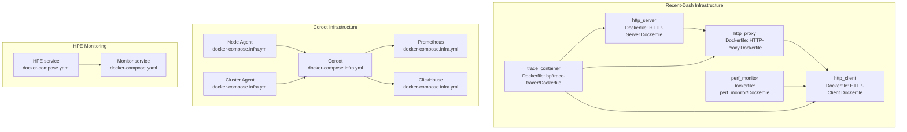
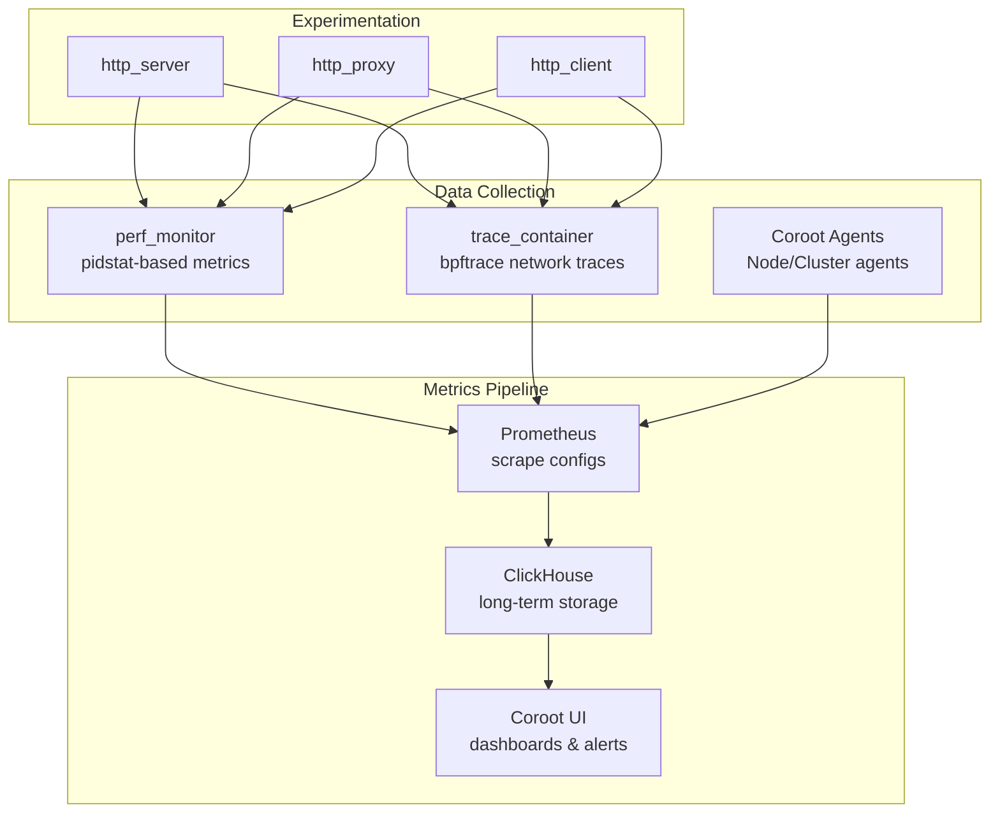
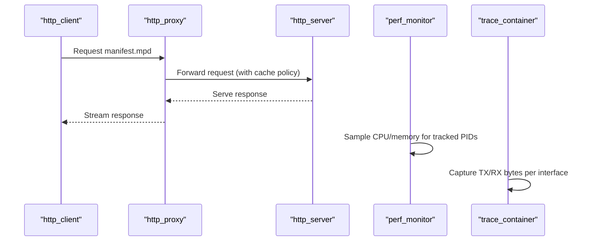
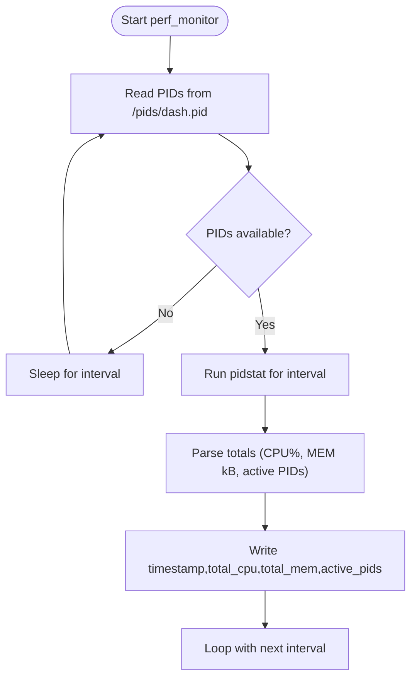
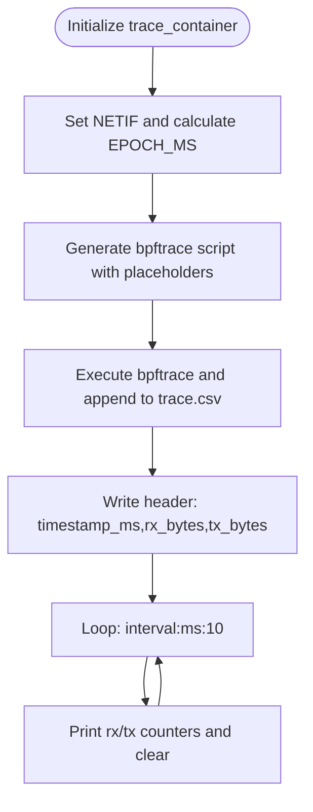
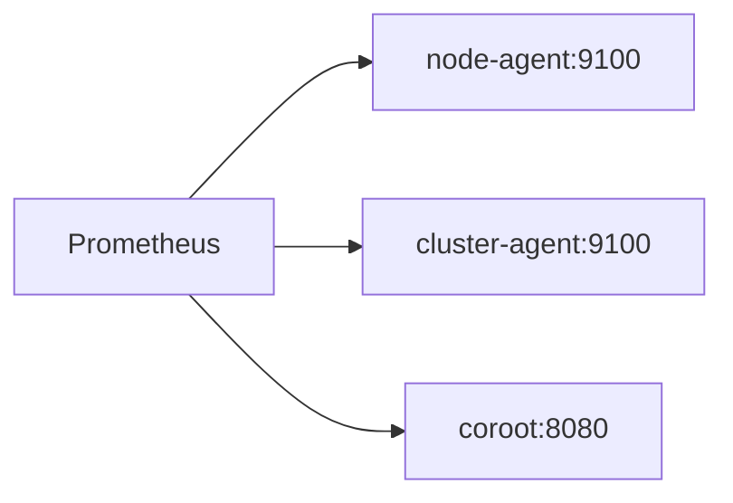
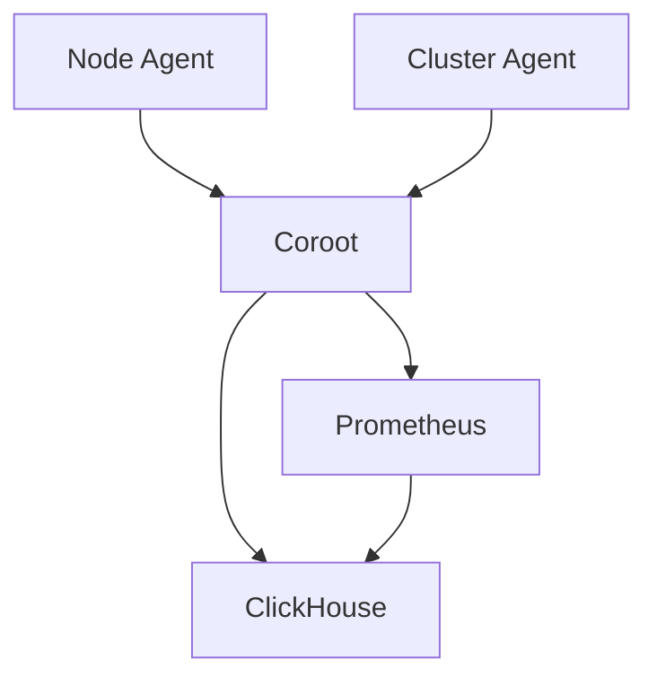
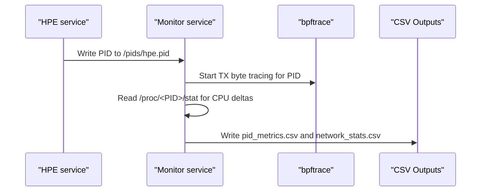
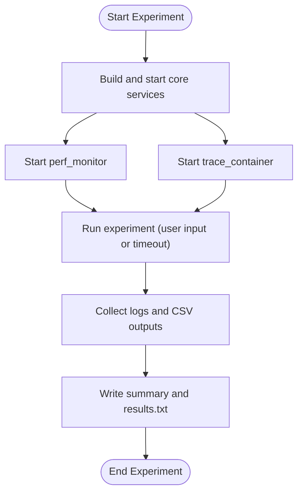
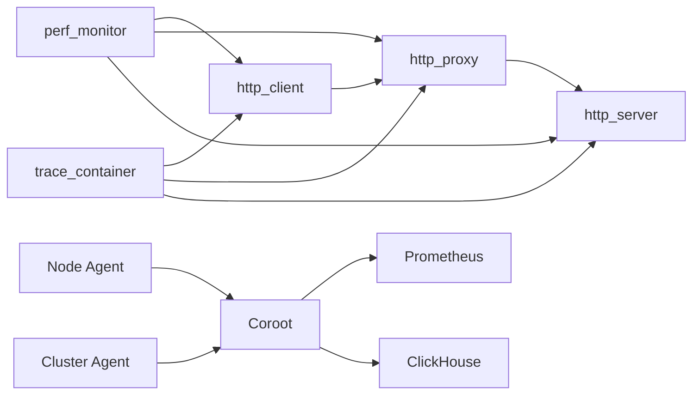

# Infrastructure Monitoring

<cite>
**Referenced Files in This Document**
- [README.md](file://recent-dash/README.md)
- [docker-compose.yml](file://recent-dash/docker-compose.yml)
- [docker-compose.infra.yml](file://recent-dash/docker-compose.infra.yml)
- [prometheus.yml](file://recent-dash/prometheus.yml)
- [prometheus.yml](file://prometheus.yml)
- [entrypoint.sh](file://recent-dash/entrypoint.sh)
- [investigate_proxy_cache.sh](file://recent-dash/investigate_proxy_cache.sh)
- [run_experiment.sh](file://recent-dash/run_experiment.sh)
- [monitor_pid.sh](file://recent-dash/perf_monitor/monitor_pid_perf.sh)
- [trace_container_net.sh](file://recent-dash/bpftrace-tracer/trace_container_net.sh)
- [docker-compose.yaml](file://monitor_hpe/docker-compose.yaml)
- [monitor_pid.sh](file://monitor_hpe/monitor_pid.sh)
- [PLOT_GENERATION_ANALYSIS.md](file://monitor_hpe/PLOT_GENERATION_ANALYSIS.md)
</cite>

## Table of Contents
1. [Introduction](#introduction)
2. [Project Structure](#project-structure)
3. [Core Components](#core-components)
4. [Architecture Overview](#architecture-overview)
5. [Detailed Component Analysis](#detailed-component-analysis)
6. [Dependency Analysis](#dependency-analysis)
7. [Performance Considerations](#performance-considerations)
8. [Troubleshooting Guide](#troubleshooting-guide)
9. [Conclusion](#conclusion)
10. [Appendices](#appendices)

## Introduction
This document describes the infrastructure monitoring system used for HTTP caching research and performance visualization. It covers the Recent-Dash dashboard stack for streaming media experiments, the Prometheus-based metrics collection pipeline, Coroot for application performance monitoring, and the separation between HPE inference monitoring and HTTP caching research monitoring. It also provides guidance on setting up the monitoring infrastructure, configuring alerts, interpreting performance dashboards, selecting metrics, and troubleshooting common issues.

## Project Structure
The monitoring system is organized into two primary areas:
- HTTP caching research and visualization (Recent-Dash): streaming services, performance monitoring, and network tracing.
- HPE inference monitoring: process-level metrics collection and plotting.

**Diagram sources**
- [docker-compose.yml:1-103](file://recent-dash/docker-compose.yml#L1-L103)
- [docker-compose.infra.yml:1-101](file://recent-dash/docker-compose.infra.yml#L1-L101)
- [docker-compose.yaml:1-60](file://monitor_hpe/docker-compose.yaml#L1-L60)

**Section sources**
- [README.md:1-20](file://recent-dash/README.md#L1-L20)
- [docker-compose.yml:1-103](file://recent-dash/docker-compose.yml#L1-L103)
- [docker-compose.infra.yml:1-101](file://recent-dash/docker-compose.infra.yml#L1-L101)
- [docker-compose.yaml:1-60](file://monitor_hpe/docker-compose.yaml#L1-L60)

## Core Components
- Streaming stack: HTTP server, HTTP proxy, and HTTP client form the Recent-Dash dashboard pipeline for DASH streaming experiments.
- Performance monitoring: a dedicated container collects process-level metrics (CPU, memory) and exports them to CSV for later analysis.
- Network tracing: a bpftrace-based container captures TX/RX bytes per interface for timing correlation with performance metrics.
- Prometheus and Coroot: metrics ingestion, storage, and visualization for infrastructure and application performance.
- HPE monitoring: separate monitoring of inference workloads with plotting and experiment orchestration.

Key responsibilities:
- Recent-Dash: orchestrate streaming services, run experiments, collect performance and trace data.
- Prometheus/Coroot: scrape, store, and visualize metrics and logs.
- HPE monitoring: monitor inference processes and produce plots for analysis.

**Section sources**
- [docker-compose.yml:1-103](file://recent-dash/docker-compose.yml#L1-L103)
- [docker-compose.infra.yml:1-101](file://recent-dash/docker-compose.infra.yml#L1-L101)
- [docker-compose.yaml:1-60](file://monitor_hpe/docker-compose.yaml#L1-L60)

## Architecture Overview
The monitoring architecture integrates three layers:
- Data collection: process metrics (perf), network traces (bpftrace), and service instrumentation (Coroot agents).
- Metrics pipeline: Prometheus scraping, persistent storage, and visualization via Coroot and Grafana dashboards.
- Experimentation: orchestrated runs of streaming services with controlled cache policies and parameterized configurations.

**Diagram sources**
- [docker-compose.infra.yml:66-101](file://recent-dash/docker-compose.infra.yml#L66-L101)
- [prometheus.yml:1-23](file://recent-dash/prometheus.yml#L1-L23)
- [prometheus.yml:1-8](file://prometheus.yml#L1-L8)
- [docker-compose.yml:52-97](file://recent-dash/docker-compose.yml#L52-L97)

## Detailed Component Analysis

### Recent-Dash Streaming Stack
The Recent-Dash stack consists of:
- http_server: serves DASH manifests and segments.
- http_proxy: caches and forwards requests with configurable cache parameters.
- http_client: consumes the DASH stream and exposes a manifest endpoint.
- perf_monitor: aggregates process-level CPU/memory metrics for the proxy and related processes.
- trace_container: captures network TX/RX bytes per interface for correlation with performance metrics.

**Diagram sources**
- [docker-compose.yml:3-50](file://recent-dash/docker-compose.yml#L3-L50)
- [docker-compose.yml:52-97](file://recent-dash/docker-compose.yml#L52-L97)
- [entrypoint.sh:1-24](file://recent-dash/entrypoint.sh#L1-L24)

**Section sources**
- [docker-compose.yml:1-103](file://recent-dash/docker-compose.yml#L1-L103)
- [entrypoint.sh:1-24](file://recent-dash/entrypoint.sh#L1-L24)
- [investigate_proxy_cache.sh:1-49](file://recent-dash/investigate_proxy_cache.sh#L1-L49)

### Performance Monitoring (perf_monitor)
The perf_monitor container uses pidstat to compute interval-based CPU and memory totals for a set of tracked PIDs. It writes aggregated metrics to CSV at a fixed interval, enabling post-experiment analysis and correlation with network traces.

**Diagram sources**
- [monitor_pid_perf.sh:1-72](file://recent-dash/perf_monitor/monitor_pid_perf.sh#L1-L72)

**Section sources**
- [monitor_pid_perf.sh:1-72](file://recent-dash/perf_monitor/monitor_pid_perf.sh#L1-L72)

### Network Tracing (bpftrace)
The trace_container runs bpftrace to capture TX/RX bytes per interface at millisecond intervals. It computes absolute timestamps by combining kernel uptime with host epoch, ensuring alignment with performance metrics.

**Diagram sources**
- [trace_container_net.sh:1-64](file://recent-dash/bpftrace-tracer/trace_container_net.sh#L1-L64)

**Section sources**
- [trace_container_net.sh:1-64](file://recent-dash/bpftrace-tracer/trace_container_net.sh#L1-L64)

### Prometheus Configuration and Scraping
Prometheus scrapes:
- node-agent: host-level metrics.
- cluster-agent: cluster-level metrics.
- coroot: application metrics and health.

**Diagram sources**
- [prometheus.yml:1-23](file://recent-dash/prometheus.yml#L1-L23)

**Section sources**
- [prometheus.yml:1-23](file://recent-dash/prometheus.yml#L1-L23)

### Coroot and Grafana Integration
Coroot orchestrates:
- Coroot service: UI and analytics.
- Node agent: host telemetry collection.
- Cluster agent: Kubernetes/cluster metrics.
- Prometheus: metrics ingestion.
- ClickHouse: long-term storage.

**Diagram sources**
- [docker-compose.infra.yml:11-34](file://recent-dash/docker-compose.infra.yml#L11-L34)
- [docker-compose.infra.yml:66-101](file://recent-dash/docker-compose.infra.yml#L66-L101)

**Section sources**
- [docker-compose.infra.yml:1-101](file://recent-dash/docker-compose.infra.yml#L1-L101)

### HPE Inference Monitoring
The HPE monitoring stack:
- HPE service: runs inference workloads with configurable device and threading.
- Monitor service: attaches to the HPE process via PID file and collects CPU, memory, and network TX/RX metrics.

**Diagram sources**
- [docker-compose.yaml:1-60](file://monitor_hpe/docker-compose.yaml#L1-L60)
- [monitor_pid.sh:1-215](file://monitor_hpe/monitor_pid.sh#L1-L215)

**Section sources**
- [docker-compose.yaml:1-60](file://monitor_hpe/docker-compose.yaml#L1-L60)
- [monitor_pid.sh:1-215](file://monitor_hpe/monitor_pid.sh#L1-L215)
- [PLOT_GENERATION_ANALYSIS.md:1-255](file://monitor_hpe/PLOT_GENERATION_ANALYSIS.md#L1-L255)

### Experiment Orchestration and Data Collection
The run_experiment.sh script coordinates:
- Building and starting http_server, http_proxy, http_client.
- Starting perf_monitor and trace_container.
- Collecting logs and CSV outputs after the experiment.
- Summarizing experiment metadata and timings.

**Diagram sources**
- [run_experiment.sh:1-286](file://recent-dash/run_experiment.sh#L1-L286)

**Section sources**
- [run_experiment.sh:1-286](file://recent-dash/run_experiment.sh#L1-L286)

## Dependency Analysis
- Service dependencies:
  - http_client depends on http_proxy.
  - http_proxy depends on http_server.
  - perf_monitor and trace_container depend on the presence of tracked PIDs and network interfaces.
- Agent dependencies:
  - Coroot requires Prometheus and ClickHouse.
  - Node/Cluster agents require host access to cgroups and debugfs.
- Data flow:
  - Metrics and traces are persisted locally and copied into experiment results for analysis.

**Diagram sources**
- [docker-compose.yml:1-103](file://recent-dash/docker-compose.yml#L1-L103)
- [docker-compose.infra.yml:1-101](file://recent-dash/docker-compose.infra.yml#L1-L101)

**Section sources**
- [docker-compose.yml:1-103](file://recent-dash/docker-compose.yml#L1-L103)
- [docker-compose.infra.yml:1-101](file://recent-dash/docker-compose.infra.yml#L1-L101)

## Performance Considerations
- Sampling intervals:
  - Prometheus scrape_interval and evaluation_interval are configured to 500ms for responsiveness.
  - perf_monitor uses 1-second intervals for pidstat sampling to balance accuracy and overhead.
  - trace_container samples at 10ms for fine-grained network activity.
- Storage retention:
  - Prometheus TSDB retention is configured with time and size limits to control disk usage.
- Resource allocation:
  - Separate containers for monitoring and inference minimize contention.
  - Dedicated CPU/memory limits for HPE and monitoring services ensure predictable behavior.

[No sources needed since this section provides general guidance]

## Troubleshooting Guide
Common issues and remedies:
- Missing cache directory or permissions:
  - Use the investigation script to verify cache folder existence and writability, and review proxy logs for errors.
- Empty or missing CSV outputs:
  - Confirm perf_monitor and trace_container are running and writing to mounted volumes.
  - Verify PID files exist and are readable by the monitor service.
- Network tracing not capturing RX:
  - bpftrace tracing for RX occurs in a different container context; ensure the correct tracer is used and interface is configured.
- Coroot dashboards not loading:
  - Check Prometheus connectivity and ClickHouse readiness; confirm agents are healthy and scraping.

**Section sources**
- [investigate_proxy_cache.sh:1-49](file://recent-dash/investigate_proxy_cache.sh#L1-L49)
- [monitor_pid_perf.sh:1-72](file://recent-dash/perf_monitor/monitor_pid_perf.sh#L1-L72)
- [monitor_pid.sh:1-215](file://monitor_hpe/monitor_pid.sh#L1-L215)
- [trace_container_net.sh:1-64](file://recent-dash/bpftrace-tracer/trace_container_net.sh#L1-L64)
- [docker-compose.infra.yml:1-101](file://recent-dash/docker-compose.infra.yml#L1-L101)

## Conclusion
The infrastructure monitoring system combines Recent-Dash for HTTP caching research with Coroot-backed Prometheus for observability. It separates concerns between streaming experimentation and application performance monitoring, while providing robust mechanisms for metrics collection, storage, and visualization. Proper configuration of scrape intervals, resource limits, and data collection ensures reliable performance insights and reproducible experiments.

[No sources needed since this section summarizes without analyzing specific files]

## Appendices

### Setting Up Monitoring Infrastructure
- Build and start the Recent-Dash stack:
  - Build images and start services using the provided compose files.
- Configure Prometheus:
  - Adjust scrape intervals and targets according to deployment needs.
- Deploy Coroot:
  - Start Coroot, Node/Cluster agents, Prometheus, and ClickHouse with the provided compose file.
- Run experiments:
  - Use the experiment script to orchestrate streaming services, monitoring, and data collection.

**Section sources**
- [README.md:1-20](file://recent-dash/README.md#L1-L20)
- [docker-compose.yml:1-103](file://recent-dash/docker-compose.yml#L1-L103)
- [docker-compose.infra.yml:1-101](file://recent-dash/docker-compose.infra.yml#L1-L101)
- [prometheus.yml:1-23](file://recent-dash/prometheus.yml#L1-L23)

### Configuring Alerts
- Prometheus alerting rules:
  - Define rules in Prometheus configuration to trigger alerts on latency, cache miss rates, or resource exhaustion.
- Coroot alerts:
  - Use Coroot dashboards to define threshold-based alerts for CPU, memory, and network utilization.

**Section sources**
- [prometheus.yml:1-23](file://recent-dash/prometheus.yml#L1-L23)
- [docker-compose.infra.yml:1-101](file://recent-dash/docker-compose.infra.yml#L1-L101)

### Interpreting Performance Dashboards
- CPU and memory:
  - Use aggregated metrics from perf_monitor to identify spikes and trends during streaming.
- Network throughput:
  - Align bpftrace TX/RX traces with CPU/memory to correlate bandwidth with workload intensity.
- Cache behavior:
  - Inspect proxy logs and cache directory contents to understand hit/miss dynamics.

**Section sources**
- [monitor_pid_perf.sh:1-72](file://recent-dash/perf_monitor/monitor_pid_perf.sh#L1-L72)
- [trace_container_net.sh:1-64](file://recent-dash/bpftrace-tracer/trace_container_net.sh#L1-L64)
- [investigate_proxy_cache.sh:1-49](file://recent-dash/investigate_proxy_cache.sh#L1-L49)

### Metric Selection Best Practices
- Choose high-frequency sampling for short-duration events; use lower frequency for steady-state metrics.
- Ensure monotonic counters for network bytes and avoid double-counting by using appropriate tracepoints.
- Store raw samples for post-processing and derive derived metrics offline to reduce real-time load.

[No sources needed since this section provides general guidance]