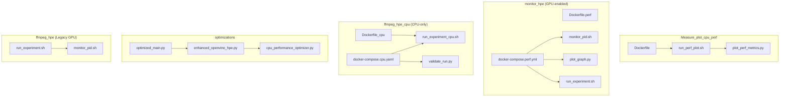
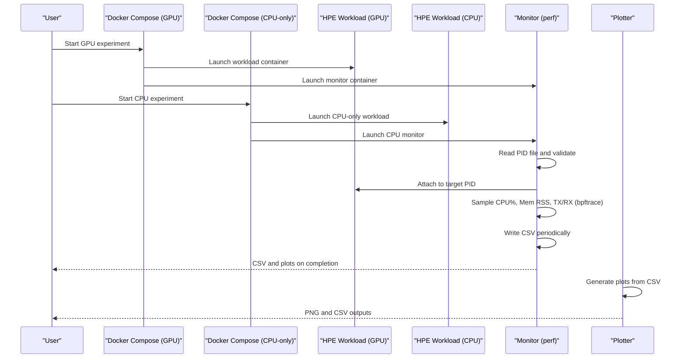
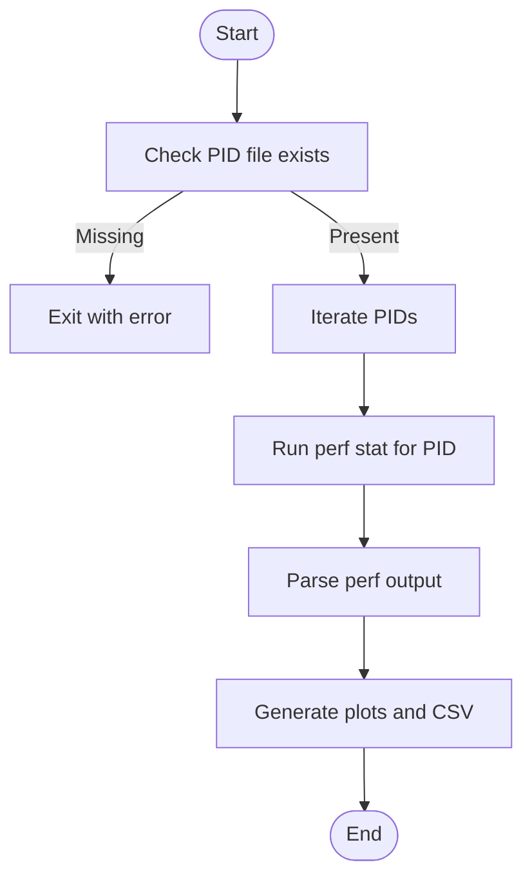
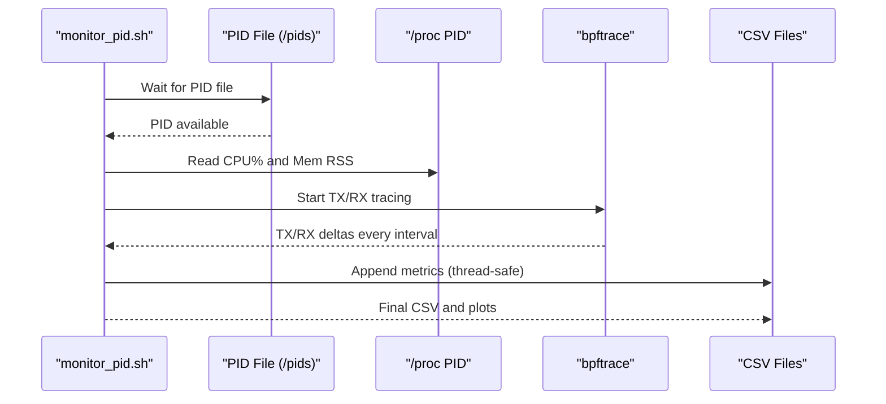
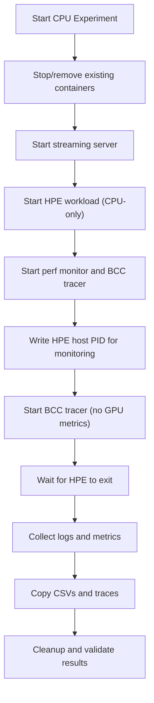
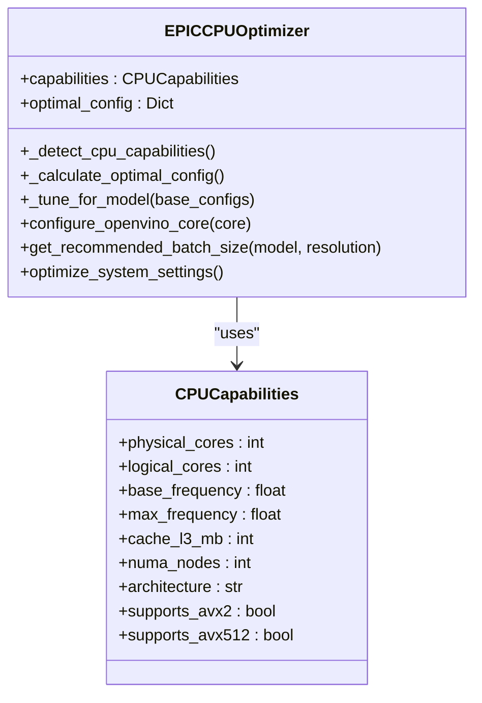
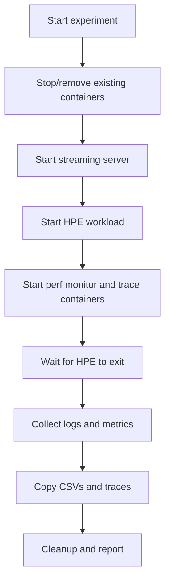
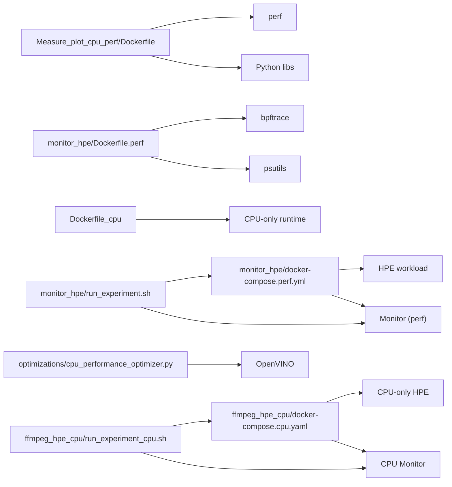

# CPU Performance Analysis Tools

<cite>
**Referenced Files in This Document**
- [Dockerfile](file://Measure_plot_cpu_perf/Dockerfile)
- [run_perf_plot.sh](file://Measure_plot_cpu_perf/run_perf_plot.sh)
- [plot_perf_metrics.py](file://Measure_plot_cpu_perf/plot_perf_metrics.py)
- [Dockerfile.perf](file://monitor_hpe/Dockerfile.perf)
- [docker-compose.perf.yml](file://monitor_hpe/docker-compose.perf.yml)
- [monitor_pid.sh](file://monitor_hpe/monitor_pid.sh)
- [plot_graph.py](file://monitor_hpe/plot_graph.py)
- [run_experiment.sh](file://monitor_hpe/run_experiment.sh)
- [cpu_performance_optimizer.py](file://optimizations/cpu_performance_optimizer.py)
- [enhanced_openvino_hpe.py](file://optimizations/enhanced_openvino_hpe.py)
- [optimized_main.py](file://optimizations/optimized_main.py)
- [run_experiment.sh](file://ffmpeg_hpe/run_experiment.sh)
- [monitor_pid.sh](file://ffmpeg_hpe/monitor_pid.sh)
- [run_experiment_cpu.sh](file://ffmpeg_hpe_cpu/run_experiment_cpu.sh)
- [docker-compose.cpu.yaml](file://ffmpeg_hpe_cpu/docker-compose.cpu.yaml)
- [Dockerfile_cpu](file://Dockerfile_cpu)
- [validate_run.py](file://ffmpeg_hpe_cpu/validate_run.py)
- [plot_graph.py](file://ffmpeg_hpe_cpu/plot_graph.py)
- [plot_rx_bytes.py](file://ffmpeg_hpe_cpu/plot_rx_bytes.py)
</cite>

## Update Summary
**Changes Made**
- Added comprehensive documentation for the new ffmpeg_hpe_cpu platform alongside existing monitor_hpe baseline
- Updated experiment scripts documentation to cover both legacy run_experiment.sh and new run_experiment_cpu.sh
- Added detailed coverage of CPU-only inference capabilities and unified benchmarking platform
- Enhanced architecture overview to include both GPU-enabled and CPU-only experimental rigs
- Expanded validation framework documentation for automated quality assurance

## Table of Contents
1. [Introduction](#introduction)
2. [Project Structure](#project-structure)
3. [Core Components](#core-components)
4. [Architecture Overview](#architecture-overview)
5. [Detailed Component Analysis](#detailed-component-analysis)
6. [Unified Benchmarking Platform](#unified-benchmarking-platform)
7. [Dependency Analysis](#dependency-analysis)
8. [Performance Considerations](#performance-considerations)
9. [Troubleshooting Guide](#troubleshooting-guide)
10. [Conclusion](#conclusion)
11. [Appendices](#appendices)

## Introduction
This document describes a comprehensive CPU performance analysis and plotting toolkit built on Docker and Linux performance tools. The system now supports both GPU-enabled and CPU-only experimental platforms, providing unified benchmarking capabilities for human pose estimation workloads across different hardware configurations. It covers:
- A Docker-based environment for capturing CPU utilization and cycle metrics
- Scripts for launching performance measurements and generating plots
- A monitoring pipeline that tracks CPU, memory, and network metrics for a target process
- Integration with performance monitoring workflows and automated experiments
- Automated benchmarking and comparative analysis across CPU configurations
- Practical guidance for detecting performance regressions, validating optimizations, and tuning systems based on measured metrics
- Unified platform supporting both GPU and CPU-only inference scenarios

## Project Structure
The repository organizes performance tools by domain with dual-platform support:
- Measure_plot_cpu_perf: Standalone CPU metric capture and plotting
- monitor_hpe: End-to-end monitoring of HPE workloads with Docker orchestration (GPU-enabled)
- ffmpeg_hpe_cpu: CPU-only experimental platform with streamlined orchestration
- optimizations: CPU optimization utilities for OpenVINO-based HPE
- ffmpeg_hpe: Legacy GPU-enabled experiment automation

**Diagram sources**
- [Dockerfile:1-18](file://Measure_plot_cpu_perf/Dockerfile#L1-L18)
- [run_perf_plot.sh:1-25](file://Measure_plot_cpu_perf/run_perf_plot.sh#L1-L25)
- [plot_perf_metrics.py:1-146](file://Measure_plot_cpu_perf/plot_perf_metrics.py#L1-L146)
- [Dockerfile.perf:1-19](file://monitor_hpe/Dockerfile.perf#L1-L19)
- [docker-compose.perf.yml:1-38](file://monitor_hpe/docker-compose.perf.yml#L1-L38)
- [monitor_pid.sh:1-204](file://monitor_hpe/monitor_pid.sh#L1-L204)
- [plot_graph.py:1-59](file://monitor_hpe/plot_graph.py#L1-L59)
- [run_experiment.sh:1-138](file://monitor_hpe/run_experiment.sh#L1-L138)
- [Dockerfile_cpu:1-100](file://Dockerfile_cpu#L1-L100)
- [docker-compose.cpu.yaml:1-152](file://ffmpeg_hpe_cpu/docker-compose.cpu.yaml#L1-L152)
- [run_experiment_cpu.sh:1-328](file://ffmpeg_hpe_cpu/run_experiment_cpu.sh#L1-L328)
- [validate_run.py:1-521](file://ffmpeg_hpe_cpu/validate_run.py#L1-L521)
- [cpu_performance_optimizer.py:1-539](file://optimizations/cpu_performance_optimizer.py#L1-L539)
- [enhanced_openvino_hpe.py:1-333](file://optimizations/enhanced_openvino_hpe.py#L1-L333)
- [optimized_main.py:1-257](file://optimizations/optimized_main.py#L1-L257)
- [run_experiment.sh:1-279](file://ffmpeg_hpe/run_experiment.sh#L1-L279)
- [monitor_pid.sh:1-151](file://ffmpeg_hpe/monitor_pid.sh#L1-L151)

**Section sources**
- [Dockerfile:1-18](file://Measure_plot_cpu_perf/Dockerfile#L1-L18)
- [docker-compose.perf.yml:1-38](file://monitor_hpe/docker-compose.perf.yml#L1-L38)
- [docker-compose.cpu.yaml:1-152](file://ffmpeg_hpe_cpu/docker-compose.cpu.yaml#L1-L152)

## Core Components
- CPU metric capture and plotting container:
  - Provides a Docker image with perf, Python, and plotting libraries
  - Runs perf against a target PID and generates plots and CSV
- Monitoring pipeline:
  - Orchestrated by Docker Compose to launch the monitored workload and the perf monitor
  - Captures CPU%, memory RSS, and network TX/RX for a target PID
  - Writes metrics to CSV and generates plots
- CPU-only experimental platform:
  - Streamlined orchestration for CPU-only inference workloads
  - Eliminates GPU dependencies while maintaining comprehensive monitoring
  - Provides unified benchmarking across different CPU configurations
- CPU optimization utilities:
  - Detects CPU capabilities and applies OpenVINO-specific tuning
  - Provides factory functions and benchmarking helpers
- Experiment automation:
  - Starts streaming server, workload, and monitoring
  - Aggregates logs, metrics, and artifacts into a timestamped results directory
  - Supports both GPU and CPU-only experimental scenarios

**Section sources**
- [Dockerfile:1-18](file://Measure_plot_cpu_perf/Dockerfile#L1-L18)
- [run_perf_plot.sh:1-25](file://Measure_plot_cpu_perf/run_perf_plot.sh#L1-L25)
- [plot_perf_metrics.py:1-146](file://Measure_plot_cpu_perf/plot_perf_metrics.py#L1-L146)
- [docker-compose.perf.yml:1-38](file://monitor_hpe/docker-compose.perf.yml#L1-L38)
- [monitor_pid.sh:1-204](file://monitor_hpe/monitor_pid.sh#L1-L204)
- [plot_graph.py:1-59](file://monitor_hpe/plot_graph.py#L1-L59)
- [run_experiment.sh:1-138](file://monitor_hpe/run_experiment.sh#L1-L138)
- [Dockerfile_cpu:1-100](file://Dockerfile_cpu#L1-L100)
- [docker-compose.cpu.yaml:1-152](file://ffmpeg_hpe_cpu/docker-compose.cpu.yaml#L1-L152)
- [run_experiment_cpu.sh:1-328](file://ffmpeg_hpe_cpu/run_experiment_cpu.sh#L1-L328)
- [validate_run.py:1-521](file://ffmpeg_hpe_cpu/validate_run.py#L1-L521)
- [cpu_performance_optimizer.py:1-539](file://optimizations/cpu_performance_optimizer.py#L1-L539)
- [enhanced_openvino_hpe.py:1-333](file://optimizations/enhanced_openvino_hpe.py#L1-L333)
- [optimized_main.py:1-257](file://optimizations/optimized_main.py#L1-L257)
- [run_experiment.sh:1-279](file://ffmpeg_hpe/run_experiment.sh#L1-L279)
- [monitor_pid.sh:1-151](file://ffmpeg_hpe/monitor_pid.sh#L1-L151)

## Architecture Overview
The system combines Docker-based orchestration with Linux performance tools to collect and visualize CPU-centric metrics across two complementary experimental platforms:
- Direct perf-based capture for a running PID
- Full-stack monitoring pipeline that captures CPU, memory, and network metrics for a target process
- Unified benchmarking platform supporting both GPU-enabled and CPU-only inference scenarios

**Diagram sources**
- [docker-compose.perf.yml:1-38](file://monitor_hpe/docker-compose.perf.yml#L1-L38)
- [docker-compose.cpu.yaml:1-152](file://ffmpeg_hpe_cpu/docker-compose.cpu.yaml#L1-L152)
- [monitor_pid.sh:1-204](file://monitor_hpe/monitor_pid.sh#L1-L204)
- [plot_graph.py:1-59](file://monitor_hpe/plot_graph.py#L1-L59)

## Detailed Component Analysis

### CPU Metric Capture and Plotting Container
This component encapsulates perf-based CPU metrics capture and visualization:
- Installs perf and Python plotting libraries in a container
- Accepts a PID file and runs perf against the PID
- Parses perf output and produces plots and CSV

**Diagram sources**
- [run_perf_plot.sh:1-25](file://Measure_plot_cpu_perf/run_perf_plot.sh#L1-L25)
- [plot_perf_metrics.py:1-146](file://Measure_plot_cpu_perf/plot_perf_metrics.py#L1-L146)

**Section sources**
- [Dockerfile:1-18](file://Measure_plot_cpu_perf/Dockerfile#L1-L18)
- [run_perf_plot.sh:1-25](file://Measure_plot_cpu_perf/run_perf_plot.sh#L1-L25)
- [plot_perf_metrics.py:1-146](file://Measure_plot_cpu_perf/plot_perf_metrics.py#L1-L146)

### Monitoring Pipeline: CPU, Memory, and Network Metrics
This pipeline monitors a target process PID and exports metrics to CSV and plots:
- Reads PID from a mounted file
- Uses bpftrace to track TX/RX bytes per interval
- Periodically samples CPU% and memory RSS
- Writes synchronized CSV entries and generates plots

**Diagram sources**
- [docker-compose.perf.yml:1-38](file://monitor_hpe/docker-compose.perf.yml#L1-L38)
- [monitor_pid.sh:1-204](file://monitor_hpe/monitor_pid.sh#L1-L204)
- [plot_graph.py:1-59](file://monitor_hpe/plot_graph.py#L1-L59)

**Section sources**
- [docker-compose.perf.yml:1-38](file://monitor_hpe/docker-compose.perf.yml#L1-L38)
- [monitor_pid.sh:1-204](file://monitor_hpe/monitor_pid.sh#L1-L204)
- [plot_graph.py:1-59](file://monitor_hpe/plot_graph.py#L1-L59)

### CPU-Only Experimental Platform
The ffmpeg_hpe_cpu platform provides a streamlined, CPU-only experimental environment:
- Eliminates GPU dependencies while maintaining comprehensive monitoring capabilities
- Uses Dockerfile_cpu for CPU-only inference with OpenVINO backends
- Implements run_experiment_cpu.sh for automated experiment orchestration
- Provides validate_run.py for automated quality assurance and result validation
- Supports unified benchmarking across different CPU configurations

**Diagram sources**
- [run_experiment_cpu.sh:1-328](file://ffmpeg_hpe_cpu/run_experiment_cpu.sh#L1-L328)
- [docker-compose.cpu.yaml:1-152](file://ffmpeg_hpe_cpu/docker-compose.cpu.yaml#L1-L152)
- [validate_run.py:1-521](file://ffmpeg_hpe_cpu/validate_run.py#L1-L521)

**Section sources**
- [Dockerfile_cpu:1-100](file://Dockerfile_cpu#L1-L100)
- [docker-compose.cpu.yaml:1-152](file://ffmpeg_hpe_cpu/docker-compose.cpu.yaml#L1-L152)
- [run_experiment_cpu.sh:1-328](file://ffmpeg_hpe_cpu/run_experiment_cpu.sh#L1-L328)
- [validate_run.py:1-521](file://ffmpeg_hpe_cpu/validate_run.py#L1-L521)

### CPU Optimization Utilities for OpenVINO HPE
These modules detect CPU capabilities and apply OpenVINO-specific tuning:
- Detects physical/logical cores, frequency, AVX support, and NUMA topology
- Calculates optimal thread counts, streams, and performance hints
- Applies system-level optimizations (CPU governor, power settings)
- Integrates with OpenVINO core configuration

**Diagram sources**
- [cpu_performance_optimizer.py:1-539](file://optimizations/cpu_performance_optimizer.py#L1-L539)

**Section sources**
- [cpu_performance_optimizer.py:1-539](file://optimizations/cpu_performance_optimizer.py#L1-L539)
- [enhanced_openvino_hpe.py:1-333](file://optimizations/enhanced_openvino_hpe.py#L1-L333)
- [optimized_main.py:1-257](file://optimizations/optimized_main.py#L1-L257)

### Experiment Automation and Artifact Collection
The ffmpeg_hpe experiment orchestrator coordinates streaming, workload, and monitoring:
- Starts a streaming server and the HPE workload
- Measures container instantiation timing
- Copies performance data, traces, and logs to a timestamped results directory
- Supports GPU metrics and trace collection

**Diagram sources**
- [run_experiment.sh:1-279](file://ffmpeg_hpe/run_experiment.sh#L1-L279)

**Section sources**
- [run_experiment.sh:1-279](file://ffmpeg_hpe/run_experiment.sh#L1-L279)
- [monitor_pid.sh:1-151](file://ffmpeg_hpe/monitor_pid.sh#L1-L151)

## Unified Benchmarking Platform
The system now provides a unified benchmarking platform supporting both GPU-enabled and CPU-only experimental scenarios:

### Platform Comparison Matrix
| Feature | GPU-Enabled (ffmpeg_hpe) | CPU-Only (ffmpeg_hpe_cpu) |
|---------|---------------------------|---------------------------|
| Hardware Requirements | NVIDIA GPU + CUDA | CPU-only system |
| Inference Backend | Multi-backend (OpenVINO, AlphaPose, etc.) | OpenVINO CPU backends only |
| Monitoring Scope | CPU, memory, GPU metrics, network | CPU, memory, network (no GPU) |
| Container Dependencies | GPU runtime, PyNvCodec | CPU runtime only |
| Validation Framework | Manual verification | Automated validation |
| Use Case | Mixed workloads, GPU acceleration | Pure CPU inference, cost optimization |

### Cross-Platform Experiment Orchestration
Both platforms share common orchestration patterns while adapting to their respective hardware constraints:
- Standardized experiment lifecycle management
- Unified results directory structure and artifact organization
- Consistent monitoring and validation approaches
- Shared plotting and analysis utilities

**Section sources**
- [run_experiment_cpu.sh:1-328](file://ffmpeg_hpe_cpu/run_experiment_cpu.sh#L1-L328)
- [docker-compose.cpu.yaml:1-152](file://ffmpeg_hpe_cpu/docker-compose.cpu.yaml#L1-L152)
- [run_experiment.sh:1-279](file://ffmpeg_hpe/run_experiment.sh#L1-L279)
- [docker-compose.perf.yml:1-38](file://monitor_hpe/docker-compose.perf.yml#L1-L38)

## Dependency Analysis
Key dependencies and relationships:
- Dockerfiles define runtime environments for perf and monitoring
- Docker Compose orchestrates multi-container experiments
- Scripts depend on Linux tools (perf, bpftrace, ps, lscpu)
- Python modules rely on pandas, matplotlib, numpy, and OpenVINO APIs
- The optimization modules depend on psutil and platform detection
- CPU-only platform eliminates GPU dependencies while maintaining monitoring capabilities

**Diagram sources**
- [Dockerfile:1-18](file://Measure_plot_cpu_perf/Dockerfile#L1-L18)
- [Dockerfile.perf:1-19](file://monitor_hpe/Dockerfile.perf#L1-L19)
- [Dockerfile_cpu:1-100](file://Dockerfile_cpu#L1-L100)
- [docker-compose.perf.yml:1-38](file://monitor_hpe/docker-compose.perf.yml#L1-L38)
- [docker-compose.cpu.yaml:1-152](file://ffmpeg_hpe_cpu/docker-compose.cpu.yaml#L1-L152)
- [cpu_performance_optimizer.py:1-539](file://optimizations/cpu_performance_optimizer.py#L1-L539)

**Section sources**
- [Dockerfile:1-18](file://Measure_plot_cpu_perf/Dockerfile#L1-L18)
- [Dockerfile.perf:1-19](file://monitor_hpe/Dockerfile.perf#L1-L19)
- [Dockerfile_cpu:1-100](file://Dockerfile_cpu#L1-L100)
- [docker-compose.perf.yml:1-38](file://monitor_hpe/docker-compose.perf.yml#L1-L38)
- [docker-compose.cpu.yaml:1-152](file://ffmpeg_hpe_cpu/docker-compose.cpu.yaml#L1-L152)
- [cpu_performance_optimizer.py:1-539](file://optimizations/cpu_performance_optimizer.py#L1-L539)

## Performance Considerations
- Sampling intervals:
  - The monitoring pipeline samples every 500 ms and aggregates TX/RX every 10 ms internally
  - The standalone perf container samples at 100 ms intervals
  - CPU-only platform maintains consistent sampling rates across both platforms
- Throughput vs latency:
  - CPU optimization utilities select performance hints and thread/stream counts based on workload characteristics
  - Unified platform ensures consistent optimization strategies across GPU and CPU implementations
- System-level tuning:
  - CPU governor and power management toggles can reduce latency spikes
  - CPU-only platform benefits from simplified system tuning requirements
- NUMA awareness:
  - Optimizer can set affinity and increase num_requests for multi-socket systems
  - Both platforms leverage NUMA-aware optimizations where applicable

## Troubleshooting Guide
Common issues and remedies:
- Missing PID file:
  - The monitor waits up to 30 seconds; ensure the workload writes the PID file to the shared volume
  - CPU-only platform requires explicit PID writing for process-level monitoring
- Permissions:
  - The perf container requires SYS_ADMIN, SYS_PTRACE, and IPC_LOCK capabilities
  - CPU-only platform maintains the same capability requirements
- bpftrace availability:
  - Ensure bpftrace is installed in the monitoring container
  - CPU-only platform uses simplified BCC tracer configuration
- CSV locking:
  - The monitor uses flock to serialize writes; verify lock files are cleaned up on exit
  - Both platforms implement consistent file locking mechanisms
- Container naming conflicts:
  - The experiment script waits for container names to be fully released before cleanup
  - CPU-only platform includes additional container lifecycle management
- GPU-specific issues:
  - Legacy ffmpeg_hpe platform requires GPU drivers and CUDA runtime
  - CPU-only platform eliminates GPU-related troubleshooting concerns

**Section sources**
- [monitor_pid.sh:1-204](file://monitor_hpe/monitor_pid.sh#L1-L204)
- [docker-compose.perf.yml:1-38](file://monitor_hpe/docker-compose.perf.yml#L1-L38)
- [run_experiment.sh:1-138](file://monitor_hpe/run_experiment.sh#L1-L138)
- [run_experiment_cpu.sh:1-328](file://ffmpeg_hpe_cpu/run_experiment_cpu.sh#L1-L328)

## Conclusion
This toolkit provides a repeatable, Dockerized workflow for CPU performance analysis across both GPU-enabled and CPU-only experimental platforms:
- Capture CPU utilization and cycles with perf
- Monitor CPU, memory, and network metrics for a target process
- Integrate CPU optimization for OpenVINO-based HPE workloads
- Automate experiments and collect artifacts for comparative analysis
- Use the resulting plots and CSVs to detect regressions, validate optimizations, and guide system tuning
- Leverage unified benchmarking platform for consistent experimental methodology across different hardware configurations

## Appendices

### How to Measure CPU Utilization, Memory Usage, and System Metrics
- Perf-based capture:
  - Build and run the perf container; ensure a PID file exists; it will run perf against the PID and produce plots and CSV
- Full monitoring pipeline:
  - Start the HPE workload and monitor containers via Docker Compose; the monitor writes CSV and generates plots
- CPU-only platform:
  - Use ffmpeg_hpe_cpu platform for streamlined CPU-only experimentation
  - Leverage automated validation framework for result quality assurance

**Section sources**
- [Dockerfile:1-18](file://Measure_plot_cpu_perf/Dockerfile#L1-L18)
- [run_perf_plot.sh:1-25](file://Measure_plot_cpu_perf/run_perf_plot.sh#L1-L25)
- [docker-compose.perf.yml:1-38](file://monitor_hpe/docker-compose.perf.yml#L1-L38)
- [monitor_pid.sh:1-204](file://monitor_hpe/monitor_pid.sh#L1-L204)
- [docker-compose.cpu.yaml:1-152](file://ffmpeg_hpe_cpu/docker-compose.cpu.yaml#L1-L152)
- [run_experiment_cpu.sh:1-328](file://ffmpeg_hpe_cpu/run_experiment_cpu.sh#L1-L328)

### Comparative Analysis Across CPU Architectures
- Use the CPU optimizer to derive optimal thread/stream counts for different core counts
- Compare performance across experiments by organizing results in timestamped directories
- Validate improvements using the benchmark helper for OpenVINO models
- Leverage unified platform for consistent experimental methodology across different hardware configurations

**Section sources**
- [cpu_performance_optimizer.py:1-539](file://optimizations/cpu_performance_optimizer.py#L1-L539)
- [enhanced_openvino_hpe.py:1-333](file://optimizations/enhanced_openvino_hpe.py#L1-L333)
- [optimized_main.py:1-257](file://optimizations/optimized_main.py#L1-L257)

### Performance Regression Detection and Optimization Validation
- Track FPS and throughput across runs; compare standard vs optimized configurations
- Use plots to visually inspect trends and anomalies
- Validate system tuning by comparing pre/post governor and power management settings
- Implement automated validation using validate_run.py for consistent quality assurance

**Section sources**
- [optimized_main.py:1-257](file://optimizations/optimized_main.py#L1-L257)
- [monitor_pid.sh:1-204](file://monitor_hpe/monitor_pid.sh#L1-L204)
- [validate_run.py:1-521](file://ffmpeg_hpe_cpu/validate_run.py#L1-L521)

### System Tuning Recommendations
- Set CPU governor to performance mode when latency is critical
- Disable NUMA balancing and turbo boost toggles if they cause jitter
- Pin threads and disable hyper-threading for compute-bound inference on systems without HT
- Increase num_requests proportionally to streams for memory-bound models
- Choose CPU-only platform for cost-effective experimentation and simplified system management

**Section sources**
- [cpu_performance_optimizer.py:1-539](file://optimizations/cpu_performance_optimizer.py#L1-L539)
- [Dockerfile_cpu:1-100](file://Dockerfile_cpu#L1-L100)