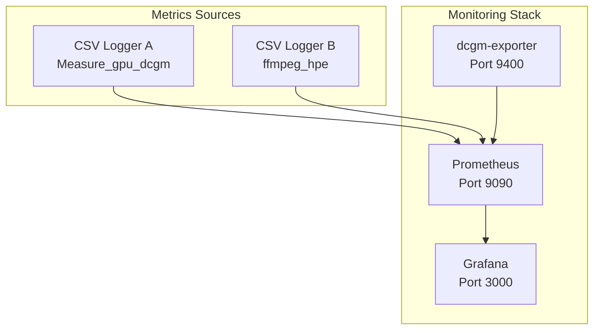
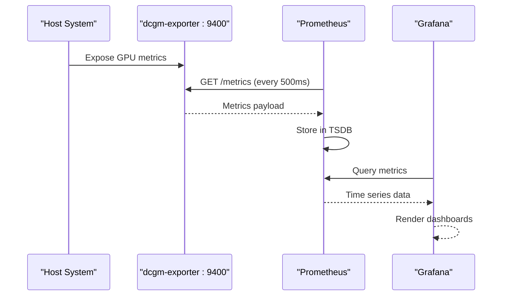
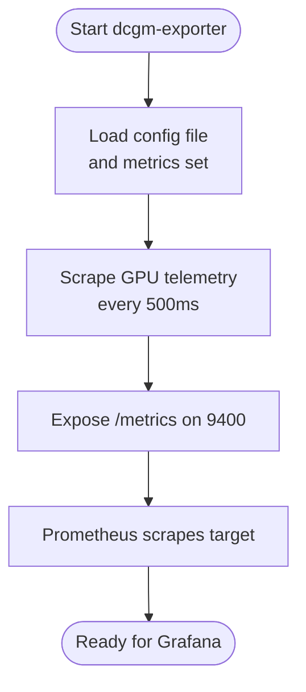
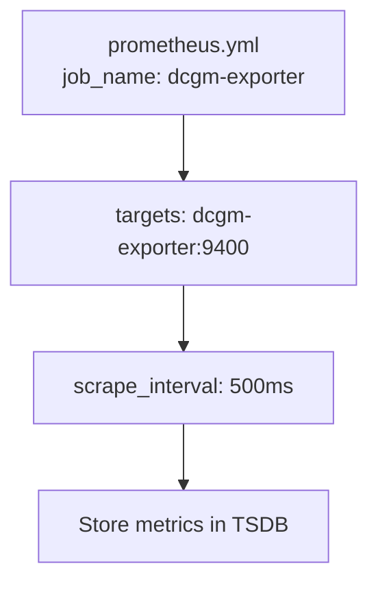
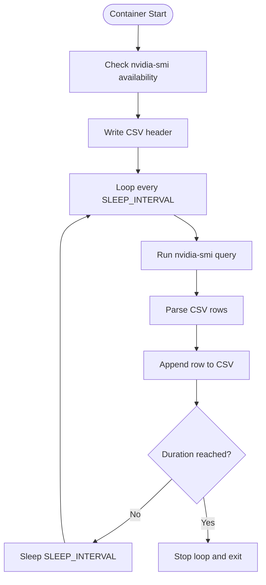
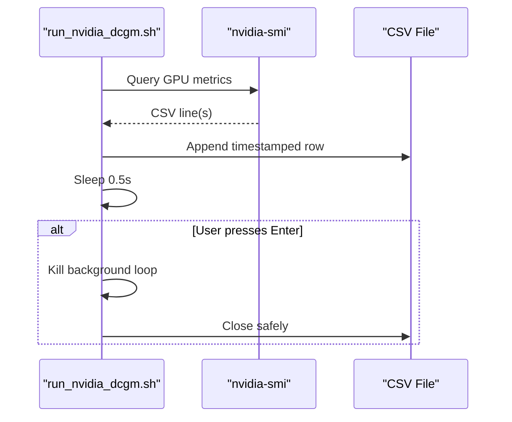
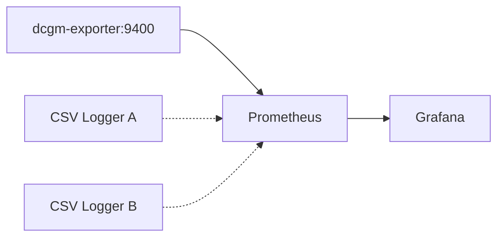

# DCGM Exporter Integration

<cite>
**Referenced Files in This Document**
- [Dockerfile.gpu_metrics](file://Measure_gpu_dcgm/Dockerfile.gpu_metrics)
- [run_nvidia_dcgm.sh](file://Measure_gpu_dcgm/run_nvidia_dcgm.sh)
- [plot_smi_output.py](file://Measure_gpu_dcgm/plot_smi_output.py)
- [Dockerfile.gpu_metrics](file://ffmpeg_hpe/Dockerfile.gpu_metrics)
- [run_nvidia_dcgm.sh](file://ffmpeg_hpe/run_nvidia_dcgm.sh)
- [plot_smi_output.py](file://ffmpeg_hpe/plot_smi_output.py)
- [docker-compose.yml](file://docker-compose.yml)
- [prometheus.yml](file://prometheus.yml)
- [prometheus.yml](file://recent-dash/prometheus.yml)
</cite>

## Table of Contents
1. [Introduction](#introduction)
2. [Project Structure](#project-structure)
3. [Core Components](#core-components)
4. [Architecture Overview](#architecture-overview)
5. [Detailed Component Analysis](#detailed-component-analysis)
6. [Dependency Analysis](#dependency-analysis)
7. [Performance Considerations](#performance-considerations)
8. [Troubleshooting Guide](#troubleshooting-guide)
9. [Conclusion](#conclusion)
10. [Appendices](#appendices)

## Introduction
This document explains how to integrate NVIDIA DCGM (Data Center GPU Manager) exporter for GPU metrics collection in a containerized environment. It covers Docker container setup, DCGM exporter configuration, Prometheus scraping, Grafana visualization, and practical workflows for collecting GPU utilization, memory usage, temperature, and power consumption metrics. It also provides guidance for automated performance analysis and optimization use cases.

## Project Structure
The repository includes two distinct GPU metrics collection setups:
- A minimal DCGM exporter deployment orchestrated via docker-compose with Prometheus and Grafana.
- Two containerized GPU monitoring scripts that log metrics to CSV using nvidia-smi, along with plotting utilities for visualization.

**Diagram sources**
- [docker-compose.yml:4-30](file://docker-compose.yml#L4-L30)
- [prometheus.yml:1-8](file://prometheus.yml#L1-L8)

**Section sources**
- [docker-compose.yml:1-30](file://docker-compose.yml#L1-L30)
- [prometheus.yml:1-8](file://prometheus.yml#L1-L8)

## Core Components
- DCGM Exporter service configured to expose GPU metrics on port 9400 and scrape at 500ms intervals.
- Prometheus server configured to scrape the DCGM exporter target.
- Grafana dashboard for visualizing scraped metrics.
- Optional CSV-based GPU monitoring containers that log utilization, memory, temperature, and power metrics to CSV files for offline analysis and plotting.

Key capabilities:
- GPU utilization and memory utilization
- Temperature readings
- Power draw (watts)
- P-state/power state transitions (when supported by the exporter configuration)

**Section sources**
- [docker-compose.yml:4-30](file://docker-compose.yml#L4-L30)
- [prometheus.yml:5-8](file://prometheus.yml#L5-L8)

## Architecture Overview
The monitoring pipeline integrates DCGM exporter with Prometheus and Grafana. Prometheus scrapes metrics from the DCGM exporter every 500ms, and Grafana renders dashboards from Prometheus data. Additionally, CSV-based collectors can capture granular per-GPU metrics for offline analysis.

**Diagram sources**
- [docker-compose.yml:4-30](file://docker-compose.yml#L4-L30)
- [prometheus.yml:5-8](file://prometheus.yml#L5-L8)

## Detailed Component Analysis

### DCGM Exporter Service
- Image: nvcr.io/nvidia/k8s/dcgm-exporter:4.2.3-4.1.1-ubuntu22.04
- Command: runs with configuration file path and interval flag
- Ports: exposes 9400 for Prometheus scraping
- Capabilities: requires SYS_ADMIN capability
- GPU access: configured to use all GPUs

**Diagram sources**
- [docker-compose.yml:4-12](file://docker-compose.yml#L4-L12)

**Section sources**
- [docker-compose.yml:4-12](file://docker-compose.yml#L4-L12)

### Prometheus Configuration
- Scrapes the DCGM exporter target at 500ms intervals
- Uses a static configuration pointing to dcgm-exporter:9400

**Diagram sources**
- [prometheus.yml:5-8](file://prometheus.yml#L5-L8)

**Section sources**
- [prometheus.yml:1-8](file://prometheus.yml#L1-L8)

### Grafana Setup
- Grafana service is defined and depends on Prometheus
- Dashboards can be created to visualize GPU metrics scraped from Prometheus

Note: The repository defines the Grafana service but does not include prebuilt dashboards. Users should create dashboards referencing the metric names exposed by the DCGM exporter.

**Section sources**
- [docker-compose.yml:24-30](file://docker-compose.yml#L24-L30)

### CSV-Based GPU Metrics Collectors
Two containerized scripts log GPU metrics to CSV files using nvidia-smi. They support configurable output directory, interval, and duration.

Key features:
- Environment-driven configuration (output directory, interval, duration)
- Per-GPU metrics logging (index, utilization.gpu, utilization.memory, temperature.gpu, power.draw)
- Graceful shutdown on SIGTERM
- CSV header written once at startup

**Diagram sources**
- [run_nvidia_dcgm.sh:45-84](file://ffmpeg_hpe/run_nvidia_dcgm.sh#L45-L84)

**Section sources**
- [Dockerfile.gpu_metrics:1-20](file://ffmpeg_hpe/Dockerfile.gpu_metrics#L1-L20)
- [run_nvidia_dcgm.sh:1-84](file://ffmpeg_hpe/run_nvidia_dcgm.sh#L1-L84)

### CSV Logging with nvidia-smi (Legacy Collector)
A simpler collector writes a broader set of GPU metrics including timestamp, pstate, power draw, temperature, utilization, and memory metrics to a CSV file. It supports manual stop via user input and kills the background logging loop gracefully.

Metrics captured:
- timestamp
- pstate
- power.draw
- temperature.gpu
- utilization.gpu
- utilization.memory
- memory.total
- memory.free
- memory.used

**Diagram sources**
- [run_nvidia_dcgm.sh:10-27](file://Measure_gpu_dcgm/run_nvidia_dcgm.sh#L10-L27)

**Section sources**
- [Dockerfile.gpu_metrics:1-12](file://Measure_gpu_dcgm/Dockerfile.gpu_metrics#L1-L12)
- [run_nvidia_dcgm.sh:1-29](file://Measure_gpu_dcgm/run_nvidia_dcgm.sh#L1-L29)

### Plotting Utilities
- A plotting script reads the CSV logs and generates plots for GPU utilization, memory usage, temperature, power consumption, and power state transitions.
- Another minimal plotting script produces a quick overlay of GPU utilization and temperature over time.

Usage:
- Provide CSV path as argument to the plotting script
- Outputs PNG images to a timestamped results directory

**Section sources**
- [plot_smi_output.py:1-106](file://Measure_gpu_dcgm/plot_smi_output.py#L1-L106)
- [plot_smi_output.py:1-21](file://ffmpeg_hpe/plot_smi_output.py#L1-L21)

## Dependency Analysis
The monitoring stack has clear dependencies:
- Prometheus depends on the DCGM exporter service
- Grafana depends on Prometheus
- CSV collectors are independent and write to shared storage for later analysis

**Diagram sources**
- [docker-compose.yml:14-30](file://docker-compose.yml#L14-L30)
- [prometheus.yml:5-8](file://prometheus.yml#L5-L8)

**Section sources**
- [docker-compose.yml:14-30](file://docker-compose.yml#L14-L30)
- [prometheus.yml:5-8](file://prometheus.yml#L5-L8)

## Performance Considerations
- Scraping interval: 500ms strikes a balance between granularity and overhead. Lower intervals increase Prometheus load.
- GPU access: Ensure the host has proper NVIDIA drivers and runtime; containers require appropriate capabilities and GPU visibility.
- CSV logging overhead: Running multiple collectors increases disk I/O and CPU usage. Use durations or controlled runs for experiments.
- Visualization: Large CSV files can be slow to render. Consider downsampling or exporting aggregated metrics to Prometheus for real-time dashboards.

[No sources needed since this section provides general guidance]

## Troubleshooting Guide
Common issues and resolutions:
- DCGM exporter not reachable:
  - Verify port 9400 is exposed and Prometheus can resolve dcgm-exporter:9400.
  - Confirm the service is healthy and not restarting.
- No metrics in Grafana:
  - Check Prometheus target status and scrape errors.
  - Validate metric names align with the DCGM exporter configuration.
- CSV collector fails:
  - Ensure nvidia-smi is available inside the container.
  - Confirm GPU permissions and capabilities are granted.
  - Verify output directory is writable and mounted correctly.
- Power state and P-state metrics missing:
  - Confirm the DCGM exporter configuration includes the relevant metrics set.

**Section sources**
- [docker-compose.yml:4-12](file://docker-compose.yml#L4-L12)
- [prometheus.yml:5-8](file://prometheus.yml#L5-L8)
- [run_nvidia_dcgm.sh:34-38](file://ffmpeg_hpe/run_nvidia_dcgm.sh#L34-L38)

## Conclusion
The repository provides a complete foundation for GPU metrics monitoring using DCGM exporter with Prometheus and Grafana, alongside flexible CSV-based collectors for offline analysis. By tuning scrape intervals, ensuring GPU runtime access, and leveraging the plotting utilities, teams can implement robust GPU performance monitoring, visualization, and automated analysis workflows.

[No sources needed since this section summarizes without analyzing specific files]

## Appendices

### Example Workflows

- Collect and visualize GPU metrics in real time:
  - Start the monitoring stack with docker-compose.
  - Configure Grafana to connect to Prometheus and create dashboards using DCGM metrics.
  - Observe utilization, memory usage, temperature, and power draw.

- Perform offline analysis with CSV logs:
  - Run the CSV collector container with desired interval and duration.
  - Use the plotting script to generate charts for utilization, memory, temperature, and power.
  - Share results and correlate with workload traces.

- Automated performance analysis:
  - Schedule periodic runs of the CSV collector during training or inference workloads.
  - Aggregate metrics and detect anomalies (elevated temperatures, sustained high utilization).
  - Export summarized reports for capacity planning and optimization decisions.

[No sources needed since this section provides general guidance]