# FFmpeg Integration

<cite>
**Referenced Files in This Document**
- [docker-compose.yaml](file://ffmpeg_hpe/docker-compose.yaml)
- [Dockerfile.gpu_metrics](file://ffmpeg_hpe/Dockerfile.gpu_metrics)
- [run_experiment.sh](file://ffmpeg_hpe/run_experiment.sh)
- [run_nvidia_dcgm.sh](file://ffmpeg_hpe/run_nvidia_dcgm.sh)
- [entrypoint.sh](file://ffmpeg_hpe/entrypoint.sh)
- [monitor_pid.sh](file://ffmpeg_hpe/monitor_pid.sh)
- [trace_video_traffic.sh](file://ffmpeg_hpe/bpftrace-tracer/trace_video_traffic.sh)
- [windsurf_tracer.sh](file://ffmpeg_hpe/bpftrace-tracer/windsurf_tracer.sh)
- [run_experiment_bcc.sh](file://ffmpeg_hpe/run_experiment_bcc.sh)
- [requirements.txt](file://ffmpeg_hpe/requirements.txt)
- [Dockerfile](file://rtsp-ipcam/Dockerfile)
- [direct_stream_server.py](file://rtsp-ipcam/direct_stream_server.py)
- [start_server.sh](file://rtsp-ipcam/start_server.sh)
- [app_ffmpeg.py](file://dev_tools/app_ffmpeg.py)
- [main.py](file://main.py)
- [build_ffmpeg_cuda.sh](file://build_ffmpeg_cuda.sh)
- [check_stream_compat.sh](file://check_stream_compat.sh)
</cite>

## Table of Contents
1. [Introduction](#introduction)
2. [Project Structure](#project-structure)
3. [Core Components](#core-components)
4. [Architecture Overview](#architecture-overview)
5. [Detailed Component Analysis](#detailed-component-analysis)
6. [Dependency Analysis](#dependency-analysis)
7. [Performance Considerations](#performance-considerations)
8. [Troubleshooting Guide](#troubleshooting-guide)
9. [Conclusion](#conclusion)
10. [Appendices](#appendices)

## Introduction
This document explains how FFmpeg is integrated into the Human Pose Estimation (HPE) pipeline. It covers:
- FFmpeg-based HPE tools and streaming servers
- Docker configurations for GPU metrics collection and container orchestration
- Experiment execution scripts for end-to-end performance measurement
- How FFmpeg processes video streams, handles codec conversions, and integrates with HPE models
- Docker Compose configurations for containerized video processing and GPU utilization monitoring
- Practical examples for video processing pipelines, codec optimization, and real-time streaming

## Project Structure
The FFmpeg integration spans several modules:
- Streaming server: A Python HTTP server that uses FFmpeg to stream H.264 video to clients
- HPE pipeline: A Python application that consumes HTTP video streams and runs pose estimation models
- Monitoring and metrics: Scripts to collect GPU metrics, process-level CPU/memory/network statistics, and packet-level RX/TX traces
- Experiment orchestration: Shell scripts to start containers, run experiments, and collect results

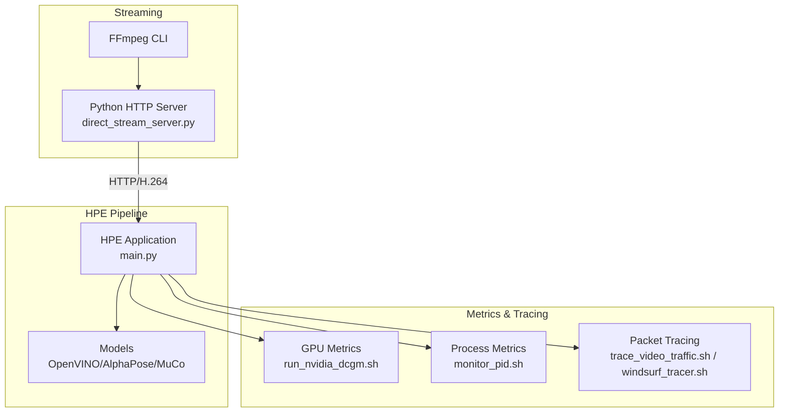

**Diagram sources**
- [direct_stream_server.py:74-133](file://rtsp-ipcam/direct_stream_server.py#L74-L133)
- [main.py:22-46](file://main.py#L22-L46)
- [run_nvidia_dcgm.sh:46-75](file://ffmpeg_hpe/run_nvidia_dcgm.sh#L46-L75)
- [monitor_pid.sh:97-127](file://ffmpeg_hpe/monitor_pid.sh#L97-L127)
- [trace_video_traffic.sh:22-43](file://ffmpeg_hpe/bpftrace-tracer/trace_video_traffic.sh#L22-L43)
- [windsurf_tracer.sh:25-48](file://ffmpeg_hpe/bpftrace-tracer/windsurf_tracer.sh#L25-L48)

**Section sources**
- [docker-compose.yaml:1-201](file://ffmpeg_hpe/docker-compose.yaml#L1-L201)
- [Dockerfile:1-40](file://rtsp-ipcam/Dockerfile#L1-L40)
- [direct_stream_server.py:74-133](file://rtsp-ipcam/direct_stream_server.py#L74-L133)
- [main.py:22-46](file://main.py#L22-L46)
- [run_nvidia_dcgm.sh:46-75](file://ffmpeg_hpe/run_nvidia_dcgm.sh#L46-L75)
- [monitor_pid.sh:97-127](file://ffmpeg_hpe/monitor_pid.sh#L97-L127)
- [trace_video_traffic.sh:22-43](file://ffmpeg_hpe/bpftrace-tracer/trace_video_traffic.sh#L22-L43)
- [windsurf_tracer.sh:25-48](file://ffmpeg_hpe/bpftrace-tracer/windsurf_tracer.sh#L25-L48)

## Core Components
- Streaming server: Converts a video file into an HTTP/H.264 stream using FFmpeg and serves it to clients
- HPE application: Accepts HTTP video streams, loads models, and performs pose estimation with optional timeouts and frame limits
- GPU metrics collector: Runs nvidia-smi in a container to log GPU utilization, memory utilization, temperature, and power
- Process and network metrics: Monitors a target PID for CPU, memory, and network TX/RX rates using bpftrace
- Packet-level tracing: Captures RX bytes for a specific port to estimate video payload throughput
- Experiment orchestrator: Starts containers, waits for healthchecks, measures startup times, collects outputs, and cleans up

**Section sources**
- [direct_stream_server.py:74-133](file://rtsp-ipcam/direct_stream_server.py#L74-L133)
- [main.py:22-46](file://main.py#L22-L46)
- [run_nvidia_dcgm.sh:46-75](file://ffmpeg_hpe/run_nvidia_dcgm.sh#L46-L75)
- [monitor_pid.sh:97-127](file://ffmpeg_hpe/monitor_pid.sh#L97-L127)
- [trace_video_traffic.sh:22-43](file://ffmpeg_hpe/bpftrace-tracer/trace_video_traffic.sh#L22-L43)
- [run_experiment.sh:77-170](file://ffmpeg_hpe/run_experiment.sh#L77-L170)

## Architecture Overview
The system is orchestrated with Docker Compose to run:
- A streaming server container that exposes an HTTP endpoint serving H.264
- An HPE container that consumes the stream, runs inference, and writes outputs
- A GPU metrics container that continuously logs GPU telemetry
- A performance monitor container that tracks CPU/memory and network metrics for the HPE process
- A BPF tracer container that captures packet RX bytes for the video stream

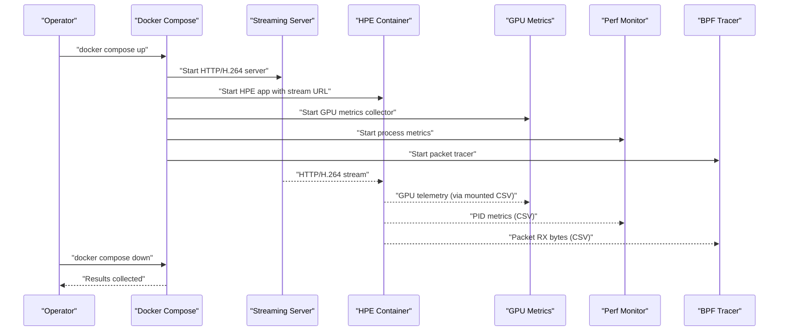

**Diagram sources**
- [docker-compose.yaml:1-201](file://ffmpeg_hpe/docker-compose.yaml#L1-L201)
- [run_experiment.sh:77-170](file://ffmpeg_hpe/run_experiment.sh#L77-L170)
- [run_experiment_bcc.sh:109-221](file://ffmpeg_hpe/run_experiment_bcc.sh#L109-L221)

## Detailed Component Analysis

### Streaming Server (HTTP/H.264)
The streaming server converts a video file into an HTTP/H.264 stream using FFmpeg and serves it to clients. It supports HEAD requests for probing and logs FFmpeg stderr for diagnostics.

Key behaviors:
- Uses FFmpeg with real-time (-re), scaling, preset/tune for low-latency encoding, and FLV output for compatibility
- Serves on a configurable port and validates the video file path
- Logs client connections and FFmpeg errors

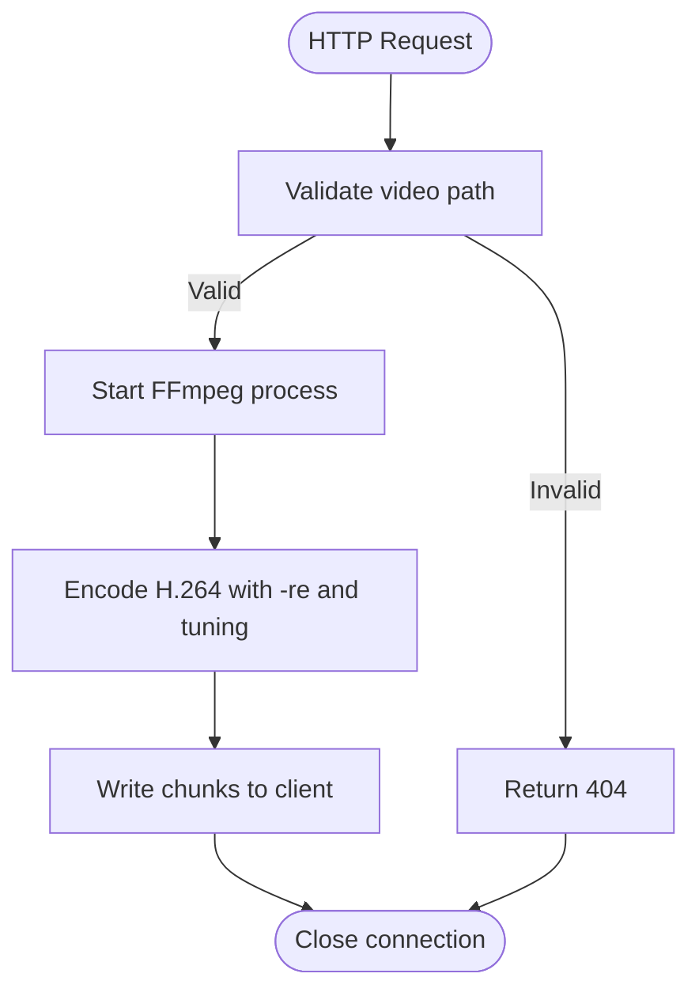

**Diagram sources**
- [direct_stream_server.py:52-133](file://rtsp-ipcam/direct_stream_server.py#L52-L133)

**Section sources**
- [direct_stream_server.py:74-133](file://rtsp-ipcam/direct_stream_server.py#L74-L133)
- [Dockerfile:8-14](file://rtsp-ipcam/Dockerfile#L8-L14)
- [start_server.sh:20-31](file://rtsp-ipcam/start_server.sh#L20-L31)

### HPE Application (HTTP Stream Consumer)
The HPE application accepts either a file path, webcam index, or HTTP URL. For HTTP streams, it applies timeouts and optional frame limits. It selects among multiple model backends and supports exporting CSV/JSON outputs.

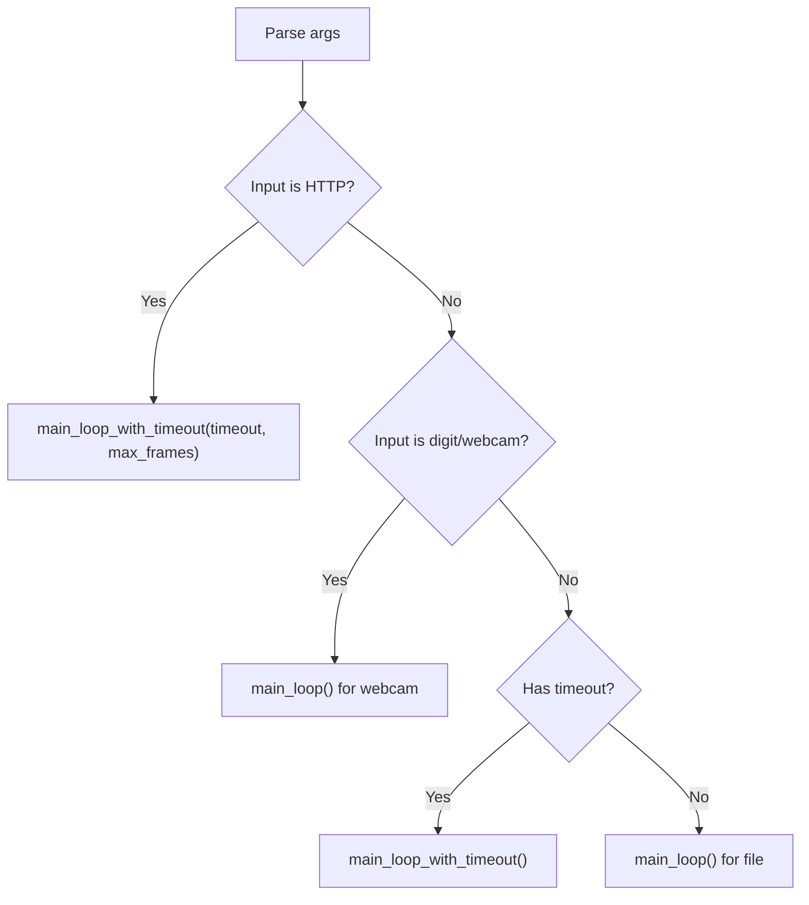

**Diagram sources**
- [main.py:22-46](file://main.py#L22-L46)

**Section sources**
- [main.py:22-46](file://main.py#L22-L46)

### GPU Metrics Collection (nvidia-smi)
The GPU metrics container runs a loop that periodically queries nvidia-smi and writes a CSV with timestamped metrics. It supports configurable interval and duration.

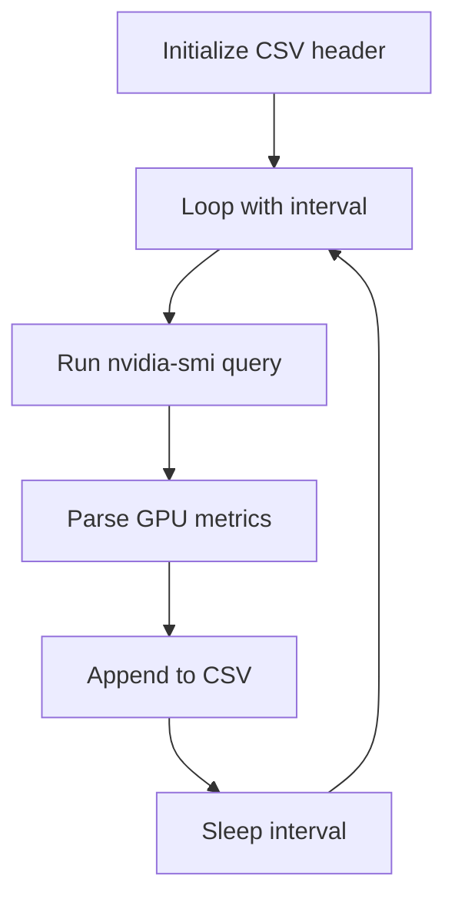

**Diagram sources**
- [run_nvidia_dcgm.sh:46-75](file://ffmpeg_hpe/run_nvidia_dcgm.sh#L46-L75)

**Section sources**
- [Dockerfile.gpu_metrics:1-20](file://ffmpeg_hpe/Dockerfile.gpu_metrics#L1-L20)
- [run_nvidia_dcgm.sh:46-75](file://ffmpeg_hpe/run_nvidia_dcgm.sh#L46-L75)

### Process and Network Metrics (bpftrace)
The perf monitor container monitors a target PID for CPU and memory and captures TX/RX bytes via bpftrace. It writes two CSVs: one for process metrics and one for network stats.

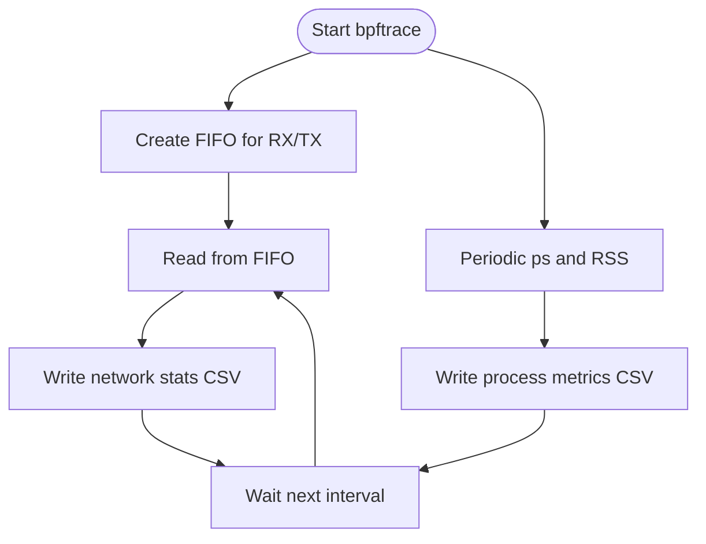

**Diagram sources**
- [monitor_pid.sh:97-127](file://ffmpeg_hpe/monitor_pid.sh#L97-L127)

**Section sources**
- [monitor_pid.sh:97-127](file://ffmpeg_hpe/monitor_pid.sh#L97-L127)

### Packet-Level Tracing (BPF Tracer)
Two tracer variants are provided:
- A generic tracer that captures RX bytes over a target port and writes a CSV
- A windsurf tracer that samples TCP receive queue size for HTTP stream monitoring

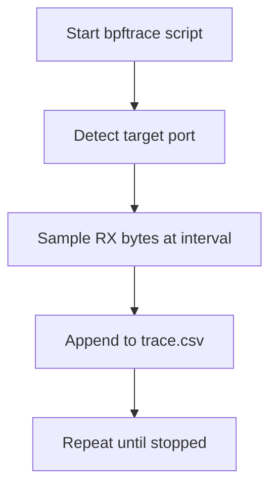

**Diagram sources**
- [trace_video_traffic.sh:22-43](file://ffmpeg_hpe/bpftrace-tracer/trace_video_traffic.sh#L22-L43)
- [windsurf_tracer.sh:25-48](file://ffmpeg_hpe/bpftrace-tracer/windsurf_tracer.sh#L25-L48)

**Section sources**
- [trace_video_traffic.sh:22-43](file://ffmpeg_hpe/bpftrace-tracer/trace_video_traffic.sh#L22-L43)
- [windsurf_tracer.sh:25-48](file://ffmpeg_hpe/bpftrace-tracer/windsurf_tracer.sh#L25-L48)

### Experiment Execution Scripts
Two scripts orchestrate experiments:
- A general runner that starts containers, measures startup times, collects logs and CSV outputs, and cleans up
- A BCC variant that adds BPF tracer initialization and port detection

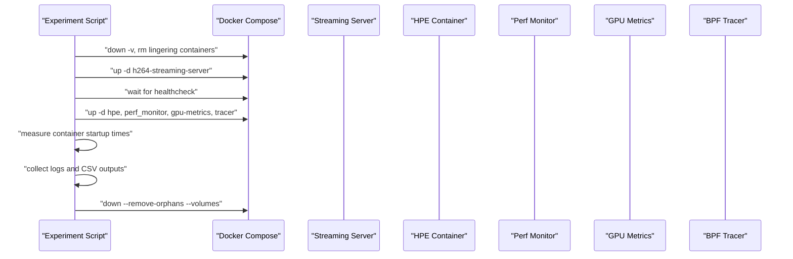

**Diagram sources**
- [run_experiment.sh:77-170](file://ffmpeg_hpe/run_experiment.sh#L77-L170)
- [run_experiment_bcc.sh:109-221](file://ffmpeg_hpe/run_experiment_bcc.sh#L109-L221)

**Section sources**
- [run_experiment.sh:77-170](file://ffmpeg_hpe/run_experiment.sh#L77-L170)
- [run_experiment_bcc.sh:109-221](file://ffmpeg_hpe/run_experiment_bcc.sh#L109-L221)

### FFmpeg-Based Dev Tools (Flask + MJPEG)
A development utility demonstrates streaming via FFmpeg to an MJPEG endpoint using Flask. It probes video details with ffprobe and streams JPEG frames with proper multipart boundaries.

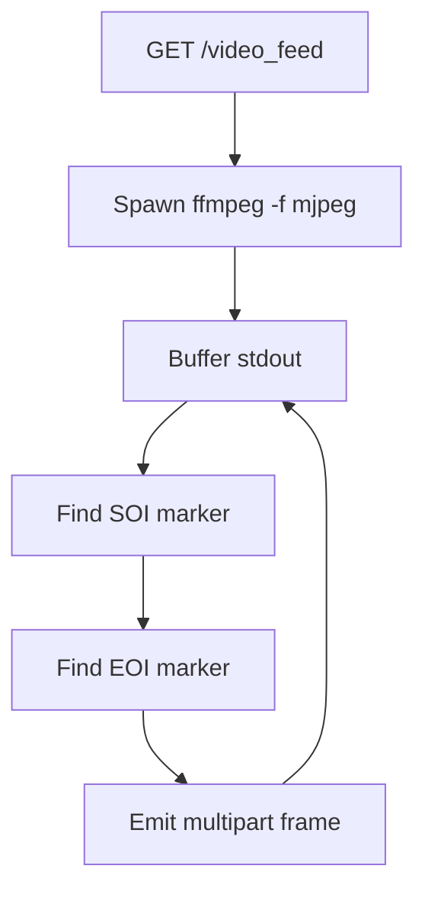

**Diagram sources**
- [app_ffmpeg.py:69-152](file://dev_tools/app_ffmpeg.py#L69-L152)

**Section sources**
- [app_ffmpeg.py:69-152](file://dev_tools/app_ffmpeg.py#L69-L152)

### FFmpeg Build and Codec Optimization
A dedicated script builds FFmpeg from source with CUDA/NVENC/NPP support and NVENC encoder flags tailored to modern GPUs. It verifies hardware acceleration and MJPEG support.

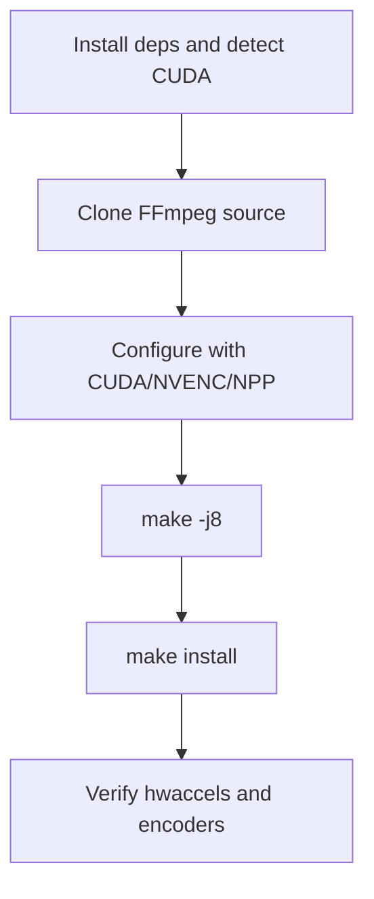

**Diagram sources**
- [build_ffmpeg_cuda.sh:157-183](file://build_ffmpeg_cuda.sh#L157-L183)

**Section sources**
- [build_ffmpeg_cuda.sh:157-183](file://build_ffmpeg_cuda.sh#L157-L183)

### Stream Compatibility Checker
A helper script validates HTTP streams for codec, resolution, FPS, pixel format, and accessibility, and provides guidance for OpenCV capture options.

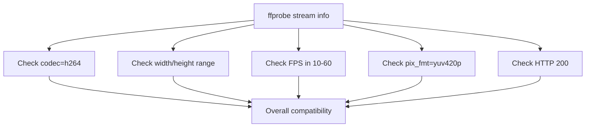

**Diagram sources**
- [check_stream_compat.sh:11-44](file://check_stream_compat.sh#L11-L44)

**Section sources**
- [check_stream_compat.sh:11-44](file://check_stream_compat.sh#L11-L44)

## Dependency Analysis
The following diagram shows how components depend on each other and external tools.

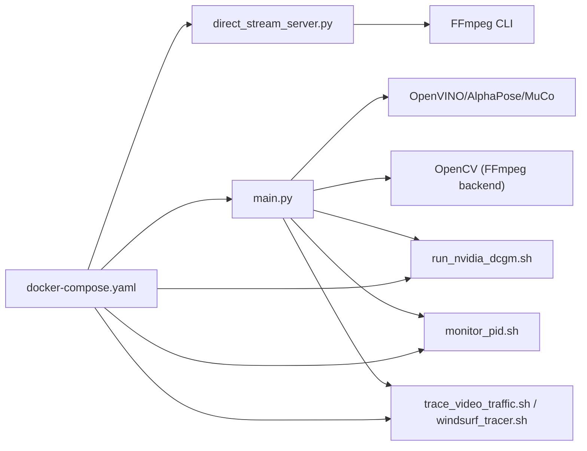

**Diagram sources**
- [docker-compose.yaml:1-201](file://ffmpeg_hpe/docker-compose.yaml#L1-L201)
- [direct_stream_server.py:74-133](file://rtsp-ipcam/direct_stream_server.py#L74-L133)
- [main.py:22-46](file://main.py#L22-L46)
- [run_nvidia_dcgm.sh:46-75](file://ffmpeg_hpe/run_nvidia_dcgm.sh#L46-L75)
- [monitor_pid.sh:97-127](file://ffmpeg_hpe/monitor_pid.sh#L97-L127)
- [trace_video_traffic.sh:22-43](file://ffmpeg_hpe/bpftrace-tracer/trace_video_traffic.sh#L22-L43)
- [windsurf_tracer.sh:25-48](file://ffmpeg_hpe/bpftrace-tracer/windsurf_tracer.sh#L25-L48)

**Section sources**
- [docker-compose.yaml:1-201](file://ffmpeg_hpe/docker-compose.yaml#L1-L201)
- [direct_stream_server.py:74-133](file://rtsp-ipcam/direct_stream_server.py#L74-L133)
- [main.py:22-46](file://main.py#L22-L46)

## Performance Considerations
- Latency and throughput: The streaming server uses FFmpeg with real-time and zero-latency tuning for live-like streaming. Choose appropriate presets and tune for your GPU/CPU balance.
- Model device selection: The HPE application allows switching between CPU and GPU depending on the model and method. Some models default to GPU.
- OpenCV timeouts: For HTTP streams, increased OpenCV FFMPEG timeouts are configured to reduce early disconnects.
- Container resource limits: Compose sets CPU/memory limits and GPU device reservations for predictable performance.
- Metrics cadence: Reduce sampling intervals for high-frequency metrics to minimize overhead; the scripts already use modest intervals.

[No sources needed since this section provides general guidance]

## Troubleshooting Guide
Common issues and remedies:
- Stream not accessible: Use the compatibility checker to validate codec, resolution, FPS, pixel format, and HTTP status
- FFmpeg not found: Ensure FFmpeg is installed in the streaming server container and on the host for dev tools
- OpenCV cannot connect: Increase OpenCV FFMPEG timeouts and verify the stream URL resolves inside the container network
- GPU metrics missing: Confirm the GPU metrics container is healthy and has access to nvidia-smi
- PID metrics not written: Ensure the PID file is present and readable by the perf monitor container
- BPF tracer failures: Verify bpftrace availability, privileges, and correct target container and port

**Section sources**
- [check_stream_compat.sh:11-44](file://check_stream_compat.sh#L11-L44)
- [Dockerfile:8-14](file://rtsp-ipcam/Dockerfile#L8-L14)
- [docker-compose.yaml:94-114](file://ffmpeg_hpe/docker-compose.yaml#L94-L114)
- [monitor_pid.sh:74-83](file://ffmpeg_hpe/monitor_pid.sh#L74-L83)
- [trace_video_traffic.sh:38-43](file://ffmpeg_hpe/bpftrace-tracer/trace_video_traffic.sh#L38-L43)

## Conclusion
The FFmpeg integration provides a robust, containerized pipeline for HPE on HTTP video streams. It combines a lightweight FFmpeg-based streaming server, a flexible HPE application, and comprehensive metrics collection for GPU, process, and network performance. The experiment scripts automate orchestration, enabling repeatable performance measurements across different models and configurations.

[No sources needed since this section summarizes without analyzing specific files]

## Appendices

### Example Pipelines and Workflows
- HTTP/H.264 streaming pipeline:
  - Build and run the streaming server container
  - Start the HPE container pointing to the stream URL
  - Enable GPU metrics and perf monitor containers
- Codec optimization:
  - Build FFmpeg with CUDA/NVENC/NPP and verify MJPEG support
  - Use the streaming server with tuned presets and scaling
- Real-time streaming:
  - Use the Flask MJPEG demo for quick prototyping
  - Validate stream compatibility before production deployment

**Section sources**
- [docker-compose.yaml:1-201](file://ffmpeg_hpe/docker-compose.yaml#L1-L201)
- [build_ffmpeg_cuda.sh:157-183](file://build_ffmpeg_cuda.sh#L157-L183)
- [app_ffmpeg.py:69-152](file://dev_tools/app_ffmpeg.py#L69-L152)
- [check_stream_compat.sh:11-44](file://check_stream_compat.sh#L11-L44)