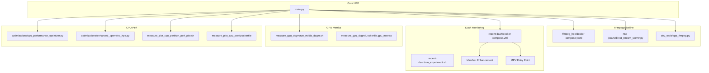
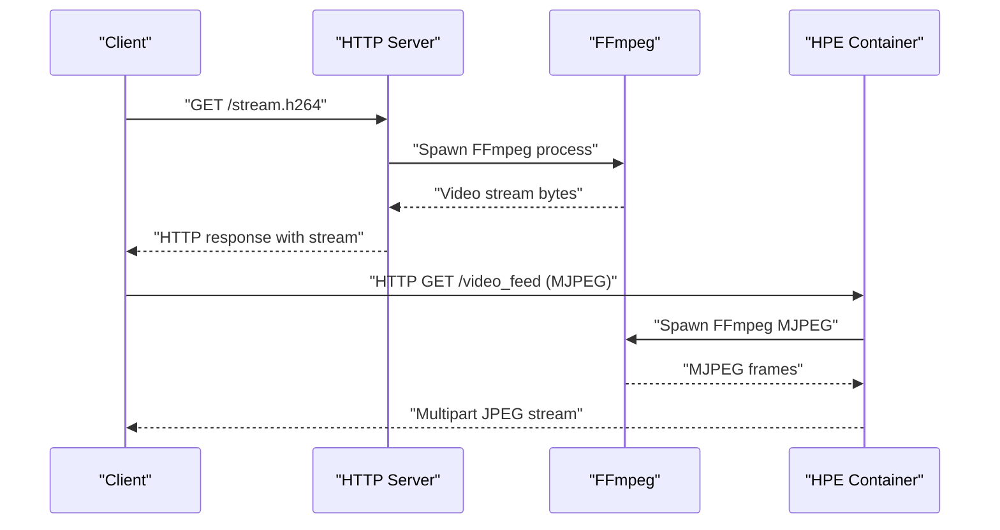
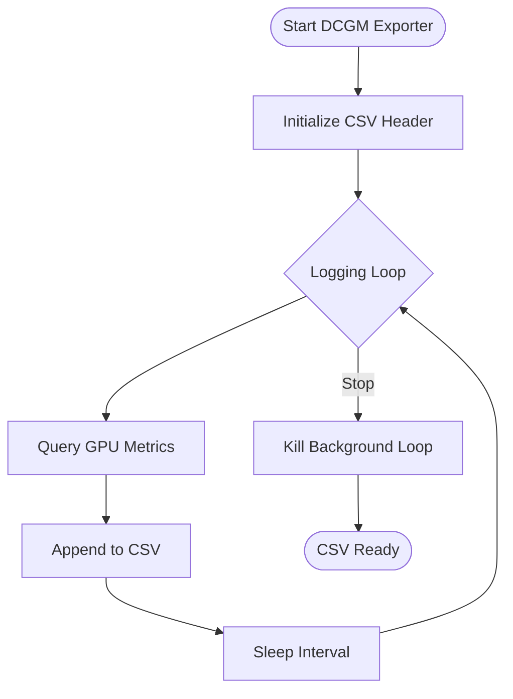
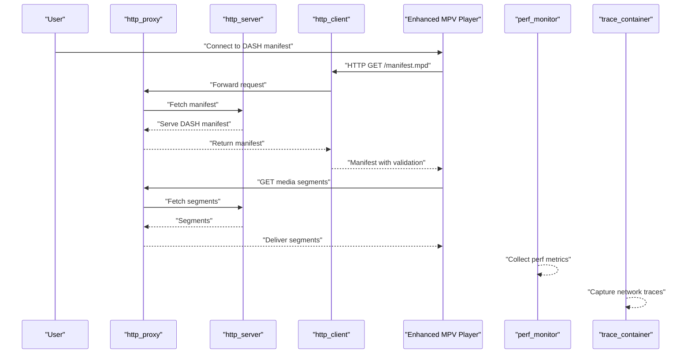
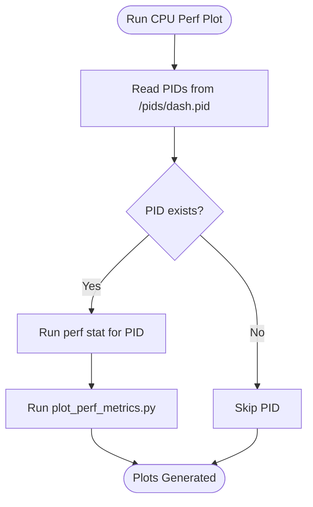
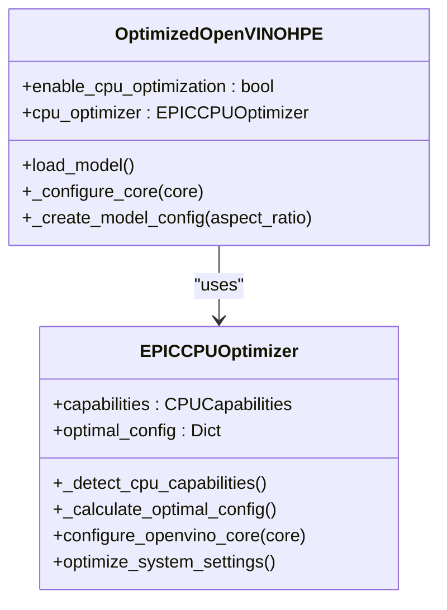
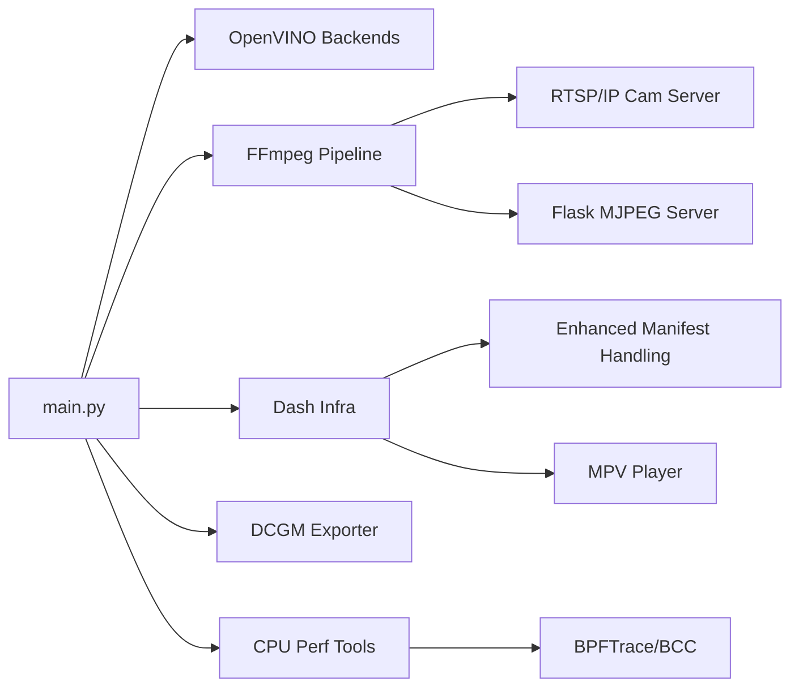

# Integration Components

<cite>
**Referenced Files in This Document**
- [README.md](file://README.md)
- [main.py](file://main.py)
- [ffmpeg_hpe/docker-compose.yaml](file://ffmpeg_hpe/docker-compose.yaml)
- [recent-dash/docker-compose.yml](file://recent-dash/docker-compose.yml)
- [recent-dash/entrypoint.sh](file://recent-dash/entrypoint.sh)
- [recent-dash/mpv-entrypoint.sh](file://recent-dash/mpv-entrypoint.sh)
- [recent-dash/run_experiment.sh](file://recent-dash/run_experiment.sh)
- [recent-dash/segments/manifest.mpd](file://recent-dash/segments/manifest.mpd)
- [recent-dash/segments/manifest_single.mpd](file://recent-dash/segments/manifest_single.mpd)
- [measure_gpu_dcgm/run_nvidia_dcgm.sh](file://measure_gpu_dcgm/run_nvidia_dcgm.sh)
- [measure_gpu_dcgm/Dockerfile.gpu_metrics](file://measure_gpu_dcgm/Dockerfile.gpu_metrics)
- [measure_plot_cpu_perf/run_perf_plot.sh](file://measure_plot_cpu_perf/run_perf_plot.sh)
- [measure_plot_cpu_perf/Dockerfile](file://measure_plot_cpu_perf/Dockerfile)
- [dev_tools/app_ffmpeg.py](file://dev_tools/app_ffmpeg.py)
- [rtsp-ipcam/direct_stream_server.py](file://rtsp-ipcam/direct_stream_server.py)
- [ffmpeg_hpe/run_experiment.sh](file://ffmpeg_hpe/run_experiment.sh)
- [optimizations/cpu_performance_optimizer.py](file://optimizations/cpu_performance_optimizer.py)
- [optimizations/enhanced_openvino_hpe.py](file://optimizations/enhanced_openvino_hpe.py)
- [monitor_hpe/docker-compose.yaml](file://monitor_hpe/docker-compose.yaml)
</cite>

## Update Summary
**Changes Made**
- Enhanced Recent-DASH component with improved manifest handling through environment variables
- Added configurable DASH manifest selection with `${DASH_MANIFEST:-manifest_single.mpd}` syntax
- Improved MPV player entrypoint with manifest size validation and enhanced player configuration
- Updated environment variable system for better control over player behavior and timing

## Table of Contents
1. [Introduction](#introduction)
2. [Project Structure](#project-structure)
3. [Core Components](#core-components)
4. [Architecture Overview](#architecture-overview)
5. [Detailed Component Analysis](#detailed-component-analysis)
6. [Dependency Analysis](#dependency-analysis)
7. [Performance Considerations](#performance-considerations)
8. [Troubleshooting Guide](#troubleshooting-guide)
9. [Conclusion](#conclusion)

## Introduction
This document explains the integration components that extend the core Human Pose Estimation (HPE) framework. It covers:
- Open Model Zoo integration for accessing pre-trained models
- FFmpeg integration for video processing pipelines
- DCGM exporter for GPU metrics collection
- Recent dash monitoring system for network traffic analysis with enhanced manifest handling
- CPU performance plotting tools
- Usage patterns, configuration requirements, and APIs

These integrations enable advanced use cases such as real-time video processing, comprehensive system monitoring, and optimized inference performance across CPU and GPU.

## Project Structure
The repository organizes HPE experiments and integrations across several directories:
- Core HPE entrypoint and methods
- FFmpeg-based streaming pipeline and monitoring
- Dash-based network monitoring and tracing with enhanced configuration
- GPU metrics collection via DCGM exporter
- CPU performance optimization and plotting
- RTSP/IP camera streaming server



**Diagram sources**
- [main.py:1-99](file://main.py#L1-L99)
- [ffmpeg_hpe/docker-compose.yaml:1-201](file://ffmpeg_hpe/docker-compose.yaml#L1-L201)
- [recent-dash/docker-compose.yml:1-180](file://recent-dash/docker-compose.yml#L1-L180)
- [recent-dash/entrypoint.sh:1-24](file://recent-dash/entrypoint.sh#L1-L24)
- [recent-dash/mpv-entrypoint.sh:1-57](file://recent-dash/mpv-entrypoint.sh#L1-L57)
- [recent-dash/run_experiment.sh:1-380](file://recent-dash/run_experiment.sh#L1-L380)
- [measure_gpu_dcgm/run_nvidia_dcgm.sh:1-29](file://measure_gpu_dcgm/run_nvidia_dcgm.sh#L1-L29)
- [measure_gpu_dcgm/Dockerfile.gpu_metrics:1-12](file://measure_gpu_dcgm/Dockerfile.gpu_metrics#L1-L12)
- [optimizations/cpu_performance_optimizer.py:1-539](file://optimizations/cpu_performance_optimizer.py#L1-L539)
- [optimizations/enhanced_openvino_hpe.py:1-333](file://optimizations/enhanced_openvino_hpe.py#L1-L333)
- [measure_plot_cpu_perf/run_perf_plot.sh:1-25](file://measure_plot_cpu_perf/run_perf_plot.sh#L1-L25)
- [measure_plot_cpu_perf/Dockerfile:1-18](file://measure_plot_cpu_perf/Dockerfile#L1-L18)
- [rtsp-ipcam/direct_stream_server.py:1-304](file://rtsp-ipcam/direct_stream_server.py#L1-L304)
- [dev_tools/app_ffmpeg.py:1-204](file://dev_tools/app_ffmpeg.py#L1-L204)

**Section sources**
- [README.md:1-125](file://README.md#L1-L125)
- [main.py:1-99](file://main.py#L1-L99)

## Core Components
- OpenVINO-based HPE methods and model selection
- FFmpeg-based streaming server and HTTP MJPEG/FLV pipelines
- Dash-based HTTP streaming infrastructure with enhanced proxy, client, and player components
- GPU metrics collection via DCGM exporter
- CPU performance optimization and plotting tools
- RTSP/IP camera streaming server

Key capabilities:
- Access pre-trained models from OpenVINO OMZ
- Stream H.264/H.265 video over HTTP for real-time inference
- Monitor network traffic and CPU performance during experiments
- Export GPU telemetry for capacity planning and debugging
- **Enhanced DASH manifest handling with configurable environments and validation**

**Section sources**
- [README.md:1-125](file://README.md#L1-L125)
- [main.py:47-99](file://main.py#L47-L99)

## Architecture Overview
The integrated system orchestrates multiple containers and pipelines:
- HPE inference container consuming HTTP video streams
- FFmpeg-based streaming server or HTTP MJPEG server
- Dash HTTP server/proxy/client stack for DASH streaming with enhanced configuration
- Performance and tracing containers for CPU/GPU metrics
- Optional BPFTrace/BCC tracers for network packet analysis

```mermaid
graph TB
subgraph "Streaming"
S1["RTSP/IP Cam Server<br/>direct_stream_server.py"]
S2["Flask FFmpeg MJPEG Server<br/>app_ffmpeg.py"]
end
subgraph "HPE Inference"
HPE["HPE Container<br/>main.py + OpenVINO"]
end
subgraph "Enhanced Monitoring"
PERF["Perf Monitor<br/>run_perf_plot.sh"]
TRACE["Trace Container<br/>BPFTrace/BCC"]
DASH["Dash Infra<br/>http_server/proxy/client<br/>Enhanced Manifest Handling"]
END
subgraph "Metrics"
GPU["DCGM Exporter<br/>run_nvidia_dcgm.sh"]
end
S1 --> HPE
S2 --> HPE
HPE --> PERF
HPE --> TRACE
HPE --> GPU
DASH --> HPE
```

**Diagram sources**
- [rtsp-ipcam/direct_stream_server.py:45-151](file://rtsp-ipcam/direct_stream_server.py#L45-L151)
- [dev_tools/app_ffmpeg.py:69-170](file://dev_tools/app_ffmpeg.py#L69-L170)
- [main.py:22-46](file://main.py#L22-L46)
- [ffmpeg_hpe/docker-compose.yaml:39-93](file://ffmpeg_hpe/docker-compose.yaml#L39-L93)
- [recent-dash/docker-compose.yml:3-51](file://recent-dash/docker-compose.yml#L3-L51)
- [recent-dash/entrypoint.sh:1-24](file://recent-dash/entrypoint.sh#L1-L24)
- [recent-dash/mpv-entrypoint.sh:1-57](file://recent-dash/mpv-entrypoint.sh#L1-L57)
- [measure_gpu_dcgm/run_nvidia_dcgm.sh:10-27](file://measure_gpu_dcgm/run_nvidia_dcgm.sh#L10-L27)
- [measure_plot_cpu_perf/run_perf_plot.sh:11-25](file://measure_plot_cpu_perf/run_perf_plot.sh#L11-L25)

## Detailed Component Analysis

### Open Model Zoo Integration
- Purpose: Provide access to pre-trained models for OpenVINO-based HPE.
- Location: OpenVINO OMZ repository and model sets under models/OpenVINO.
- Usage pattern:
  - Select model type via CLI argument (e.g., openpose, higherhrnet, efficienthrnet variants).
  - Load model through OpenVINO base HPE classes.
  - Device selection (CPU/GPU) influences performance tuning and threading configuration.

Configuration highlights:
- Model type mapping in the HPE factory selects the appropriate backend.
- Device-specific environment variables influence OpenVINO properties.

**Section sources**
- [README.md:41-70](file://README.md#L41-L70)
- [main.py:64-84](file://main.py#L64-L84)

### FFmpeg Integration for Video Processing Pipelines
- HTTP H.264 streaming server:
  - Direct HTTP server that streams H.264 via FFmpeg to clients (e.g., VLC).
  - Supports HEAD requests and configurable port.
- Flask MJPEG streaming:
  - Reads FFmpeg output, buffers JPEG frames, and yields multipart boundaries for streaming.
  - Robust handling of incomplete frames and process termination.
- Docker orchestration:
  - Compose defines HPE container with GPU runtime, environment variables for timeouts, and shared network.
  - Healthchecks and resource limits ensure stable operation.



**Diagram sources**
- [rtsp-ipcam/direct_stream_server.py:52-138](file://rtsp-ipcam/direct_stream_server.py#L52-L138)
- [dev_tools/app_ffmpeg.py:69-170](file://dev_tools/app_ffmpeg.py#L69-L170)
- [ffmpeg_hpe/docker-compose.yaml:39-93](file://ffmpeg_hpe/docker-compose.yaml#L39-L93)

**Section sources**
- [rtsp-ipcam/direct_stream_server.py:1-304](file://rtsp-ipcam/direct_stream_server.py#L1-L304)
- [dev_tools/app_ffmpeg.py:1-204](file://dev_tools/app_ffmpeg.py#L1-L204)
- [ffmpeg_hpe/docker-compose.yaml:1-201](file://ffmpeg_hpe/docker-compose.yaml#L1-L201)

### DCGM Exporter for GPU Metrics Collection
- Purpose: Continuously log GPU telemetry (power draw, temperature, utilization, memory) to CSV.
- Mechanism:
  - Background loop queries GPU metrics periodically and appends to CSV.
  - Exposed via Docker container with NVIDIA runtime.
- Usage:
  - Start container, press Enter to stop logging.
  - CSV output stored at /output/gpu_stats.csv.



**Diagram sources**
- [measure_gpu_dcgm/run_nvidia_dcgm.sh:10-27](file://measure_gpu_dcgm/run_nvidia_dcgm.sh#L10-L27)

**Section sources**
- [measure_gpu_dcgm/run_nvidia_dcgm.sh:1-29](file://measure_gpu_dcgm/run_nvidia_dcgm.sh#L1-L29)
- [measure_gpu_dcgm/Dockerfile.gpu_metrics:1-12](file://measure_gpu_dcgm/Dockerfile.gpu_metrics#L1-L12)

### Recent Dash Monitoring System for Network Traffic Analysis
**Updated** Enhanced with improved manifest handling and configurable player settings

- Purpose: Provide a DASH streaming infrastructure with HTTP server, proxy, and client.
- Components:
  - http_server: Static HTTP server serving DASH segments.
  - http_proxy: Proxy with configurable caching and rate parameters.
  - http_client: Client container exposing port for VLC/players.
  - **Enhanced mpv player**: Configurable through environment variables with manifest validation.
  - perf_monitor: Captures CPU performance metrics for monitored processes.
  - trace_container: BPF-based tracing for network traffic.
- Experiment automation:
  - run_experiment.sh builds images, starts services, measures container startup times, collects logs and traces, and cleans up.
- **Enhanced Features**:
  - **Configurable Manifests**: `${DASH_MANIFEST:-manifest_single.mpd}` allows selecting different manifest files.
  - **Player Environment Variables**: `DASH_PLAYER_WARMUP_SECONDS`, `DASH_PLAYER_RETRY_DELAY_SECONDS`, `DASH_PLAYER_START_DELAY_SECONDS`.
  - **Manifest Size Validation**: MPV entrypoint validates manifest content before playback.
  - **Improved Player Reliability**: Enhanced retry logic and logging for robust DASH playback.



**Diagram sources**
- [recent-dash/docker-compose.yml:3-51](file://recent-dash/docker-compose.yml#L3-L51)
- [recent-dash/run_experiment.sh:10-30](file://recent-dash/run_experiment.sh#L10-L30)
- [recent-dash/mpv-entrypoint.sh:1-57](file://recent-dash/mpv-entrypoint.sh#L1-L57)

**Section sources**
- [recent-dash/docker-compose.yml:1-180](file://recent-dash/docker-compose.yml#L1-L180)
- [recent-dash/README.md:1-189](file://recent-dash/README.md#L1-L189)
- [recent-dash/run_experiment.sh:1-380](file://recent-dash/run_experiment.sh#L1-L380)
- [recent-dash/entrypoint.sh:1-24](file://recent-dash/entrypoint.sh#L1-L24)
- [recent-dash/mpv-entrypoint.sh:1-57](file://recent-dash/mpv-entrypoint.sh#L1-L57)

### CPU Performance Plotting Tools
- Purpose: Profile CPU performance for target PIDs and produce plots.
- Mechanism:
  - run_perf_plot.sh reads PIDs from mounted file, runs perf stat for cycles and CPU clock, and invokes plotting script.
  - Dockerfile installs perf, sudo, and plotting dependencies.
- Usage:
  - Ensure PIDs are written to /pids and container has required privileges.



**Diagram sources**
- [measure_plot_cpu_perf/run_perf_plot.sh:11-25](file://measure_plot_cpu_perf/run_perf_plot.sh#L11-L25)
- [measure_plot_cpu_perf/Dockerfile:1-18](file://measure_plot_cpu_perf/Dockerfile#L1-L18)

**Section sources**
- [measure_plot_cpu_perf/run_perf_plot.sh:1-25](file://measure_plot_cpu_perf/run_perf_plot.sh#L1-L25)
- [measure_plot_cpu_perf/Dockerfile:1-18](file://measure_plot_cpu_perf/Dockerfile#L1-L18)

### CPU Performance Optimization for OpenVINO
- Purpose: Optimize OpenVINO inference on high-core-count x86_64 systems (e.g., EPIC 7551P).
- Features:
  - Detects CPU capabilities (cores, frequency, AVX support, NUMA).
  - Calculates optimal threads, streams, and performance hints per model.
  - Applies system-level optimizations (CPU governor, power management toggles).
  - Integrates with OpenVINO core properties for CPU pinning and hyper-threading.
- Usage:
  - Use OptimizedOpenVINOHPE factory to create model instances with CPU optimizations enabled.



**Diagram sources**
- [optimizations/cpu_performance_optimizer.py:20-404](file://optimizations/cpu_performance_optimizer.py#L20-L404)
- [optimizations/enhanced_openvino_hpe.py:25-244](file://optimizations/enhanced_openvino_hpe.py#L25-L244)

**Section sources**
- [optimizations/cpu_performance_optimizer.py:1-539](file://optimizations/cpu_performance_optimizer.py#L1-L539)
- [optimizations/enhanced_openvino_hpe.py:1-333](file://optimizations/enhanced_openvino_hpe.py#L1-L333)

### RTSP/IP Camera Streaming Server
- Purpose: Serve H.264 video over HTTP for clients like VLC and FFplay.
- Features:
  - Validates video path, handles GET/HEAD requests, and streams via FFmpeg.
  - Logs client connections and FFmpeg stderr for diagnostics.
- Usage:
  - Run with --video and optional --port; test URLs provided in logs.

**Section sources**
- [rtsp-ipcam/direct_stream_server.py:1-304](file://rtsp-ipcam/direct_stream_server.py#L1-L304)

## Dependency Analysis
- HPE entrypoint depends on OpenVINO-based backends and CLI arguments to select methods and devices.
- FFmpeg pipeline depends on FFmpeg availability and proper environment variables for timeouts.
- Dash monitoring depends on Docker Compose services and BPF-based tracing for network visibility.
- GPU metrics depend on NVIDIA runtime and nvidia-smi availability.
- CPU performance tools depend on perf, sudo, and mounted PID files.
- **Recent-DASH enhanced components depend on configurable environment variables for manifest selection and player behavior.**



**Diagram sources**
- [main.py:10-12](file://main.py#L10-L12)
- [ffmpeg_hpe/docker-compose.yaml:39-93](file://ffmpeg_hpe/docker-compose.yaml#L39-L93)
- [recent-dash/docker-compose.yml:3-51](file://recent-dash/docker-compose.yml#L3-L51)
- [recent-dash/entrypoint.sh:1-24](file://recent-dash/entrypoint.sh#L1-L24)
- [recent-dash/mpv-entrypoint.sh:1-57](file://recent-dash/mpv-entrypoint.sh#L1-L57)
- [measure_gpu_dcgm/run_nvidia_dcgm.sh:10-27](file://measure_gpu_dcgm/run_nvidia_dcgm.sh#L10-L27)
- [measure_plot_cpu_perf/run_perf_plot.sh:11-25](file://measure_plot_cpu_perf/run_perf_plot.sh#L11-L25)

**Section sources**
- [main.py:1-99](file://main.py#L1-L99)
- [ffmpeg_hpe/docker-compose.yaml:1-201](file://ffmpeg_hpe/docker-compose.yaml#L1-L201)
- [recent-dash/docker-compose.yml:1-180](file://recent-dash/docker-compose.yml#L1-L180)

## Performance Considerations
- CPU optimization:
  - Tune inference threads, streams, and performance hints per model and core count.
  - Apply CPU governor and disable power management features for consistent latency.
- GPU metrics:
  - Periodic sampling of power draw, temperature, and memory usage aids capacity planning.
- Streaming:
  - Increase OpenCV FFMPEG timeouts for long-running HTTP streams.
  - Use appropriate FFmpeg presets and tune for zero-latency streaming.
- **Recent-DASH enhancements**:
  - **Configurable manifest selection** allows testing different DASH configurations without rebuilding containers.
  - **Player environment variables** enable fine-tuning of playback behavior for different network conditions.
  - **Manifest validation** prevents failed playback attempts and improves experiment reliability.

## Troubleshooting Guide
Common issues and remedies:
- FFmpeg not found:
  - Ensure FFmpeg is installed and in PATH; the Flask server validates availability.
- Video probe failures:
  - Verify video path and permissions; logs capture ffprobe errors.
- Container healthcheck failures:
  - Check service readiness and compose healthcheck configurations.
- Missing PID file for perf:
  - Confirm /pids/dash.pid exists and is readable by the perf monitor container.
- DCGM exporter not writing CSV:
  - Validate NVIDIA runtime and permissions; confirm output directory mount.
- **Enhanced DASH issues**:
  - **Missing manifest files**: Ensure the selected manifest exists in `recent-dash/segments/` directory.
  - **Player connection failures**: Check environment variables for player timing and warmup settings.
  - **Empty manifest warnings**: Verify manifest size validation and network connectivity between components.

**Section sources**
- [dev_tools/app_ffmpeg.py:54-66](file://dev_tools/app_ffmpeg.py#L54-L66)
- [rtsp-ipcam/direct_stream_server.py:175-183](file://rtsp-ipcam/direct_stream_server.py#L175-L183)
- [ffmpeg_hpe/docker-compose.yaml:19-24](file://ffmpeg_hpe/docker-compose.yaml#L19-L24)
- [measure_plot_cpu_perf/run_perf_plot.sh:6-9](file://measure_plot_cpu_perf/run_perf_plot.sh#L6-L9)
- [measure_gpu_dcgm/run_nvidia_dcgm.sh:4-5](file://measure_gpu_dcgm/run_nvidia_dcgm.sh#L4-L5)
- [recent-dash/mpv-entrypoint.sh:21-25](file://recent-dash/mpv-entrypoint.sh#L21-L25)

## Conclusion
The integration components significantly extend the HPE framework by enabling:
- Access to a wide range of pre-trained models via OpenVINO OMZ
- Robust, real-time video streaming using FFmpeg and HTTP servers
- Comprehensive system monitoring through DASH infrastructure, BPF tracing, and CPU/GPU metrics
- Model-specific CPU optimizations for high-core-count systems
- **Enhanced DASH experimentation with configurable manifests and reliable player behavior**

**Updated** The Recent-DASH component now provides improved flexibility through configurable manifest handling and enhanced player configuration, making it easier to test different DASH configurations and network conditions while maintaining reliable experiment execution.

Together, these integrations support advanced scenarios such as live video analytics, performance benchmarking, observability-driven operations, and comprehensive DASH streaming research with flexible configuration options.