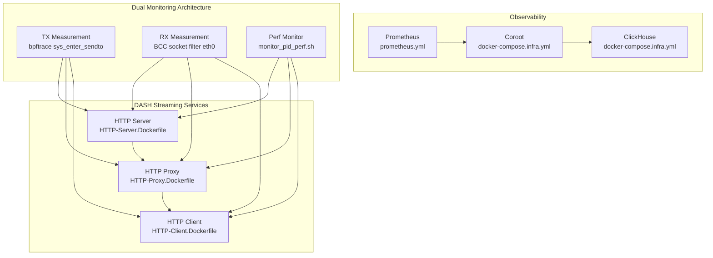
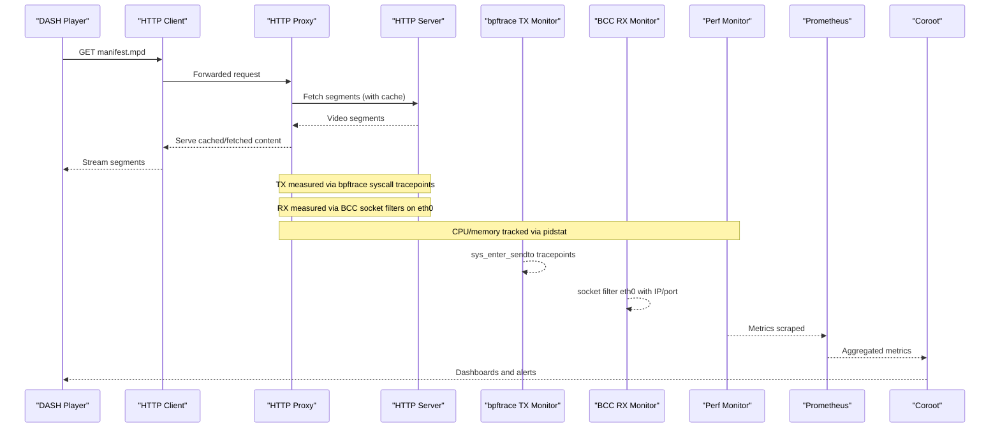
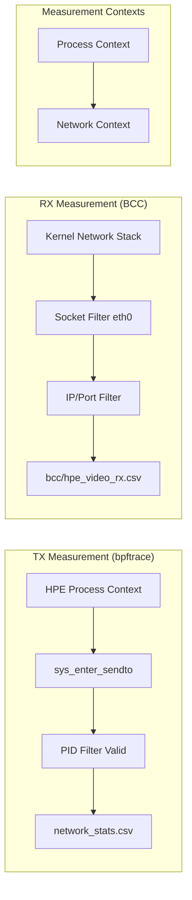
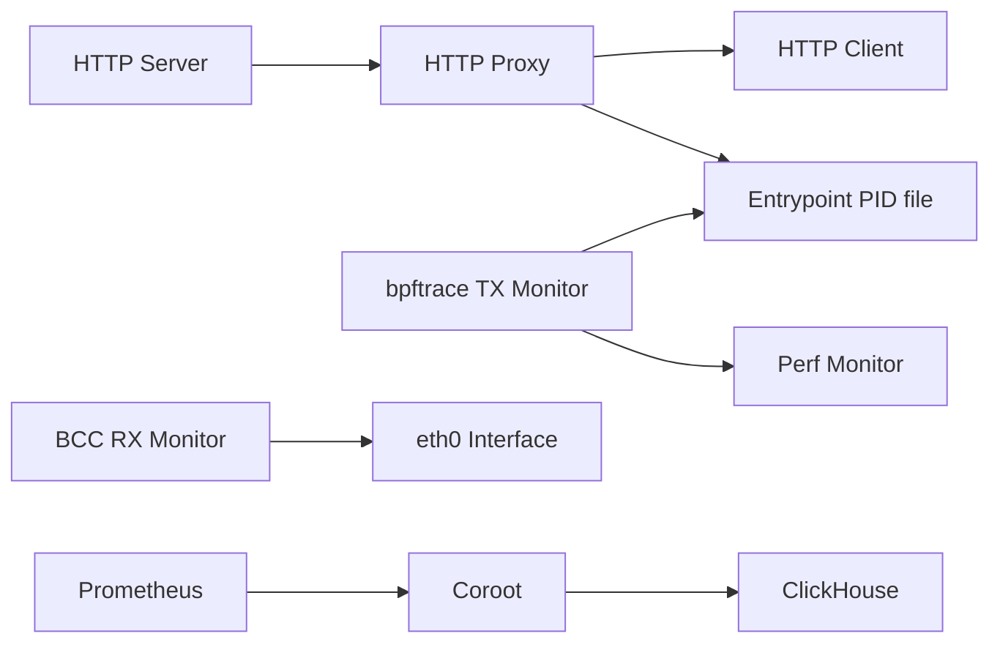

# Network Monitoring System

<cite>
**Referenced Files in This Document**
- [README.md](file://recent-dash/README.md)
- [AGENTS.md](file://AGENTS.md)
- [docker-compose.yml](file://recent-dash/docker-compose.yml)
- [docker-compose.infra.yml](file://recent-dash/docker-compose.infra.yml)
- [prometheus.yml](file://recent-dash/prometheus.yml)
- [run_experiment.sh](file://recent-dash/run_experiment.sh)
- [entrypoint.sh](file://recent-dash/entrypoint.sh)
- [HTTP-Client.Dockerfile](file://recent-dash/HTTP-Client.Dockerfile)
- [HTTP-Client.launch.sh](file://recent-dash/HTTP-Client.launch.sh)
- [HTTP-Proxy.Dockerfile](file://recent-dash/HTTP-Proxy.Dockerfile)
- [HTTP-Proxy.launch.sh](file://recent-dash/HTTP-Proxy.launch.sh)
- [HTTP-Server.Dockerfile](file://recent-dash/HTTP-Server.Dockerfile)
- [HTTP-Server.launch.sh](file://recent-dash/HTTP-Server.launch.sh)
- [trace_container_net.sh](file://recent-dash/bpftrace-tracer/trace_container_net.sh)
- [monitor_pid_perf.sh](file://shared/perf_monitor/monitor_pid_perf.sh)
- [bcc_rx_bytes.py](file://ffmpeg_hpe/bpftrace-tracer/bcc_rx_bytes.py)
</cite>

## Update Summary
**Changes Made**
- Updated network monitoring architecture documentation to reflect the TX/RX tool split
- Added detailed explanation of bpftrace TX measurement vs BCC RX measurement methodology
- Clarified that RX measurements should use bcc-tracer output while TX measurements use perf_monitor network_stats.csv
- Updated component analysis to distinguish between recent-dash DASH-only monitoring and ffmpeg_hpe streaming monitoring
- Enhanced troubleshooting guidance with specific tool selection recommendations

## Table of Contents
1. [Introduction](#introduction)
2. [Project Structure](#project-structure)
3. [Core Components](#core-components)
4. [Architecture Overview](#architecture-overview)
5. [Detailed Component Analysis](#detailed-component-analysis)
6. [Network Monitoring Architecture](#network-monitoring-architecture)
7. [Dependency Analysis](#dependency-analysis)
8. [Performance Considerations](#performance-considerations)
9. [Troubleshooting Guide](#troubleshooting-guide)
10. [Conclusion](#conclusion)
11. [Appendices](#appendices)

## Introduction
This document describes the recent-dash network monitoring system designed to track HTTP traffic and performance metrics across a DASH streaming pipeline. The system implements a sophisticated TX/RX tool split architecture where bpftrace measures outbound transmission (TX) traffic from HPE processes and BCC tracers measure inbound reception (RX) traffic at the network interface level. It explains BPF tracing capabilities for live network packet analysis, performance monitoring tools for CPU and memory metrics, and the HTTP proxy/client/server configuration. It also covers Docker-based deployment of the monitoring infrastructure, Prometheus metrics collection, and practical examples for latency and bandwidth analysis, along with troubleshooting distributed system performance issues.

## Project Structure
The recent-dash project organizes monitoring and streaming components into modular Docker services with distinct monitoring approaches for different experiment rigs:
- Streaming stack: HTTP server (CDN-like), HTTP proxy (with caching), and HTTP client (DASH player endpoint)
- Observability stack: Prometheus, Coroot, and ClickHouse for metrics and storage
- Dual monitoring architecture: bpftrace-based TX tracer and BCC-based RX tracer for comprehensive traffic analysis

**Diagram sources**
- [docker-compose.yml:1-176](file://recent-dash/docker-compose.yml#L1-L176)
- [docker-compose.infra.yml:1-101](file://recent-dash/docker-compose.infra.yml#L1-L101)
- [prometheus.yml:1-23](file://recent-dash/prometheus.yml#L1-L23)
- [monitor_pid_perf.sh:1-107](file://shared/perf_monitor/monitor_pid_perf.sh#L1-L107)
- [trace_container_net.sh:1-111](file://recent-dash/bpftrace-tracer/trace_container_net.sh#L1-L111)

**Section sources**
- [docker-compose.yml:1-176](file://recent-dash/docker-compose.yml#L1-L176)
- [docker-compose.infra.yml:1-101](file://recent-dash/docker-compose.infra.yml#L1-L101)
- [prometheus.yml:1-23](file://recent-dash/prometheus.yml#L1-L23)

## Core Components
- HTTP Server: Serves DASH video segments and manifests
- HTTP Proxy: Acts as a caching proxy between client and server
- HTTP Client: Exposes a DASH endpoint for players
- TX Monitor (bpftrace): Captures outbound transmission bytes via syscall tracepoints in HPE process context
- RX Monitor (BCC): Captures inbound reception bytes via socket filters on eth0 with IP/port filtering
- Perf Monitor: Gathers CPU and memory metrics for monitored PIDs
- Observability Stack: Prometheus scraping, Coroot for visualization, ClickHouse for storage

Key runtime behaviors:
- Container startup and port exposure are orchestrated via Docker Compose
- PID discovery and aggregation are handled by the perf monitor using a shared PID file
- Network tracing writes periodic CSV outputs for downstream analysis
- TX and RX measurements use complementary tools to avoid double-counting and ensure accuracy

**Section sources**
- [docker-compose.yml:1-176](file://recent-dash/docker-compose.yml#L1-L176)
- [entrypoint.sh:1-24](file://recent-dash/entrypoint.sh#L1-L24)
- [monitor_pid_perf.sh:1-107](file://shared/perf_monitor/monitor_pid_perf.sh#L1-L107)
- [trace_container_net.sh:1-111](file://recent-dash/bpftrace-tracer/trace_container_net.sh#L1-L111)

## Architecture Overview
The system forms a three-tier streaming pipeline with integrated dual-direction network monitoring through specialized tools for TX and RX measurements.

**Diagram sources**
- [docker-compose.yml:1-176](file://recent-dash/docker-compose.yml#L1-L176)
- [prometheus.yml:1-23](file://recent-dash/prometheus.yml#L1-L23)
- [monitor_pid_perf.sh:1-107](file://shared/perf_monitor/monitor_pid_perf.sh#L1-L107)
- [trace_container_net.sh:1-111](file://recent-dash/bpftrace-tracer/trace_container_net.sh#L1-L111)

## Detailed Component Analysis

### HTTP Server
- Purpose: Hosts DASH segments and manifests
- Configuration: Exposed on port 80; configurable via environment variables
- Build: Clones the referenced repository and prepares binaries and public content

Operational notes:
- Additional parameters can tune serving behavior
- Public folder is mounted for serving content

**Section sources**
- [HTTP-Server.Dockerfile:1-59](file://recent-dash/HTTP-Server.Dockerfile#L1-L59)
- [HTTP-Server.launch.sh:1-15](file://recent-dash/HTTP-Server.launch.sh#L1-L15)
- [docker-compose.yml:3-15](file://recent-dash/docker-compose.yml#L3-L15)

### HTTP Proxy
- Purpose: Caching proxy between client and server
- Configuration: Accepts upstream server address/port and cache directory; supports additional parameters for cache policy and scheduling
- Lifecycle: Entrypoint writes main and child PIDs to a shared location for monitoring

Operational notes:
- Parameters include cache algorithm, rates, and queue sizes
- PID file enables external performance monitoring

**Section sources**
- [HTTP-Proxy.Dockerfile:1-49](file://recent-dash/HTTP-Proxy.Dockerfile#L1-L49)
- [HTTP-Proxy.launch.sh:1-20](file://recent-dash/HTTP-Proxy.launch.sh#L1-L20)
- [entrypoint.sh:1-24](file://recent-dash/entrypoint.sh#L1-L24)
- [docker-compose.yml:16-33](file://recent-dash/docker-compose.yml#L16-L33)

### HTTP Client
- Purpose: Exposes a DASH endpoint for clients (e.g., VLC)
- Configuration: Forwards requests to the configured proxy domain/port
- Build: Copies the local binary and sets up a launch script

Operational notes:
- Port mapping exposes the client service externally
- Public folder is served as the DASH endpoint

**Section sources**
- [HTTP-Client.Dockerfile:1-55](file://recent-dash/HTTP-Client.Dockerfile#L1-L55)
- [HTTP-Client.launch.sh:1-19](file://recent-dash/HTTP-Client.launch.sh#L1-L19)
- [docker-compose.yml:34-51](file://recent-dash/docker-compose.yml#L34-L51)

### Perf Monitor
- Purpose: Periodically aggregates CPU and memory metrics for a set of PIDs
- Mechanism: Uses pidstat to sample at 1-second intervals; sums across PIDs and writes CSV with timestamp
- Inputs: PID file path and output directory are configurable

Operational notes:
- Continuously monitors until stopped
- Produces a CSV suitable for correlation with network traces

**Section sources**
- [monitor_pid_perf.sh:1-107](file://shared/perf_monitor/monitor_pid_perf.sh#L1-L107)
- [docker-compose.yml:52-69](file://recent-dash/docker-compose.yml#L52-L69)

### DASH-Only Network Tracer (TX/RX Split)
- Purpose: Captures DASH-specific network traffic using complementary tools for TX and RX directions
- TX Measurement: bpftrace sys_enter_sendto tracepoints in HPE process context
- RX Measurement: BCC socket filter on eth0 with IP/port filtering for video stream only
- Output: Separate CSV files with timestamped byte counts for each direction

Operational notes:
- TX tracer runs in containerized environment with host networking
- RX tracer uses tcpdump with AWK processing for DASH HTTP response filtering
- Both tools write to dedicated output directories for downstream analysis

**Section sources**
- [trace_container_net.sh:1-111](file://recent-dash/bpftrace-tracer/trace_container_net.sh#L1-L111)
- [docker-compose.yml:125-162](file://recent-dash/docker-compose.yml#L125-L162)

### Observability Stack (Prometheus, Coroot, ClickHouse)
- Prometheus: Scrapes node and cluster agents, plus Coroot
- Coroot: Provides dashboards and alerting, backed by ClickHouse
- docker-compose.infra.yml defines volumes, ports, and service dependencies

Operational notes:
- Prometheus configuration is mounted from prometheus.yml
- Coroot bootstraps connections to Prometheus and ClickHouse

**Section sources**
- [docker-compose.infra.yml:1-101](file://recent-dash/docker-compose.infra.yml#L1-L101)
- [prometheus.yml:1-23](file://recent-dash/prometheus.yml#L1-L23)

### Experiment Orchestration
- Purpose: Automates building, starting, measuring, and collecting artifacts from the monitoring stack
- Features:
  - Measures container instantiation times
  - Starts services in order and waits for readiness
  - Copies performance and trace outputs to a dated results directory
  - Collects container logs for diagnostics

Operational notes:
- Results are organized under a timestamped directory with logs, traces, and perf outputs
- Summarizes proxy parameters and machine characteristics

**Section sources**
- [run_experiment.sh:1-286](file://recent-dash/run_experiment.sh#L1-L286)

## Network Monitoring Architecture
The recent-dash system implements a sophisticated TX/RX tool split architecture designed to provide accurate bidirectional network traffic measurement without double-counting or context mismatches.

### TX Measurement Architecture
TX traffic (outbound from HPE processes) is measured using bpftrace with syscall tracepoints:
- **Mechanism**: `sys_enter_sendto` tracepoints fire in HPE process context
- **PID Filtering**: Valid because syscall originates from specific process
- **Output**: network_stats.csv with TX byte accumulation
- **Container**: perf_monitor service with host PID namespace

### RX Measurement Architecture  
RX traffic (inbound to HPE processes) is measured using BCC socket filters:
- **Mechanism**: Raw socket filter attached to eth0 interface
- **IP/Port Filtering**: Filters by streamer IP and HPE ephemeral port
- **Context**: Fire in network stack context, not process context
- **Output**: bcc/hpe_video_rx.csv with RX byte deltas
- **Container**: bcc-tracer service sharing HPE's network namespace

### Why This Split is Necessary
- **TX Context**: `sendto()` syscalls originate from HPE process, enabling PID filtering
- **RX Context**: Incoming packets processed in kernel network stack before process association
- **Accuracy**: Different measurement contexts require different tools to avoid false readings

**Diagram sources**
- [AGENTS.md:134-161](file://AGENTS.md#L134-L161)
- [bcc_rx_bytes.py:1-120](file://ffmpeg_hpe/bpftrace-tracer/bcc_rx_bytes.py#L1-L120)

**Section sources**
- [AGENTS.md:134-161](file://AGENTS.md#L134-L161)
- [README.md:352-381](file://README.md#L352-L381)

## Dependency Analysis
The system exhibits clear service dependencies and shared resource usage with distinct monitoring architectures:
- HTTP Client depends on HTTP Proxy
- HTTP Proxy depends on HTTP Server
- TX Monitor (bpftrace) depends on HPE process context and perf_monitor container
- RX Monitor (BCC) depends on eth0 interface and bcc-tracer container
- Perf Monitor relies on shared PID file for CPU/memory metrics
- Observability services depend on each other and on Prometheus configuration

**Diagram sources**
- [docker-compose.yml:1-176](file://recent-dash/docker-compose.yml#L1-L176)
- [docker-compose.infra.yml:1-101](file://recent-dash/docker-compose.infra.yml#L1-L101)
- [entrypoint.sh:1-24](file://recent-dash/entrypoint.sh#L1-L24)

**Section sources**
- [docker-compose.yml:1-176](file://recent-dash/docker-compose.yml#L1-L176)

## Performance Considerations
- Sampling cadence: TX monitor samples at 1-second intervals; adjust for overhead vs. resolution needs
- BPF tracing overhead: Kernel tracepoints are lightweight but still introduce overhead; limit to necessary interfaces
- Container isolation: Host PID and network modes enable precise monitoring but require elevated privileges
- Disk I/O: Ensure sufficient disk space for CSV outputs and Prometheus/ClickHouse data retention
- **Updated**: TX and RX measurements use complementary tools to avoid double-counting and ensure accurate bidirectional traffic analysis

## Troubleshooting Guide
Common issues and remedies with tool-specific guidance:
- Empty TX trace file: Verify bpftrace permissions and debugfs mounts; confirm the interface name matches the host
- Missing RX measurements: Ensure BCC tracer is running with proper IP/port filtering; verify eth0 interface availability
- Incorrect RX values: Use bcc/hpe_video_rx.csv for RX measurements, not the RX column from network_stats.csv
- PID-related issues: Ensure the proxy entrypoint writes the PID file and that the perf monitor can read it
- Port conflicts: Check port mappings for client and observability services; update docker-compose if needed
- Logs collection: Use the experiment script to gather logs from all services into the results directory
- Connectivity: Confirm DNS resolution for domains and that HTTP_PROXY_DOMAIN/IP are correctly set

**Updated** Troubleshooting guidance now includes specific tool selection recommendations for accurate network measurement

**Section sources**
- [trace_container_net.sh:1-111](file://recent-dash/bpftrace-tracer/trace_container_net.sh#L1-L111)
- [monitor_pid_perf.sh:1-107](file://shared/perf_monitor/monitor_pid_perf.sh#L1-L107)
- [run_experiment.sh:155-191](file://recent-dash/run_experiment.sh#L155-L191)
- [AGENTS.md:158-160](file://AGENTS.md#L158-L160)

## Conclusion
The recent-dash monitoring system integrates a DASH streaming pipeline with sophisticated dual-direction network monitoring through specialized tools for TX and RX measurements. The bpftrace-based TX measurement captures outbound traffic in process context while BCC-based RX measurement captures inbound traffic at the network interface level with IP/port filtering. This complementary approach ensures accurate bidirectional traffic analysis without double-counting or context mismatches. The system is orchestrated via Docker Compose and observable through Prometheus, Coroot, and ClickHouse, enabling repeatable experiments, artifact collection, and actionable insights for latency and bandwidth analysis in distributed streaming environments.

## Appendices

### Setup Procedures
- Build and start the streaming stack:
  - Build images and start services using the provided commands
  - Connect a DASH client (e.g., VLC) to the client's exposed port using the manifest URL
- Start monitoring with proper tool selection:
  - Launch perf monitor for CPU/memory metrics
  - Use bpftrace TX monitor for outbound traffic measurement
  - Use BCC RX monitor for inbound traffic measurement
- Collect and correlate data:
  - Use the experiment orchestration script to gather logs, traces, and performance metrics into a timestamped results directory

**Section sources**
- [README.md:1-20](file://recent-dash/README.md#L1-L20)
- [run_experiment.sh:70-153](file://recent-dash/run_experiment.sh#L70-L153)

### Packet Capture with bpftrace and BCC
- TX Measurement (bpftrace):
  - Ensure host PID and network namespaces are accessible
  - Mount debugfs and kernel modules; specify the correct network interface
  - Observe CSV output containing timestamped TX byte counts from HPE processes
- RX Measurement (BCC):
  - Run BCC tracer with proper IP/port filtering parameters
  - Attach socket filter to eth0 interface for accurate inbound measurement
  - Verify IP/port filtering matches the streamer and HPE process configuration

**Section sources**
- [docker-compose.yml:125-162](file://recent-dash/docker-compose.yml#L125-L162)
- [trace_container_net.sh:1-111](file://recent-dash/bpftrace-tracer/trace_container_net.sh#L1-L111)
- [bcc_rx_bytes.py:1-120](file://ffmpeg_hpe/bpftrace-tracer/bcc_rx_bytes.py#L1-L120)

### Real-Time Performance Monitoring
- Configure Prometheus to scrape node and cluster agents, plus Coroot
- Use Coroot dashboards to visualize CPU, memory, and network metrics over time
- **Updated**: Monitor TX and RX separately using appropriate tools for accurate analysis

**Section sources**
- [docker-compose.infra.yml:1-101](file://recent-dash/docker-compose.infra.yml#L1-L101)
- [prometheus.yml:1-23](file://recent-dash/prometheus.yml#L1-L23)

### Examples

#### Network Latency Analysis
- Correlate DASH manifest fetch times with proxy cache hits/misses
- Use trace CSV timestamps to align with client playback events and compute per-request latencies
- **Updated**: Use separate TX and RX measurements for comprehensive latency analysis

#### Bandwidth Utilization Tracking
- Track TX bytes from bpftrace output for outbound traffic analysis
- Track RX bytes from BCC output for inbound traffic analysis
- Aggregate over time windows to estimate throughput and identify spikes
- **Updated**: Ensure TX and RX measurements are from appropriate tools to avoid double-counting

#### Troubleshooting Distributed System Performance Issues
- Compare CPU and memory usage from the perf monitor against network throughput
- Inspect proxy logs and cache parameters to diagnose stalls or excessive misses
- **Updated**: Use TX measurements for outbound bottleneck identification and RX measurements for inbound congestion analysis

**Section sources**
- [monitor_pid_perf.sh:1-107](file://shared/perf_monitor/monitor_pid_perf.sh#L1-L107)
- [HTTP-Proxy.launch.sh:1-20](file://recent-dash/HTTP-Proxy.launch.sh#L1-L20)
- [AGENTS.md:158-160](file://AGENTS.md#L158-L160)