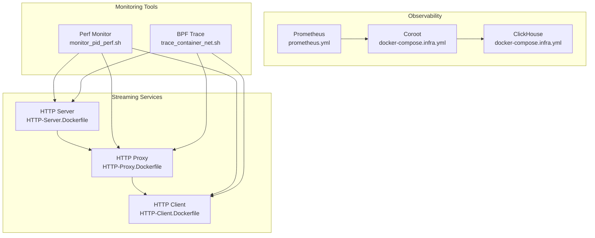
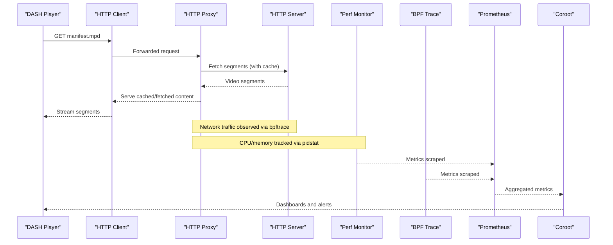
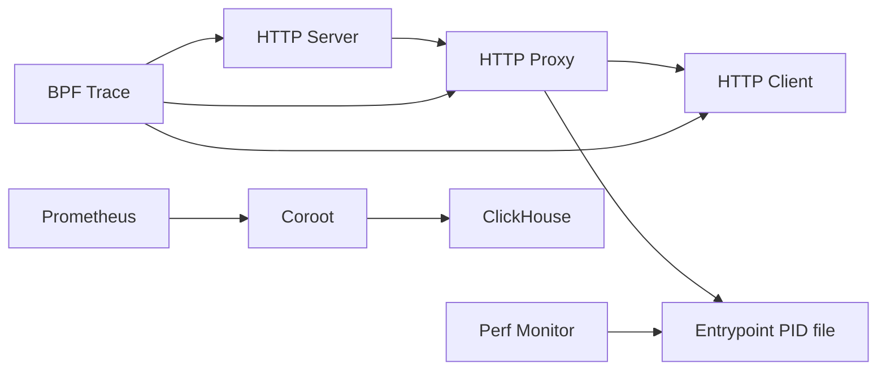

# Network Monitoring System

<cite>
**Referenced Files in This Document**
- [README.md](file://recent-dash/README.md)
- [docker-compose.yml](file://recent-dash/docker-compose.yml)
- [docker-compose.infra.yml](file://recent-dash/docker-compose.infra.yml)
- [prometheus.yml](file://recent-dash/prometheus.yml)
- [run_experiment.sh](file://recent-dash/run_experiment.sh)
- [entrypoint.sh](file://recent-dash/entrypoint.sh)
- [HTTP-Client.Dockerfile](file://recent-dash/HTTP-Client.Dockerfile)
- [HTTP-Client.launch.sh](file://recent-dash/HTTP-Client.launch.sh)
- [HTTP-Proxy.Dockerfile](file://recent-dash/HTTP-Proxy.Dockerfile)
- [HTTP-Proxy.launch.sh](file://recent-dash/HTTP-Proxy.launch.sh)
- [HTTP-Server.Dockerfile](file://recent-dash/HTTP-Server.Dockerfile)
- [HTTP-Server.launch.sh](file://recent-dash/HTTP-Server.launch.sh)
- [trace_container_net.sh](file://recent-dash/bpftrace-tracer/trace_container_net.sh)
- [monitor_pid_perf.sh](file://recent-dash/perf_monitor/monitor_pid_perf.sh)
</cite>

## Table of Contents
1. [Introduction](#introduction)
2. [Project Structure](#project-structure)
3. [Core Components](#core-components)
4. [Architecture Overview](#architecture-overview)
5. [Detailed Component Analysis](#detailed-component-analysis)
6. [Dependency Analysis](#dependency-analysis)
7. [Performance Considerations](#performance-considerations)
8. [Troubleshooting Guide](#troubleshooting-guide)
9. [Conclusion](#conclusion)
10. [Appendices](#appendices)

## Introduction
This document describes the recent-dash network monitoring system designed to track HTTP traffic and performance metrics across a DASH streaming pipeline. It explains BPF tracing capabilities for live network packet analysis, performance monitoring tools for CPU and memory metrics, and the HTTP proxy/client/server configuration. It also covers Docker-based deployment of the monitoring infrastructure, Prometheus metrics collection, and practical examples for latency and bandwidth analysis, along with troubleshooting distributed system performance issues.

## Project Structure
The recent-dash project organizes monitoring and streaming components into modular Docker services and supporting scripts:
- Streaming stack: HTTP server (CDN-like), HTTP proxy (with caching), and HTTP client (DASH player endpoint).
- Observability stack: Prometheus, Coroot, and ClickHouse for metrics and storage.
- Tracing and performance: bpftrace-based network tracer and pidstat-based performance monitor.

**Diagram sources**
- [docker-compose.yml:1-103](file://recent-dash/docker-compose.yml#L1-L103)
- [docker-compose.infra.yml:1-101](file://recent-dash/docker-compose.infra.yml#L1-L101)
- [prometheus.yml:1-23](file://recent-dash/prometheus.yml#L1-L23)
- [monitor_pid_perf.sh:1-72](file://recent-dash/perf_monitor/monitor_pid_perf.sh#L1-L72)
- [trace_container_net.sh:1-64](file://recent-dash/bpftrace-tracer/trace_container_net.sh#L1-L64)

**Section sources**
- [docker-compose.yml:1-103](file://recent-dash/docker-compose.yml#L1-L103)
- [docker-compose.infra.yml:1-101](file://recent-dash/docker-compose.infra.yml#L1-L101)
- [prometheus.yml:1-23](file://recent-dash/prometheus.yml#L1-L23)

## Core Components
- HTTP Server: Serves DASH video segments and manifests.
- HTTP Proxy: Acts as a caching proxy between client and server.
- HTTP Client: Exposes a DASH endpoint for players.
- Perf Monitor: Gathers CPU and memory metrics for monitored PIDs.
- BPF Trace: Captures per-interface RX/TX bytes via kernel tracepoints.
- Observability Stack: Prometheus scraping, Coroot for visualization, ClickHouse for storage.

Key runtime behaviors:
- Container startup and port exposure are orchestrated via Docker Compose.
- PID discovery and aggregation are handled by the perf monitor using a shared PID file.
- Network tracing writes periodic CSV outputs for downstream analysis.

**Section sources**
- [docker-compose.yml:1-103](file://recent-dash/docker-compose.yml#L1-L103)
- [entrypoint.sh:1-24](file://recent-dash/entrypoint.sh#L1-L24)
- [monitor_pid_perf.sh:1-72](file://recent-dash/perf_monitor/monitor_pid_perf.sh#L1-L72)
- [trace_container_net.sh:1-64](file://recent-dash/bpftrace-tracer/trace_container_net.sh#L1-L64)

## Architecture Overview
The system forms a three-tier streaming pipeline with integrated observability and tracing.

**Diagram sources**
- [docker-compose.yml:1-103](file://recent-dash/docker-compose.yml#L1-L103)
- [prometheus.yml:1-23](file://recent-dash/prometheus.yml#L1-L23)
- [monitor_pid_perf.sh:1-72](file://recent-dash/perf_monitor/monitor_pid_perf.sh#L1-L72)
- [trace_container_net.sh:1-64](file://recent-dash/bpftrace-tracer/trace_container_net.sh#L1-L64)

## Detailed Component Analysis

### HTTP Server
- Purpose: Hosts DASH segments and manifests.
- Configuration: Exposed on port 80; configurable via environment variables.
- Build: Clones the referenced repository and prepares binaries and public content.

Operational notes:
- Additional parameters can tune serving behavior.
- Public folder is mounted for serving content.

**Section sources**
- [HTTP-Server.Dockerfile:1-59](file://recent-dash/HTTP-Server.Dockerfile#L1-L59)
- [HTTP-Server.launch.sh:1-15](file://recent-dash/HTTP-Server.launch.sh#L1-L15)
- [docker-compose.yml:3-15](file://recent-dash/docker-compose.yml#L3-L15)

### HTTP Proxy
- Purpose: Caching proxy between client and server.
- Configuration: Accepts upstream server address/port and cache directory; supports additional parameters for cache policy and scheduling.
- Lifecycle: Entrypoint writes main and child PIDs to a shared location for monitoring.

Operational notes:
- Parameters include cache algorithm, rates, and queue sizes.
- PID file enables external performance monitoring.

**Section sources**
- [HTTP-Proxy.Dockerfile:1-49](file://recent-dash/HTTP-Proxy.Dockerfile#L1-L49)
- [HTTP-Proxy.launch.sh:1-20](file://recent-dash/HTTP-Proxy.launch.sh#L1-L20)
- [entrypoint.sh:1-24](file://recent-dash/entrypoint.sh#L1-L24)
- [docker-compose.yml:16-33](file://recent-dash/docker-compose.yml#L16-L33)

### HTTP Client
- Purpose: Exposes a DASH endpoint for clients (e.g., VLC).
- Configuration: Forwards requests to the configured proxy domain/port.
- Build: Copies the local binary and sets up a launch script.

Operational notes:
- Port mapping exposes the client service externally.
- Public folder is served as the DASH endpoint.

**Section sources**
- [HTTP-Client.Dockerfile:1-55](file://recent-dash/HTTP-Client.Dockerfile#L1-L55)
- [HTTP-Client.launch.sh:1-19](file://recent-dash/HTTP-Client.launch.sh#L1-L19)
- [docker-compose.yml:34-51](file://recent-dash/docker-compose.yml#L34-L51)

### Perf Monitor
- Purpose: Periodically aggregates CPU and memory metrics for a set of PIDs.
- Mechanism: Uses pidstat to sample at 1-second intervals; sums across PIDs and writes CSV with timestamp.
- Inputs: PID file path and output directory are configurable.

Operational notes:
- Continuously monitors until stopped.
- Produces a CSV suitable for correlation with network traces.

**Section sources**
- [monitor_pid_perf.sh:1-72](file://recent-dash/perf_monitor/monitor_pid_perf.sh#L1-L72)
- [docker-compose.yml:52-69](file://recent-dash/docker-compose.yml#L52-L69)

### BPF Trace (Network)
- Purpose: Captures per-interface RX/TX byte counters via kernel tracepoints.
- Mechanism: Generates a temporary bpftrace script, replaces placeholders, and streams CSV output with epoch-aligned timestamps.
- Inputs: Network interface name and debugfs/module paths are mounted.

Operational notes:
- Runs continuously until stopped.
- Outputs a CSV with timestamp and cumulative RX/TX bytes.

**Section sources**
- [trace_container_net.sh:1-64](file://recent-dash/bpftrace-tracer/trace_container_net.sh#L1-L64)
- [docker-compose.yml:70-98](file://recent-dash/docker-compose.yml#L70-L98)

### Observability Stack (Prometheus, Coroot, ClickHouse)
- Prometheus: Scrapes node and cluster agents, plus Coroot.
- Coroot: Provides dashboards and alerting, backed by ClickHouse.
- docker-compose.infra.yml defines volumes, ports, and service dependencies.

Operational notes:
- Prometheus configuration is mounted from prometheus.yml.
- Coroot bootstraps connections to Prometheus and ClickHouse.

**Section sources**
- [docker-compose.infra.yml:1-101](file://recent-dash/docker-compose.infra.yml#L1-L101)
- [prometheus.yml:1-23](file://recent-dash/prometheus.yml#L1-L23)

### Experiment Orchestration
- Purpose: Automates building, starting, measuring, and collecting artifacts from the monitoring stack.
- Features:
  - Measures container instantiation times.
  - Starts services in order and waits for readiness.
  - Copies performance and trace outputs to a dated results directory.
  - Collects container logs for diagnostics.

Operational notes:
- Results are organized under a timestamped directory with logs, traces, and perf outputs.
- Summarizes proxy parameters and machine characteristics.

**Section sources**
- [run_experiment.sh:1-286](file://recent-dash/run_experiment.sh#L1-L286)

## Dependency Analysis
The system exhibits clear service dependencies and shared resource usage:
- HTTP Client depends on HTTP Proxy.
- HTTP Proxy depends on HTTP Server.
- Perf Monitor and BPF Trace both rely on the host namespace and shared PID file.
- Observability services depend on each other and on Prometheus configuration.

**Diagram sources**
- [docker-compose.yml:1-103](file://recent-dash/docker-compose.yml#L1-L103)
- [docker-compose.infra.yml:1-101](file://recent-dash/docker-compose.infra.yml#L1-L101)
- [entrypoint.sh:1-24](file://recent-dash/entrypoint.sh#L1-L24)

**Section sources**
- [docker-compose.yml:1-103](file://recent-dash/docker-compose.yml#L1-L103)

## Performance Considerations
- Sampling cadence: Perf Monitor samples at 1-second intervals; adjust for overhead vs. resolution needs.
- BPF tracing overhead: Kernel tracepoints are lightweight but still introduce overhead; limit to necessary interfaces.
- Container isolation: Host PID and network modes enable precise monitoring but require elevated privileges.
- Disk I/O: Ensure sufficient disk space for CSV outputs and Prometheus/ClickHouse data retention.

[No sources needed since this section provides general guidance]

## Troubleshooting Guide
Common issues and remedies:
- Empty trace file: Verify bpftrace permissions and debugfs mounts; confirm the interface name matches the host.
- Missing PIDs: Ensure the proxy entrypoint writes the PID file and that the perf monitor can read it.
- Port conflicts: Check port mappings for client and observability services; update docker-compose if needed.
- Logs collection: Use the experiment script to gather logs from all services into the results directory.
- Connectivity: Confirm DNS resolution for domains and that HTTP_PROXY_DOMAIN/IP are correctly set.

**Section sources**
- [trace_container_net.sh:1-64](file://recent-dash/bpftrace-tracer/trace_container_net.sh#L1-L64)
- [monitor_pid_perf.sh:1-72](file://recent-dash/perf_monitor/monitor_pid_perf.sh#L1-L72)
- [run_experiment.sh:155-191](file://recent-dash/run_experiment.sh#L155-L191)

## Conclusion
The recent-dash monitoring system integrates a DASH streaming pipeline with BPF-based network tracing and pidstat-based performance monitoring, all orchestrated via Docker Compose and observable through Prometheus, Coroot, and ClickHouse. The provided scripts and configurations enable repeatable experiments, artifact collection, and actionable insights for latency and bandwidth analysis in distributed streaming environments.

[No sources needed since this section summarizes without analyzing specific files]

## Appendices

### Setup Procedures
- Build and start the streaming stack:
  - Build images and start services using the provided commands.
  - Connect a DASH client (e.g., VLC) to the client’s exposed port using the manifest URL.
- Start monitoring:
  - Launch perf monitor and bpftrace containers; verify CSV outputs appear in the designated directories.
- Collect and correlate data:
  - Use the experiment orchestration script to gather logs, traces, and performance metrics into a timestamped results directory.

**Section sources**
- [README.md:1-20](file://recent-dash/README.md#L1-L20)
- [run_experiment.sh:70-153](file://recent-dash/run_experiment.sh#L70-L153)

### Packet Capture with bpftrace
- Ensure host PID and network namespaces are accessible.
- Mount debugfs and kernel modules; specify the correct network interface.
- Observe CSV output containing timestamped RX/TX byte counts.

**Section sources**
- [docker-compose.yml:70-98](file://recent-dash/docker-compose.yml#L70-L98)
- [trace_container_net.sh:1-64](file://recent-dash/bpftrace-tracer/trace_container_net.sh#L1-L64)

### Real-Time Performance Monitoring
- Configure Prometheus to scrape node and cluster agents, plus Coroot.
- Use Coroot dashboards to visualize CPU, memory, and network metrics over time.

**Section sources**
- [docker-compose.infra.yml:1-101](file://recent-dash/docker-compose.infra.yml#L1-L101)
- [prometheus.yml:1-23](file://recent-dash/prometheus.yml#L1-L23)

### Examples

#### Network Latency Analysis
- Correlate DASH manifest fetch times with proxy cache hits/misses.
- Use trace CSV timestamps to align with client playback events and compute per-request latencies.

[No sources needed since this section provides general guidance]

#### Bandwidth Utilization Tracking
- Track RX/TX bytes per interval from the bpftrace output.
- Aggregate over time windows to estimate throughput and identify spikes.

[No sources needed since this section provides general guidance]

#### Troubleshooting Distributed System Performance Issues
- Compare CPU and memory usage from the perf monitor against network throughput.
- Inspect proxy logs and cache parameters to diagnose stalls or excessive misses.

**Section sources**
- [monitor_pid_perf.sh:1-72](file://recent-dash/perf_monitor/monitor_pid_perf.sh#L1-L72)
- [HTTP-Proxy.launch.sh:1-20](file://recent-dash/HTTP-Proxy.launch.sh#L1-L20)