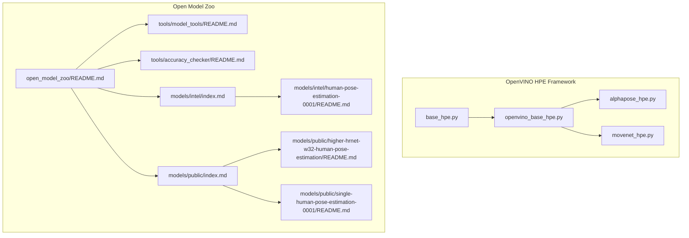
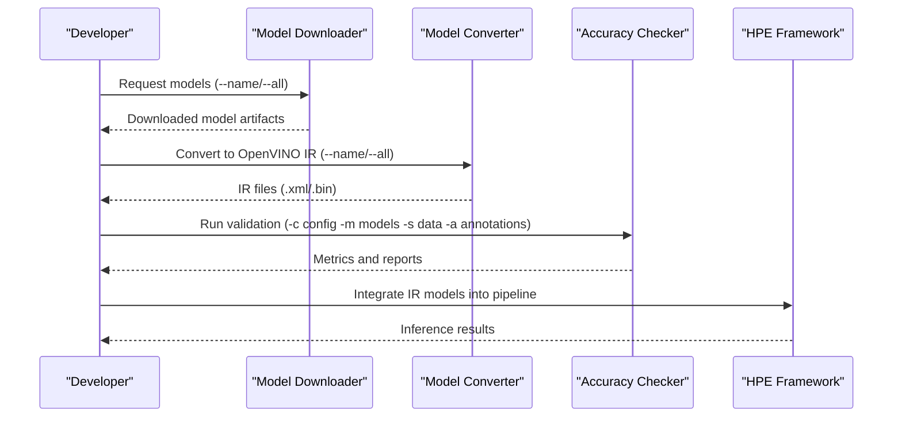
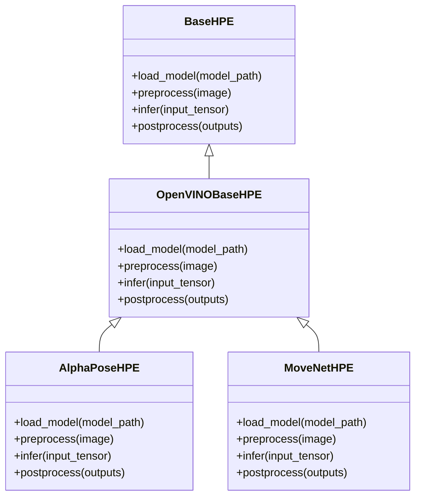
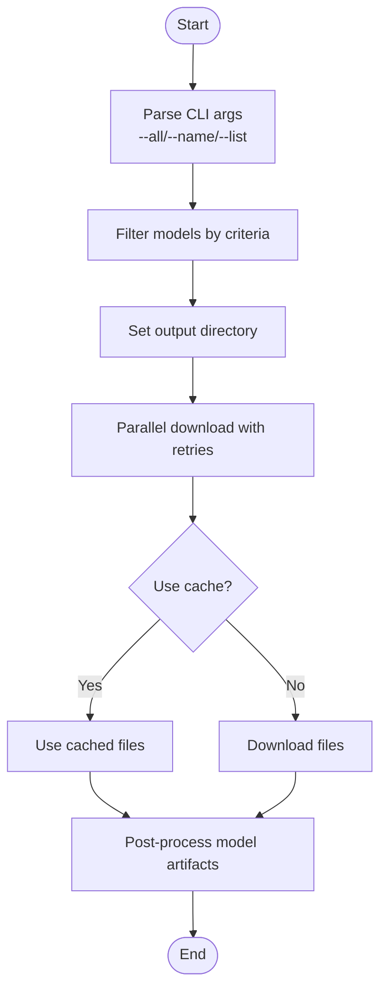
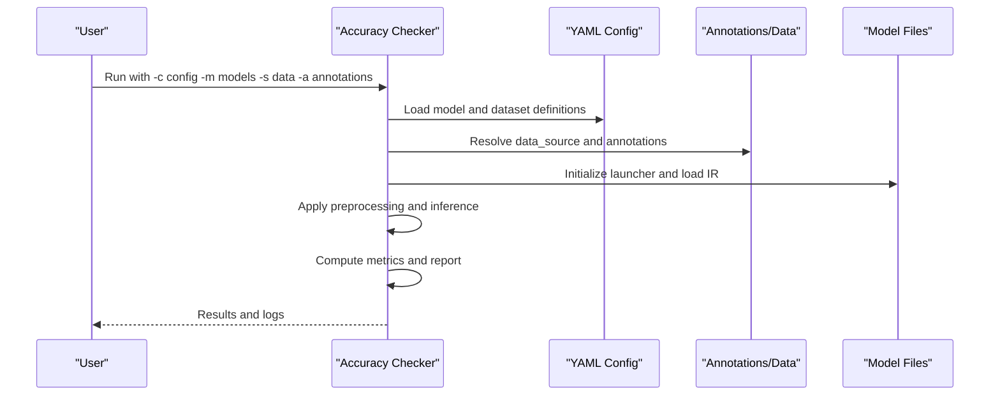
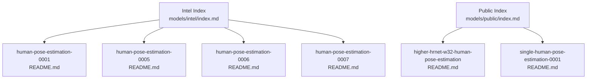
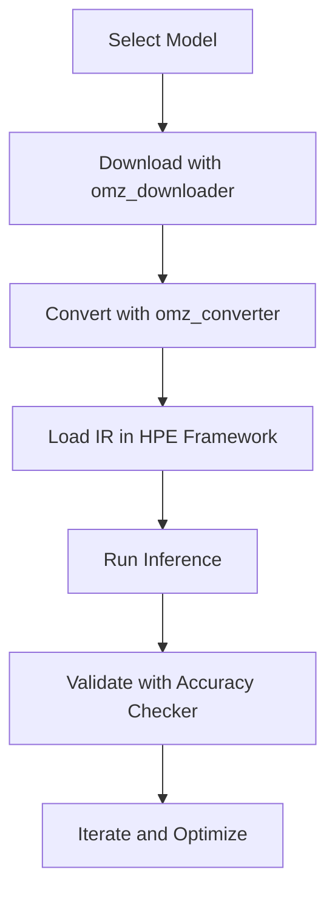
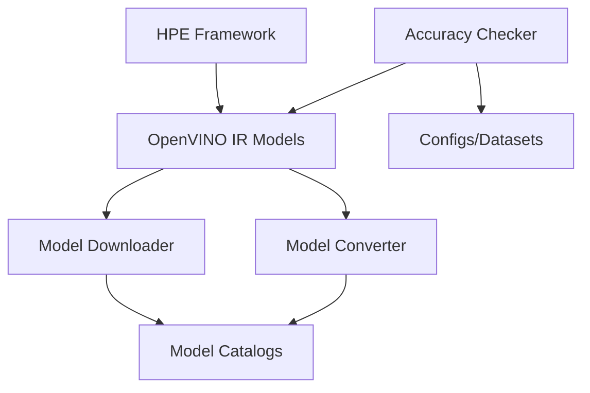

# Open Model Zoo Integration

<cite>
**Referenced Files in This Document**
- [README.md](file://open_model_zoo/README.md)
- [README.md](file://open_model_zoo/tools/model_tools/README.md)
- [README.md](file://open_model_zoo/tools/accuracy_checker/README.md)
- [README.md](file://open_model_zoo/models/intel/index.md)
- [README.md](file://open_model_zoo/models/public/index.md)
- [README.md](file://open_model_zoo/models/intel/human-pose-estimation-0001/README.md)
- [README.md](file://open_model_zoo/models/public/higher-hrnet-w32-human-pose-estimation/README.md)
- [README.md](file://open_model_zoo/models/public/single-human-pose-estimation-0001/README.md)
- [downloader.py](file://open_model_zoo/tools/model_tools/downloader.py)
- [main.py](file://open_model_zoo/tools/accuracy_checker/main.py)
- [base_hpe.py](file://base_hpe.py)
- [openvino_base_hpe.py](file://openvino_base_hpe.py)
- [alphapose_hpe.py](file://alphapose_hpe.py)
- [movenet_hpe.py](file://movenet_hpe.py)
- [simple_test.py](file://simple_test.py)
</cite>

## Table of Contents
1. [Introduction](#introduction)
2. [Project Structure](#project-structure)
3. [Core Components](#core-components)
4. [Architecture Overview](#architecture-overview)
5. [Detailed Component Analysis](#detailed-component-analysis)
6. [Dependency Analysis](#dependency-analysis)
7. [Performance Considerations](#performance-considerations)
8. [Troubleshooting Guide](#troubleshooting-guide)
9. [Conclusion](#conclusion)

## Introduction
This document explains how to integrate Open Model Zoo pre-trained models into the Human Pose Estimation (HPE) framework. It covers model downloader tools, pre-trained model access, accuracy checker utilities, and practical guidance for integrating Intel and public models with existing HPE implementations. It also documents model configuration, download procedures, compatibility requirements, and validation workflows to ensure quality and reproducibility.

## Project Structure
The repository organizes HPE-related components across three primary areas:
- OpenVINO-based HPE implementations and base classes
- Open Model Zoo pre-trained models (Intel and public)
- Quality assurance tools (model downloader and accuracy checker)

Key directories and files:
- OpenVINO HPE implementations: base classes and concrete estimators
- Open Model Zoo: pre-trained models, downloader/converter, and accuracy checker
- HPE framework entry points and utilities

**Diagram sources**
- [README.md:1-63](file://open_model_zoo/README.md#L1-L63)
- [README.md:1-387](file://open_model_zoo/tools/model_tools/README.md#L1-L387)
- [README.md:1-368](file://open_model_zoo/tools/accuracy_checker/README.md#L1-L368)
- [README.md:1-525](file://open_model_zoo/models/intel/index.md#L1-L525)
- [README.md:1-500](file://open_model_zoo/models/public/index.md#L1-L500)
- [README.md:1-54](file://open_model_zoo/models/intel/human-pose-estimation-0001/README.md#L1-L54)
- [README.md:1-108](file://open_model_zoo/models/public/higher-hrnet-w32-human-pose-estimation/README.md#L1-L108)
- [README.md:1-76](file://open_model_zoo/models/public/single-human-pose-estimation-0001/README.md#L1-L76)

**Section sources**
- [README.md:1-63](file://open_model_zoo/README.md#L1-L63)
- [README.md:1-387](file://open_model_zoo/tools/model_tools/README.md#L1-L387)
- [README.md:1-368](file://open_model_zoo/tools/accuracy_checker/README.md#L1-L368)
- [README.md:1-525](file://open_model_zoo/models/intel/index.md#L1-L525)
- [README.md:1-500](file://open_model_zoo/models/public/index.md#L1-L500)

## Core Components
- OpenVINO HPE implementations: provide base classes and concrete estimators for OpenVINO-backed inference.
- Open Model Zoo downloader/converter: automates downloading and converting models to OpenVINO IR format.
- Accuracy Checker: validates model accuracy using standardized configuration files and datasets.

Integration highlights:
- Use the downloader to fetch models from Intel or public catalogs.
- Convert models to OpenVINO IR using the converter for optimal performance.
- Validate models using the accuracy checker with predefined configurations.

**Section sources**
- [README.md:10-16](file://open_model_zoo/README.md#L10-L16)
- [README.md:1-28](file://open_model_zoo/tools/model_tools/README.md#L1-L28)
- [README.md:1-29](file://open_model_zoo/tools/accuracy_checker/README.md#L1-L29)

## Architecture Overview
The integration architecture connects the HPE framework with Open Model Zoo resources through a clear pipeline: model discovery and acquisition, conversion to OpenVINO IR, and validation using the accuracy checker.

**Diagram sources**
- [README.md:78-221](file://open_model_zoo/tools/model_tools/README.md#L78-L221)
- [README.md:129-169](file://open_model_zoo/tools/accuracy_checker/README.md#L129-L169)
- [README.md:10-16](file://open_model_zoo/README.md#L10-L16)

## Detailed Component Analysis

### OpenVINO HPE Framework
The HPE framework provides base abstractions and concrete implementations for OpenVINO-based inference. The base classes define the interface for model loading, preprocessing, inference, and postprocessing, while concrete implementations plug in specific model backends.

**Diagram sources**
- [base_hpe.py](file://base_hpe.py)
- [openvino_base_hpe.py](file://openvino_base_hpe.py)
- [alphapose_hpe.py](file://alphapose_hpe.py)
- [movenet_hpe.py](file://movenet_hpe.py)

**Section sources**
- [base_hpe.py](file://base_hpe.py)
- [openvino_base_hpe.py](file://openvino_base_hpe.py)
- [alphapose_hpe.py](file://alphapose_hpe.py)
- [movenet_hpe.py](file://movenet_hpe.py)

### Model Downloader Tools
The model downloader automates fetching models from the Open Model Zoo catalogs and prepares them for conversion. It supports filtering by model names, caching, parallel downloads, and progress reporting.

Key capabilities:
- Download all models or filter by name/list
- Configure output directory, precision selection, retry attempts, and concurrency
- Emit structured progress events for automation

**Diagram sources**
- [README.md:78-115](file://open_model_zoo/tools/model_tools/README.md#L78-L115)
- [README.md:116-164](file://open_model_zoo/tools/model_tools/README.md#L116-L164)

**Section sources**
- [README.md:1-387](file://open_model_zoo/tools/model_tools/README.md#L1-L387)
- [downloader.py:1-27](file://open_model_zoo/tools/model_tools/downloader.py#L1-L27)

### Accuracy Checker Utilities
The accuracy checker provides a modular framework for validating models across datasets and metrics. It supports multiple backends (OpenVINO, TensorFlow, PyTorch, etc.) and offers extensive configuration options for preprocessing, metrics, and evaluation modes.

Key capabilities:
- Define per-model configurations and global definitions
- Configure launchers for different frameworks
- Evaluate on standard datasets with preprocessing and postprocessing
- Report metrics and support subset evaluation

**Diagram sources**
- [README.md:129-169](file://open_model_zoo/tools/accuracy_checker/README.md#L129-L169)
- [README.md:170-270](file://open_model_zoo/tools/accuracy_checker/README.md#L170-L270)
- [main.py](file://open_model_zoo/tools/accuracy_checker/main.py)

**Section sources**
- [README.md:1-368](file://open_model_zoo/tools/accuracy_checker/README.md#L1-L368)
- [main.py](file://open_model_zoo/tools/accuracy_checker/main.py)

### Pre-trained Models Catalogs
Open Model Zoo provides curated catalogs of Intel and public pre-trained models. For human pose estimation, both catalogs include relevant models with specifications, inputs/outputs, and demo usage.

Intel catalog highlights:
- human-pose-estimation-0001: Multi-person 2D pose estimation with MobileNet backbone
- human-pose-estimation-0005/0006/0007: Various precisions and variants

Public catalog highlights:
- higher-hrnet-w32-human-pose-estimation: Bottom-up approach with HRNet backbone
- single-human-pose-estimation-0001: Single-person pose estimation

**Diagram sources**
- [README.md:42-45](file://open_model_zoo/models/intel/index.md#L42-L45)
- [README.md:288-292](file://open_model_zoo/models/public/index.md#L288-L292)
- [README.md:1-54](file://open_model_zoo/models/intel/human-pose-estimation-0001/README.md#L1-L54)
- [README.md:1-108](file://open_model_zoo/models/public/higher-hrnet-w32-human-pose-estimation/README.md#L1-L108)
- [README.md:1-76](file://open_model_zoo/models/public/single-human-pose-estimation-0001/README.md#L1-L76)

**Section sources**
- [README.md:1-525](file://open_model_zoo/models/intel/index.md#L1-L525)
- [README.md:1-500](file://open_model_zoo/models/public/index.md#L1-L500)
- [README.md:1-54](file://open_model_zoo/models/intel/human-pose-estimation-0001/README.md#L1-L54)
- [README.md:1-108](file://open_model_zoo/models/public/higher-hrnet-w32-human-pose-estimation/README.md#L1-L108)
- [README.md:1-76](file://open_model_zoo/models/public/single-human-pose-estimation-0001/README.md#L1-L76)

### Integration Examples
Integrating specific models involves:
1. Downloading the model using the downloader
2. Converting to OpenVINO IR using the converter
3. Loading the IR in the HPE framework
4. Validating with the accuracy checker

Example workflows:
- Intel human-pose-estimation-0001: Use the downloader to fetch the model, convert to IR, and integrate into OpenVINO-based HPE pipelines.
- Public higher-hrnet-w32-human-pose-estimation: Download and convert; validate using accuracy checker configurations aligned with COCO metrics.
- Public single-human-pose-estimation-0001: Download and convert; validate with appropriate preprocessing and metrics.

**Diagram sources**
- [README.md:78-221](file://open_model_zoo/tools/model_tools/README.md#L78-L221)
- [README.md:129-169](file://open_model_zoo/tools/accuracy_checker/README.md#L129-L169)
- [README.md:59-72](file://open_model_zoo/models/intel/human-pose-estimation-0001/README.md#L59-L72)
- [README.md:59-72](file://open_model_zoo/models/public/higher-hrnet-w32-human-pose-estimation/README.md#L59-L72)
- [README.md:50-63](file://open_model_zoo/models/public/single-human-pose-estimation-0001/README.md#L50-L63)

**Section sources**
- [README.md:1-387](file://open_model_zoo/tools/model_tools/README.md#L1-L387)
- [README.md:1-368](file://open_model_zoo/tools/accuracy_checker/README.md#L1-L368)
- [README.md:1-76](file://open_model_zoo/models/intel/human-pose-estimation-0001/README.md#L1-L76)
- [README.md:1-108](file://open_model_zoo/models/public/higher-hrnet-w32-human-pose-estimation/README.md#L1-L108)
- [README.md:1-76](file://open_model_zoo/models/public/single-human-pose-estimation-0001/README.md#L1-L76)

## Dependency Analysis
The integration relies on explicit dependencies between components:
- HPE framework depends on OpenVINO IR models produced by the downloader/converter
- Accuracy checker depends on model configurations and datasets
- Model catalogs provide metadata and specifications for compatibility

**Diagram sources**
- [README.md:1-387](file://open_model_zoo/tools/model_tools/README.md#L1-L387)
- [README.md:1-368](file://open_model_zoo/tools/accuracy_checker/README.md#L1-L368)
- [README.md:10-16](file://open_model_zoo/README.md#L10-L16)

**Section sources**
- [README.md:1-387](file://open_model_zoo/tools/model_tools/README.md#L1-L387)
- [README.md:1-368](file://open_model_zoo/tools/accuracy_checker/README.md#L1-L368)
- [README.md:1-63](file://open_model_zoo/README.md#L1-L63)

## Performance Considerations
- Use appropriate precisions (FP32/FP16) based on hardware capabilities and accuracy requirements
- Enable parallel downloads and conversions to reduce iteration time
- Validate on representative datasets to ensure real-world performance alignment
- Monitor inference throughput and latency using framework utilities

## Troubleshooting Guide
Common issues and resolutions:
- Model conversion failures: Ensure Model Optimizer is available and environment variables are configured
- Accuracy checker errors: Verify dataset paths, annotation formats, and configuration file syntax
- Download interruptions: Increase retry attempts and use caching to avoid re-downloads
- Framework integration: Confirm IR file compatibility and input/output shapes match model specifications

**Section sources**
- [README.md:204-221](file://open_model_zoo/tools/model_tools/README.md#L204-L221)
- [README.md:99-113](file://open_model_zoo/tools/accuracy_checker/README.md#L99-L113)
- [README.md:100-105](file://open_model_zoo/tools/model_tools/README.md#L100-L105)

## Conclusion
Open Model Zoo provides a comprehensive ecosystem for acquiring, converting, and validating pre-trained models for Human Pose Estimation. By leveraging the downloader, converter, and accuracy checker, developers can efficiently integrate Intel and public models into OpenVINO-based HPE pipelines, ensuring reproducible quality and performance.