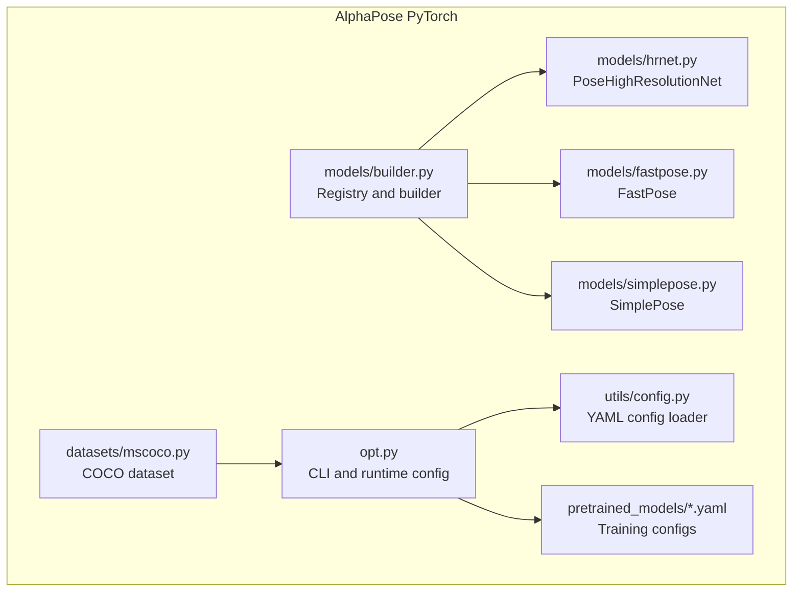
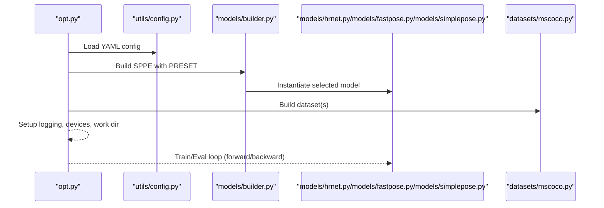
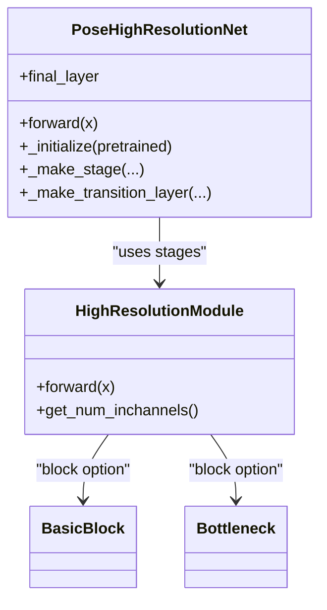
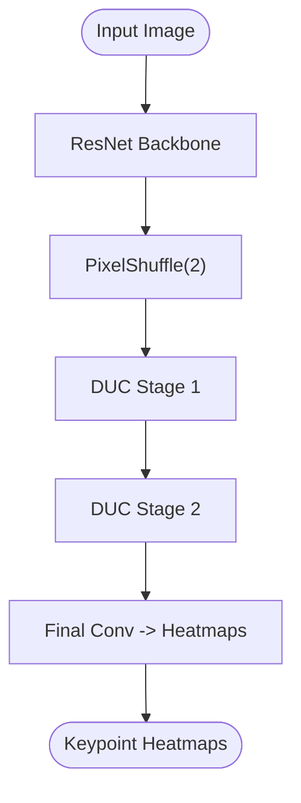
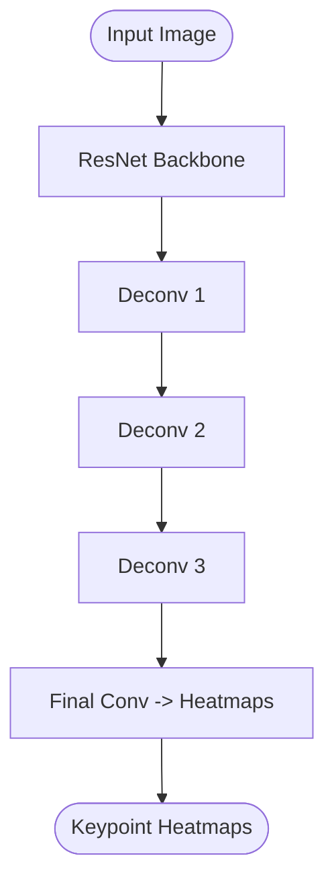
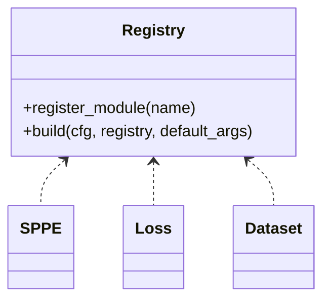
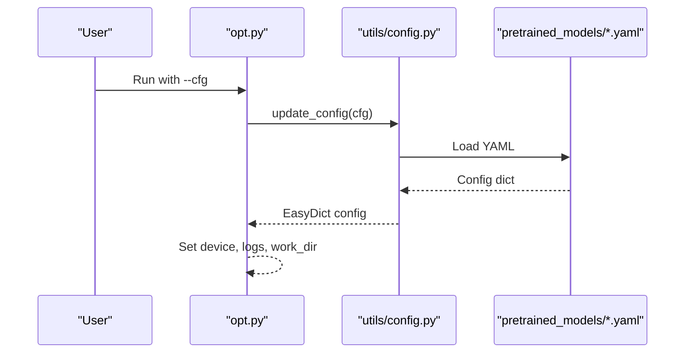
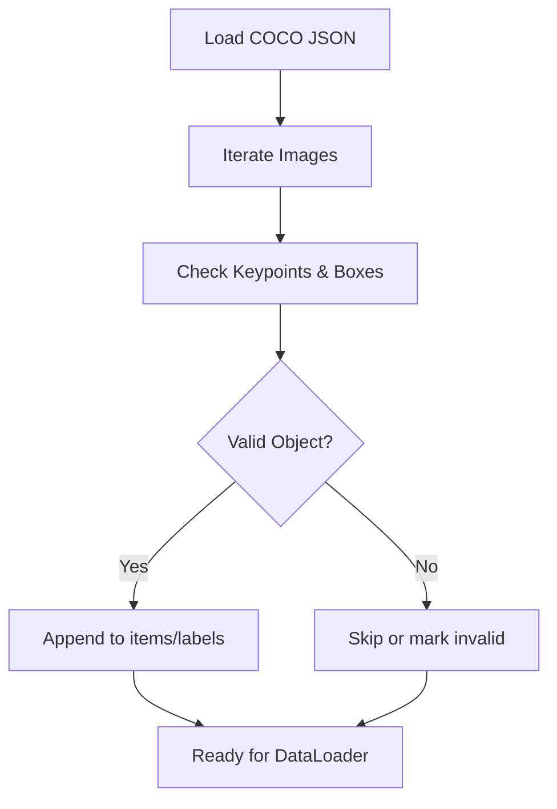
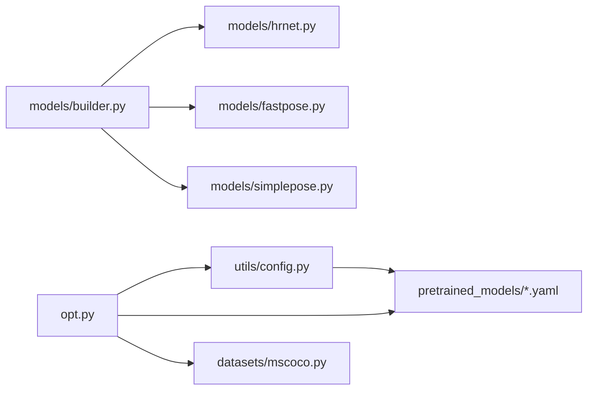

# AlphaPose Implementation

<cite>
**Referenced Files in This Document**
- [hrnet.py](file://models/AlphaPose/alphapose/models/hrnet.py)
- [fastpose.py](file://models/AlphaPose/alphapose/models/fastpose.py)
- [simplepose.py](file://models/AlphaPose/alphapose/models/simplepose.py)
- [builder.py](file://models/AlphaPose/alphapose/models/builder.py)
- [256x192_res50_lr1e-3_1x.yaml](file://models/AlphaPose/pretrained_models/256x192_res50_lr1e-3_1x.yaml)
- [config.py](file://models/AlphaPose/alphapose/utils/config.py)
- [mscoco.py](file://models/AlphaPose/alphapose/datasets/mscoco.py)
- [opt.py](file://models/AlphaPose/alphapose/opt.py)
- [__init__.py](file://models/AlphaPose/alphapose/__init__.py)
- [version.py](file://models/AlphaPose/alphapose/version.py)
</cite>

## Table of Contents
1. [Introduction](#introduction)
2. [Project Structure](#project-structure)
3. [Core Components](#core-components)
4. [Architecture Overview](#architecture-overview)
5. [Detailed Component Analysis](#detailed-component-analysis)
6. [Dependency Analysis](#dependency-analysis)
7. [Performance Considerations](#performance-considerations)
8. [Troubleshooting Guide](#troubleshooting-guide)
9. [Conclusion](#conclusion)
10. [Appendices](#appendices)

## Introduction
This document explains the AlphaPose PyTorch implementation with a focus on the HRNet-based architecture, its high-accuracy pose estimation capabilities, and practical deployment considerations. It covers model initialization, checkpoint loading, integration with the AlphaPose framework, input preprocessing, batch processing, output formats, configuration options for different AlphaPose variants (FastPose, SimplePose), and performance optimization techniques. Examples of training and inference are provided via configuration-driven workflows, and guidance is included for memory and GPU utilization in high-precision scenarios.

## Project Structure
The AlphaPose implementation resides under models/AlphaPose/alphapose. Key areas:
- models: Model definitions (HRNet, FastPose, SimplePose) and builder for registry-based instantiation
- datasets: Dataset loaders (e.g., MSCOCO) and utilities
- utils: Configuration loader, presets, transforms, logging, and other helpers
- opt.py: Command-line argument parsing and runtime configuration assembly
- pretrained_models: Example YAML configurations for training and evaluation

**Diagram sources**
- [builder.py:1-47](file://models/AlphaPose/alphapose/models/builder.py#L1-L47)
- [hrnet.py:269-495](file://models/AlphaPose/alphapose/models/hrnet.py#L269-L495)
- [fastpose.py:1-68](file://models/AlphaPose/alphapose/models/fastpose.py#L1-L68)
- [simplepose.py:1-87](file://models/AlphaPose/alphapose/models/simplepose.py#L1-L87)
- [mscoco.py:1-141](file://models/AlphaPose/alphapose/datasets/mscoco.py#L1-L141)
- [config.py:1-9](file://models/AlphaPose/alphapose/utils/config.py#L1-L9)
- [opt.py:1-88](file://models/AlphaPose/alphapose/opt.py#L1-L88)
- [256x192_res50_lr1e-3_1x.yaml:1-66](file://models/AlphaPose/pretrained_models/256x192_res50_lr1e-3_1x.yaml#L1-L66)

**Section sources**
- [__init__.py:1-4](file://models/AlphaPose/alphapose/__init__.py#L1-L4)
- [version.py:1-6](file://models/AlphaPose/alphapose/version.py#L1-L6)

## Core Components
- HRNet backbone: Multi-scale high-resolution module with stage-wise transitions and fused feature maps, producing heatmaps for keypoints.
- FastPose: ResNet backbone with Deconvolution Upsampling (DUC) and configurable channel dimensions for speed/accuracy trade-offs.
- SimplePose: ResNet backbone with transposed convolutions for deconvolution layers and a final heatmap head.
- Builder and Registry: Centralized factory for SPPE (pose estimation), dataset, and loss modules.
- Configuration: YAML-based experiment configuration with dataset, model, detector, and training parameters.
- Dataset: MSCOCO dataset loader with bounding boxes and keypoints, plus filtering and validation logic.
- CLI and runtime: Argument parsing, work directory setup, logging, and device selection.

**Section sources**
- [hrnet.py:269-495](file://models/AlphaPose/alphapose/models/hrnet.py#L269-L495)
- [fastpose.py:1-68](file://models/AlphaPose/alphapose/models/fastpose.py#L1-L68)
- [simplepose.py:1-87](file://models/AlphaPose/alphapose/models/simplepose.py#L1-L87)
- [builder.py:1-47](file://models/AlphaPose/alphapose/models/builder.py#L1-L47)
- [config.py:1-9](file://models/AlphaPose/alphapose/utils/config.py#L1-L9)
- [mscoco.py:1-141](file://models/AlphaPose/alphapose/datasets/mscoco.py#L1-L141)
- [opt.py:1-88](file://models/AlphaPose/alphapose/opt.py#L1-L88)

## Architecture Overview
AlphaPose composes a pose estimation network (SPPE) from a registry, loads configuration from YAML, builds datasets and detectors, and runs training/inference loops. The SPPE can be HRNet, FastPose, or SimplePose depending on configuration.

**Diagram sources**
- [opt.py:14-88](file://models/AlphaPose/alphapose/opt.py#L14-L88)
- [config.py:5-9](file://models/AlphaPose/alphapose/utils/config.py#L5-L9)
- [builder.py:21-27](file://models/AlphaPose/alphapose/models/builder.py#L21-L27)
- [hrnet.py:488-495](file://models/AlphaPose/alphapose/models/hrnet.py#L488-L495)
- [fastpose.py:13-18](file://models/AlphaPose/alphapose/models/fastpose.py#L13-L18)
- [simplepose.py:12-18](file://models/AlphaPose/alphapose/models/simplepose.py#L12-L18)
- [mscoco.py:17-35](file://models/AlphaPose/alphapose/datasets/mscoco.py#L17-L35)

## Detailed Component Analysis

### HRNet PoseHighResolutionNet
- Multi-stage high-resolution representation learning with configurable blocks (Basic/Bottleneck) and channels.
- Transition layers scale features across branches; fusion layers combine multi-resolution features.
- Final heatmap layer maps to number of joints defined in preset.
- Initialization supports loading pretrained weights selectively by layer names.

**Diagram sources**
- [hrnet.py:98-261](file://models/AlphaPose/alphapose/models/hrnet.py#L98-L261)
- [hrnet.py:269-456](file://models/AlphaPose/alphapose/models/hrnet.py#L269-L456)

**Section sources**
- [hrnet.py:269-495](file://models/AlphaPose/alphapose/models/hrnet.py#L269-L495)

### FastPose
- ResNet backbone initialized from ImageNet weights.
- PixelShuffle upsampling followed by DUC layers to increase spatial resolution.
- Final convolution produces joint heatmaps.

**Diagram sources**
- [fastpose.py:51-58](file://models/AlphaPose/alphapose/models/fastpose.py#L51-L58)

**Section sources**
- [fastpose.py:1-68](file://models/AlphaPose/alphapose/models/fastpose.py#L1-L68)

### SimplePose
- ResNet backbone initialized from ImageNet weights.
- Three transposed convolution deconvolution layers to upsample features.
- Final 1x1 convolution produces heatmaps.

**Diagram sources**
- [simplepose.py:82-86](file://models/AlphaPose/alphapose/models/simplepose.py#L82-L86)

**Section sources**
- [simplepose.py:1-87](file://models/AlphaPose/alphapose/models/simplepose.py#L1-L87)

### Builder and Registry
- SPPE registry registers model classes; build_sppe constructs models with PRESET injected.
- Similar pattern for datasets and losses.

**Diagram sources**
- [builder.py:6-18](file://models/AlphaPose/alphapose/models/builder.py#L6-L18)

**Section sources**
- [builder.py:1-47](file://models/AlphaPose/alphapose/models/builder.py#L1-L47)

### Configuration and CLI
- YAML config loader updates global config from file.
- CLI parses arguments, sets world size, device, work directory, and logging handlers.
- Example training config demonstrates dataset, model, detector, and training hyperparameters.

**Diagram sources**
- [opt.py:14-66](file://models/AlphaPose/alphapose/opt.py#L14-L66)
- [config.py:5-9](file://models/AlphaPose/alphapose/utils/config.py#L5-L9)
- [256x192_res50_lr1e-3_1x.yaml:1-66](file://models/AlphaPose/pretrained_models/256x192_res50_lr1e-3_1x.yaml#L1-L66)

**Section sources**
- [opt.py:1-88](file://models/AlphaPose/alphapose/opt.py#L1-L88)
- [config.py:1-9](file://models/AlphaPose/alphapose/utils/config.py#L1-L9)
- [256x192_res50_lr1e-3_1x.yaml:1-66](file://models/AlphaPose/pretrained_models/256x192_res50_lr1e-3_1x.yaml#L1-L66)

### Dataset: MSCOCO
- Loads annotations, filters invalid entries, computes centers, and prepares labels for training/validation.
- Supports evaluation joints and visibility checks.

**Diagram sources**
- [mscoco.py:37-127](file://models/AlphaPose/alphapose/datasets/mscoco.py#L37-L127)

**Section sources**
- [mscoco.py:1-141](file://models/AlphaPose/alphapose/datasets/mscoco.py#L1-L141)

## Dependency Analysis
- SPPE registry depends on builder and model modules; models depend on torch.nn and registry decorators.
- CLI depends on YAML config loader and torch for device selection.
- Dataset modules depend on model registries and bbox utilities.

**Diagram sources**
- [opt.py:14-66](file://models/AlphaPose/alphapose/opt.py#L14-L66)
- [config.py:5-9](file://models/AlphaPose/alphapose/utils/config.py#L5-L9)
- [builder.py:1-47](file://models/AlphaPose/alphapose/models/builder.py#L1-L47)
- [hrnet.py:269-495](file://models/AlphaPose/alphapose/models/hrnet.py#L269-L495)
- [fastpose.py:1-68](file://models/AlphaPose/alphapose/models/fastpose.py#L1-L68)
- [simplepose.py:1-87](file://models/AlphaPose/alphapose/models/simplepose.py#L1-L87)
- [mscoco.py:1-141](file://models/AlphaPose/alphapose/datasets/mscoco.py#L1-L141)

**Section sources**
- [builder.py:1-47](file://models/AlphaPose/alphapose/models/builder.py#L1-L47)
- [opt.py:1-88](file://models/AlphaPose/alphapose/opt.py#L1-L88)

## Performance Considerations
- Model selection:
  - HRNet: Highest accuracy, larger memory footprint, suitable for precision-critical tasks.
  - FastPose: Faster, lower memory, configurable channels; good balance for throughput.
  - SimplePose: Simpler deconvolution path; moderate accuracy and speed.
- Input size and batch size:
  - Image size and batch size are configured in YAML; larger sizes increase memory and compute.
- Pretrained initialization:
  - HRNet supports selective loading of pretrained layers; ensure layer names match to avoid missing keys.
- Mixed precision and distributed training:
  - CLI supports distributed launchers and optional Sync BatchNorm; enable for multi-GPU scaling.
- Detector integration:
  - Detector name and weights are configurable; choose a detector that matches your latency/accuracy needs.

[No sources needed since this section provides general guidance]

## Troubleshooting Guide
- Missing pretrained file path:
  - HRNet initialization raises an explicit error if the path does not exist; verify the PRETRAINED setting in the model section.
- Incompatible dataset categories:
  - MSCOCO dataset asserts class names; mismatch leads to assertion failure; ensure dataset type and annotations align.
- Logging and experiment directories:
  - CLI creates work directories and attaches file/stream handlers; check logs for epoch metrics and errors.

**Section sources**
- [hrnet.py:475-485](file://models/AlphaPose/alphapose/models/hrnet.py#L475-L485)
- [mscoco.py:44-44](file://models/AlphaPose/alphapose/datasets/mscoco.py#L44-L44)
- [opt.py:65-75](file://models/AlphaPose/alphapose/opt.py#L65-L75)

## Conclusion
AlphaPose’s PyTorch implementation offers flexible, registry-driven pose estimation with strong defaults. HRNet delivers high accuracy, while FastPose and SimplePose provide alternatives for speed and simplicity. Configuration-driven training and evaluation, combined with dataset and detector integrations, enable robust deployment. For high-precision applications, leverage HRNet, appropriate input sizing, and careful checkpoint loading; for throughput, consider FastPose or SimplePose with optimized batch sizes and detectors.

[No sources needed since this section summarizes without analyzing specific files]

## Appendices

### Configuration Options for AlphaPose Variants
- Model type selection:
  - HRNet: STAGE configurations define branches, blocks, channels, and modules.
  - FastPose: NUM_LAYERS selects ResNet backbone; CONV_DIM controls DUC channel depth.
  - SimplePose: NUM_LAYERS selects ResNet backbone; NUM_DECONV_FILTERS defines deconvolution channels.
- Dataset:
  - MSCOCO with train/val/test splits and annotations; supports flipping, rotation, scaling augmentations.
- Detector:
  - YOLO configuration and weights are configurable; adjust confidence and NMS thresholds.
- Training:
  - Optimizer, learning rate schedule, milestones, and snapshot frequency are configurable.

**Section sources**
- [256x192_res50_lr1e-3_1x.yaml:1-66](file://models/AlphaPose/pretrained_models/256x192_res50_lr1e-3_1x.yaml#L1-L66)
- [mscoco.py:17-35](file://models/AlphaPose/alphapose/datasets/mscoco.py#L17-L35)
- [opt.py:14-51](file://models/AlphaPose/alphapose/opt.py#L14-L51)

### Model Initialization and Checkpoint Loading
- HRNet:
  - Selectively loads pretrained layers based on configured layer names; strict loading disabled to allow partial matches.
- FastPose/SimplePose:
  - Initialize ImageNet ResNet backbones and merge pretrained weights by matching keys and shapes.

**Section sources**
- [hrnet.py:458-486](file://models/AlphaPose/alphapose/models/hrnet.py#L458-L486)
- [fastpose.py:32-40](file://models/AlphaPose/alphapose/models/fastpose.py#L32-L40)
- [simplepose.py:22-31](file://models/AlphaPose/alphapose/models/simplepose.py#L22-L31)

### Input Preprocessing and Output Formats
- Input preprocessing:
  - Dataset presets define image size and heatmap size; augmentations include flip, rotation, and scale.
- Output format:
  - Models produce heatmaps sized according to preset; post-processing converts heatmaps to joint coordinates and scores.

**Section sources**
- [256x192_res50_lr1e-3_1x.yaml:24-33](file://models/AlphaPose/pretrained_models/256x192_res50_lr1e-3_1x.yaml#L24-L33)
- [mscoco.py:31-35](file://models/AlphaPose/alphapose/datasets/mscoco.py#L31-L35)

### Training and Inference Execution Examples
- Training:
  - Run CLI with --cfg pointing to a YAML; CLI loads config, sets device/log/work_dir, and starts training loop.
- Inference:
  - Use the built SPPE model with loaded weights; feed batches of normalized images; collect heatmaps and decode joints.

**Section sources**
- [opt.py:14-66](file://models/AlphaPose/alphapose/opt.py#L14-L66)
- [builder.py:21-27](file://models/AlphaPose/alphapose/models/builder.py#L21-L27)

### Memory and GPU Utilization
- Memory:
  - Larger input sizes and batch sizes increase memory; HRNet typically requires more memory than FastPose/SimplePose.
- GPU:
  - CLI detects available GPUs and sets device; distributed training can utilize multiple GPUs with proper launcher selection.

**Section sources**
- [opt.py:60-63](file://models/AlphaPose/alphapose/opt.py#L60-L63)