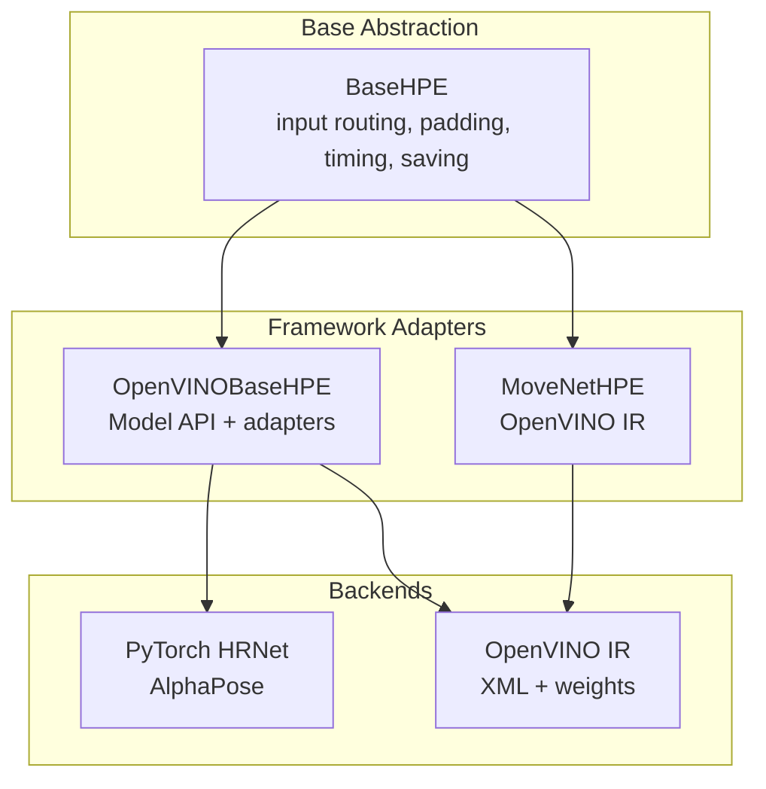
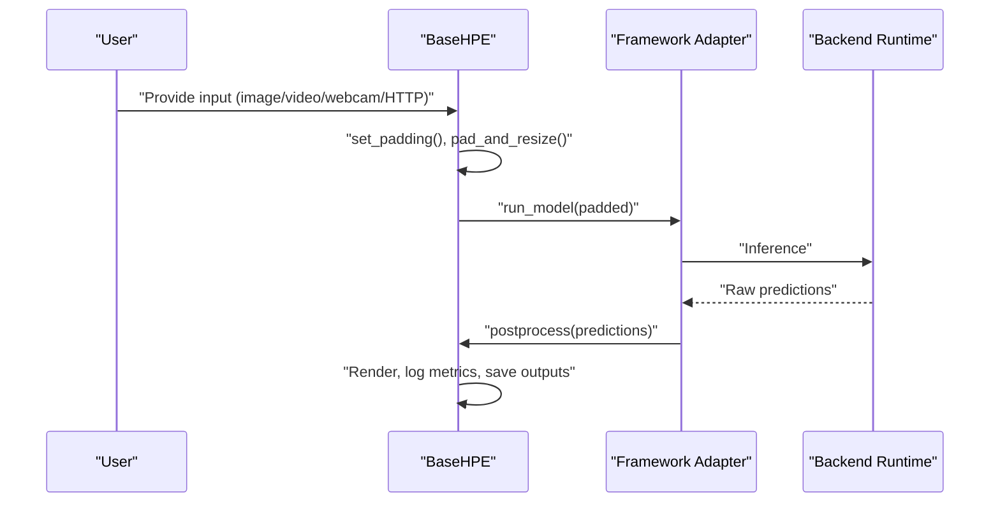
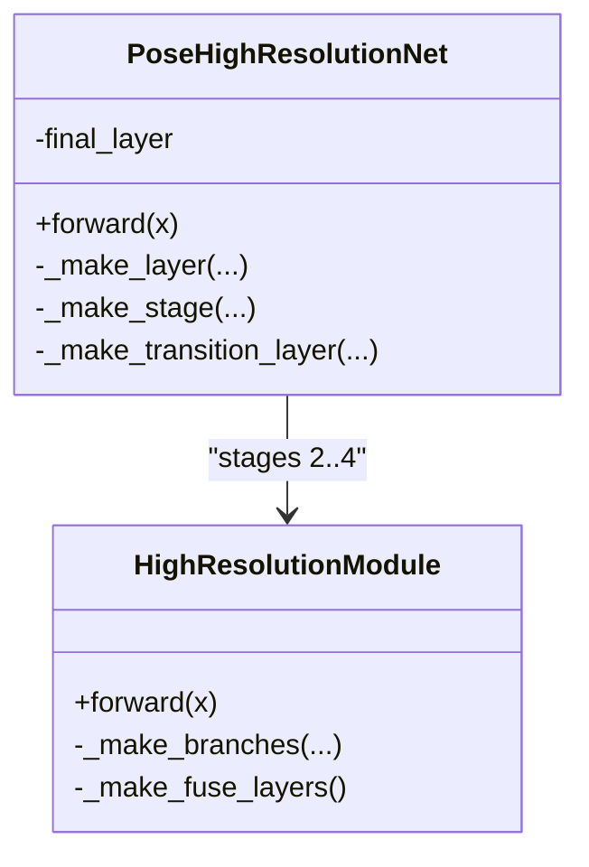
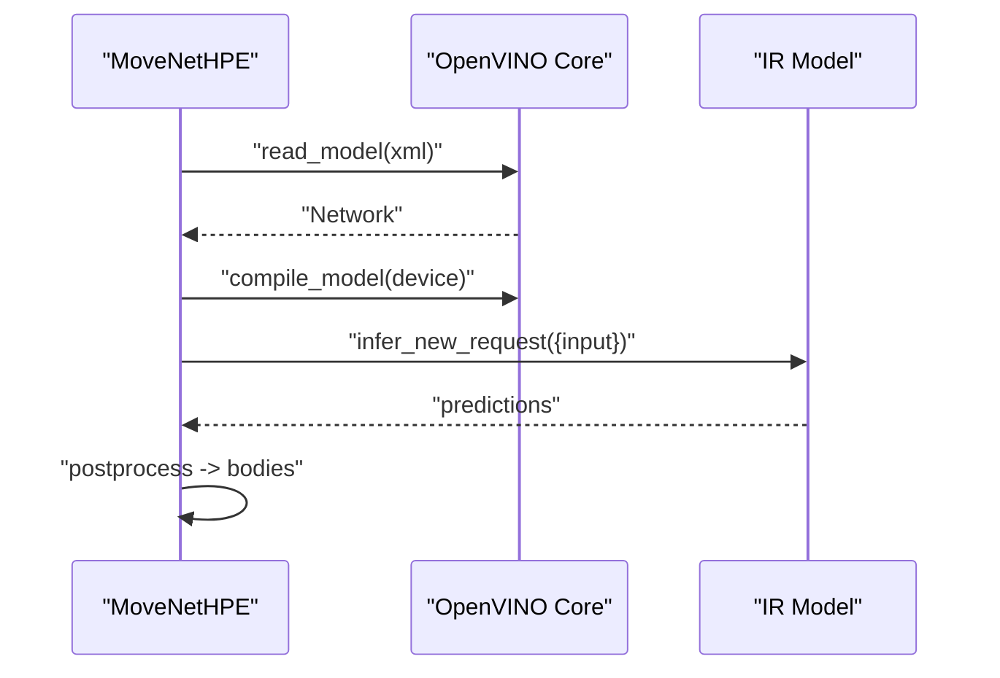
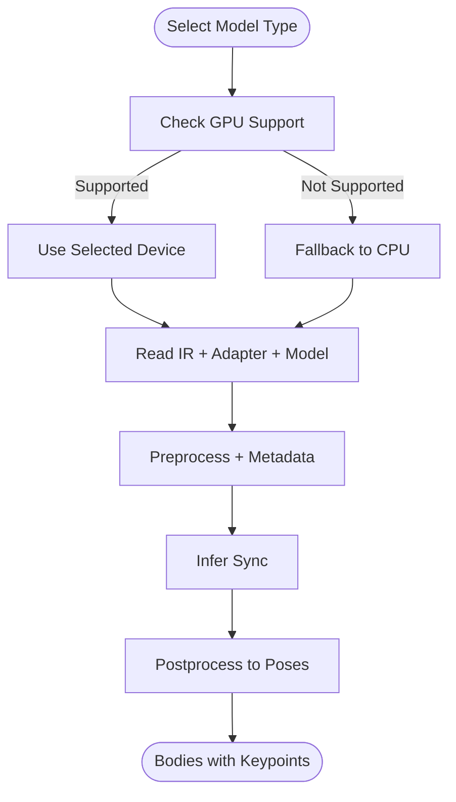
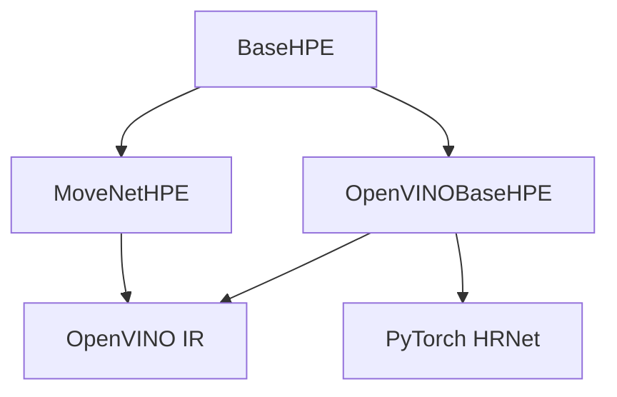

# Model Architecture Comparison

<cite>
**Referenced Files in This Document**
- [base_hpe.py](file://base_hpe.py)
- [movenet_hpe.py](file://movenet_hpe.py)
- [openvino_base_hpe.py](file://openvino_base_hpe.py)
- [models/AlphaPose/alphapose/models/hrnet.py](file://models/AlphaPose/alphapose/models/hrnet.py)
- [models/AlphaPose/alphapose/models/__init__.py](file://models/AlphaPose/alphapose/models/__init__.py)
- [models/AlphaPose/pretrained_models/256x192_res50_lr1e-3_1x.yaml](file://models/AlphaPose/pretrained_models/256x192_res50_lr1e-3_1x.yaml)
- [models/MoveNet/movenet_multipose_lightning_256x256_FP32.xml](file://models/MoveNet/movenet_multipose_lightning_256x256_FP32.xml)
- [models/OpenVINO/model_api/models/__init__.py](file://models/OpenVINO/model_api/models/__init__.py)
- [models/OpenVINO/pretrained_models/intel/human-pose-estimation-0001/human-pose-estimation-0001.xml](file://models/OpenVINO/pretrained_models/intel/human-pose-estimation-0001/human-pose-estimation-0001.xml)
- [models/OpenVINO/pretrained_models/intel/human-pose-estimation-0005/FP32/human-pose-estimation-0005.xml](file://models/OpenVINO/pretrained_models/intel/human-pose-estimation-0005/FP32/human-pose-estimation-0005.xml)
- [models/OpenVINO/pretrained_models/intel/human-pose-estimation-0006/FP32/human-pose-estimation-0006.xml](file://models/OpenVINO/pretrained_models/intel/human-pose-estimation-0006/FP32/human-pose-estimation-0006.xml)
- [models/OpenVINO/pretrained_models/intel/human-pose-estimation-0007/FP32/human-pose-estimation-0007.xml](file://models/OpenVINO/pretrained_models/intel/human-pose-estimation-0007/FP32/human-pose-estimation-0007.xml)
- [models/OpenVINO/pretrained_models/public/FP32/higher-hrnet-w32-human-pose-estimation.xml](file://models/OpenVINO/pretrained_models/public/FP32/higher-hrnet-w32-human-pose-estimation.xml)
</cite>

## Table of Contents
1. [Introduction](#introduction)
2. [Project Structure](#project-structure)
3. [Core Components](#core-components)
4. [Architecture Overview](#architecture-overview)
5. [Detailed Component Analysis](#detailed-component-analysis)
6. [Dependency Analysis](#dependency-analysis)
7. [Performance Considerations](#performance-considerations)
8. [Troubleshooting Guide](#troubleshooting-guide)
9. [Conclusion](#conclusion)
10. [Appendices](#appendices)

## Introduction
This document presents a comparative analysis of HPE (Human Pose Estimation) model architectures implemented in the repository, focusing on:
- AlphaPose (PyTorch HRNet)
- MoveNet (OpenVINO multipose)
- Various OpenVINO human-pose-estimation models (including OpenPose and EfficientHRNet variants)

We compare these implementations across accuracy, speed, memory usage, power consumption, and hardware requirements. We also explain architectural differences, algorithmic approaches, computational complexity, and provide decision matrices and migration guidelines for selecting and transitioning between models.

## Project Structure
The repository organizes HPE implementations around a shared base abstraction and per-framework model adapters:
- A generic BaseHPE interface defines input handling, padding/resizing, inference orchestration, and postprocessing hooks.
- MoveNetHPE adapts an OpenVINO IR model for multipose inference.
- OpenVINOBaseHPE integrates the Model API to support multiple OpenVINO HPE variants (OpenPose, EfficientHRNet, HigherHRNet).
- AlphaPose HRNet is implemented in PyTorch and configured via YAML presets.

**Diagram sources**
- [base_hpe.py:36-546](file://base_hpe.py#L36-L546)
- [movenet_hpe.py:12-111](file://movenet_hpe.py#L12-L111)
- [openvino_base_hpe.py:55-653](file://openvino_base_hpe.py#L55-L653)

**Section sources**
- [base_hpe.py:36-546](file://base_hpe.py#L36-L546)
- [movenet_hpe.py:12-111](file://movenet_hpe.py#L12-L111)
- [openvino_base_hpe.py:55-653](file://openvino_base_hpe.py#L55-L653)

## Core Components
- BaseHPE: Defines the unified pipeline for loading models, capturing/decoding input, padding and resizing frames, running inference, postprocessing, rendering, and exporting metrics. It supports image, directory, webcam, and HTTP stream inputs, with optional PyNvCodec GPU acceleration and OpenCV fallback.
- MoveNetHPE: Loads an OpenVINO IR model for multipose inference, performs preprocessing and postprocessing tailored to the model’s output layout, and enforces device constraints (e.g., GPU not supported).
- OpenVINOBaseHPE: Manages multiple OpenVINO HPE backends via the Model API, including OpenPose, EfficientHRNet variants, and HigherHRNet. It exposes configurable performance modes (latency/throughput), CPU threads, streams, and CPU pinning/hyper-threading toggles.

Key capabilities:
- Unified timing and FPS computation
- COCO-format JSON/CSV logging
- Optional video/image saving
- Async variant for OpenVINO with frame queuing and parallel processing

**Section sources**
- [base_hpe.py:36-546](file://base_hpe.py#L36-L546)
- [movenet_hpe.py:12-111](file://movenet_hpe.py#L12-L111)
- [openvino_base_hpe.py:55-653](file://openvino_base_hpe.py#L55-L653)

## Architecture Overview
The systems share a common processing loop but differ in model architecture and runtime backend:

**Diagram sources**
- [base_hpe.py:405-519](file://base_hpe.py#L405-L519)
- [movenet_hpe.py:83-111](file://movenet_hpe.py#L83-L111)
- [openvino_base_hpe.py:262-277](file://openvino_base_hpe.py#L262-L277)

## Detailed Component Analysis

### AlphaPose (PyTorch HRNet)
- Architecture: Multi-scale high-resolution network with stage-wise fusion and configurable block types. The HRNet backbone enables precise spatial localization through multi-resolution feature aggregation.
- Inputs/Outputs: The model is configured for 256x192 input resolution and predicts heatmaps for 17 keypoints. The YAML preset defines dataset, augmentation, loss, and training configuration.
- Complexity: Convolutional layers with residual bottlenecks; multi-stage fusion increases compute cost but improves accuracy. Typical inference involves several convolutional passes and fusion modules.
- Hardware: PyTorch runtime; GPU acceleration is commonly used for training/inference. The repository does not include explicit quantization or ONNX export in the analyzed files.

**Diagram sources**
- [models/AlphaPose/alphapose/models/hrnet.py:269-495](file://models/AlphaPose/alphapose/models/hrnet.py#L269-L495)

**Section sources**
- [models/AlphaPose/alphapose/models/hrnet.py:269-495](file://models/AlphaPose/alphapose/models/hrnet.py#L269-L495)
- [models/AlphaPose/alphapose/models/__init__.py:1-14](file://models/AlphaPose/alphapose/models/__init__.py#L1-L14)
- [models/AlphaPose/pretrained_models/256x192_res50_lr1e-3_1x.yaml:1-66](file://models/AlphaPose/pretrained_models/256x192_res50_lr1e-3_1x.yaml#L1-L66)

### MoveNet (OpenVINO multipose)
- Architecture: Multipose OpenVINO IR model designed for real-time inference. The adapter reads the IR, compiles to the target device, and processes outputs containing per-person keypoints and bounding boxes.
- Inputs/Outputs: Fixed input size for the model; outputs are reshaped to extract keypoints, bounding boxes, and scores. The adapter applies thresholding and coordinate scaling.
- Complexity: Lower than HRNet due to IR format and simplified architecture; optimized for throughput on CPU/GPU.
- Hardware: Supports CPU and falls back to CPU if GPU is requested but unsupported. Uses OpenCV or FFmpeg for input capture.

**Diagram sources**
- [movenet_hpe.py:58-111](file://movenet_hpe.py#L58-L111)

**Section sources**
- [movenet_hpe.py:12-111](file://movenet_hpe.py#L12-L111)
- [models/MoveNet/movenet_multipose_lightning_256x256_FP32.xml](file://models/MoveNet/movenet_multipose_lightning_256x256_FP32.xml)

### OpenVINO HPE Variants (OpenPose, EfficientHRNet, HigherHRNet)
- Architecture: OpenVINO-based implementations leveraging the Model API. The adapter selects among OpenPose, EfficientHRNet variants, and HigherHRNet. EfficientHRNet variants expose different input sizes and FP32/FP16 options; HigherHRNet is configured for center padding and delta adjustments.
- Inputs/Outputs: The adapter handles preprocessing metadata and postprocessing to produce pose arrays with scores. Different models require distinct configuration keys (e.g., target size, aspect ratio, padding mode).
- Complexity: Varies by variant; EfficientHRNet reduces complexity compared to HigherHRNet while maintaining strong accuracy. OpenPose uses PAFs/heatmaps and associative embedding.
- Hardware: CPU/GPU support varies by model; the adapter enforces device compatibility and configures performance hints and threading.

**Diagram sources**
- [openvino_base_hpe.py:183-277](file://openvino_base_hpe.py#L183-L277)

**Section sources**
- [openvino_base_hpe.py:22-53](file://openvino_base_hpe.py#L22-L53)
- [openvino_base_hpe.py:183-277](file://openvino_base_hpe.py#L183-L277)
- [models/OpenVINO/model_api/models/__init__.py:26-37](file://models/OpenVINO/model_api/models/__init__.py#L26-L37)
- [models/OpenVINO/pretrained_models/intel/human-pose-estimation-0001/human-pose-estimation-0001.xml](file://models/OpenVINO/pretrained_models/intel/human-pose-estimation-0001/human-pose-estimation-0001.xml)
- [models/OpenVINO/pretrained_models/intel/human-pose-estimation-0005/FP32/human-pose-estimation-0005.xml](file://models/OpenVINO/pretrained_models/intel/human-pose-estimation-0005/FP32/human-pose-estimation-0005.xml)
- [models/OpenVINO/pretrained_models/intel/human-pose-estimation-0006/FP32/human-pose-estimation-0006.xml](file://models/OpenVINO/pretrained_models/intel/human-pose-estimation-0006/FP32/human-pose-estimation-0006.xml)
- [models/OpenVINO/pretrained_models/intel/human-pose-estimation-0007/FP32/human-pose-estimation-0007.xml](file://models/OpenVINO/pretrained_models/intel/human-pose-estimation-0007/FP32/human-pose-estimation-0007.xml)
- [models/OpenVINO/pretrained_models/public/FP32/higher-hrnet-w32-human-pose-estimation.xml](file://models/OpenVINO/pretrained_models/public/FP32/higher-hrnet-w32-human-pose-estimation.xml)

## Dependency Analysis
- BaseHPE orchestrates input handling and inference across adapters.
- MoveNetHPE depends on OpenVINO runtime and OpenCV/FFmpeg for input.
- OpenVINOBaseHPE depends on the Model API and adapters to construct and load models, and on OpenVINO properties for performance tuning.
- AlphaPose HRNet is a standalone PyTorch module with a YAML preset controlling training and inference parameters.

**Diagram sources**
- [base_hpe.py:36-546](file://base_hpe.py#L36-L546)
- [movenet_hpe.py:12-111](file://movenet_hpe.py#L12-L111)
- [openvino_base_hpe.py:55-653](file://openvino_base_hpe.py#L55-L653)
- [models/AlphaPose/alphapose/models/hrnet.py:269-495](file://models/AlphaPose/alphapose/models/hrnet.py#L269-L495)

**Section sources**
- [base_hpe.py:36-546](file://base_hpe.py#L36-L546)
- [movenet_hpe.py:12-111](file://movenet_hpe.py#L12-L111)
- [openvino_base_hpe.py:55-653](file://openvino_base_hpe.py#L55-L653)
- [models/AlphaPose/alphapose/models/hrnet.py:269-495](file://models/AlphaPose/alphapose/models/hrnet.py#L269-L495)

## Performance Considerations
- Throughput vs. latency: OpenVINOBaseHPE exposes performance mode selection (latency/throughput) and CPU thread/stream controls. Adjusting these can shift the balance between latency and sustained throughput.
- Device constraints: MoveNetHPE restricts GPU usage for the selected IR; OpenVINOBaseHPE validates GPU support per model and falls back to CPU when needed.
- Input pipeline: BaseHPE supports PyNvCodec for GPU-accelerated decoding and OpenCV fallback. For HTTP streams, FFmpeg backend is preferred to reduce latency.
- Metrics: BaseHPE computes rolling average FPS and logs timing; OpenVINOBaseHPE prints effective OpenVINO settings for CPU tuning.

Recommendations:
- For low-latency, single-person scenarios: OpenVINO OpenPose or EfficientHRNet FP32 with latency mode.
- For multi-person and throughput: MoveNet multipose or EfficientHRNet FP16 with throughput mode.
- For highest accuracy on constrained devices: AlphaPose HRNet with FP32 on GPU; consider quantization or pruning if supported by downstream tools.

[No sources needed since this section provides general guidance]

## Troubleshooting Guide
Common issues and resolutions:
- No PyNvCodec: The system falls back to OpenCV; ensure FFmpeg backend is available for HTTP streams.
- GPU not supported for model: MoveNetHPE forces CPU fallback; OpenVINOBaseHPE checks model capability and adjusts device.
- Streaming instability: Increase buffer size and reduce latency; use FFmpeg backend for HTTP streams.
- Performance tuning: Adjust OpenVINO threads, streams, CPU pinning, and hyper-threading via environment variables or constructor parameters.

**Section sources**
- [base_hpe.py:90-157](file://base_hpe.py#L90-L157)
- [movenet_hpe.py:28-31](file://movenet_hpe.py#L28-L31)
- [openvino_base_hpe.py:87-91](file://openvino_base_hpe.py#L87-L91)
- [openvino_base_hpe.py:153-182](file://openvino_base_hpe.py#L153-L182)

## Conclusion
Across the three families—AlphaPose HRNet, MoveNet multipose, and OpenVINO HPE variants—the repository offers flexible, high-performance HPE solutions:
- AlphaPose HRNet prioritizes accuracy with a multi-scale backbone and is suitable for offline or GPU-accelerated inference.
- MoveNet multipose emphasizes real-time throughput and simplicity, ideal for CPU deployments and multiperson scenarios.
- OpenVINO HPE variants provide a unified, configurable pipeline supporting multiple architectures and performance modes, enabling rapid experimentation and deployment across diverse hardware.

Choose models based on accuracy, latency, and hardware constraints, and leverage the provided adapters and base infrastructure for consistent evaluation and migration.

[No sources needed since this section summarizes without analyzing specific files]

## Appendices

### Decision Matrix: Model Selection
- Accuracy-sensitive, offline, GPU-available: AlphaPose HRNet
- Real-time, multiperson, CPU-focused: MoveNet multipose
- Configurable throughput/latency, multi-variant support: OpenVINO HPE variants (OpenPose/EfficientHRNet/HigherHRNet)

### Migration Guidelines
- From MoveNet to OpenVINO variants: Replace MoveNetHPE with OpenVINOBaseHPE and select the desired model type; preserve input handling and postprocessing hooks.
- From OpenVINO variants to AlphaPose: Integrate PyTorch HRNet and align input preprocessing to the model’s expected resolution and normalization.
- From AlphaPose to OpenVINO: Convert the trained model to OpenVINO IR using the Model Optimizer and adapt the OpenVINOBaseHPE pipeline.

[No sources needed since this section provides general guidance]