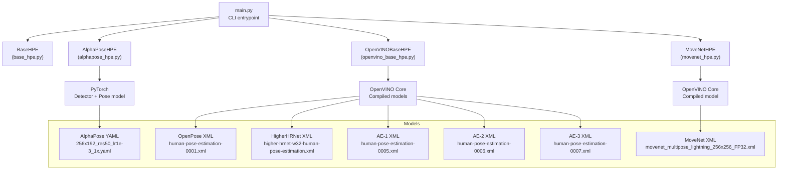
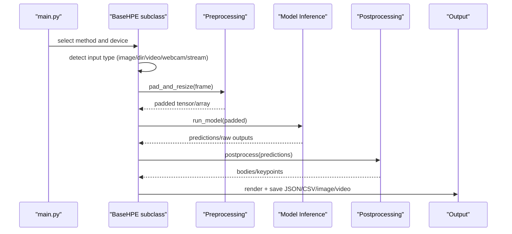
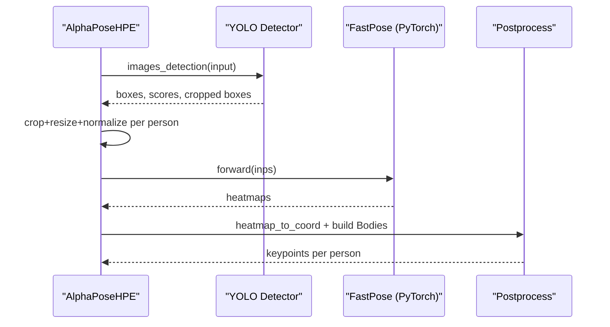
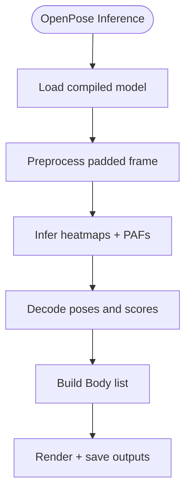
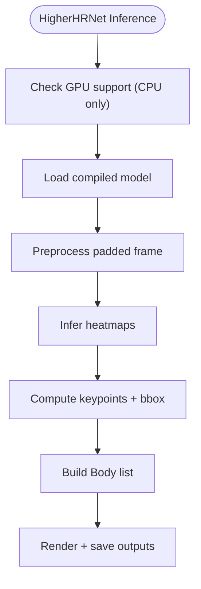
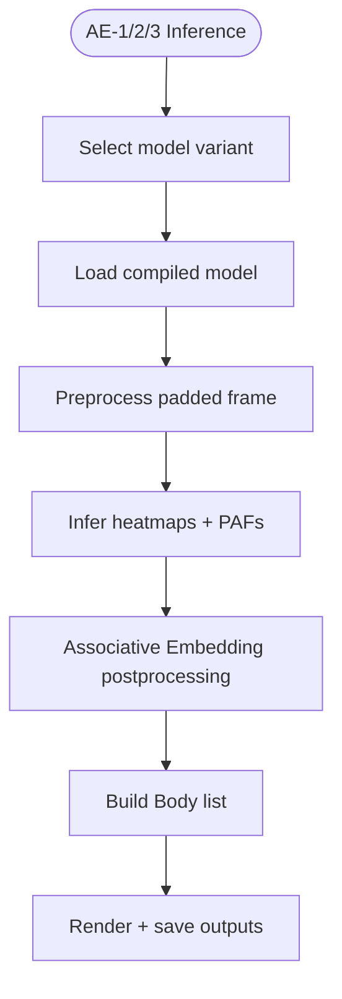
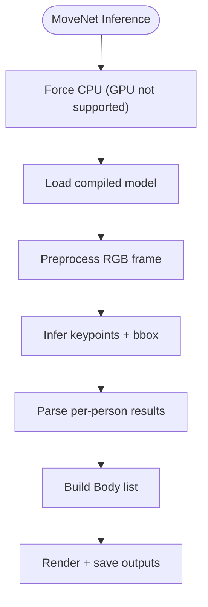
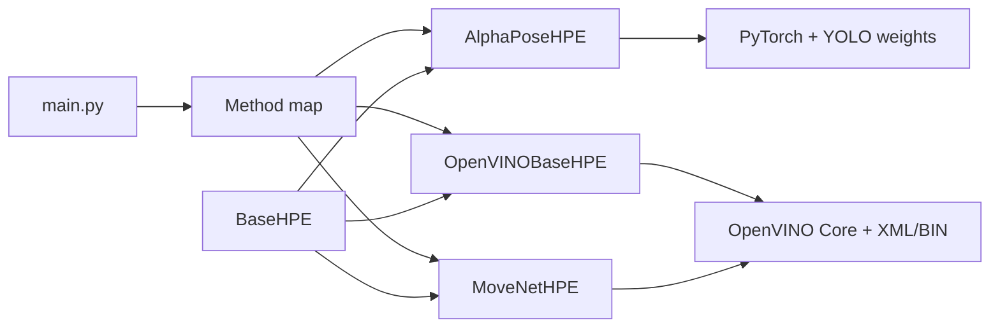

# Model Implementations

<cite>
**Referenced Files in This Document**
- [README.md](file://README.md)
- [main.py](file://main.py)
- [base_hpe.py](file://base_hpe.py)
- [alphapose_hpe.py](file://alphapose_hpe.py)
- [movenet_hpe.py](file://movenet_hpe.py)
- [openvino_base_hpe.py](file://openvino_base_hpe.py)
- [256x192_res50_lr1e-3_1x.yaml](file://models/AlphaPose/pretrained_models/256x192_res50_lr1e-3_1x.yaml)
- [human-pose-estimation-0001.xml](file://models/OpenVINO/pretrained_models/intel/human-pose-estimation-0001/human-pose-estimation-0001.xml)
- [human-pose-estimation-0005.xml](file://models/OpenVINO/pretrained_models/public/human-pose-estimation-0005/Fp32/human-pose-estimation-0005.xml)
- [human-pose-estimation-0006.xml](file://models/OpenVINO/pretrained_models/intel/human-pose-estimation-0006/Fp32/human-pose-estimation-0006.xml)
- [human-pose-estimation-0007.xml](file://models/OpenVINO/pretrained_models/intel/human-pose-estimation-0007/Fp32/human-pose-estimation-0007.xml)
- [higher-hrnet-w32-human-pose-estimation.xml](file://models/OpenVINO/pretrained_models/public/Fp32/higher-hrnet-w32-human-pose-estimation.xml)
- [movenet_multipose_lightning_256x256_FP32.xml](file://models/MoveNet/movenet_multipose_lightning_256x256_FP32.xml)
</cite>

## Table of Contents
1. [Introduction](#introduction)
2. [Project Structure](#project-structure)
3. [Core Components](#core-components)
4. [Architecture Overview](#architecture-overview)
5. [Detailed Component Analysis](#detailed-component-analysis)
6. [Dependency Analysis](#dependency-analysis)
7. [Performance Considerations](#performance-considerations)
8. [Troubleshooting Guide](#troubleshooting-guide)
9. [Conclusion](#conclusion)

## Introduction
This document explains the Human Pose Estimation implementations provided in the repository, covering five methods:
- AlphaPose (PyTorch)
- OpenPose (OpenVINO)
- HigherHRNet (OpenVINO)
- EfficientHRNet variants (OpenVINO: AE-1, AE-2, AE-3)
- MoveNet (OpenVINO)

It describes each method’s architecture, model characteristics, performance trade-offs, and practical use cases. It also documents configuration options, input/output specifications, optimization strategies, and selection guidance for deployment scenarios and hardware constraints.

## Project Structure
The repository organizes HPE implementations around a shared base class and method-specific adapters:
- A unified BaseHPE orchestrates input handling, padding/resizing, inference, postprocessing, rendering, and output saving.
- Method-specific adapters implement model loading, inference, and postprocessing tailored to each backend and model family.
- OpenVINO-based methods leverage the Model API and compiled models; PyTorch-based AlphaPose integrates a detector and a pose model.

**Diagram sources**
- [main.py:1-99](file://main.py#L1-L99)
- [base_hpe.py:1-546](file://base_hpe.py#L1-L546)
- [alphapose_hpe.py:1-334](file://alphapose_hpe.py#L1-L334)
- [openvino_base_hpe.py:1-653](file://openvino_base_hpe.py#L1-L653)
- [movenet_hpe.py:1-111](file://movenet_hpe.py#L1-L111)
- [256x192_res50_lr1e-3_1x.yaml:1-66](file://models/AlphaPose/pretrained_models/256x192_res50_lr1e-3_1x.yaml#L1-L66)
- [human-pose-estimation-0001.xml](file://models/OpenVINO/pretrained_models/intel/human-pose-estimation-0001/human-pose-estimation-0001.xml)
- [higher-hrnet-w32-human-pose-estimation.xml](file://models/OpenVINO/pretrained_models/public/Fp32/higher-hrnet-w32-human-pose-estimation.xml)
- [human-pose-estimation-0005.xml](file://models/OpenVINO/pretrained_models/public/human-pose-estimation-0005/Fp32/human-pose-estimation-0005.xml)
- [human-pose-estimation-0006.xml](file://models/OpenVINO/pretrained_models/intel/human-pose-estimation-0006/Fp32/human-pose-estimation-0006.xml)
- [human-pose-estimation-0007.xml](file://models/OpenVINO/pretrained_models/intel/human-pose-estimation-0007/Fp32/human-pose-estimation-0007.xml)
- [movenet_multipose_lightning_256x256_FP32.xml](file://models/MoveNet/movenet_multipose_lightning_256x256_FP32.xml)

**Section sources**
- [README.md:1-125](file://README.md#L1-L125)
- [main.py:1-99](file://main.py#L1-L99)
- [base_hpe.py:1-546](file://base_hpe.py#L1-L546)

## Core Components
- BaseHPE: Provides unified input detection (image, directory, video, webcam, HTTP stream), padding/resizing, inference orchestration, postprocessing, rendering, and output persistence. It supports PyNvCodec acceleration when available and falls back to OpenCV otherwise.
- AlphaPoseHPE: Integrates a YOLOv3-based detector and a PyTorch FastPose model. Handles detection and pose estimation pipelines, including GPU-accelerated cropping and normalization.
- OpenVINOBaseHPE: Loads OpenVINO models via the Model API, configures performance hints and CPU/GPU settings, performs preprocessing/postprocessing, and supports both synchronous and asynchronous pipelines.
- MoveNetHPE: Loads a multipose MoveNet model and runs inference on OpenVINO, with postprocessing to extract per-person keypoints and bounding boxes.

Key configuration options exposed by the CLI and base class:
- Method selection: alphapose, openpose, hrnet (HigherHRNet), ae1/ae2/ae3 (EfficientHRNet variants), movenet
- Device: CPU or GPU (with model-specific GPU support)
- Input: image, directory, video file, webcam, HTTP stream
- Output: JSON/COCO keypoints, CSV metrics, rendered images/videos
- Advanced: timeouts, max frames, measurement intervals, OpenVINO threads/mode/streams, CPU pinning/hyper-threading

**Section sources**
- [base_hpe.py:36-546](file://base_hpe.py#L36-L546)
- [main.py:47-99](file://main.py#L47-L99)
- [README.md:71-125](file://README.md#L71-L125)

## Architecture Overview
The runtime architecture follows a consistent flow: input acquisition -> padding/resizing -> inference -> postprocessing -> visualization and/or saving.

**Diagram sources**
- [base_hpe.py:207-546](file://base_hpe.py#L207-L546)
- [openvino_base_hpe.py:183-277](file://openvino_base_hpe.py#L183-L277)
- [movenet_hpe.py:83-111](file://movenet_hpe.py#L83-L111)
- [alphapose_hpe.py:126-294](file://alphapose_hpe.py#L126-L294)

## Detailed Component Analysis

### AlphaPose (PyTorch)
- Architecture: Two-stage pipeline:
  - Detector: YOLOv3-SPP trained on COCO for person detection.
  - Pose model: FastPose (ResNet50 backbone) generating heatmaps for 17 COCO keypoints.
- Model characteristics:
  - Input image size: 256x192 (preset in YAML).
  - Heatmap size: 64x48.
  - Normalization: ImageNet statistics.
  - Multi-scale augmentation during training; flip augmentation during inference.
- Performance trade-offs:
  - Accuracy: Strong on single-person scenes; good for research and moderate throughput.
  - Speed: Slower than OpenVINO variants due to PyTorch overhead; benefits from GPU acceleration.
  - Memory: Heavier than compact OpenVINO models; requires sufficient VRAM.
- Use cases:
  - Research, prototyping, environments where PyTorch flexibility is preferred.
- Configuration and inputs:
  - Config file: 256x192_res50_lr1e-3_1x.yaml
  - Pretrained weights: fast_res50_256x192.pth
  - Detector weights: yolov3-spp.weights
  - CLI: --method alphapose, --device GPU/CPU, --detbatch for detection batching
- Optimization strategies:
  - Use GPU with pinned memory and forkserver sharing strategy.
  - Tune detbatch/posebatch for throughput vs. latency.
  - Prefer half precision if available; ensure detector compatibility.
- Postprocessing:
  - Converts heatmaps to keypoint coordinates and builds Body objects with normalized and pixel coordinates.

**Diagram sources**
- [alphapose_hpe.py:69-294](file://alphapose_hpe.py#L69-L294)
- [256x192_res50_lr1e-3_1x.yaml:1-66](file://models/AlphaPose/pretrained_models/256x192_res50_lr1e-3_1x.yaml#L1-L66)

**Section sources**
- [alphapose_hpe.py:1-334](file://alphapose_hpe.py#L1-L334)
- [256x192_res50_lr1e-3_1x.yaml:1-66](file://models/AlphaPose/pretrained_models/256x192_res50_lr1e-3_1x.yaml#L1-L66)
- [README.md:21-94](file://README.md#L21-L94)

### OpenPose (OpenVINO)
- Architecture: Single-stream OpenPose model producing heatmaps and PAFs (Part Affinity Fields) for associative grouping.
- Model characteristics:
  - Input size: 456x256.
  - Output: heatmaps and PAFs; postprocessing merges parts into person instances.
  - GPU supported.
- Performance trade-offs:
  - Accuracy: Very strong; excellent for dense scenes with occlusions.
  - Speed: Fast on GPU; lower latency on CPU with tuned settings.
  - Resource usage: Moderate to high depending on batch and device.
- Use cases:
  - Real-time dense pose estimation, surveillance, robotics.
- Configuration and inputs:
  - Model: human-pose-estimation-0001.xml
  - CLI: --method openpose, --device CPU/GPU
- Optimization strategies:
  - Adjust OV_THREADS/OV_MODE/OV_STREAMS/OV_CPU_PINNING/OV_HYPER_THREADING via environment variables.
  - Prefer GPU for throughput; tune CPU settings for latency.
- Postprocessing:
  - Uses Model API postprocessing to decode poses and scores; builds Body objects.

**Diagram sources**
- [openvino_base_hpe.py:183-277](file://openvino_base_hpe.py#L183-L277)
- [human-pose-estimation-0001.xml](file://models/OpenVINO/pretrained_models/intel/human-pose-estimation-0001/human-pose-estimation-0001.xml)

**Section sources**
- [openvino_base_hpe.py:19-53](file://openvino_base_hpe.py#L19-L53)
- [openvino_base_hpe.py:183-277](file://openvino_base_hpe.py#L183-L277)
- [README.md:41-45](file://README.md#L41-L45)

### HigherHRNet (OpenVINO)
- Architecture: HRNet-based model designed for high-resolution pose estimation with multi-scale merging.
- Model characteristics:
  - Input size: 512x512.
  - Output: heatmaps; postprocessing computes keypoints and bounding boxes.
  - GPU not supported; runs on CPU.
- Performance trade-offs:
  - Accuracy: Very high; strong on fine details and crowded scenes.
  - Speed: Slower than compact models; CPU-only.
  - Resource usage: High memory footprint.
- Use cases:
  - High-precision applications where GPU acceleration is unavailable.
- Configuration and inputs:
  - Model: higher-hrnet-w32-human-pose-estimation.xml
  - CLI: --method hrnet, --device CPU
- Optimization strategies:
  - Tune CPU threads and streams; enable CPU pinning and hyper-threading via environment variables.
- Postprocessing:
  - Applies delta padding and computes bounding boxes; builds Body objects.

**Diagram sources**
- [openvino_base_hpe.py:47-52](file://openvino_base_hpe.py#L47-L52)
- [openvino_base_hpe.py:231-258](file://openvino_base_hpe.py#L231-L258)
- [higher-hrnet-w32-human-pose-estimation.xml](file://models/OpenVINO/pretrained_models/public/Fp32/higher-hrnet-w32-human-pose-estimation.xml)

**Section sources**
- [openvino_base_hpe.py:47-52](file://openvino_base_hpe.py#L47-L52)
- [openvino_base_hpe.py:231-258](file://openvino_base_hpe.py#L231-L258)
- [README.md:47-51](file://README.md#L47-L51)

### EfficientHRNet Variants (OpenVINO: AE-1, AE-2, AE-3)
- Architecture: Associative embedding (AE) HRNet variants optimized for speed and accuracy balance.
- Model characteristics:
  - AE-1: 288x288 input.
  - AE-2: 352x352 input.
  - AE-3: 448x448 input.
  - Outputs: heatmaps and PAFs; postprocessing merges parts into persons.
  - GPU supported.
- Performance trade-offs:
  - Accuracy: Good to very good; configurable by input size.
  - Speed: Faster than HigherHRNet; AE-3 is the most accurate but slowest among the three.
  - Resource usage: Moderate; AE-3 consumes the most memory and compute.
- Use cases:
  - Real-time applications requiring AE quality with GPU acceleration.
- Configuration and inputs:
  - Models: human-pose-estimation-0005.xml (AE-1), human-pose-estimation-0006.xml (AE-2), human-pose-estimation-0007.xml (AE-3)
  - CLI: --method ae1/ae2/ae3, --device CPU/GPU
- Optimization strategies:
  - Choose smaller input size (AE-1) for highest throughput; use larger sizes (AE-3) for accuracy.
  - Tune OpenVINO CPU/GPU settings for target latency/thruput.
- Postprocessing:
  - Uses Model API AE postprocessing; builds Body objects.

**Diagram sources**
- [openvino_base_hpe.py:22-53](file://openvino_base_hpe.py#L22-L53)
- [openvino_base_hpe.py:231-258](file://openvino_base_hpe.py#L231-L258)
- [human-pose-estimation-0005.xml](file://models/OpenVINO/pretrained_models/public/human-pose-estimation-0005/Fp32/human-pose-estimation-0005.xml)
- [human-pose-estimation-0006.xml](file://models/OpenVINO/pretrained_models/intel/human-pose-estimation-0006/Fp32/human-pose-estimation-0006.xml)
- [human-pose-estimation-0007.xml](file://models/OpenVINO/pretrained_models/intel/human-pose-estimation-0007/Fp32/human-pose-estimation-0007.xml)

**Section sources**
- [openvino_base_hpe.py:22-53](file://openvino_base_hpe.py#L22-L53)
- [openvino_base_hpe.py:231-258](file://openvino_base_hpe.py#L231-L258)
- [README.md:53-69](file://README.md#L53-L69)

### MoveNet (OpenVINO)
- Architecture: Multipose MoveNet Lightning model for real-time pose estimation.
- Model characteristics:
  - Input size: 256x256.
  - Output: per-person keypoints and bounding boxes.
  - GPU not supported; runs on CPU.
- Performance trade-offs:
  - Accuracy: Good for real-time; slightly less accurate than AE/HigherHRNet.
  - Speed: Fastest among OpenVINO models; CPU-optimized.
  - Resource usage: Low to moderate.
- Use cases:
  - Edge devices, lightweight real-time applications, mobile-friendly deployments.
- Configuration and inputs:
  - Model: movenet_multipose_lightning_256x256_FP32.xml
  - CLI: --method movenet, --device CPU (GPU forced to CPU)
- Optimization strategies:
  - Use CPU threads and streams tuning; reduce latency via environment variables.
- Postprocessing:
  - Parses per-person keypoints and bounding boxes; builds Body objects.

**Diagram sources**
- [movenet_hpe.py:20-111](file://movenet_hpe.py#L20-L111)
- [movenet_multipose_lightning_256x256_FP32.xml](file://models/MoveNet/movenet_multipose_lightning_256x256_FP32.xml)

**Section sources**
- [movenet_hpe.py:1-111](file://movenet_hpe.py#L1-L111)
- [README.md:35-39](file://README.md#L35-L39)

## Dependency Analysis
- Method selection maps to a specific HPE subclass and model configuration.
- BaseHPE coordinates input detection, padding/resizing, and output persistence.
- OpenVINO-based methods rely on the Model API and compiled models; AlphaPose relies on PyTorch and external detector weights.
- Environment variables control OpenVINO performance settings.

**Diagram sources**
- [main.py:64-84](file://main.py#L64-L84)
- [base_hpe.py:36-168](file://base_hpe.py#L36-L168)
- [openvino_base_hpe.py:55-93](file://openvino_base_hpe.py#L55-L93)
- [movenet_hpe.py:12-31](file://movenet_hpe.py#L12-L31)

**Section sources**
- [main.py:47-99](file://main.py#L47-L99)
- [base_hpe.py:36-168](file://base_hpe.py#L36-L168)

## Performance Considerations
- OpenVINO tuning:
  - OV_THREADS: Number of inference threads.
  - OV_MODE: latency or throughput.
  - OV_STREAMS: Number of streams.
  - OV_CPU_PINNING: Enable CPU pinning.
  - OV_HYPER_THREADING: Enable hyper-threading.
- GPU vs CPU:
  - OpenVINO models: Prefer GPU for throughput; CPU for latency or when GPU not supported.
  - AlphaPose: GPU accelerates both detection and pose estimation.
  - MoveNet: CPU-only; optimize CPU settings.
- Throughput vs latency:
  - Larger input sizes improve accuracy but reduce throughput.
  - Smaller models (AE-1) yield fastest inference.
- I/O and streaming:
  - HTTP streams benefit from reduced buffer sizes and timeouts.
  - PyNvCodec reduces CPU load for video decoding; falls back to OpenCV when unavailable.

[No sources needed since this section provides general guidance]

## Troubleshooting Guide
- Missing or unsupported input:
  - Ensure input type is recognized (image, directory, video, webcam, HTTP stream).
  - For HTTP streams, reduce buffer size and enable timeout/max frames.
- PyNvCodec not available:
  - Falls back to OpenCV; expect higher CPU usage.
- Model not supported on GPU:
  - MoveNet and HigherHRNet run on CPU; OpenVINOBaseHPE automatically falls back.
- Stream interruptions:
  - Increase robustness by retrying reads and using timeouts.
- OpenVINO configuration:
  - Verify environment variables and device availability; check effective settings printed during load.

**Section sources**
- [base_hpe.py:90-157](file://base_hpe.py#L90-L157)
- [base_hpe.py:283-398](file://base_hpe.py#L283-L398)
- [openvino_base_hpe.py:87-93](file://openvino_base_hpe.py#L87-L93)
- [movenet_hpe.py:28-31](file://movenet_hpe.py#L28-L31)

## Conclusion
This repository provides a comprehensive, unified framework for Human Pose Estimation across multiple backends and model families. Choose AlphaPose for PyTorch flexibility and research-grade accuracy, OpenPose for robust single-pass pose estimation, HigherHRNet for high-precision CPU-only scenarios, EfficientHRNet variants for balanced accuracy-speed trade-offs on GPU, and MoveNet for the fastest CPU-based real-time solutions. Tune OpenVINO settings and model sizes according to your hardware and latency/throughput goals.