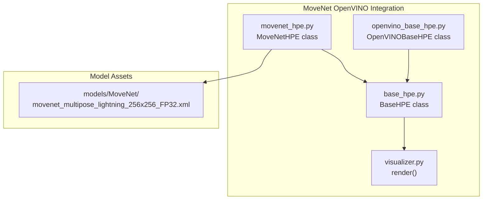
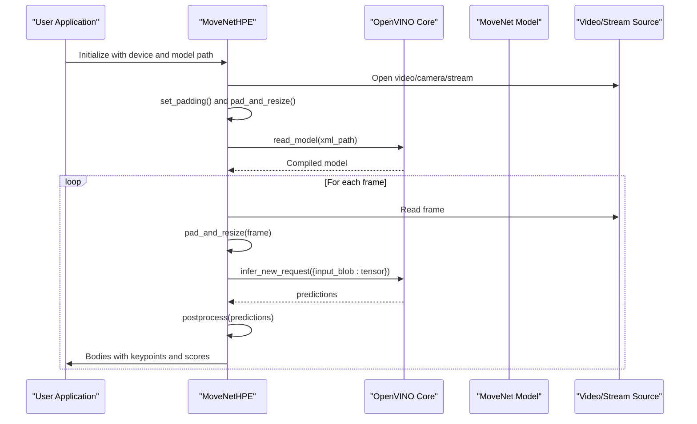
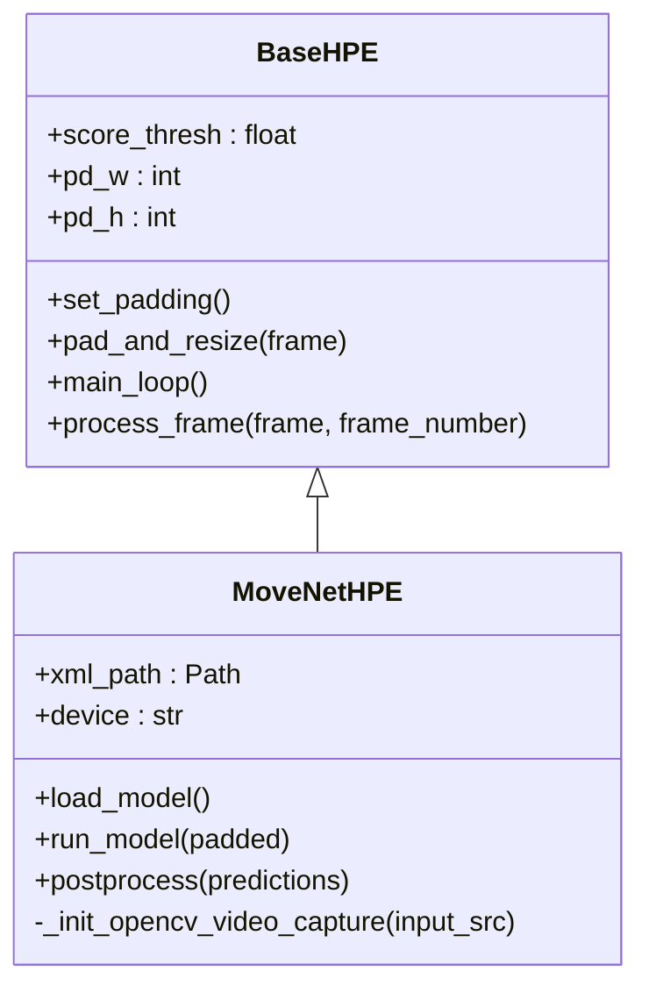
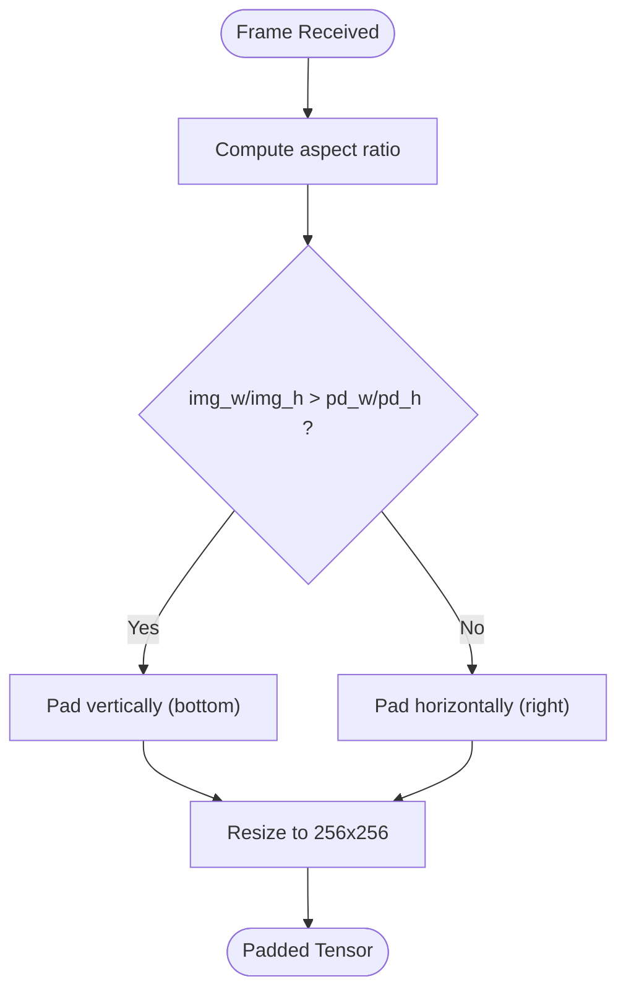
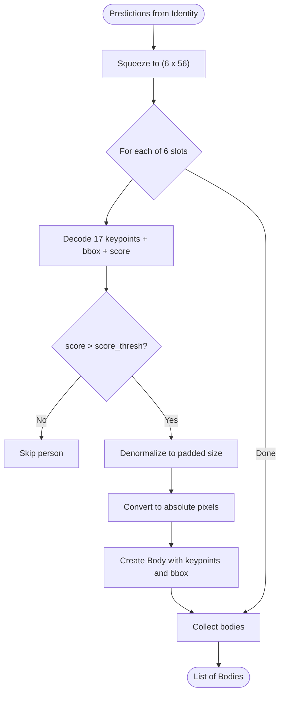
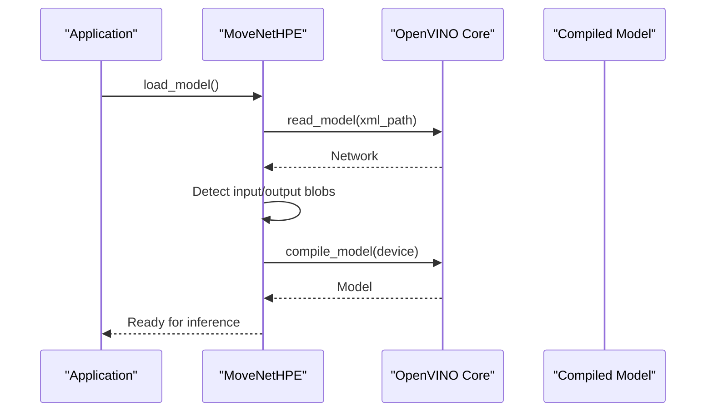
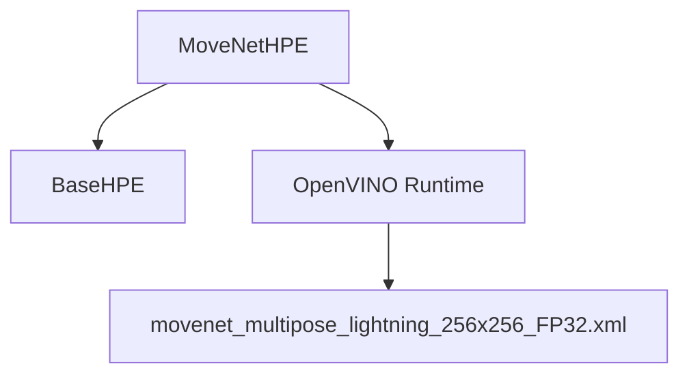

# MoveNet Implementation

<cite>
**Referenced Files in This Document**
- [movenet_hpe.py](file://movenet_hpe.py)
- [openvino_base_hpe.py](file://openvino_base_hpe.py)
- [base_hpe.py](file://base_hpe.py)
- [visualizer.py](file://utils/visualizer.py)
- [movenet_multipose_lightning_256x256_FP32.xml](file://models/MoveNet/movenet_multipose_lightning_256x256_FP32.xml)
</cite>

## Table of Contents
1. [Introduction](#introduction)
2. [Project Structure](#project-structure)
3. [Core Components](#core-components)
4. [Architecture Overview](#architecture-overview)
5. [Detailed Component Analysis](#detailed-component-analysis)
6. [Dependency Analysis](#dependency-analysis)
7. [Performance Considerations](#performance-considerations)
8. [Troubleshooting Guide](#troubleshooting-guide)
9. [Conclusion](#conclusion)

## Introduction
This document explains the MoveNet implementation using OpenVINO, focusing on the multipose Lightning model architecture optimized for edge devices and real-time performance. It covers model loading, input preprocessing (256x256 resolution), output postprocessing for multiple persons, configuration options for device selection and performance tuning, and practical examples for initialization, inference, and result interpretation. Limitations such as GPU support restrictions and optimal deployment scenarios for edge computing are also addressed.

## Project Structure
The MoveNet implementation is organized around a shared base Human Pose Estimation (HPE) framework and a MoveNet-specific adapter that integrates with OpenVINO. Supporting utilities include a visualizer and a base HPE class that standardizes input handling, padding/resizing, and rendering.

**Diagram sources**
- [movenet_hpe.py:12-111](file://movenet_hpe.py#L12-L111)
- [openvino_base_hpe.py:55-653](file://openvino_base_hpe.py#L55-L653)
- [base_hpe.py:36-546](file://base_hpe.py#L36-L546)
- [visualizer.py:4-49](file://utils/visualizer.py#L4-L49)
- [movenet_multipose_lightning_256x256_FP32.xml:1-200](file://models/MoveNet/movenet_multipose_lightning_256x256_FP32.xml#L1-L200)

**Section sources**
- [movenet_hpe.py:1-111](file://movenet_hpe.py#L1-L111)
- [openvino_base_hpe.py:55-653](file://openvino_base_hpe.py#L55-L653)
- [base_hpe.py:36-546](file://base_hpe.py#L36-L546)
- [visualizer.py:4-49](file://utils/visualizer.py#L4-L49)
- [movenet_multipose_lightning_256x256_FP32.xml:1-200](file://models/MoveNet/movenet_multipose_lightning_256x256_FP32.xml#L1-L200)

## Core Components
- MoveNetHPE: Implements the MoveNet multipose Lightning model with OpenVINO runtime. Handles device selection (CPU fallback for GPU), model loading, preprocessing, inference, and postprocessing for multiple people.
- BaseHPE: Provides shared infrastructure for input handling, padding/resizing, timing, saving outputs, and rendering. It defines the common interface for all HPE implementations.
- OpenVINOBaseHPE: A more generic OpenVINO-based HPE class supporting multiple architectures and advanced performance tuning (threads, streams, CPU pinning, hyperthreading).
- visualizer: Renders skeletons and bounding boxes for detected bodies.

Key capabilities:
- Lightweight multipose design enabling detection of multiple persons in a single inference.
- Fixed 256x256 input resolution for the MoveNet model.
- Threshold-based filtering of detections and keypoints.
- Optional async processing pipeline for improved responsiveness.

**Section sources**
- [movenet_hpe.py:12-111](file://movenet_hpe.py#L12-L111)
- [base_hpe.py:36-546](file://base_hpe.py#L36-L546)
- [openvino_base_hpe.py:55-653](file://openvino_base_hpe.py#L55-L653)
- [visualizer.py:4-49](file://utils/visualizer.py#L4-L49)

## Architecture Overview
The MoveNet pipeline follows a standard HPE flow: input acquisition → padding and resizing → inference → postprocessing → visualization and output.

**Diagram sources**
- [movenet_hpe.py:58-86](file://movenet_hpe.py#L58-L86)
- [movenet_hpe.py:88-111](file://movenet_hpe.py#L88-L111)
- [base_hpe.py:529-546](file://base_hpe.py#L529-L546)

## Detailed Component Analysis

### MoveNetHPE Class
MoveNetHPE extends BaseHPE and encapsulates MoveNet-specific logic:
- Device handling: Forces CPU if GPU is requested because the MoveNet Lightning model is not supported on GPU.
- Model loading: Reads the IR XML and compiles the model for the selected device.
- Preprocessing: Converts BGR to RGB, transposes to CHW, normalizes, and adds batch dimension.
- Inference: Executes a single request using the compiled model.
- Postprocessing: Squeezes the Identity output, decodes 17 keypoints per person, bounding boxes, and applies score thresholding.

**Diagram sources**
- [base_hpe.py:36-546](file://base_hpe.py#L36-L546)
- [movenet_hpe.py:12-111](file://movenet_hpe.py#L12-L111)

**Section sources**
- [movenet_hpe.py:20-31](file://movenet_hpe.py#L20-L31)
- [movenet_hpe.py:58-86](file://movenet_hpe.py#L58-L86)
- [movenet_hpe.py:88-111](file://movenet_hpe.py#L88-L111)

### Input Preprocessing and Padding
The BaseHPE class ensures consistent preprocessing:
- Determines padding to maintain aspect ratio, adding black borders to bottom or right.
- Resizes to the model’s fixed input size (256x256 for MoveNet).
- Provides a unified pad_and_resize method used by MoveNetHPE.

**Diagram sources**
- [base_hpe.py:529-546](file://base_hpe.py#L529-L546)

**Section sources**
- [base_hpe.py:529-546](file://base_hpe.py#L529-L546)

### Output Postprocessing for Multiple Persons
MoveNetHPE postprocessing:
- Squeezes the Identity output to extract per-person data.
- Decodes 17 keypoints (x, y, score), bounding box (ymin, xmin, ymax, xmax), and a person score.
- Applies a global score threshold to filter detections.
- Converts normalized coordinates to absolute pixel coordinates and normalizes to image dimensions.

**Diagram sources**
- [movenet_hpe.py:88-111](file://movenet_hpe.py#L88-L111)

**Section sources**
- [movenet_hpe.py:88-111](file://movenet_hpe.py#L88-L111)

### Model Loading and Device Selection
- MoveNetHPE reads the IR XML and compiles the model for the specified device.
- If GPU is requested, it automatically falls back to CPU and prints an informational message.
- The compiled model stores the input and output blob names for inference.

**Diagram sources**
- [movenet_hpe.py:58-82](file://movenet_hpe.py#L58-L82)

**Section sources**
- [movenet_hpe.py:28-30](file://movenet_hpe.py#L28-L30)
- [movenet_hpe.py:58-82](file://movenet_hpe.py#L58-L82)

### Practical Examples

- Initialization and device selection:
  - Instantiate MoveNetHPE with an optional model path and device ("CPU" or "GPU"). GPU requests are automatically converted to CPU.
  - Example instantiation path: [movenet_hpe.py:20](file://movenet_hpe.py#L20)

- Model loading:
  - Call load_model to read the IR and compile for the device.
  - Example call path: [movenet_hpe.py:58](file://movenet_hpe.py#L58)

- Inference execution:
  - Prepare a padded frame using BaseHPE.pad_and_resize.
  - Execute run_model to obtain predictions.
  - Example paths: [base_hpe.py:541-546](file://base_hpe.py#L541-L546), [movenet_hpe.py:83-86](file://movenet_hpe.py#L83-L86)

- Result interpretation:
  - Use postprocess to decode bodies, keypoints, and bounding boxes.
  - Example path: [movenet_hpe.py:88-111](file://movenet_hpe.py#L88-L111)

- Rendering:
  - Visualize skeletons and bounding boxes using the provided render utility.
  - Example path: [visualizer.py:4-49](file://utils/visualizer.py#L4-L49)

**Section sources**
- [movenet_hpe.py:20-26](file://movenet_hpe.py#L20-L26)
- [movenet_hpe.py:58-86](file://movenet_hpe.py#L58-L86)
- [movenet_hpe.py:88-111](file://movenet_hpe.py#L88-L111)
- [base_hpe.py:541-546](file://base_hpe.py#L541-L546)
- [visualizer.py:4-49](file://utils/visualizer.py#L4-L49)

## Dependency Analysis
- MoveNetHPE depends on BaseHPE for input handling, padding, and rendering.
- MoveNetHPE uses OpenVINO runtime to load and run the model.
- The model asset is the IR XML with a fixed 256x256 input shape.

**Diagram sources**
- [movenet_hpe.py:12-111](file://movenet_hpe.py#L12-L111)
- [base_hpe.py:36-546](file://base_hpe.py#L36-L546)
- [movenet_multipose_lightning_256x256_FP32.xml:1-200](file://models/MoveNet/movenet_multipose_lightning_256x256_FP32.xml#L1-L200)

**Section sources**
- [movenet_hpe.py:12-111](file://movenet_hpe.py#L12-L111)
- [base_hpe.py:36-546](file://base_hpe.py#L36-L546)
- [movenet_multipose_lightning_256x256_FP32.xml:1-200](file://models/MoveNet/movenet_multipose_lightning_256x256_FP32.xml#L1-L200)

## Performance Considerations
- Fixed input size: The model expects 256x256, which reduces overhead and enables predictable throughput on edge devices.
- Single inference per frame: MoveNet Lightning performs multiperson detection in one pass, balancing speed and accuracy.
- Device fallback: GPU is not supported for this model; CPU fallback ensures compatibility.
- Threshold tuning: Adjust score_thresh to trade off false positives vs. recall.
- Asynchronous processing: While MoveNetHPE focuses on a streamlined pipeline, the broader OpenVINOBaseHPE supports async pipelines with frame buffering and thread pools for improved responsiveness in high-throughput scenarios.

[No sources needed since this section provides general guidance]

## Troubleshooting Guide
Common issues and resolutions:
- GPU not supported: Requests for GPU are automatically redirected to CPU with an informational message. Use CPU for inference.
  - Reference: [movenet_hpe.py:28-30](file://movenet_hpe.py#L28-L30)

- Model path errors: Ensure the IR XML exists at the expected path and matches the model name.
  - Reference: [movenet_hpe.py:10](file://movenet_hpe.py#L10)

- Video capture failures: For HTTP streams, the code uses FFmpeg backend and sets a small buffer to reduce latency. Verify stream accessibility and adjust buffering if needed.
  - Reference: [movenet_hpe.py:39-44](file://movenet_hpe.py#L39-L44)

- Rendering artifacts: Confirm that LINES_BODY is defined and score_thresh is set appropriately to filter weak detections.
  - Reference: [visualizer.py:4-49](file://utils/visualizer.py#L4-L49)

**Section sources**
- [movenet_hpe.py:28-30](file://movenet_hpe.py#L28-L30)
- [movenet_hpe.py:10](file://movenet_hpe.py#L10)
- [movenet_hpe.py:39-44](file://movenet_hpe.py#L39-L44)
- [visualizer.py:4-49](file://utils/visualizer.py#L4-L49)

## Conclusion
The MoveNet implementation leverages OpenVINO to deliver a lightweight, multiperson pose estimation solution optimized for edge devices. Its fixed 256x256 input, single-inference design, and CPU-centric deployment simplify real-time operation. By tuning the score threshold and leveraging the provided preprocessing and postprocessing utilities, developers can integrate robust pose detection into resource-constrained environments. For advanced performance tuning and multi-architecture support, the broader OpenVINOBaseHPE class offers additional configuration options.