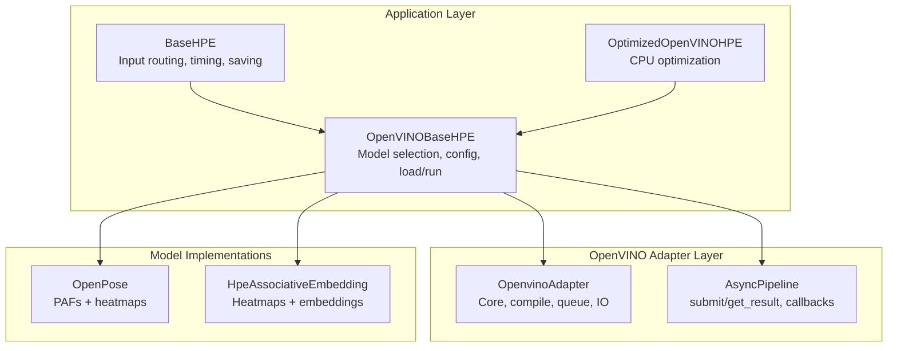
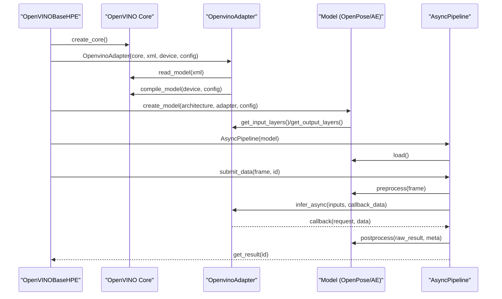
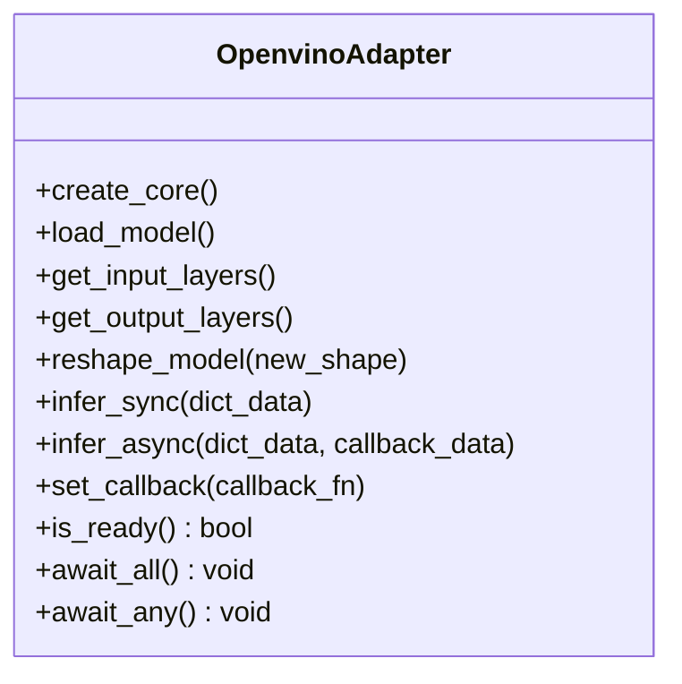
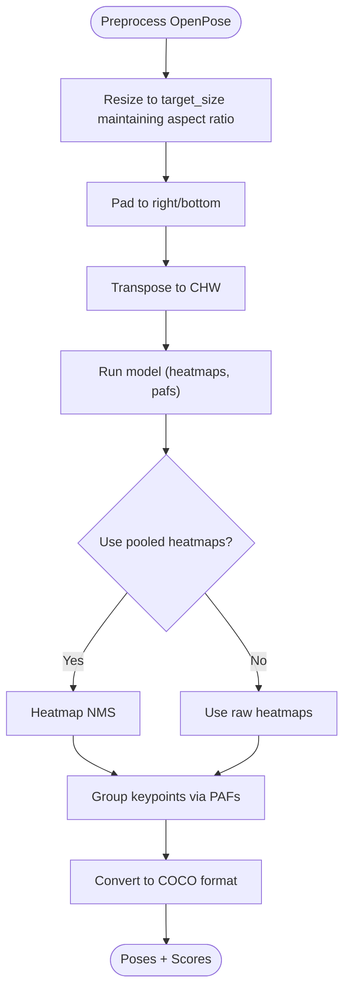
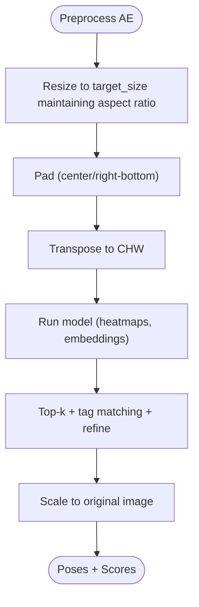
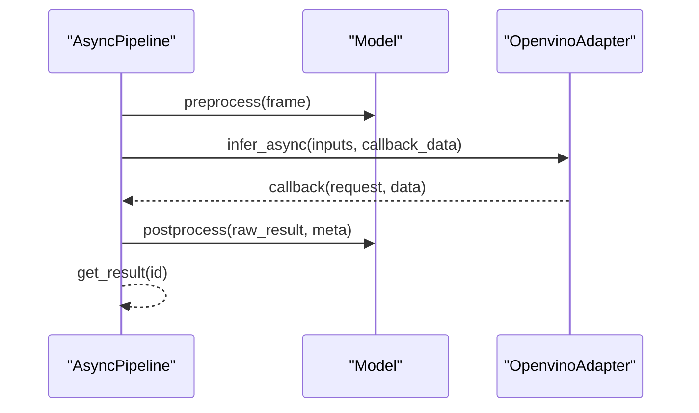
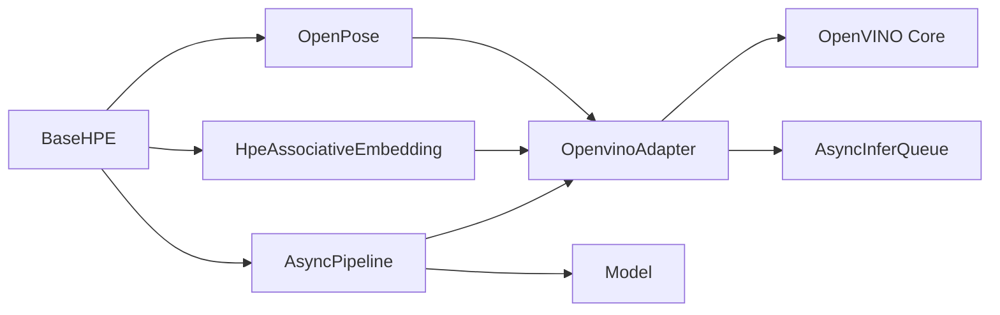

# OpenVINO Model Suite

<cite>
**Referenced Files in This Document**
- [openvino_base_hpe.py](file://openvino_base_hpe.py)
- [base_hpe.py](file://base_hpe.py)
- [openvino_adapter.py](file://models/OpenVINO/model_api/adapters/openvino_adapter.py)
- [hpe_associative_embedding.py](file://models/OpenVINO/model_api/models/hpe_associative_embedding.py)
- [open_pose.py](file://models/OpenVINO/model_api/models/open_pose.py)
- [async_pipeline.py](file://models/OpenVINO/model_api/pipelines/async_pipeline.py)
- [enhanced_openvino_hpe.py](file://optimizations/enhanced_openvino_hpe.py)
</cite>

## Table of Contents
1. [Introduction](#introduction)
2. [Project Structure](#project-structure)
3. [Core Components](#core-components)
4. [Architecture Overview](#architecture-overview)
5. [Detailed Component Analysis](#detailed-component-analysis)
6. [Dependency Analysis](#dependency-analysis)
7. [Performance Considerations](#performance-considerations)
8. [Troubleshooting Guide](#troubleshooting-guide)
9. [Conclusion](#conclusion)
10. [Appendices](#appendices)

## Introduction
This document describes the OpenVINO-based Human Pose Estimation (HPE) models suite. It explains the unified OpenVINO adapter architecture, model loading mechanisms, and the inference pipeline. It covers the available model variants (human-pose-estimation-0001, 0005, 0006, 0007), their performance characteristics, model selection criteria, device optimization strategies, and batch processing capabilities. It also documents configuration options, input/output specifications, postprocessing workflows, API integration, asynchronous inference patterns, performance monitoring, practical examples, deployment scenarios, troubleshooting, quantization options, precision trade-offs, and hardware-specific optimizations.

## Project Structure
The HPE suite integrates a reusable base framework with OpenVINO model adapters and pipelines:
- Base HPE framework defines input handling, preprocessing, postprocessing, and rendering.
- OpenVINO adapter encapsulates model loading, device configuration, and async inference.
- Model implementations provide architecture-specific preprocessing and postprocessing.
- Pipelines orchestrate async inference with callbacks and metrics.
- Optimizations module enhances CPU performance for EPYC-class systems.

**Diagram sources**
- [openvino_base_hpe.py:183-260](file://openvino_base_hpe.py#L183-L260)
- [openvino_adapter.py:40-148](file://models/OpenVINO/model_api/adapters/openvino_adapter.py#L40-L148)
- [async_pipeline.py:90-144](file://models/OpenVINO/model_api/pipelines/async_pipeline.py#L90-L144)
- [open_pose.py:29-152](file://models/OpenVINO/model_api/models/open_pose.py#L29-L152)
- [hpe_associative_embedding.py:27-118](file://models/OpenVINO/model_api/models/hpe_associative_embedding.py#L27-L118)
- [enhanced_openvino_hpe.py:77-131](file://optimizations/enhanced_openvino_hpe.py#L77-L131)

**Section sources**
- [openvino_base_hpe.py:22-53](file://openvino_base_hpe.py#L22-L53)
- [base_hpe.py:36-168](file://base_hpe.py#L36-L168)

## Core Components
- Unified OpenVINO Adapter
  - Reads IR/onnx models, compiles to device, manages AsyncInferQueue, exposes input/output metadata, and provides sync/async inference.
- Model Implementations
  - OpenPose: expects PAFs and heatmaps outputs; performs NMS and grouping to produce COCO-format poses.
  - HPE-associative-embedding: expects heatmaps and embeddings; uses decoder to associate joints and refine poses.
- Async Pipeline
  - Orchestrates preprocessing, async submission, callback-driven result retrieval, and postprocessing.
- Base HPE
  - Handles input sources (image, directory, video, webcam), padding/resizing, rendering, saving, and timing.

**Section sources**
- [openvino_adapter.py:40-148](file://models/OpenVINO/model_api/adapters/openvino_adapter.py#L40-L148)
- [open_pose.py:29-152](file://models/OpenVINO/model_api/models/open_pose.py#L29-L152)
- [hpe_associative_embedding.py:27-118](file://models/OpenVINO/model_api/models/hpe_associative_embedding.py#L27-L118)
- [async_pipeline.py:90-144](file://models/OpenVINO/model_api/pipelines/async_pipeline.py#L90-L144)
- [base_hpe.py:36-168](file://base_hpe.py#L36-L168)

## Architecture Overview
The system follows a layered design:
- Application layer selects model and device, configures performance hints, and loads the model.
- Adapter layer handles OpenVINO Core initialization, model compilation, and async queues.
- Model layer implements architecture-specific preprocessing and postprocessing.
- Pipeline layer coordinates async inference with callbacks and metrics.
- Base layer manages input acquisition, preprocessing, rendering, and persistence.

**Diagram sources**
- [openvino_base_hpe.py:183-260](file://openvino_base_hpe.py#L183-L260)
- [openvino_adapter.py:64-148](file://models/OpenVINO/model_api/adapters/openvino_adapter.py#L64-L148)
- [async_pipeline.py:110-134](file://models/OpenVINO/model_api/pipelines/async_pipeline.py#L110-L134)
- [open_pose.py:122-151](file://models/OpenVINO/model_api/models/open_pose.py#L122-L151)
- [hpe_associative_embedding.py:84-117](file://models/OpenVINO/model_api/models/hpe_associative_embedding.py#L84-L117)

## Detailed Component Analysis

### Unified OpenVINO Adapter
- Responsibilities
  - Create Core, read model, compile to device, manage AsyncInferQueue.
  - Expose input/output metadata, layouts, shapes, and precisions.
  - Provide sync and async inference APIs and wait helpers.
- Key behaviors
  - Dynamic shape support via PartialShape.
  - Device-specific runtime logging (streams, threads).
  - Callback registration for async pipelines.

**Diagram sources**
- [openvino_adapter.py:40-148](file://models/OpenVINO/model_api/adapters/openvino_adapter.py#L40-L148)

**Section sources**
- [openvino_adapter.py:40-148](file://models/OpenVINO/model_api/adapters/openvino_adapter.py#L40-L148)

### Model Implementations

#### OpenPose (human-pose-estimation-0001)
- Inputs
  - Single image blob; target_size and aspect_ratio drive resizing and padding.
- Outputs
  - Heatmaps and PAFs; optional pooled heatmaps for NMS.
- Preprocessing
  - Resize preserving aspect ratio, pad to right/bottom, CHW layout.
- Postprocessing
  - NMS via pooled heatmaps or raw heatmaps, keypoint extraction, grouping via PAFs, COCO conversion.

**Diagram sources**
- [open_pose.py:122-151](file://models/OpenVINO/model_api/models/open_pose.py#L122-L151)
- [open_pose.py:173-195](file://models/OpenVINO/model_api/models/open_pose.py#L173-L195)

**Section sources**
- [open_pose.py:29-152](file://models/OpenVINO/model_api/models/open_pose.py#L29-L152)

#### HPE-Associative Embedding (human-pose-estimation-0005/0006/0007)
- Inputs
  - Single image blob; target_size drives square input; aspect_ratio influences padding mode.
- Outputs
  - Heatmaps and embeddings; optional NMS heatmaps.
- Preprocessing
  - Resize with aspect ratio, pad (center or right/bottom), CHW layout.
- Postprocessing
  - Top-k selection, tag-distance matching, pose refinement, optional delta adjustment.

**Diagram sources**
- [hpe_associative_embedding.py:84-117](file://models/OpenVINO/model_api/models/hpe_associative_embedding.py#L84-L117)
- [hpe_associative_embedding.py:166-354](file://models/OpenVINO/model_api/models/hpe_associative_embedding.py#L166-L354)

**Section sources**
- [hpe_associative_embedding.py:27-118](file://models/OpenVINO/model_api/models/hpe_associative_embedding.py#L27-L118)

### Async Pipeline
- Responsibilities
  - Submit workloads asynchronously, collect results via callbacks, and perform postprocessing.
- Key behaviors
  - Parse devices and per-device stream/thread configurations.
  - Wrap model callbacks to return structured results with metadata.

**Diagram sources**
- [async_pipeline.py:110-134](file://models/OpenVINO/model_api/pipelines/async_pipeline.py#L110-L134)
- [openvino_adapter.py:134-148](file://models/OpenVINO/model_api/adapters/openvino_adapter.py#L134-L148)

**Section sources**
- [async_pipeline.py:90-144](file://models/OpenVINO/model_api/pipelines/async_pipeline.py#L90-L144)

### Base HPE Framework
- Responsibilities
  - Manage input sources, compute padding, resize, and render results.
  - Track processing times, compute FPS, and persist outputs.
- Notable features
  - Supports image, directory, video, and webcam inputs.
  - Optional PyNvCodec acceleration and OpenCV fallback.
  - COCO JSON/CSV export and per-frame timing.

**Section sources**
- [base_hpe.py:36-168](file://base_hpe.py#L36-L168)
- [base_hpe.py:405-519](file://base_hpe.py#L405-L519)

### CPU Optimization Module
- Enhancements
  - EPYC-class CPU optimization with NUMA-aware configuration, memory bandwidth tuning, and workload-specific thread/stream allocation.
  - Factory creation of optimized instances and performance statistics.

**Section sources**
- [enhanced_openvino_hpe.py:25-131](file://optimizations/enhanced_openvino_hpe.py#L25-L131)
- [enhanced_openvino_hpe.py:220-305](file://optimizations/enhanced_openvino_hpe.py#L220-L305)

## Dependency Analysis
- Adapter depends on OpenVINO Core and AsyncInferQueue.
- Models depend on ImageModel base and architecture-specific decoders.
- Pipeline depends on model adapter and callback mechanism.
- Base HPE depends on rendering and evaluation utilities.

**Diagram sources**
- [openvino_adapter.py:20-28](file://models/OpenVINO/model_api/adapters/openvino_adapter.py#L20-L28)
- [open_pose.py:25-40](file://models/OpenVINO/model_api/models/open_pose.py#L25-L40)
- [hpe_associative_embedding.py:22-38](file://models/OpenVINO/model_api/models/hpe_associative_embedding.py#L22-L38)
- [async_pipeline.py:90-98](file://models/OpenVINO/model_api/pipelines/async_pipeline.py#L90-L98)
- [base_hpe.py:16-17](file://base_hpe.py#L16-L17)

**Section sources**
- [openvino_adapter.py:20-28](file://models/OpenVINO/model_api/adapters/openvino_adapter.py#L20-L28)
- [open_pose.py:25-40](file://models/OpenVINO/model_api/models/open_pose.py#L25-L40)
- [hpe_associative_embedding.py:22-38](file://models/OpenVINO/model_api/models/hpe_associative_embedding.py#L22-L38)
- [async_pipeline.py:90-98](file://models/OpenVINO/model_api/pipelines/async_pipeline.py#L90-L98)
- [base_hpe.py:16-17](file://base_hpe.py#L16-L17)

## Performance Considerations
- Throughput vs Latency
  - Use performance hints to tune CPU/GPU streams and threads.
- CPU Tuning
  - Configure threads, streams, CPU pinning, and hyper-threading via properties.
- GPU Tuning
  - Prefer GPU_THROUGHPUT_STREAMS when available; apply throttling hints for multi-device CPU+GPU setups.
- Batch Processing
  - Models support batch sizes; adjust based on memory and device constraints.
- Quantization and Precision
  - FP32 vs INT8 models are available for some variants; choose based on accuracy/performance trade-offs.
- Monitoring
  - Track preprocessing, inference, and postprocessing durations; maintain moving average FPS.

[No sources needed since this section provides general guidance]

## Troubleshooting Guide
- Import errors
  - Ensure OpenVINO is installed; adapter raises explicit ImportError when missing.
- Device configuration
  - Verify device availability and supported properties; fallback to AUTO or CPU when GPU not supported.
- Aspect ratio mismatch
  - Models warn when chosen aspect ratio does not match input; adjust target_size accordingly.
- Stream handling
  - For HTTP streams, reduce buffer size and use FFmpeg backend to minimize latency.
- Frame drops (async)
  - Monitor dropped frames and adjust queue sizes or frame rates to prevent backlog.

**Section sources**
- [openvino_adapter.py:31-37](file://models/OpenVINO/model_api/adapters/openvino_adapter.py#L31-L37)
- [openvino_base_hpe.py:87-90](file://openvino_base_hpe.py#L87-L90)
- [openvino_base_hpe.py:125-131](file://openvino_base_hpe.py#L125-L131)
- [openvino_base_hpe.py:468-472](file://openvino_base_hpe.py#L468-L472)

## Conclusion
The OpenVINO HPE suite provides a robust, extensible framework for deploying human pose estimation models. The unified adapter abstracts device and model complexities, while model-specific implementations encapsulate preprocessing and postprocessing logic. Async pipelines enable scalable throughput, and the base framework offers flexible input handling and output persistence. CPU optimization modules further enhance performance on x86_64 systems. By selecting appropriate models, tuning device settings, and leveraging quantization options, users can balance accuracy and speed for diverse deployment scenarios.

[No sources needed since this section summarizes without analyzing specific files]

## Appendices

### Model Variants and Selection Criteria
- human-pose-estimation-0001 (OpenPose)
  - Use when PAFs/heatmaps outputs are available; suitable for general-purpose pose estimation.
  - Input size: configurable via target_size; aspect_ratio affects padding.
- human-pose-estimation-0005/0006/0007 (Associative Embedding)
  - Use when heatmaps/embeddings outputs are available; often higher accuracy at larger input sizes.
  - Input size: 288/352/448 (square); aspect_ratio influences padding mode.
- HigherHRNet (public)
  - Larger input size; GPU support disabled in this configuration; use CPU.

**Section sources**
- [openvino_base_hpe.py:22-53](file://openvino_base_hpe.py#L22-L53)
- [open_pose.py:96-98](file://models/OpenVINO/model_api/models/open_pose.py#L96-L98)
- [hpe_associative_embedding.py:58-70](file://models/OpenVINO/model_api/models/hpe_associative_embedding.py#L58-L70)

### Configuration Options
- OpenVINO Core
  - Performance mode: LATENCY or THROUGHPUT.
  - Threads, streams, CPU pinning, hyper-threading.
- Model-specific
  - target_size, aspect_ratio, confidence_threshold, padding_mode, delta, upsample_ratio, use_pooled_heatmaps.

**Section sources**
- [openvino_base_hpe.py:153-182](file://openvino_base_hpe.py#L153-L182)
- [open_pose.py:99-110](file://models/OpenVINO/model_api/models/open_pose.py#L99-L110)
- [hpe_associative_embedding.py:71-82](file://models/OpenVINO/model_api/models/hpe_associative_embedding.py#L71-L82)

### Input/Output Specifications
- Inputs
  - Image arrays (HWC) padded and resized to model-specific dimensions.
- Outputs
  - OpenPose: heatmaps, pafs (and optionally pooled heatmaps).
  - AE: heatmaps, embeddings; optional NMS heatmaps.
- Postprocessing
  - OpenPose: NMS, top-k, grouping via PAFs, COCO conversion.
  - AE: top-k, tag matching, pose refinement.

**Section sources**
- [open_pose.py:122-151](file://models/OpenVINO/model_api/models/open_pose.py#L122-L151)
- [hpe_associative_embedding.py:84-117](file://models/OpenVINO/model_api/models/hpe_associative_embedding.py#L84-L117)

### Async Inference Patterns and Performance Monitoring
- Pattern
  - Submit frames with unique ids; receive results via callbacks; postprocess asynchronously.
- Metrics
  - Track preprocessing, inference, and postprocessing durations; compute moving average FPS.

**Section sources**
- [async_pipeline.py:110-134](file://models/OpenVINO/model_api/pipelines/async_pipeline.py#L110-L134)
- [base_hpe.py:451-467](file://base_hpe.py#L451-L467)

### Practical Examples
- Load and run a model
  - Select model_type from supported variants; configure device and performance settings; call main_loop or async entry points.
- Async webcam
  - Use AsyncOpenVINOBaseHPE with frame buffering and background tasks for processing/display.

**Section sources**
- [openvino_base_hpe.py:396-625](file://openvino_base_hpe.py#L396-L625)
- [openvino_base_hpe.py:627-653](file://openvino_base_hpe.py#L627-L653)

### Deployment Scenarios
- Edge CPU
  - Use optimized CPU settings; consider batch sizes; monitor FPS and adjust threads/streams.
- Cloud GPU
  - Prefer FP32 models when GPU supported; leverage GPU_THROUGHPUT_STREAMS; apply throttling for CPU+GPU multi-device.
- Real-time streaming
  - Reduce buffer sizes; use FFmpeg backend for HTTP; implement frame dropping to prevent latency spikes.

**Section sources**
- [openvino_base_hpe.py:153-182](file://openvino_base_hpe.py#L153-L182)
- [openvino_base_hpe.py:104-111](file://openvino_base_hpe.py#L104-L111)
- [openvino_base_hpe.py:468-472](file://openvino_base_hpe.py#L468-L472)

### Quantization and Precision Trade-offs
- FP32 vs INT8
  - INT8 models offer lower latency but may reduce accuracy; choose based on application requirements.
- Hardware-specific optimizations
  - CPU: tune threads/streams, pinning, hyper-threading.
  - GPU: tune streams and multi-device throttling.

**Section sources**
- [openvino_adapter.py:74-87](file://models/OpenVINO/model_api/adapters/openvino_adapter.py#L74-L87)
- [enhanced_openvino_hpe.py:67-76](file://optimizations/enhanced_openvino_hpe.py#L67-L76)