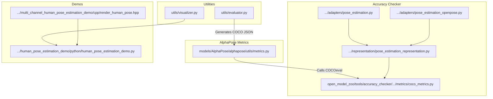
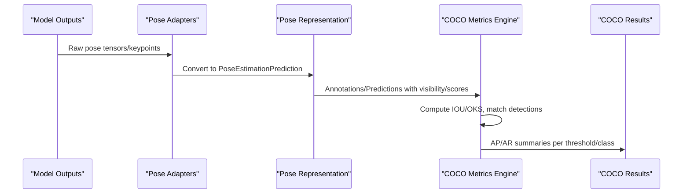
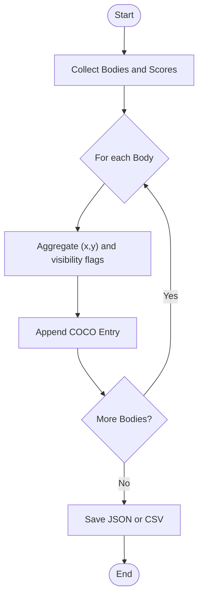
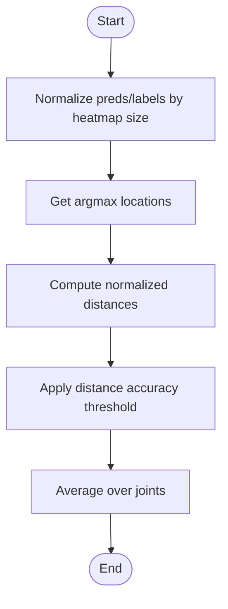
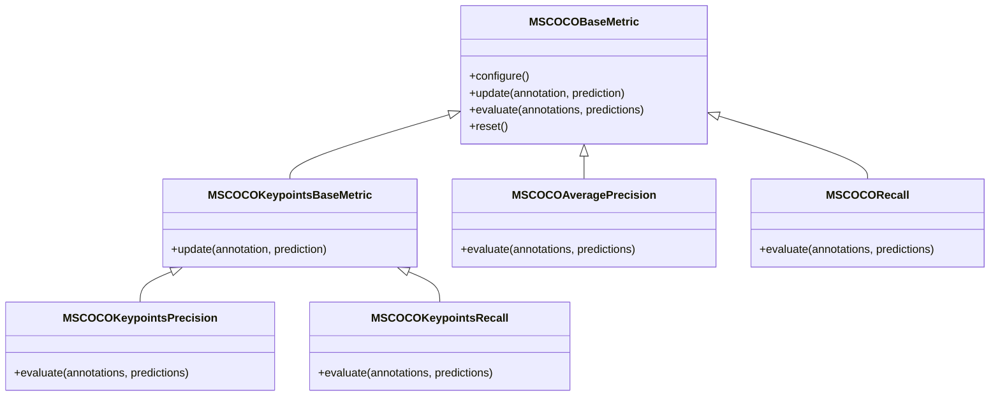
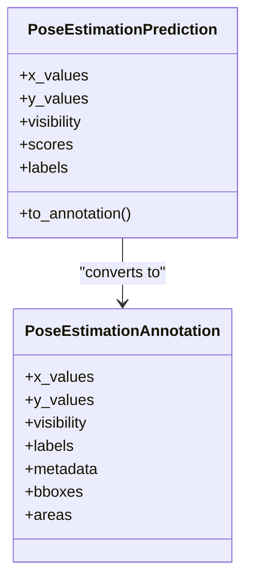
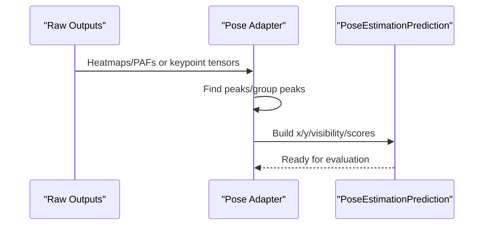
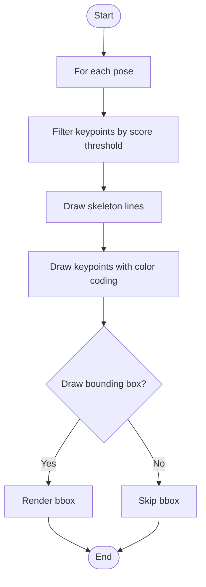
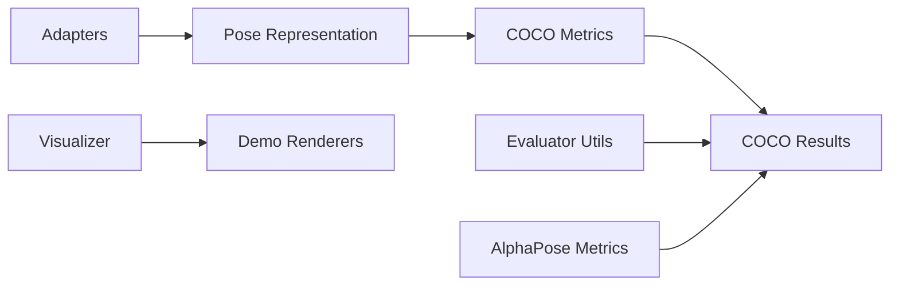

# Evaluation Utilities

<cite>
**Referenced Files in This Document**
- [evaluator.py](file://utils/evaluator.py)
- [visualizer.py](file://utils/visualizer.py)
- [metrics.py](file://models/AlphaPose/alphapose/utils/metrics.py)
- [coco_metrics.py](file://open_model_zoo/tools/accuracy_checker/accuracy_checker/metrics/coco_metrics.py)
- [pose_estimation_representation.py](file://open_model_zoo/tools/accuracy_checker/accuracy_checker/representation/pose_estimation_representation.py)
- [pose_estimation.py](file://open_model_zoo/tools/accuracy_checker/accuracy_checker/adapters/pose_estimation.py)
- [pose_estimation_openpose.py](file://open_model_zoo/tools/accuracy_checker/accuracy_checker/adapters/pose_estimation_openpose.py)
- [human_pose_estimation_demo.py](file://open_model_zoo/demos/human_pose_estimation_demo/python/human_pose_estimation_demo.py)
- [render_human_pose.hpp](file://open_model_zoo/demos/multi_channel_human_pose_estimation_demo/cpp/render_human_pose.hpp)
</cite>

## Table of Contents
1. [Introduction](#introduction)
2. [Project Structure](#project-structure)
3. [Core Components](#core-components)
4. [Architecture Overview](#architecture-overview)
5. [Detailed Component Analysis](#detailed-component-analysis)
6. [Dependency Analysis](#dependency-analysis)
7. [Performance Considerations](#performance-considerations)
8. [Troubleshooting Guide](#troubleshooting-guide)
9. [Conclusion](#conclusion)
10. [Appendices](#appendices)

## Introduction
This document describes the evaluation utilities and quality assessment tools for Human Pose Estimation in the repository. It focuses on:
- COCO-format evaluation metrics (mAP and mAR variants) and pose accuracy calculations
- The evaluation pipeline for comparing predicted poses against COCO ground truth
- Visualization utilities for rendering pose detections, confidence scores, and evaluation results
- Guidance for dataset setup, evaluation configuration, and interpretation of reports
- Unit testing and regression testing procedures for pose estimation accuracy validation
- Best practices for model evaluation, comparison methodologies, and benchmarking

## Project Structure
The evaluation ecosystem spans three primary areas:
- Utilities for COCO-formatted output generation and visualization
- Metrics and representations for pose evaluation (COCO metrics and pose data structures)
- Demo and adapter layers for rendering and converting model outputs into evaluation-ready formats

**Diagram sources**
- [evaluator.py:11-33](file://utils/evaluator.py#L11-L33)
- [visualizer.py:4-49](file://utils/visualizer.py#L4-L49)
- [metrics.py:65-121](file://models/AlphaPose/alphapose/utils/metrics.py#L65-L121)
- [coco_metrics.py:46-91](file://open_model_zoo/tools/accuracy_checker/accuracy_checker/metrics/coco_metrics.py#L46-L91)
- [pose_estimation_representation.py:31-70](file://open_model_zoo/tools/accuracy_checker/accuracy_checker/representation/pose_estimation_representation.py#L31-L70)
- [pose_estimation.py:131-159](file://open_model_zoo/tools/accuracy_checker/accuracy_checker/adapters/pose_estimation.py#L131-L159)
- [pose_estimation_openpose.py:135-160](file://open_model_zoo/tools/accuracy_checker/accuracy_checker/adapters/pose_estimation_openpose.py#L135-L160)
- [human_pose_estimation_demo.py:123-152](file://open_model_zoo/demos/human_pose_estimation_demo/python/human_pose_estimation_demo.py#L123-L152)
- [render_human_pose.hpp:1-25](file://open_model_zoo/demos/multi_channel_human_pose_estimation_demo/cpp/render_human_pose.hpp#L1-L25)

**Section sources**
- [evaluator.py:11-114](file://utils/evaluator.py#L11-L114)
- [visualizer.py:4-49](file://utils/visualizer.py#L4-L49)
- [metrics.py:65-121](file://models/AlphaPose/alphapose/utils/metrics.py#L65-L121)
- [coco_metrics.py:46-91](file://open_model_zoo/tools/accuracy_checker/accuracy_checker/metrics/coco_metrics.py#L46-L91)
- [pose_estimation_representation.py:31-70](file://open_model_zoo/tools/accuracy_checker/accuracy_checker/representation/pose_estimation_representation.py#L31-L70)
- [pose_estimation.py:131-159](file://open_model_zoo/tools/accuracy_checker/accuracy_checker/adapters/pose_estimation.py#L131-L159)
- [pose_estimation_openpose.py:135-160](file://open_model_zoo/tools/accuracy_checker/accuracy_checker/adapters/pose_estimation_openpose.py#L135-L160)
- [human_pose_estimation_demo.py:123-152](file://open_model_zoo/demos/human_pose_estimation_demo/python/human_pose_estimation_demo.py#L123-L152)
- [render_human_pose.hpp:1-25](file://open_model_zoo/demos/multi_channel_human_pose_estimation_demo/cpp/render_human_pose.hpp#L1-L25)

## Core Components
- COCO output generator: Converts detected poses into COCO keypoint format with visibility flags and scores, and persists to JSON or CSV.
- Pose accuracy calculator: Computes heatmap-based accuracy metrics for training/validation.
- COCO metrics engine: Implements mAP/mAR computation for detection and keypoint tasks using IOU/OKS and configurable thresholds.
- Pose data representation: Defines PoseEstimationAnnotation/Prediction structures with visibility and scores.
- Visualization utilities: Render skeletons, bounding boxes, and optional confidence labels on frames.
- Demo renderers: Provide ready-to-use drawing routines for pose overlays in Python and C++.

**Section sources**
- [evaluator.py:11-114](file://utils/evaluator.py#L11-L114)
- [metrics.py:124-253](file://models/AlphaPose/alphapose/utils/metrics.py#L124-L253)
- [coco_metrics.py:154-420](file://open_model_zoo/tools/accuracy_checker/accuracy_checker/metrics/coco_metrics.py#L154-L420)
- [pose_estimation_representation.py:31-70](file://open_model_zoo/tools/accuracy_checker/accuracy_checker/representation/pose_estimation_representation.py#L31-L70)
- [visualizer.py:4-49](file://utils/visualizer.py#L4-L49)
- [human_pose_estimation_demo.py:123-152](file://open_model_zoo/demos/human_pose_estimation_demo/python/human_pose_estimation_demo.py#L123-L152)

## Architecture Overview
The evaluation pipeline integrates model outputs, adapters, representations, and metrics to produce standardized COCO evaluations and visual feedback.

**Diagram sources**
- [pose_estimation.py:131-159](file://open_model_zoo/tools/accuracy_checker/accuracy_checker/adapters/pose_estimation.py#L131-L159)
- [pose_estimation_openpose.py:135-160](file://open_model_zoo/tools/accuracy_checker/accuracy_checker/adapters/pose_estimation_openpose.py#L135-L160)
- [pose_estimation_representation.py:31-70](file://open_model_zoo/tools/accuracy_checker/accuracy_checker/representation/pose_estimation_representation.py#L31-L70)
- [coco_metrics.py:154-420](file://open_model_zoo/tools/accuracy_checker/accuracy_checker/metrics/coco_metrics.py#L154-L420)

## Detailed Component Analysis

### COCO Output Generator
- Purpose: Transform detected poses into COCO keypoint JSON/CSV for external evaluation.
- Key behaviors:
  - Builds COCO entries with image_id, category_id, keypoints (x,y,v), and score.
  - Visibility flag depends on per-keypoint score threshold.
  - Supports batch accumulation and persistence to JSON and CSV.
  - Tracks transmission volume per millisecond for streaming scenarios.

**Diagram sources**
- [evaluator.py:11-33](file://utils/evaluator.py#L11-L33)
- [evaluator.py:35-47](file://utils/evaluator.py#L35-L47)
- [evaluator.py:86-114](file://utils/evaluator.py#L86-L114)

**Section sources**
- [evaluator.py:11-114](file://utils/evaluator.py#L11-L114)

### Pose Accuracy Calculator (Heatmap-based)
- Purpose: Compute per-joint and per-image accuracy for training/validation using normalized distances.
- Key behaviors:
  - Normalizes predictions and labels to heatmap coordinates.
  - Computes per-joint distance and accuracy thresholding.
  - Aggregates joint-wise accuracy to a mean value.

**Diagram sources**
- [metrics.py:124-154](file://models/AlphaPose/alphapose/utils/metrics.py#L124-L154)
- [metrics.py:227-253](file://models/AlphaPose/alphapose/utils/metrics.py#L227-L253)

**Section sources**
- [metrics.py:124-253](file://models/AlphaPose/alphapose/utils/metrics.py#L124-L253)

### COCO Metrics Engine (mAP/mAR)
- Purpose: Compute COCO-standard metrics for detection and keypoints.
- Key behaviors:
  - Accepts configurable thresholds (e.g., standard COCO ranges).
  - Uses OKS for keypoints and IOU for boxes/masks.
  - Supports max detections per image and difficulty/iscrowd handling.
  - Produces per-class and mean metrics with profiling support.

**Diagram sources**
- [coco_metrics.py:46-91](file://open_model_zoo/tools/accuracy_checker/accuracy_checker/metrics/coco_metrics.py#L46-L91)
- [coco_metrics.py:154-194](file://open_model_zoo/tools/accuracy_checker/accuracy_checker/metrics/coco_metrics.py#L154-L194)
- [coco_metrics.py:285-317](file://open_model_zoo/tools/accuracy_checker/accuracy_checker/metrics/coco_metrics.py#L285-L317)
- [coco_metrics.py:320-420](file://open_model_zoo/tools/accuracy_checker/accuracy_checker/metrics/coco_metrics.py#L320-L420)

**Section sources**
- [coco_metrics.py:46-91](file://open_model_zoo/tools/accuracy_checker/accuracy_checker/metrics/coco_metrics.py#L46-L91)
- [coco_metrics.py:154-420](file://open_model_zoo/tools/accuracy_checker/accuracy_checker/metrics/coco_metrics.py#L154-L420)

### Pose Data Representation
- Purpose: Define standardized structures for annotations and predictions.
- Key behaviors:
  - Stores x/y coordinates, visibility flags, scores, and optional 3D values.
  - Computes bounding boxes and areas from keypoints/heatmaps.

**Diagram sources**
- [pose_estimation_representation.py:31-70](file://open_model_zoo/tools/accuracy_checker/accuracy_checker/representation/pose_estimation_representation.py#L31-L70)
- [pose_estimation_representation.py:60-70](file://open_model_zoo/tools/accuracy_checker/accuracy_checker/representation/pose_estimation_representation.py#L60-L70)

**Section sources**
- [pose_estimation_representation.py:31-70](file://open_model_zoo/tools/accuracy_checker/accuracy_checker/representation/pose_estimation_representation.py#L31-L70)

### Adapters: Converting Model Outputs
- Purpose: Convert raw model outputs into evaluation-ready PoseEstimationPrediction.
- Key behaviors:
  - Post-process heatmaps/PAF to pose coordinates and scores.
  - Scale and align predictions to input/output dimensions.
  - Handle OpenPose-specific outputs and NMS/refinement steps.

**Diagram sources**
- [pose_estimation.py:131-159](file://open_model_zoo/tools/accuracy_checker/accuracy_checker/adapters/pose_estimation.py#L131-L159)
- [pose_estimation_openpose.py:135-160](file://open_model_zoo/tools/accuracy_checker/accuracy_checker/adapters/pose_estimation_openpose.py#L135-L160)

**Section sources**
- [pose_estimation.py:131-159](file://open_model_zoo/tools/accuracy_checker/accuracy_checker/adapters/pose_estimation.py#L131-L159)
- [pose_estimation_openpose.py:135-160](file://open_model_zoo/tools/accuracy_checker/accuracy_checker/adapters/pose_estimation_openpose.py#L135-L160)

### Visualization Utilities
- Purpose: Render pose skeletons, bounding boxes, and optional confidence labels.
- Key behaviors:
  - Draw skeleton lines and circles for keypoints above a threshold.
  - Optionally overlay bounding boxes and per-keypoint scores.

**Diagram sources**
- [visualizer.py:4-49](file://utils/visualizer.py#L4-L49)
- [human_pose_estimation_demo.py:123-152](file://open_model_zoo/demos/human_pose_estimation_demo/python/human_pose_estimation_demo.py#L123-L152)
- [render_human_pose.hpp:1-25](file://open_model_zoo/demos/multi_channel_human_pose_estimation_demo/cpp/render_human_pose.hpp#L1-L25)

**Section sources**
- [visualizer.py:4-49](file://utils/visualizer.py#L4-L49)
- [human_pose_estimation_demo.py:123-152](file://open_model_zoo/demos/human_pose_estimation_demo/python/human_pose_estimation_demo.py#L123-L152)
- [render_human_pose.hpp:1-25](file://open_model_zoo/demos/multi_channel_human_pose_estimation_demo/cpp/render_human_pose.hpp#L1-L25)

## Dependency Analysis
- The COCO metrics engine depends on:
  - Pose data representation for annotations/predictions
  - Adapters to convert model outputs into evaluation-ready structures
  - Optional profiling hooks for detailed reporting
- The AlphaPose metrics module depends on pycocotools for COCO evaluation and returns summarized statistics.
- The evaluator utilities depend on JSON/CSV for persistence and optionally on time-series buffers for bandwidth measurements.

**Diagram sources**
- [coco_metrics.py:46-91](file://open_model_zoo/tools/accuracy_checker/accuracy_checker/metrics/coco_metrics.py#L46-L91)
- [pose_estimation_representation.py:31-70](file://open_model_zoo/tools/accuracy_checker/accuracy_checker/representation/pose_estimation_representation.py#L31-L70)
- [evaluator.py:11-114](file://utils/evaluator.py#L11-L114)
- [metrics.py:65-121](file://models/AlphaPose/alphapose/utils/metrics.py#L65-L121)
- [visualizer.py:4-49](file://utils/visualizer.py#L4-L49)
- [human_pose_estimation_demo.py:123-152](file://open_model_zoo/demos/human_pose_estimation_demo/python/human_pose_estimation_demo.py#L123-L152)

**Section sources**
- [coco_metrics.py:46-91](file://open_model_zoo/tools/accuracy_checker/accuracy_checker/metrics/coco_metrics.py#L46-L91)
- [pose_estimation_representation.py:31-70](file://open_model_zoo/tools/accuracy_checker/accuracy_checker/representation/pose_estimation_representation.py#L31-L70)
- [evaluator.py:11-114](file://utils/evaluator.py#L11-L114)
- [metrics.py:65-121](file://models/AlphaPose/alphapose/utils/metrics.py#L65-L121)
- [visualizer.py:4-49](file://utils/visualizer.py#L4-L49)
- [human_pose_estimation_demo.py:123-152](file://open_model_zoo/demos/human_pose_estimation_demo/python/human_pose_estimation_demo.py#L123-L152)

## Performance Considerations
- Threshold tuning: Adjust score thresholds to balance precision and recall; use configurable COCO thresholds for systematic evaluation.
- Max detections: Limit per-image detections to reduce computational overhead during evaluation.
- Profiling: Use built-in profiler hooks in the metrics engine to capture detailed precision/recall curves and AP breakdowns.
- Visualization cost: Rendering on the fly can be expensive; consider disabling or reducing frequency for long sequences.

## Troubleshooting Guide
- Missing dataset metadata: The COCO metrics require dataset metadata with label_map; ensure dataset_meta is configured.
- Empty predictions/annotations: Verify adapters convert outputs to PoseEstimationPrediction and that visibility/scores are populated.
- Visibility thresholds: Ensure visibility flags are computed consistently with the chosen score threshold.
- CSV/JSON persistence: Confirm file paths and permissions; flush buffers before saving to avoid partial writes.

**Section sources**
- [coco_metrics.py:74-87](file://open_model_zoo/tools/accuracy_checker/accuracy_checker/metrics/coco_metrics.py#L74-L87)
- [evaluator.py:86-114](file://utils/evaluator.py#L86-L114)

## Conclusion
The evaluation utilities provide a complete pipeline from model outputs to COCO-compliant metrics and visual feedback. By leveraging standardized representations, adapters, and metrics, teams can reliably compare models, track regressions, and benchmark performance against COCO baselines.

## Appendices

### A. COCO Evaluation Metrics Overview
- mAP (mean Average Precision): Area under precision-recall curve averaged across IoU thresholds and classes.
- mAR (mean Average Recall): Recall averaged across IoU thresholds and classes.
- Keypoint OKS: Object Keypoint Similarity used for pose matching instead of IOU.

**Section sources**
- [coco_metrics.py:627-665](file://open_model_zoo/tools/accuracy_checker/accuracy_checker/metrics/coco_metrics.py#L627-L665)
- [coco_metrics.py:553-612](file://open_model_zoo/tools/accuracy_checker/accuracy_checker/metrics/coco_metrics.py#L553-L612)

### B. Data Format Requirements
- COCO Keypoints JSON:
  - image_id: integer
  - category_id: integer (person=1)
  - keypoints: list of [x, y, v] for all joints
  - score: float confidence
- CSV output: Each row contains frame_number, timestamp, and a JSON string of COCO entries.

**Section sources**
- [evaluator.py:11-33](file://utils/evaluator.py#L11-L33)
- [evaluator.py:40-47](file://utils/evaluator.py#L40-L47)

### C. Setting Up Evaluation Datasets
- Provide dataset metadata with label_map and background_label.
- Ensure annotations include visibility and areas where applicable.
- For keypoints, use OKS-based matching; for detection, use IOU-based matching.

**Section sources**
- [coco_metrics.py:74-87](file://open_model_zoo/tools/accuracy_checker/accuracy_checker/metrics/coco_metrics.py#L74-L87)
- [coco_metrics.py:472-474](file://open_model_zoo/tools/accuracy_checker/accuracy_checker/metrics/coco_metrics.py#L472-L474)

### D. Interpreting Evaluation Reports
- Per-class AP/AR values indicate per-category performance.
- Mean metrics summarize across classes and thresholds.
- Profiler charts provide precision-recall and miss-rate curves for deeper analysis.

**Section sources**
- [coco_metrics.py:196-282](file://open_model_zoo/tools/accuracy_checker/accuracy_checker/metrics/coco_metrics.py#L196-L282)
- [coco_metrics.py:183-194](file://open_model_zoo/tools/accuracy_checker/accuracy_checker/metrics/coco_metrics.py#L183-L194)

### E. Visualization and Rendering
- Use the provided renderers to overlay skeletons and optional bounding boxes.
- Adjust score thresholds to filter noisy detections.

**Section sources**
- [visualizer.py:4-49](file://utils/visualizer.py#L4-L49)
- [human_pose_estimation_demo.py:123-152](file://open_model_zoo/demos/human_pose_estimation_demo/python/human_pose_estimation_demo.py#L123-L152)
- [render_human_pose.hpp:1-25](file://open_model_zoo/demos/multi_channel_human_pose_estimation_demo/cpp/render_human_pose.hpp#L1-L25)

### F. Unit Testing and Regression Testing
- Use the demo runners to validate end-to-end pipelines.
- Persist COCO results and compare against baseline outputs to detect regressions.
- Automate evaluation by invoking the COCO evaluation module programmatically.

[No sources needed since this section provides general guidance]