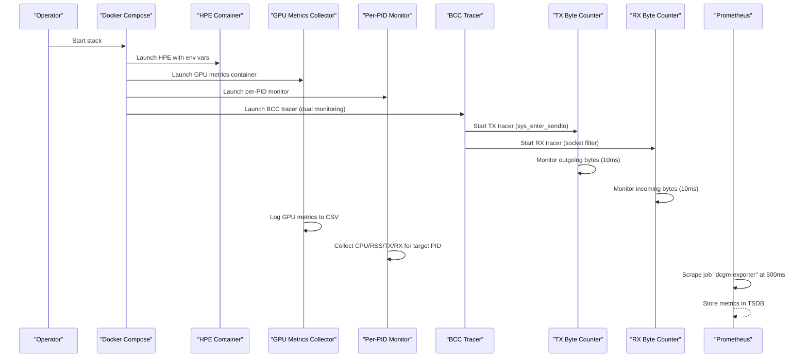
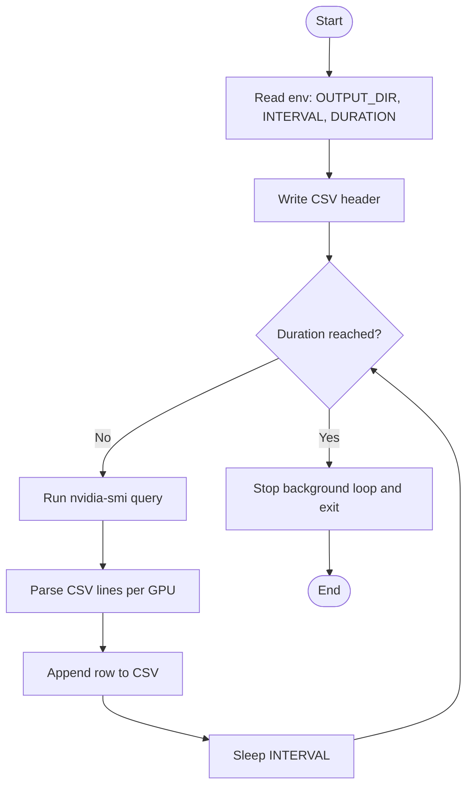
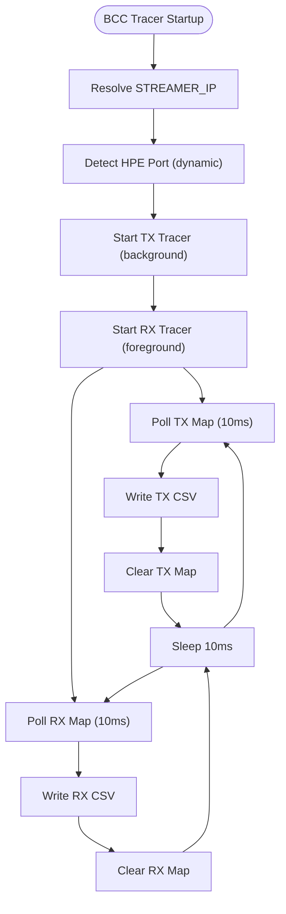
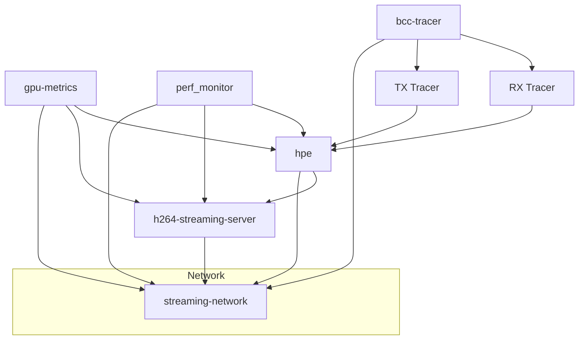
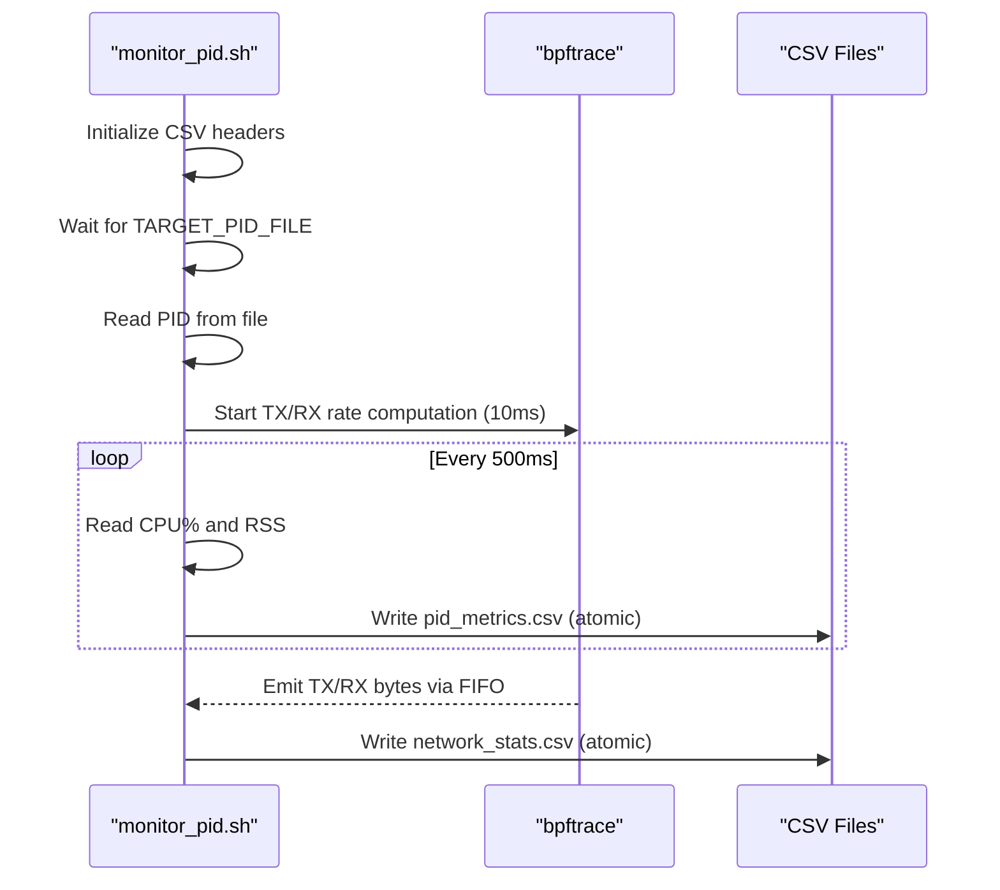
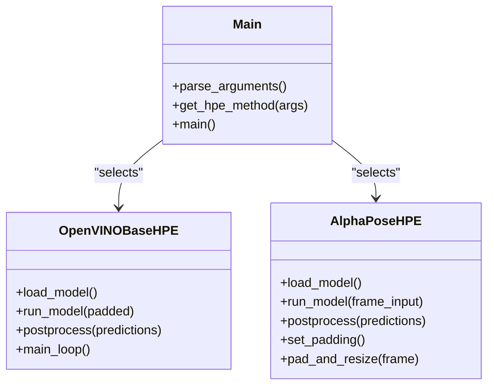
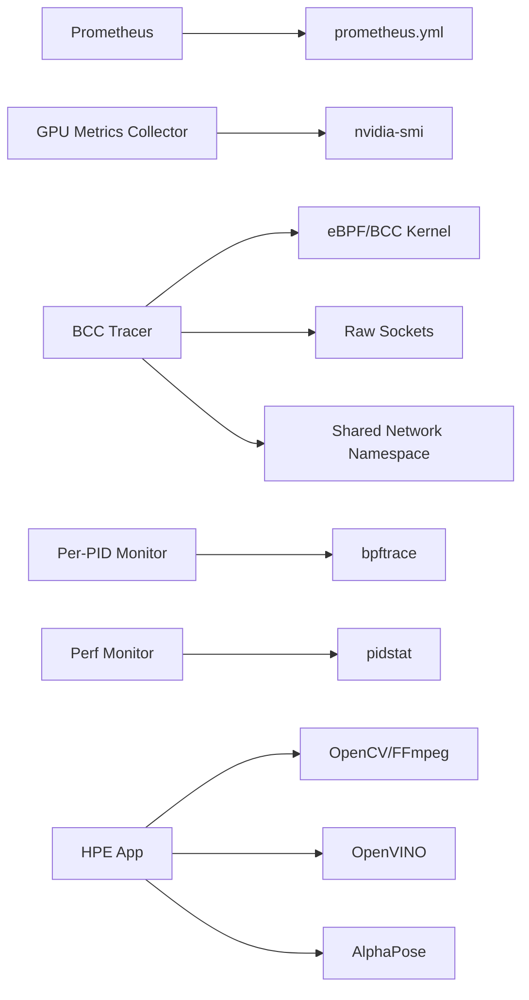

# Metrics Collection

<cite>
**Referenced Files in This Document**
- [prometheus.yml](file://prometheus.yml)
- [docker-compose.yaml](file://ffmpeg_hpe/docker-compose.yaml)
- [run_nvidia_dcgm.sh](file://ffmpeg_hpe/run_nvidia_dcgm.sh)
- [Dockerfile.gpu_metrics](file://ffmpeg_hpe/Dockerfile.gpu_metrics)
- [monitor_pid.sh](file://monitor_hpe/monitor_pid.sh)
- [monitor_pid_perf.sh](file://recent-dash/perf_monitor/monitor_pid_perf.sh)
- [main.py](file://main.py)
- [openvino_base_hpe.py](file://openvino_base_hpe.py)
- [alphapose_hpe.py](file://alphapose_hpe.py)
- [bcc_tx_bytes.py](file://ffmpeg_hpe/bpftrace-tracer/bcc_tx_bytes.py)
- [bcc_rx_bytes.py](file://ffmpeg_hpe/bpftrace-tracer/bcc_rx_bytes.py)
- [entrypoint.sh](file://ffmpeg_hpe/bpftrace-tracer/entrypoint.sh)
- [Dockerfile.bcc](file://ffmpeg_hpe/bpftrace-tracer/Dockerfile.bcc)
- [bcc-bpf-tracing.md](file://docs/bcc-bpf-tracing.md)
- [run_experiment.sh](file://ffmpeg_hpe/run_experiment.sh)
</cite>

## Update Summary
**Changes Made**
- Added comprehensive BCC-based TX byte counter implementation with PID file handling
- Enhanced dual-tracing architecture with both TX (bcc_tx_bytes.py) and RX (bcc_rx_bytes.py) traffic monitoring capabilities
- Integrated configurable polling intervals (default 10ms) for both TX and RX monitoring
- Updated Docker Compose orchestration to include bcc-tracer service with proper privilege configuration
- Added detailed documentation for BCC/BPF network tracing system

## Table of Contents
1. [Introduction](#introduction)
2. [Project Structure](#project-structure)
3. [Core Components](#core-components)
4. [Architecture Overview](#architecture-overview)
5. [Detailed Component Analysis](#detailed-component-analysis)
6. [Dependency Analysis](#dependency-analysis)
7. [Performance Considerations](#performance-considerations)
8. [Troubleshooting Guide](#troubleshooting-guide)
9. [Conclusion](#conclusion)

## Introduction
This document describes the metrics collection infrastructure for the Human Pose Estimation (HPE) framework. It explains how GPU metrics are collected using NVIDIA SMI-based scripts integrated into Docker containers, how Prometheus scrapes those metrics, and how Docker Compose orchestrates the HPE pipeline along with monitoring services. The system now includes comprehensive BCC-based network traffic monitoring with both TX (outgoing) and RX (incoming) byte counting capabilities, providing complete visibility into video streaming performance during HPE experiments.

## Project Structure
The metrics collection spans several components with enhanced BCC-based network monitoring:
- Prometheus configuration defines the scrape job for GPU metrics.
- Docker Compose orchestrates the HPE pipeline, GPU metrics collector, per-PID/perf monitors, and BCC-based network traffic tracers.
- Scripts collect GPU utilization, memory, temperature, and power metrics at configurable intervals.
- BCC-based tracers provide kernel-level monitoring of video stream traffic with 10ms precision.
- Additional scripts collect CPU and network metrics for the HPE process.

```mermaid
graph TB
subgraph "Prometheus Stack"
P["Prometheus<br/>config: prometheus.yml"]
end
subgraph "HPE Pipeline"
HPE["HPE Application<br/>main.py"]
HPE_OV["OpenVINO HPE<br/>openvino_base_hpe.py"]
HPE_AP["AlphaPose HPE<br/>alphapose_hpe.py"]
end
subgraph "Monitoring"
DCMG["DCGM Exporter<br/>scrape job: dcgm-exporter:9400"]
GMET["GPU Metrics Collector<br/>run_nvidia_dcgm.sh"]
PMH["Per-PID Monitor<br/>monitor_pid.sh"]
PMR["Perf Monitor<br/>monitor_pid_perf.sh"]
BCC["BCC Tracer<br/>Dual TX/RX Monitoring"]
TX["TX Byte Counter<br/>bcc_tx_bytes.py"]
RX["RX Byte Counter<br/>bcc_rx_bytes.py"]
END
HPE --> HPE_OV
HPE --> HPE_AP
HPE --> PMH
HPE --> PMR
HPE --> BCC
GMET --> P
DCMG --> P
BCC --> TX
BCC --> RX
TX --> P
RX --> P
```

**Diagram sources**
- [prometheus.yml:1-8](file://prometheus.yml#L1-L8)
- [docker-compose.yaml:1-239](file://ffmpeg_hpe/docker-compose.yaml#L1-L239)
- [run_nvidia_dcgm.sh:1-84](file://ffmpeg_hpe/run_nvidia_dcgm.sh#L1-L84)
- [monitor_pid.sh:1-215](file://monitor_hpe/monitor_pid.sh#L1-L215)
- [monitor_pid_perf.sh:1-72](file://recent-dash/perf_monitor/monitor_pid_perf.sh#L1-L72)
- [bcc_tx_bytes.py:1-120](file://ffmpeg_hpe/bpftrace-tracer/bcc_tx_bytes.py#L1-L120)
- [bcc_rx_bytes.py:1-125](file://ffmpeg_hpe/bpftrace-tracer/bcc_rx_bytes.py#L1-L125)

**Section sources**
- [prometheus.yml:1-8](file://prometheus.yml#L1-L8)
- [docker-compose.yaml:1-239](file://ffmpeg_hpe/docker-compose.yaml#L1-L239)

## Core Components
- Prometheus scrape configuration for GPU metrics:
  - Defines a job named dcgm-exporter with a 500ms scrape interval targeting dcgm-exporter:9400.
- GPU metrics collection:
  - A containerized script logs GPU utilization, memory utilization, temperature, and power draw to CSV at a configurable interval.
  - The script supports environment-driven configuration for output directory, interval, and duration.
- Docker Compose orchestration:
  - Services for HPE, GPU metrics collector, per-PID/perf monitors, and BCC-based network tracers are defined with health checks, resource limits, and shared networking.
- BCC-based network monitoring:
  - Dual-tracing architecture with both TX (outgoing) and RX (incoming) byte counters using BCC/BPF.
  - TX tracer monitors bytes sent by the HPE process via sys_enter_sendto tracepoint.
  - RX tracer monitors incoming video stream bytes via socket filter on the network interface.
  - Configurable polling intervals (default 10ms) with PID file handling for process identification.
- CPU and network metrics:
  - Per-PID monitor exports CPU percentage, RSS memory, and TX/RX byte counters for a target PID to CSV.
  - Perf monitor aggregates total CPU and memory across monitored PIDs at 1-second intervals.

**Section sources**
- [prometheus.yml:1-8](file://prometheus.yml#L1-L8)
- [run_nvidia_dcgm.sh:1-84](file://ffmpeg_hpe/run_nvidia_dcgm.sh#L1-L84)
- [Dockerfile.gpu_metrics:1-20](file://ffmpeg_hpe/Dockerfile.gpu_metrics#L1-L20)
- [docker-compose.yaml:1-239](file://ffmpeg_hpe/docker-compose.yaml#L1-L239)
- [monitor_pid.sh:1-215](file://monitor_hpe/monitor_pid.sh#L1-L215)
- [monitor_pid_perf.sh:1-72](file://recent-dash/perf_monitor/monitor_pid_perf.sh#L1-L72)
- [bcc_tx_bytes.py:1-120](file://ffmpeg_hpe/bpftrace-tracer/bcc_tx_bytes.py#L1-L120)
- [bcc_rx_bytes.py:1-125](file://ffmpeg_hpe/bpftrace-tracer/bcc_rx_bytes.py#L1-L125)

## Architecture Overview
The system integrates GPU metrics collection into the HPE experiment pipeline and exposes them to Prometheus, along with comprehensive network traffic monitoring. The HPE application runs under Docker Compose alongside monitoring containers including the new BCC-based dual-tracing architecture. Prometheus scrapes either the DCGM exporter or the GPU metrics CSV endpoint depending on deployment.



**Diagram sources**
- [docker-compose.yaml:1-239](file://ffmpeg_hpe/docker-compose.yaml#L1-L239)
- [prometheus.yml:1-8](file://prometheus.yml#L1-L8)
- [run_nvidia_dcgm.sh:1-84](file://ffmpeg_hpe/run_nvidia_dcgm.sh#L1-L84)
- [monitor_pid.sh:1-215](file://monitor_hpe/monitor_pid.sh#L1-L215)
- [bcc_tx_bytes.py:1-120](file://ffmpeg_hpe/bpftrace-tracer/bcc_tx_bytes.py#L1-L120)
- [bcc_rx_bytes.py:1-125](file://ffmpeg_hpe/bpftrace-tracer/bcc_rx_bytes.py#L1-L125)

## Detailed Component Analysis

### Prometheus Configuration
- Scrape interval globally set to 500ms.
- Job named dcgm-exporter configured to scrape dcgm-exporter:9400 with a 500ms interval.
- This aligns with the GPU metrics collection interval to ensure timely updates.

**Section sources**
- [prometheus.yml:1-8](file://prometheus.yml#L1-L8)

### GPU Metrics Collector (Containerized)
- Purpose: Periodically query GPU metrics via NVIDIA SMI and write to CSV.
- Key behaviors:
  - Accepts METRICS_OUTPUT_DIR, METRICS_INTERVAL, and METRICS_DURATION via environment variables.
  - Writes a CSV header on startup.
  - Iterates every METRICS_INTERVAL seconds, appending timestamped rows until METRICS_DURATION elapses or container stops.
  - Uses signal trapping to gracefully stop the background logging loop.
- Output: CSV file containing timestamp, GPU ID, utilization, memory utilization, temperature, and power usage.



**Diagram sources**
- [run_nvidia_dcgm.sh:1-84](file://ffmpeg_hpe/run_nvidia_dcgm.sh#L1-L84)

**Section sources**
- [run_nvidia_dcgm.sh:1-84](file://ffmpeg_hpe/run_nvidia_dcgm.sh#L1-L84)
- [Dockerfile.gpu_metrics:1-20](file://ffmpeg_hpe/Dockerfile.gpu_metrics#L1-L20)

### BCC-Based Network Traffic Monitoring
**Updated** Enhanced with comprehensive dual-tracing architecture supporting both TX and RX byte counting

- Purpose: Provide kernel-level monitoring of video stream traffic with minimal overhead and precise timing.
- Architecture: Dual-tracing system with separate TX and RX monitoring components.
- Key components:
  - **TX Byte Counter (bcc_tx_bytes.py)**: Monitors outgoing bytes from the HPE process using sys_enter_sendto tracepoint.
  - **RX Byte Counter (bcc_rx_bytes.py)**: Monitors incoming video stream bytes using socket filter on the network interface.
  - **Entrypoint Script (entrypoint.sh)**: Manages both tracers, handles PID detection, and manages network interface selection.
- BCC Configuration:
  - Requires privileged container with SYS_ADMIN, NET_ADMIN, NET_RAW, IPC_LOCK, and SYS_RESOURCE capabilities.
  - Shares HPE's network namespace (network_mode: service:hpe) for accurate traffic filtering.
  - Uses configurable polling intervals (default 10ms) via BCC_POLL_INTERVAL_S environment variable.
  - Implements PID file handling with wait_for_pid function for robust process detection.
- Output formats:
  - TX tracer: hpe_video_tx.csv with timestamp_ms, tx_bytes_delta, tx_bytes_current, tx_bytes_prev, dt_ms columns.
  - RX tracer: hpe_video_rx.csv with timestamp_ms, rx_video_bytes_delta, rx_video_bytes_current, rx_video_bytes_prev, dt_ms columns.



**Diagram sources**
- [bcc_tx_bytes.py:38-119](file://ffmpeg_hpe/bpftrace-tracer/bcc_tx_bytes.py#L38-L119)
- [bcc_rx_bytes.py:92-124](file://ffmpeg_hpe/bpftrace-tracer/bcc_rx_bytes.py#L92-L124)
- [entrypoint.sh:67-73](file://ffmpeg_hpe/bpftrace-tracer/entrypoint.sh#L67-L73)

**Section sources**
- [bcc_tx_bytes.py:1-120](file://ffmpeg_hpe/bpftrace-tracer/bcc_tx_bytes.py#L1-L120)
- [bcc_rx_bytes.py:1-125](file://ffmpeg_hpe/bpftrace-tracer/bcc_rx_bytes.py#L1-L125)
- [entrypoint.sh:1-74](file://ffmpeg_hpe/bpftrace-tracer/entrypoint.sh#L1-L74)
- [Dockerfile.bcc:1-49](file://ffmpeg_hpe/bpftrace-tracer/Dockerfile.bcc#L1-L49)
- [bcc-bpf-tracing.md:1-369](file://docs/bcc-bpf-tracing.md#L1-L369)

### Docker Compose Orchestration
**Updated** Enhanced with BCC tracer service integration

- Services:
  - h264-streaming-server: RTSP/IP camera streaming server.
  - hpe: HPE application container with GPU runtime and environment variables for input, timeouts, and measurement interval.
  - gpu-metrics: Containerized GPU metrics logger using the NVIDIA runtime.
  - perf_monitor: Host PID monitor with elevated privileges for system-level metrics.
  - bcc-tracer: **Enhanced** BPF-based traffic tracer with dual TX/RX monitoring, sharing HPE's network namespace.
- Networking: A shared bridge network is defined for inter-service communication.
- Health checks: Services define health checks to ensure readiness.
- Resource limits: CPU/memory limits and reservations are set for predictable performance.
- BCC Service Configuration:
  - Privileged container with comprehensive capability additions (SYS_ADMIN, NET_ADMIN, NET_RAW, IPC_LOCK, SYS_RESOURCE).
  - Shares HPE's network namespace via network_mode: service:hpe.
  - Mounts kernel modules, headers, and debug interfaces for BCC compilation.
  - Configurable polling interval via BCC_POLL_INTERVAL_S environment variable.



**Diagram sources**
- [docker-compose.yaml:196-235](file://ffmpeg_hpe/docker-compose.yaml#L196-L235)

**Section sources**
- [docker-compose.yaml:1-239](file://ffmpeg_hpe/docker-compose.yaml#L1-L239)

### Per-PID Monitor (CPU/RAM/TX/RX)
- Purpose: Export CPU percentage, RSS memory, and TX/RX bytes for a target PID to CSV.
- Mechanism:
  - Reads TARGET_PID_FILE to locate the target process.
  - Starts a background bpftrace session to compute TX/RX rates at 10ms intervals and emits to a FIFO.
  - Aggregates metrics every 500ms and writes to CSV with flock-based atomic writes.
  - Supports graceful shutdown via signal traps.
- Outputs:
  - pid_metrics.csv: timestamp, pid, cpu_percent, mem_rss_kb, tx_bytes, rx_bytes.
  - network_stats.csv: timestamp, pid, interface, bytes, sent flag.



**Diagram sources**
- [monitor_pid.sh:1-215](file://monitor_hpe/monitor_pid.sh#L1-L215)

**Section sources**
- [monitor_pid.sh:1-215](file://monitor_hpe/monitor_pid.sh#L1-L215)

### Perf Monitor (Aggregate CPU/Memory)
- Purpose: Aggregate total CPU and RSS across monitored PIDs at 1-second intervals.
- Mechanism:
  - Reads PIDs from TARGET_PID_FILE and computes totals using pidstat.
  - Writes timestamp, total_cpu_percent, total_mem_rss_kb, and active_pids to CSV.
- Output: perf_metrics.csv.

**Section sources**
- [monitor_pid_perf.sh:1-72](file://recent-dash/perf_monitor/monitor_pid_perf.sh#L1-L72)

### HPE Application Metrics Integration
- The HPE application accepts a measurement interval argument for transmitting data volume measurements.
- OpenVINO HPE supports CPU/GPU inference and exposes performance-related configuration via environment variables.
- AlphaPose HPE integrates GPU/CPU device selection and batching parameters.



**Diagram sources**
- [main.py:1-99](file://main.py#L1-L99)
- [openvino_base_hpe.py:1-653](file://openvino_base_hpe.py#L1-L653)
- [alphapose_hpe.py:1-334](file://alphapose_hpe.py#L1-L334)

**Section sources**
- [main.py:1-99](file://main.py#L1-L99)
- [openvino_base_hpe.py:1-653](file://openvino_base_hpe.py#L1-L653)
- [alphapose_hpe.py:1-334](file://alphapose_hpe.py#L1-L334)

## Dependency Analysis
**Updated** Enhanced with BCC-based network monitoring dependencies

- Prometheus depends on the scrape job configuration to reach the metrics endpoint.
- The GPU metrics collector depends on NVIDIA drivers and nvidia-smi availability inside the container.
- **Enhanced** BCC-based network monitoring depends on:
  - Kernel support for eBPF/BCC (CONFIG_BPF, CONFIG_BPF_SYSCALL, CONFIG_BPF_JIT).
  - Raw socket capabilities and SYS_ADMIN privileges for BPF program loading.
  - Shared network namespace between HPE and tracer containers.
  - Dynamic port detection for accurate traffic filtering.
- Per-PID and perf monitors depend on host PID visibility and kernel tracing capabilities.
- HPE depends on input sources (RTSP, webcam, file) and environment variables controlling timeouts and measurement intervals.



**Diagram sources**
- [prometheus.yml:1-8](file://prometheus.yml#L1-L8)
- [run_nvidia_dcgm.sh:1-84](file://ffmpeg_hpe/run_nvidia_dcgm.sh#L1-L84)
- [bcc_tx_bytes.py:12-16](file://ffmpeg_hpe/bpftrace-tracer/bcc_tx_bytes.py#L12-L16)
- [bcc_rx_bytes.py:1-7](file://ffmpeg_hpe/bpftrace-tracer/bcc_rx_bytes.py#L1-L7)
- [monitor_pid.sh:1-215](file://monitor_hpe/monitor_pid.sh#L1-L215)
- [monitor_pid_perf.sh:1-72](file://recent-dash/perf_monitor/monitor_pid_perf.sh#L1-L72)
- [openvino_base_hpe.py:1-653](file://openvino_base_hpe.py#L1-L653)
- [alphapose_hpe.py:1-334](file://alphapose_hpe.py#L1-L334)

**Section sources**
- [prometheus.yml:1-8](file://prometheus.yml#L1-L8)
- [run_nvidia_dcgm.sh:1-84](file://ffmpeg_hpe/run_nvidia_dcgm.sh#L1-L84)
- [bcc_tx_bytes.py:1-120](file://ffmpeg_hpe/bpftrace-tracer/bcc_tx_bytes.py#L1-L120)
- [bcc_rx_bytes.py:1-125](file://ffmpeg_hpe/bpftrace-tracer/bcc_rx_bytes.py#L1-L125)
- [monitor_pid.sh:1-215](file://monitor_hpe/monitor_pid.sh#L1-L215)
- [monitor_pid_perf.sh:1-72](file://recent-dash/perf_monitor/monitor_pid_perf.sh#L1-L72)
- [openvino_base_hpe.py:1-653](file://openvino_base_hpe.py#L1-L653)
- [alphapose_hpe.py:1-334](file://alphapose_hpe.py#L1-L334)

## Performance Considerations
**Updated** Enhanced with BCC-based network monitoring performance characteristics

- Scraping interval: Prometheus scrape interval is 500ms; ensure GPU metrics collection interval matches to avoid gaps.
- **Enhanced** BCC monitoring overhead:
  - Both TX and RX tracers operate at 10ms intervals with minimal kernel-space processing overhead.
  - In-kernel aggregation eliminates per-packet userspace overhead for both directions.
  - Shared network namespace ensures accurate traffic filtering without additional network processing.
  - Memory-mapped BPF hash tables provide efficient byte counting with automatic cleanup.
- Monitoring overhead:
  - Per-PID monitor runs bpftrace at 10ms intervals and writes CSV every 500ms; keep intervals balanced to reduce I/O contention.
  - Perf monitor uses pidstat at 1-second intervals for aggregated metrics to minimize overhead.
  - HPE measurement interval can be tuned via command-line arguments to balance accuracy and throughput.
- Resource limits: Set CPU and memory limits on monitoring containers to prevent interference with HPE workloads.
- GPU runtime: Ensure NVIDIA runtime and device visibility are configured for GPU-enabled containers.
- **New** BCC container isolation: The bcc-tracer service runs with comprehensive privileges but is isolated to the HPE network namespace to prevent system-wide impact.

## Troubleshooting Guide
**Updated** Enhanced with BCC-based network monitoring troubleshooting

- Prometheus cannot scrape metrics:
  - Verify the scrape job name and target in the Prometheus configuration match the exporter endpoint.
  - Confirm the exporter is reachable from the Prometheus container and the network configuration allows access.
- GPU metrics CSV not updating:
  - Check that nvidia-smi is available inside the GPU metrics container.
  - Validate environment variables for output directory, interval, and duration.
  - Ensure the container has GPU runtime enabled and device visibility.
- **New** BCC tracer issues:
  - **BPF program fails to load**: Check kernel BPF support (CONFIG_BPF, CONFIG_BPF_SYSCALL, CONFIG_BPF_JIT) and verify kernel headers are available.
  - **Missing privileges**: Ensure bcc-tracer container has SYS_ADMIN, NET_ADMIN, NET_RAW, IPC_LOCK, and SYS_RESOURCE capabilities.
  - **Port detection failures**: Verify HPE establishes connection to RTSP broker before tracer starts; check bcc-tracer logs for port detection messages.
  - **Empty TX/RX data**: Confirm HPE is using TCP transport (OPENCV_FFMPEG_CAPTURE_OPTIONS=rtsp_transport;tcp) for accurate filtering.
  - **Interface not found**: Verify the detected network interface exists and is accessible within the container.
- **Enhanced** Per-PID monitor not writing CSV:
  - Confirm TARGET_PID_FILE exists and is readable by the monitor.
  - Verify bpftrace is present and the container has required capabilities (SYS_ADMIN, NET_ADMIN, NET_RAW).
  - Check filesystem permissions for the output directory.
- HPE process not detected:
  - Ensure the HPE container writes the PID file expected by the monitor.
  - Confirm the monitor's TARGET_PID_FILE path matches the mounted volume.

**Section sources**
- [prometheus.yml:1-8](file://prometheus.yml#L1-L8)
- [run_nvidia_dcgm.sh:1-84](file://ffmpeg_hpe/run_nvidia_dcgm.sh#L1-L84)
- [bcc_tx_bytes.py:21-36](file://ffmpeg_hpe/bpftrace-tracer/bcc_tx_bytes.py#L21-L36)
- [bcc_rx_bytes.py:12-28](file://ffmpeg_hpe/bpftrace-tracer/bcc_rx_bytes.py#L12-L28)
- [entrypoint.sh:26-31](file://ffmpeg_hpe/bpftrace-tracer/entrypoint.sh#L26-L31)
- [docker-compose.yaml:196-235](file://ffmpeg_hpe/docker-compose.yaml#L196-L235)
- [monitor_pid.sh:1-215](file://monitor_hpe/monitor_pid.sh#L1-L215)
- [docker-compose.yaml:1-239](file://ffmpeg_hpe/docker-compose.yaml#L1-L239)

## Conclusion
The HPE metrics collection infrastructure combines containerized GPU metrics logging, comprehensive BCC-based network traffic monitoring, per-process CPU/RAM/TX/RX monitoring, and Prometheus scraping. The enhanced dual-tracing architecture with both TX and RX byte counters provides complete visibility into video streaming performance during HPE experiments. Docker Compose ensures coordinated startup and health checks, while environment variables enable flexible configuration. The BCC-based monitoring operates at kernel level with minimal overhead, using 10ms polling intervals for precise timing. By aligning scrape intervals with collection intervals and applying appropriate resource limits, operators can achieve reliable, low-overhead monitoring of GPU utilization, memory, thermal metrics, network traffic, and system-level performance during HPE experiments.