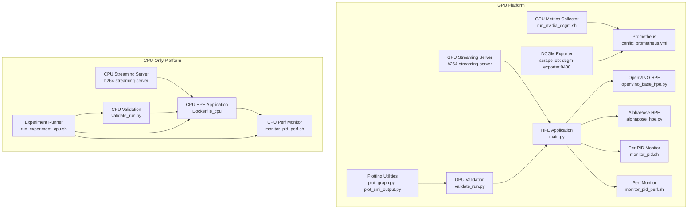
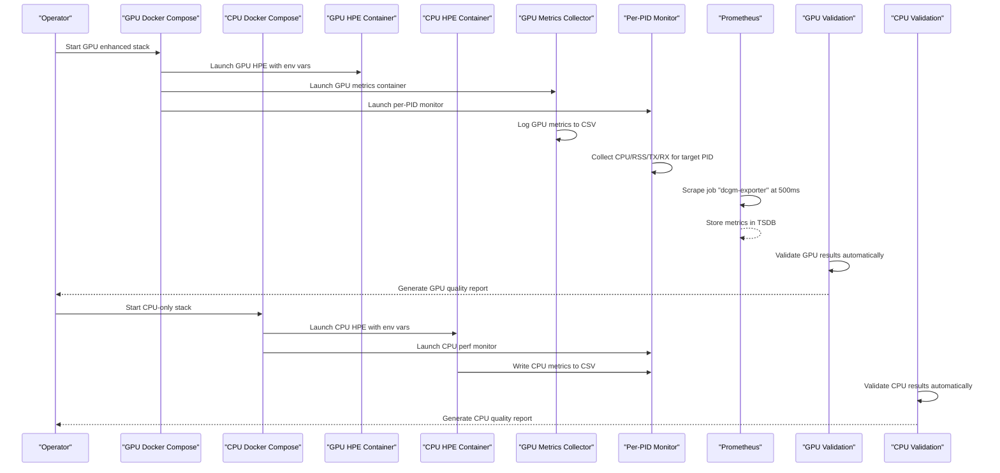
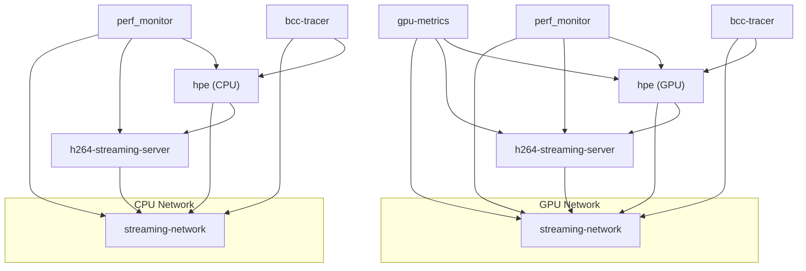
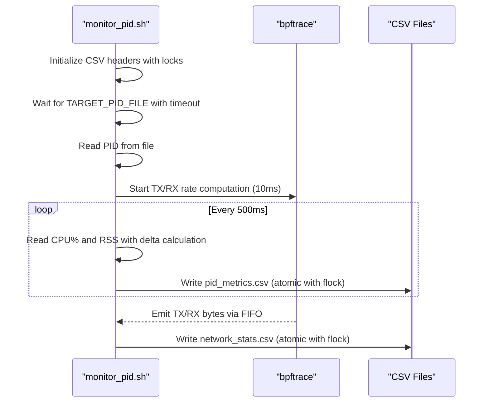
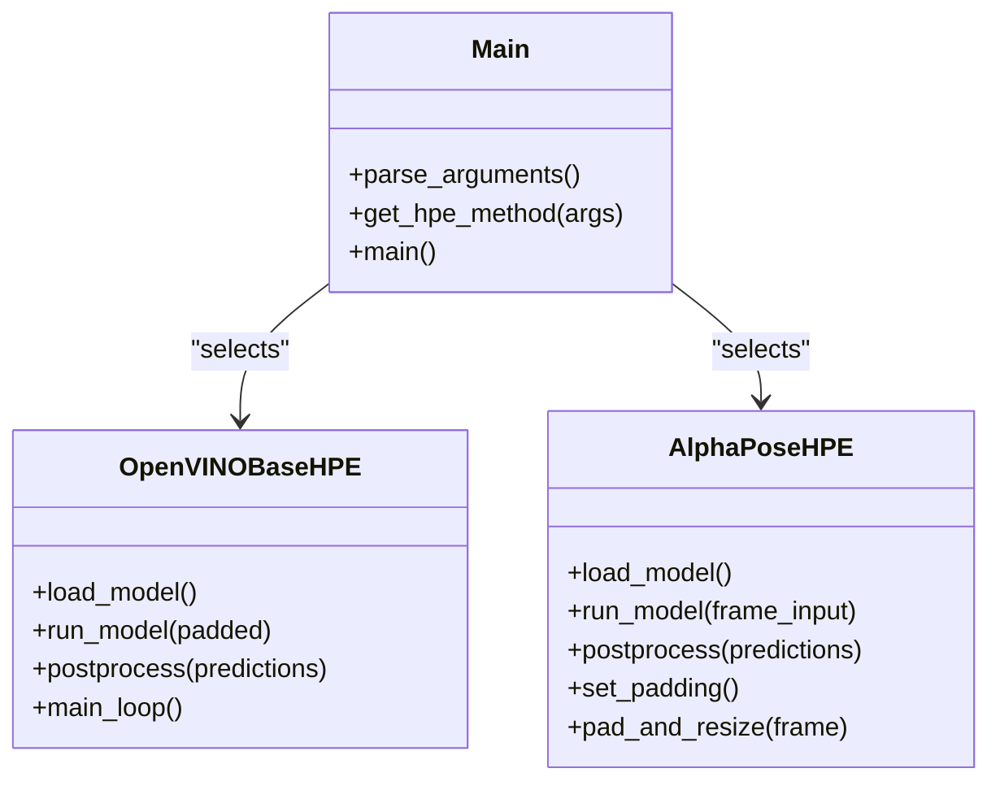
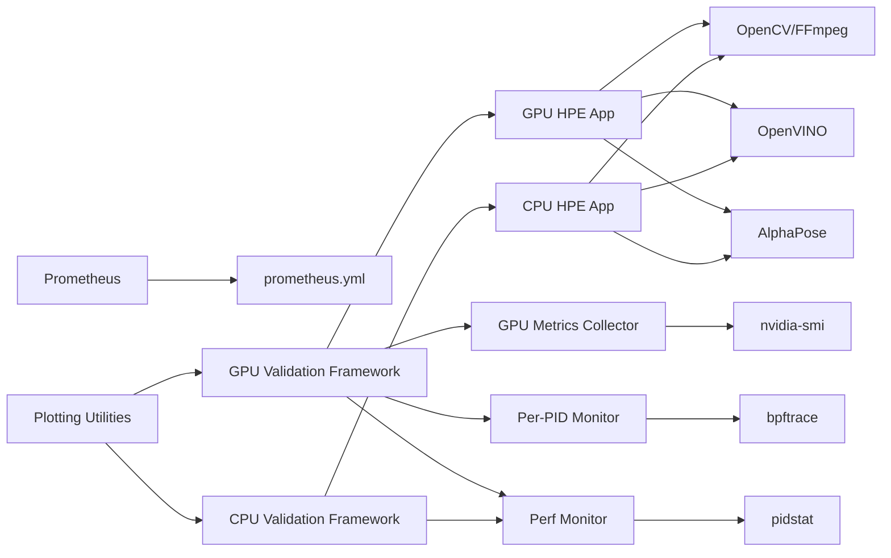

# Metrics Collection

<cite>
**Referenced Files in This Document**
- [prometheus.yml](file://prometheus.yml)
- [docker-compose.yaml](file://ffmpeg_hpe/docker-compose.yaml)
- [docker-compose.cpu.yaml](file://ffmpeg_hpe_cpu/docker-compose.cpu.yaml)
- [run_nvidia_dcgm.sh](file://ffmpeg_hpe/run_nvidia_dcgm.sh)
- [Dockerfile.gpu_metrics](file://ffmpeg_hpe/Dockerfile.gpu_metrics)
- [Dockerfile_cpu](file://Dockerfile_cpu)
- [Dockerfile_base](file://Dockerfile_base)
- [monitor_pid.sh](file://monitor_hpe/monitor_pid.sh)
- [monitor_pid_perf.sh](file://shared/perf_monitor/monitor_pid_perf.sh)
- [validate_run.py](file://ffmpeg_hpe/validate_run.py)
- [validate_run.py](file://ffmpeg_hpe_cpu/validate_run.py)
- [run_experiment_cpu.sh](file://ffmpeg_hpe_cpu/run_experiment_cpu.sh)
- [plot_graph.py](file://ffmpeg_hpe/plot_graph.py)
- [plot_smi_output.py](file://ffmpeg_hpe/plot_smi_output.py)
- [plot_rx_bytes.py](file://ffmpeg_hpe/plot_rx_bytes.py)
- [plot_rx_bytes_trimmed_reset.py](file://ffmpeg_hpe/plot_rx_bytes_trimmed_reset.py)
- [main.py](file://main.py)
- [openvino_base_hpe.py](file://openvino_base_hpe.py)
- [alphapose_hpe.py](file://alphapose_hpe.py)
- [Dockerfile](file://shared/perf_monitor/Dockerfile)
</cite>

## Update Summary
**Changes Made**
- Enhanced Docker Compose orchestration documentation to cover both GPU and CPU-only platforms
- Updated file naming conventions and output organization standards
- Added documentation for new CPU-only metrics collection and validation workflows
- Expanded platform-specific service configurations and environment variable handling
- Documented separate validation frameworks for GPU and CPU-only experiments

## Table of Contents
1. [Introduction](#introduction)
2. [Project Structure](#project-structure)
3. [Core Components](#core-components)
4. [Architecture Overview](#architecture-overview)
5. [Platform-Specific Implementations](#platform-specific-implementations)
6. [Detailed Component Analysis](#detailed-component-analysis)
7. [Enhanced Validation Framework](#enhanced-validation-framework)
8. [Advanced Monitoring Capabilities](#advanced-monitoring-capabilities)
9. [Dependency Analysis](#dependency-analysis)
10. [Performance Considerations](#performance-considerations)
11. [Troubleshooting Guide](#troubleshooting-guide)
12. [Conclusion](#conclusion)

## Introduction
This document describes the enhanced metrics collection infrastructure for the Human Pose Estimation (HPE) framework, now supporting both GPU-accelerated and CPU-only experimental platforms. The system features integrated validation frameworks, comprehensive performance monitoring, and advanced GPU metrics collection capabilities. It explains how GPU metrics are collected using NVIDIA SMI-based scripts, how Prometheus scrapes those metrics, and how Docker Compose orchestrates the HPE pipeline along with monitoring services. The enhanced system includes automated validation, comprehensive plotting utilities, and robust quality assurance mechanisms tailored for both GPU and CPU-only deployments.

## Project Structure
The enhanced metrics collection spans multiple interconnected components across two distinct platform configurations:
- **GPU Platform**: Full-stack monitoring with GPU metrics, Prometheus integration, and comprehensive validation
- **CPU-Only Platform**: Lightweight monitoring focused on CPU and memory metrics without GPU dependencies
- Prometheus configuration with dedicated scrape jobs for GPU metrics
- Docker Compose orchestration with platform-specific service dependencies and resource management
- Comprehensive validation framework for automated quality assurance
- Advanced plotting utilities for metrics visualization
- Enhanced monitoring infrastructure with BCC tracer integration

**Diagram sources**
- [prometheus.yml:1-8](file://prometheus.yml#L1-L8)
- [docker-compose.yaml:1-206](file://ffmpeg_hpe/docker-compose.yaml#L1-L206)
- [docker-compose.cpu.yaml:1-152](file://ffmpeg_hpe_cpu/docker-compose.cpu.yaml#L1-L152)
- [run_nvidia_dcgm.sh:1-86](file://ffmpeg_hpe/run_nvidia_dcgm.sh#L1-L86)
- [monitor_pid.sh:1-216](file://monitor_hpe/monitor_pid.sh#L1-L216)
- [monitor_pid_perf.sh:1-107](file://shared/perf_monitor/monitor_pid_perf.sh#L1-L107)
- [validate_run.py:1-521](file://ffmpeg_hpe/validate_run.py#L1-L521)
- [validate_run.py:1-521](file://ffmpeg_hpe_cpu/validate_run.py#L1-L521)
- [run_experiment_cpu.sh:1-328](file://ffmpeg_hpe_cpu/run_experiment_cpu.sh#L1-L328)

**Section sources**
- [prometheus.yml:1-8](file://prometheus.yml#L1-L8)
- [docker-compose.yaml:1-206](file://ffmpeg_hpe/docker-compose.yaml#L1-L206)
- [docker-compose.cpu.yaml:1-152](file://ffmpeg_hpe_cpu/docker-compose.cpu.yaml#L1-L152)

## Core Components
- **Dual Platform Architecture**: Supports both GPU-accelerated and CPU-only experimental environments with platform-specific configurations
- **Prometheus scrape configuration**: Defines dedicated jobs for GPU metrics with 500ms scrape intervals targeting dcgm-exporter:9400
- **Enhanced GPU metrics collection**: Containerized scripts with improved Docker orchestration, supporting environment-driven configuration for output directories, intervals, and durations
- **Comprehensive validation framework**: Automated quality assurance system validating HPE outputs, GPU metrics, performance data, and network traces
- **Advanced plotting utilities**: Multiple visualization scripts for metrics analysis and reporting
- **Improved Docker Compose orchestration**: Enhanced service dependencies, resource limits, health checks, and GPU runtime configuration
- **Enhanced CPU and network metrics**: Per-PID monitor with improved accuracy and perf monitor with comprehensive system-level metrics
- **BCC tracer integration**: Advanced network traffic tracing with container-specific monitoring capabilities
- **Platform-Specific Optimizations**: Tailored configurations for different hardware capabilities and resource constraints

**Section sources**
- [prometheus.yml:1-8](file://prometheus.yml#L1-L8)
- [run_nvidia_dcgm.sh:1-86](file://ffmpeg_hpe/run_nvidia_dcgm.sh#L1-L86)
- [Dockerfile.gpu_metrics:1-20](file://ffmpeg_hpe/Dockerfile.gpu_metrics#L1-L20)
- [Dockerfile_cpu:1-100](file://Dockerfile_cpu#L1-L100)
- [docker-compose.yaml:1-206](file://ffmpeg_hpe/docker-compose.yaml#L1-L206)
- [docker-compose.cpu.yaml:1-152](file://ffmpeg_hpe_cpu/docker-compose.cpu.yaml#L1-L152)
- [monitor_pid.sh:1-216](file://monitor_hpe/monitor_pid.sh#L1-L216)
- [monitor_pid_perf.sh:1-107](file://shared/perf_monitor/monitor_pid_perf.sh#L1-L107)
- [validate_run.py:1-521](file://ffmpeg_hpe/validate_run.py#L1-L521)
- [validate_run.py:1-521](file://ffmpeg_hpe_cpu/validate_run.py#L1-L521)

## Architecture Overview
The enhanced system integrates comprehensive GPU metrics collection, automated validation, and advanced monitoring into the HPE experiment pipeline across two distinct platform configurations. The architecture now includes platform-specific validation frameworks that automatically verify experiment quality and generate detailed reports tailored to each deployment scenario.

**Diagram sources**
- [docker-compose.yaml:1-206](file://ffmpeg_hpe/docker-compose.yaml#L1-L206)
- [docker-compose.cpu.yaml:1-152](file://ffmpeg_hpe_cpu/docker-compose.cpu.yaml#L1-L152)
- [prometheus.yml:1-8](file://prometheus.yml#L1-L8)
- [run_nvidia_dcgm.sh:1-86](file://ffmpeg_hpe/run_nvidia_dcgm.sh#L1-L86)
- [monitor_pid.sh:1-216](file://monitor_hpe/monitor_pid.sh#L1-L216)
- [validate_run.py:1-521](file://ffmpeg_hpe/validate_run.py#L1-L521)
- [validate_run.py:1-521](file://ffmpeg_hpe_cpu/validate_run.py#L1-L521)

## Platform-Specific Implementations

### GPU Platform Configuration
The GPU platform provides comprehensive monitoring with full hardware acceleration support:

**Key Features**:
- **GPU Runtime Configuration**: NVIDIA runtime with visible device management and driver capabilities
- **DCGM Exporter Integration**: Prometheus-compatible GPU metrics collection
- **Full Validation Suite**: Complete validation including GPU metrics, CPU performance, and network traces
- **Advanced Resource Management**: GPU device reservations and CPU/memory limits for optimal performance

**Section sources**
- [docker-compose.yaml:1-206](file://ffmpeg_hpe/docker-compose.yaml#L1-L206)
- [Dockerfile.gpu_metrics:1-20](file://ffmpeg_hpe/Dockerfile.gpu_metrics#L1-L20)

### CPU-Only Platform Configuration
The CPU-only platform provides lightweight monitoring optimized for CPU-centric deployments:

**Key Features**:
- **CPU-Only Container**: Dockerfile_cpu excludes GPU dependencies and PyNvCodec
- **Simplified Validation**: Focuses on CPU performance, memory usage, and basic network metrics
- **Reduced Overhead**: Minimal resource requirements with streamlined monitoring components
- **Environment Variable Optimization**: Platform-specific tuning for CPU performance

**Section sources**
- [docker-compose.cpu.yaml:1-152](file://ffmpeg_hpe_cpu/docker-compose.cpu.yaml#L1-L152)
- [Dockerfile_cpu:1-100](file://Dockerfile_cpu#L1-L100)
- [run_experiment_cpu.sh:1-328](file://ffmpeg_hpe_cpu/run_experiment_cpu.sh#L1-L328)

### Platform Comparison Matrix

| Feature | GPU Platform | CPU-Only Platform |
|---------|--------------|-------------------|
| **GPU Support** | Full NVIDIA runtime | No GPU dependencies |
| **DCGM Exporter** | Integrated monitoring | Not applicable |
| **Validation Scope** | GPU + CPU + Network | CPU + Network only |
| **Resource Requirements** | Higher (GPU memory, compute) | Lower (CPU-focused) |
| **Monitoring Complexity** | Full stack monitoring | Simplified monitoring |
| **Use Case** | GPU-accelerated inference | CPU-only inference |

## Detailed Component Analysis

### Prometheus Configuration
- **Scrape interval**: Globally set to 500ms for optimal GPU metrics resolution
- **Job configuration**: Dedicated job named "dcgm-exporter" configured to scrape dcgm-exporter:9400 with 500ms interval
- **Exporter alignment**: Ensures scrape intervals match GPU metrics collection timing for consistent data

**Section sources**
- [prometheus.yml:1-8](file://prometheus.yml#L1-L8)

### Enhanced GPU Metrics Collector (Containerized)
- **Purpose**: Periodically query GPU metrics via NVIDIA SMI and write to CSV with improved error handling
- **Key improvements**:
  - Enhanced environment variable support with defaults for output directory, interval, and duration
  - Improved signal handling with proper cleanup procedures
  - Robust CSV header creation and validation
  - Background monitoring loop with graceful shutdown capabilities
  - Real-time timestamp generation with nanosecond precision
- **Output format**: CSV containing timestamp, GPU ID, utilization percentage, memory utilization, temperature, and power usage

**Diagram sources**
- [run_nvidia_dcgm.sh:1-86](file://ffmpeg_hpe/run_nvidia_dcgm.sh#L1-L86)

**Section sources**
- [run_nvidia_dcgm.sh:1-86](file://ffmpeg_hpe/run_nvidia_dcgm.sh#L1-L86)
- [Dockerfile.gpu_metrics:1-20](file://ffmpeg_hpe/Dockerfile.gpu_metrics#L1-L20)

### Enhanced Docker Compose Orchestration
- **Service enhancements**:
  - Improved GPU runtime configuration with NVIDIA_VISIBLE_DEVICES and CUDA_VISIBLE_DEVICES
  - Enhanced resource management with CPU and memory limits/reservations
  - Advanced health checks for all services with appropriate intervals and timeouts
  - Streamlined environment variables for HPE optimization (OpenVINO tuning, threading)
  - Enhanced networking with shared bridge network and DNS configuration
- **Security improvements**:
  - No-new-privileges settings and read-only filesystem configurations
  - Privileged mode for BCC tracer with specific capability additions
  - SYS_ADMIN, NET_ADMIN, NET_RAW capabilities for monitoring functions
- **Service dependencies**: Enhanced dependency chains ensuring proper startup order

**Diagram sources**
- [docker-compose.yaml:1-206](file://ffmpeg_hpe/docker-compose.yaml#L1-L206)
- [docker-compose.cpu.yaml:1-152](file://ffmpeg_hpe_cpu/docker-compose.cpu.yaml#L1-L152)

**Section sources**
- [docker-compose.yaml:1-206](file://ffmpeg_hpe/docker-compose.yaml#L1-L206)
- [docker-compose.cpu.yaml:1-152](file://ffmpeg_hpe_cpu/docker-compose.cpu.yaml#L1-L152)

### Enhanced Per-PID Monitor (CPU/RAM/TX/RX)
- **Purpose**: Export comprehensive CPU percentage, RSS memory, and TX/RX bytes for target PID to CSV with improved accuracy
- **Enhanced features**:
  - Atomic file writing with flock-based locking for thread safety
  - Improved bpftrace integration with 10ms sampling intervals
  - Enhanced FIFO-based communication for network statistics
  - Comprehensive error handling and cleanup procedures
  - PID file timeout handling with graceful degradation
- **Output formats**:
  - pid_metrics.csv: timestamp, pid, cpu_percent, mem_rss_kb, tx_bytes, rx_bytes
  - network_stats.csv: timestamp, pid, interface, bytes, sent flag indicators

**Diagram sources**
- [monitor_pid.sh:1-216](file://monitor_hpe/monitor_pid.sh#L1-L216)

**Section sources**
- [monitor_pid.sh:1-216](file://monitor_hpe/monitor_pid.sh#L1-L216)

### Enhanced Perf Monitor (Aggregate CPU/Memory)
- **Purpose**: Aggregate total CPU and RSS across monitored PIDs at configurable intervals with improved accuracy
- **Enhanced capabilities**:
  - Configurable monitoring intervals via INTERVAL environment variable
  - Comprehensive PID file handling with multiple PID support
  - Enhanced CPU tick calculations using precise timing measurements
  - Improved memory aggregation with RSS tracking
  - Active PID counting and system resource monitoring
- **Output**: perf_metrics.csv with timestamp, total_cpu_percent, total_mem_rss_kb, and active_pids

**Section sources**
- [monitor_pid_perf.sh:1-107](file://shared/perf_monitor/monitor_pid_perf.sh#L1-L107)

### HPE Application Metrics Integration
- **Enhanced configuration**: Improved argument parsing and environment variable handling
- **Optimized performance**: Advanced OpenVINO backend tuning with CPU optimization flags
- **Flexible deployment**: Support for multiple HPE methods (OpenVINO, AlphaPose) with unified metrics collection
- **Measurement integration**: Configurable measurement intervals for data volume tracking

**Diagram sources**
- [main.py:1-99](file://main.py#L1-L99)
- [openvino_base_hpe.py:1-653](file://openvino_base_hpe.py#L1-L653)
- [alphapose_hpe.py:1-334](file://alphapose_hpe.py#L1-L334)

**Section sources**
- [main.py:1-99](file://main.py#L1-L99)
- [openvino_base_hpe.py:1-653](file://openvino_base_hpe.py#L1-L653)
- [alphapose_hpe.py:1-334](file://alphapose_hpe.py#L1-L334)

## Enhanced Validation Framework
The system now includes comprehensive validation frameworks tailored for both GPU and CPU-only experimental platforms.

### GPU Platform Validation Components
- **HPE Exit Code Validation**: Checks container exit codes for successful completion
- **Log Analysis**: Parses HPE logs for processed frame counts and FFmpeg statistics
- **JSON Output Validation**: Validates HPE JSON output CSV structure and frame sequencing
- **Network Trace Validation**: Compares BCC RX traffic with FFmpeg bytes-read within configurable tolerances
- **Performance Metrics Validation**: Verifies CPU utilization, memory usage, and active PID counts
- **GPU Metrics Validation**: Ensures GPU metrics CSV integrity and plausibility
- **Complete Experiment Validation**: Multi-criteria validation across all monitoring components

### CPU-Only Platform Validation Components
- **HPE Exit Code Validation**: Checks container exit codes for successful completion
- **Log Analysis**: Parses HPE logs for processed frame counts and FFmpeg statistics
- **JSON Output Validation**: Validates HPE JSON output CSV structure and frame sequencing
- **Network Trace Validation**: Compares BCC RX traffic with FFmpeg bytes-read within configurable tolerances
- **Performance Metrics Validation**: Verifies CPU utilization, memory usage, and active PID counts
- **CPU-Specific Validation**: Focuses on CPU performance metrics and memory usage patterns
- **Simplified Experiment Validation**: Streamlined validation for CPU-only deployments

### Quality Assurance Features
- **Configurable Tolerances**: Adjustable thresholds for RX tolerance, minimum CPU percent, and memory requirements
- **Automated Reporting**: Generates JSON and text validation reports with detailed metrics
- **Platform-Specific Validation**: Tailored validation criteria for GPU and CPU-only environments
- **Multi-criteria Validation**: Comprehensive checks across all monitoring components
- **Threshold-based Verification**: Plausible value validation with statistical analysis

**Section sources**
- [validate_run.py:1-521](file://ffmpeg_hpe/validate_run.py#L1-L521)
- [validate_run.py:1-521](file://ffmpeg_hpe_cpu/validate_run.py#L1-L521)

## Advanced Monitoring Capabilities
The enhanced system provides comprehensive monitoring with specialized plotting utilities across both platform configurations.

### Plotting Infrastructure
- **General Metrics Plotting**: [plot_graph.py](file://ffmpeg_hpe/plot_graph.py) - Creates CPU and memory usage visualizations
- **GPU Metrics Visualization**: [plot_smi_output.py](file://ffmpeg_hpe/plot_smi_output.py) - Specialized GPU utilization and temperature plots
- **Network Traffic Analysis**: [plot_rx_bytes.py](file://ffmpeg_hpe/plot_rx_bytes.py) and [plot_rx_bytes_trimmed_reset.py](file://ffmpeg_hpe/plot_rx_bytes_trimmed_reset.py) - Advanced RX traffic analysis with trimming and time-zeroing capabilities

### Monitoring Enhancements
- **Real-time Processing**: Continuous metrics collection with immediate CSV output
- **Atomic File Operations**: Thread-safe CSV writing with flock-based locking
- **Enhanced Error Handling**: Graceful degradation and cleanup procedures
- **Configurable Intervals**: Flexible sampling intervals for different monitoring needs
- **Platform-Specific Monitoring**: Tailored monitoring approaches for GPU and CPU environments

**Section sources**
- [plot_graph.py:1-59](file://ffmpeg_hpe/plot_graph.py#L1-L59)
- [plot_smi_output.py:1-21](file://ffmpeg_hpe/plot_smi_output.py#L1-L21)
- [plot_rx_bytes.py:1-33](file://ffmpeg_hpe/plot_rx_bytes.py#L1-L33)
- [plot_rx_bytes_trimmed_reset.py:1-38](file://ffmpeg_hpe/plot_rx_bytes_trimmed_reset.py#L1-L38)

## Dependency Analysis
The enhanced system maintains clear dependency relationships while adding new validation and monitoring capabilities across both platform configurations.

- **Prometheus dependencies**: Requires properly configured scrape jobs and reachable exporter endpoints
- **GPU metrics dependencies**: Relies on NVIDIA drivers, nvidia-smi availability, and proper container runtime configuration
- **Validation framework dependencies**: Depends on all monitoring components and experiment output files
- **Plotting utilities dependencies**: Requires Python environment with pandas and matplotlib libraries
- **BCC tracer dependencies**: Needs kernel tracing capabilities and proper privilege configuration
- **Platform-specific dependencies**: GPU platform requires NVIDIA runtime, CPU-only platform requires CPU-focused dependencies

**Diagram sources**
- [prometheus.yml:1-8](file://prometheus.yml#L1-L8)
- [run_nvidia_dcgm.sh:1-86](file://ffmpeg_hpe/run_nvidia_dcgm.sh#L1-L86)
- [monitor_pid.sh:1-216](file://monitor_hpe/monitor_pid.sh#L1-L216)
- [monitor_pid_perf.sh:1-107](file://shared/perf_monitor/monitor_pid_perf.sh#L1-L107)
- [validate_run.py:1-521](file://ffmpeg_hpe/validate_run.py#L1-L521)
- [validate_run.py:1-521](file://ffmpeg_hpe_cpu/validate_run.py#L1-L521)

**Section sources**
- [prometheus.yml:1-8](file://prometheus.yml#L1-L8)
- [run_nvidia_dcgm.sh:1-86](file://ffmpeg_hpe/run_nvidia_dcgm.sh#L1-L86)
- [monitor_pid.sh:1-216](file://monitor_hpe/monitor_pid.sh#L1-L216)
- [monitor_pid_perf.sh:1-107](file://shared/perf_monitor/monitor_pid_perf.sh#L1-L107)
- [validate_run.py:1-521](file://ffmpeg_hpe/validate_run.py#L1-L521)
- [validate_run.py:1-521](file://ffmpeg_hpe_cpu/validate_run.py#L1-L521)

## Performance Considerations
The enhanced system provides optimized performance monitoring with careful consideration of overhead and accuracy across both platform configurations.

### Optimization Strategies
- **Scraping interval synchronization**: Prometheus scrape interval (500ms) aligned with GPU metrics collection for optimal data consistency
- **Monitoring overhead minimization**:
  - Per-PID monitor with 10ms bpftrace sampling and 500ms CSV writing reduces I/O contention
  - Perf monitor uses 1-second intervals for aggregated metrics minimizing overhead
  - Atomic file operations prevent data corruption while maintaining performance
- **Resource allocation**: CPU and memory limits on monitoring containers prevent interference with HPE workloads
- **GPU runtime optimization**: Proper NVIDIA runtime configuration and device visibility for optimal GPU metrics collection
- **Validation efficiency**: Automated validation runs post-experiment to avoid real-time performance impact
- **Platform-specific optimization**: CPU-only platform uses simplified monitoring to minimize resource usage

### Scalability Considerations
- **Modular design**: Independent monitoring components can be scaled separately
- **Configurable intervals**: Adjustable sampling frequencies for different performance requirements
- **Resource isolation**: Separate containers for different monitoring functions prevent resource conflicts
- **Platform flexibility**: Both GPU and CPU-only configurations can be deployed independently

## Troubleshooting Guide
Enhanced troubleshooting guidance for the expanded monitoring infrastructure across both platform configurations.

### GPU Platform Troubleshooting
- **Scrape failures**: Verify scrape job configuration matches exporter endpoint and network connectivity
- **Metric gaps**: Ensure scrape intervals align with collection intervals to prevent data loss
- **Exporter unavailability**: Check exporter health and network accessibility from Prometheus container
- **Driver compatibility**: Verify NVIDIA drivers and CUDA toolkit compatibility with container runtime
- **Container configuration**: Ensure proper NVIDIA runtime setup and device visibility
- **Permission issues**: Check container capabilities and security settings for GPU access
- **Metrics file problems**: Validate output directory permissions and CSV file integrity

### CPU-Only Platform Troubleshooting
- **Container startup issues**: Verify CPU-only dependencies and environment variable configuration
- **Performance monitoring failures**: Check PID file existence and process visibility
- **BCC tracer issues**: Verify kernel tracing capabilities and privilege configuration
- **Experiment runner problems**: Ensure proper environment file loading and parameter passing
- **Validation framework issues**: Check experiment directory structure and file permissions

### Common Platform Issues
- **Validation failures**: Review threshold settings and adjust tolerances based on hardware capabilities
- **Incomplete validation**: Ensure all monitoring components are running and producing output files
- **Monitoring component problems**: Verify TARGET_PID_FILE existence and process visibility
- **Plotting errors**: Ensure Python dependencies (pandas, matplotlib) are available in plotting containers

### Performance Optimization
- **High monitoring overhead**: Adjust sampling intervals and consider component consolidation
- **Resource contention**: Review container resource limits and optimize allocation
- **Data consistency**: Verify atomic file operations and proper cleanup procedures
- **Platform-specific optimization**: Tune CPU-only monitoring for minimal resource usage

**Section sources**
- [prometheus.yml:1-8](file://prometheus.yml#L1-L8)
- [run_nvidia_dcgm.sh:1-86](file://ffmpeg_hpe/run_nvidia_dcgm.sh#L1-L86)
- [monitor_pid.sh:1-216](file://monitor_hpe/monitor_pid.sh#L1-L216)
- [docker-compose.yaml:1-206](file://ffmpeg_hpe/docker-compose.yaml#L1-L206)
- [docker-compose.cpu.yaml:1-152](file://ffmpeg_hpe_cpu/docker-compose.cpu.yaml#L1-L152)
- [validate_run.py:1-521](file://ffmpeg_hpe/validate_run.py#L1-L521)
- [validate_run.py:1-521](file://ffmpeg_hpe_cpu/validate_run.py#L1-L521)
- [run_experiment_cpu.sh:1-328](file://ffmpeg_hpe_cpu/run_experiment_cpu.sh#L1-L328)

## Conclusion
The enhanced HPE metrics collection infrastructure provides comprehensive monitoring, validation, and analysis capabilities across both GPU-accelerated and CPU-only experimental platforms. The dual-platform architecture delivers optimized performance monitoring with careful consideration of hardware capabilities and resource constraints. The integration of automated validation, advanced plotting utilities, and improved Docker orchestration creates a robust system for performance monitoring and quality assurance. Operators can leverage the enhanced framework to achieve reliable, low-overhead monitoring of GPU utilization, memory usage, thermal metrics, and system-level performance during HPE experiments, with automated quality verification and detailed reporting capabilities tailored to each platform configuration.