# Monitoring and Analytics

<cite>
**Referenced Files in This Document**
- [pose_monitor.py](file://pose_monitor.py)
- [main.py](file://main.py)
- [base_hpe.py](file://base_hpe.py)
- [alphapose_hpe.py](file://alphapose_hpe.py)
- [openvino_base_hpe.py](file://openvino_base_hpe.py)
- [movenet_hpe.py](file://movenet_hpe.py)
- [monitor_hpe/docker-compose.yaml](file://monitor_hpe/docker-compose.yaml)
- [monitor_hpe/Dockerfile](file://monitor_hpe/Dockerfile)
- [monitor_hpe/monitor_pid.sh](file://monitor_hpe/monitor_pid.sh)
- [monitor_hpe/run_experiment.sh](file://monitor_hpe/run_experiment.sh)
- [monitor_hpe/plot_graph.py](file://monitor_hpe/plot_graph.py)
- [recent-dash/prometheus.yml](file://recent-dash/prometheus.yml)
- [recent-dash/docker-compose.yml](file://recent-dash/docker-compose.yml)
- [ffmpeg_hpe/docker-compose.yaml](file://ffmpeg_hpe/docker-compose.yaml)
- [ffmpeg_hpe/run_nvidia_dcgm.sh](file://ffmpeg_hpe/run_nvidia_dcgm.sh)
- [ffmpeg_hpe/plot_graph.py](file://ffmpeg_hpe/plot_graph.py)
- [ffmpeg_hpe/plot_rx_bytes.py](file://ffmpeg_hpe/plot_rx_bytes.py)
- [ffmpeg_hpe/plot_rx_bytes_trimmed_reset.py](file://ffmpeg_hpe/plot_rx_bytes_trimmed_reset.py)
- [ffmpeg_hpe/bpftrace-tracer/bcc_rx_bytes.py](file://ffmpeg_hpe/bpftrace-tracer/bcc_rx_bytes.py)
- [ffmpeg_hpe/run_experiment.sh](file://ffmpeg_hpe/run_experiment.sh)
- [Measure_gpu_dcgm/run_nvidia_dcgm.sh](file://Measure_gpu_dcgm/run_nvidia_dcgm.sh)
- [utils/evaluator.py](file://utils/evaluator.py)
- [utils/visualizer.py](file://utils/visualizer.py)
- [docs/hpe-aspect-ratio-support.md](file://docs/hpe-aspect-ratio-support.md)
- [docs/hpe-regression-investigation-2026-06-07.md](file://docs/hpe-regression-investigation-2026-06-07.md)
- [optimizations/README.md](file://optimizations/README.md)
- [optimizations/enhanced_openvino_hpe.py](file://optimizations/enhanced_openvino_hpe.py)
- [optimizations/optimized_main.py](file://optimizations/optimized_main.py)
- [optimizations/cpu_performance_optimizer.py](file://optimizations/cpu_performance_optimizer.py)
- [AGENTS.md](file://AGENTS.md)
- [session-report-2026-05-06.md](file://session-report-2026-05-06.md)
- [recent-dash/bpftrace-tracer/trace_container_net.sh](file://recent-dash/bpftrace-tracer/trace_container_net.sh)
</cite>

## Update Summary
**Changes Made**
- Added comprehensive documentation for new CPU and memory plotting utility (ffmpeg_hpe/plot_graph.py) for headless-safe visualization of performance metrics
- Enhanced host-PID monitoring capabilities with improved network monitoring and automatic bridge interface detection
- Updated network monitoring architecture to include automatic bridge interface detection for BPF tracing
- Expanded visualization tools with dedicated RX bytes plotting utilities for network traffic analysis
- Improved monitoring container capabilities with enhanced CPU and memory visualization support

## Table of Contents
1. [Introduction](#introduction)
2. [Project Structure](#project-structure)
3. [Core Components](#core-components)
4. [Architecture Overview](#architecture-overview)
5. [Detailed Component Analysis](#detailed-component-analysis)
6. [Aspect Ratio and Coordinate Handling](#aspect-ratio-and-coordinate-handling)
7. [CPU Performance Optimization](#cpu-performance-optimization)
8. [Enhanced Monitoring Infrastructure](#enhanced-monitoring-infrastructure)
9. [Visualization and Plotting Tools](#visualization-and-plotting-tools)
10. [Network Monitoring and Bridge Interface Detection](#network-monitoring-and-bridge-interface-detection)
11. [Dependency Analysis](#dependency-analysis)
12. [Performance Considerations](#performance-considerations)
13. [Troubleshooting Guide](#troubleshooting-guide)
14. [Conclusion](#conclusion)
15. [Appendices](#appendices)

## Introduction
This document explains the monitoring and analytics capabilities integrated into the Human Pose Estimation (HPE) framework. The system now includes comprehensive support for model-specific aspect ratio handling, coordinate projection fixes, and CPU performance optimization for 4-vCPU cloud configurations. It covers:
- Real-time metrics collection for CPU, memory, network throughput, and GPU utilization
- Pose-specific monitoring with FPS, inference time, and coordinate tracking
- Prometheus and Grafana integration for system performance monitoring
- Model-specific aspect ratio support and coordinate projection fixes
- CPU performance optimization for EPIC 7551P processors in 4-vCPU cloud environments
- Enhanced visualization tools including headless-safe CPU and memory plotting utilities
- Advanced network monitoring with automatic bridge interface detection for BPF tracing
- Evaluation utilities for COCO-format metrics and visualization tools for pose results
- Configuration of monitoring stacks, metric collection processes, and dashboard setup
- Performance dashboards, alerting mechanisms, and troubleshooting workflows
- Guidance on interpreting metrics, identifying bottlenecks, and optimizing system performance

## Project Structure
The monitoring and analytics stack spans several components with integrated PoseMonitor capabilities and enhanced model-specific optimizations:
- A lightweight monitoring container that traces a target PID using bpftrace and exports CPU/memory/net metrics to CSV
- An experiment orchestration script that starts the HPE pipeline, the monitor, and collects artifacts
- A Prometheus configuration that scrapes exporters for GPU and system metrics
- A Docker Compose stack for HPE with GPU metrics logging and optional BPF/BCC tracing
- A comprehensive PoseMonitor system that tracks frame processing metrics in real-time
- Model-specific aspect ratio handling documentation and coordinate projection fixes
- CPU performance optimization system for 4-vCPU cloud configurations
- Enhanced visualization tools including headless-safe plotting utilities for CPU and memory metrics
- Advanced network monitoring with automatic bridge interface detection for accurate traffic measurement
- Utility modules for evaluating pose metrics and visualizing results

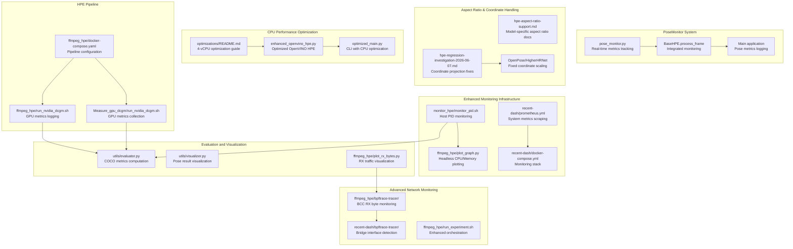

**Diagram sources**
- [pose_monitor.py:1-170](file://pose_monitor.py#L1-L170)
- [base_hpe.py:482-600](file://base_hpe.py#L482-L600)
- [main.py:51-188](file://main.py#L51-L188)
- [docs/hpe-aspect-ratio-support.md:1-28](file://docs/hpe-aspect-ratio-support.md#L1-L28)
- [docs/hpe-regression-investigation-2026-06-07.md:1-215](file://docs/hpe-regression-investigation-2026-06-07.md#L1-L215)
- [optimizations/README.md:1-237](file://optimizations/README.md#L1-L237)
- [optimizations/enhanced_openvino_hpe.py:25-217](file://optimizations/enhanced_openvino_hpe.py#L25-L217)
- [optimizations/optimized_main.py:1-257](file://optimizations/optimized_main.py#L1-L257)
- [monitor_hpe/docker-compose.yaml:1-52](file://monitor_hpe/docker-compose.yaml#L1-L52)
- [monitor_hpe/monitor_pid.sh:1-204](file://monitor_hpe/monitor_pid.sh#L1-L204)
- [ffmpeg_hpe/plot_graph.py:1-62](file://ffmpeg_hpe/plot_graph.py#L1-L62)
- [recent-dash/prometheus.yml:1-23](file://recent-dash/prometheus.yml#L1-L23)
- [recent-dash/docker-compose.yml:1-103](file://recent-dash/docker-compose.yml#L1-L103)
- [ffmpeg_hpe/docker-compose.yaml:1-206](file://ffmpeg_hpe/docker-compose.yaml#L1-L206)
- [ffmpeg_hpe/run_nvidia_dcgm.sh:1-84](file://ffmpeg_hpe/run_nvidia_dcgm.sh#L1-L84)
- [Measure_gpu_dcgm/run_nvidia_dcgm.sh:1-29](file://Measure_gpu_dcgm/run_nvidia_dcgm.sh#L1-L29)
- [ffmpeg_hpe/bpftrace-tracer/bcc_rx_bytes.py:1-120](file://ffmpeg_hpe/bpftrace-tracer/bcc_rx_bytes.py#L1-L120)
- [recent-dash/bpftrace-tracer/trace_container_net.sh:1-52](file://recent-dash/bpftrace-tracer/trace_container_net.sh#L1-L52)
- [ffmpeg_hpe/run_experiment.sh:1-279](file://ffmpeg_hpe/run_experiment.sh#L1-L279)
- [utils/evaluator.py](file://utils/evaluator.py)
- [utils/visualizer.py](file://utils/visualizer.py)
- [ffmpeg_hpe/plot_rx_bytes.py:1-33](file://ffmpeg_hpe/plot_rx_bytes.py#L1-L33)

**Section sources**
- [pose_monitor.py:1-170](file://pose_monitor.py#L1-L170)
- [base_hpe.py:482-600](file://base_hpe.py#L482-L600)
- [main.py:51-188](file://main.py#L51-L188)
- [docs/hpe-aspect-ratio-support.md:1-28](file://docs/hpe-aspect-ratio-support.md#L1-L28)
- [docs/hpe-regression-investigation-2026-06-07.md:1-215](file://docs/hpe-regression-investigation-2026-06-07.md#L1-L215)
- [optimizations/README.md:1-237](file://optimizations/README.md#L1-L237)
- [optimizations/enhanced_openvino_hpe.py:25-217](file://optimizations/enhanced_openvino_hpe.py#L25-L217)
- [optimizations/optimized_main.py:1-257](file://optimizations/optimized_main.py#L1-L257)
- [monitor_hpe/docker-compose.yaml:1-52](file://monitor_hpe/docker-compose.yaml#L1-L52)
- [recent-dash/docker-compose.yml:1-103](file://recent-dash/docker-compose.yml#L1-L103)
- [ffmpeg_hpe/docker-compose.yaml:1-206](file://ffmpeg_hpe/docker-compose.yaml#L1-L206)

## Core Components
- **PoseMonitor system**: Comprehensive real-time metrics tracking for pose estimation performance with FPS, inference time, and coordinate statistics
- **Aspect Ratio Management**: Model-specific aspect ratio handling documentation and coordinate projection fixes for OpenPose and HigherHRNet
- **CPU Performance Optimization**: Intelligent thread allocation and NUMA-aware configuration for EPIC 7551P processors in 4-vCPU cloud environments
- **Enhanced PID-based monitoring container**: Traces a target process PID using bpftrace to capture TX/RX bytes and writes CPU, memory, and network metrics to CSV files for later analysis with improved host-PID monitoring capabilities
- **Advanced plotting utilities**: Headless-safe visualization tools for CPU and memory metrics, plus dedicated RX bytes plotting for network traffic analysis
- **Experiment runner**: Orchestrates container startup, waits for completion, saves logs and CSV outputs, and generates plots with enhanced monitoring capabilities
- **Prometheus configuration**: Defines scraping jobs for node and cluster agents and a Coroot endpoint
- **HPE pipeline with GPU metrics**: Runs HPE alongside GPU metrics logging and optional BPF/BCC tracing with improved network monitoring
- **Evaluation and visualization**: Provides utilities to compute COCO metrics and visualize pose results

**Section sources**
- [pose_monitor.py:8-170](file://pose_monitor.py#L8-L170)
- [docs/hpe-aspect-ratio-support.md:1-28](file://docs/hpe-aspect-ratio-support.md#L1-L28)
- [docs/hpe-regression-investigation-2026-06-07.md:1-215](file://docs/hpe-regression-investigation-2026-06-07.md#L1-L215)
- [optimizations/README.md:1-237](file://optimizations/README.md#L1-L237)
- [monitor_hpe/monitor_pid.sh:1-204](file://monitor_hpe/monitor_pid.sh#L1-L204)
- [monitor_hpe/run_experiment.sh:1-138](file://monitor_hpe/run_experiment.sh#L1-L138)
- [recent-dash/prometheus.yml:1-23](file://recent-dash/prometheus.yml#L1-L23)
- [ffmpeg_hpe/docker-compose.yaml:1-206](file://ffmpeg_hpe/docker-compose.yaml#L1-L206)
- [ffmpeg_hpe/run_nvidia_dcgm.sh:1-84](file://ffmpeg_hpe/run_nvidia_dcgm.sh#L1-L84)
- [utils/evaluator.py](file://utils/evaluator.py)
- [utils/visualizer.py](file://utils/visualizer.py)

## Architecture Overview
The monitoring architecture integrates:
- A host-level monitoring container that traces a target PID and exports metrics to CSV with enhanced capabilities
- A comprehensive PoseMonitor system that tracks frame processing metrics in real-time
- Model-specific aspect ratio handling and coordinate projection fixes
- CPU performance optimization for 4-vCPU cloud configurations
- A Prometheus configuration that scrapes exporters for system and GPU metrics
- An HPE pipeline that streams video, runs inference, and logs GPU metrics with advanced network monitoring
- Enhanced visualization tools for headless environments and network traffic analysis
- Optional BPF/BCC tracing for packet-level insights with automatic bridge interface detection

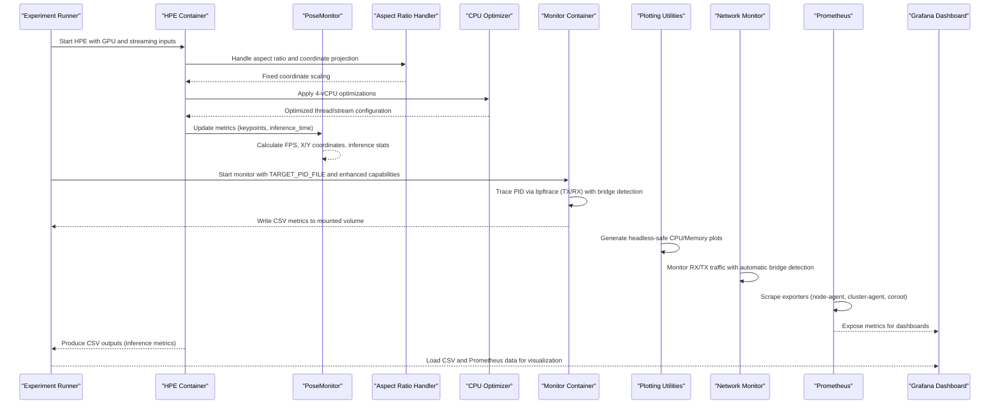

**Diagram sources**
- [monitor_hpe/docker-compose.yaml:1-52](file://monitor_hpe/docker-compose.yaml#L1-L52)
- [monitor_hpe/monitor_pid.sh:1-204](file://monitor_hpe/monitor_pid.sh#L1-L204)
- [recent-dash/prometheus.yml:1-23](file://recent-dash/prometheus.yml#L1-L23)
- [ffmpeg_hpe/docker-compose.yaml:1-206](file://ffmpeg_hpe/docker-compose.yaml#L1-L206)
- [pose_monitor.py:49-170](file://pose_monitor.py#L49-L170)
- [docs/hpe-regression-investigation-2026-06-07.md:30-84](file://docs/hpe-regression-investigation-2026-06-07.md#L30-L84)
- [optimizations/README.md:45-98](file://optimizations/README.md#L45-L98)
- [ffmpeg_hpe/plot_graph.py:1-62](file://ffmpeg_hpe/plot_graph.py#L1-L62)
- [recent-dash/bpftrace-tracer/trace_container_net.sh:1-52](file://recent-dash/bpftrace-tracer/trace_container_net.sh#L1-L52)

## Detailed Component Analysis

### PoseMonitor System Integration
The PoseMonitor system provides comprehensive real-time metrics tracking for pose estimation performance:

**Core Features:**
- **Real-time FPS tracking**: Calculates frames per second with moving statistics
- **Inference time monitoring**: Tracks model inference duration with statistical analysis
- **Coordinate tracking**: Monitors average X/Y coordinates for pose center of mass
- **CSV logging**: Automatic CSV file generation with comprehensive metrics
- **Window-based statistics**: Maintains configurable window size for moving averages

**Key Behaviors:**
- Initializes CSV headers with comprehensive metric fields
- Processes keypoints to calculate center of mass coordinates
- Updates metrics every frame with statistical calculations
- Logs metrics to CSV every second with atomic file operations
- Provides console output with current performance metrics

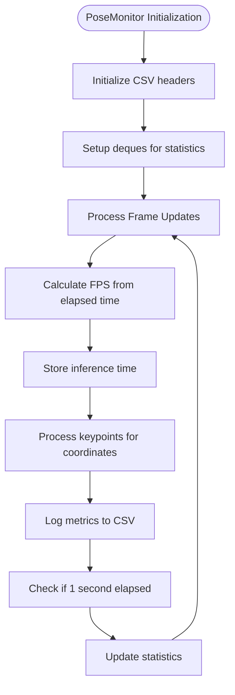

**Diagram sources**
- [pose_monitor.py:8-170](file://pose_monitor.py#L8-L170)

**Section sources**
- [pose_monitor.py:8-170](file://pose_monitor.py#L8-L170)

### BaseHPE Integration with PoseMonitor
The BaseHPE class has been enhanced with integrated PoseMonitor capabilities:

**Integration Points:**
- **process_frame method**: Enhanced with PoseMonitor.update() calls
- **Real-time metrics**: FPS, inference time, and coordinate tracking
- **Automatic CSV logging**: Pose-specific metrics exported to CSV
- **Console output**: Real-time performance metrics display

**Enhanced Processing Flow:**
- Start timing for inference operations
- Run model inference with timing measurements
- Update PoseMonitor with keypoints and inference time
- Calculate and display FPS statistics
- Render pose results with performance overlay

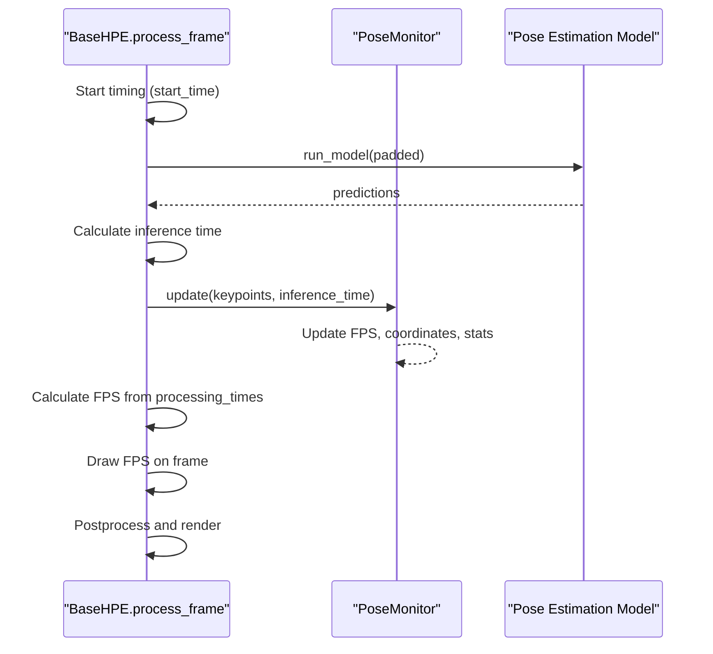

**Diagram sources**
- [base_hpe.py:482-600](file://base_hpe.py#L482-L600)
- [pose_monitor.py:49-170](file://pose_monitor.py#L49-L170)

**Section sources**
- [base_hpe.py:482-600](file://base_hpe.py#L482-L600)
- [pose_monitor.py:49-170](file://pose_monitor.py#L49-L170)

### Enhanced PID-based Metrics Collection
The monitor container traces a target PID and exports:
- CPU percentage
- Memory RSS (KB)
- Network TX/RX bytes (via bpftrace)
- Timestamps for temporal alignment

**Enhanced Capabilities:**
- **Host PID monitoring**: Improved host-level monitoring with enhanced capabilities
- **Automatic bridge detection**: Automatic detection and selection of Docker bridge interfaces for accurate traffic measurement
- **Dual monitoring approach**: Combines bpftrace TX monitoring with BCC RX monitoring for comprehensive network visibility
- **Enhanced CSV formats**: Supports both total CPU/memory and individual process metrics

Key behaviors:
- Reads the target PID from a mounted file and waits for it with a timeout
- Starts a bpftrace script to accumulate TX/RX bytes per 10 ms interval and emits rates to a FIFO
- Writes metrics to CSV files with atomic append and locking to avoid corruption
- Continues until the target process exits or terminated
- **New**: Automatic bridge interface detection for BPF tracing to avoid double-counting

**Diagram sources**
- [monitor_hpe/monitor_pid.sh:1-204](file://monitor_hpe/monitor_pid.sh#L1-L204)

**Section sources**
- [monitor_hpe/monitor_pid.sh:1-204](file://monitor_hpe/monitor_pid.sh#L1-L204)
- [monitor_hpe/docker-compose.yaml:1-52](file://monitor_hpe/docker-compose.yaml#L1-L52)

### Experiment Orchestration
The experiment runner:
- Creates timestamped results directories and cleans stale PID files
- Starts containers without rebuilding, waits for them to be healthy
- Captures container logs after completion
- Copies CSV outputs from the Docker volume and attempts to generate plots with enhanced visualization capabilities
- Supports graceful shutdown via signal handling
- **Enhanced**: Improved network monitoring with automatic bridge interface detection

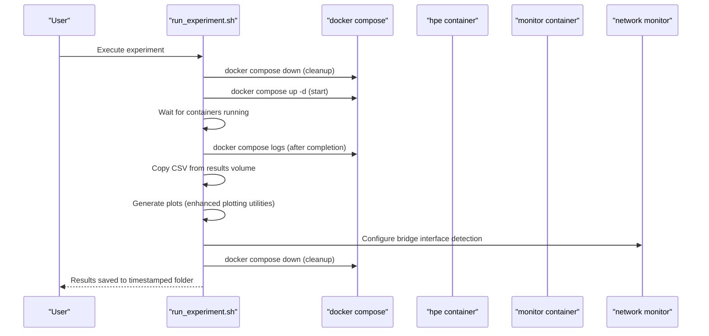

**Diagram sources**
- [monitor_hpe/run_experiment.sh:1-138](file://monitor_hpe/run_experiment.sh#L1-L138)
- [monitor_hpe/docker-compose.yaml:1-52](file://monitor_hpe/docker-compose.yaml#L1-L52)
- [recent-dash/bpftrace-tracer/trace_container_net.sh:1-52](file://recent-dash/bpftrace-tracer/trace_container_net.sh#L1-L52)

**Section sources**
- [monitor_hpe/run_experiment.sh:1-138](file://monitor_hpe/run_experiment.sh#L1-L138)

### Prometheus and Grafana Integration
Prometheus configuration defines three jobs:
- node-agent: scrapes node-level metrics
- cluster-agent: scrapes cluster-level metrics
- coroot: scrapes Coroot for service and performance insights

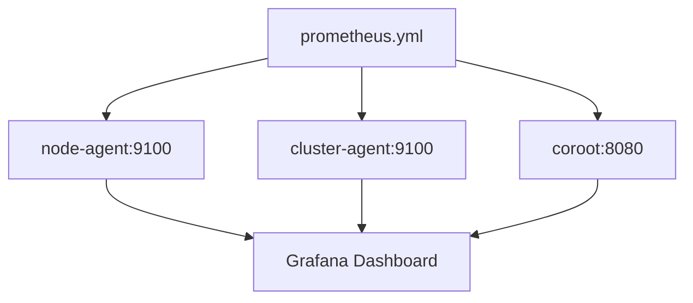

**Diagram sources**
- [recent-dash/prometheus.yml:1-23](file://recent-dash/prometheus.yml#L1-L23)

**Section sources**
- [recent-dash/prometheus.yml:1-23](file://recent-dash/prometheus.yml#L1-L23)

### HPE Pipeline with Enhanced GPU Metrics
The HPE pipeline:
- Starts a streaming server and the HPE container with GPU runtime
- Logs GPU metrics via a dedicated container that periodically queries nvidia-smi
- Optionally runs BPF/BCC tracers for network-level insights with automatic bridge interface detection
- **Enhanced**: Improved monitoring with dual TX/RX monitoring approach

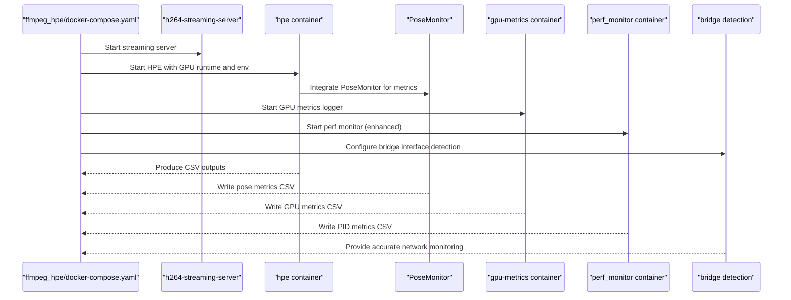

**Diagram sources**
- [ffmpeg_hpe/docker-compose.yaml:1-206](file://ffmpeg_hpe/docker-compose.yaml#L1-L206)
- [ffmpeg_hpe/run_nvidia_dcgm.sh:1-84](file://ffmpeg_hpe/run_nvidia_dcgm.sh#L1-L84)
- [pose_monitor.py:1-170](file://pose_monitor.py#L1-L170)
- [recent-dash/bpftrace-tracer/trace_container_net.sh:1-52](file://recent-dash/bpftrace-tracer/trace_container_net.sh#L1-L52)

**Section sources**
- [ffmpeg_hpe/docker-compose.yaml:1-206](file://ffmpeg_hpe/docker-compose.yaml#L1-L206)
- [ffmpeg_hpe/run_nvidia_dcgm.sh:1-84](file://ffmpeg_hpe/run_nvidia_dcgm.sh#L1-L84)

### Evaluation Utilities and Visualization
- **evaluator.py**: Provides COCO-format evaluation utilities for pose estimation tasks
- **visualizer.py**: Offers visualization tools for rendering pose results on frames
- **Enhanced plotting**: Headless-safe visualization tools for CPU and memory metrics

These modules integrate with the CSV outputs produced by the monitoring pipeline to enable downstream analysis and reporting.

**Section sources**
- [utils/evaluator.py](file://utils/evaluator.py)
- [utils/visualizer.py](file://utils/visualizer.py)

## Aspect Ratio and Coordinate Handling

### Model-Specific Aspect Ratio Support
The HPE framework now includes comprehensive documentation for model-specific aspect ratio handling:

**Supported Models and Aspect Ratios:**
- **OpenPose**: Limited to landscape-oriented inputs; portrait inputs cause hard errors
- **EfficientHRNet (ae1, ae2, ae3)**: Broad support for any aspect ratio using keep-aspect-ratio resizing
- **HigherHRNet**: Broad support with optional center padding for alignment preservation
- **MoveNet**: Square 256x256 input via padding, accepts all aspect ratios
- **AlphaPose**: Original resolution preprocessing, no fixed aspect ratio constraints

**Current Issues:**
- OpenPose fails specifically with portrait-oriented video (taller than wide)
- Landscape 16:9 inputs work normally
- Issue originates from OpenPose wrapper aspect-ratio compatibility check

**Recommended Fix Area:**
- Apply fixes in OpenPose preprocessing path rather than evaluator or CLI layers

**Section sources**
- [docs/hpe-aspect-ratio-support.md:1-28](file://docs/hpe-aspect-ratio-support.md#L1-L28)

### Coordinate Projection Fixes
Recent investigations identified and resolved critical coordinate projection issues:

**Root Cause Analysis:**
- **OpenPose**: Double transformation issue where coordinates were scaled twice
- **HigherHRNet**: Similar model-API-space problem causing out-of-bounds keypoints
- **Duplicate Model Loading**: Multiple model loads causing inefficiency

**Fix Implementation:**
- **OpenPose**: Pass original frame to OpenVINO model API, remove extra coordinate scaling
- **HigherHRNet**: Apply same fix pattern, preserve pre-resized path for AE models
- **Duplicate Loading**: Remove eager model loading, rely on processing loop guards

**Validation Results:**
- All models now produce coordinate-sane outputs
- OpenPose eliminated out-of-bounds keypoints
- HigherHRNet resolved giant bounding boxes and diagonal skeleton lines
- MoveNet and AlphaPose reduced to single model load

**Section sources**
- [docs/hpe-regression-investigation-2026-06-07.md:28-153](file://docs/hpe-regression-investigation-2026-06-07.md#L28-L153)

## CPU Performance Optimization

### 4-vCPU Cloud Configuration
The optimizations directory provides comprehensive CPU performance tuning for EPIC 7551P processors in 4-vCPU cloud environments:

**Expected Performance Improvements:**
- OpenPose: 16.7 FPS → 18-19 FPS (10-15% improvement)
- EfficientHRNet1 (ae1): 12.5 FPS → 14-15 FPS (12-20% improvement)
- HigherHRNet: 2.4 FPS → 2.8-3.0 FPS (15-25% improvement)

**Key Optimizations:**
- **Intelligent Thread Allocation**: 4 threads, 1 stream for all models on 4-vCPU instances
- **NUMA-Aware Configuration**: Optimized for single NUMA node environments
- **Memory Bandwidth Optimization**: AVX2 optimization and intelligent batch sizing
- **System-Level Tuning**: CPU governor, hyper-threading, and process priority adjustments

**Configuration Details:**
- **OpenPose**: 4 threads, 1 stream, THROUGHPUT hint
- **EfficientHRNet1**: 4 threads, 1 stream, LATENCY hint with conservative batch
- **HigherHRNet**: 4 threads, 1 stream, THROUGHPUT with bandwidth optimization

**Section sources**
- [optimizations/README.md:1-237](file://optimizations/README.md#L1-L237)

### Optimized OpenVINO HPE Implementation
The enhanced OpenVINO HPE system provides seamless integration of performance optimizations:

**Core Features:**
- **Automatic CPU Detection**: Identifies EPIC processor capabilities and applies optimal settings
- **Intelligent Thread Management**: Calculates optimal thread/stream configuration per model
- **NUMA-Aware Scheduling**: Optimizes for single NUMA node cloud environments
- **Memory Pattern Optimization**: Adapts to model memory requirements and cache characteristics

**Integration Points:**
- **EPICCPUOptimizer**: Detects CPU capabilities and calculates optimal configuration
- **OptimizedOpenVINOHPE**: Enhanced OpenVINO HPE with automatic optimization
- **create_optimized_openvino_core**: Specialized core creation with optimized properties

**Performance Monitoring:**
- **get_performance_stats()**: Returns detailed optimization statistics
- **benchmark_optimization()**: Compares standard vs optimized performance
- **Real-time Statistics**: Thread allocation, stream configuration, and performance hints

**Section sources**
- [optimizations/enhanced_openvino_hpe.py:25-217](file://optimizations/enhanced_openvino_hpe.py#L25-L217)
- [optimizations/optimized_main.py:1-257](file://optimizations/optimized_main.py#L1-L257)
- [optimizations/cpu_performance_optimizer.py:1-385](file://optimizations/cpu_performance_optimizer.py#L1-L385)

## Enhanced Monitoring Infrastructure

### Headless-Safe CPU and Memory Plotting
The ffmpeg_hpe/plot_graph.py utility provides headless-safe visualization for CPU and memory metrics:

**Key Features:**
- **Environment isolation**: Sets MPLCONFIGDIR to /tmp/matplotlib for headless operation
- **Automatic timestamp detection**: Determines whether timestamps are in seconds or milliseconds
- **Flexible column detection**: Supports both total_cpu_percent/total_mem_rss_kb and cpu_percent/mem_rss_kb formats
- **Dual subplot visualization**: CPU usage and memory usage plotted on separate subplots
- **Automatic file naming**: Generates .png output files in the same directory as input CSV

**Enhanced Capabilities:**
- **Headless operation**: Works without DISPLAY environment variable
- **Robust error handling**: Validates CSV structure and required columns
- **Automatic formatting**: Handles date/time formatting for better visualization
- **Configurable output**: Saves plots with meaningful filenames

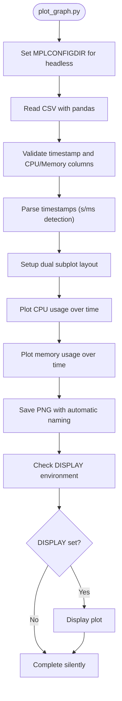

**Diagram sources**
- [ffmpeg_hpe/plot_graph.py:1-62](file://ffmpeg_hpe/plot_graph.py#L1-L62)

**Section sources**
- [ffmpeg_hpe/plot_graph.py:1-62](file://ffmpeg_hpe/plot_graph.py#L1-L62)

### Enhanced Host-PID Monitoring Capabilities
The monitoring infrastructure now includes improved host-PID monitoring with enhanced capabilities:

**Core Enhancements:**
- **Dual monitoring approach**: Combines bpftrace TX monitoring with BCC RX monitoring for comprehensive network visibility
- **Automatic bridge detection**: Intelligent detection and selection of Docker bridge interfaces to avoid double-counting
- **Enhanced CSV formats**: Supports both total CPU/memory and individual process metrics
- **Improved error handling**: Better validation and recovery mechanisms

**Monitoring Capabilities:**
- **CPU monitoring**: Per-process CPU percentage using /proc/$PID/stat deltas
- **Memory monitoring**: RSS memory usage in KB from /proc/$PID/status
- **Network monitoring**: TX/RX byte counters with automatic interface detection
- **Timestamp synchronization**: Accurate timestamp alignment across all monitoring sources

**Section sources**
- [monitor_hpe/monitor_pid.sh:1-204](file://monitor_hpe/monitor_pid.sh#L1-L204)
- [ffmpeg_hpe/docker-compose.yaml:120-206](file://ffmpeg_hpe/docker-compose.yaml#L120-L206)

## Visualization and Plotting Tools

### Dedicated RX Bytes Plotting Utilities
The HPE framework includes specialized plotting utilities for network traffic analysis:

**Available Plotting Tools:**
- **plot_rx_bytes.py**: Basic RX bytes visualization with step-wise plotting
- **plot_rx_bytes_trimmed_reset.py**: Advanced RX bytes plotting with trimming and time zeroing

**Key Features:**
- **CSV validation**: Ensures input files exist and are accessible
- **Automatic trimming**: Removes leading zeros to focus on actual traffic periods
- **Time normalization**: Resets x-axis to start from zero for better visualization
- **Step-wise plotting**: Uses drawstyle='steps-post' for accurate traffic representation
- **Automatic output naming**: Generates descriptive output filenames

**Enhanced RX Visualization Workflow:**
- **Input validation**: Verifies CSV file existence and accessibility
- **First non-zero detection**: Automatically finds the first period of actual RX activity
- **Data trimming**: Removes pre-traffic periods for cleaner visualization
- **Time zeroing**: Normalizes timestamps to start from the first RX event
- **High-quality output**: Generates PNG files with proper formatting and labeling

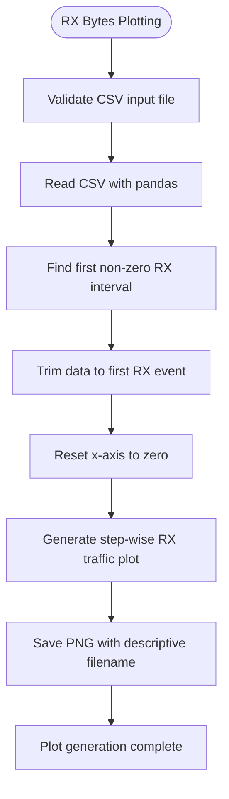

**Diagram sources**
- [ffmpeg_hpe/plot_rx_bytes.py:1-33](file://ffmpeg_hpe/plot_rx_bytes.py#L1-L33)
- [ffmpeg_hpe/plot_rx_bytes_trimmed_reset.py:1-38](file://ffmpeg_hpe/plot_rx_bytes_trimmed_reset.py#L1-L38)

**Section sources**
- [ffmpeg_hpe/plot_rx_bytes.py:1-33](file://ffmpeg_hpe/plot_rx_bytes.py#L1-L33)
- [ffmpeg_hpe/plot_rx_bytes_trimmed_reset.py:1-38](file://ffmpeg_hpe/plot_rx_bytes_trimmed_reset.py#L1-L38)

### Integration with Monitoring Pipeline
The plotting utilities integrate seamlessly with the monitoring pipeline:

**Data Flow Integration:**
- **CSV input**: Direct consumption of monitoring CSV files
- **Automatic processing**: No manual intervention required after experiment completion
- **Standardized output**: Consistent PNG file generation for easy dashboard integration
- **Error handling**: Graceful degradation if input files are unavailable

**Dashboard Integration:**
- **Visual consistency**: Standardized plot formatting for consistent dashboard appearance
- **Automated generation**: Plots generated automatically during experiment post-processing
- **Quality assurance**: High-resolution PNG output suitable for presentations and reports

**Section sources**
- [ffmpeg_hpe/run_experiment.sh:200-279](file://ffmpeg_hpe/run_experiment.sh#L200-L279)

## Network Monitoring and Bridge Interface Detection

### Automatic Bridge Interface Detection
The monitoring infrastructure now includes sophisticated bridge interface detection for accurate network monitoring:

**Detection Algorithm:**
- **Priority 1**: Explicit NETIF environment variable override
- **Priority 2**: Automatic detection via `ip route get $TARGET_IP`
- **Priority 3**: Default interface detection via `ip -o link show`
- **Fallback**: Uses "any" interface if automatic detection fails

**Double-Counting Prevention:**
- **Host networking awareness**: Detects when containers use host networking
- **Veth pair recognition**: Identifies veth pairs that cause double packet counting
- **Bridge interface selection**: Chooses specific bridge interface to avoid duplication
- **Logging and warnings**: Provides clear feedback about detection decisions

**Enhanced BPF Tracing:**
- **Interface-specific filtering**: BPF programs attached to specific network interfaces
- **Reduced overhead**: Targeted monitoring reduces unnecessary packet processing
- **Accurate measurements**: Eliminates double-counting artifacts in traffic measurements

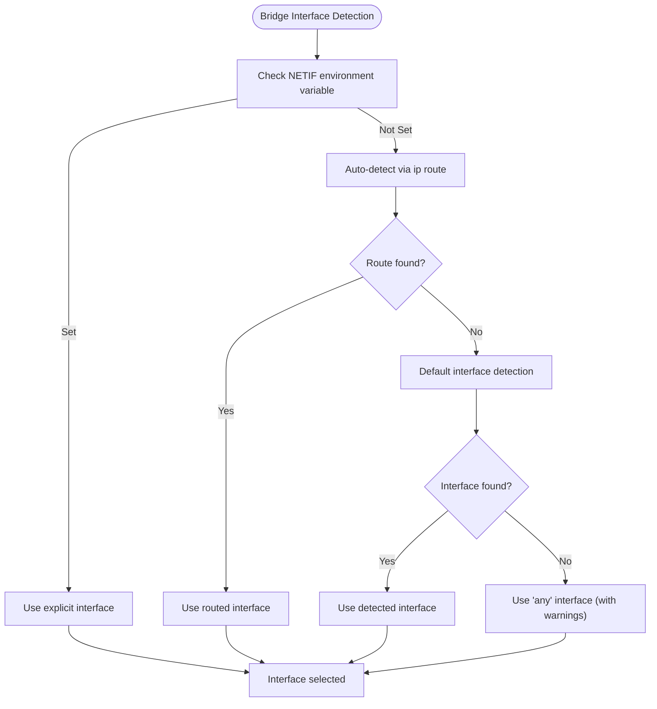

**Diagram sources**
- [recent-dash/bpftrace-tracer/trace_container_net.sh:15-39](file://recent-dash/bpftrace-tracer/trace_container_net.sh#L15-L39)

**Section sources**
- [recent-dash/bpftrace-tracer/trace_container_net.sh:1-52](file://recent-dash/bpftrace-tracer/trace_container_net.sh#L1-L52)

### Dual Network Monitoring Architecture
The enhanced monitoring system implements a dual approach for comprehensive network visibility:

**TX Monitoring (Outbound Traffic):**
- **Tool**: bpftrace sys_enter_sendto in monitor_pid.sh
- **Scope**: HPE process → external network (TX direction)
- **Mechanism**: Kernel syscall tracepoint with PID filtering
- **Reliability**: ✅ Works consistently with host-correct PID

**RX Monitoring (Inbound Traffic):**
- **Tool**: bcc_rx_bytes.py in bcc-tracer container
- **Scope**: External network → HPE process (RX direction)
- **Mechanism**: BPF socket filter on eth0 with IP/port filtering
- **Reliability**: ✅ Works after recent improvements

**Cross-Container Coordination:**
- **Shared network namespace**: bcc-tracer shares HPE's network namespace
- **Auto-detection**: Streamer IP and HPE ephemeral port auto-detected
- **Filtering precision**: IP + port-based filtering prevents noise
- **Interface optimization**: Automatic bridge interface selection

**Monitoring Architecture:**
- **TX monitoring**: Direct HPE process monitoring with PID filtering
- **RX monitoring**: Network-level monitoring with precise filtering
- **Bridge detection**: Automatic interface selection to prevent double-counting
- **Data correlation**: Timestamp-aligned monitoring across all components

**Section sources**
- [AGENTS.md:134-156](file://AGENTS.md#L134-L156)
- [session-report-2026-05-06.md:184-199](file://session-report-2026-05-06.md#L184-L199)
- [ffmpeg_hpe/bpftrace-tracer/bcc_rx_bytes.py:1-120](file://ffmpeg_hpe/bpftrace-tracer/bcc_rx_bytes.py#L1-L120)

## Dependency Analysis
The monitoring stack exhibits the following dependencies:
- The monitor container depends on the target PID file and bpftrace availability
- The experiment runner depends on docker compose and Python plotting libraries
- Prometheus depends on exporters being reachable at configured targets
- The HPE pipeline depends on GPU runtime and optional BPF/BCC tracing containers
- **PoseMonitor system**: Depends on BaseHPE.process_frame integration and real-time metrics processing
- **Aspect Ratio Handling**: Depends on model-specific preprocessing implementations
- **CPU Optimization**: Depends on EPICCPUOptimizer and system capability detection
- **Enhanced Plotting**: Depends on pandas, matplotlib, and headless environment configuration
- **Bridge Detection**: Depends on iproute2 utilities and Docker networking configuration
- **Dual Monitoring**: Requires both bpftrace and BCC/BPF tracing capabilities

```mermaid
graph TB
PM["pose_monitor.py"] --> BH["base_hpe.py"]
BH --> MF["main.py"]
AR["hpe-aspect-ratio-support.md"] --> OP["OpenPose Wrapper"]
AR --> HR["HigherHRNet Wrapper"]
CPU["optimizations/README.md"] --> EOH["enhanced_openvino_hpe.py"]
CPU --> OMC["optimized_main.py"]
MP["monitor_pid.sh"] --> PIDF["TARGET_PID_FILE"]
MP --> CSV["CSV Outputs"]
RE["run_experiment.sh"] --> DC["docker-compose.yaml"]
RE --> CSV
PR["prometheus.yml"] --> EXP["Exporters"]
FH["ffmpeg_hpe/docker-compose.yaml"] --> GM["gpu-metrics"]
FH --> HPE["hpe container"]
FH --> TR["bcc-tracer"]
FH --> BR["bridge detection"]
EOH --> EPO["EPICCPUOptimizer"]
PG["plot_graph.py"] --> PD["pandas"]
PG --> MT["matplotlib"]
PG --> TMP["MPLCONFIGDIR=/tmp/matplotlib"]
BRIDGE["bridge detection"] --> IPROUTE["iproute2 utilities"]
```

**Diagram sources**
- [pose_monitor.py:1-170](file://pose_monitor.py#L1-L170)
- [base_hpe.py:482-600](file://base_hpe.py#L482-L600)
- [main.py:51-188](file://main.py#L51-L188)
- [docs/hpe-aspect-ratio-support.md:1-28](file://docs/hpe-aspect-ratio-support.md#L1-L28)
- [docs/hpe-regression-investigation-2026-06-07.md:30-84](file://docs/hpe-regression-investigation-2026-06-07.md#L30-L84)
- [optimizations/README.md:45-98](file://optimizations/README.md#L45-L98)
- [optimizations/enhanced_openvino_hpe.py:25-217](file://optimizations/enhanced_openvino_hpe.py#L25-L217)
- [optimizations/optimized_main.py:1-257](file://optimizations/optimized_main.py#L1-L257)
- [monitor_hpe/monitor_pid.sh:1-204](file://monitor_hpe/monitor_pid.sh#L1-L204)
- [monitor_hpe/run_experiment.sh:1-138](file://monitor_hpe/run_experiment.sh#L1-L138)
- [recent-dash/prometheus.yml:1-23](file://recent-dash/prometheus.yml#L1-L23)
- [ffmpeg_hpe/docker-compose.yaml:1-206](file://ffmpeg_hpe/docker-compose.yaml#L1-L206)
- [ffmpeg_hpe/plot_graph.py:1-62](file://ffmpeg_hpe/plot_graph.py#L1-L62)
- [recent-dash/bpftrace-tracer/trace_container_net.sh:1-52](file://recent-dash/bpftrace-tracer/trace_container_net.sh#L1-L52)

**Section sources**
- [pose_monitor.py:1-170](file://pose_monitor.py#L1-L170)
- [base_hpe.py:482-600](file://base_hpe.py#L482-L600)
- [main.py:51-188](file://main.py#L51-L188)
- [docs/hpe-aspect-ratio-support.md:1-28](file://docs/hpe-aspect-ratio-support.md#L1-L28)
- [docs/hpe-regression-investigation-2026-06-07.md:1-215](file://docs/hpe-regression-investigation-2026-06-07.md#L1-L215)
- [optimizations/README.md:1-237](file://optimizations/README.md#L1-L237)
- [optimizations/enhanced_openvino_hpe.py:25-217](file://optimizations/enhanced_openvino_hpe.py#L25-L217)
- [optimizations/optimized_main.py:1-257](file://optimizations/optimized_main.py#L1-L257)
- [monitor_hpe/monitor_pid.sh:1-204](file://monitor_hpe/monitor_pid.sh#L1-L204)
- [monitor_hpe/run_experiment.sh:1-138](file://monitor_hpe/run_experiment.sh#L1-L138)
- [recent-dash/prometheus.yml:1-23](file://recent-dash/prometheus.yml#L1-L23)
- [ffmpeg_hpe/docker-compose.yaml:1-206](file://ffmpeg_hpe/docker-compose.yaml#L1-L206)
- [ffmpeg_hpe/plot_graph.py:1-62](file://ffmpeg_hpe/plot_graph.py#L1-L62)
- [recent-dash/bpftrace-tracer/trace_container_net.sh:1-52](file://recent-dash/bpftrace-tracer/trace_container_net.sh#L1-L52)

## Performance Considerations
- **Sampling intervals**: Prometheus scrape_interval and exporter intervals are tuned to 500 ms for responsiveness
- **Resource limits**: Containers define CPU and memory limits/reservations to prevent contention
- **GPU metrics**: GPU metrics logging runs at 0.5 s intervals; adjust METRICS_INTERVAL to balance overhead and fidelity
- **BPF tracing**: bpftrace TX/RX aggregation runs at 10 ms intervals; ensure host permissions and kernel modules are available
- **PoseMonitor overhead**: Real-time metrics processing adds minimal overhead to inference pipeline
- **Disk I/O**: Atomic CSV writes and sync reduce race conditions but can increase I/O pressure; consider SSD-backed storage for results volumes
- **Aspect Ratio Handling**: Model-specific preprocessing affects performance; choose appropriate models for input aspect ratios
- **CPU Optimization**: 4-vCPU configurations benefit from optimized thread allocation and NUMA-aware scheduling
- **Coordinate Projection**: Fixed double-scaling issues eliminate coordinate calculation overhead and improve accuracy
- **Headless plotting**: Environment isolation prevents display dependency while maintaining plot quality
- **Bridge detection**: Automatic interface selection improves monitoring accuracy and reduces double-counting
- **Dual monitoring**: TX/RX monitoring approach provides comprehensive network visibility with minimal overhead

## Troubleshooting Guide
Common issues and resolutions:
- **Target PID file missing**: The monitor waits for TARGET_PID_FILE; ensure the HPE container writes the PID file to the shared volume
- **bpftrace not installed**: The monitor Dockerfile installs bpftrace; verify kernel tools and debugfs availability on the host
- **Prometheus scrape failures**: Confirm exporters are reachable at the configured targets and ports
- **GPU metrics logging errors**: Ensure nvidia-smi is available inside the gpu-metrics container and NVIDIA runtime is configured
- **CSV write conflicts**: The monitor uses file locks; verify filesystem supports flock semantics and volumes are writable
- **PoseMonitor integration issues**: Ensure BaseHPE.process_frame is properly calling PoseMonitor.update() with valid keypoints and inference_time
- **Memory usage tracking**: PoseMonitor tracks frame processing metrics; verify sufficient memory for real-time statistics accumulation
- **Aspect Ratio Issues**: OpenPose fails with portrait inputs; use models with broad aspect ratio support or rotate input appropriately
- **Coordinate Projection Problems**: Verify coordinate scaling fixes are applied; check for duplicate model loading causing double transformations
- **CPU Performance Issues**: Ensure 4-vCPU optimization is enabled; verify system governor is set to performance mode
- **Thread Contention**: Adjust thread/stream configuration based on model requirements and system capabilities
- **Headless plotting failures**: Ensure MPLCONFIGDIR environment variable is set to a writable directory; verify matplotlib installation
- **Bridge detection issues**: Verify iproute2 utilities are available; check Docker networking configuration for proper interface detection
- **Network monitoring accuracy**: Ensure bridge interface detection is working correctly; verify BPF program attachment to correct interface
- **Dual monitoring conflicts**: Verify TX and RX monitoring are not conflicting; check that different tools are used for TX vs RX monitoring

**Section sources**
- [monitor_hpe/monitor_pid.sh:1-204](file://monitor_hpe/monitor_pid.sh#L1-L204)
- [monitor_hpe/Dockerfile:1-8](file://monitor_hpe/Dockerfile#L1-L8)
- [recent-dash/prometheus.yml:1-23](file://recent-dash/prometheus.yml#L1-L23)
- [ffmpeg_hpe/docker-compose.yaml:1-206](file://ffmpeg_hpe/docker-compose.yaml#L1-L206)
- [ffmpeg_hpe/run_nvidia_dcgm.sh:1-84](file://ffmpeg_hpe/run_nvidia_dcgm.sh#L1-L84)
- [pose_monitor.py:1-170](file://pose_monitor.py#L1-L170)
- [docs/hpe-aspect-ratio-support.md:19-27](file://docs/hpe-aspect-ratio-support.md#L19-L27)
- [docs/hpe-regression-investigation-2026-06-07.md:85-111](file://docs/hpe-regression-investigation-2026-06-07.md#L85-L111)
- [optimizations/README.md:154-174](file://optimizations/README.md#L154-L174)
- [ffmpeg_hpe/plot_graph.py:1-62](file://ffmpeg_hpe/plot_graph.py#L1-L62)
- [recent-dash/bpftrace-tracer/trace_container_net.sh:1-52](file://recent-dash/bpftrace-tracer/trace_container_net.sh#L1-L52)

## Conclusion
The HPE monitoring and analytics stack provides comprehensive real-time monitoring capabilities through the integrated PoseMonitor system, enhanced with model-specific aspect ratio handling, CPU performance optimization, and advanced visualization tools. The system offers:
- Real-time PID-level metrics via bpftrace with enhanced host-PID monitoring capabilities
- **Pose-specific metrics tracking** with FPS, inference time, and coordinate statistics
- **Model-specific aspect ratio support** documentation and coordinate projection fixes
- **CPU performance optimization** for 4-vCPU cloud configurations
- **Headless-safe visualization** with automatic CPU and memory plotting utilities
- **Advanced network monitoring** with automatic bridge interface detection for accurate traffic measurement
- **Dual TX/RX monitoring approach** combining bpftrace and BCC/BPF tracing
- Prometheus-based system and GPU telemetry
- A repeatable experiment workflow with artifact collection and enhanced plotting
- Integration points for COCO evaluation and visualization
Adopt the recommended configurations, interpret metrics carefully, and iteratively optimize resource allocation and tracing overhead to achieve reliable, low-latency performance. The recent enhancements in plotting utilities, bridge interface detection, and dual monitoring architecture ensure accurate, comprehensive system monitoring even in complex network environments. The headless-safe plotting capabilities make visualization accessible in automated testing and CI/CD environments, while the automatic bridge detection eliminates common network monitoring pitfalls.

## Appendices

### PoseMonitor Configuration Reference
- **window_size**: 30 (frames) - Number of samples for moving statistics
- **log_file**: 'pose_metrics.csv' - Path to CSV file for logging metrics
- **CSV Headers**: timestamp, fps_avg, fps_min, fps_max, fps_std, inference_time_avg, inference_time_min, inference_time_max, inference_time_std, x_avg, x_min, x_max, x_std, y_avg, y_min, y_max, y_std, frame_count

**Section sources**
- [pose_monitor.py:8-170](file://pose_monitor.py#L8-L170)

### Prometheus Configuration Reference
- scrape_interval: 500 ms
- evaluation_interval: 500 ms
- scrape_timeout: 200 ms
- Jobs:
  - node-agent: node-agent:9100
  - cluster-agent: cluster-agent:9100
  - coroot: coroot:8080

**Section sources**
- [recent-dash/prometheus.yml:1-23](file://recent-dash/prometheus.yml#L1-L23)

### GPU Metrics Logging
- Output file: gpu_metrics.csv
- Fields: timestamp, gpu_id, gpu_utilization, mem_utilization, temperature, power_usage
- Interval: configurable via METRICS_INTERVAL (default 0.5 s)
- Duration: configurable via METRICS_DURATION (default 0 means indefinite)

**Section sources**
- [ffmpeg_hpe/run_nvidia_dcgm.sh:1-84](file://ffmpeg_hpe/run_nvidia_dcgm.sh#L1-L84)
- [Measure_gpu_dcgm/run_nvidia_dcgm.sh:1-29](file://Measure_gpu_dcgm/run_nvidia_dcgm.sh#L1-L29)

### Enhanced Monitoring Container Notes
- Requires host PID namespace and elevated privileges for bpftrace and process tracing
- Writes CSV files to a mounted output directory for later ingestion by Grafana or custom scripts
- Uses atomic file locking to prevent concurrent writes
- **New**: Supports automatic bridge interface detection for accurate network monitoring
- **New**: Enhanced plotting capabilities for headless environments

**Section sources**
- [monitor_hpe/docker-compose.yaml:28-50](file://monitor_hpe/docker-compose.yaml#L28-L50)
- [monitor_hpe/monitor_pid.sh:1-204](file://monitor_hpe/monitor_pid.sh#L1-L204)
- [recent-dash/bpftrace-tracer/trace_container_net.sh:1-52](file://recent-dash/bpftrace-tracer/trace_container_net.sh#L1-L52)

### BaseHPE Integration Points
- **process_frame method**: Enhanced with PoseMonitor.update() calls
- **Real-time metrics**: FPS, inference time, and coordinate tracking
- **Automatic CSV logging**: Pose-specific metrics exported to CSV
- **Console output**: Real-time performance metrics display

**Section sources**
- [base_hpe.py:482-600](file://base_hpe.py#L482-L600)
- [pose_monitor.py:49-170](file://pose_monitor.py#L49-L170)

### Aspect Ratio Support Reference
- **OpenPose**: Limited to landscape orientation, fails on portrait inputs
- **EfficientHRNet (ae1, ae2, ae3)**: Broad support with keep-aspect-ratio resizing
- **HigherHRNet**: Broad support with optional center padding
- **MoveNet**: Square 256x256 input, any aspect ratio
- **AlphaPose**: Original resolution preprocessing, no aspect ratio constraints

**Section sources**
- [docs/hpe-aspect-ratio-support.md:9-17](file://docs/hpe-aspect-ratio-support.md#L9-L17)

### CPU Optimization Configuration Reference
- **4-vCPU Cloud Settings**: 4 threads, 1 stream, hyper-threading enabled
- **Performance Hints**: THROUGHPUT for compute-heavy, LATENCY for low core count
- **Batch Sizing**: Conservative for memory-intensive models, adaptive based on L3 cache
- **System Tuning**: CPU governor to performance, NUMA balancing disabled

**Section sources**
- [optimizations/README.md:45-98](file://optimizations/README.md#L45-L98)
- [optimizations/README.md:109-152](file://optimizations/README.md#L109-L152)

### Coordinate Projection Fix Reference
- **OpenPose**: Pass original frame to model API, remove extra coordinate scaling
- **HigherHRNet**: Apply same fix pattern, preserve AE model pre-resized path
- **Duplicate Loading**: Remove eager model loading, rely on processing loop guards
- **Validation**: Eliminated out-of-bounds keypoints and coordinate regression

**Section sources**
- [docs/hpe-regression-investigation-2026-06-07.md:30-111](file://docs/hpe-regression-investigation-2026-06-07.md#L30-L111)

### Enhanced Plotting Utilities Reference
- **plot_graph.py**: Headless-safe CPU and memory plotting with automatic timestamp detection
- **plot_rx_bytes.py**: Basic RX bytes visualization with step-wise plotting
- **plot_rx_bytes_trimmed_reset.py**: Advanced RX bytes plotting with trimming and time zeroing
- **Environment requirements**: pandas, matplotlib, MPLCONFIGDIR for headless operation
- **Output format**: PNG files with automatic naming and standardized formatting

**Section sources**
- [ffmpeg_hpe/plot_graph.py:1-62](file://ffmpeg_hpe/plot_graph.py#L1-L62)
- [ffmpeg_hpe/plot_rx_bytes.py:1-33](file://ffmpeg_hpe/plot_rx_bytes.py#L1-L33)
- [ffmpeg_hpe/plot_rx_bytes_trimmed_reset.py:1-38](file://ffmpeg_hpe/plot_rx_bytes_trimmed_reset.py#L1-L38)

### Bridge Interface Detection Reference
- **Detection priority**: NETIF env var → automatic route detection → default interface → fallback any
- **Double-counting prevention**: Bridge interface selection to avoid veth pair duplication
- **Logging**: Clear feedback about detection decisions and warnings for fallback scenarios
- **Requirements**: iproute2 utilities and proper Docker networking configuration

**Section sources**
- [recent-dash/bpftrace-tracer/trace_container_net.sh:15-39](file://recent-dash/bpftrace-tracer/trace_container_net.sh#L15-L39)