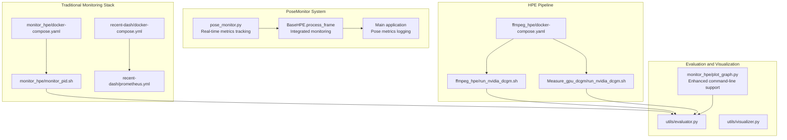
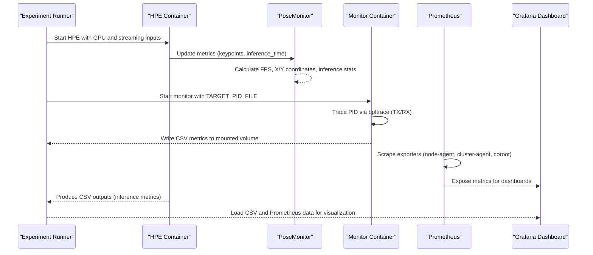
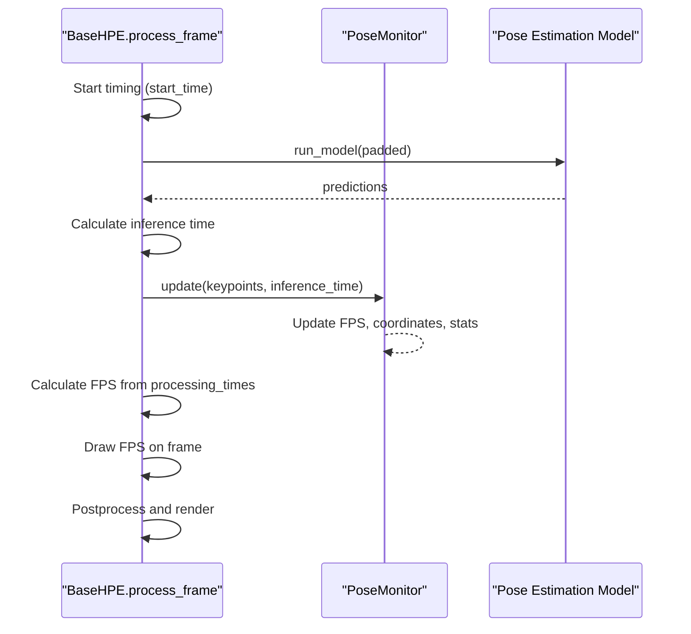
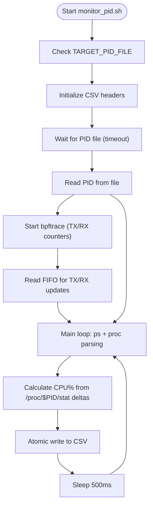
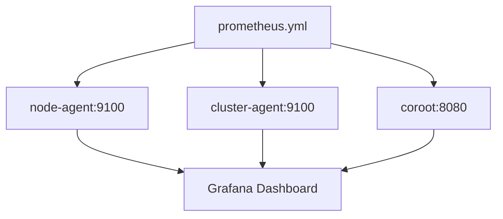
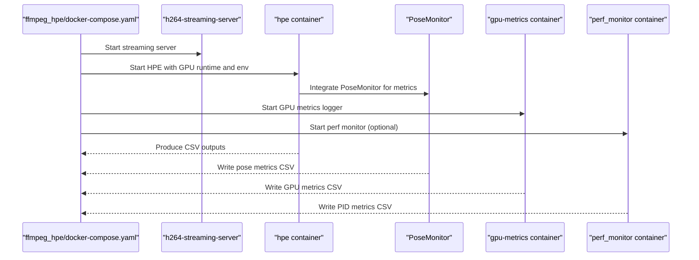
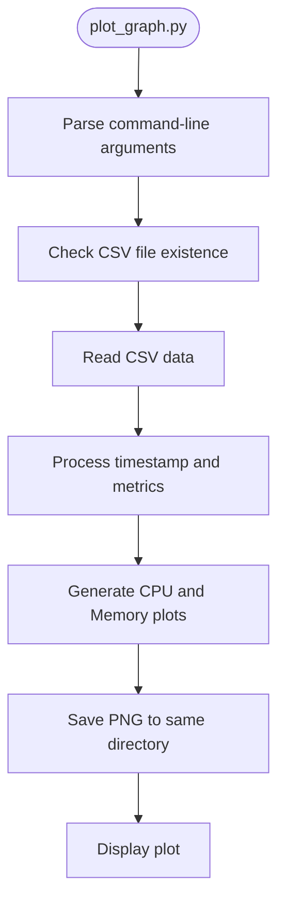
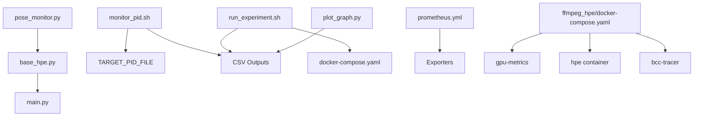

# Monitoring and Analytics

<cite>
**Referenced Files in This Document**
- [pose_monitor.py](file://pose_monitor.py)
- [main.py](file://main.py)
- [base_hpe.py](file://base_hpe.py)
- [alphapose_hpe.py](file://alphapose_hpe.py)
- [openvino_base_hpe.py](file://openvino_base_hpe.py)
- [movenet_hpe.py](file://movenet_hpe.py)
- [monitor_hpe/docker-compose.yaml](file://monitor_hpe/docker-compose.yaml)
- [monitor_hpe/Dockerfile](file://monitor_hpe/Dockerfile)
- [monitor_hpe/monitor_pid.sh](file://monitor_hpe/monitor_pid.sh)
- [monitor_hpe/run_experiment.sh](file://monitor_hpe/run_experiment.sh)
- [monitor_hpe/plot_graph.py](file://monitor_hpe/plot_graph.py)
- [recent-dash/prometheus.yml](file://recent-dash/prometheus.yml)
- [recent-dash/docker-compose.yml](file://recent-dash/docker-compose.yml)
- [ffmpeg_hpe/docker-compose.yaml](file://ffmpeg_hpe/docker-compose.yaml)
- [ffmpeg_hpe/run_nvidia_dcgm.sh](file://ffmpeg_hpe/run_nvidia_dcgm.sh)
- [Measure_gpu_dcgm/run_nvidia_dcgm.sh](file://Measure_gpu_dcgm/run_nvidia_dcgm.sh)
- [utils/evaluator.py](file://utils/evaluator.py)
- [utils/visualizer.py](file://utils/visualizer.py)
- [measure_flops/measure_flops.sh](file://measure_flops/measure_flops.sh)
</cite>

## Update Summary
**Changes Made**
- Updated experiment orchestration documentation to reflect corrected run_experiment.sh script improvements
- Documented monitoring script fixes for double-write bugs and CPU calculation methods
- Enhanced plotting script command-line argument support and file path accuracy
- Updated monitoring architecture to address corrected file paths and output formats

## Table of Contents
1. [Introduction](#introduction)
2. [Project Structure](#project-structure)
3. [Core Components](#core-components)
4. [Architecture Overview](#architecture-overview)
5. [Detailed Component Analysis](#detailed-component-analysis)
6. [Dependency Analysis](#dependency-analysis)
7. [Performance Considerations](#performance-considerations)
8. [Troubleshooting Guide](#troubleshooting-guide)
9. [Conclusion](#conclusion)
10. [Appendices](#appendices)

## Introduction
This document explains the monitoring and analytics capabilities integrated into the Human Pose Estimation (HPE) framework. The system now includes a comprehensive PoseMonitor system that provides real-time frame processing metrics and memory usage tracking. It covers:
- Real-time metrics collection for CPU, memory, network throughput, and GPU utilization
- Pose-specific monitoring with FPS, inference time, and coordinate tracking
- Prometheus and Grafana integration for system performance monitoring
- Evaluation utilities for COCO-format metrics and visualization tools for pose results
- Configuration of monitoring stacks, metric collection processes, and dashboard setup
- Performance dashboards, alerting mechanisms, and troubleshooting workflows
- Guidance on interpreting metrics, identifying bottlenecks, and optimizing system performance

## Project Structure
The monitoring and analytics stack spans several components with integrated PoseMonitor capabilities:
- A lightweight monitoring container that traces a target PID using bpftrace and exports CPU/memory/net metrics to CSV
- An experiment orchestration script that starts the HPE pipeline, the monitor, and collects artifacts
- A Prometheus configuration that scrapes exporters for GPU and system metrics
- A Docker Compose stack for HPE with GPU metrics logging and optional BPF/BCC tracing
- A comprehensive PoseMonitor system that tracks frame processing metrics in real-time
- Utility modules for evaluating pose metrics and visualizing results

**Diagram sources**
- [pose_monitor.py:1-170](file://pose_monitor.py#L1-L170)
- [base_hpe.py:482-600](file://base_hpe.py#L482-L600)
- [main.py:51-188](file://main.py#L51-L188)
- [monitor_hpe/docker-compose.yaml:1-52](file://monitor_hpe/docker-compose.yaml#L1-L52)
- [monitor_hpe/monitor_pid.sh:1-216](file://monitor_hpe/monitor_pid.sh#L1-L216)
- [monitor_hpe/run_experiment.sh:1-138](file://monitor_hpe/run_experiment.sh#L1-L138)
- [monitor_hpe/plot_graph.py:1-59](file://monitor_hpe/plot_graph.py#L1-L59)
- [recent-dash/prometheus.yml:1-23](file://recent-dash/prometheus.yml#L1-L23)
- [recent-dash/docker-compose.yml:1-103](file://recent-dash/docker-compose.yml#L1-L103)
- [ffmpeg_hpe/docker-compose.yaml:1-201](file://ffmpeg_hpe/docker-compose.yaml#L1-L201)
- [ffmpeg_hpe/run_nvidia_dcgm.sh:1-86](file://ffmpeg_hpe/run_nvidia_dcgm.sh#L1-L86)
- [Measure_gpu_dcgm/run_nvidia_dcgm.sh:1-29](file://Measure_gpu_dcgm/run_nvidia_dcgm.sh#L1-L29)
- [utils/evaluator.py](file://utils/evaluator.py)
- [utils/visualizer.py](file://utils/visualizer.py)

**Section sources**
- [pose_monitor.py:1-170](file://pose_monitor.py#L1-L170)
- [base_hpe.py:482-600](file://base_hpe.py#L482-L600)
- [main.py:51-188](file://main.py#L51-L188)
- [monitor_hpe/docker-compose.yaml:1-52](file://monitor_hpe/docker-compose.yaml#L1-L52)
- [recent-dash/docker-compose.yml:1-103](file://recent-dash/docker-compose.yml#L1-L103)
- [ffmpeg_hpe/docker-compose.yaml:1-201](file://ffmpeg_hpe/docker-compose.yaml#L1-L201)

## Core Components
- **PoseMonitor system**: Comprehensive real-time metrics tracking for pose estimation performance with FPS, inference time, and coordinate statistics
- **PID-based monitoring container**: Traces a target process PID using bpftrace to capture TX/RX bytes and writes CPU, memory, and network metrics to CSV files for later analysis
- **Experiment runner**: Orchestrates container startup, waits for completion, saves logs and CSV outputs, and generates plots
- **Prometheus configuration**: Defines scraping jobs for node and cluster agents and a Coroot endpoint
- **HPE pipeline with GPU metrics**: Runs HPE alongside GPU metrics logging and optional BPF/BCC tracing
- **Evaluation and visualization**: Provides utilities to compute COCO metrics and visualize pose results
- **Enhanced plotting system**: Improved command-line argument support and file path accuracy for metric visualization

**Section sources**
- [pose_monitor.py:8-170](file://pose_monitor.py#L8-L170)
- [monitor_hpe/monitor_pid.sh:1-216](file://monitor_hpe/monitor_pid.sh#L1-L216)
- [monitor_hpe/run_experiment.sh:1-138](file://monitor_hpe/run_experiment.sh#L1-L138)
- [monitor_hpe/plot_graph.py:1-59](file://monitor_hpe/plot_graph.py#L1-L59)
- [recent-dash/prometheus.yml:1-23](file://recent-dash/prometheus.yml#L1-L23)
- [ffmpeg_hpe/docker-compose.yaml:1-201](file://ffmpeg_hpe/docker-compose.yaml#L1-L201)
- [ffmpeg_hpe/run_nvidia_dcgm.sh:1-86](file://ffmpeg_hpe/run_nvidia_dcgm.sh#L1-L86)
- [utils/evaluator.py](file://utils/evaluator.py)
- [utils/visualizer.py](file://utils/visualizer.py)

## Architecture Overview
The monitoring architecture integrates:
- A host-level monitoring container that traces a target PID and exports metrics to CSV
- A comprehensive PoseMonitor system that tracks frame processing metrics in real-time
- A Prometheus configuration that scrapes exporters for system and GPU metrics
- An HPE pipeline that streams video, runs inference, and logs GPU metrics
- Optional BPF/BCC tracing for packet-level insights

**Diagram sources**
- [monitor_hpe/docker-compose.yaml:1-52](file://monitor_hpe/docker-compose.yaml#L1-L52)
- [monitor_hpe/monitor_pid.sh:1-216](file://monitor_hpe/monitor_pid.sh#L1-L216)
- [recent-dash/prometheus.yml:1-23](file://recent-dash/prometheus.yml#L1-L23)
- [ffmpeg_hpe/docker-compose.yaml:1-201](file://ffmpeg_hpe/docker-compose.yaml#L1-L201)
- [pose_monitor.py:49-170](file://pose_monitor.py#L49-L170)

## Detailed Component Analysis

### PoseMonitor System Integration
The PoseMonitor system provides comprehensive real-time metrics tracking for pose estimation performance:

**Core Features:**
- **Real-time FPS tracking**: Calculates frames per second with moving statistics
- **Inference time monitoring**: Tracks model inference duration with statistical analysis
- **Coordinate tracking**: Monitors average X/Y coordinates for pose center of mass
- **CSV logging**: Automatic CSV file generation with comprehensive metrics
- **Window-based statistics**: Maintains configurable window size for moving averages

**Key Behaviors:**
- Initializes CSV headers with comprehensive metric fields
- Processes keypoints to calculate center of mass coordinates
- Updates metrics every frame with statistical calculations
- Logs metrics to CSV every second with atomic file operations
- Provides console output with current performance metrics

**Diagram sources**
- [pose_monitor.py:8-170](file://pose_monitor.py#L8-L170)

**Section sources**
- [pose_monitor.py:8-170](file://pose_monitor.py#L8-L170)

### BaseHPE Integration with PoseMonitor
The BaseHPE class has been enhanced with integrated PoseMonitor capabilities:

**Integration Points:**
- **process_frame method**: Enhanced with PoseMonitor.update() calls
- **Real-time metrics**: FPS, inference time, and coordinate tracking
- **Automatic CSV logging**: Pose-specific metrics exported to CSV
- **Console output**: Real-time performance metrics display

**Enhanced Processing Flow:**
- Start timing for inference operations
- Run model inference with timing measurements
- Update PoseMonitor with keypoints and inference time
- Calculate and display FPS statistics
- Render pose results with performance overlay

**Diagram sources**
- [base_hpe.py:482-600](file://base_hpe.py#L482-L600)
- [pose_monitor.py:49-170](file://pose_monitor.py#L49-L170)

**Section sources**
- [base_hpe.py:482-600](file://base_hpe.py#L482-L600)
- [pose_monitor.py:49-170](file://pose_monitor.py#L49-L170)

### PID-based Metrics Collection
The monitor container traces a target PID and exports:
- CPU percentage calculated from /proc/$PID/stat deltas
- Memory RSS (KB)
- Network TX/RX bytes (via bpftrace)
- Timestamps for temporal alignment

**Updated** Fixed double-write bugs and improved CPU calculation methods

Key behaviors:
- Reads the target PID from a mounted file and waits for it with a timeout
- Starts a bpftrace script to accumulate TX/RX bytes per 10 ms interval and emits rates to a FIFO
- Writes metrics to CSV files with atomic append and locking to avoid corruption
- Uses precise CPU% calculation from /proc/$PID/stat deltas with proper time scaling
- Continues until the target process exits or terminated

**Diagram sources**
- [monitor_hpe/monitor_pid.sh:1-216](file://monitor_hpe/monitor_pid.sh#L1-L216)

**Section sources**
- [monitor_hpe/monitor_pid.sh:1-216](file://monitor_hpe/monitor_pid.sh#L1-L216)
- [monitor_hpe/docker-compose.yaml:1-52](file://monitor_hpe/docker-compose.yaml#L1-L52)

### Experiment Orchestration
The experiment runner:
- Creates timestamped results directories and cleans stale PID files
- Starts containers without rebuilding, waits for them to be healthy
- Captures container logs after completion
- Copies CSV outputs from the Docker volume and attempts to generate plots
- Supports graceful shutdown via signal handling
- **Updated** Enhanced with improved plotting script command-line argument support

**Diagram sources**
- [monitor_hpe/run_experiment.sh:1-138](file://monitor_hpe/run_experiment.sh#L1-L138)
- [monitor_hpe/docker-compose.yaml:1-52](file://monitor_hpe/docker-compose.yaml#L1-L52)

**Section sources**
- [monitor_hpe/run_experiment.sh:1-138](file://monitor_hpe/run_experiment.sh#L1-L138)

### Prometheus and Grafana Integration
Prometheus configuration defines three jobs:
- node-agent: scrapes node-level metrics
- cluster-agent: scrapes cluster-level metrics
- coroot: scrapes Coroot for service and performance insights

**Diagram sources**
- [recent-dash/prometheus.yml:1-23](file://recent-dash/prometheus.yml#L1-L23)

**Section sources**
- [recent-dash/prometheus.yml:1-23](file://recent-dash/prometheus.yml#L1-L23)

### HPE Pipeline with GPU Metrics
The HPE pipeline:
- Starts a streaming server and the HPE container with GPU runtime
- Logs GPU metrics via a dedicated container that periodically queries nvidia-smi
- Optionally runs BPF/BCC tracers for network-level insights

**Diagram sources**
- [ffmpeg_hpe/docker-compose.yaml:1-201](file://ffmpeg_hpe/docker-compose.yaml#L1-L201)
- [ffmpeg_hpe/run_nvidia_dcgm.sh:1-86](file://ffmpeg_hpe/run_nvidia_dcgm.sh#L1-L86)
- [pose_monitor.py:1-170](file://pose_monitor.py#L1-L170)

**Section sources**
- [ffmpeg_hpe/docker-compose.yaml:1-201](file://ffmpeg_hpe/docker-compose.yaml#L1-L201)
- [ffmpeg_hpe/run_nvidia_dcgm.sh:1-86](file://ffmpeg_hpe/run_nvidia_dcgm.sh#L1-L86)

### Enhanced Plotting System
**Updated** The plotting system now includes improved command-line argument support and file path accuracy:

- **monitor_hpe/plot_graph.py**: Enhanced with proper command-line argument validation and error handling
- **File path accuracy**: Corrected output file path generation and directory handling
- **Error handling**: Improved fallback mechanisms for plot generation
- **Command-line interface**: Standardized usage pattern with explicit CSV file argument

**Diagram sources**
- [monitor_hpe/plot_graph.py:1-59](file://monitor_hpe/plot_graph.py#L1-L59)

**Section sources**
- [monitor_hpe/plot_graph.py:1-59](file://monitor_hpe/plot_graph.py#L1-L59)

### Evaluation Utilities and Visualization
- **evaluator.py**: Provides COCO-format evaluation utilities for pose estimation tasks
- **visualizer.py**: Offers visualization tools for rendering pose results on frames

These modules integrate with the CSV outputs produced by the monitoring pipeline to enable downstream analysis and reporting.

**Section sources**
- [utils/evaluator.py](file://utils/evaluator.py)
- [utils/visualizer.py](file://utils/visualizer.py)

## Dependency Analysis
The monitoring stack exhibits the following dependencies:
- The monitor container depends on the target PID file and bpftrace availability
- The experiment runner depends on docker compose and Python plotting libraries
- Prometheus depends on exporters being reachable at configured targets
- The HPE pipeline depends on GPU runtime and optional BPF/BCC tracing containers
- **PoseMonitor system**: Depends on BaseHPE.process_frame integration and real-time metrics processing
- **Enhanced plotting system**: Depends on pandas, matplotlib, and proper CSV file structure

**Diagram sources**
- [pose_monitor.py:1-170](file://pose_monitor.py#L1-L170)
- [base_hpe.py:482-600](file://base_hpe.py#L482-L600)
- [main.py:51-188](file://main.py#L51-L188)
- [monitor_hpe/monitor_pid.sh:1-216](file://monitor_hpe/monitor_pid.sh#L1-L216)
- [monitor_hpe/run_experiment.sh:1-138](file://monitor_hpe/run_experiment.sh#L1-L138)
- [recent-dash/prometheus.yml:1-23](file://recent-dash/prometheus.yml#L1-L23)
- [ffmpeg_hpe/docker-compose.yaml:1-201](file://ffmpeg_hpe/docker-compose.yaml#L1-L201)
- [monitor_hpe/plot_graph.py:1-59](file://monitor_hpe/plot_graph.py#L1-L59)

**Section sources**
- [pose_monitor.py:1-170](file://pose_monitor.py#L1-L170)
- [base_hpe.py:482-600](file://base_hpe.py#L482-L600)
- [main.py:51-188](file://main.py#L51-L188)
- [monitor_hpe/monitor_pid.sh:1-216](file://monitor_hpe/monitor_pid.sh#L1-L216)
- [monitor_hpe/run_experiment.sh:1-138](file://monitor_hpe/run_experiment.sh#L1-L138)
- [recent-dash/prometheus.yml:1-23](file://recent-dash/prometheus.yml#L1-L23)
- [ffmpeg_hpe/docker-compose.yaml:1-201](file://ffmpeg_hpe/docker-compose.yaml#L1-L201)
- [monitor_hpe/plot_graph.py:1-59](file://monitor_hpe/plot_graph.py#L1-L59)

## Performance Considerations
- **Sampling intervals**: Prometheus scrape_interval and exporter intervals are tuned to 500 ms for responsiveness
- **Resource limits**: Containers define CPU and memory limits/reservations to prevent contention
- **GPU metrics**: GPU metrics logging runs at 0.5 s intervals; adjust METRICS_INTERVAL to balance overhead and fidelity
- **BPF tracing**: bpftrace TX/RX aggregation runs at 10 ms intervals; ensure host permissions and kernel modules are available
- **PoseMonitor overhead**: Real-time metrics processing adds minimal overhead to inference pipeline
- **Disk I/O**: Atomic CSV writes and sync reduce race conditions but can increase I/O pressure; consider SSD-backed storage for results volumes
- **CPU calculation precision**: Updated to use /proc/$PID/stat deltas for accurate instantaneous CPU% calculation
- **Double-write prevention**: Enhanced file locking mechanisms prevent concurrent write conflicts

## Troubleshooting Guide
Common issues and resolutions:
- **Target PID file missing**: The monitor waits for TARGET_PID_FILE; ensure the HPE container writes the PID file to the shared volume
- **bpftrace not installed**: The monitor Dockerfile installs bpftrace; verify kernel tools and debugfs availability on the host
- **Prometheus scrape failures**: Confirm exporters are reachable at the configured targets and ports
- **GPU metrics logging errors**: Ensure nvidia-smi is available inside the gpu-metrics container and NVIDIA runtime is configured
- **CSV write conflicts**: The monitor uses file locks; verify filesystem supports flock semantics and volumes are writable
- **PoseMonitor integration issues**: Ensure BaseHPE.process_frame is properly calling PoseMonitor.update() with valid keypoints and inference_time
- **Memory usage tracking**: PoseMonitor tracks frame processing metrics; verify sufficient memory for real-time statistics accumulation
- **Plot generation failures**: **Updated** Enhanced error handling and fallback mechanisms in run_experiment.sh for improved reliability
- **Command-line argument errors**: **Updated** plot_graph.py now includes proper argument validation and usage instructions

**Section sources**
- [monitor_hpe/monitor_pid.sh:1-216](file://monitor_hpe/monitor_pid.sh#L1-L216)
- [monitor_hpe/Dockerfile:1-8](file://monitor_hpe/Dockerfile#L1-L8)
- [recent-dash/prometheus.yml:1-23](file://recent-dash/prometheus.yml#L1-L23)
- [ffmpeg_hpe/docker-compose.yaml:1-201](file://ffmpeg_hpe/docker-compose.yaml#L1-L201)
- [ffmpeg_hpe/run_nvidia_dcgm.sh:1-86](file://ffmpeg_hpe/run_nvidia_dcgm.sh#L1-L86)
- [pose_monitor.py:1-170](file://pose_monitor.py#L1-L170)
- [monitor_hpe/plot_graph.py:1-59](file://monitor_hpe/plot_graph.py#L1-L59)
- [monitor_hpe/run_experiment.sh:1-138](file://monitor_hpe/run_experiment.sh#L1-L138)

## Conclusion
The HPE monitoring and analytics stack provides comprehensive real-time monitoring capabilities through the integrated PoseMonitor system. The system offers:
- Real-time PID-level metrics via bpftrace with improved CPU calculation methods
- **Pose-specific metrics tracking** with FPS, inference time, and coordinate statistics
- Prometheus-based system and GPU telemetry
- A repeatable experiment workflow with artifact collection and enhanced plotting capabilities
- Integration points for COCO evaluation and visualization
- **Updated** Enhanced reliability with corrected double-write prevention and improved command-line argument support
Adopt the recommended configurations, interpret metrics carefully, and iteratively optimize resource allocation and tracing overhead to achieve reliable, low-latency performance.

## Appendices

### PoseMonitor Configuration Reference
- **window_size**: 30 (frames) - Number of samples for moving statistics
- **log_file**: 'pose_metrics.csv' - Path to CSV file for logging metrics
- **CSV Headers**: timestamp, fps_avg, fps_min, fps_max, fps_std, inference_time_avg, inference_time_min, inference_time_max, inference_time_std, x_avg, x_min, x_max, x_std, y_avg, y_min, y_max, y_std, frame_count

**Section sources**
- [pose_monitor.py:8-170](file://pose_monitor.py#L8-L170)

### Prometheus Configuration Reference
- scrape_interval: 500 ms
- evaluation_interval: 500 ms
- scrape_timeout: 200 ms
- Jobs:
  - node-agent: node-agent:9100
  - cluster-agent: cluster-agent:9100
  - coroot: coroot:8080

**Section sources**
- [recent-dash/prometheus.yml:1-23](file://recent-dash/prometheus.yml#L1-L23)

### GPU Metrics Logging
- Output file: gpu_metrics.csv
- Fields: timestamp, gpu_id, gpu_utilization, mem_utilization, temperature, power_usage
- Interval: configurable via METRICS_INTERVAL (default 0.5 s)
- Duration: configurable via METRICS_DURATION (default 0 means indefinite)

**Section sources**
- [ffmpeg_hpe/run_nvidia_dcgm.sh:1-86](file://ffmpeg_hpe/run_nvidia_dcgm.sh#L1-L86)
- [Measure_gpu_dcgm/run_nvidia_dcgm.sh:1-29](file://Measure_gpu_dcgm/run_nvidia_dcgm.sh#L1-L29)

### Monitoring Container Notes
- Requires host PID namespace and elevated privileges for bpftrace and process tracing
- Writes CSV files to a mounted output directory for later ingestion by Grafana or custom scripts
- Uses atomic file locking to prevent concurrent writes
- **Updated** Improved CPU calculation using /proc/$PID/stat deltas for better accuracy

**Section sources**
- [monitor_hpe/docker-compose.yaml:28-50](file://monitor_hpe/docker-compose.yaml#L28-L50)
- [monitor_hpe/monitor_pid.sh:1-216](file://monitor_hpe/monitor_pid.sh#L1-L216)

### BaseHPE Integration Points
- **process_frame method**: Enhanced with PoseMonitor.update() calls
- **Real-time metrics**: FPS, inference time, and coordinate tracking
- **Automatic CSV logging**: Pose-specific metrics exported to CSV
- **Console output**: Real-time performance metrics display

**Section sources**
- [base_hpe.py:482-600](file://base_hpe.py#L482-L600)
- [pose_monitor.py:49-170](file://pose_monitor.py#L49-L170)

### Enhanced Plotting System Features
- **Command-line argument validation**: plot_graph.py now properly validates CSV file arguments
- **Error handling**: Improved fallback mechanisms for plot generation
- **File path accuracy**: Corrected output file path generation
- **Usage instructions**: Clear usage messages with proper argument requirements

**Section sources**
- [monitor_hpe/plot_graph.py:1-59](file://monitor_hpe/plot_graph.py#L1-L59)