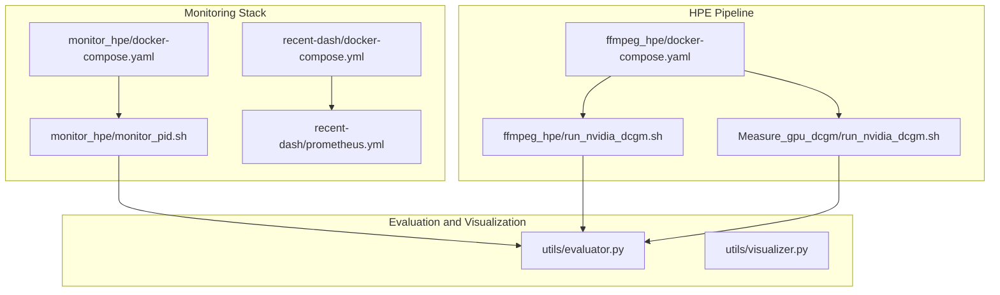
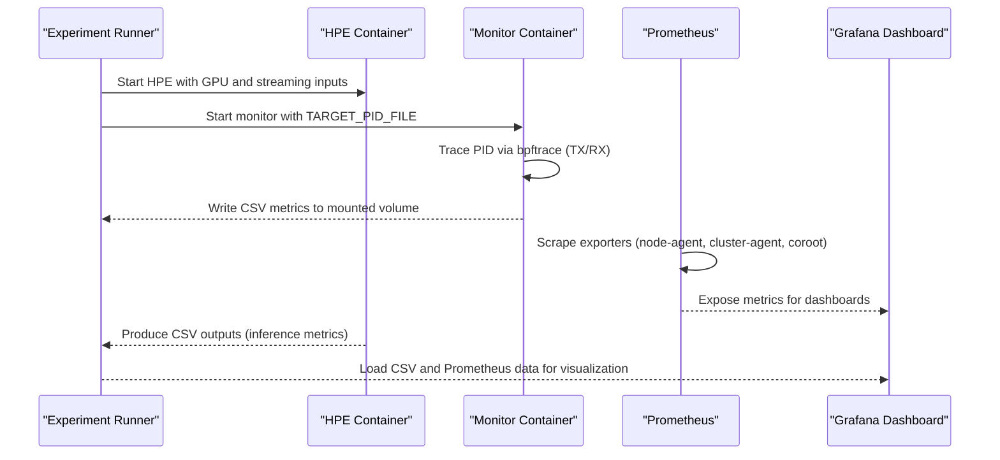
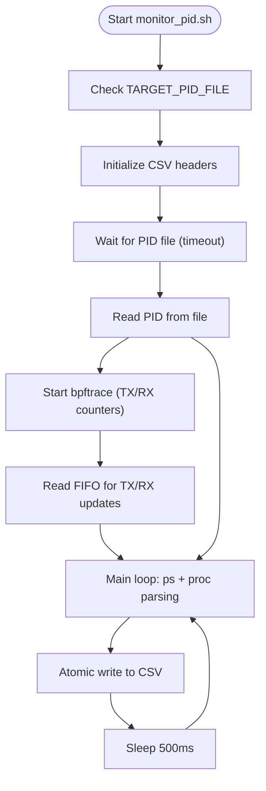
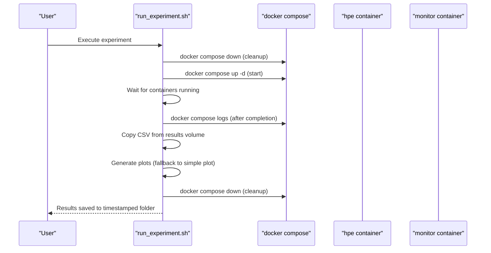
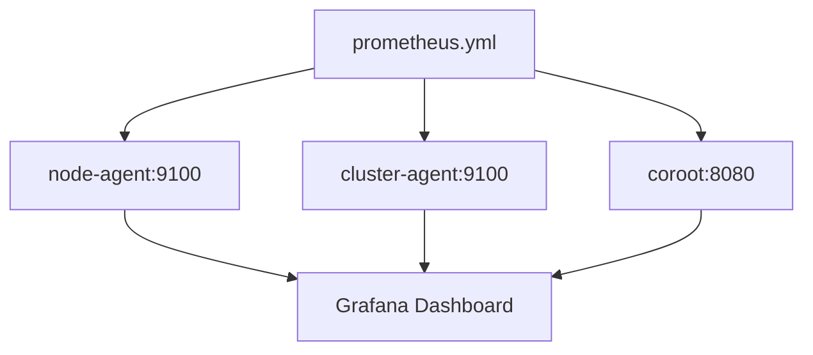
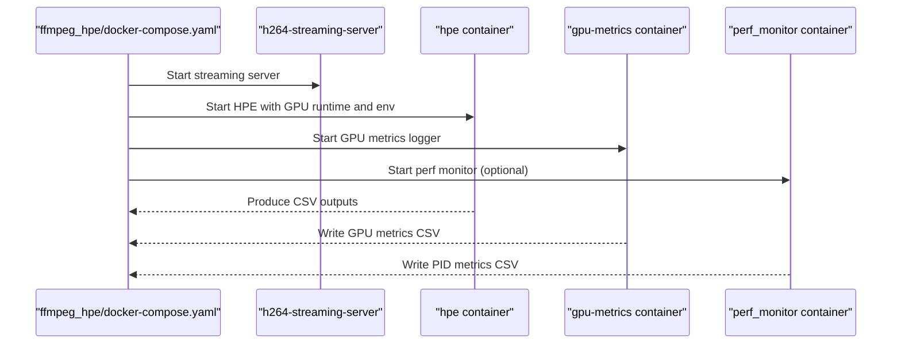
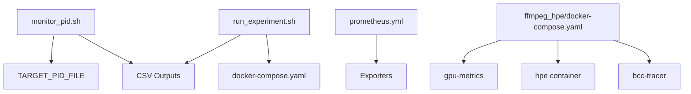

# Monitoring and Analytics

<cite>
**Referenced Files in This Document**
- [monitor_hpe/docker-compose.yaml](file://monitor_hpe/docker-compose.yaml)
- [monitor_hpe/Dockerfile](file://monitor_hpe/Dockerfile)
- [monitor_hpe/monitor_pid.sh](file://monitor_hpe/monitor_pid.sh)
- [monitor_hpe/run_experiment.sh](file://monitor_hpe/run_experiment.sh)
- [recent-dash/prometheus.yml](file://recent-dash/prometheus.yml)
- [recent-dash/docker-compose.yml](file://recent-dash/docker-compose.yml)
- [ffmpeg_hpe/docker-compose.yaml](file://ffmpeg_hpe/docker-compose.yaml)
- [ffmpeg_hpe/run_nvidia_dcgm.sh](file://ffmpeg_hpe/run_nvidia_dcgm.sh)
- [Measure_gpu_dcgm/run_nvidia_dcgm.sh](file://Measure_gpu_dcgm/run_nvidia_dcgm.sh)
- [utils/evaluator.py](file://utils/evaluator.py)
- [utils/visualizer.py](file://utils/visualizer.py)
</cite>

## Table of Contents
1. [Introduction](#introduction)
2. [Project Structure](#project-structure)
3. [Core Components](#core-components)
4. [Architecture Overview](#architecture-overview)
5. [Detailed Component Analysis](#detailed-component-analysis)
6. [Dependency Analysis](#dependency-analysis)
7. [Performance Considerations](#performance-considerations)
8. [Troubleshooting Guide](#troubleshooting-guide)
9. [Conclusion](#conclusion)
10. [Appendices](#appendices)

## Introduction
This document explains the monitoring and analytics capabilities integrated into the Human Pose Estimation (HPE) framework. It covers:
- Real-time metrics collection for CPU, memory, network throughput, and GPU utilization
- Prometheus and Grafana integration for system performance monitoring
- Evaluation utilities for COCO-format metrics and visualization tools for pose results
- Configuration of monitoring stacks, metric collection processes, and dashboard setup
- Performance dashboards, alerting mechanisms, and troubleshooting workflows
- Guidance on interpreting metrics, identifying bottlenecks, and optimizing system performance

## Project Structure
The monitoring and analytics stack spans several components:
- A lightweight monitoring container that traces a target PID using bpftrace and exports CPU/memory/net metrics to CSV
- An experiment orchestration script that starts the HPE pipeline, the monitor, and collects artifacts
- A Prometheus configuration that scrapes exporters for GPU and system metrics
- A Docker Compose stack for HPE with GPU metrics logging and optional BPF/BCC tracing
- Utility modules for evaluating pose metrics and visualizing results

**Diagram sources**
- [monitor_hpe/docker-compose.yaml:1-52](file://monitor_hpe/docker-compose.yaml#L1-L52)
- [monitor_hpe/monitor_pid.sh:1-204](file://monitor_hpe/monitor_pid.sh#L1-L204)
- [recent-dash/prometheus.yml:1-23](file://recent-dash/prometheus.yml#L1-L23)
- [recent-dash/docker-compose.yml:1-103](file://recent-dash/docker-compose.yml#L1-L103)
- [ffmpeg_hpe/docker-compose.yaml:1-201](file://ffmpeg_hpe/docker-compose.yaml#L1-L201)
- [ffmpeg_hpe/run_nvidia_dcgm.sh:1-84](file://ffmpeg_hpe/run_nvidia_dcgm.sh#L1-L84)
- [Measure_gpu_dcgm/run_nvidia_dcgm.sh:1-29](file://Measure_gpu_dcgm/run_nvidia_dcgm.sh#L1-L29)
- [utils/evaluator.py](file://utils/evaluator.py)
- [utils/visualizer.py](file://utils/visualizer.py)

**Section sources**
- [monitor_hpe/docker-compose.yaml:1-52](file://monitor_hpe/docker-compose.yaml#L1-L52)
- [recent-dash/docker-compose.yml:1-103](file://recent-dash/docker-compose.yml#L1-L103)
- [ffmpeg_hpe/docker-compose.yaml:1-201](file://ffmpeg_hpe/docker-compose.yaml#L1-L201)

## Core Components
- PID-based monitoring container: Traces a target process PID using bpftrace to capture TX/RX bytes and writes CPU, memory, and network metrics to CSV files for later analysis.
- Experiment runner: Orchestrates container startup, waits for completion, saves logs and CSV outputs, and generates plots.
- Prometheus configuration: Defines scraping jobs for node and cluster agents and a Coroot endpoint.
- HPE pipeline with GPU metrics: Runs HPE alongside GPU metrics logging and optional BPF/BCC tracing.
- Evaluation and visualization: Provides utilities to compute COCO metrics and visualize pose results.

**Section sources**
- [monitor_hpe/monitor_pid.sh:1-204](file://monitor_hpe/monitor_pid.sh#L1-L204)
- [monitor_hpe/run_experiment.sh:1-138](file://monitor_hpe/run_experiment.sh#L1-L138)
- [recent-dash/prometheus.yml:1-23](file://recent-dash/prometheus.yml#L1-L23)
- [ffmpeg_hpe/docker-compose.yaml:1-201](file://ffmpeg_hpe/docker-compose.yaml#L1-L201)
- [ffmpeg_hpe/run_nvidia_dcgm.sh:1-84](file://ffmpeg_hpe/run_nvidia_dcgm.sh#L1-L84)
- [utils/evaluator.py](file://utils/evaluator.py)
- [utils/visualizer.py](file://utils/visualizer.py)

## Architecture Overview
The monitoring architecture integrates:
- A host-level monitoring container that traces a target PID and exports metrics to CSV
- A Prometheus configuration that scrapes exporters for system and GPU metrics
- An HPE pipeline that streams video, runs inference, and logs GPU metrics
- Optional BPF/BCC tracing for packet-level insights

**Diagram sources**
- [monitor_hpe/docker-compose.yaml:1-52](file://monitor_hpe/docker-compose.yaml#L1-L52)
- [monitor_hpe/monitor_pid.sh:1-204](file://monitor_hpe/monitor_pid.sh#L1-L204)
- [recent-dash/prometheus.yml:1-23](file://recent-dash/prometheus.yml#L1-L23)
- [ffmpeg_hpe/docker-compose.yaml:1-201](file://ffmpeg_hpe/docker-compose.yaml#L1-L201)

## Detailed Component Analysis

### PID-based Metrics Collection
The monitor container traces a target PID and exports:
- CPU percentage
- Memory RSS (KB)
- Network TX/RX bytes (via bpftrace)
- Timestamps for temporal alignment

Key behaviors:
- Reads the target PID from a mounted file and waits for it with a timeout
- Starts a bpftrace script to accumulate TX/RX bytes per 10 ms interval and emits rates to a FIFO
- Writes metrics to CSV files with atomic append and locking to avoid corruption
- Continues until the target process exits or terminated

**Diagram sources**
- [monitor_hpe/monitor_pid.sh:1-204](file://monitor_hpe/monitor_pid.sh#L1-L204)

**Section sources**
- [monitor_hpe/monitor_pid.sh:1-204](file://monitor_hpe/monitor_pid.sh#L1-L204)
- [monitor_hpe/docker-compose.yaml:1-52](file://monitor_hpe/docker-compose.yaml#L1-L52)

### Experiment Orchestration
The experiment runner:
- Creates timestamped results directories and cleans stale PID files
- Starts containers without rebuilding, waits for them to be healthy
- Captures container logs after completion
- Copies CSV outputs from the Docker volume and attempts to generate plots
- Supports graceful shutdown via signal handling

**Diagram sources**
- [monitor_hpe/run_experiment.sh:1-138](file://monitor_hpe/run_experiment.sh#L1-L138)
- [monitor_hpe/docker-compose.yaml:1-52](file://monitor_hpe/docker-compose.yaml#L1-L52)

**Section sources**
- [monitor_hpe/run_experiment.sh:1-138](file://monitor_hpe/run_experiment.sh#L1-L138)

### Prometheus and Grafana Integration
Prometheus configuration defines three jobs:
- node-agent: scrapes node-level metrics
- cluster-agent: scrapes cluster-level metrics
- coroot: scrapes Coroot for service and performance insights

**Diagram sources**
- [recent-dash/prometheus.yml:1-23](file://recent-dash/prometheus.yml#L1-L23)

**Section sources**
- [recent-dash/prometheus.yml:1-23](file://recent-dash/prometheus.yml#L1-L23)

### HPE Pipeline with GPU Metrics
The HPE pipeline:
- Starts a streaming server and the HPE container with GPU runtime
- Logs GPU metrics via a dedicated container that periodically queries nvidia-smi
- Optionally runs BPF/BCC tracers for network-level insights

**Diagram sources**
- [ffmpeg_hpe/docker-compose.yaml:1-201](file://ffmpeg_hpe/docker-compose.yaml#L1-L201)
- [ffmpeg_hpe/run_nvidia_dcgm.sh:1-84](file://ffmpeg_hpe/run_nvidia_dcgm.sh#L1-L84)

**Section sources**
- [ffmpeg_hpe/docker-compose.yaml:1-201](file://ffmpeg_hpe/docker-compose.yaml#L1-L201)
- [ffmpeg_hpe/run_nvidia_dcgm.sh:1-84](file://ffmpeg_hpe/run_nvidia_dcgm.sh#L1-L84)

### Evaluation Utilities and Visualization
- evaluator.py: Provides COCO-format evaluation utilities for pose estimation tasks
- visualizer.py: Offers visualization tools for rendering pose results on frames

These modules integrate with the CSV outputs produced by the monitoring pipeline to enable downstream analysis and reporting.

**Section sources**
- [utils/evaluator.py](file://utils/evaluator.py)
- [utils/visualizer.py](file://utils/visualizer.py)

## Dependency Analysis
The monitoring stack exhibits the following dependencies:
- The monitor container depends on the target PID file and bpftrace availability
- The experiment runner depends on docker compose and Python plotting libraries
- Prometheus depends on exporters being reachable at configured targets
- The HPE pipeline depends on GPU runtime and optional BPF/BCC tracing containers

**Diagram sources**
- [monitor_hpe/monitor_pid.sh:1-204](file://monitor_hpe/monitor_pid.sh#L1-L204)
- [monitor_hpe/run_experiment.sh:1-138](file://monitor_hpe/run_experiment.sh#L1-L138)
- [recent-dash/prometheus.yml:1-23](file://recent-dash/prometheus.yml#L1-L23)
- [ffmpeg_hpe/docker-compose.yaml:1-201](file://ffmpeg_hpe/docker-compose.yaml#L1-L201)

**Section sources**
- [monitor_hpe/monitor_pid.sh:1-204](file://monitor_hpe/monitor_pid.sh#L1-L204)
- [monitor_hpe/run_experiment.sh:1-138](file://monitor_hpe/run_experiment.sh#L1-L138)
- [recent-dash/prometheus.yml:1-23](file://recent-dash/prometheus.yml#L1-L23)
- [ffmpeg_hpe/docker-compose.yaml:1-201](file://ffmpeg_hpe/docker-compose.yaml#L1-L201)

## Performance Considerations
- Sampling intervals: Prometheus scrape_interval and exporter intervals are tuned to 500 ms for responsiveness
- Resource limits: Containers define CPU and memory limits/reservations to prevent contention
- GPU metrics: GPU metrics logging runs at 0.5 s intervals; adjust METRICS_INTERVAL to balance overhead and fidelity
- BPF tracing: bpftrace TX/RX aggregation runs at 10 ms intervals; ensure host permissions and kernel modules are available
- Disk I/O: Atomic CSV writes and sync reduce race conditions but can increase I/O pressure; consider SSD-backed storage for results volumes

[No sources needed since this section provides general guidance]

## Troubleshooting Guide
Common issues and resolutions:
- Target PID file missing: The monitor waits for TARGET_PID_FILE; ensure the HPE container writes the PID file to the shared volume
- bpftrace not installed: The monitor Dockerfile installs bpftrace; verify kernel tools and debugfs availability on the host
- Prometheus scrape failures: Confirm exporters are reachable at the configured targets and ports
- GPU metrics logging errors: Ensure nvidia-smi is available inside the gpu-metrics container and NVIDIA runtime is configured
- CSV write conflicts: The monitor uses file locks; verify filesystem supports flock semantics and volumes are writable

**Section sources**
- [monitor_hpe/monitor_pid.sh:1-204](file://monitor_hpe/monitor_pid.sh#L1-L204)
- [monitor_hpe/Dockerfile:1-8](file://monitor_hpe/Dockerfile#L1-L8)
- [recent-dash/prometheus.yml:1-23](file://recent-dash/prometheus.yml#L1-L23)
- [ffmpeg_hpe/docker-compose.yaml:1-201](file://ffmpeg_hpe/docker-compose.yaml#L1-L201)
- [ffmpeg_hpe/run_nvidia_dcgm.sh:1-84](file://ffmpeg_hpe/run_nvidia_dcgm.sh#L1-L84)

## Conclusion
The HPE monitoring and analytics stack provides:
- Real-time PID-level metrics via bpftrace
- Prometheus-based system and GPU telemetry
- A repeatable experiment workflow with artifact collection and plotting
- Integration points for COCO evaluation and visualization
Adopt the recommended configurations, interpret metrics carefully, and iteratively optimize resource allocation and tracing overhead to achieve reliable, low-latency performance.

[No sources needed since this section summarizes without analyzing specific files]

## Appendices

### Prometheus Configuration Reference
- scrape_interval: 500 ms
- evaluation_interval: 500 ms
- scrape_timeout: 200 ms
- Jobs:
  - node-agent: node-agent:9100
  - cluster-agent: cluster-agent:9100
  - coroot: coroot:8080

**Section sources**
- [recent-dash/prometheus.yml:1-23](file://recent-dash/prometheus.yml#L1-L23)

### GPU Metrics Logging
- Output file: gpu_metrics.csv
- Fields: timestamp, gpu_id, gpu_utilization, mem_utilization, temperature, power_usage
- Interval: configurable via METRICS_INTERVAL (default 0.5 s)
- Duration: configurable via METRICS_DURATION (default 0 means indefinite)

**Section sources**
- [ffmpeg_hpe/run_nvidia_dcgm.sh:1-84](file://ffmpeg_hpe/run_nvidia_dcgm.sh#L1-L84)
- [Measure_gpu_dcgm/run_nvidia_dcgm.sh:1-29](file://Measure_gpu_dcgm/run_nvidia_dcgm.sh#L1-L29)

### Monitoring Container Notes
- Requires host PID namespace and elevated privileges for bpftrace and process tracing
- Writes CSV files to a mounted output directory for later ingestion by Grafana or custom scripts
- Uses atomic file locking to prevent concurrent writes

**Section sources**
- [monitor_hpe/docker-compose.yaml:28-50](file://monitor_hpe/docker-compose.yaml#L28-L50)
- [monitor_hpe/monitor_pid.sh:1-204](file://monitor_hpe/monitor_pid.sh#L1-L204)