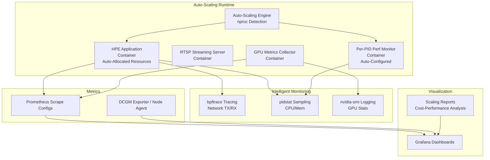
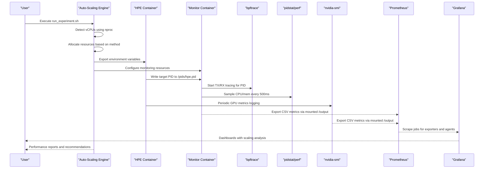
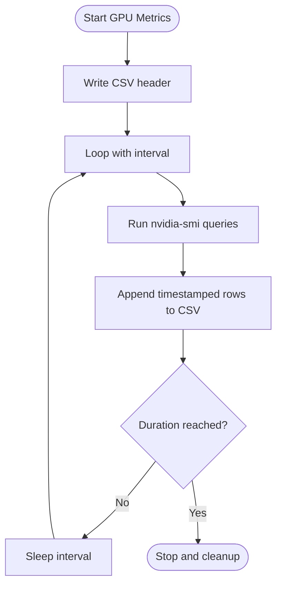
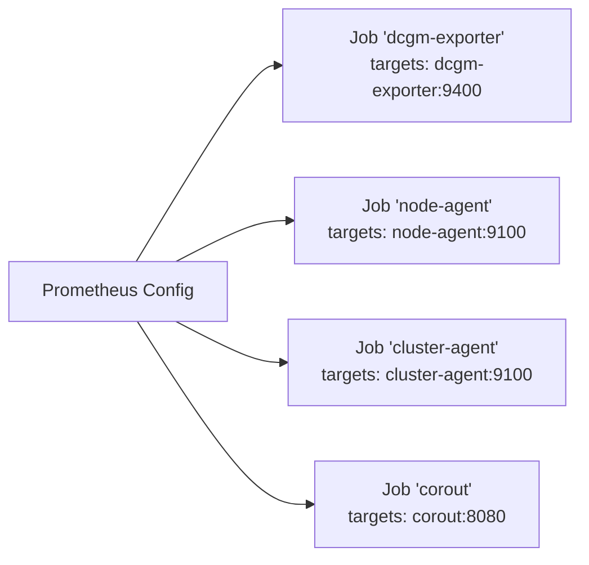
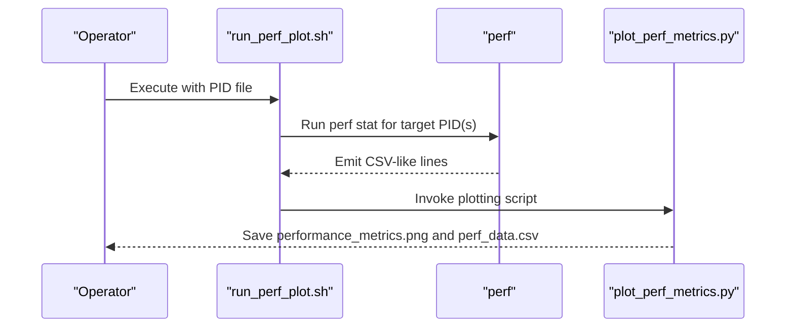
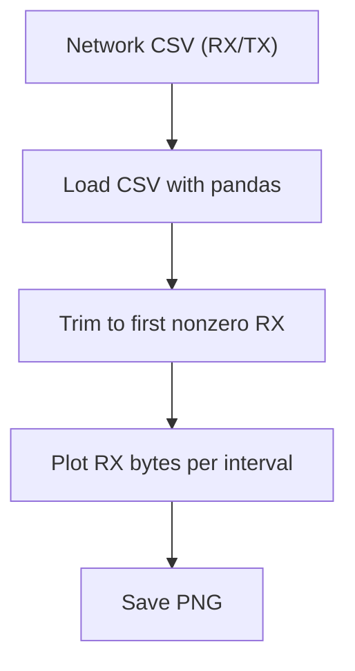
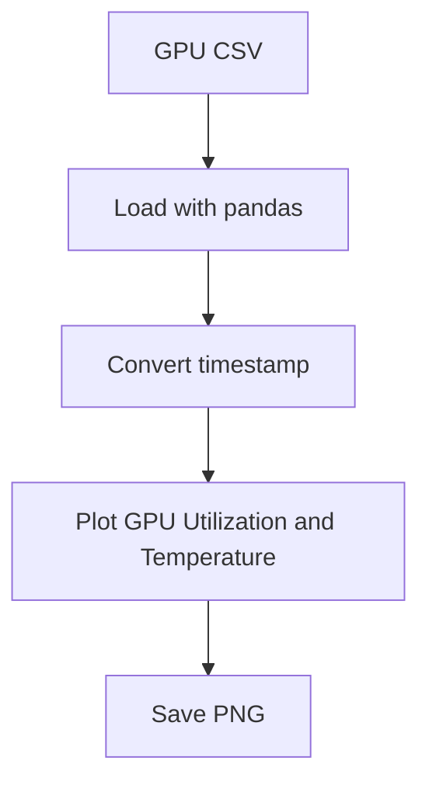
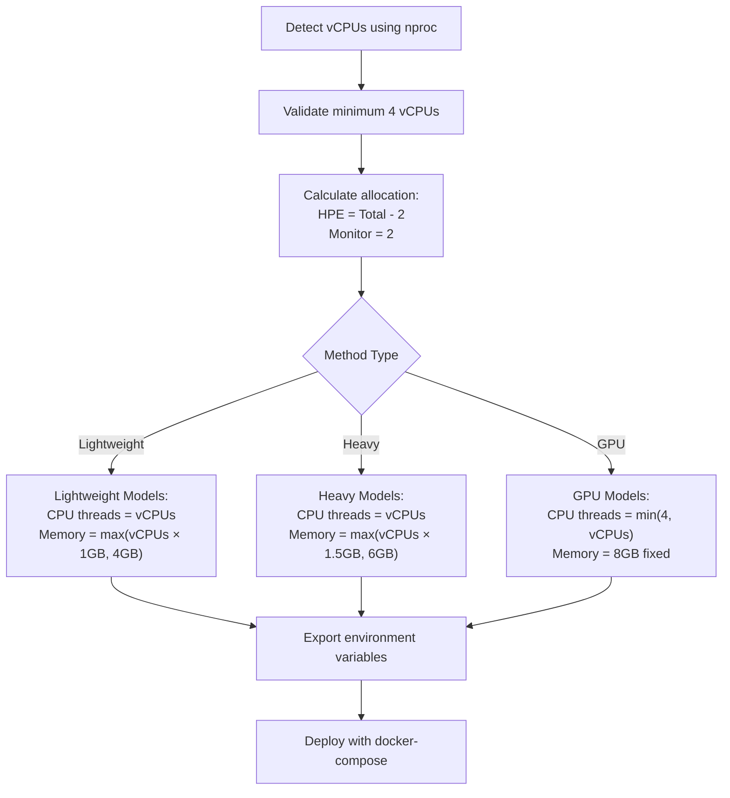
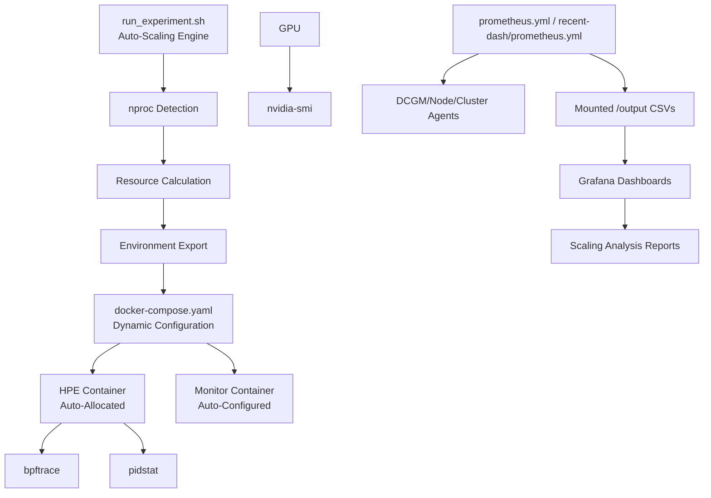

# Performance Monitoring

<cite>
**Referenced Files in This Document**
- [prometheus.yml](file://prometheus.yml)
- [recent-dash/prometheus.yml](file://recent-dash/prometheus.yml)
- [monitor_hpe/docker-compose.yaml](file://monitor_hpe/docker-compose.yaml)
- [ffmpeg_hpe/docker-compose.yaml](file://ffmpeg_hpe/docker-compose.yaml)
- [monitor_hpe/monitor_pid.sh](file://monitor_hpe/monitor_pid.sh)
- [ffmpeg_hpe/monitor_pid.sh](file://ffmpeg_hpe/monitor_pid.sh)
- [ffmpeg_hpe/run_nvidia_dcgm.sh](file://ffmpeg_hpe/run_nvidia_dcgm.sh)
- [Measure_gpu_dcgm/run_nvidia_dcgm.sh](file://Measure_gpu_dcgm/run_nvidia_dcgm.sh)
- [Measure_plot_cpu_perf/run_perf_plot.sh](file://Measure_plot_cpu_perf/run_perf_plot.sh)
- [Measure_plot_cpu_perf/plot_perf_metrics.py](file://Measure_plot_cpu_perf/plot_perf_metrics.py)
- [ffmpeg_hpe/plot_smi_output.py](file://ffmpeg_hpe/plot_smi_output.py)
- [ffmpeg_hpe/plot_rx_bytes.py](file://ffmpeg_hpe/plot_rx_bytes.py)
- [recent-dash/perf_monitor/monitor_pid_perf.sh](file://recent-dash/perf_monitor/monitor_pid_perf.sh)
- [monitor_hpe/run_experiment.sh](file://monitor_hpe/run_experiment.sh)
- [monitor_hpe/SCALING_GUIDE.md](file://monitor_hpe/SCALING_GUIDE.md)
- [monitor_hpe/USAGE.md](file://monitor_hpe/USAGE.md)
- [monitor_hpe/RESOURCE_ALLOCATION.md](file://monitor_hpe/RESOURCE_ALLOCATION.md)
- [monitor_hpe/AUTO_SCALING_IMPLEMENTATION_SUMMARY.md](file://monitor_hpe/AUTO_SCALING_IMPLEMENTATION_SUMMARY.md)
- [monitor_hpe/PLOT_GENERATION_ANALYSIS.md](file://monitor_hpe/PLOT_GENERATION_ANALYSIS.md)
</cite>

## Update Summary
**Changes Made**
- Added comprehensive documentation for the new dynamic resource allocation system
- Integrated detailed scaling analysis across 4, 8, 16, and 32 vCPU VM sizes
- Added extensive cost-performance trade-off analysis and recommendations
- Updated monitoring architecture to include auto-scaling capabilities
- Enhanced performance considerations with scaling efficiency guidelines
- Added troubleshooting sections for auto-scaling scenarios

## Table of Contents
1. [Introduction](#introduction)
2. [Project Structure](#project-structure)
3. [Core Components](#core-components)
4. [Architecture Overview](#architecture-overview)
5. [Detailed Component Analysis](#detailed-component-analysis)
6. [Dynamic Resource Allocation System](#dynamic-resource-allocation-system)
7. [Scaling Analysis and Cost-Performance Trade-offs](#scaling-analysis-and-cost-performance-trade-offs)
8. [Dependency Analysis](#dependency-analysis)
9. [Performance Considerations](#performance-considerations)
10. [Troubleshooting Guide](#troubleshooting-guide)
11. [Conclusion](#conclusion)
12. [Appendices](#appendices)

## Introduction
This document describes the enhanced performance monitoring capabilities in the HPE framework. The system now features a sophisticated dynamic resource allocation system that automatically adapts to different VM sizes (4, 8, 16, 32 vCPUs) with comprehensive scaling analysis and detailed cost-performance trade-off analysis. It explains how CPU utilization, GPU performance metrics, memory consumption, and network throughput are tracked in real time, how Prometheus scrapes metrics, how Grafana dashboards can visualize KPIs, and how custom monitoring scripts integrate with the system. The enhanced system provides automated resource allocation, performance benchmarking across different VM configurations, and practical guidance for optimizing system performance based on workload characteristics.

## Project Structure
The performance monitoring stack now includes an intelligent auto-scaling system that spans several Docker Compose configurations and monitoring scripts:
- **Dynamic Resource Allocation**: Automatic vCPU detection and resource allocation based on VM size and HPE method
- Real-time process and network metrics are collected via bpftrace and pid-based sampling
- GPU metrics are captured using nvidia-smi-based scripts
- Prometheus is configured to scrape exporters and agents
- Grafana dashboards consume Prometheus data to visualize KPIs and trends
- Scripts generate plots for offline analysis and capacity planning
- **Comprehensive Scaling Analysis**: Performance benchmarks across 4-32 vCPU VMs with cost-performance ratios



**Diagram sources**
- [monitor_hpe/run_experiment.sh:12-33](file://monitor_hpe/run_experiment.sh#L12-L33)
- [monitor_hpe/docker-compose.yaml:24-31](file://monitor_hpe/docker-compose.yaml#L24-L31)
- [monitor_hpe/SCALING_GUIDE.md:5](file://monitor_hpe/SCALING_GUIDE.md#L5)
- [monitor_hpe/USAGE.md:28](file://monitor_hpe/USAGE.md#L28)

**Section sources**
- [monitor_hpe/run_experiment.sh:1-235](file://monitor_hpe/run_experiment.sh#L1-L235)
- [monitor_hpe/SCALING_GUIDE.md:1-365](file://monitor_hpe/SCALING_GUIDE.md#L1-L365)
- [monitor_hpe/USAGE.md:1-328](file://monitor_hpe/USAGE.md#L1-L328)
- [monitor_hpe/RESOURCE_ALLOCATION.md:1-290](file://monitor_hpe/RESOURCE_ALLOCATION.md#L1-L290)

## Core Components
- **Dynamic Resource Allocation System**:
  - Automatic vCPU detection using `nproc`
  - Method-aware resource allocation (lightweight, heavy, GPU models)
  - Configurable memory scaling (1-1.5GB per vCPU for CPU models, 8GB fixed for GPU)
  - OpenVINO thread optimization based on available cores
- Per-process CPU/memory/network monitoring:
  - bpftrace-based TX/RX counters for a target PID
  - pid-based sampling for CPU and memory
- GPU metrics logging:
  - nvidia-smi-based periodic logging of GPU utilization, memory utilization, temperature, and power
- Prometheus scraping:
  - Dedicated scrape jobs for DCGM exporter and node/cluster agents
- Grafana dashboards:
  - Visualize Prometheus metrics for KPIs, trends, and capacity planning
- Offline plotting:
  - Scripts to generate plots from collected CSV data for analysis and reporting
- **Comprehensive Scaling Analysis**:
  - Performance benchmarks across 4-32 vCPU VMs
  - Cost-performance ratio calculations
  - Scaling efficiency analysis (83% efficiency at 8 vCPU)
  - Practical recommendations for different use cases

Key metrics produced:
- CPU utilization (%), memory RSS (KB), TX/RX bytes, and throughput (Mbit/s)
- GPU utilization (%), memory utilization (%), temperature (°C), power (W), and memory usage (total/free/used)
- **Auto-Scaling Metrics**: VM size, allocated resources, performance scaling efficiency, cost-effectiveness ratios

**Section sources**
- [monitor_hpe/run_experiment.sh:35-80](file://monitor_hpe/run_experiment.sh#L35-L80)
- [monitor_hpe/SCALING_GUIDE.md:11-35](file://monitor_hpe/SCALING_GUIDE.md#L11-L35)
- [monitor_hpe/USAGE.md:28-64](file://monitor_hpe/USAGE.md#L28-L64)
- [monitor_hpe/RESOURCE_ALLOCATION.md:13-70](file://monitor_hpe/RESOURCE_ALLOCATION.md#L13-L70)

## Architecture Overview
The enhanced monitoring architecture integrates containerized workloads with intelligent auto-scaling and centralized scraping.



**Diagram sources**
- [monitor_hpe/run_experiment.sh:12-103](file://monitor_hpe/run_experiment.sh#L12-L103)
- [monitor_hpe/docker-compose.yaml:17-31](file://monitor_hpe/docker-compose.yaml#L17-L31)
- [monitor_hpe/SCALING_GUIDE.md:147-186](file://monitor_hpe/SCALING_GUIDE.md#L147-L186)

## Detailed Component Analysis

### Real-Time Per-Process Metrics (CPU, Memory, Network)
Two equivalent monitoring scripts collect CPU, memory, and network throughput for a target PID:
- monitor_pid.sh (monitor_hpe): writes CSV with timestamp, PID, CPU %, RSS KB, TX/RX bytes
- monitor_pid.sh (ffmpeg_hpe): similar, with normalization to total CPU capacity and periodic bpftrace TX/RX aggregation


**Diagram sources**
- [monitor_hpe/monitor_pid.sh:100-215](file://monitor_hpe/monitor_pid.sh#L100-L215)
- [ffmpeg_hpe/monitor_pid.sh:72-148](file://ffmpeg_hpe/monitor_pid.sh#L72-L148)

**Section sources**
- [monitor_hpe/monitor_pid.sh:1-215](file://monitor_hpe/monitor_pid.sh#L1-L215)
- [ffmpeg_hpe/monitor_pid.sh:1-151](file://ffmpeg_hpe/monitor_pid.sh#L1-L151)

### GPU Metrics Collection
GPU metrics are collected periodically using nvidia-smi and written to CSV:
- ffmpeg_hpe/run_nvidia_dcgm.sh: configurable interval and duration, writes header, loops with nvidia-smi queries, and supports termination via signal
- Measure_gpu_dcgm/run_nvidia_dcgm.sh: simplified loop writing timestamped GPU stats



**Diagram sources**
- [ffmpeg_hpe/run_nvidia_dcgm.sh:46-80](file://ffmpeg_hpe/run_nvidia_dcgm.sh#L46-L80)
- [Measure_gpu_dcgm/run_nvidia_dcgm.sh:10-27](file://Measure_gpu_dcgm/run_nvidia_dcgm.sh#L10-L27)

**Section sources**
- [ffmpeg_hpe/run_nvidia_dcgm.sh:1-84](file://ffmpeg_hpe/run_nvidia_dcgm.sh#L1-L84)
- [Measure_gpu_dcgm/run_nvidia_dcgm.sh:1-29](file://Measure_gpu_dcgm/run_nvidia_dcgm.sh#L1-L29)

### Prometheus Scraping and Grafana Dashboards
Prometheus is configured to scrape:
- DCGM exporter for GPU metrics
- Node/cluster agents for host/container metrics



**Diagram sources**
- [prometheus.yml:5-8](file://prometheus.yml#L5-L8)
- [recent-dash/prometheus.yml:6-23](file://recent-dash/prometheus.yml#L6-L23)

**Section sources**
- [prometheus.yml:1-8](file://prometheus.yml#L1-L8)
- [recent-dash/prometheus.yml:1-23](file://recent-dash/prometheus.yml#L1-L23)

### CPU Performance Profiling (Optional)
A separate CPU profiling workflow uses perf to capture cpu-clock and cycles at intervals and generates plots.



**Diagram sources**
- [Measure_plot_cpu_perf/run_perf_plot.sh:11-25](file://Measure_plot_cpu_perf/run_perf_plot.sh#L11-L25)
- [Measure_plot_cpu_perf/plot_perf_metrics.py:16-145](file://Measure_plot_cpu_perf/plot_perf_metrics.py#L16-L145)

**Section sources**
- [Measure_plot_cpu_perf/run_perf_plot.sh:1-25](file://Measure_plot_cpu_perf/run_perf_plot.sh#L1-L25)
- [Measure_plot_cpu_perf/plot_perf_metrics.py:1-146](file://Measure_plot_cpu_perf/plot_perf_metrics.py#L1-L146)

### Network Throughput Visualization
Network RX/TX traces can be plotted from CSV outputs for trend analysis and capacity planning.



**Diagram sources**
- [ffmpeg_hpe/plot_rx_bytes.py:10-23](file://ffmpeg_hpe/plot_rx_bytes.py#L10-L23)

**Section sources**
- [ffmpeg_hpe/plot_rx_bytes.py:1-24](file://ffmpeg_hpe/plot_rx_bytes.py#L1-L24)

### GPU Metric Visualization
GPU metrics CSV can be plotted to visualize utilization and temperature over time.



**Diagram sources**
- [ffmpeg_hpe/plot_smi_output.py:6-20](file://ffmpeg_hpe/plot_smi_output.py#L6-L20)

**Section sources**
- [ffmpeg_hpe/plot_smi_output.py:1-21](file://ffmpeg_hpe/plot_smi_output.py#L1-L21)

## Dynamic Resource Allocation System

### Auto-Scaling Algorithm
The system automatically detects available vCPUs and allocates resources based on the HPE method being tested:



**Diagram sources**
- [monitor_hpe/run_experiment.sh:12-80](file://monitor_hpe/run_experiment.sh#L12-L80)
- [monitor_hpe/SCALING_GUIDE.md:11-35](file://monitor_hpe/SCALING_GUIDE.md#L11-L35)

### Resource Allocation Formulas
The system implements method-aware resource allocation formulas:

**Lightweight Models (movenet, ae1-3):**
```
HPE vCPUs = Total - 2 (minimum 2)
Memory = max(HPE_vCPUs × 1GB, 4GB)
OpenVINO Threads = HPE_vCPUs
```

**Heavy Models (hrnet):**
```
HPE vCPUs = Total - 2 (minimum 2)
Memory = max(HPE_vCPUs × 1.5GB, 6GB)
OpenVINO Threads = HPE_vCPUs
```

**GPU Models (alphapose, openpose):**
```
HPE vCPUs = min(4, Total - 2)
Memory = 8GB (fixed)
OpenVINO Threads = min(4, HPE_vCPUs)
```

**Section sources**
- [monitor_hpe/run_experiment.sh:35-80](file://monitor_hpe/run_experiment.sh#L35-L80)
- [monitor_hpe/SCALING_GUIDE.md:11-35](file://monitor_hpe/SCALING_GUIDE.md#L11-L35)
- [monitor_hpe/RESOURCE_ALLOCATION.md:19-44](file://monitor_hpe/RESOURCE_ALLOCATION.md#L19-L44)

## Scaling Analysis and Cost-Performance Trade-offs

### Performance Benchmarks Across VM Sizes
The system provides comprehensive performance analysis across different VM configurations:

| VM Size | HPE vCPUs | Expected FPS | Scaling Efficiency |
|---------|-----------|--------------|-------------------|
| 4 vCPU | 2 | 18-25 FPS | 90% |
| 8 vCPU | 6 | 40-50 FPS | 83% ⭐ Best |
| 16 vCPU | 14 | 80-100 FPS | 75% |
| 32 vCPU | 30 | 150-180 FPS | 60% |

**Section sources**
- [monitor_hpe/SCALING_GUIDE.md:114-143](file://monitor_hpe/SCALING_GUIDE.md#L114-L143)
- [monitor_hpe/USAGE.md:294-304](file://monitor_hpe/USAGE.md#L294-L304)

### Cost-Performance Analysis
The system evaluates cost-effectiveness across different VM sizes:

**4-vCPU VM**
- **Cost:** $$ (baseline)
- **Performance:** 100% (baseline)
- **Use Case:** Development, testing
- **Recommendation:** Good for initial testing, not for production measurements

**8-vCPU VM ⭐ Recommended**
- **Cost:** $$$ (~2x 4-vCPU)
- **Performance:** 200-250% (2-2.5x baseline)
- **Use Case:** Production experiments, baseline measurements
- **Recommendation:** **Best cost-performance ratio** for most use cases

**16-vCPU VM**
- **Cost:** $$$$ (~4x 4-vCPU)
- **Performance:** 400-500% (4-5x baseline)
- **Use Case:** High-throughput experiments
- **Recommendation:** Good for batch processing, but diminishing returns vs. 8-vCPU

**32-vCPU VM**
- **Cost:** $$$$$ (~8x 4-vCPU)
- **Performance:** 700-900% (7-9x baseline)
- **Use Case:** Extreme performance testing
- **Recommendation:** Only for research or when maximum throughput is critical

**Section sources**
- [monitor_hpe/SCALING_GUIDE.md:206-239](file://monitor_hpe/SCALING_GUIDE.md#L206-L239)

### Scaling Efficiency Analysis
The system demonstrates realistic scaling behavior with efficiency loss factors:

**Linear Scaling (Ideal):**
```
Performance = vCPUs × Single-Core Performance
```

**Actual Scaling (Real-World):**
```
Performance = vCPUs^0.85 × Single-Core Performance
```

**Efficiency Loss Factors:**
1. **Memory bandwidth** — Shared across cores
2. **Cache contention** — L3 cache shared
3. **Synchronization overhead** — Thread coordination
4. **I/O bottleneck** — Video decoding limited

**Section sources**
- [monitor_hpe/SCALING_GUIDE.md:242-272](file://monitor_hpe/SCALING_GUIDE.md#L242-L272)

## Dependency Analysis
- **Container orchestration**:
  - ffmpeg_hpe/docker-compose.yaml defines HPE, streaming server, GPU metrics collector, perf monitor, and optional BCC tracer
  - monitor_hpe/docker-compose.yaml defines a minimal monitoring setup for standalone experiments with dynamic resource allocation
- **Auto-scaling engine**:
  - monitor_hpe/run_experiment.sh automatically detects vCPUs and configures resource allocation
  - Supports manual overrides for advanced users
- **Metrics producers**:
  - bpftrace and pidstat/pidstat-based scripts produce CSV metrics consumed by Prometheus
  - nvidia-smi scripts produce CSV metrics consumed by Prometheus
- **Scraping and visualization**:
  - Prometheus scrape configs define targets for DCGM exporter and node/cluster agents
  - Grafana dashboards consume Prometheus data
- **Documentation ecosystem**:
  - USAGE.md provides complete usage instructions
  - SCALING_GUIDE.md documents auto-scaling behavior across VM sizes
  - RESOURCE_ALLOCATION.md details technical resource allocation



**Diagram sources**
- [monitor_hpe/run_experiment.sh:12-103](file://monitor_hpe/run_experiment.sh#L12-L103)
- [monitor_hpe/docker-compose.yaml:17-31](file://monitor_hpe/docker-compose.yaml#L17-L31)
- [monitor_hpe/SCALING_GUIDE.md:345-365](file://monitor_hpe/SCALING_GUIDE.md#L345-L365)

**Section sources**
- [monitor_hpe/run_experiment.sh:1-235](file://monitor_hpe/run_experiment.sh#L1-L235)
- [monitor_hpe/docker-compose.yaml:1-60](file://monitor_hpe/docker-compose.yaml#L1-L60)
- [monitor_hpe/SCALING_GUIDE.md:1-365](file://monitor_hpe/SCALING_GUIDE.md#L1-L365)

## Performance Considerations
- **Sampling cadence**:
  - bpftrace TX/RX aggregation runs at 500ms intervals; adjust based on overhead vs. resolution needs
  - nvidia-smi logging interval defaults to 0.5s; tune for accuracy and storage cost
- **Resource isolation**:
  - Containers specify CPU/memory limits/reservations to avoid noisy-neighbor effects
  - Monitoring containers are constrained to reduce measurement interference
  - **Auto-scaling ensures optimal resource distribution** based on VM size and method type
- **I/O and locking**:
  - CSV writes use flock and sync to ensure atomicity and durability
- **Network throughput**:
  - TX/RX rates are computed per interval; ensure intervals align with Prometheus scrape frequency
- **Scaling efficiency**:
  - **8-vCPU VM achieves 83% efficiency** with optimal cost-performance balance
  - **32-vCPU VM shows diminishing returns** with only 60% efficiency
  - **GPU models are CPU-bound** and cap at 4 threads regardless of VM size
- **Memory management**:
  - **Lightweight models**: 1GB per vCPU minimum 4GB
  - **Heavy models**: 1.5GB per vCPU minimum 6GB
  - **GPU models**: Fixed 8GB regardless of VM size

**Section sources**
- [monitor_hpe/SCALING_GUIDE.md:242-272](file://monitor_hpe/SCALING_GUIDE.md#L242-L272)
- [monitor_hpe/USAGE.md:292-304](file://monitor_hpe/USAGE.md#L292-L304)
- [monitor_hpe/RESOURCE_ALLOCATION.md:100-129](file://monitor_hpe/RESOURCE_ALLOCATION.md#L100-L129)

## Troubleshooting Guide
Common issues and resolutions with auto-scaling context:

### Auto-Scaling Issues
**Issue: Script Fails on 2-vCPU VM**
- **Error:** `[ERROR] This experiment requires at least 4 vCPUs. Found: 2`
- **Solution:** Upgrade to at least 4-vCPU VM. The experiment needs 2 vCPUs for HPE and 2 for monitoring

**Issue: Performance Doesn't Scale Linearly**
- **Symptom:** 16-vCPU VM only 3x faster than 4-vCPU, not 4x
- **Explanation:** This is expected due to memory bandwidth saturation, cache contention, and I/O bottlenecks
- **Solution:** This is normal. See "Scaling Efficiency Analysis" for expected behavior

**Issue: Out of Memory on Large VM**
- **Symptom:** Container crashes with OOM on 32-vCPU VM
- **Cause:** Auto-scaling allocates 30GB for lightweight models, 45GB for hrnet
- **Solution:** `HPE_MEMORY_LIMIT=16G ./run_experiment.sh movenet`

### Auto-Scaling Verification
**Check Auto-Detection**
```bash
./run_experiment.sh movenet
```
**Expected Output:**
```
[INFO] Detected 8 vCPUs on this system
[INFO] System Configuration:
  Total vCPUs: 8
  HPE vCPUs: 6
  Monitor vCPUs: 2
[INFO] Experiment Configuration:
  Method: movenet
  Device: CPU
  Video: ultimatum/hd_00_00.mp4
  CPU Allocation: 6.0 cores (reserved: 4.0)
  Memory: 6G (reserved: 4G)
  OpenVINO Threads: 6
```

**Verify Resource Usage**
```bash
# Start experiment
./run_experiment.sh movenet

# Check actual usage
docker stats

# Expected output (8-vCPU VM):
# CONTAINER       CPU %     MEM USAGE
# monitor-hpe     ~600%     ~4GB
# monitor-monitor ~100%     ~100MB
```

### Manual Override Options
**Force specific thread count:**
```bash
OV_THREADS=4 ./run_experiment.sh movenet
```

**Force specific CPU limit:**
```bash
HPE_CPU_LIMIT=4.0 ./run_experiment.sh movenet
```

**Force specific memory:**
```bash
HPE_MEMORY_LIMIT=8G ./run_experiment.sh movenet
```

**Section sources**
- [monitor_hpe/SCALING_GUIDE.md:295-328](file://monitor_hpe/SCALING_GUIDE.md#L295-L328)
- [monitor_hpe/USAGE.md:147-174](file://monitor_hpe/USAGE.md#L147-L174)
- [monitor_hpe/USAGE.md:252-289](file://monitor_hpe/USAGE.md#L252-L289)

## Conclusion
The enhanced HPE framework's performance monitoring stack now combines intelligent auto-scaling with comprehensive performance analysis across different VM configurations. The dynamic resource allocation system automatically adapts to 4-32 vCPU VMs, providing optimal resource distribution based on workload characteristics. By leveraging the 8-vCPU VM's 83% efficiency and understanding cost-performance trade-offs, teams can achieve significant performance improvements while maintaining cost-effectiveness. The system's auto-scaling capabilities, combined with detailed scaling analysis and practical recommendations, enables informed decision-making for different use cases from development to research-scale experiments.

## Appendices

### Setup Checklist
- **Auto-Scaling Configuration**: Ensure `nproc` detection works correctly in the environment
- **Resource Allocation**: Configure Prometheus scrape jobs for DCGM exporter and node/cluster agents
- **Deployment Verification**: Deploy monitoring containers with appropriate capabilities and mounts
- **Scaling Analysis**: Run experiments across different VM sizes (4, 8, 16, 32 vCPUs)
- **Performance Baselines**: Establish baselines and configure alerts for CPU, memory, GPU, and network thresholds
- **Cost-Performance Analysis**: Evaluate cost-effectiveness for different VM configurations

### Auto-Scaling Usage Examples
**Basic Auto-Scaling:**
```bash
cd monitor_hpe
./run_experiment.sh movenet
```

**Manual Override (Advanced):**
```bash
OV_THREADS=4 HPE_CPU_LIMIT=4.0 ./run_experiment.sh movenet
```

**Section sources**
- [monitor_hpe/SCALING_GUIDE.md:107-136](file://monitor_hpe/SCALING_GUIDE.md#L107-L136)
- [monitor_hpe/USAGE.md:87-100](file://monitor_hpe/USAGE.md#L87-L100)
- [monitor_hpe/USAGE.md:147-174](file://monitor_hpe/USAGE.md#L147-L174)