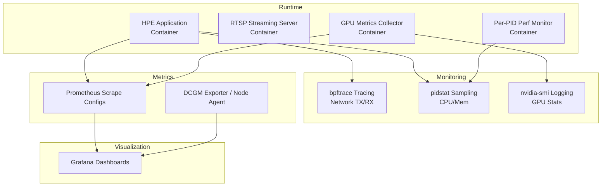
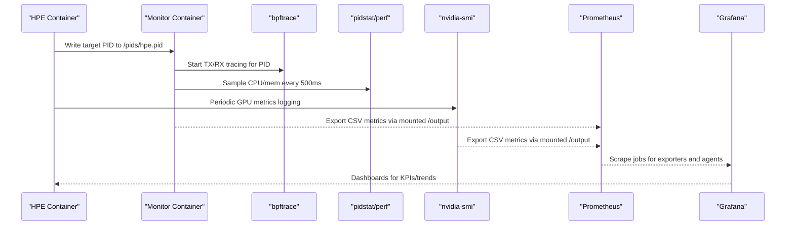
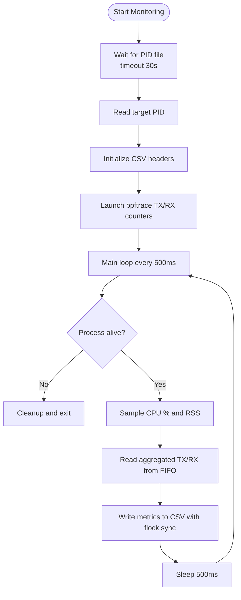
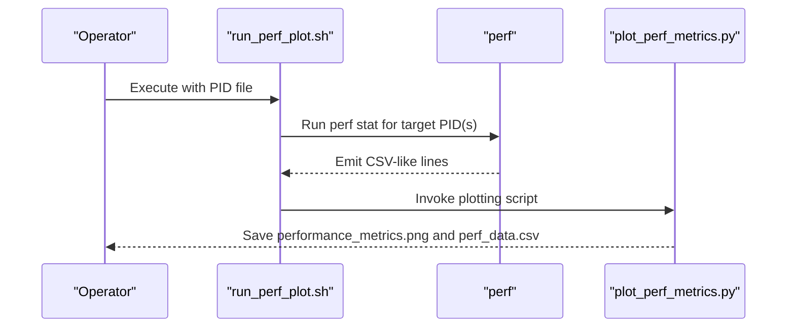
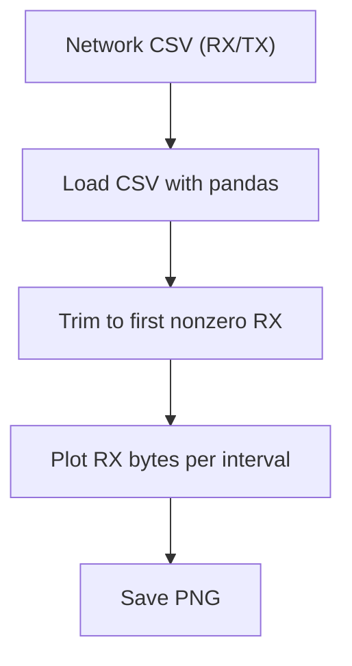
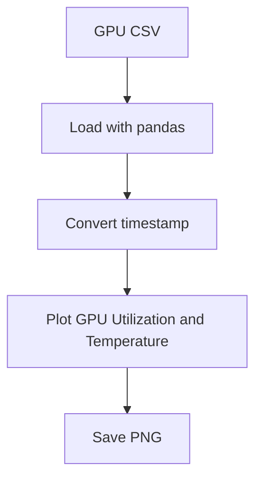
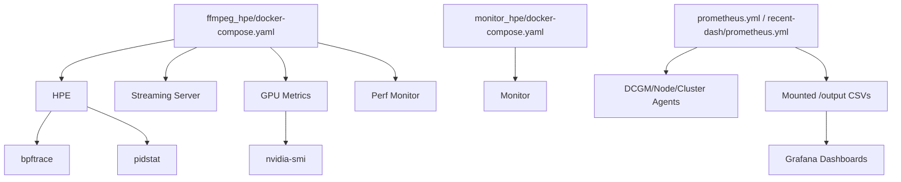

# Performance Monitoring

<cite>
**Referenced Files in This Document**
- [prometheus.yml](file://prometheus.yml)
- [recent-dash/prometheus.yml](file://recent-dash/prometheus.yml)
- [monitor_hpe/docker-compose.yaml](file://monitor_hpe/docker-compose.yaml)
- [ffmpeg_hpe/docker-compose.yaml](file://ffmpeg_hpe/docker-compose.yaml)
- [monitor_hpe/monitor_pid.sh](file://monitor_hpe/monitor_pid.sh)
- [ffmpeg_hpe/monitor_pid.sh](file://ffmpeg_hpe/monitor_pid.sh)
- [ffmpeg_hpe/run_nvidia_dcgm.sh](file://ffmpeg_hpe/run_nvidia_dcgm.sh)
- [Measure_gpu_dcgm/run_nvidia_dcgm.sh](file://Measure_gpu_dcgm/run_nvidia_dcgm.sh)
- [Measure_plot_cpu_perf/run_perf_plot.sh](file://Measure_plot_cpu_perf/run_perf_plot.sh)
- [Measure_plot_cpu_perf/plot_perf_metrics.py](file://Measure_plot_cpu_perf/plot_perf_metrics.py)
- [ffmpeg_hpe/plot_smi_output.py](file://ffmpeg_hpe/plot_smi_output.py)
- [ffmpeg_hpe/plot_rx_bytes.py](file://ffmpeg_hpe/plot_rx_bytes.py)
- [recent-dash/perf_monitor/monitor_pid_perf.sh](file://recent-dash/perf_monitor/monitor_pid_perf.sh)
</cite>

## Table of Contents
1. [Introduction](#introduction)
2. [Project Structure](#project-structure)
3. [Core Components](#core-components)
4. [Architecture Overview](#architecture-overview)
5. [Detailed Component Analysis](#detailed-component-analysis)
6. [Dependency Analysis](#dependency-analysis)
7. [Performance Considerations](#performance-considerations)
8. [Troubleshooting Guide](#troubleshooting-guide)
9. [Conclusion](#conclusion)
10. [Appendices](#appendices)

## Introduction
This document describes the performance monitoring capabilities in the HPE framework. It explains how CPU utilization, GPU performance metrics, memory consumption, and network throughput are tracked in real time, how Prometheus scrapes metrics, how Grafana dashboards can visualize KPIs, and how custom monitoring scripts integrate with the system. It also covers setting up dashboards, configuring alerting, interpreting metrics, identifying optimization opportunities, and establishing baseline performance targets. Finally, it provides troubleshooting workflows and best practices for maintaining optimal performance.

## Project Structure
The performance monitoring stack spans several Docker Compose configurations and monitoring scripts:
- Real-time process and network metrics are collected via bpftrace and pid-based sampling.
- GPU metrics are captured using nvidia-smi-based scripts.
- Prometheus is configured to scrape exporters and agents.
- Grafana dashboards consume Prometheus data to visualize KPIs and trends.
- Scripts generate plots for offline analysis and capacity planning.

**Diagram sources**
- [ffmpeg_hpe/docker-compose.yaml:39-140](file://ffmpeg_hpe/docker-compose.yaml#L39-L140)
- [monitor_hpe/docker-compose.yaml:28-50](file://monitor_hpe/docker-compose.yaml#L28-L50)
- [prometheus.yml:1-8](file://prometheus.yml#L1-L8)
- [recent-dash/prometheus.yml:1-23](file://recent-dash/prometheus.yml#L1-L23)

**Section sources**
- [ffmpeg_hpe/docker-compose.yaml:1-201](file://ffmpeg_hpe/docker-compose.yaml#L1-L201)
- [monitor_hpe/docker-compose.yaml:1-52](file://monitor_hpe/docker-compose.yaml#L1-L52)
- [prometheus.yml:1-8](file://prometheus.yml#L1-L8)
- [recent-dash/prometheus.yml:1-23](file://recent-dash/prometheus.yml#L1-L23)

## Core Components
- Per-process CPU/memory/network monitoring:
  - bpftrace-based TX/RX counters for a target PID.
  - pid-based sampling for CPU and memory.
- GPU metrics logging:
  - nvidia-smi-based periodic logging of GPU utilization, memory utilization, temperature, and power.
- Prometheus scraping:
  - Dedicated scrape jobs for DCGM exporter and node/cluster agents.
- Grafana dashboards:
  - Visualize Prometheus metrics for KPIs, trends, and capacity planning.
- Offline plotting:
  - Scripts to generate plots from collected CSV data for analysis and reporting.

Key metrics produced:
- CPU utilization (%), memory RSS (KB), TX/RX bytes, and throughput (Mbit/s).
- GPU utilization (%), memory utilization (%), temperature (°C), power (W), and memory usage (total/free/used).

**Section sources**
- [monitor_hpe/monitor_pid.sh:25-82](file://monitor_hpe/monitor_pid.sh#L25-L82)
- [ffmpeg_hpe/monitor_pid.sh:21-58](file://ffmpeg_hpe/monitor_pid.sh#L21-L58)
- [ffmpeg_hpe/run_nvidia_dcgm.sh:30-75](file://ffmpeg_hpe/run_nvidia_dcgm.sh#L30-L75)
- [Measure_gpu_dcgm/run_nvidia_dcgm.sh:7-16](file://Measure_gpu_dcgm/run_nvidia_dcgm.sh#L7-L16)
- [prometheus.yml:5-8](file://prometheus.yml#L5-L8)
- [recent-dash/prometheus.yml:6-23](file://recent-dash/prometheus.yml#L6-L23)

## Architecture Overview
The monitoring architecture integrates containerized workloads with real-time metrics collection and centralized scraping.

**Diagram sources**
- [ffmpeg_hpe/docker-compose.yaml:39-140](file://ffmpeg_hpe/docker-compose.yaml#L39-L140)
- [monitor_hpe/docker-compose.yaml:28-50](file://monitor_hpe/docker-compose.yaml#L28-L50)
- [prometheus.yml:5-8](file://prometheus.yml#L5-L8)
- [recent-dash/prometheus.yml:6-23](file://recent-dash/prometheus.yml#L6-L23)

## Detailed Component Analysis

### Real-Time Per-Process Metrics (CPU, Memory, Network)
Two equivalent monitoring scripts collect CPU, memory, and network throughput for a target PID:
- monitor_pid.sh (monitor_hpe): writes CSV with timestamp, PID, CPU %, RSS KB, TX/RX bytes.
- monitor_pid.sh (ffmpeg_hpe): similar, with normalization to total CPU capacity and periodic bpftrace TX/RX aggregation.

**Diagram sources**
- [monitor_hpe/monitor_pid.sh:103-200](file://monitor_hpe/monitor_pid.sh#L103-L200)
- [ffmpeg_hpe/monitor_pid.sh:72-148](file://ffmpeg_hpe/monitor_pid.sh#L72-L148)

**Section sources**
- [monitor_hpe/monitor_pid.sh:1-204](file://monitor_hpe/monitor_pid.sh#L1-L204)
- [ffmpeg_hpe/monitor_pid.sh:1-151](file://ffmpeg_hpe/monitor_pid.sh#L1-L151)

### GPU Metrics Collection
GPU metrics are collected periodically using nvidia-smi and written to CSV:
- ffmpeg_hpe/run_nvidia_dcgm.sh: configurable interval and duration, writes header, loops with nvidia-smi queries, and supports termination via signal.
- Measure_gpu_dcgm/run_nvidia_dcgm.sh: simplified loop writing timestamped GPU stats.

**Diagram sources**
- [ffmpeg_hpe/run_nvidia_dcgm.sh:46-80](file://ffmpeg_hpe/run_nvidia_dcgm.sh#L46-L80)
- [Measure_gpu_dcgm/run_nvidia_dcgm.sh:10-27](file://Measure_gpu_dcgm/run_nvidia_dcgm.sh#L10-L27)

**Section sources**
- [ffmpeg_hpe/run_nvidia_dcgm.sh:1-84](file://ffmpeg_hpe/run_nvidia_dcgm.sh#L1-L84)
- [Measure_gpu_dcgm/run_nvidia_dcgm.sh:1-29](file://Measure_gpu_dcgm/run_nvidia_dcgm.sh#L1-L29)

### Prometheus Scraping and Grafana Dashboards
Prometheus is configured to scrape:
- DCGM exporter for GPU metrics.
- Node/cluster agents for host/container metrics.

**Diagram sources**
- [prometheus.yml:5-8](file://prometheus.yml#L5-L8)
- [recent-dash/prometheus.yml:6-23](file://recent-dash/prometheus.yml#L6-L23)

**Section sources**
- [prometheus.yml:1-8](file://prometheus.yml#L1-L8)
- [recent-dash/prometheus.yml:1-23](file://recent-dash/prometheus.yml#L1-L23)

### CPU Performance Profiling (Optional)
A separate CPU profiling workflow uses perf to capture cpu-clock and cycles at intervals and generates plots.

**Diagram sources**
- [Measure_plot_cpu_perf/run_perf_plot.sh:11-25](file://Measure_plot_cpu_perf/run_perf_plot.sh#L11-L25)
- [Measure_plot_cpu_perf/plot_perf_metrics.py:16-145](file://Measure_plot_cpu_perf/plot_perf_metrics.py#L16-L145)

**Section sources**
- [Measure_plot_cpu_perf/run_perf_plot.sh:1-25](file://Measure_plot_cpu_perf/run_perf_plot.sh#L1-L25)
- [Measure_plot_cpu_perf/plot_perf_metrics.py:1-146](file://Measure_plot_cpu_perf/plot_perf_metrics.py#L1-L146)

### Network Throughput Visualization
Network RX/TX traces can be plotted from CSV outputs for trend analysis and capacity planning.

**Diagram sources**
- [ffmpeg_hpe/plot_rx_bytes.py:10-23](file://ffmpeg_hpe/plot_rx_bytes.py#L10-L23)

**Section sources**
- [ffmpeg_hpe/plot_rx_bytes.py:1-24](file://ffmpeg_hpe/plot_rx_bytes.py#L1-L24)

### GPU Metric Visualization
GPU metrics CSV can be plotted to visualize utilization and temperature over time.

**Diagram sources**
- [ffmpeg_hpe/plot_smi_output.py:6-20](file://ffmpeg_hpe/plot_smi_output.py#L6-L20)

**Section sources**
- [ffmpeg_hpe/plot_smi_output.py:1-21](file://ffmpeg_hpe/plot_smi_output.py#L1-L21)

## Dependency Analysis
- Container orchestration:
  - ffmpeg_hpe/docker-compose.yaml defines HPE, streaming server, GPU metrics collector, perf monitor, and optional BCC tracer.
  - monitor_hpe/docker-compose.yaml defines a minimal monitoring setup for standalone experiments.
- Metrics producers:
  - bpftrace and pidstat/pidstat-based scripts produce CSV metrics consumed by Prometheus.
  - nvidia-smi scripts produce CSV metrics consumed by Prometheus.
- Scraping and visualization:
  - Prometheus scrape configs define targets for DCGM exporter and node/cluster agents.
  - Grafana dashboards consume Prometheus data.

**Diagram sources**
- [ffmpeg_hpe/docker-compose.yaml:1-201](file://ffmpeg_hpe/docker-compose.yaml#L1-L201)
- [monitor_hpe/docker-compose.yaml:1-52](file://monitor_hpe/docker-compose.yaml#L1-L52)
- [prometheus.yml:1-8](file://prometheus.yml#L1-L8)
- [recent-dash/prometheus.yml:1-23](file://recent-dash/prometheus.yml#L1-L23)

**Section sources**
- [ffmpeg_hpe/docker-compose.yaml:1-201](file://ffmpeg_hpe/docker-compose.yaml#L1-L201)
- [monitor_hpe/docker-compose.yaml:1-52](file://monitor_hpe/docker-compose.yaml#L1-L52)
- [prometheus.yml:1-8](file://prometheus.yml#L1-L8)
- [recent-dash/prometheus.yml:1-23](file://recent-dash/prometheus.yml#L1-L23)

## Performance Considerations
- Sampling cadence:
  - bpftrace TX/RX aggregation runs at 500ms intervals; adjust based on overhead vs. resolution needs.
  - nvidia-smi logging interval defaults to 0.5s; tune for accuracy and storage cost.
- Resource isolation:
  - Containers specify CPU/memory limits/reservations to avoid noisy-neighbor effects.
  - Monitoring containers are constrained to reduce measurement interference.
- I/O and locking:
  - CSV writes use flock and sync to ensure atomicity and durability.
- Network throughput:
  - TX/RX rates are computed per interval; ensure intervals align with Prometheus scrape frequency.

[No sources needed since this section provides general guidance]

## Troubleshooting Guide
Common issues and resolutions:
- Missing PID file:
  - Ensure the HPE container writes the PID file to the shared /pids volume before monitoring starts.
- bpftrace permission errors:
  - The monitor container requires SYS_ADMIN, NET_ADMIN, NET_RAW, IPC_LOCK, and privileged mode.
- nvidia-smi not found:
  - Confirm NVIDIA drivers and runtime are available in the GPU metrics container.
- Prometheus scrape failures:
  - Verify exporter endpoints are reachable and scrape intervals match exporter cadence.
- CSV not generated:
  - Check that the output directory is writable and mounted into the monitoring containers.

Operational checks:
- Validate container health and logs after startup.
- Confirm CSV files appear under /output and are timestamped.
- Use offline plotting scripts to verify metric integrity.

**Section sources**
- [monitor_hpe/docker-compose.yaml:32-44](file://monitor_hpe/docker-compose.yaml#L32-L44)
- [ffmpeg_hpe/docker-compose.yaml:94-115](file://ffmpeg_hpe/docker-compose.yaml#L94-L115)
- [prometheus.yml:5-8](file://prometheus.yml#L5-L8)
- [recent-dash/prometheus.yml:6-23](file://recent-dash/prometheus.yml#L6-L23)

## Conclusion
The HPE framework’s performance monitoring stack combines per-process metrics (CPU, memory, network), GPU telemetry, and Prometheus-based ingestion to enable Grafana-driven KPIs, trend analysis, and capacity planning. By tuning sampling intervals, isolating resources, and validating exporters, teams can maintain visibility into system performance and quickly identify bottlenecks and degradation.

[No sources needed since this section summarizes without analyzing specific files]

## Appendices

### Setup Checklist
- Configure Prometheus scrape jobs for DCGM exporter and node/cluster agents.
- Deploy monitoring containers with appropriate capabilities and mounts.
- Run experiments and verify CSV outputs and Grafana dashboards.
- Establish baselines and configure alerts for CPU, memory, GPU, and network thresholds.

**Section sources**
- [prometheus.yml:1-8](file://prometheus.yml#L1-L8)
- [recent-dash/prometheus.yml:1-23](file://recent-dash/prometheus.yml#L1-L23)
- [monitor_hpe/docker-compose.yaml:28-50](file://monitor_hpe/docker-compose.yaml#L28-L50)
- [ffmpeg_hpe/docker-compose.yaml:116-140](file://ffmpeg_hpe/docker-compose.yaml#L116-L140)