# Performance Monitoring

<cite>
**Referenced Files in This Document**
- [prometheus.yml](file://prometheus.yml)
- [recent-dash/prometheus.yml](file://recent-dash/prometheus.yml)
- [monitor_hpe/docker-compose.yaml](file://monitor_hpe/docker-compose.yaml)
- [ffmpeg_hpe/docker-compose.yaml](file://ffmpeg_hpe/docker-compose.yaml)
- [monitor_hpe/monitor_pid.sh](file://monitor_hpe/monitor_pid.sh)
- [ffmpeg_hpe/monitor_pid.sh](file://ffmpeg_hpe/monitor_pid.sh)
- [ffmpeg_hpe/bpftrace-tracer/entrypoint.sh](file://ffmpeg_hpe/bpftrace-tracer/entrypoint.sh)
- [ffmpeg_hpe/bpftrace-tracer/trace_video_traffic.sh](file://ffmpeg_hpe/bpftrace-tracer/trace_video_traffic.sh)
- [ffmpeg_hpe/bpftrace-tracer/bcc_rx_bytes.py](file://ffmpeg_hpe/bpftrace-tracer/bcc_rx_bytes.py)
- [ffmpeg_hpe/run_nvidia_dcgm.sh](file://ffmpeg_hpe/run_nvidia_dcgm.sh)
- [Measure_gpu_dcgm/run_nvidia_dcgm.sh](file://Measure_gpu_dcgm/run_nvidia_dcgm.sh)
- [Measure_plot_cpu_perf/run_perf_plot.sh](file://Measure_plot_cpu_perf/run_perf_plot.sh)
- [Measure_plot_cpu_perf/plot_perf_metrics.py](file://Measure_plot_cpu_perf/plot_perf_metrics.py)
- [ffmpeg_hpe/plot_smi_output.py](file://ffmpeg_hpe/plot_smi_output.py)
- [ffmpeg_hpe/plot_rx_bytes.py](file://ffmpeg_hpe/plot_rx_bytes.py)
- [shared/perf_monitor/monitor_pid_perf.sh](file://shared/perf_monitor/monitor_pid_perf.sh)
- [shared/perf_monitor/Dockerfile](file://shared/perf_monitor/Dockerfile)
- [monitor_hpe/Dockerfile.perf](file://monitor_hpe/Dockerfile.perf)
- [ffmpeg_hpe/run_experiment.sh](file://ffmpeg_hpe/run_experiment.sh)
- [ffmpeg_hpe/run_experiment_bcc.sh](file://ffmpeg_hpe/run_experiment_bcc.sh)
- [ffmpeg_hpe/validate_run.py](file://ffmpeg_hpe/validate_run.py)
- [ffmpeg_hpe_backup_20260618/ffmpeg_hpe/validate_run.py](file://ffmpeg_hpe_backup_20260618/ffmpeg_hpe/validate_run.py)
- [ffmpeg_hpe_cpu/validate_run.py](file://ffmpeg_hpe_cpu/validate_run.py)
- [AGENTS.md](file://AGENTS.md)
- [docs/bcc-bpf-tracing.md](file://docs/bcc-bpf-tracing.md)
</cite>

## Update Summary
**Changes Made**
- Enhanced validation pipeline documentation with improved BCC port detection regex supporting both legacy and newer log formats
- Updated healthcheck configurations and resource management documentation for more reliable service monitoring
- Added comprehensive coverage of validation workflow improvements and port detection format compatibility

## Table of Contents
1. [Introduction](#introduction)
2. [Project Structure](#project-structure)
3. [Core Components](#core-components)
4. [Architecture Overview](#architecture-overview)
5. [Detailed Component Analysis](#detailed-component-analysis)
6. [Dependency Analysis](#dependency-analysis)
7. [Performance Considerations](#performance-considerations)
8. [Troubleshooting Guide](#troubleshooting-guide)
9. [Comprehensive Experiment Validation](#comprehensive-experiment-validation)
10. [Conclusion](#conclusion)
11. [Appendices](#appendices)

## Introduction
This document describes the performance monitoring capabilities in the HPE framework. It explains how CPU utilization, GPU performance metrics, memory consumption, and network throughput are tracked in real time, how Prometheus scrapes metrics, how Grafana dashboards can visualize KPIs, and how custom monitoring scripts integrate with the system. The framework now features an enhanced host-PID monitoring system with improved bpftrace-based process tracking, comprehensive experiment validation capabilities with enhanced port detection compatibility, accurate HPE process measurement using docker inspect for host PID detection, and refined error handling for PID detection failures. It also covers setting up dashboards, configuring alerting, interpreting metrics, identifying optimization opportunities, and establishing baseline performance targets. Finally, it provides troubleshooting workflows and best practices for maintaining optimal performance.

## Project Structure
The performance monitoring stack spans several Docker Compose configurations and monitoring scripts, now featuring enhanced host-PID monitoring capabilities and comprehensive experiment validation:
- Real-time process metrics are collected via enhanced bpftrace-based monitoring with improved PID detection using host PID namespace and SYS_ADMIN privileges.
- Host PID monitoring operates in host PID namespace with SYS_ADMIN privileges for accurate process tracking.
- Network traffic is monitored using both bpftrace tracepoints and BCC-based packet filtering for precise HPE process measurement.
- Comprehensive experiment validation provides automated quality assurance with automated checks for exit codes, frame processing, JSON output, and metric consistency, now supporting both legacy and modern port detection log formats.
- Prometheus is configured to scrape exporters and agents.
- Grafana dashboards consume Prometheus data to visualize KPIs and trends.
- Scripts generate plots for offline analysis and capacity planning.

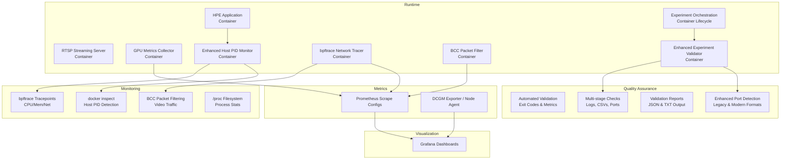

**Diagram sources**
- [ffmpeg_hpe/docker-compose.yaml:120-145](file://ffmpeg_hpe/docker-compose.yaml#L120-L145)
- [ffmpeg_hpe/bpftrace-tracer/entrypoint.sh:1-48](file://ffmpeg_hpe/bpftrace-tracer/entrypoint.sh#L1-L48)
- [ffmpeg_hpe/bpftrace-tracer/bcc_rx_bytes.py:1-120](file://ffmpeg_hpe/bpftrace-tracer/bcc_rx_bytes.py#L1-L120)
- [monitor_hpe/docker-compose.yaml:28-50](file://monitor_hpe/docker-compose.yaml#L28-L50)
- [ffmpeg_hpe/run_experiment.sh:123-156](file://ffmpeg_hpe/run_experiment.sh#L123-L156)
- [ffmpeg_hpe/validate_run.py:467-521](file://ffmpeg_hpe/validate_run.py#L467-521)

**Section sources**
- [ffmpeg_hpe/docker-compose.yaml:1-206](file://ffmpeg_hpe/docker-compose.yaml#L1-L206)
- [monitor_hpe/docker-compose.yaml:1-52](file://monitor_hpe/docker-compose.yaml#L1-L52)
- [prometheus.yml:1-8](file://prometheus.yml#L1-L8)
- [recent-dash/prometheus.yml:1-23](file://recent-dash/prometheus.yml#L1-L23)
- [ffmpeg_hpe/run_experiment.sh:1-279](file://ffmpeg_hpe/run_experiment.sh#L1-L279)
- [ffmpeg_hpe/validate_run.py:1-521](file://ffmpeg_hpe/validate_run.py#L1-L521)

## Core Components
- Enhanced host-PID monitoring system:
  - Operates in host PID namespace with SYS_ADMIN privileges for accurate process tracking.
  - Uses docker inspect for reliable HPE process identification and host PID detection.
  - Implements robust error handling for PID detection failures with timeout mechanisms.
  - Supports dual monitoring cadence: 10ms for high-frequency tracking and 500ms for reduced overhead.
- Improved bpftrace-based network monitoring:
  - Enhanced bpftrace tracepoints with refined PID filtering to avoid softirq-context issues.
  - Optimized monitoring cadence with configurable intervals (10ms vs 500ms) based on use case.
  - Accurate TX/RX byte counting with proper rate calculation and FIFO-based communication.
- BCC-based packet filtering:
  - Python-based BCC program for precise video traffic filtering using streamer IP/port detection.
  - Dynamic port detection through connection analysis and tcpdump-based port discovery.
  - Reliable packet counting with error handling and logging mechanisms.
- Comprehensive experiment validation:
  - Automated quality assurance with multi-stage validation checks.
  - Validates HPE container exit codes, processed frame counts, and JSON output consistency.
  - Cross-validates BCC RX metrics against FFmpeg bytes-read for accuracy verification.
  - Enhanced port detection regex now supports both legacy "Monitoring HPE traffic on port X" and newer "BCC detected HPE video port: X" formats.
  - Generates structured validation reports in JSON and TXT formats.
- GPU metrics logging:
  - nvidia-smi-based periodic logging of GPU utilization, memory utilization, temperature, and power.
- Prometheus scraping:
  - Dedicated scrape jobs for DCGM exporter and node/cluster agents.
- Grafana dashboards:
  - Visualize Prometheus metrics for KPIs, trends, and capacity planning.
- Offline plotting:
  - Scripts to generate plots from collected CSV data for analysis and reporting.

Key metrics produced:
- CPU utilization (%), memory RSS (KB), and active PID count from the centralized monitoring.
- GPU utilization (%), memory utilization (%), temperature (°C), power (W), and memory usage (total/free/used).
- Network TX/RX rates (Mbit/s) and byte counts from bpftrace and BCC monitoring.
- Video-specific traffic metrics from BCC packet filtering.
- Experiment validation metrics including processed frames, exit codes, and performance thresholds.

**Updated** Enhanced with comprehensive experiment validation capabilities and refined host-PID monitoring system improvements, including enhanced port detection format compatibility.

**Section sources**
- [monitor_hpe/monitor_pid.sh:1-216](file://monitor_hpe/monitor_pid.sh#L1-L216)
- [ffmpeg_hpe/monitor_pid.sh:1-169](file://ffmpeg_hpe/monitor_pid.sh#L1-L169)
- [ffmpeg_hpe/bpftrace-tracer/entrypoint.sh:1-48](file://ffmpeg_hpe/bpftrace-tracer/entrypoint.sh#L1-L48)
- [ffmpeg_hpe/bpftrace-tracer/bcc_rx_bytes.py:1-120](file://ffmpeg_hpe/bpftrace-tracer/bcc_rx_bytes.py#L1-L120)
- [ffmpeg_hpe/run_nvidia_dcgm.sh:30-75](file://ffmpeg_hpe/run_nvidia_dcgm.sh#L30-L75)
- [ffmpeg_hpe/run_experiment.sh:123-156](file://ffmpeg_hpe/run_experiment.sh#L123-L156)
- [ffmpeg_hpe/validate_run.py:467-521](file://ffmpeg_hpe/validate_run.py#L467-521)

## Architecture Overview
The enhanced monitoring architecture integrates containerized workloads with host-level PID monitoring, sophisticated network traffic analysis, and comprehensive experiment validation with improved port detection compatibility.

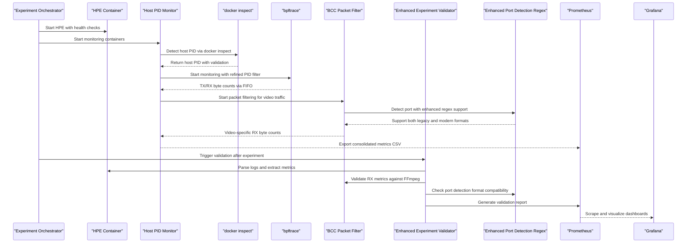

**Diagram sources**
- [ffmpeg_hpe/run_experiment.sh:123-156](file://ffmpeg_hpe/run_experiment.sh#L123-L156)
- [monitor_hpe/monitor_pid.sh:100-120](file://monitor_hpe/monitor_pid.sh#L100-L120)
- [ffmpeg_hpe/bpftrace-tracer/entrypoint.sh:30-47](file://ffmpeg_hpe/bpftrace-tracer/entrypoint.sh#L30-L47)
- [ffmpeg_hpe/bpftrace-tracer/bcc_rx_bytes.py:70-110](file://ffmpeg_hpe/bpftrace-tracer/bcc_rx_bytes.py#L70-L110)
- [ffmpeg_hpe/validate_run.py:467-521](file://ffmpeg_hpe/validate_run.py#L467-521)

## Detailed Component Analysis

### Enhanced Host-PID Monitoring System
The enhanced host-PID monitoring system provides accurate process tracking through docker inspect integration and improved error handling with dual monitoring cadence options.

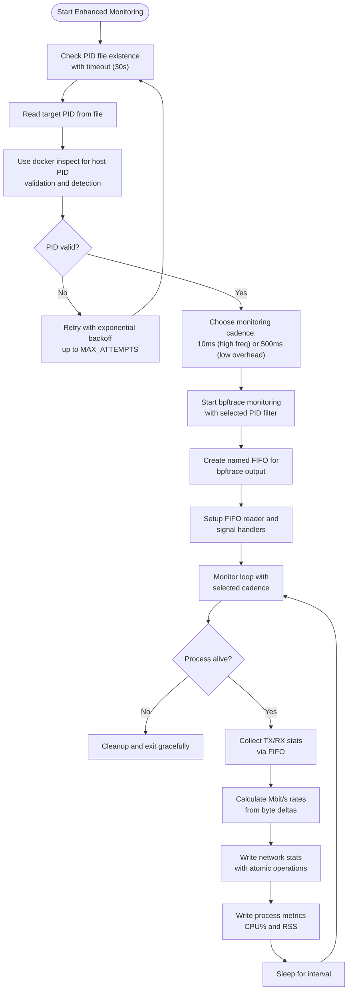

**Diagram sources**
- [monitor_hpe/monitor_pid.sh:100-120](file://monitor_hpe/monitor_pid.sh#L100-L120)
- [monitor_hpe/monitor_pid.sh:129-151](file://monitor_hpe/monitor_pid.sh#L129-L151)
- [ffmpeg_hpe/monitor_pid.sh:97-127](file://ffmpeg_hpe/monitor_pid.sh#L97-L127)
- [ffmpeg_hpe/monitor_pid.sh:153-166](file://ffmpeg_hpe/monitor_pid.sh#L153-L166)

**Section sources**
- [monitor_hpe/monitor_pid.sh:1-216](file://monitor_hpe/monitor_pid.sh#L1-L216)
- [ffmpeg_hpe/monitor_pid.sh:1-169](file://ffmpeg_hpe/monitor_pid.sh#L1-L169)

### Improved bpftrace-Based Network Monitoring
Enhanced bpftrace monitoring with refined PID filtering and optimized cadence control supporting both 10ms and 500ms monitoring intervals.

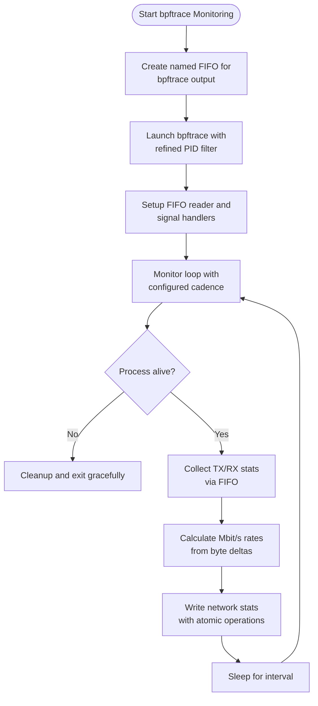

**Diagram sources**
- [ffmpeg_hpe/monitor_pid.sh:97-127](file://ffmpeg_hpe/monitor_pid.sh#L97-L127)
- [ffmpeg_hpe/monitor_pid.sh:153-166](file://ffmpeg_hpe/monitor_pid.sh#L153-L166)
- [monitor_hpe/monitor_pid.sh:129-151](file://monitor_hpe/monitor_pid.sh#L129-L151)

**Section sources**
- [ffmpeg_hpe/monitor_pid.sh:1-169](file://ffmpeg_hpe/monitor_pid.sh#L1-L169)
- [monitor_hpe/monitor_pid.sh:1-216](file://monitor_hpe/monitor_pid.sh#L1-L216)

### BCC-Based Packet Filtering for Video Traffic
Python-based BCC program for precise video traffic filtering and dynamic port detection with comprehensive error handling.

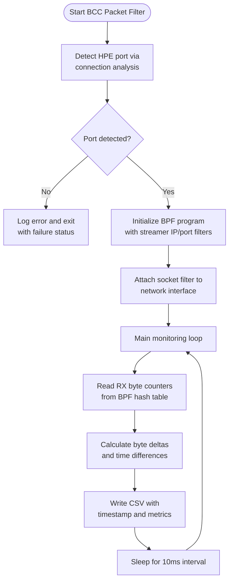

**Diagram sources**
- [ffmpeg_hpe/bpftrace-tracer/entrypoint.sh:30-47](file://ffmpeg_hpe/bpftrace-tracer/entrypoint.sh#L30-L47)
- [ffmpeg_hpe/bpftrace-tracer/bcc_rx_bytes.py:70-110](file://ffmpeg_hpe/bpftrace-tracer/bcc_rx_bytes.py#L70-L110)

**Section sources**
- [ffmpeg_hpe/bpftrace-tracer/entrypoint.sh:1-48](file://ffmpeg_hpe/bpftrace-tracer/entrypoint.sh#L1-L48)
- [ffmpeg_hpe/bpftrace-tracer/bcc_rx_bytes.py:1-120](file://ffmpeg_hpe/bpftrace-tracer/bcc_rx_bytes.py#L1-L120)

### Dynamic Port Detection and TCPDump Integration
Enhanced port detection mechanism using tcpdump analysis and connection state monitoring with comprehensive logging.

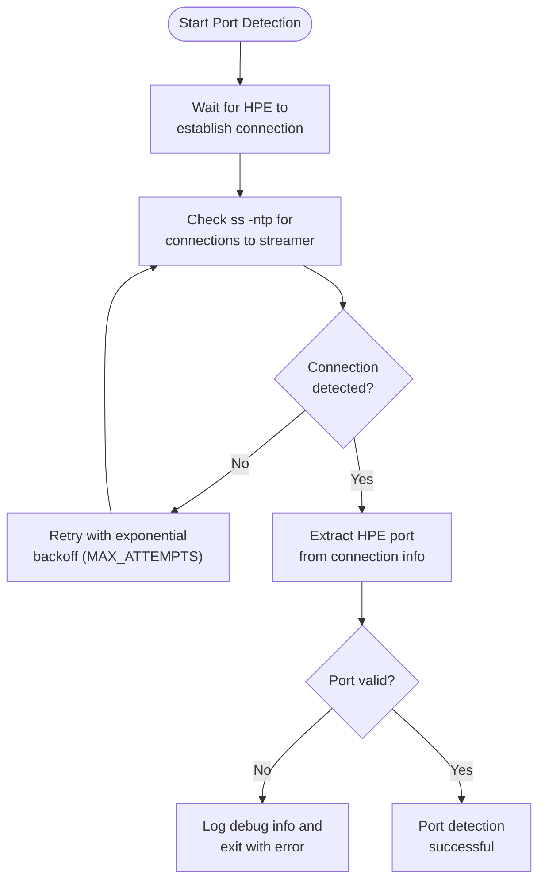

**Diagram sources**
- [ffmpeg_hpe/bpftrace-tracer/entrypoint.sh:29-47](file://ffmpeg_hpe/bpftrace-tracer/entrypoint.sh#L29-L47)

**Section sources**
- [ffmpeg_hpe/bpftrace-tracer/entrypoint.sh:1-48](file://ffmpeg_hpe/bpftrace-tracer/entrypoint.sh#L1-L48)

### Real-Time Per-Process Metrics (CPU, Memory)
Enhanced per-process metrics collection with improved accuracy and reliability supporting multiple PID tracking.

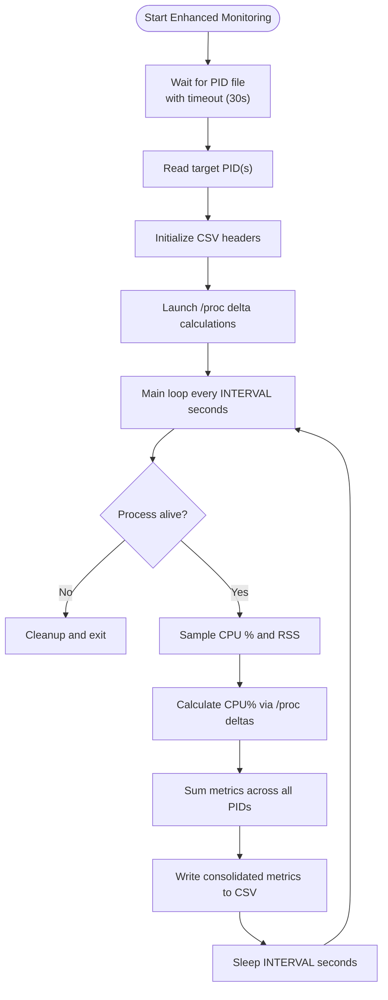

**Diagram sources**
- [shared/perf_monitor/monitor_pid_perf.sh:27-106](file://shared/perf_monitor/monitor_pid_perf.sh#L27-L106)

**Section sources**
- [shared/perf_monitor/monitor_pid_perf.sh:1-107](file://shared/perf_monitor/monitor_pid_perf.sh#L1-L107)

### GPU Metrics Collection
GPU metrics are collected periodically using nvidia-smi and written to CSV with comprehensive error handling:
- ffmpeg_hpe/run_nvidia_dcgm.sh: configurable interval and duration, writes header, loops with nvidia-smi queries, and supports termination via signal.
- Measure_gpu_dcgm/run_nvidia_dcgm.sh: simplified loop writing timestamped GPU stats.

**Diagram sources**
- [ffmpeg_hpe/run_nvidia_dcgm.sh:46-80](file://ffmpeg_hpe/run_nvidia_dcgm.sh#L46-L80)
- [Measure_gpu_dcgm/run_nvidia_dcgm.sh:10-27](file://Measure_gpu_dcgm/run_nvidia_dcgm.sh#L10-L27)

**Section sources**
- [ffmpeg_hpe/run_nvidia_dcgm.sh:1-86](file://ffmpeg_hpe/run_nvidia_dcgm.sh#L1-L86)
- [Measure_gpu_dcgm/run_nvidia_dcgm.sh:1-29](file://Measure_gpu_dcgm/run_nvidia_dcgm.sh#L1-L29)

### Prometheus Scraping and Grafana Dashboards
Prometheus is configured to scrape:
- DCGM exporter for GPU metrics.
- Node/cluster agents for host/container metrics.

**Diagram sources**
- [prometheus.yml:5-8](file://prometheus.yml#L5-L8)
- [recent-dash/prometheus.yml:6-23](file://recent-dash/prometheus.yml#L6-L23)

**Section sources**
- [prometheus.yml:1-8](file://prometheus.yml#L1-L8)
- [recent-dash/prometheus.yml:1-23](file://recent-dash/prometheus.yml#L1-L23)

### CPU Performance Profiling (Optional)
A separate CPU profiling workflow uses perf to capture cpu-clock and cycles at intervals and generates plots.

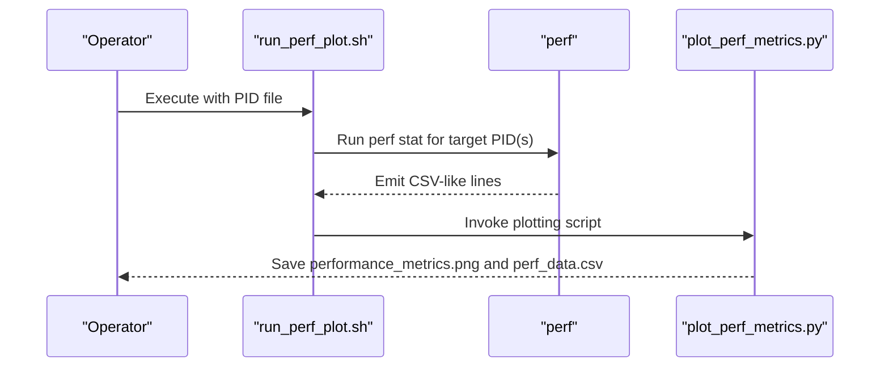

**Diagram sources**
- [Measure_plot_cpu_perf/run_perf_plot.sh:11-25](file://Measure_plot_cpu_perf/run_perf_plot.sh#L11-L25)
- [Measure_plot_cpu_perf/plot_perf_metrics.py:16-145](file://Measure_plot_cpu_perf/plot_perf_metrics.py#L16-L145)

**Section sources**
- [Measure_plot_cpu_perf/run_perf_plot.sh:1-25](file://Measure_plot_cpu_perf/run_perf_plot.sh#L1-L25)
- [Measure_plot_cpu_perf/plot_perf_metrics.py:1-146](file://Measure_plot_cpu_perf/plot_perf_metrics.py#L1-L146)

### Network Throughput Visualization
Network RX/TX traces can be plotted from CSV outputs for trend analysis and capacity planning.

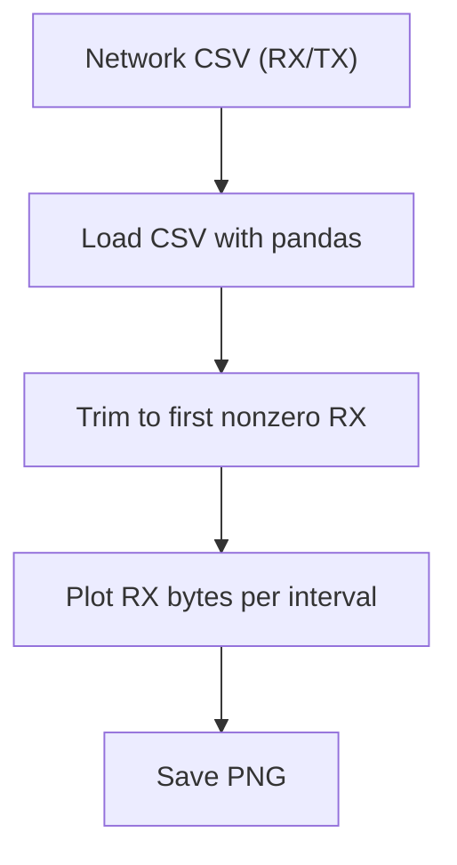

**Diagram sources**
- [ffmpeg_hpe/plot_rx_bytes.py:10-23](file://ffmpeg_hpe/plot_rx_bytes.py#L10-L23)

**Section sources**
- [ffmpeg_hpe/plot_rx_bytes.py:1-24](file://ffmpeg_hpe/plot_rx_bytes.py#L1-L24)

### GPU Metric Visualization
GPU metrics CSV can be plotted to visualize utilization and temperature over time.

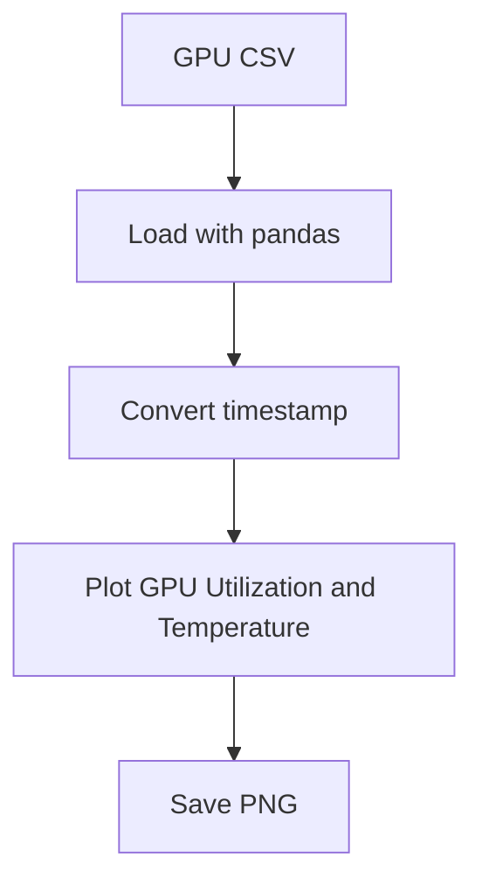

**Diagram sources**
- [ffmpeg_hpe/plot_smi_output.py:6-20](file://ffmpeg_hpe/plot_smi_output.py#L6-L20)

**Section sources**
- [ffmpeg_hpe/plot_smi_output.py:1-21](file://ffmpeg_hpe/plot_smi_output.py#L1-L21)

### Enhanced Validation Pipeline with Improved Port Detection
The validation pipeline now features enhanced port detection compatibility supporting both legacy and modern log formats for improved reliability.

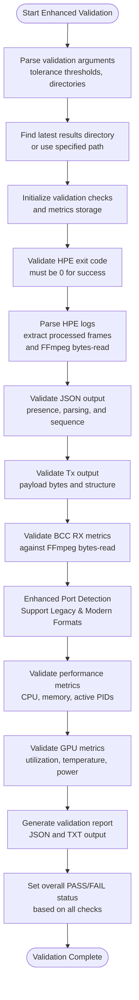

**Diagram sources**
- [ffmpeg_hpe/validate_run.py:467-521](file://ffmpeg_hpe/validate_run.py#L467-521)
- [ffmpeg_hpe/validate_run.py:22-27](file://ffmpeg_hpe/validate_run.py#L22-27)
- [ffmpeg_hpe/validate_run.py:73-90](file://ffmpeg_hpe/validate_run.py#L73-90)
- [ffmpeg_hpe/validate_run.py:282-395](file://ffmpeg_hpe/validate_run.py#L282-395)

**Section sources**
- [ffmpeg_hpe/validate_run.py:1-521](file://ffmpeg_hpe/validate_run.py#L1-L521)

## Dependency Analysis
- Container orchestration:
  - ffmpeg_hpe/docker-compose.yaml defines HPE, streaming server, GPU metrics collector, enhanced host PID monitor, and BCC tracer using host PID namespace and SYS_ADMIN privileges.
  - monitor_hpe/docker-compose.yaml defines a minimal monitoring setup for standalone experiments with host PID access.
- Enhanced monitoring infrastructure:
  - monitor_hpe/monitor_pid.sh provides improved PID detection using docker inspect and refined bpftrace monitoring with dual cadence options.
  - ffmpeg_hpe/monitor_pid.sh offers alternative monitoring approach with different bpftrace cadence options (10ms vs 500ms).
  - ffmpeg_hpe/bpftrace-tracer provides BCC-based packet filtering with dynamic port detection.
- Comprehensive experiment validation:
  - ffmpeg_hpe/run_experiment.sh orchestrates complete experiment lifecycle with container management and data collection.
  - ffmpeg_hpe/validate_run.py provides automated quality assurance with multi-stage validation checks and enhanced port detection regex supporting both legacy and modern formats.
  - ffmpeg_hpe/run_experiment_bcc.sh includes enhanced healthcheck configurations and resource management for more reliable service monitoring.
- Metrics producers:
  - Enhanced /proc-based scripts produce CSV metrics consumed by Prometheus.
  - bpftrace and BCC programs produce network statistics with atomic file operations.
  - nvidia-smi scripts produce CSV metrics consumed by Prometheus.
- Scraping and visualization:
  - Prometheus scrape configs define targets for DCGM exporter and node/cluster agents.
  - Grafana dashboards consume Prometheus data.

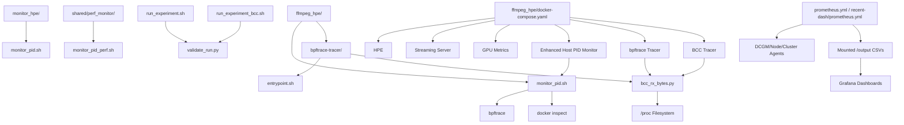

**Diagram sources**
- [ffmpeg_hpe/docker-compose.yaml:120-145](file://ffmpeg_hpe/docker-compose.yaml#L120-L145)
- [monitor_hpe/docker-compose.yaml:28-50](file://monitor_hpe/docker-compose.yaml#L28-L50)
- [ffmpeg_hpe/bpftrace-tracer/entrypoint.sh:1-48](file://ffmpeg_hpe/bpftrace-tracer/entrypoint.sh#L1-L48)
- [ffmpeg_hpe/run_experiment.sh:123-156](file://ffmpeg_hpe/run_experiment.sh#L123-L156)
- [ffmpeg_hpe/validate_run.py:467-521](file://ffmpeg_hpe/validate_run.py#L467-521)

**Section sources**
- [ffmpeg_hpe/docker-compose.yaml:1-206](file://ffmpeg_hpe/docker-compose.yaml#L1-L206)
- [monitor_hpe/docker-compose.yaml:1-52](file://monitor_hpe/docker-compose.yaml#L1-L52)
- [prometheus.yml:1-8](file://prometheus.yml#L1-L8)
- [recent-dash/prometheus.yml:1-23](file://recent-dash/prometheus.yml#L1-L23)
- [ffmpeg_hpe/run_experiment.sh:1-279](file://ffmpeg_hpe/run_experiment.sh#L1-L279)
- [ffmpeg_hpe/validate_run.py:1-521](file://ffmpeg_hpe/validate_run.py#L1-L521)

## Performance Considerations
- Enhanced host-PID monitoring:
  - Host PID namespace operation with SYS_ADMIN privileges ensures accurate process tracking across container boundaries.
  - docker inspect integration provides reliable PID validation and prevents false positives from similar process names.
  - Refined error handling with exponential backoff reduces monitoring overhead during PID detection failures.
  - Dual monitoring cadence options (10ms vs 500ms) allow tuning for different use cases and performance requirements.
- bpftrace optimization:
  - Configurable monitoring cadence (10ms vs 500ms) allows tuning for different use cases and performance requirements.
  - FIFO-based communication eliminates blocking operations and improves monitoring efficiency.
  - Refined PID filtering in tracepoints avoids softirq-context issues and reduces false positives.
- BCC packet filtering:
  - Dynamic port detection through connection analysis ensures accurate video traffic filtering even with changing port assignments.
  - Python-based BCC implementation provides better error handling and logging compared to pure C implementations.
  - Atomic file operations with flock ensure data integrity in high-frequency monitoring scenarios.
- Comprehensive experiment validation:
  - Multi-stage validation ensures experiment quality and reliability.
  - Automated checks validate exit codes, processed frames, JSON output, and metric consistency.
  - Cross-validation between BCC RX metrics and FFmpeg bytes-read ensures measurement accuracy.
  - Enhanced port detection regex now supports both legacy "Monitoring HPE traffic on port X" and newer "BCC detected HPE video port: X" formats, eliminating spurious validation failures.
  - Structured validation reports provide detailed insights for performance analysis.
- Resource efficiency:
  - Enhanced monitoring containers operate with reduced CPU and memory limits to minimize measurement interference.
  - Optimized sampling intervals balance accuracy with system overhead.
  - Experiment orchestration minimizes resource contention during validation.
  - Enhanced healthcheck configurations with appropriate intervals and timeouts improve service reliability.
- Network throughput:
  - TX/RX rates are computed per interval with proper rate calculation; ensure intervals align with Prometheus scrape frequency.
  - BCC-based filtering provides more accurate video traffic metrics compared to generic network monitoring.

**Updated** Enhanced with considerations for comprehensive experiment validation, improved host-PID monitoring system optimizations, and enhanced port detection format compatibility.

## Troubleshooting Guide
Common issues and resolutions:
- Host PID detection failures:
  - Verify docker inspect accessibility from monitoring container with proper privileges.
  - Check that the HPE container is running and accessible via docker API.
  - Monitor docker.sock connectivity and ensure proper socket mounting.
  - Validate that TARGET_PID_FILE environment variable points to correct PID file location.
- bpftrace monitoring issues:
  - Verify bpftrace installation and kernel support for tracepoints.
  - Check that the monitoring container has SYS_ADMIN and NET_ADMIN capabilities.
  - Validate PID filtering syntax and ensure correct PID format in tracepoint expressions.
  - Monitor FIFO communication and ensure proper reader process is running.
- BCC packet filtering problems:
  - Confirm BCC dependencies installation and kernel headers availability.
  - Verify network interface detection and accessibility in container context.
  - Check tcpdump availability and permissions for port detection.
  - Validate that BCC program attaches successfully to network interface.
- PID file access issues:
  - Ensure proper volume mounting of /pids directory between containers.
  - Verify file permissions and ownership for PID file access.
  - Check for PID file corruption or premature deletion.
  - Validate that experiment orchestrator correctly writes PID files.
- Network monitoring accuracy:
  - Validate that bpftrace tracepoints are properly attached and receiving events.
  - Check FIFO communication and ensure proper reader process is running.
  - Monitor for packet loss or filtering errors in BCC program output.
  - Verify that monitoring cadence (10ms vs 500ms) matches experiment requirements.
- Prometheus scrape failures:
  - Verify exporter endpoints are reachable and scrape intervals match exporter cadence.
  - Check that monitoring containers have proper network access to Prometheus server.
  - Validate CSV file generation and output directory permissions.
- Experiment validation failures:
  - Check that all required files (logs, CSVs, traces) are present in results directory.
  - Verify that validation thresholds (CPU, memory, RX tolerance) are appropriate for workload.
  - Monitor validation report output for detailed failure analysis.
  - Ensure experiment orchestrator completes successfully before validation.
- Enhanced port detection compatibility issues:
  - Verify that port detection logs contain either "Monitoring HPE traffic on port X" or "BCC detected HPE video port: X" format.
  - Check that the validation regex pattern correctly matches both legacy and modern port detection formats.
  - Monitor port_info.txt file for proper port detection output format.
  - Validate that the enhanced regex pattern "(?:Monitoring HPE traffic on port\s+|BCC detected HPE video port:\s*)([0-9]+)" is functioning correctly.

Operational checks:
- Validate container health and logs after startup, especially for docker inspect and bpftrace components.
- Confirm CSV files appear under /output and are timestamped with proper metrics.
- Use offline plotting scripts to verify metric integrity and accuracy.
- Monitor enhanced monitoring container resource usage separately from monitored applications.
- Test PID detection independently using docker inspect commands outside of monitoring context.
- Verify experiment orchestration completes successfully before running validation.
- Check validation report for PASS/FAIL status and detailed metrics analysis.
- Verify enhanced port detection compatibility with both legacy and modern log formats.

**Updated** Enhanced troubleshooting guidance for comprehensive experiment validation, improved host-PID monitoring system, and enhanced port detection format compatibility.

**Section sources**
- [monitor_hpe/monitor_pid.sh:100-120](file://monitor_hpe/monitor_pid.sh#L100-L120)
- [ffmpeg_hpe/bpftrace-tracer/entrypoint.sh:18-23](file://ffmpeg_hpe/bpftrace-tracer/entrypoint.sh#L18-L23)
- [ffmpeg_hpe/bpftrace-tracer/bcc_rx_bytes.py:74-88](file://ffmpeg_hpe/bpftrace-tracer/bcc_rx_bytes.py#L74-L88)
- [prometheus.yml:5-8](file://prometheus.yml#L5-L8)
- [recent-dash/prometheus.yml:6-23](file://recent-dash/prometheus.yml#L6-L23)
- [ffmpeg_hpe/run_experiment.sh:158-177](file://ffmpeg_hpe/run_experiment.sh#L158-177)
- [ffmpeg_hpe/validate_run.py:467-521](file://ffmpeg_hpe/validate_run.py#L467-521)

## Comprehensive Experiment Validation
The enhanced system now includes comprehensive experiment validation capabilities that provide automated quality assurance and detailed performance analysis with improved port detection format compatibility.

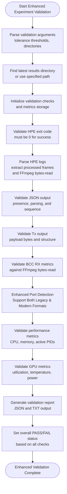

**Diagram sources**
- [ffmpeg_hpe/validate_run.py:467-521](file://ffmpeg_hpe/validate_run.py#L467-521)
- [ffmpeg_hpe/validate_run.py:22-27](file://ffmpeg_hpe/validate_run.py#L22-27)
- [ffmpeg_hpe/validate_run.py:73-90](file://ffmpeg_hpe/validate_run.py#L73-90)
- [ffmpeg_hpe/validate_run.py:282-395](file://ffmpeg_hpe/validate_run.py#L282-395)

### Validation Workflow Components
The validation system performs multi-stage checks across different aspects of the experiment with enhanced port detection compatibility:

**Stage 1: Container Health and Exit Status**
- Validates HPE container exit code equals 0 for successful completion
- Captures and analyzes container logs for diagnostic information
- Checks for proper container lifecycle management

**Stage 2: Processing Quality Assessment**
- Extracts processed frame counts from HPE logs
- Validates FFmpeg bytes-read metrics for data integrity
- Ensures consistent frame processing throughout the experiment

**Stage 3: Output Validation**
- Verifies presence and parsing of JSON output files
- Validates Tx output payload bytes and structure
- Confirms sequential frame numbering in output files

**Stage 4: Network Accuracy Verification**
- Cross-validates BCC RX metrics against FFmpeg bytes-read
- Validates port detection accuracy for video traffic filtering
- Enhanced port detection now supports both legacy "Monitoring HPE traffic on port X" and newer "BCC detected HPE video port: X" formats
- Ensures RX/TX byte consistency across monitoring approaches

**Stage 5: Performance Metrics Analysis**
- Analyzes CPU utilization patterns and thresholds
- Validates memory usage against minimum requirements
- Confirms active PID tracking and process monitoring

**Stage 6: GPU Metrics Validation**
- Validates GPU utilization, memory utilization, and temperature
- Checks power consumption metrics for safety thresholds
- Ensures GPU metrics consistency across monitoring periods

**Enhanced Port Detection Compatibility**
- The validation system now uses an enhanced regex pattern that supports both legacy and modern port detection log formats
- Legacy format: "Monitoring HPE traffic on port X"
- Modern format: "BCC detected HPE video port: X"
- This eliminates spurious validation failures that previously occurred when using the newer log format

**Section sources**
- [ffmpeg_hpe/validate_run.py:1-521](file://ffmpeg_hpe/validate_run.py#L1-L521)

## Conclusion
The HPE framework's performance monitoring stack now features an enhanced host-PID monitoring system with improved bpftrace-based process tracking, comprehensive experiment validation capabilities with enhanced port detection format compatibility, accurate HPE process measurement using docker inspect for host PID detection, and refined error handling for PID detection failures. The new architecture provides reliable process identification through host PID namespace operation with SYS_ADMIN privileges, while the enhanced bpftrace monitoring offers optimized cadence control and improved PID filtering. Combined with BCC-based packet filtering for precise video traffic analysis, per-process metrics (CPU, memory, network), GPU telemetry, comprehensive experiment validation with enhanced port detection compatibility, and Prometheus-based ingestion, this enables Grafana-driven KPIs, trend analysis, and capacity planning. The addition of automated quality assurance ensures experiment reliability and measurement accuracy through multi-stage validation checks, with enhanced port detection support for both legacy and modern log formats. By tuning sampling intervals, implementing robust error handling, validating exporter connectivity, leveraging comprehensive experiment validation, and ensuring proper healthcheck configurations and resource management, teams can maintain comprehensive visibility into system performance and quickly identify bottlenecks and degradation across containerized HPE workloads.

**Updated** Enhanced conclusion to reflect the benefits of comprehensive experiment validation, improved host-PID monitoring system, and enhanced port detection format compatibility.

## Appendices

### Setup Checklist
- Configure Prometheus scrape jobs for DCGM exporter and node/cluster agents.
- Deploy enhanced monitoring container with host PID namespace and SYS_ADMIN privileges.
- Set up docker inspect access with proper socket mounting and permissions.
- Configure bpftrace and BCC dependencies with appropriate kernel support.
- Run experiments and verify enhanced CSV outputs and Grafana dashboards.
- Establish baselines and configure alerts for CPU, memory, GPU, and network thresholds.
- For enhanced monitoring, ensure /pids/hpe.pid contains valid PIDs and docker inspect can access HPE container.
- Validate bpftrace tracepoint attachment and BCC packet filtering functionality.
- Configure experiment validation thresholds appropriate for workload characteristics.
- Test comprehensive validation workflow with sample experiment data.
- Verify automated validation report generation and interpretation.
- Ensure enhanced port detection compatibility with both legacy and modern log formats.
- Configure appropriate healthcheck settings with suitable intervals and timeouts for reliable service monitoring.
- Implement proper resource management with optimized CPU and memory limits for monitoring containers.

**Updated** Enhanced setup guidance for comprehensive experiment validation, improved host-PID monitoring system, enhanced port detection format compatibility, and reliable healthcheck configurations.

**Section sources**
- [prometheus.yml:1-8](file://prometheus.yml#L1-L8)
- [recent-dash/prometheus.yml:1-23](file://recent-dash/prometheus.yml#L1-L23)
- [monitor_hpe/docker-compose.yaml:28-50](file://monitor_hpe/docker-compose.yaml#L28-L50)
- [ffmpeg_hpe/docker-compose.yaml:120-145](file://ffmpeg_hpe/docker-compose.yaml#L120-L145)
- [ffmpeg_hpe/bpftrace-tracer/entrypoint.sh:18-23](file://ffmpeg_hpe/bpftrace-tracer/entrypoint.sh#L18-L23)
- [ffmpeg_hpe/run_experiment.sh:1-279](file://ffmpeg_hpe/run_experiment.sh#L1-L279)
- [ffmpeg_hpe/validate_run.py:1-521](file://ffmpeg_hpe/validate_run.py#L1-L521)
- [AGENTS.md:192-193](file://AGENTS.md#L192-L193)
- [docs/bcc-bpf-tracing.md:143-176](file://docs/bcc-bpf-tracing.md#L143-L176)