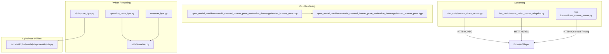
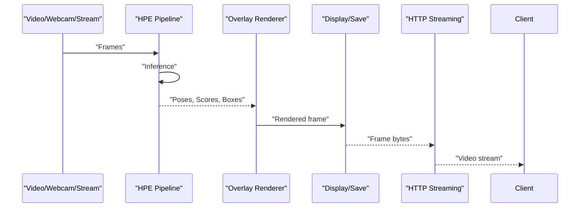
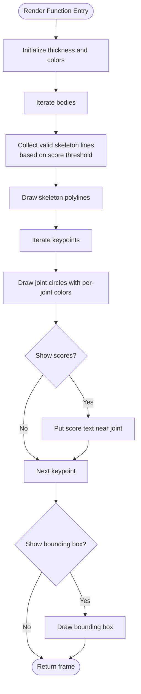
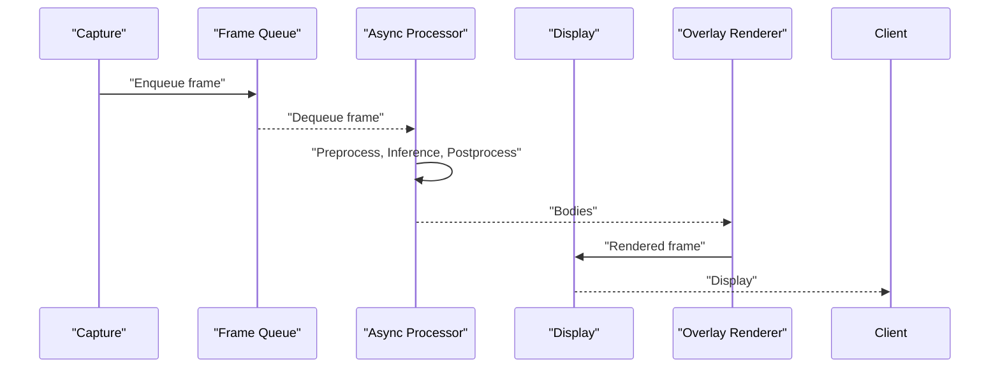
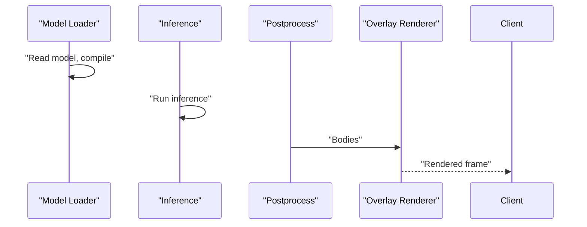
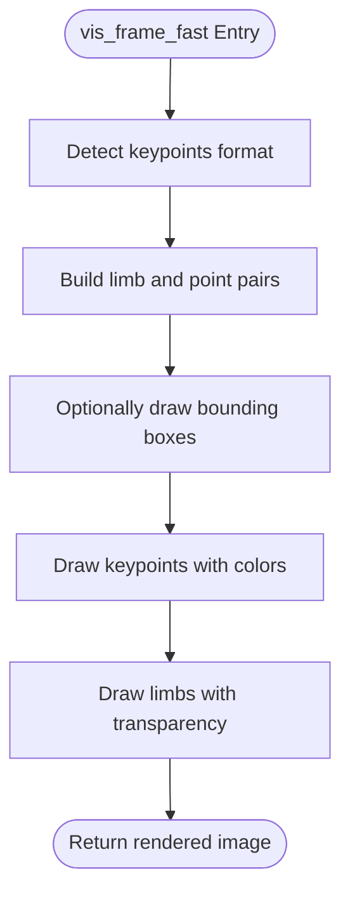
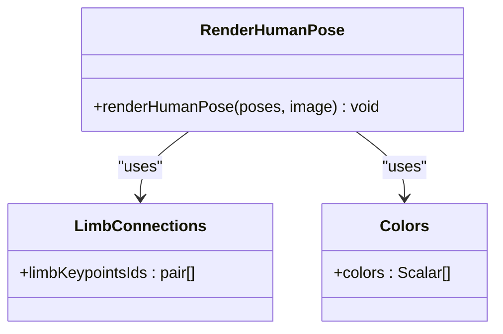
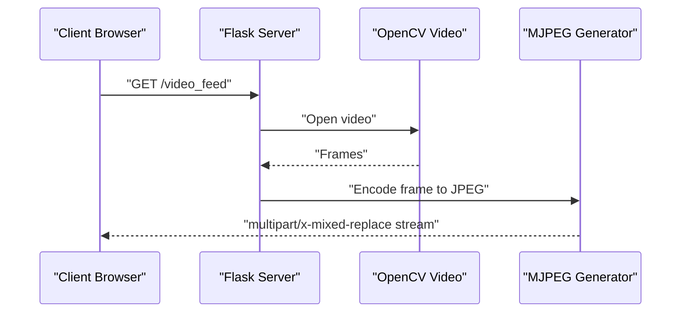
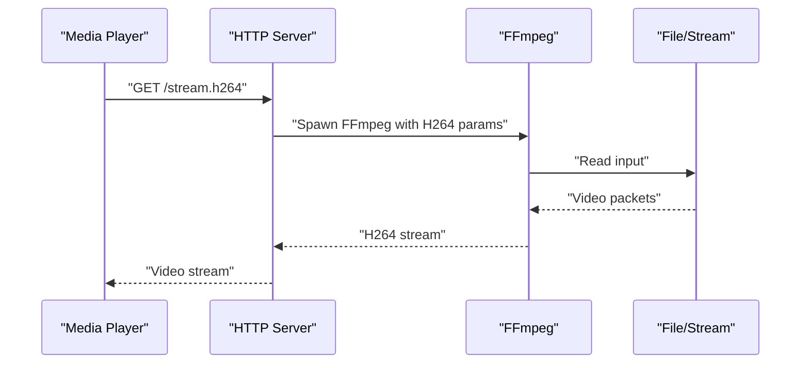
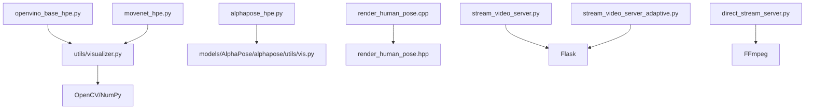

# Visualization Tools

<cite>
**Referenced Files in This Document**
- [visualizer.py](file://utils/visualizer.py)
- [alphapose_hpe.py](file://alphapose_hpe.py)
- [openvino_base_hpe.py](file://openvino_base_hpe.py)
- [movenet_hpe.py](file://movenet_hpe.py)
- [vis.py](file://models/AlphaPose/alphapose/utils/vis.py)
- [human_pose_estimation_demo.py](file://open_model_zoo/demos/human_pose_estimation_demo/python/human_pose_estimation_demo.py)
- [render_human_pose.hpp](file://open_model_zoo/demos/multi_channel_human_pose_estimation_demo/cpp/render_human_pose.hpp)
- [render_human_pose.cpp](file://open_model_zoo/demos/multi_channel_human_pose_estimation_demo/cpp/render_human_pose.cpp)
- [stream_video_server.py](file://dev_tools/stream_video_server.py)
- [stream_video_server_adaptive.py](file://dev_tools/stream_video_server_adaptive.py)
- [direct_stream_server.py](file://rtsp-ipcam/direct_stream_server.py)
</cite>

## Table of Contents
1. [Introduction](#introduction)
2. [Project Structure](#project-structure)
3. [Core Components](#core-components)
4. [Architecture Overview](#architecture-overview)
5. [Detailed Component Analysis](#detailed-component-analysis)
6. [Dependency Analysis](#dependency-analysis)
7. [Performance Considerations](#performance-considerations)
8. [Troubleshooting Guide](#troubleshooting-guide)
9. [Conclusion](#conclusion)
10. [Appendices](#appendices)

## Introduction
This document describes the visualization tools and rendering capabilities integrated into the Human Pose Estimation (HPE) framework. It covers:
- Pose visualization utilities for rendering skeletal structures, joint connections, and confidence indicators on video frames
- Real-time video streaming with adaptive bitrate streaming and client-side rendering
- Configuration options for customizing visualization styles, colors, and overlay displays
- Guidance on batch video processing with visualization overlays, generating annotated video outputs, and creating visual reports
- Integration with web-based visualization interfaces and real-time streaming protocols
- Examples of custom visualization implementations, performance optimization techniques for high-throughput visualization, and troubleshooting common visualization issues
- Accessibility considerations and cross-platform compatibility for visualization tools

## Project Structure
The visualization ecosystem spans several modules:
- Python-based rendering utilities for overlays and visualization
- OpenVINO-based HPE pipelines with integrated rendering
- AlphaPose-based visualization helpers and rendering functions
- C++ rendering utilities for multi-channel pose estimation
- Development and deployment tools for HTTP-based streaming and adaptive bitrate delivery

**Diagram sources**
- [visualizer.py:1-49](file://utils/visualizer.py#L1-L49)
- [alphapose_hpe.py:1-334](file://alphapose_hpe.py#L1-L334)
- [openvino_base_hpe.py:1-653](file://openvino_base_hpe.py#L1-L653)
- [movenet_hpe.py:1-111](file://movenet_hpe.py#L1-L111)
- [vis.py:1-866](file://models/AlphaPose/alphapose/utils/vis.py#L1-L866)
- [render_human_pose.hpp:1-26](file://open_model_zoo/demos/multi_channel_human_pose_estimation_demo/cpp/render_human_pose.hpp#L1-L26)
- [render_human_pose.cpp:1-77](file://open_model_zoo/demos/multi_channel_human_pose_estimation_demo/cpp/render_human_pose.cpp#L1-L77)
- [stream_video_server.py:1-228](file://dev_tools/stream_video_server.py#L1-L228)
- [stream_video_server_adaptive.py:1-195](file://dev_tools/stream_video_server_adaptive.py#L1-L195)
- [direct_stream_server.py:1-304](file://rtsp-ipcam/direct_stream_server.py#L1-L304)

**Section sources**
- [visualizer.py:1-49](file://utils/visualizer.py#L1-L49)
- [openvino_base_hpe.py:316-395](file://openvino_base_hpe.py#L316-L395)
- [movenet_hpe.py:83-111](file://movenet_hpe.py#L83-L111)
- [alphapose_hpe.py:295-334](file://alphapose_hpe.py#L295-L334)
- [vis.py:58-274](file://models/AlphaPose/alphapose/utils/vis.py#L58-L274)
- [render_human_pose.cpp:25-77](file://open_model_zoo/demos/multi_channel_human_pose_estimation_demo/cpp/render_human_pose.cpp#L25-L77)
- [stream_video_server.py:100-172](file://dev_tools/stream_video_server.py#L100-L172)
- [stream_video_server_adaptive.py:56-150](file://dev_tools/stream_video_server_adaptive.py#L56-L150)
- [direct_stream_server.py:45-151](file://rtsp-ipcam/direct_stream_server.py#L45-L151)

## Core Components
- Overlay rendering engine: renders skeletons, joints, optional bounding boxes, and optional keypoint scores on frames
- HPE pipelines with integrated visualization:
  - OpenVINO-based pipelines (including async variants) render overlays during display
  - MoveNet-based pipeline supports overlay rendering
  - AlphaPose-based pipeline integrates visualization helpers
- C++ rendering utilities for multi-channel pose estimation
- Streaming servers for HTTP-based visualization delivery

Key rendering behaviors:
- Skeleton lines and joint circles with configurable thickness and colors
- Optional bounding boxes around detected persons
- Optional per-keypoint score overlays
- Adaptive streaming with JPEG quality and optional downscaling for performance

**Section sources**
- [visualizer.py:4-49](file://utils/visualizer.py#L4-L49)
- [openvino_base_hpe.py:567-571](file://openvino_base_hpe.py#L567-L571)
- [movenet_hpe.py:88-111](file://movenet_hpe.py#L88-L111)
- [alphapose_hpe.py:295-334](file://alphapose_hpe.py#L295-L334)
- [vis.py:277-520](file://models/AlphaPose/alphapose/utils/vis.py#L277-L520)
- [render_human_pose.cpp:25-77](file://open_model_zoo/demos/multi_channel_human_pose_estimation_demo/cpp/render_human_pose.cpp#L25-L77)

## Architecture Overview
The visualization architecture integrates HPE inference with rendering and streaming:
- Inference pipelines produce pose detections (keypoints, scores, bounding boxes)
- Rendering utilities draw overlays onto frames
- Streaming servers deliver frames to clients for visualization

**Diagram sources**
- [openvino_base_hpe.py:316-395](file://openvino_base_hpe.py#L316-L395)
- [visualizer.py:4-49](file://utils/visualizer.py#L4-L49)
- [stream_video_server.py:100-172](file://dev_tools/stream_video_server.py#L100-L172)

## Detailed Component Analysis

### Python Overlay Rendering Engine
The overlay rendering engine draws skeletons, joints, optional bounding boxes, and optional keypoint scores on frames. It supports:
- Configurable line thickness and colors
- Per-keypoint coloring and score overlays
- Optional bounding box rendering

**Diagram sources**
- [visualizer.py:4-49](file://utils/visualizer.py#L4-L49)

**Section sources**
- [visualizer.py:4-49](file://utils/visualizer.py#L4-L49)

### OpenVINO-Based HPE Pipelines with Visualization
OpenVINO pipelines integrate rendering during display:
- Synchronous pipeline loads model, processes frames, and renders overlays
- Asynchronous pipeline buffers frames, processes in background, and renders results with FPS/timing info

**Diagram sources**
- [openvino_base_hpe.py:480-592](file://openvino_base_hpe.py#L480-L592)
- [visualizer.py:4-49](file://utils/visualizer.py#L4-L49)

**Section sources**
- [openvino_base_hpe.py:316-395](file://openvino_base_hpe.py#L316-L395)
- [openvino_base_hpe.py:480-592](file://openvino_base_hpe.py#L480-L592)
- [visualizer.py:4-49](file://utils/visualizer.py#L4-L49)

### MoveNet-Based HPE Pipeline with Visualization
MoveNet pipeline loads the model, runs inference, and postprocesses detections into bodies for rendering:
- Loads compiled model and infers new requests
- Postprocesses outputs into normalized keypoints, bounding boxes, and scores
- Renders overlays using the shared visualizer

**Diagram sources**
- [movenet_hpe.py:58-111](file://movenet_hpe.py#L58-L111)
- [visualizer.py:4-49](file://utils/visualizer.py#L4-L49)

**Section sources**
- [movenet_hpe.py:58-111](file://movenet_hpe.py#L58-L111)
- [visualizer.py:4-49](file://utils/visualizer.py#L4-L49)

### AlphaPose-Based Visualization Helpers
AlphaPose utilities provide advanced visualization functions:
- Fast and standard visualization functions for COCO/other formats
- 3D SMPL visualization and skeleton plotting
- Color management and transparency blending for overlays

**Diagram sources**
- [vis.py:58-274](file://models/AlphaPose/alphapose/utils/vis.py#L58-L274)

**Section sources**
- [vis.py:58-274](file://models/AlphaPose/alphapose/utils/vis.py#L58-L274)
- [vis.py:523-596](file://models/AlphaPose/alphapose/utils/vis.py#L523-L596)
- [vis.py:628-800](file://models/AlphaPose/alphapose/utils/vis.py#L628-L800)

### C++ Multi-Channel Pose Rendering
C++ rendering utilities define color sets and limb connections for multi-channel pose estimation and draw ellipses for limbs.

**Diagram sources**
- [render_human_pose.hpp:25-26](file://open_model_zoo/demos/multi_channel_human_pose_estimation_demo/cpp/render_human_pose.hpp#L25-L26)
- [render_human_pose.cpp:25-77](file://open_model_zoo/demos/multi_channel_human_pose_estimation_demo/cpp/render_human_pose.cpp#L25-L77)

**Section sources**
- [render_human_pose.hpp:1-26](file://open_model_zoo/demos/multi_channel_human_pose_estimation_demo/cpp/render_human_pose.hpp#L1-L26)
- [render_human_pose.cpp:25-77](file://open_model_zoo/demos/multi_channel_human_pose_estimation_demo/cpp/render_human_pose.cpp#L25-L77)

### Real-Time Video Streaming and Client-Side Rendering
Two development servers demonstrate HTTP-based streaming:
- Basic MJPEG server with frame generation and test patterns
- Adaptive server with JPEG quality selection and optional downscaling

**Diagram sources**
- [stream_video_server.py:100-172](file://dev_tools/stream_video_server.py#L100-L172)
- [stream_video_server_adaptive.py:56-150](file://dev_tools/stream_video_server_adaptive.py#L56-L150)

**Section sources**
- [stream_video_server.py:100-172](file://dev_tools/stream_video_server.py#L100-L172)
- [stream_video_server_adaptive.py:56-150](file://dev_tools/stream_video_server_adaptive.py#L56-L150)

### HTTP-Based H264 Streaming Server
A direct H264 streaming server uses FFmpeg to stream H264 over HTTP, suitable for media players like VLC and FFplay.

**Diagram sources**
- [direct_stream_server.py:45-151](file://rtsp-ipcam/direct_stream_server.py#L45-L151)

**Section sources**
- [direct_stream_server.py:45-151](file://rtsp-ipcam/direct_stream_server.py#L45-L151)

## Dependency Analysis
The visualization stack exhibits clear module boundaries:
- Rendering utilities depend on OpenCV and NumPy
- HPE pipelines depend on model APIs and adapters
- Streaming servers depend on Flask and OpenCV
- C++ rendering depends on OpenCV and pose data structures

**Diagram sources**
- [visualizer.py:1-49](file://utils/visualizer.py#L1-L49)
- [openvino_base_hpe.py:1-653](file://openvino_base_hpe.py#L1-L653)
- [movenet_hpe.py:1-111](file://movenet_hpe.py#L1-L111)
- [alphapose_hpe.py:1-334](file://alphapose_hpe.py#L1-L334)
- [vis.py:1-866](file://models/AlphaPose/alphapose/utils/vis.py#L1-L866)
- [render_human_pose.hpp:1-26](file://open_model_zoo/demos/multi_channel_human_pose_estimation_demo/cpp/render_human_pose.hpp#L1-L26)
- [render_human_pose.cpp:1-77](file://open_model_zoo/demos/multi_channel_human_pose_estimation_demo/cpp/render_human_pose.cpp#L1-L77)
- [stream_video_server.py:1-228](file://dev_tools/stream_video_server.py#L1-L228)
- [stream_video_server_adaptive.py:1-195](file://dev_tools/stream_video_server_adaptive.py#L1-L195)
- [direct_stream_server.py:1-304](file://rtsp-ipcam/direct_stream_server.py#L1-L304)

**Section sources**
- [visualizer.py:1-49](file://utils/visualizer.py#L1-L49)
- [openvino_base_hpe.py:1-653](file://openvino_base_hpe.py#L1-L653)
- [movenet_hpe.py:1-111](file://movenet_hpe.py#L1-L111)
- [alphapose_hpe.py:1-334](file://alphapose_hpe.py#L1-L334)
- [vis.py:1-866](file://models/AlphaPose/alphapose/utils/vis.py#L1-L866)
- [render_human_pose.hpp:1-26](file://open_model_zoo/demos/multi_channel_human_pose_estimation_demo/cpp/render_human_pose.hpp#L1-L26)
- [render_human_pose.cpp:1-77](file://open_model_zoo/demos/multi_channel_human_pose_estimation_demo/cpp/render_human_pose.cpp#L1-L77)
- [stream_video_server.py:1-228](file://dev_tools/stream_video_server.py#L1-L228)
- [stream_video_server_adaptive.py:1-195](file://dev_tools/stream_video_server_adaptive.py#L1-L195)
- [direct_stream_server.py:1-304](file://rtsp-ipcam/direct_stream_server.py#L1-L304)

## Performance Considerations
- Rendering cost: drawing polylines and circles scales with number of bodies and keypoints; consider increasing the score threshold to reduce rendering workload
- Streaming throughput: adaptive server selects JPEG quality and optionally downscales HD streams to balance bandwidth and quality
- Inference pipeline: OpenVINO async pipeline buffers frames and drops late frames to maintain responsiveness
- GPU acceleration: AlphaPose pipeline leverages GPU tensors for detection and pose crops; ensure appropriate batching and device selection
- Cross-platform compatibility: OpenCV backends differ across platforms; HTTP streaming uses FFmpeg backend for robustness on various systems

[No sources needed since this section provides general guidance]

## Troubleshooting Guide
Common visualization issues and resolutions:
- No video file found: streaming servers fall back to test patterns and log warnings; verify video path and permissions
- Invalid FPS or frame count: servers default to safe values and continue streaming
- Streaming URL initialization: OpenVINO fallback sets default dimensions for HTTP streams; ensure network connectivity and correct URL
- Frame drops in async pipelines: frame queue overflow leads to dropped frames; adjust queue sizes or reduce input FPS
- Rendering artifacts: verify score thresholds and ensure bodies contain valid keypoints; check color and thickness settings

**Section sources**
- [stream_video_server.py:34-80](file://dev_tools/stream_video_server.py#L34-L80)
- [stream_video_server.py:108-133](file://dev_tools/stream_video_server.py#L108-L133)
- [openvino_base_hpe.py:133-151](file://openvino_base_hpe.py#L133-L151)
- [openvino_base_hpe.py:466-473](file://openvino_base_hpe.py#L466-L473)
- [visualizer.py:4-49](file://utils/visualizer.py#L4-L49)

## Conclusion
The HPE framework provides a comprehensive visualization toolkit spanning Python and C++ rendering engines, OpenVINO pipelines with integrated overlays, AlphaPose visualization helpers, and HTTP-based streaming servers. Users can customize visualization styles, leverage adaptive streaming, and optimize performance for high-throughput scenarios while maintaining cross-platform compatibility.

[No sources needed since this section summarizes without analyzing specific files]

## Appendices

### Configuration Options for Visualization Styles
- Skeleton and joint rendering:
  - Line thickness and colors are configurable in the rendering engine
  - Per-keypoint colors and optional score overlays
  - Optional bounding box rendering
- AlphaPose visualization:
  - Format-specific limb and point color sets
  - Transparency blending for limbs and keypoints
  - 3D SMPL mesh overlay rendering
- OpenVINO async pipeline:
  - FPS and processing time overlays
  - Frame drop logging for diagnostics

**Section sources**
- [visualizer.py:4-49](file://utils/visualizer.py#L4-L49)
- [vis.py:277-520](file://models/AlphaPose/alphapose/utils/vis.py#L277-L520)
- [openvino_base_hpe.py:563-581](file://openvino_base_hpe.py#L563-L581)

### Batch Video Processing with Overlays
- OpenVINO pipelines support batch processing and JSON/CSV export; overlays are rendered during display
- AlphaPose pipeline processes images/directories and can be adapted for batch video by iterating frames
- MoveNet pipeline supports batch inference and postprocessing for multiple persons per frame

**Section sources**
- [openvino_base_hpe.py:316-395](file://openvino_base_hpe.py#L316-L395)
- [alphapose_hpe.py:69-125](file://alphapose_hpe.py#L69-L125)
- [movenet_hpe.py:83-111](file://movenet_hpe.py#L83-L111)

### Web-Based Visualization Interfaces and Streaming Protocols
- HTTP MJPEG streaming for lightweight browser playback
- HTTP H264 streaming via FFmpeg for media players
- Real-time streaming with adaptive bitrate and quality controls

**Section sources**
- [stream_video_server.py:100-172](file://dev_tools/stream_video_server.py#L100-L172)
- [stream_video_server_adaptive.py:56-150](file://dev_tools/stream_video_server_adaptive.py#L56-L150)
- [direct_stream_server.py:45-151](file://rtsp-ipcam/direct_stream_server.py#L45-L151)

### Accessibility and Cross-Platform Compatibility
- OpenCV backends vary by platform; HTTP streaming uses FFmpeg backend for improved reliability
- Ensure appropriate codecs and container formats for target clients
- Test streaming servers across operating systems and browsers

**Section sources**
- [openvino_base_hpe.py:104-111](file://openvino_base_hpe.py#L104-L111)
- [direct_stream_server.py:242-267](file://rtsp-ipcam/direct_stream_server.py#L242-L267)