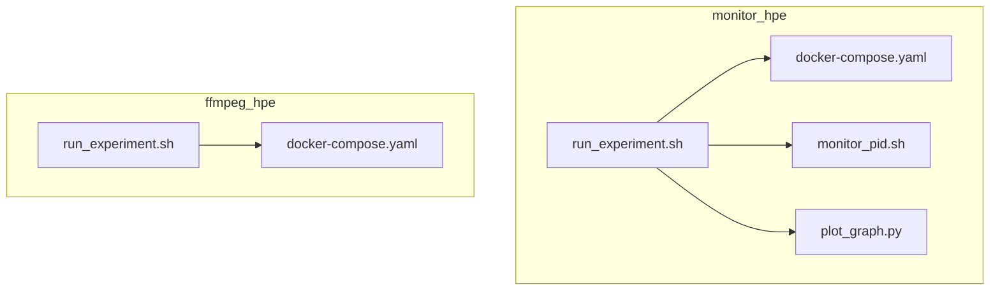
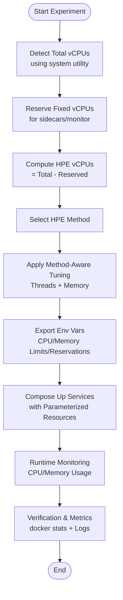
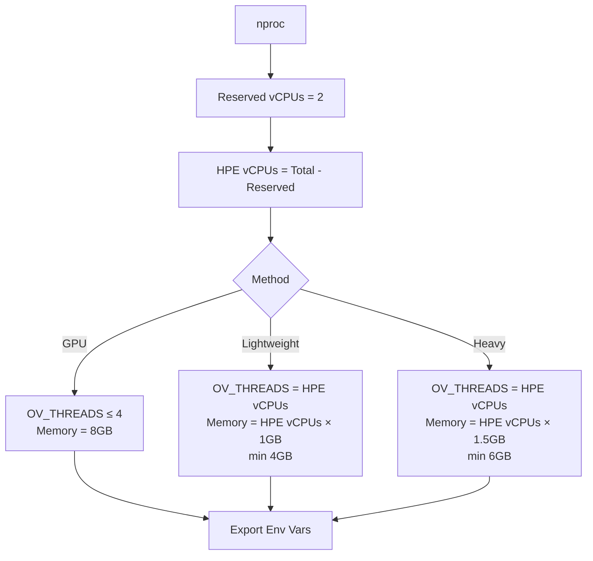
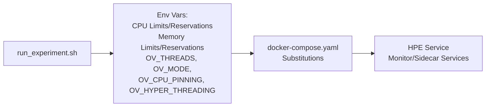
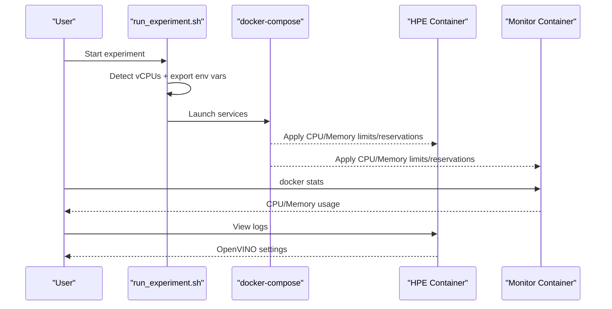
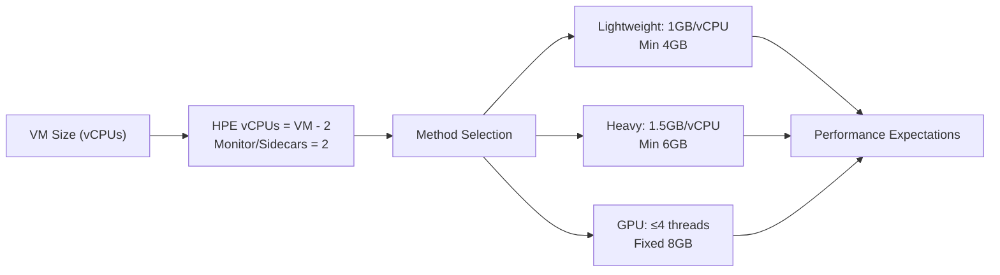
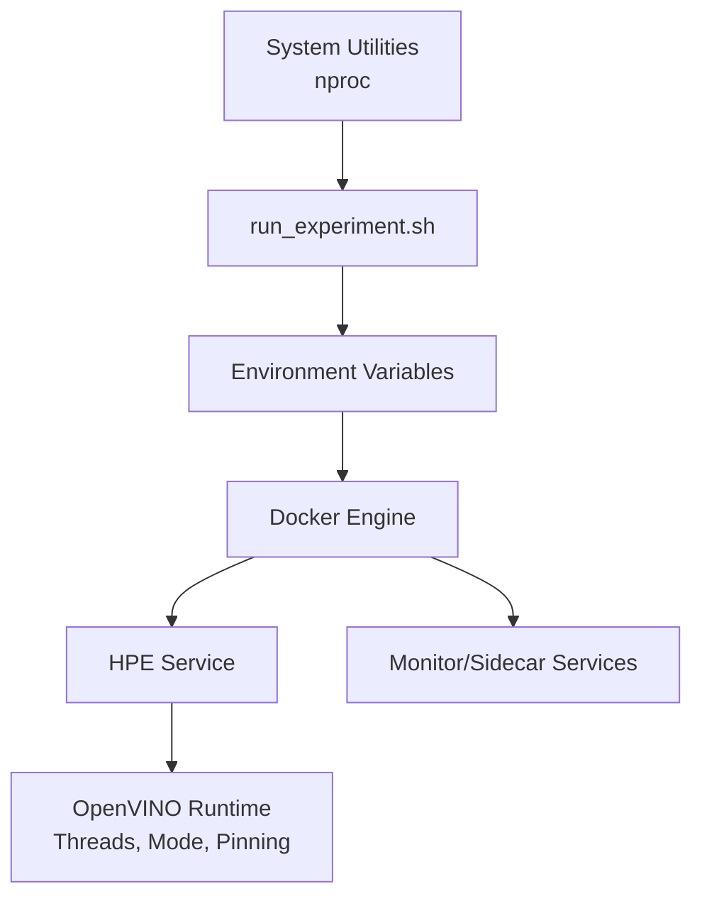

# Auto-scaling Implementation

<cite>
**Referenced Files in This Document**
- [AUTO_SCALING_IMPLEMENTATION_SUMMARY.md](file://monitor_hpe/AUTO_SCALING_IMPLEMENTATION_SUMMARY.md)
- [SCALING_GUIDE.md](file://monitor_hpe/SCALING_GUIDE.md)
- [RESOURCE_ALLOCATION.md](file://monitor_hpe/RESOURCE_ALLOCATION.md)
- [DYNAMIC_RESOURCE_ALLOCATION.md](file://ffmpeg_hpe/DYNAMIC_RESOURCE_ALLOCATION.md)
- [DYNAMIC_RESOURCE_ALLOCATION_SUMMARY.md](file://DYNAMIC_RESOURCE_ALLOCATION_SUMMARY.md)
- [run_experiment.sh](file://monitor_hpe/run_experiment.sh)
- [docker-compose.yaml](file://monitor_hpe/docker-compose.yaml)
- [monitor_pid.sh](file://monitor_hpe/monitor_pid.sh)
- [plot_graph.py](file://monitor_hpe/plot_graph.py)
- [run_experiment.sh](file://ffmpeg_hpe/run_experiment.sh)
- [docker-compose.yaml](file://ffmpeg_hpe/docker-compose.yaml)
</cite>

## Table of Contents
1. [Introduction](#introduction)
2. [Project Structure](#project-structure)
3. [Core Components](#core-components)
4. [Architecture Overview](#architecture-overview)
5. [Detailed Component Analysis](#detailed-component-analysis)
6. [Dependency Analysis](#dependency-analysis)
7. [Performance Considerations](#performance-considerations)
8. [Troubleshooting Guide](#troubleshooting-guide)
9. [Conclusion](#conclusion)
10. [Appendices](#appendices)

## Introduction
This document explains the dynamic auto-scaling implementation that automatically detects available vCPUs and allocates resources across two experiment rigs: monitor_hpe and ffmpeg_hpe. The system supports cloud VMs with 4 or more vCPUs, automatically reserving a fixed number of vCPUs for monitoring/sidecar services and allocating the remainder to the Human Pose Estimation (HPE) service. The implementation includes method-aware resource tuning (lightweight, heavy, and GPU-bound models), Docker-based resource constraints, and comprehensive documentation for configuration, verification, and optimization.

## Project Structure
The auto-scaling spans two primary experiment rigs, each with:
- An orchestration script that detects vCPUs, computes allocations, exports environment variables, and starts containers
- A Docker Compose configuration that consumes the exported environment variables for CPU/memory limits and reservations
- Supporting scripts for monitoring and visualization
- Extensive documentation for usage, scaling behavior, and resource allocation

**Diagram sources**
- [run_experiment.sh](file://monitor_hpe/run_experiment.sh)
- [docker-compose.yaml](file://monitor_hpe/docker-compose.yaml)
- [monitor_pid.sh](file://monitor_hpe/monitor_pid.sh)
- [plot_graph.py](file://monitor_hpe/plot_graph.py)
- [run_experiment.sh](file://ffmpeg_hpe/run_experiment.sh)
- [docker-compose.yaml](file://ffmpeg_hpe/docker-compose.yaml)

**Section sources**
- [AUTO_SCALING_IMPLEMENTATION_SUMMARY.md:1-298](file://monitor_hpe/AUTO_SCALING_IMPLEMENTATION_SUMMARY.md#L1-L298)
- [SCALING_GUIDE.md:1-365](file://monitor_hpe/SCALING_GUIDE.md#L1-L365)
- [RESOURCE_ALLOCATION.md:1-290](file://monitor_hpe/RESOURCE_ALLOCATION.md#L1-L290)
- [DYNAMIC_RESOURCE_ALLOCATION.md:1-167](file://ffmpeg_hpe/DYNAMIC_RESOURCE_ALLOCATION.md#L1-L167)
- [DYNAMIC_RESOURCE_ALLOCATION_SUMMARY.md:1-241](file://DYNAMIC_RESOURCE_ALLOCATION_SUMMARY.md#L1-L241)

## Core Components
- Auto-detection and allocation logic: Orchestrated by the run_experiment.sh scripts in both rigs, which detect total vCPUs, reserve a fixed amount for sidecars/monitor, and compute HPE vCPUs and method-specific memory allocations.
- Docker Compose parameterization: docker-compose.yaml files consume environment variables exported by the scripts to set CPU limits/reservations and memory limits/reservations.
- Method-aware resource tuning: Different HPE methods receive tailored CPU thread counts and memory allocations to match computational characteristics (CPU-bound lightweight/heavy vs GPU-bound).
- Monitoring and verification: Scripts and plots support runtime checks of CPU utilization and memory usage, plus visualization of results.

Key implementation references:
- Auto-detection and allocation formulas, method-aware logic, and environment variable exports
- Docker Compose substitutions for CPU/memory limits and reservations
- OpenVINO configuration parameters (threads, mode, CPU pinning, hyper-threading)
- Performance expectations and scaling efficiency analysis

**Section sources**
- [AUTO_SCALING_IMPLEMENTATION_SUMMARY.md:11-51](file://monitor_hpe/AUTO_SCALING_IMPLEMENTATION_SUMMARY.md#L11-L51)
- [SCALING_GUIDE.md:9-35](file://monitor_hpe/SCALING_GUIDE.md#L9-L35)
- [RESOURCE_ALLOCATION.md:25-70](file://monitor_hpe/RESOURCE_ALLOCATION.md#L25-L70)
- [DYNAMIC_RESOURCE_ALLOCATION.md:21-54](file://ffmpeg_hpe/DYNAMIC_RESOURCE_ALLOCATION.md#L21-L54)
- [DYNAMIC_RESOURCE_ALLOCATION_SUMMARY.md:63-86](file://DYNAMIC_RESOURCE_ALLOCATION_SUMMARY.md#L63-L86)

## Architecture Overview
The auto-scaling architecture follows a deterministic pipeline:
- Detect available vCPUs using system utilities
- Reserve a fixed number of vCPUs for sidecar/monitor services
- Compute HPE vCPUs as the difference
- Select method-aware CPU threads and memory allocation
- Export environment variables consumed by Docker Compose
- Start services with CPU/memory limits and reservations
- Monitor and verify resource usage and performance

**Diagram sources**
- [run_experiment.sh](file://monitor_hpe/run_experiment.sh)
- [run_experiment.sh](file://ffmpeg_hpe/run_experiment.sh)
- [docker-compose.yaml](file://monitor_hpe/docker-compose.yaml)
- [docker-compose.yaml](file://ffmpeg_hpe/docker-compose.yaml)

**Section sources**
- [AUTO_SCALING_IMPLEMENTATION_SUMMARY.md:11-18](file://monitor_hpe/AUTO_SCALING_IMPLEMENTATION_SUMMARY.md#L11-L18)
- [SCALING_GUIDE.md:9-17](file://monitor_hpe/SCALING_GUIDE.md#L9-L17)
- [DYNAMIC_RESOURCE_ALLOCATION.md:21-28](file://ffmpeg_hpe/DYNAMIC_RESOURCE_ALLOCATION.md#L21-L28)
- [DYNAMIC_RESOURCE_ALLOCATION_SUMMARY.md:63-86](file://DYNAMIC_RESOURCE_ALLOCATION_SUMMARY.md#L63-L86)

## Detailed Component Analysis

### Auto-detection and Allocation Logic
Both rigs implement a consistent pattern:
- Detect total vCPUs
- Reserve a fixed number of vCPUs (2) for sidecars/monitor
- Compute HPE vCPUs as the difference
- Apply method-aware logic:
  - GPU methods cap CPU threads at 4 and use fixed 8GB memory
  - Lightweight CPU methods allocate 1GB per vCPU (min 4GB)
  - Heavy CPU methods allocate 1.5GB per vCPU (min 6GB)
- Export environment variables for Docker Compose substitution

**Diagram sources**
- [DYNAMIC_RESOURCE_ALLOCATION_SUMMARY.md:67-86](file://DYNAMIC_RESOURCE_ALLOCATION_SUMMARY.md#L67-L86)
- [DYNAMIC_RESOURCE_ALLOCATION.md:35-54](file://ffmpeg_hpe/DYNAMIC_RESOURCE_ALLOCATION.md#L35-L54)
- [AUTO_SCALING_IMPLEMENTATION_SUMMARY.md:19-44](file://monitor_hpe/AUTO_SCALING_IMPLEMENTATION_SUMMARY.md#L19-L44)

**Section sources**
- [DYNAMIC_RESOURCE_ALLOCATION_SUMMARY.md:63-86](file://DYNAMIC_RESOURCE_ALLOCATION_SUMMARY.md#L63-L86)
- [DYNAMIC_RESOURCE_ALLOCATION.md:21-54](file://ffmpeg_hpe/DYNAMIC_RESOURCE_ALLOCATION.md#L21-L54)
- [AUTO_SCALING_IMPLEMENTATION_SUMMARY.md:11-44](file://monitor_hpe/AUTO_SCALING_IMPLEMENTATION_SUMMARY.md#L11-L44)

### Docker Compose Parameterization
The docker-compose.yaml files consume the exported environment variables to enforce CPU and memory constraints:
- CPU limits and reservations for HPE and monitor/sidecar services
- Memory limits and reservations aligned with method-aware allocations
- OpenVINO tuning parameters passed as environment variables

**Diagram sources**
- [docker-compose.yaml](file://monitor_hpe/docker-compose.yaml)
- [docker-compose.yaml](file://ffmpeg_hpe/docker-compose.yaml)
- [DYNAMIC_RESOURCE_ALLOCATION.md:84-98](file://ffmpeg_hpe/DYNAMIC_RESOURCE_ALLOCATION.md#L84-L98)
- [RESOURCE_ALLOCATION.md:29-44](file://monitor_hpe/RESOURCE_ALLOCATION.md#L29-L44)

**Section sources**
- [DYNAMIC_RESOURCE_ALLOCATION.md:84-98](file://ffmpeg_hpe/DYNAMIC_RESOURCE_ALLOCATION.md#L84-L98)
- [RESOURCE_ALLOCATION.md:29-44](file://monitor_hpe/RESOURCE_ALLOCATION.md#L29-L44)

### Monitoring and Verification
Runtime verification includes:
- Using docker stats to confirm CPU and memory usage align with allocations
- Inspecting container logs for OpenVINO configuration (threads, mode, pinning, hyper-threading)
- Plotting results for visual analysis

**Diagram sources**
- [run_experiment.sh](file://monitor_hpe/run_experiment.sh)
- [docker-compose.yaml](file://monitor_hpe/docker-compose.yaml)
- [monitor_pid.sh](file://monitor_hpe/monitor_pid.sh)
- [plot_graph.py](file://monitor_hpe/plot_graph.py)

**Section sources**
- [RESOURCE_ALLOCATION.md:193-230](file://monitor_hpe/RESOURCE_ALLOCATION.md#L193-L230)
- [SCALING_GUIDE.md:147-185](file://monitor_hpe/SCALING_GUIDE.md#L147-L185)

### Scaling Behavior Across VM Sizes
The system documents scaling behavior for 4, 8, 16, and 32 vCPU VMs, including:
- Resource distribution (HPE vs monitor/sidecars)
- Expected performance ranges per method
- Scaling efficiency analysis and cost-performance trade-offs

**Diagram sources**
- [SCALING_GUIDE.md:38-107](file://monitor_hpe/SCALING_GUIDE.md#L38-L107)
- [DYNAMIC_RESOURCE_ALLOCATION.md:21-54](file://ffmpeg_hpe/DYNAMIC_RESOURCE_ALLOCATION.md#L21-L54)

**Section sources**
- [SCALING_GUIDE.md:38-107](file://monitor_hpe/SCALING_GUIDE.md#L38-L107)
- [DYNAMIC_RESOURCE_ALLOCATION.md:21-54](file://ffmpeg_hpe/DYNAMIC_RESOURCE_ALLOCATION.md#L21-L54)

## Dependency Analysis
The auto-scaling implementation depends on:
- System utilities for vCPU detection
- Environment variable propagation to Docker Compose
- Docker resource constraints for CPU and memory
- OpenVINO configuration parameters for inference performance

**Diagram sources**
- [run_experiment.sh](file://monitor_hpe/run_experiment.sh)
- [run_experiment.sh](file://ffmpeg_hpe/run_experiment.sh)
- [docker-compose.yaml](file://monitor_hpe/docker-compose.yaml)
- [docker-compose.yaml](file://ffmpeg_hpe/docker-compose.yaml)

**Section sources**
- [DYNAMIC_RESOURCE_ALLOCATION_SUMMARY.md:10-18](file://DYNAMIC_RESOURCE_ALLOCATION_SUMMARY.md#L10-L18)
- [DYNAMIC_RESOURCE_ALLOCATION.md:84-98](file://ffmpeg_hpe/DYNAMIC_RESOURCE_ALLOCATION.md#L84-L98)
- [RESOURCE_ALLOCATION.md:29-44](file://monitor_hpe/RESOURCE_ALLOCATION.md#L29-L44)

## Performance Considerations
- Scaling efficiency varies by VM size and method type, with diminishing returns at higher vCPU counts due to memory bandwidth, cache contention, and synchronization overhead.
- GPU-bound methods cap CPU threads at 4 and rely on GPU acceleration; increasing CPU beyond 4 threads yields minimal benefit.
- Lightweight and heavy CPU methods show strong linear scaling up to 8 vCPUs, after which efficiency declines.
- OpenVINO tuning (threads, mode, CPU pinning, hyper-threading) significantly impacts performance predictability and throughput.

**Section sources**
- [SCALING_GUIDE.md:242-272](file://monitor_hpe/SCALING_GUIDE.md#L242-L272)
- [DYNAMIC_RESOURCE_ALLOCATION.md:124-132](file://ffmpeg_hpe/DYNAMIC_RESOURCE_ALLOCATION.md#L124-L132)
- [RESOURCE_ALLOCATION.md:100-129](file://monitor_hpe/RESOURCE_ALLOCATION.md#L100-L129)

## Troubleshooting Guide
Common issues and resolutions:
- Minimum vCPU requirement: The scripts enforce a minimum of 4 vCPUs; deployments with fewer vCPUs will fail with an explicit error.
- Out-of-memory errors: Auto-scaling may allocate large amounts of memory for CPU methods on very large VMs; override memory limits via environment variables.
- Underutilized HPE threads: Verify OpenVINO environment variables are correctly exported and applied; check container logs for effective settings.
- Interference from monitor/sidecar services: Ensure monitor/sidecar CPU limits are adequate to prevent contention.

Validation steps:
- Confirm detected configuration printed by the script
- Use docker stats to verify CPU and memory usage
- Inspect container logs for OpenVINO configuration

**Section sources**
- [SCALING_GUIDE.md:295-329](file://monitor_hpe/SCALING_GUIDE.md#L295-L329)
- [DYNAMIC_RESOURCE_ALLOCATION.md:146-161](file://ffmpeg_hpe/DYNAMIC_RESOURCE_ALLOCATION.md#L146-L161)
- [RESOURCE_ALLOCATION.md:233-262](file://monitor_hpe/RESOURCE_ALLOCATION.md#L233-L262)

## Conclusion
The dynamic auto-scaling implementation enables seamless operation across a wide range of cloud VM configurations without manual intervention. By detecting available vCPUs, reserving a fixed portion for monitoring/sidecars, and applying method-aware resource tuning, the system achieves predictable performance and strong scaling efficiency up to 8 vCPUs. GPU-bound methods remain capped appropriately, while CPU-bound methods scale linearly with vCPUs. The combination of Docker resource constraints, OpenVINO tuning, and comprehensive documentation ensures reliable, reproducible experiments with clear guidance for configuration, verification, and optimization.

## Appendices

### Configuration Parameters and Environment Variables
- CPU/memory limits and reservations are exported by the scripts and consumed by Docker Compose
- OpenVINO parameters include thread count, performance mode, CPU pinning, and hyper-threading toggles

**Section sources**
- [DYNAMIC_RESOURCE_ALLOCATION.md:84-98](file://ffmpeg_hpe/DYNAMIC_RESOURCE_ALLOCATION.md#L84-L98)
- [RESOURCE_ALLOCATION.md:29-44](file://monitor_hpe/RESOURCE_ALLOCATION.md#L29-L44)

### Usage Examples and Manual Overrides
- Basic usage: Run experiments with automatic vCPU detection
- Manual overrides: Set environment variables to force specific CPU limits, memory limits, and thread counts

**Section sources**
- [AUTO_SCALING_IMPLEMENTATION_SUMMARY.md:107-136](file://monitor_hpe/AUTO_SCALING_IMPLEMENTATION_SUMMARY.md#L107-L136)
- [SCALING_GUIDE.md:189-203](file://monitor_hpe/SCALING_GUIDE.md#L189-L203)
- [DYNAMIC_RESOURCE_ALLOCATION.md:63-69](file://ffmpeg_hpe/DYNAMIC_RESOURCE_ALLOCATION.md#L63-L69)