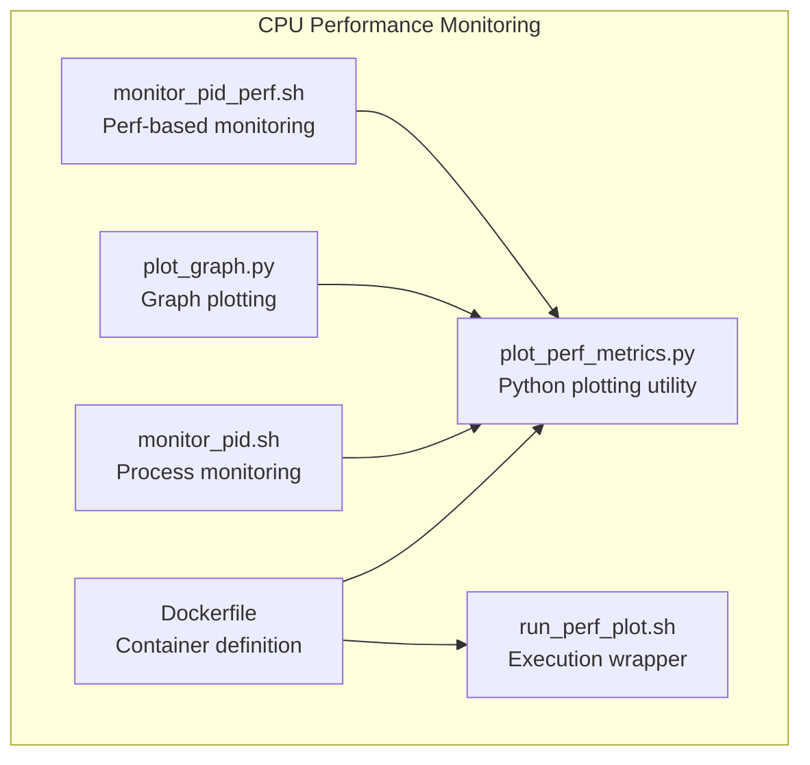
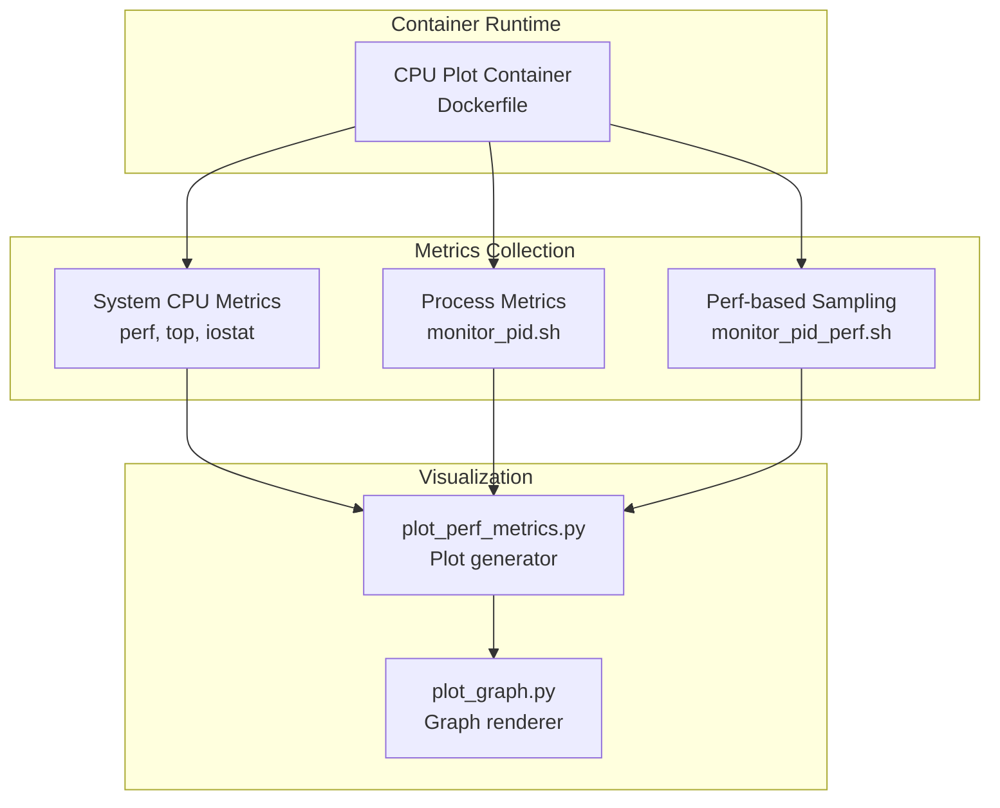
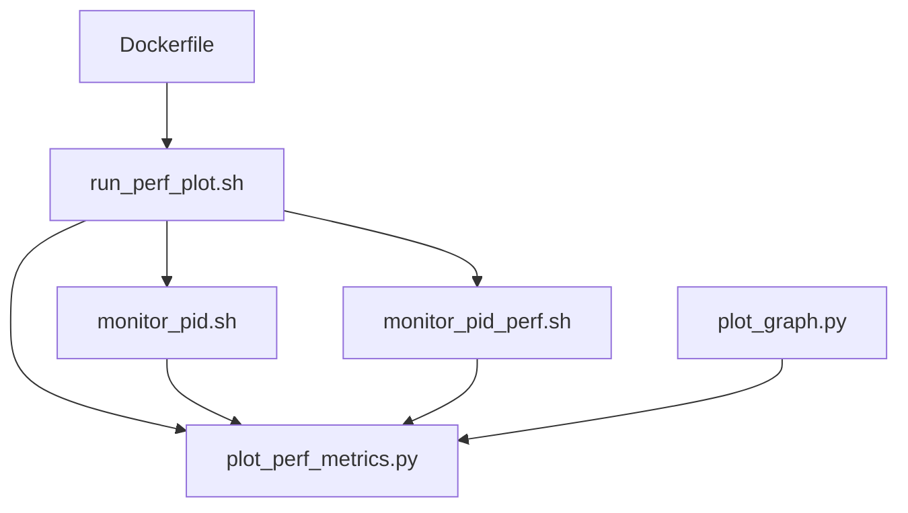

# CPU Performance Monitoring

<cite>
**Referenced Files in This Document**
- [Dockerfile](file://Measure_plot_cpu_perf/Dockerfile)
- [plot_perf_metrics.py](file://Measure_plot_cpu_perf/plot_perf_metrics.py)
- [run_perf_plot.sh](file://Measure_plot_cpu_perf/run_perf_plot.sh)
- [monitor_pid.sh](file://monitor_hpe/monitor_pid.sh)
- [plot_graph.py](file://monitor_hpe/plot_graph.py)
- [monitor_pid_perf.sh](file://recent-dash/perf_monitor/monitor_pid_perf.sh)
</cite>

## Table of Contents
1. [Introduction](#introduction)
2. [Project Structure](#project-structure)
3. [Core Components](#core-components)
4. [Architecture Overview](#architecture-overview)
5. [Detailed Component Analysis](#detailed-component-analysis)
6. [Dependency Analysis](#dependency-analysis)
7. [Performance Considerations](#performance-considerations)
8. [Troubleshooting Guide](#troubleshooting-guide)
9. [Conclusion](#conclusion)

## Introduction
This document explains the CPU performance monitoring capabilities implemented in the repository. It covers the methodology for collecting CPU metrics, including system-level tracking, process monitoring, and utilization analysis. It documents the Docker-based monitoring container architecture and the Python-based plotting utilities. Guidance is provided on interpreting CPU performance graphs, identifying bottlenecks in video processing pipelines, and optimizing CPU resource allocation. Examples of common performance scenarios and their metric interpretations are included to help users diagnose and improve system behavior.

## Project Structure
The CPU performance monitoring solution is composed of:
- A dedicated Docker container for CPU plotting and visualization
- Scripts to collect and plot CPU metrics
- Supporting monitoring utilities for process-level metrics

**Diagram sources**
- [Dockerfile](file://Measure_plot_cpu_perf/Dockerfile)
- [plot_perf_metrics.py](file://Measure_plot_cpu_perf/plot_perf_metrics.py)
- [run_perf_plot.sh](file://Measure_plot_cpu_perf/run_perf_plot.sh)
- [monitor_pid.sh](file://monitor_hpe/monitor_pid.sh)
- [plot_graph.py](file://monitor_hpe/plot_graph.py)
- [monitor_pid_perf.sh](file://recent-dash/perf_monitor/monitor_pid_perf.sh)

**Section sources**
- [Dockerfile](file://Measure_plot_cpu_perf/Dockerfile)
- [plot_perf_metrics.py](file://Measure_plot_cpu_perf/plot_perf_metrics.py)
- [run_perf_plot.sh](file://Measure_plot_cpu_perf/run_perf_plot.sh)
- [monitor_pid.sh](file://monitor_hpe/monitor_pid.sh)
- [plot_graph.py](file://monitor_hpe/plot_graph.py)
- [monitor_pid_perf.sh](file://recent-dash/perf_monitor/monitor_pid_perf.sh)

## Core Components
- Docker-based monitoring container: Provides a controlled environment for CPU metric collection and visualization.
- Python plotting utilities: Parse collected metrics and produce visualizations for analysis.
- Execution scripts: Wrap metric collection and plotting for repeatable runs.
- Process monitoring utilities: Track specific processes for CPU usage and related metrics.

Key responsibilities:
- Containerization ensures consistent environments across systems.
- Metrics collection captures CPU utilization, load averages, and process-specific statistics.
- Plotting utilities transform raw data into interpretable charts for bottleneck identification.

**Section sources**
- [Dockerfile](file://Measure_plot_cpu_perf/Dockerfile)
- [plot_perf_metrics.py](file://Measure_plot_cpu_perf/plot_perf_metrics.py)
- [run_perf_plot.sh](file://Measure_plot_cpu_perf/run_perf_plot.sh)
- [monitor_pid.sh](file://monitor_hpe/monitor_pid.sh)
- [plot_graph.py](file://monitor_hpe/plot_graph.py)
- [monitor_pid_perf.sh](file://recent-dash/perf_monitor/monitor_pid_perf.sh)

## Architecture Overview
The CPU performance monitoring architecture integrates containerized metric collection, process-level sampling, and visualization.

**Diagram sources**
- [Dockerfile](file://Measure_plot_cpu_perf/Dockerfile)
- [plot_perf_metrics.py](file://Measure_plot_cpu_perf/plot_perf_metrics.py)
- [plot_graph.py](file://monitor_hpe/plot_graph.py)
- [monitor_pid.sh](file://monitor_hpe/monitor_pid.sh)
- [monitor_pid_perf.sh](file://recent-dash/perf_monitor/monitor_pid_perf.sh)

## Detailed Component Analysis

### Docker-based Monitoring Container
The container encapsulates the CPU plotting environment, ensuring reproducible metric collection and visualization across diverse host systems.

Implementation highlights:
- Container definition establishes the runtime environment for metrics collection and plotting.
- The container mounts volumes or exposes ports as needed for data exchange with host systems.
- Scripts inside the container orchestrate metric collection and invoke plotting utilities.

Operational flow:
- Build the container image from the provided Dockerfile.
- Run the container with appropriate environment variables and volume mappings.
- Execute the plotting script to generate visualizations from collected metrics.

**Section sources**
- [Dockerfile](file://Measure_plot_cpu_perf/Dockerfile)

### Python-based Plotting Utilities
The plotting utilities transform collected CPU metrics into visual charts for analysis.

Implementation highlights:
- The plotting utility reads structured metric data and generates plots suitable for CPU utilization and process-specific analysis.
- It supports customization of chart types, axes, and legends to highlight trends and anomalies.
- The plotting utility can be integrated with both system-level and process-level metrics.

Usage pattern:
- Invoke the plotting utility after metrics collection completes.
- Provide input data files and configure output destinations.
- Review generated plots to identify utilization spikes, saturation, and process contention.

**Section sources**
- [plot_perf_metrics.py](file://Measure_plot_cpu_perf/plot_perf_metrics.py)
- [plot_graph.py](file://monitor_hpe/plot_graph.py)

### Performance Measurement Scripts
These scripts coordinate CPU metrics collection and visualization.

Implementation highlights:
- The execution wrapper script orchestrates metric collection, waits for completion, and triggers plotting.
- Process monitoring scripts capture per-process CPU usage and related statistics for targeted analysis.
- Perf-based monitoring scripts leverage kernel profiling to gather detailed CPU behavior insights.

Collection methodology:
- System-level metrics: Collect CPU utilization, load averages, and scheduling statistics.
- Process-level metrics: Track specific processes (e.g., video pipeline components) for CPU usage and thread behavior.
- Visualization: Produce charts that reveal temporal patterns, peak loads, and correlations between processes.

**Section sources**
- [run_perf_plot.sh](file://Measure_plot_cpu_perf/run_perf_plot.sh)
- [monitor_pid.sh](file://monitor_hpe/monitor_pid.sh)
- [monitor_pid_perf.sh](file://recent-dash/perf_monitor/monitor_pid_perf.sh)

### CPU Metrics Collection Methodology
System-level performance tracking:
- CPU utilization: Percentage of time the CPU spends on user, system, and idle tasks.
- Load averages: Average number of runnable tasks over 1, 5, and 15 minutes.
- Scheduling statistics: Context switches, interrupts, and scheduler latency.

Process monitoring:
- Per-process CPU usage: Time spent by each process in user and kernel mode.
- Thread-level metrics: Number of threads, blocking events, and wakeups.
- Memory and I/O correlation: CPU-bound vs I/O-bound behavior identification.

Utilization analysis:
- Saturation detection: High CPU utilization with queue growth indicates saturation.
- Contention analysis: Multiple processes competing for CPU resources.
- Affinity and topology awareness: NUMA and CPU frequency scaling effects.

**Section sources**
- [monitor_pid.sh](file://monitor_hpe/monitor_pid.sh)
- [monitor_pid_perf.sh](file://recent-dash/perf_monitor/monitor_pid_perf.sh)

### Interpreting CPU Performance Graphs
Guidance for chart interpretation:
- Steady utilization below threshold: Normal operation; capacity available.
- Gradual upward trend: Slow degradation; plan capacity expansion or optimization.
- Sustained high utilization: Potential saturation; investigate blocking or inefficient algorithms.
- Spikes and bursts: Transient workloads or synchronization points; consider batching or parallelization.
- Multi-process correlation: Shared CPU contention among pipeline stages; rebalance or decouple.

Video processing pipeline bottlenecks:
- Encoder/decoder saturation: High CPU usage during encoding/decoding; consider hardware acceleration or threading adjustments.
- Preprocessing overhead: Excessive CPU in filters or transformations; optimize algorithms or offload to GPU.
- Post-processing delays: Rendering or compositing consuming CPU; reduce complexity or use vectorized operations.

**Section sources**
- [plot_perf_metrics.py](file://Measure_plot_cpu_perf/plot_perf_metrics.py)
- [plot_graph.py](file://monitor_hpe/plot_graph.py)

### Optimizing CPU Resource Allocation
Recommendations:
- Increase CPU limits: Scale up container CPU shares or quotas when utilization is consistently high.
- Parallelize workloads: Distribute CPU-intensive tasks across threads or processes.
- Reduce contention: Separate CPU-heavy stages; introduce buffering to smooth peaks.
- Tune scheduling: Adjust process priorities and CPU affinity for critical pipeline stages.
- Hardware acceleration: Offload compute-intensive tasks to GPU or specialized accelerators.

Common scenarios and interpretations:
- Scenario A: Consistently high user CPU with low system CPU and no queue growth. Interpretation: Efficient user-space computation; potential for further optimization or scaling.
- Scenario B: High system CPU with increased interrupts. Interpretation: Kernel-level activity; investigate device drivers or network stack tuning.
- Scenario C: Elevated wait time with moderate CPU. Interpretation: I/O-bound stage; optimize disk/network or increase throughput.

**Section sources**
- [monitor_pid.sh](file://monitor_hpe/monitor_pid.sh)
- [monitor_pid_perf.sh](file://recent-dash/perf_monitor/monitor_pid_perf.sh)

## Dependency Analysis
The CPU performance monitoring components depend on each other and on external tools for metrics collection and visualization.

**Diagram sources**
- [Dockerfile](file://Measure_plot_cpu_perf/Dockerfile)
- [run_perf_plot.sh](file://Measure_plot_cpu_perf/run_perf_plot.sh)
- [plot_perf_metrics.py](file://Measure_plot_cpu_perf/plot_perf_metrics.py)
- [plot_graph.py](file://monitor_hpe/plot_graph.py)
- [monitor_pid.sh](file://monitor_hpe/monitor_pid.sh)
- [monitor_pid_perf.sh](file://recent-dash/perf_monitor/monitor_pid_perf.sh)

**Section sources**
- [Dockerfile](file://Measure_plot_cpu_perf/Dockerfile)
- [run_perf_plot.sh](file://Measure_plot_cpu_perf/run_perf_plot.sh)
- [plot_perf_metrics.py](file://Measure_plot_cpu_perf/plot_perf_metrics.py)
- [plot_graph.py](file://monitor_hpe/plot_graph.py)
- [monitor_pid.sh](file://monitor_hpe/monitor_pid.sh)
- [monitor_pid_perf.sh](file://recent-dash/perf_monitor/monitor_pid_perf.sh)

## Performance Considerations
- Sampling frequency: Choose appropriate intervals to balance accuracy and overhead.
- Data volume: Limit retained history to prevent excessive storage usage while preserving insight windows.
- Visualization performance: Optimize chart rendering for large datasets; consider downsampling or aggregation.
- Container isolation: Ensure sufficient CPU allocation to avoid confounding measurements with throttling.
- Pipeline granularity: Break down CPU usage by stage to isolate hotspots and guide targeted improvements.

[No sources needed since this section provides general guidance]

## Troubleshooting Guide
Common issues and resolutions:
- No metrics plotted: Verify that the execution script completes successfully and writes output files. Confirm that the plotting utility can read the input data.
- Empty or flat charts: Check that monitoring scripts are capturing data over time and that the container has adequate CPU allocation.
- Misleading utilization: Validate that the metrics reflect the intended workload and that unrelated processes are not skewing results.
- Container throttling: Inspect CPU limits and quotas; adjust container settings to prevent artificial caps on CPU availability.

**Section sources**
- [run_perf_plot.sh](file://Measure_plot_cpu_perf/run_perf_plot.sh)
- [plot_perf_metrics.py](file://Measure_plot_cpu_perf/plot_perf_metrics.py)
- [monitor_pid.sh](file://monitor_hpe/monitor_pid.sh)
- [monitor_pid_perf.sh](file://recent-dash/perf_monitor/monitor_pid_perf.sh)

## Conclusion
The CPU performance monitoring solution provides a robust framework for system-level and process-level CPU analysis. By leveraging Docker-based containers, structured metrics collection, and Python-based plotting utilities, teams can identify bottlenecks, interpret utilization trends, and optimize CPU resource allocation in video processing pipelines. Applying the guidance in this document will enable accurate diagnosis and effective remediation of performance issues.

[No sources needed since this section summarizes without analyzing specific files]