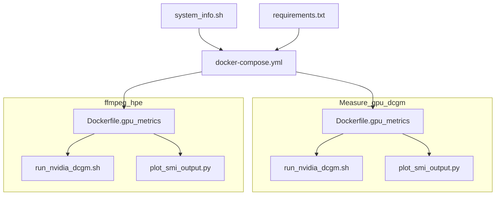
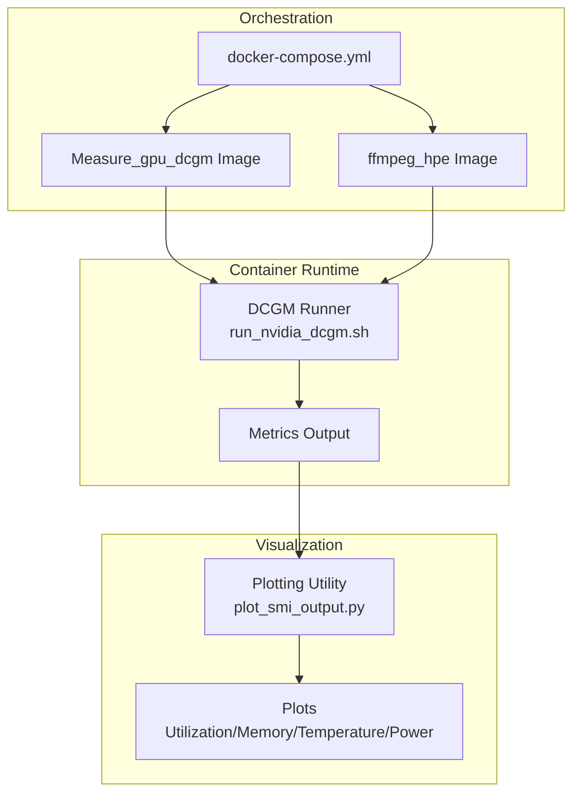
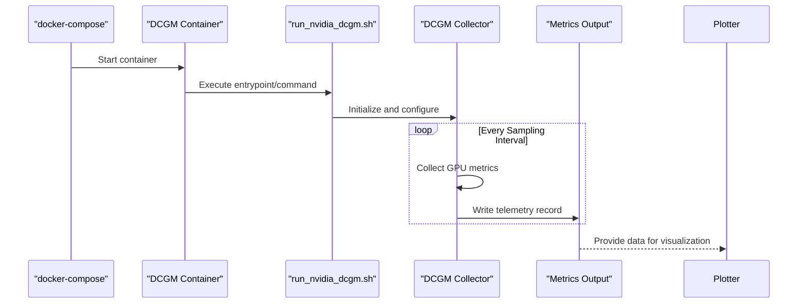
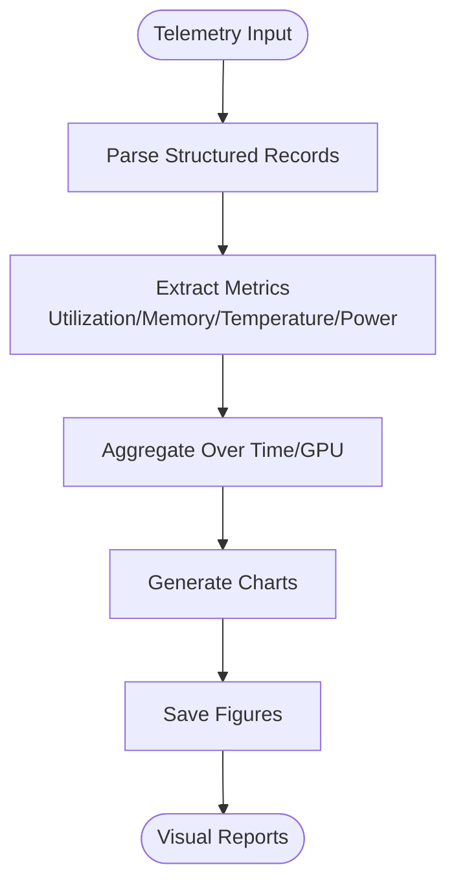
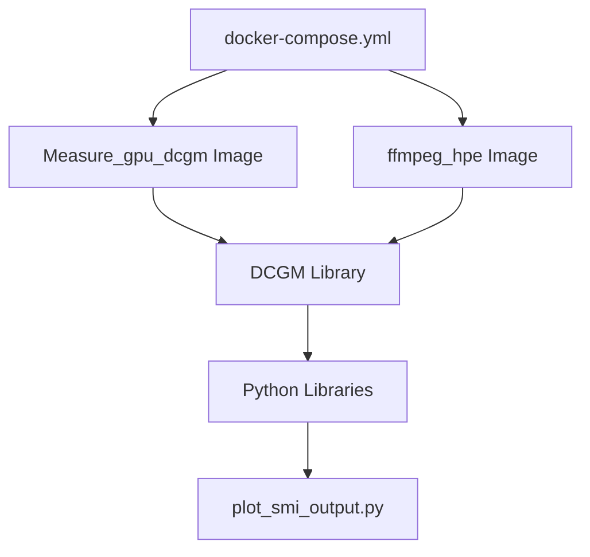

# GPU Metrics Collection

<cite>
**Referenced Files in This Document**
- [Dockerfile.gpu_metrics](file://Measure_gpu_dcgm/Dockerfile.gpu_metrics)
- [run_nvidia_dcgm.sh](file://Measure_gpu_dcgm/run_nvidia_dcgm.sh)
- [plot_smi_output.py](file://Measure_gpu_dcgm/plot_smi_output.py)
- [Dockerfile.gpu_metrics](file://ffmpeg_hpe/Dockerfile.gpu_metrics)
- [run_nvidia_dcgm.sh](file://ffmpeg_hpe/run_nvidia_dcgm.sh)
- [plot_smi_output.py](file://ffmpeg_hpe/plot_smi_output.py)
- [docker-compose.yaml](file://docker-compose.yml)
- [system_info.sh](file://system_info.sh)
- [requirements.txt](file://requirements.txt)
</cite>

## Table of Contents
1. [Introduction](#introduction)
2. [Project Structure](#project-structure)
3. [Core Components](#core-components)
4. [Architecture Overview](#architecture-overview)
5. [Detailed Component Analysis](#detailed-component-analysis)
6. [Dependency Analysis](#dependency-analysis)
7. [Performance Considerations](#performance-considerations)
8. [Troubleshooting Guide](#troubleshooting-guide)
9. [Conclusion](#conclusion)

## Introduction
This document explains how GPU metrics are collected and visualized using NVIDIA DCGM (Data Center GPU Manager) within the repository. It covers the integration architecture, telemetry collection, Docker containerization, and Python plotting utilities for GPU metrics such as utilization, memory usage, temperature, and power consumption. Guidance is included for interpreting performance data, identifying bottlenecks in HPE (Human Pose Estimation) workloads, and optimizing GPU resource allocation. Troubleshooting tips address common monitoring issues.

## Project Structure
The GPU metrics collection capability spans two primary locations:
- Measure_gpu_dcgm: standalone scripts and Dockerfile for DCGM-based GPU metrics
- ffmpeg_hpe: DCGM-enabled container and scripts integrated into the broader HPE pipeline

Key artifacts:
- Dockerfiles for GPU metrics containers
- Shell scripts to run DCGM collectors
- Python plotting utilities for visualizing metrics
- Compose configuration for orchestrating containers
- System information and dependency files

**Diagram sources**
- [Dockerfile.gpu_metrics](file://Measure_gpu_dcgm/Dockerfile.gpu_metrics)
- [run_nvidia_dcgm.sh](file://Measure_gpu_dcgm/run_nvidia_dcgm.sh)
- [plot_smi_output.py](file://Measure_gpu_dcgm/plot_smi_output.py)
- [Dockerfile.gpu_metrics](file://ffmpeg_hpe/Dockerfile.gpu_metrics)
- [run_nvidia_dcgm.sh](file://ffmpeg_hpe/run_nvidia_dcgm.sh)
- [plot_smi_output.py](file://ffmpeg_hpe/plot_smi_output.py)
- [docker-compose.yaml](file://docker-compose.yml)
- [system_info.sh](file://system_info.sh)
- [requirements.txt](file://requirements.txt)

**Section sources**
- [Dockerfile.gpu_metrics](file://Measure_gpu_dcgm/Dockerfile.gpu_metrics)
- [run_nvidia_dcgm.sh](file://Measure_gpu_dcgm/run_nvidia_dcgm.sh)
- [plot_smi_output.py](file://Measure_gpu_dcgm/plot_smi_output.py)
- [Dockerfile.gpu_metrics](file://ffmpeg_hpe/Dockerfile.gpu_metrics)
- [run_nvidia_dcgm.sh](file://ffmpeg_hpe/run_nvidia_dcgm.sh)
- [plot_smi_output.py](file://ffmpeg_hpe/plot_smi_output.py)
- [docker-compose.yaml](file://docker-compose.yml)
- [system_info.sh](file://system_info.sh)
- [requirements.txt](file://requirements.txt)

## Core Components
- DCGM Container Images: Two Dockerfiles define GPU metrics containers—one in Measure_gpu_dcgm and another in ffmpeg_hpe—ensuring DCGM and related dependencies are installed and configured.
- DCGM Telemetry Runner: A shell script invokes the DCGM collector to gather GPU metrics at regular intervals and writes output suitable for visualization.
- Plotting Utilities: Python scripts parse DCGM output and produce plots for GPU utilization, memory usage, temperature, and power consumption.
- Orchestration: A docker-compose configuration ties the metrics container into the broader system, enabling coordinated startup and networking.

**Section sources**
- [Dockerfile.gpu_metrics](file://Measure_gpu_dcgm/Dockerfile.gpu_metrics)
- [run_nvidia_dcgm.sh](file://Measure_gpu_dcgm/run_nvidia_dcgm.sh)
- [plot_smi_output.py](file://Measure_gpu_dcgm/plot_smi_output.py)
- [Dockerfile.gpu_metrics](file://ffmpeg_hpe/Dockerfile.gpu_metrics)
- [run_nvidia_dcgm.sh](file://ffmpeg_hpe/run_nvidia_dcgm.sh)
- [plot_smi_output.py](file://ffmpeg_hpe/plot_smi_output.py)
- [docker-compose.yaml](file://docker-compose.yml)

## Architecture Overview
The GPU metrics collection architecture integrates DCGM with containerized environments and visualization tools. The flow is:
- A containerized DCGM runner periodically collects GPU telemetry.
- Collected data is persisted or streamed for analysis.
- A Python plotting utility reads the telemetry and generates visualizations.
- docker-compose orchestrates the lifecycle and connectivity of the metrics container.

**Diagram sources**
- [run_nvidia_dcgm.sh](file://Measure_gpu_dcgm/run_nvidia_dcgm.sh)
- [plot_smi_output.py](file://Measure_gpu_dcgm/plot_smi_output.py)
- [run_nvidia_dcgm.sh](file://ffmpeg_hpe/run_nvidia_dcgm.sh)
- [plot_smi_output.py](file://ffmpeg_hpe/plot_smi_output.py)
- [docker-compose.yaml](file://docker-compose.yml)

## Detailed Component Analysis

### DCGM Container Setup
- Purpose: Build a container with NVIDIA DCGM and dependencies for GPU metrics collection.
- Key considerations:
  - Base image must support CUDA and NVIDIA drivers.
  - Install DCGM and required Python packages.
  - Configure entrypoint and command to run the DCGM collector.
- Integration points:
  - Used by both Measure_gpu_dcgm and ffmpeg_hpe workflows.
  - docker-compose references these images for orchestration.

**Section sources**
- [Dockerfile.gpu_metrics](file://Measure_gpu_dcgm/Dockerfile.gpu_metrics)
- [Dockerfile.gpu_metrics](file://ffmpeg_hpe/Dockerfile.gpu_metrics)
- [docker-compose.yaml](file://docker-compose.yml)

### DCGM Telemetry Runner
- Purpose: Execute DCGM collection, schedule periodic sampling, and emit structured output for plotting.
- Typical behavior:
  - Initialize DCGM connection to the host or container GPU.
  - Sample metrics at configurable intervals.
  - Persist or forward metrics for downstream visualization.
- Output format:
  - Structured telemetry suitable for parsing by the plotting utility.

**Diagram sources**
- [run_nvidia_dcgm.sh](file://Measure_gpu_dcgm/run_nvidia_dcgm.sh)
- [run_nvidia_dcgm.sh](file://ffmpeg_hpe/run_nvidia_dcgm.sh)
- [docker-compose.yaml](file://docker-compose.yml)

**Section sources**
- [run_nvidia_dcgm.sh](file://Measure_gpu_dcgm/run_nvidia_dcgm.sh)
- [run_nvidia_dcgm.sh](file://ffmpeg_hpe/run_nvidia_dcgm.sh)

### Python Plotting Utilities
- Purpose: Parse DCGM telemetry and generate plots for:
  - GPU utilization rates
  - Memory usage
  - Temperature
  - Power consumption
- Typical behavior:
  - Read structured telemetry records.
  - Aggregate per-GPU or aggregated metrics.
  - Render charts with appropriate axes and labels.
- Integration:
  - Consumes output produced by the DCGM runner.
  - Supports saving figures for later inspection or dashboards.

**Diagram sources**
- [plot_smi_output.py](file://Measure_gpu_dcgm/plot_smi_output.py)
- [plot_smi_output.py](file://ffmpeg_hpe/plot_smi_output.py)

**Section sources**
- [plot_smi_output.py](file://Measure_gpu_dcgm/plot_smi_output.py)
- [plot_smi_output.py](file://ffmpeg_hpe/plot_smi_output.py)

### Orchestration with docker-compose
- Purpose: Define and start the GPU metrics container alongside other services.
- Key aspects:
  - Services referencing the DCGM-enabled images.
  - Volume mounts for telemetry persistence.
  - Environment variables for DCGM configuration and scheduling.
  - Networking to enable data export or centralized logging.

**Section sources**
- [docker-compose.yaml](file://docker-compose.yml)

## Dependency Analysis
- Container images depend on:
  - NVIDIA drivers and CUDA runtime compatibility.
  - DCGM installation and configuration.
  - Python runtime and plotting libraries.
- Scripts depend on:
  - Properly formatted telemetry output from the DCGM runner.
  - Access to GPU devices and permissions within the container.
- Orchestration depends on:
  - Correct service definitions and environment variable propagation.
  - Volume and network configurations for data exchange.

**Diagram sources**
- [Dockerfile.gpu_metrics](file://Measure_gpu_dcgm/Dockerfile.gpu_metrics)
- [Dockerfile.gpu_metrics](file://ffmpeg_hpe/Dockerfile.gpu_metrics)
- [plot_smi_output.py](file://Measure_gpu_dcgm/plot_smi_output.py)
- [plot_smi_output.py](file://ffmpeg_hpe/plot_smi_output.py)
- [docker-compose.yaml](file://docker-compose.yml)

**Section sources**
- [Dockerfile.gpu_metrics](file://Measure_gpu_dcgm/Dockerfile.gpu_metrics)
- [Dockerfile.gpu_metrics](file://ffmpeg_hpe/Dockerfile.gpu_metrics)
- [plot_smi_output.py](file://Measure_gpu_dcgm/plot_smi_output.py)
- [plot_smi_output.py](file://ffmpeg_hpe/plot_smi_output.py)
- [docker-compose.yaml](file://docker-compose.yml)

## Performance Considerations
- Sampling frequency: Lower intervals increase resolution but may add overhead; tune based on workload demands.
- Metric granularity: Choose relevant metrics (utilization, memory, temperature, power) to avoid unnecessary I/O.
- Container isolation: Ensure GPU device access and driver compatibility to prevent collection stalls.
- Visualization cost: Batch plotting or streaming updates to reduce CPU overhead during heavy inference workloads.
- Resource contention: Monitor GPU temperature and power to preempt throttling in HPE pipelines.

## Troubleshooting Guide
Common issues and resolutions:
- Driver and CUDA mismatch:
  - Verify host NVIDIA driver and CUDA versions align with the container base image.
  - Confirm the container has access to the correct device nodes.
- DCGM initialization failures:
  - Check DCGM installation inside the container and required environment variables.
  - Validate that the container runs with sufficient privileges for GPU access.
- No metrics output:
  - Confirm the DCGM runner is invoked and writing to the expected output location.
  - Ensure the plotting utility can read the telemetry file and that paths are correct.
- docker-compose startup problems:
  - Review service definitions, volume mounts, and environment variables.
  - Check logs for permission errors or missing dependencies.

**Section sources**
- [system_info.sh](file://system_info.sh)
- [requirements.txt](file://requirements.txt)
- [docker-compose.yaml](file://docker-compose.yml)

## Conclusion
The repository provides a robust, containerized framework for collecting and visualizing GPU metrics via NVIDIA DCGM. By combining DCGM-enabled containers, scheduled telemetry collection, and Python-based plotting, teams can monitor GPU utilization, memory, temperature, and power consumption. Proper container configuration, alignment of driver/CUDA versions, and careful orchestration are essential for reliable operation. Use the generated plots to identify bottlenecks in HPE workloads and guide GPU resource allocation decisions.