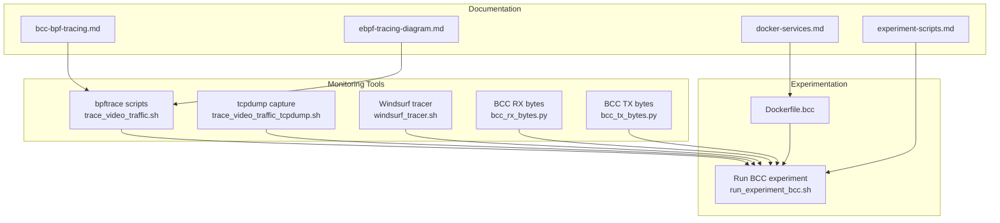
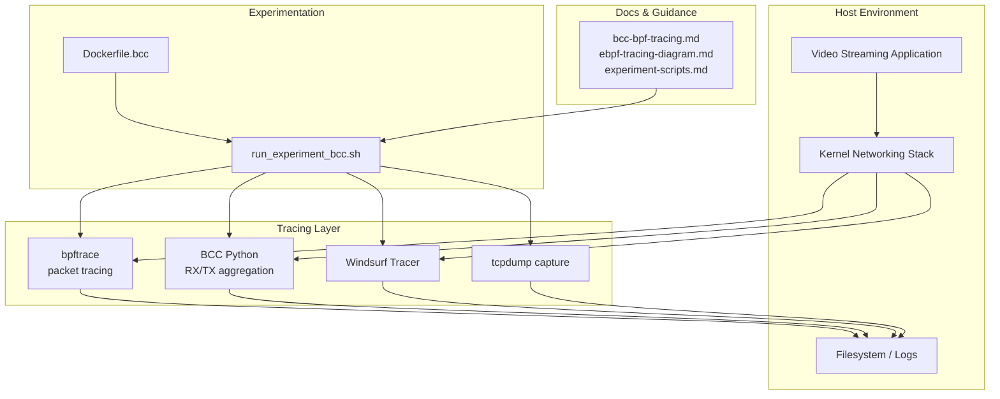
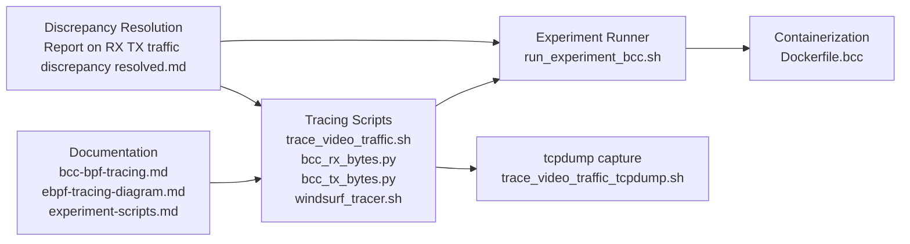

# Network Traffic Analysis

<cite>
**Referenced Files in This Document**
- [bcc-bpf-tracing.md](file://docs/bcc-bpf-tracing.md)
- [ebpf-tracing-diagram.md](file://docs/ebpf-tracing-diagram.md)
- [experiment-scripts.md](file://docs/experiment-scripts.md)
- [docker-services.md](file://docs/docker-services.md)
- [Dockerfile.bcc](file://ffmpeg_hpe/bpftrace-tracer/Dockerfile.bcc)
- [bcc_rx_bytes.py](file://ffmpeg_hpe/bpftrace-tracer/bcc_rx_bytes.py)
- [bcc_tx_bytes.py](file://ffmpeg_hpe/bpftrace-tracer/bcc_tx_bytes.py)
- [trace_video_traffic.sh](file://ffmpeg_hpe/bpftrace-tracer/trace_video_traffic.sh)
- [trace_video_traffic_tcpdump.sh](file://ffmpeg_hpe/bpftrace-tracer/trace_video_traffic_tcpdump.sh)
- [windsurf_tracer.sh](file://ffmpeg_hpe/bpftrace-tracer/windsurf_tracer.sh)
- [run_experiment_bcc.sh](file://ffmpeg_hpe/run_experiment_bcc.sh)
- [Report on RX TX traffic discrepancy resolved.md](file://Report on RX TX traffic discrepancy resolved.md)
</cite>

## Table of Contents
1. [Introduction](#introduction)
2. [Project Structure](#project-structure)
3. [Core Components](#core-components)
4. [Architecture Overview](#architecture-overview)
5. [Detailed Component Analysis](#detailed-component-analysis)
6. [Dependency Analysis](#dependency-analysis)
7. [Performance Considerations](#performance-considerations)
8. [Troubleshooting Guide](#troubleshooting-guide)
9. [Conclusion](#conclusion)

## Introduction
This document explains the network traffic analysis and monitoring capabilities in the HPE pipeline, focusing on:
- bpftrace-based packet tracing for capturing video streaming traffic
- RX/TX byte counting and bandwidth analysis
- BCC (BPF Compiler Collection) integration for kernel-level monitoring
- Windsurf tracer for specialized traffic analysis
- Traffic discrepancy resolution and validation methods
- Guidance on interpreting metrics, identifying bottlenecks, optimizing streaming performance, and troubleshooting network issues

## Project Structure
The network monitoring stack is primarily located under the ffmpeg_hpe/bpftrace-tracer module and documented in the docs directory. Key elements include:
- Tracing scripts for bpftrace and tcpdump capture
- BCC Python scripts for RX/TX byte aggregation
- Experiment orchestration script for BCC-based measurements
- Documentation covering eBPF tracing, Docker services, and experimental procedures

**Diagram sources**
- [trace_video_traffic.sh](file://ffmpeg_hpe/bpftrace-tracer/trace_video_traffic.sh)
- [trace_video_traffic_tcpdump.sh](file://ffmpeg_hpe/bpftrace-tracer/trace_video_traffic_tcpdump.sh)
- [windsurf_tracer.sh](file://ffmpeg_hpe/bpftrace-tracer/windsurf_tracer.sh)
- [bcc_rx_bytes.py](file://ffmpeg_hpe/bpftrace-tracer/bcc_rx_bytes.py)
- [bcc_tx_bytes.py](file://ffmpeg_hpe/bpftrace-tracer/bcc_tx_bytes.py)
- [run_experiment_bcc.sh](file://ffmpeg_hpe/run_experiment_bcc.sh)
- [Dockerfile.bcc](file://ffmpeg_hpe/bpftrace-tracer/Dockerfile.bcc)
- [bcc-bpf-tracing.md](file://docs/bcc-bpf-tracing.md)
- [ebpf-tracing-diagram.md](file://docs/ebpf-tracing-diagram.md)
- [experiment-scripts.md](file://docs/experiment-scripts.md)
- [docker-services.md](file://docs/docker-services.md)

**Section sources**
- [bcc-bpf-tracing.md](file://docs/bcc-bpf-tracing.md)
- [ebpf-tracing-diagram.md](file://docs/ebpf-tracing-diagram.md)
- [experiment-scripts.md](file://docs/experiment-scripts.md)
- [docker-services.md](file://docs/docker-services.md)
- [Dockerfile.bcc](file://ffmpeg_hpe/bpftrace-tracer/Dockerfile.bcc)
- [bcc_rx_bytes.py](file://ffmpeg_hpe/bpftrace-tracer/bcc_rx_bytes.py)
- [bcc_tx_bytes.py](file://ffmpeg_hpe/bpftrace-tracer/bcc_tx_bytes.py)
- [trace_video_traffic.sh](file://ffmpeg_hpe/bpftrace-tracer/trace_video_traffic.sh)
- [trace_video_traffic_tcpdump.sh](file://ffmpeg_hpe/bpftrace-tracer/trace_video_traffic_tcpdump.sh)
- [windsurf_tracer.sh](file://ffmpeg_hpe/bpftrace-tracer/windsurf_tracer.sh)
- [run_experiment_bcc.sh](file://ffmpeg_hpe/run_experiment_bcc.sh)

## Core Components
- bpftrace packet tracing: Captures per-flow packet and byte counts during video streaming sessions using bpftrace scripts.
- BCC RX/TX byte counters: Uses BCC Python programs to aggregate received and transmitted bytes at kernel level for precise bandwidth accounting.
- Windsurf tracer: Specialized traffic analyzer for advanced inspection and correlation of streaming flows.
- tcpdump capture: Complementary packet capture for offline analysis and cross-validation of bpftrace results.
- Experiment orchestration: Automated execution of BCC-based measurements integrated with the broader HPE pipeline.

Key capabilities:
- Real-time RX/TX byte aggregation
- Bandwidth analysis and bottleneck identification
- Traffic discrepancy detection and reconciliation
- Validation via tcpdump and cross-source alignment

**Section sources**
- [bcc_rx_bytes.py](file://ffmpeg_hpe/bpftrace-tracer/bcc_rx_bytes.py)
- [bcc_tx_bytes.py](file://ffmpeg_hpe/bpftrace-tracer/bcc_tx_bytes.py)
- [trace_video_traffic.sh](file://ffmpeg_hpe/bpftrace-tracer/trace_video_traffic.sh)
- [trace_video_traffic_tcpdump.sh](file://ffmpeg_hpe/bpftrace-tracer/trace_video_traffic_tcpdump.sh)
- [windsurf_tracer.sh](file://ffmpeg_hpe/bpftrace-tracer/windsurf_tracer.sh)
- [run_experiment_bcc.sh](file://ffmpeg_hpe/run_experiment_bcc.sh)

## Architecture Overview
The network monitoring architecture integrates user-space and kernel-space components to provide accurate, low-overhead visibility into video streaming traffic.

**Diagram sources**
- [run_experiment_bcc.sh](file://ffmpeg_hpe/run_experiment_bcc.sh)
- [Dockerfile.bcc](file://ffmpeg_hpe/bpftrace-tracer/Dockerfile.bcc)
- [bcc-bpf-tracing.md](file://docs/bcc-bpf-tracing.md)
- [ebpf-tracing-diagram.md](file://docs/ebpf-tracing-diagram.md)
- [experiment-scripts.md](file://docs/experiment-scripts.md)
- [trace_video_traffic.sh](file://ffmpeg_hpe/bpftrace-tracer/trace_video_traffic.sh)
- [bcc_rx_bytes.py](file://ffmpeg_hpe/bpftrace-tracer/bcc_rx_bytes.py)
- [bcc_tx_bytes.py](file://ffmpeg_hpe/bpftrace-tracer/bcc_tx_bytes.py)
- [windsurf_tracer.sh](file://ffmpeg_hpe/bpftrace-tracer/windsurf_tracer.sh)
- [trace_video_traffic_tcpdump.sh](file://ffmpeg_hpe/bpftrace-tracer/trace_video_traffic_tcpdump.sh)

## Detailed Component Analysis

### bpftrace Packet Tracing
Purpose:
- Capture per-flow packet and byte counts during video streaming sessions
- Provide real-time visibility into network utilization for RX/TX streams

Key behaviors:
- Filters traffic relevant to video streaming sessions
- Aggregates packet counts and bytes per flow
- Outputs structured logs for downstream analysis

Validation:
- Cross-validate with tcpdump captures for packet-level accuracy
- Align timestamps and flow identifiers across tools

**Section sources**
- [trace_video_traffic.sh](file://ffmpeg_hpe/bpftrace-tracer/trace_video_traffic.sh)
- [trace_video_traffic_tcpdump.sh](file://ffmpeg_hpe/bpftrace-tracer/trace_video_traffic_tcpdump.sh)

### BCC RX/TX Byte Counters
Purpose:
- Kernel-level RX/TX byte aggregation for precise bandwidth accounting
- Low overhead measurement suitable for continuous monitoring

Implementation highlights:
- BCC Python scripts attach to kernel probes/events
- Aggregate bytes per network interface or per flow
- Export metrics for analysis and visualization

Integration:
- Orchestrated by the BCC experiment runner
- Used alongside bpftrace and tcpdump for comprehensive coverage

**Section sources**
- [bcc_rx_bytes.py](file://ffmpeg_hpe/bpftrace-tracer/bcc_rx_bytes.py)
- [bcc_tx_bytes.py](file://ffmpeg_hpe/bpftrace-tracer/bcc_tx_bytes.py)
- [run_experiment_bcc.sh](file://ffmpeg_hpe/run_experiment_bcc.sh)

### Windsurf Tracer
Purpose:
- Specialized traffic analysis for advanced correlation and inspection
- Complements bpftrace and BCC with deeper flow insights

Usage:
- Run independently or as part of the experiment suite
- Focus on specific traffic patterns and anomalies in streaming workloads

**Section sources**
- [windsurf_tracer.sh](file://ffmpeg_hpe/bpftrace-tracer/windsurf_tracer.sh)

### Experiment Orchestration (BCC)
Purpose:
- Automate end-to-end execution of BCC-based measurements
- Coordinate timing, logging, and artifact generation

Key aspects:
- Invokes BCC RX/TX scripts
- Manages containerization and environment setup
- Produces standardized logs for analysis

**Section sources**
- [run_experiment_bcc.sh](file://ffmpeg_hpe/run_experiment_bcc.sh)
- [Dockerfile.bcc](file://ffmpeg_hpe/bpftrace-tracer/Dockerfile.bcc)

### Traffic Discrepancy Resolution
Process overview:
- Compare RX/TX byte totals from bpftrace and BCC
- Validate against tcpdump captures for packet-level alignment
- Identify discrepancies in flow selection, timestamp drift, or aggregation windows
- Apply corrections and re-run analyses to reconcile differences
- Document resolution steps and validated assumptions

Validation methods:
- Timestamp synchronization across tools
- Flow key alignment (IP, port, protocol)
- Windowed aggregation comparisons
- Cross-correlation plots and logs

**Section sources**
- [Report on RX TX traffic discrepancy resolved.md](file://Report on RX TX traffic discrepancy resolved.md)

## Dependency Analysis
The monitoring stack exhibits layered dependencies between scripts, documentation, and orchestration:

**Diagram sources**
- [bcc-bpf-tracing.md](file://docs/bcc-bpf-tracing.md)
- [ebpf-tracing-diagram.md](file://docs/ebpf-tracing-diagram.md)
- [experiment-scripts.md](file://docs/experiment-scripts.md)
- [trace_video_traffic.sh](file://ffmpeg_hpe/bpftrace-tracer/trace_video_traffic.sh)
- [bcc_rx_bytes.py](file://ffmpeg_hpe/bpftrace-tracer/bcc_rx_bytes.py)
- [bcc_tx_bytes.py](file://ffmpeg_hpe/bpftrace-tracer/bcc_tx_bytes.py)
- [windsurf_tracer.sh](file://ffmpeg_hpe/bpftrace-tracer/windsurf_tracer.sh)
- [run_experiment_bcc.sh](file://ffmpeg_hpe/run_experiment_bcc.sh)
- [Dockerfile.bcc](file://ffmpeg_hpe/bpftrace-tracer/Dockerfile.bcc)
- [trace_video_traffic_tcpdump.sh](file://ffmpeg_hpe/bpftrace-tracer/trace_video_traffic_tcpdump.sh)
- [Report on RX TX traffic discrepancy resolved.md](file://Report on RX TX traffic discrepancy resolved.md)

**Section sources**
- [bcc-bpf-tracing.md](file://docs/bcc-bpf-tracing.md)
- [ebpf-tracing-diagram.md](file://docs/ebpf-tracing-diagram.md)
- [experiment-scripts.md](file://docs/experiment-scripts.md)
- [Dockerfile.bcc](file://ffmpeg_hpe/bpftrace-tracer/Dockerfile.bcc)
- [run_experiment_bcc.sh](file://ffmpeg_hpe/run_experiment_bcc.sh)
- [trace_video_traffic.sh](file://ffmpeg_hpe/bpftrace-tracer/trace_video_traffic.sh)
- [bcc_rx_bytes.py](file://ffmpeg_hpe/bpftrace-tracer/bcc_rx_bytes.py)
- [bcc_tx_bytes.py](file://ffmpeg_hpe/bpftrace-tracer/bcc_tx_bytes.py)
- [windsurf_tracer.sh](file://ffmpeg_hpe/bpftrace-tracer/windsurf_tracer.sh)
- [trace_video_traffic_tcpdump.sh](file://ffmpeg_hpe/bpftrace-tracer/trace_video_traffic_tcpdump.sh)
- [Report on RX TX traffic discrepancy resolved.md](file://Report on RX TX traffic discrepancy resolved.md)

## Performance Considerations
- Minimize overhead: Prefer BCC for kernel-level aggregation; use bpftrace for targeted packet inspection
- Synchronize windows: Align aggregation intervals across tools to reduce discrepancies
- Reduce noise: Filter traffic to video streaming flows only
- Containerization: Use Dockerfile.bcc to ensure consistent environments for experiments
- Continuous monitoring: Integrate RX/TX counters into long-running experiments for trend analysis

[No sources needed since this section provides general guidance]

## Troubleshooting Guide
Common issues and resolutions:
- Discrepancies between RX/TX totals:
  - Verify flow keys and timestamps across tools
  - Re-run with tcpdump for packet-level validation
  - Adjust aggregation windows and filters
- Tool availability:
  - Ensure bpftrace, BCC, and tcpdump are installed and accessible
  - Confirm Docker runtime for containerized experiments
- Logging and artifacts:
  - Check experiment runner logs and generated traces
  - Validate filesystem permissions for log output

Validation references:
- Use the discrepancy report to guide corrective actions and confirm resolution

**Section sources**
- [Report on RX TX traffic discrepancy resolved.md](file://Report on RX TX traffic discrepancy resolved.md)
- [run_experiment_bcc.sh](file://ffmpeg_hpe/run_experiment_bcc.sh)
- [Dockerfile.bcc](file://ffmpeg_hpe/bpftrace-tracer/Dockerfile.bcc)

## Conclusion
The HPE pipeline provides a robust, multi-layered network traffic analysis toolkit combining bpftrace, BCC, and specialized tracers. By leveraging RX/TX byte aggregation, packet-level validation via tcpdump, and automated experiment orchestration, teams can accurately measure bandwidth, identify bottlenecks, resolve discrepancies, and optimize streaming performance. The included documentation and scripts enable reproducible workflows and reliable troubleshooting across diverse networking environments.