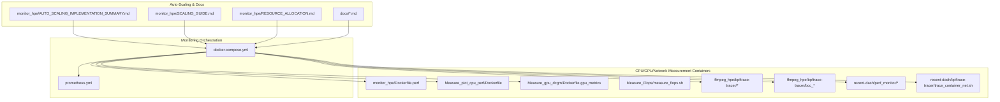
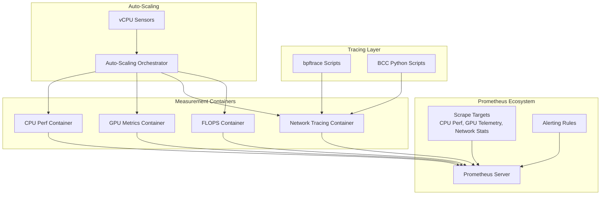
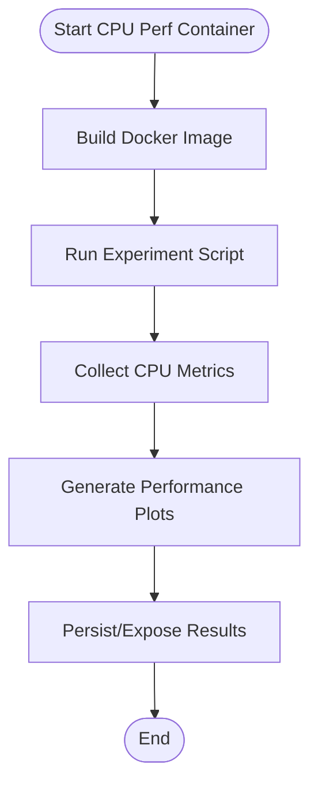
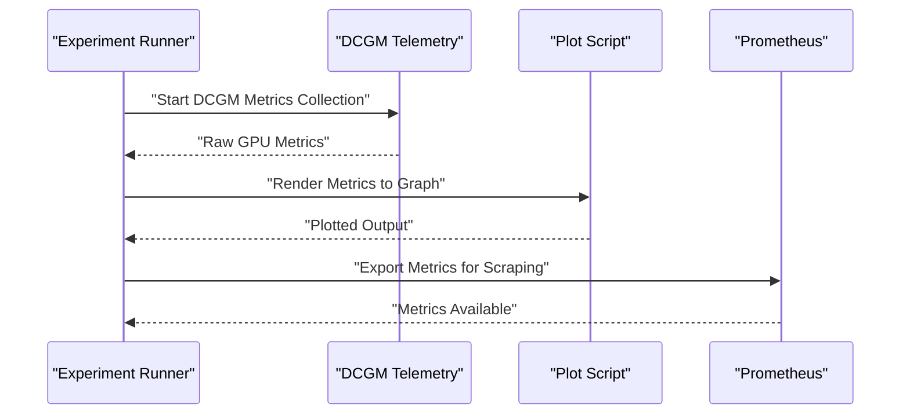
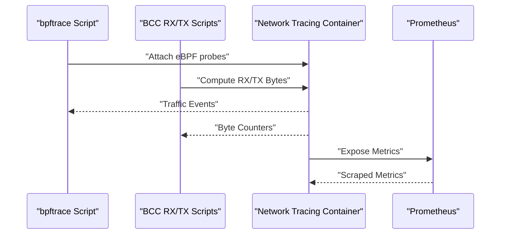
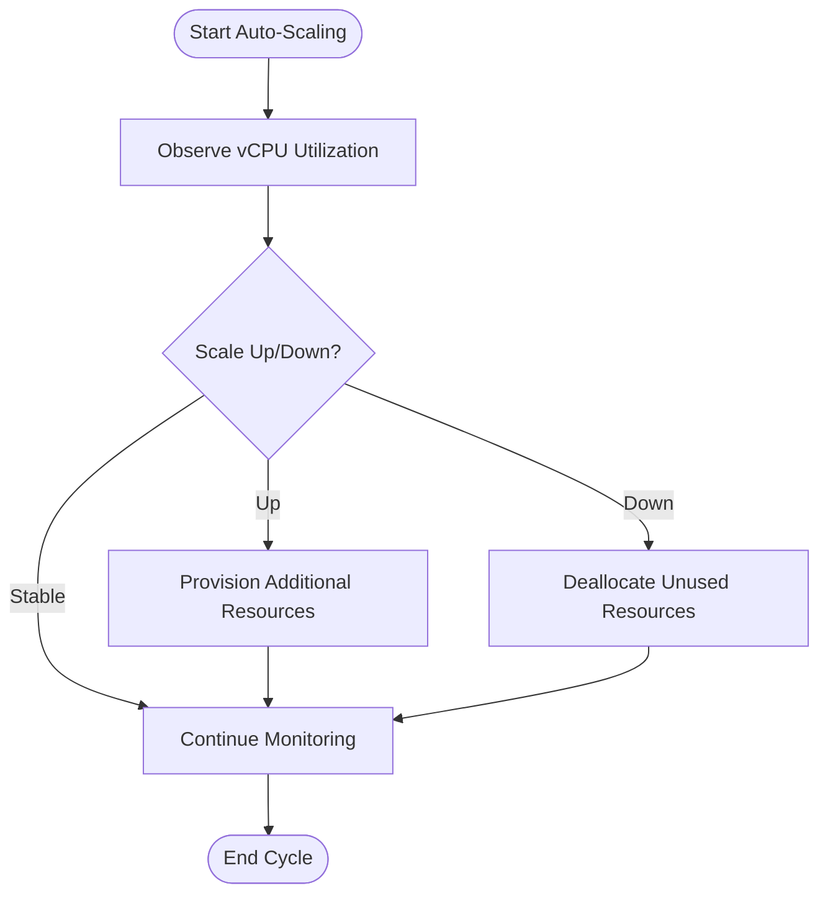
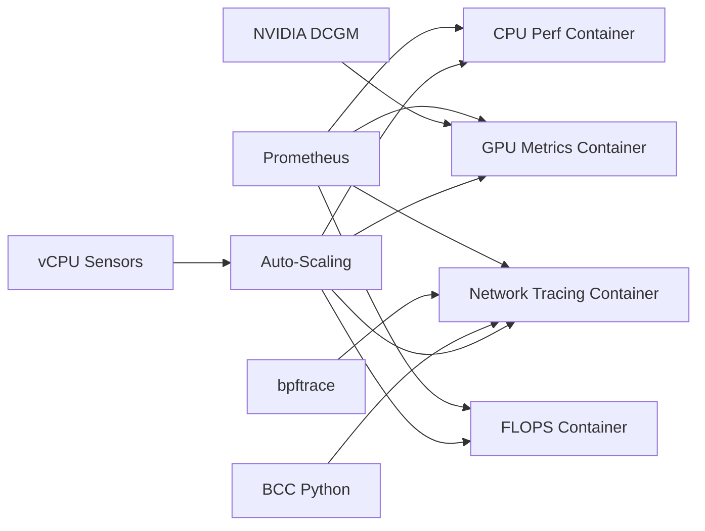

# Performance Monitoring

<cite>
**Referenced Files in This Document**
- [README.md](file://README.md)
- [Dockerfile.hpe](file://Dockerfile.hpe)
- [docker-compose.yml](file://docker-compose.yml)
- [prometheus.yml](file://prometheus.yml)
- [monitor.py](file://monitor.py)
- [pose_monitor.py](file://pose_monitor.py)
- [monitor_hpe/docker-compose.yaml](file://monitor_hpe/docker-compose.yaml)
- [monitor_hpe/AUTO_SCALING_IMPLEMENTATION_SUMMARY.md](file://monitor_hpe/AUTO_SCALING_IMPLEMENTATION_SUMMARY.md)
- [monitor_hpe/SCALING_GUIDE.md](file://monitor_hpe/SCALING_GUIDE.md)
- [monitor_hpe/RESOURCE_ALLOCATION.md](file://monitor_hpe/RESOURCE_ALLOCATION.md)
- [monitor_hpe/Dockerfile](file://monitor_hpe/Dockerfile)
- [monitor_hpe/Dockerfile.perf](file://monitor_hpe/Dockerfile.perf)
- [monitor_hpe/run_experiment.sh](file://monitor_hpe/run_experiment.sh)
- [monitor_hpe/run_with_video.sh](file://monitor_hpe/run_with_video.sh)
- [recent-dash/docker-compose.yml](file://recent-dash/docker-compose.yml)
- [recent-dash/prometheus.yml](file://recent-dash/prometheus.yml)
- [recent-dash/bpftrace-tracer/trace_container_net.sh](file://recent-dash/bpftrace-tracer/trace_container_net.sh)
- [recent-dash/perf_monitor/monitor_pid_perf.sh](file://recent-dash/perf_monitor/monitor_pid_perf.sh)
- [ffmpeg_hpe/bpftrace-tracer/entrypoint.sh](file://ffmpeg_hpe/bpftrace-tracer/entrypoint.sh)
- [ffmpeg_hpe/bpftrace-tracer/trace_video_traffic.sh](file://ffmpeg_hpe/bpftrace-tracer/trace_video_traffic.sh)
- [ffmpeg_hpe/bpftrace-tracer/bcc_rx_bytes.py](file://ffmpeg_hpe/bpftrace-tracer/bcc_rx_bytes.py)
- [ffmpeg_hpe/bpftrace-tracer/bcc_tx_bytes.py](file://ffmpeg_hpe/bpftrace-tracer/bcc_tx_bytes.py)
- [ffmpeg_hpe/run_nvidia_dcgm.sh](file://ffmpeg_hpe/run_nvidia_dcgm.sh)
- [Measure_gpu_dcgm/Dockerfile.gpu_metrics](file://Measure_gpu_dcgm/Dockerfile.gpu_metrics)
- [Measure_gpu_dcgm/plot_smi_output.py](file://Measure_gpu_dcgm/plot_smi_output.py)
- [Measure_plot_cpu_perf/Dockerfile](file://Measure_plot_cpu_perf/Dockerfile)
- [Measure_plot_cpu_perf/plot_perf_metrics.py](file://Measure_plot_cpu_perf/plot_perf_metrics.py)
- [Measure_plot_cpu_perf/run_perf_plot.sh](file://Measure_plot_cpu_perf/run_perf_plot.sh)
- [Measure_Flops/measure_flops.sh](file://Measure_Flops/measure_flops.sh)
- [dev_tools/app.py](file://dev_tools/app.py)
- [dev_tools/smoke_test.sh](file://dev_tools/smoke_test.sh)
- [docs/bcc-bpf-tracing.md](file://docs/bcc-bpf-tracing.md)
- [docs/docker-services.md](file://docs/docker-services.md)
- [docs/project-architecture-diagram.md](file://docs/project-architecture-diagram.md)
- [docs/ebpf-tracing-diagram.md](file://docs/ebpf-tracing-diagram.md)
- [docs/plotting-analysis.md](file://docs/plotting-analysis.md)
- [docs/experiment-scripts.md](file://docs/experiment-scripts.md)
</cite>

## Table of Contents
1. [Introduction](#introduction)
2. [Project Structure](#project-structure)
3. [Core Components](#core-components)
4. [Architecture Overview](#architecture-overview)
5. [Detailed Component Analysis](#detailed-component-analysis)
6. [Dependency Analysis](#dependency-analysis)
7. [Performance Considerations](#performance-considerations)
8. [Troubleshooting Guide](#troubleshooting-guide)
9. [Conclusion](#conclusion)
10. [Appendices](#appendices)

## Introduction
This document describes a comprehensive performance monitoring system designed to track CPU/GPU utilization, network traffic, and enable dynamic auto-scaling. The system integrates Prometheus for metrics collection, bpftrace/BCC for kernel-level network tracing, NVIDIA DCGM for GPU telemetry, and dedicated containers for specialized measurements. It also provides guidance for interpreting results, identifying bottlenecks, and optimizing configurations.

## Project Structure
The repository organizes monitoring capabilities across several modules:
- Central orchestration via Docker Compose and Prometheus configuration
- Dedicated containers for CPU performance plotting, GPU telemetry, and FLOPS measurement
- Network tracing using bpftrace and BCC scripts
- Auto-scaling and resource allocation documentation and scripts
- Developer tools and experiment scripts

**Diagram sources**
- [docker-compose.yml](file://docker-compose.yml)
- [prometheus.yml](file://prometheus.yml)
- [monitor_hpe/Dockerfile.perf](file://monitor_hpe/Dockerfile.perf)
- [Measure_plot_cpu_perf/Dockerfile](file://Measure_plot_cpu_perf/Dockerfile)
- [Measure_gpu_dcgm/Dockerfile.gpu_metrics](file://Measure_gpu_dcgm/Dockerfile.gpu_metrics)
- [Measure_Flops/measure_flops.sh](file://Measure_Flops/measure_flops.sh)
- [ffmpeg_hpe/bpftrace-tracer/entrypoint.sh](file://ffmpeg_hpe/bpftrace-tracer/entrypoint.sh)
- [ffmpeg_hpe/bpftrace-tracer/trace_video_traffic.sh](file://ffmpeg_hpe/bpftrace-tracer/trace_video_traffic.sh)
- [ffmpeg_hpe/bpftrace-tracer/bcc_rx_bytes.py](file://ffmpeg_hpe/bpftrace-tracer/bcc_rx_bytes.py)
- [ffmpeg_hpe/bpftrace-tracer/bcc_tx_bytes.py](file://ffmpeg_hpe/bpftrace-tracer/bcc_tx_bytes.py)
- [recent-dash/perf_monitor/monitor_pid_perf.sh](file://recent-dash/perf_monitor/monitor_pid_perf.sh)
- [recent-dash/bpftrace-tracer/trace_container_net.sh](file://recent-dash/bpftrace-tracer/trace_container_net.sh)
- [monitor_hpe/AUTO_SCALING_IMPLEMENTATION_SUMMARY.md](file://monitor_hpe/AUTO_SCALING_IMPLEMENTATION_SUMMARY.md)
- [monitor_hpe/SCALING_GUIDE.md](file://monitor_hpe/SCALING_GUIDE.md)
- [monitor_hpe/RESOURCE_ALLOCATION.md](file://monitor_hpe/RESOURCE_ALLOCATION.md)
- [docs/bcc-bpf-tracing.md](file://docs/bcc-bpf-tracing.md)
- [docs/docker-services.md](file://docs/docker-services.md)

**Section sources**
- [README.md](file://README.md)
- [docker-compose.yml](file://docker-compose.yml)
- [prometheus.yml](file://prometheus.yml)

## Core Components
- Prometheus metrics server configured for scraping targets defined in the repository’s compose and documentation files.
- CPU performance plotting container for collecting and visualizing CPU metrics.
- GPU telemetry container leveraging NVIDIA DCGM for GPU health and performance insights.
- Network tracing stack using bpftrace and BCC Python scripts to capture RX/TX bytes and analyze video traffic.
- Auto-scaling implementation documentation and scripts enabling dynamic resource allocation based on available vCPUs.
- Standalone measurement tools for FLOPS calculation and CPU performance analysis.

**Section sources**
- [monitor_hpe/docker-compose.yaml](file://monitor_hpe/docker-compose.yaml)
- [monitor_hpe/Dockerfile](file://monitor_hpe/Dockerfile)
- [monitor_hpe/Dockerfile.perf](file://monitor_hpe/Dockerfile.perf)
- [Measure_gpu_dcgm/Dockerfile.gpu_metrics](file://Measure_gpu_dcgm/Dockerfile.gpu_metrics)
- [Measure_plot_cpu_perf/Dockerfile](file://Measure_plot_cpu_perf/Dockerfile)
- [ffmpeg_hpe/bpftrace-tracer/entrypoint.sh](file://ffmpeg_hpe/bpftrace-tracer/entrypoint.sh)
- [ffmpeg_hpe/bpftrace-tracer/bcc_rx_bytes.py](file://ffmpeg_hpe/bpftrace-tracer/bcc_rx_bytes.py)
- [ffmpeg_hpe/bpftrace-tracer/bcc_tx_bytes.py](file://ffmpeg_hpe/bpftrace-tracer/bcc_tx_bytes.py)
- [monitor_hpe/AUTO_SCALING_IMPLEMENTATION_SUMMARY.md](file://monitor_hpe/AUTO_SCALING_IMPLEMENTATION_SUMMARY.md)
- [monitor_hpe/SCALING_GUIDE.md](file://monitor_hpe/SCALING_GUIDE.md)
- [monitor_hpe/RESOURCE_ALLOCATION.md](file://monitor_hpe/RESOURCE_ALLOCATION.md)
- [Measure_Flops/measure_flops.sh](file://Measure_Flops/measure_flops.sh)
- [Measure_plot_cpu_perf/plot_perf_metrics.py](file://Measure_plot_cpu_perf/plot_perf_metrics.py)

## Architecture Overview
The monitoring architecture separates concerns into distinct containers:
- CPU/memory monitoring container for performance plotting
- GPU telemetry container for DCGM-based metrics
- Network tracing container for eBPF/bpftrace-based RX/TX tracking
- Prometheus server for centralized metrics ingestion and alerting
- Auto-scaling orchestrator coordinating resource allocation based on observed load

**Diagram sources**
- [prometheus.yml](file://prometheus.yml)
- [monitor_hpe/Dockerfile.perf](file://monitor_hpe/Dockerfile.perf)
- [Measure_gpu_dcgm/Dockerfile.gpu_metrics](file://Measure_gpu_dcgm/Dockerfile.gpu_metrics)
- [Measure_plot_cpu_perf/Dockerfile](file://Measure_plot_cpu_perf/Dockerfile)
- [ffmpeg_hpe/bpftrace-tracer/trace_video_traffic.sh](file://ffmpeg_hpe/bpftrace-tracer/trace_video_traffic.sh)
- [ffmpeg_hpe/bpftrace-tracer/bcc_rx_bytes.py](file://ffmpeg_hpe/bpftrace-tracer/bcc_rx_bytes.py)
- [ffmpeg_hpe/bpftrace-tracer/bcc_tx_bytes.py](file://ffmpeg_hpe/bpftrace-tracer/bcc_tx_bytes.py)
- [monitor_hpe/AUTO_SCALING_IMPLEMENTATION_SUMMARY.md](file://monitor_hpe/AUTO_SCALING_IMPLEMENTATION_SUMMARY.md)

## Detailed Component Analysis

### CPU Performance Monitoring Container
- Purpose: Collect and visualize CPU performance metrics for analysis and reporting.
- Implementation highlights:
  - Dedicated Dockerfile for building the CPU monitoring environment.
  - Plotting utilities for generating performance graphs from collected metrics.
  - Scripts to run experiments and produce plots for comparative analysis.

**Diagram sources**
- [Measure_plot_cpu_perf/Dockerfile](file://Measure_plot_cpu_perf/Dockerfile)
- [Measure_plot_cpu_perf/plot_perf_metrics.py](file://Measure_plot_cpu_perf/plot_perf_metrics.py)
- [Measure_plot_cpu_perf/run_perf_plot.sh](file://Measure_plot_cpu_perf/run_perf_plot.sh)

**Section sources**
- [Measure_plot_cpu_perf/Dockerfile](file://Measure_plot_cpu_perf/Dockerfile)
- [Measure_plot_cpu_perf/plot_perf_metrics.py](file://Measure_plot_cpu_perf/plot_perf_metrics.py)
- [Measure_plot_cpu_perf/run_perf_plot.sh](file://Measure_plot_cpu_perf/run_perf_plot.sh)

### GPU Telemetry Container (NVIDIA DCGM)
- Purpose: Gather GPU metrics using NVIDIA DCGM within a containerized environment.
- Implementation highlights:
  - Dedicated Dockerfile for GPU metrics container.
  - Plotting script to visualize SMI output and related telemetry.
  - Execution script to run DCGM-based telemetry during experiments.

**Diagram sources**
- [Measure_gpu_dcgm/Dockerfile.gpu_metrics](file://Measure_gpu_dcgm/Dockerfile.gpu_metrics)
- [Measure_gpu_dcgm/plot_smi_output.py](file://Measure_gpu_dcgm/plot_smi_output.py)
- [ffmpeg_hpe/run_nvidia_dcgm.sh](file://ffmpeg_hpe/run_nvidia_dcgm.sh)

**Section sources**
- [Measure_gpu_dcgm/Dockerfile.gpu_metrics](file://Measure_gpu_dcgm/Dockerfile.gpu_metrics)
- [Measure_gpu_dcgm/plot_smi_output.py](file://Measure_gpu_dcgm/plot_smi_output.py)
- [ffmpeg_hpe/run_nvidia_dcgm.sh](file://ffmpeg_hpe/run_nvidia_dcgm.sh)

### Network Traffic Analysis (bpftrace and BCC)
- Purpose: Capture and analyze network traffic at the kernel level for RX/TX throughput and protocol-specific insights.
- Implementation highlights:
  - bpftrace entrypoint and traffic tracing scripts for video workloads.
  - BCC Python scripts to compute RX and TX byte counters.
  - Additional container-level network tracing for broader visibility.

**Diagram sources**
- [ffmpeg_hpe/bpftrace-tracer/entrypoint.sh](file://ffmpeg_hpe/bpftrace-tracer/entrypoint.sh)
- [ffmpeg_hpe/bpftrace-tracer/trace_video_traffic.sh](file://ffmpeg_hpe/bpftrace-tracer/trace_video_traffic.sh)
- [ffmpeg_hpe/bpftrace-tracer/bcc_rx_bytes.py](file://ffmpeg_hpe/bpftrace-tracer/bcc_rx_bytes.py)
- [ffmpeg_hpe/bpftrace-tracer/bcc_tx_bytes.py](file://ffmpeg_hpe/bpftrace-tracer/bcc_tx_bytes.py)
- [recent-dash/bpftrace-tracer/trace_container_net.sh](file://recent-dash/bpftrace-tracer/trace_container_net.sh)

**Section sources**
- [ffmpeg_hpe/bpftrace-tracer/entrypoint.sh](file://ffmpeg_hpe/bpftrace-tracer/entrypoint.sh)
- [ffmpeg_hpe/bpftrace-tracer/trace_video_traffic.sh](file://ffmpeg_hpe/bpftrace-tracer/trace_video_traffic.sh)
- [ffmpeg_hpe/bpftrace-tracer/bcc_rx_bytes.py](file://ffmpeg_hpe/bpftrace-tracer/bcc_rx_bytes.py)
- [ffmpeg_hpe/bpftrace-tracer/bcc_tx_bytes.py](file://ffmpeg_hpe/bpftrace-tracer/bcc_tx_bytes.py)
- [recent-dash/bpftrace-tracer/trace_container_net.sh](file://recent-dash/bpftrace-tracer/trace_container_net.sh)

### Auto-Scaling Implementation
- Purpose: Dynamically allocate resources based on available vCPUs and observed workload.
- Implementation highlights:
  - Auto-scaling summary and scaling guide documents.
  - Resource allocation strategies and experiment scripts.
  - Integration with Prometheus metrics for informed scaling decisions.

**Diagram sources**
- [monitor_hpe/AUTO_SCALING_IMPLEMENTATION_SUMMARY.md](file://monitor_hpe/AUTO_SCALING_IMPLEMENTATION_SUMMARY.md)
- [monitor_hpe/SCALING_GUIDE.md](file://monitor_hpe/SCALING_GUIDE.md)
- [monitor_hpe/RESOURCE_ALLOCATION.md](file://monitor_hpe/RESOURCE_ALLOCATION.md)

**Section sources**
- [monitor_hpe/AUTO_SCALING_IMPLEMENTATION_SUMMARY.md](file://monitor_hpe/AUTO_SCALING_IMPLEMENTATION_SUMMARY.md)
- [monitor_hpe/SCALING_GUIDE.md](file://monitor_hpe/SCALING_GUIDE.md)
- [monitor_hpe/RESOURCE_ALLOCATION.md](file://monitor_hpe/RESOURCE_ALLOCATION.md)

### Standalone Measurement Tools
- FLOPS Calculator: Standalone shell script for computing floating-point operations per second.
- CPU Performance Analyzer: Plotting utilities for CPU-centric performance analysis.

**Section sources**
- [Measure_Flops/measure_flops.sh](file://Measure_Flops/measure_flops.sh)
- [Measure_plot_cpu_perf/plot_perf_metrics.py](file://Measure_plot_cpu_perf/plot_perf_metrics.py)

## Dependency Analysis
The monitoring system exhibits modular dependencies:
- Prometheus depends on scrape targets defined in compose and documentation.
- Network tracing depends on bpftrace and BCC runtime availability.
- GPU telemetry depends on NVIDIA DCGM and compatible drivers.
- Auto-scaling depends on vCPU sensors and resource provisioning hooks.

**Diagram sources**
- [prometheus.yml](file://prometheus.yml)
- [ffmpeg_hpe/bpftrace-tracer/trace_video_traffic.sh](file://ffmpeg_hpe/bpftrace-tracer/trace_video_traffic.sh)
- [ffmpeg_hpe/bpftrace-tracer/bcc_rx_bytes.py](file://ffmpeg_hpe/bpftrace-tracer/bcc_rx_bytes.py)
- [ffmpeg_hpe/bpftrace-tracer/bcc_tx_bytes.py](file://ffmpeg_hpe/bpftrace-tracer/bcc_tx_bytes.py)
- [Measure_gpu_dcgm/Dockerfile.gpu_metrics](file://Measure_gpu_dcgm/Dockerfile.gpu_metrics)
- [monitor_hpe/AUTO_SCALING_IMPLEMENTATION_SUMMARY.md](file://monitor_hpe/AUTO_SCALING_IMPLEMENTATION_SUMMARY.md)

**Section sources**
- [prometheus.yml](file://prometheus.yml)
- [docker-compose.yml](file://docker-compose.yml)

## Performance Considerations
- Minimize overhead from tracing by selecting targeted probes and reducing sampling frequency when necessary.
- Ensure GPU telemetry aligns with driver versions and DCGM compatibility to avoid metric gaps.
- Use Prometheus retention and alerting thresholds appropriate for the scale of your deployments.
- Validate auto-scaling policies against historical load patterns to prevent oscillation.

[No sources needed since this section provides general guidance]

## Troubleshooting Guide
Common issues and resolutions:
- Metrics missing in Prometheus:
  - Verify scrape job configurations and target reachability.
  - Confirm container ports and service discovery settings.
- bpftrace/BCC failures:
  - Check kernel version compatibility and eBPF support.
  - Ensure required permissions and modules are loaded.
- GPU telemetry errors:
  - Validate NVIDIA driver and DCGM installation.
  - Confirm container GPU access and device visibility.
- Auto-scaling anomalies:
  - Review vCPU sensor accuracy and scaling thresholds.
  - Inspect resource provisioning hooks and quotas.

**Section sources**
- [docs/bcc-bpf-tracing.md](file://docs/bcc-bpf-tracing.md)
- [docs/docker-services.md](file://docs/docker-services.md)
- [docs/plotting-analysis.md](file://docs/plotting-analysis.md)

## Conclusion
The performance monitoring system provides a robust, modular framework for CPU/GPU/network observability and dynamic auto-scaling. By leveraging Prometheus, bpftrace/BCC, and NVIDIA DCGM, teams can gain deep insights into system behavior, identify bottlenecks, and optimize configurations for improved throughput and reliability.

[No sources needed since this section summarizes without analyzing specific files]

## Appendices
- Experiment scripts and developer tools for validating monitoring pipelines and auto-scaling behaviors.

**Section sources**
- [monitor_hpe/run_experiment.sh](file://monitor_hpe/run_experiment.sh)
- [monitor_hpe/run_with_video.sh](file://monitor_hpe/run_with_video.sh)
- [dev_tools/app.py](file://dev_tools/app.py)
- [dev_tools/smoke_test.sh](file://dev_tools/smoke_test.sh)
- [docs/experiment-scripts.md](file://docs/experiment-scripts.md)
- [docs/project-architecture-diagram.md](file://docs/project-architecture-diagram.md)
- [docs/ebpf-tracing-diagram.md](file://docs/ebpf-tracing-diagram.md)