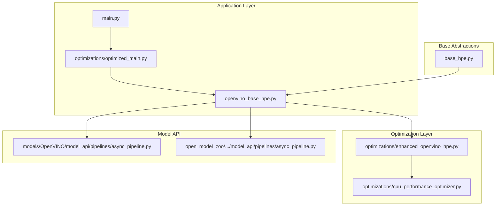
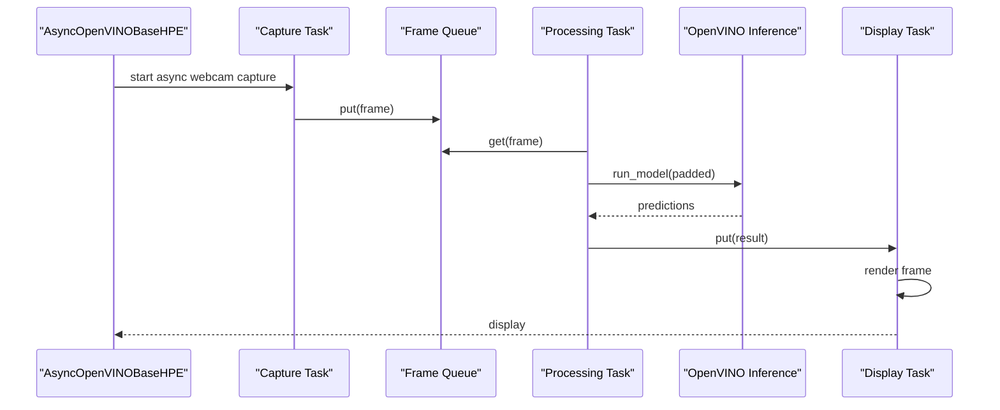
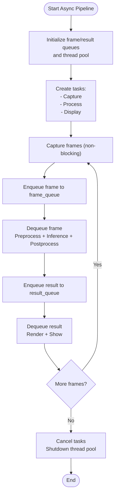
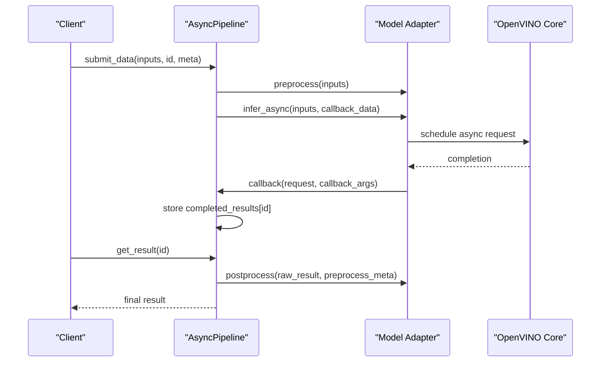
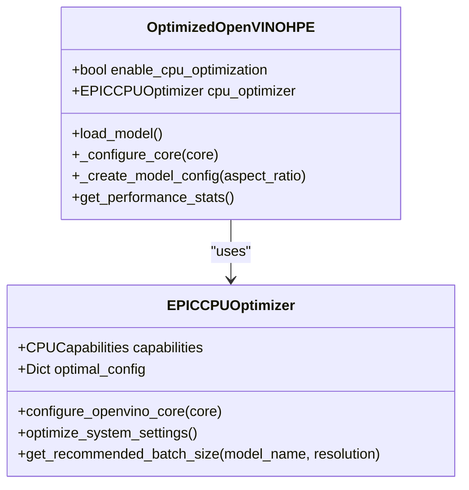
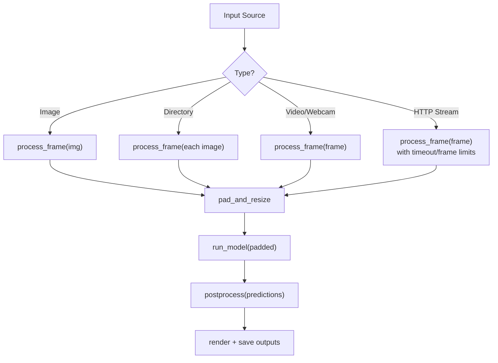
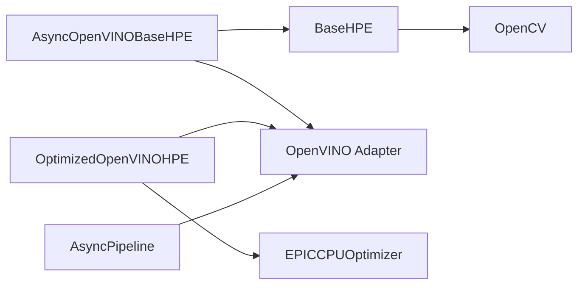

# Async Processing

<cite>
**Referenced Files in This Document**
- [openvino_base_hpe.py](file://openvino_base_hpe.py)
- [optimizations/enhanced_openvino_hpe.py](file://optimizations/enhanced_openvino_hpe.py)
- [optimizations/optimized_main.py](file://optimizations/optimized_main.py)
- [optimizations/cpu_performance_optimizer.py](file://optimizations/cpu_performance_optimizer.py)
- [models/OpenVINO/model_api/pipelines/async_pipeline.py](file://models/OpenVINO/model_api/pipelines/async_pipeline.py)
- [open_model_zoo/demos/common/python/model_zoo/model_api/pipelines/async_pipeline.py](file://open_model_zoo/demos/common/python/model_zoo/model_api/pipelines/async_pipeline.py)
- [base_hpe.py](file://base_hpe.py)
- [main.py](file://main.py)
</cite>

## Table of Contents
1. [Introduction](#introduction)
2. [Project Structure](#project-structure)
3. [Core Components](#core-components)
4. [Architecture Overview](#architecture-overview)
5. [Detailed Component Analysis](#detailed-component-analysis)
6. [Dependency Analysis](#dependency-analysis)
7. [Performance Considerations](#performance-considerations)
8. [Troubleshooting Guide](#troubleshooting-guide)
9. [Conclusion](#conclusion)

## Introduction
This document explains asynchronous processing patterns in the Human Pose Estimation (HPE) framework with a focus on enhanced OpenVINO integration. It covers non-blocking inference, request queuing, frame buffering strategies, and pipeline optimization techniques. It also documents concurrent inference request management, dynamic batch processing, and resource pool management for throughput optimization. Practical examples include async model loading, request scheduling algorithms, and performance monitoring for async workloads. Best practices for balancing latency and throughput, error handling in async contexts, and scaling considerations for high-throughput deployments are included.

## Project Structure
The HPE framework is organized around a base HPE abstraction, OpenVINO-specific implementations, and optimization modules. Async processing is implemented both at the application level (async queues and tasks) and at the OpenVINO model API level (callback-driven async pipelines).

**Diagram sources**
- [main.py:1-99](file://main.py#L1-L99)
- [optimizations/optimized_main.py:1-257](file://optimizations/optimized_main.py#L1-L257)
- [openvino_base_hpe.py:1-653](file://openvino_base_hpe.py#L1-L653)
- [optimizations/enhanced_openvino_hpe.py:1-333](file://optimizations/enhanced_openvino_hpe.py#L1-L333)
- [optimizations/cpu_performance_optimizer.py:1-539](file://optimizations/cpu_performance_optimizer.py#L1-L539)
- [models/OpenVINO/model_api/pipelines/async_pipeline.py:1-144](file://models/OpenVINO/model_api/pipelines/async_pipeline.py#L1-L144)
- [open_model_zoo/demos/common/python/model_zoo/model_api/pipelines/async_pipeline.py:1-144](file://open_model_zoo/demos/common/python/model_zoo/model_api/pipelines/async_pipeline.py#L1-L144)
- [base_hpe.py:1-546](file://base_hpe.py#L1-L546)

**Section sources**
- [openvino_base_hpe.py:1-653](file://openvino_base_hpe.py#L1-L653)
- [optimizations/enhanced_openvino_hpe.py:1-333](file://optimizations/enhanced_openvino_hpe.py#L1-L333)
- [optimizations/optimized_main.py:1-257](file://optimizations/optimized_main.py#L1-L257)
- [optimizations/cpu_performance_optimizer.py:1-539](file://optimizations/cpu_performance_optimizer.py#L1-L539)
- [models/OpenVINO/model_api/pipelines/async_pipeline.py:1-144](file://models/OpenVINO/model_api/pipelines/async_pipeline.py#L1-L144)
- [open_model_zoo/demos/common/python/model_zoo/model_api/pipelines/async_pipeline.py:1-144](file://open_model_zoo/demos/common/python/model_zoo/model_api/pipelines/async_pipeline.py#L1-L144)
- [base_hpe.py:1-546](file://base_hpe.py#L1-L546)
- [main.py:1-99](file://main.py#L1-L99)

## Core Components
- AsyncOpenVINOBaseHPE: Implements an async pipeline with frame buffering, background processing, and display tasks. It uses asyncio queues and a thread pool executor for CPU-bound operations.
- AsyncPipeline (Model API): Provides a callback-driven async inference pipeline with request queuing, result retrieval, and awaiting completion.
- OptimizedOpenVINOHPE: Extends OpenVINOBaseHPE with CPU optimization for EPIC processors, including NUMA-aware configuration, thread and stream tuning, and batch sizing.
- EPICCPUOptimizer: Detects CPU capabilities, calculates optimal OpenVINO configuration, applies system-level optimizations, and creates an optimized core.
- BaseHPE: Defines the common HPE interface, input handling, frame processing, and performance metrics collection.

**Section sources**
- [openvino_base_hpe.py:396-653](file://openvino_base_hpe.py#L396-L653)
- [models/OpenVINO/model_api/pipelines/async_pipeline.py:90-144](file://models/OpenVINO/model_api/pipelines/async_pipeline.py#L90-L144)
- [optimizations/enhanced_openvino_hpe.py:25-218](file://optimizations/enhanced_openvino_hpe.py#L25-L218)
- [optimizations/cpu_performance_optimizer.py:34-506](file://optimizations/cpu_performance_optimizer.py#L34-L506)
- [base_hpe.py:36-546](file://base_hpe.py#L36-L546)

## Architecture Overview
The async architecture combines:
- Application-level async pipeline: capture frames asynchronously, buffer frames, process in background tasks, and render results asynchronously.
- Model-level async pipeline: callback-driven inference with request queuing and result retrieval.
- CPU optimization layer: intelligent thread and stream allocation, NUMA awareness, and system-level tuning.

**Diagram sources**
- [openvino_base_hpe.py:416-624](file://openvino_base_hpe.py#L416-L624)

**Section sources**
- [openvino_base_hpe.py:396-653](file://openvino_base_hpe.py#L396-L653)

## Detailed Component Analysis

### AsyncOpenVINOBaseHPE: Async Pipeline with Frame Buffering
- Frame queue: bounded asyncio queue for buffering frames to prevent latency buildup.
- Background tasks: separate tasks for capturing, processing, and displaying results.
- Thread pool: ThreadPoolExecutor for CPU-bound operations (preprocessing, postprocessing).
- Performance monitoring: tracks processing times and FPS, logs frame drops.

**Diagram sources**
- [openvino_base_hpe.py:416-624](file://openvino_base_hpe.py#L416-L624)

**Section sources**
- [openvino_base_hpe.py:396-653](file://openvino_base_hpe.py#L396-L653)

### AsyncPipeline (Model API): Callback-Driven Async Inference
- Request lifecycle: submit_data triggers preprocessing, inference, and registers a callback.
- Callback: stores raw results keyed by request id.
- Result retrieval: get_result converts raw result to final output and metadata.
- Awaiting: await_all and await_any provide synchronization primitives.

**Diagram sources**
- [models/OpenVINO/model_api/pipelines/async_pipeline.py:110-134](file://models/OpenVINO/model_api/pipelines/async_pipeline.py#L110-L134)

**Section sources**
- [models/OpenVINO/model_api/pipelines/async_pipeline.py:90-144](file://models/OpenVINO/model_api/pipelines/async_pipeline.py#L90-L144)

### OptimizedOpenVINOHPE: CPU Optimization for OpenVINO
- CPU optimization: detects hardware capabilities, calculates optimal threads, streams, and performance hints.
- Core configuration: applies NUMA-aware settings, CPU pinning, and hyper-threading preferences.
- Model configuration: sets aspect ratio, confidence thresholds, and batch size when applicable.
- Performance stats: exposes optimization details for monitoring and tuning.

**Diagram sources**
- [optimizations/enhanced_openvino_hpe.py:25-218](file://optimizations/enhanced_openvino_hpe.py#L25-L218)
- [optimizations/cpu_performance_optimizer.py:34-506](file://optimizations/cpu_performance_optimizer.py#L34-L506)

**Section sources**
- [optimizations/enhanced_openvino_hpe.py:25-218](file://optimizations/enhanced_openvino_hpe.py#L25-L218)
- [optimizations/cpu_performance_optimizer.py:34-506](file://optimizations/cpu_performance_optimizer.py#L34-L506)

### BaseHPE: Common HPE Interface and Frame Processing
- Input handling: supports images, directories, videos, HTTP streams, and webcams.
- Frame processing: pad_and_resize, run_model, postprocess, and rendering.
- Performance metrics: moving average FPS and processing time tracking.
- Output handling: JSON/COCO CSV exports and saving images/videos.

**Diagram sources**
- [base_hpe.py:207-404](file://base_hpe.py#L207-L404)

**Section sources**
- [base_hpe.py:36-546](file://base_hpe.py#L36-L546)

### Practical Examples and Workflows
- Async model loading: load model synchronously in the async main loop before starting tasks.
- Request scheduling: use bounded frame queues to drop late frames and maintain responsiveness.
- Performance monitoring: track processing times and FPS; adjust threads/streams/batch sizes accordingly.
- Scaling: increase streams and threads for throughput-heavy models; reduce for latency-sensitive scenarios.

**Section sources**
- [openvino_base_hpe.py:593-624](file://openvino_base_hpe.py#L593-L624)
- [optimizations/enhanced_openvino_hpe.py:77-131](file://optimizations/enhanced_openvino_hpe.py#L77-L131)
- [optimizations/cpu_performance_optimizer.py:100-227](file://optimizations/cpu_performance_optimizer.py#L100-L227)

## Dependency Analysis
- AsyncOpenVINOBaseHPE depends on asyncio, concurrent.futures, and OpenCV for display.
- OptimizedOpenVINOHPE depends on EPICCPUOptimizer and OpenVINO properties for core configuration.
- AsyncPipeline depends on the model adapter’s async inference and callback registration.
- BaseHPE provides the shared interface for all HPE implementations.

**Diagram sources**
- [openvino_base_hpe.py:396-653](file://openvino_base_hpe.py#L396-L653)
- [optimizations/enhanced_openvino_hpe.py:25-218](file://optimizations/enhanced_openvino_hpe.py#L25-L218)
- [models/OpenVINO/model_api/pipelines/async_pipeline.py:90-144](file://models/OpenVINO/model_api/pipelines/async_pipeline.py#L90-L144)
- [base_hpe.py:36-546](file://base_hpe.py#L36-L546)

**Section sources**
- [openvino_base_hpe.py:396-653](file://openvino_base_hpe.py#L396-L653)
- [optimizations/enhanced_openvino_hpe.py:25-218](file://optimizations/enhanced_openvino_hpe.py#L25-L218)
- [models/OpenVINO/model_api/pipelines/async_pipeline.py:90-144](file://models/OpenVINO/model_api/pipelines/async_pipeline.py#L90-L144)
- [base_hpe.py:36-546](file://base_hpe.py#L36-L546)

## Performance Considerations
- Throughput vs latency: tune performance hint, threads, and streams; use batching for throughput-heavy models.
- Frame buffering: cap queue size to prevent latency spikes; drop frames when full.
- CPU pinning and hyper-threading: enable pinning for stable latency; disable hyper-threading for inference on high-core systems.
- NUMA awareness: distribute threads across NUMA nodes for multi-socket systems.
- Monitoring: maintain moving averages of processing times and FPS; log frame drops and errors.

[No sources needed since this section provides general guidance]

## Troubleshooting Guide
- Frame drops: inspect frame drops counter and queue size; reduce input FPS or increase buffer capacity.
- Latency spikes: disable CPU power-saving features; apply CPU pinning; reduce threads/streams.
- Async errors: catch exceptions in background tasks; cancel tasks gracefully; shutdown thread pools.
- Model loading: ensure model paths are correct; verify device support; confirm adapter outputs.

**Section sources**
- [openvino_base_hpe.py:422-442](file://openvino_base_hpe.py#L422-L442)
- [openvino_base_hpe.py:500-504](file://openvino_base_hpe.py#L500-L504)
- [optimizations/cpu_performance_optimizer.py:445-484](file://optimizations/cpu_performance_optimizer.py#L445-L484)

## Conclusion
The HPE framework integrates async processing at both the application and model API levels. AsyncOpenVINOBaseHPE provides a robust async pipeline with frame buffering and background tasks, while AsyncPipeline offers callback-driven inference with request queuing. OptimizedOpenVINOHPE and EPICCPUOptimizer deliver CPU-centric tuning for EPIC processors, enabling dynamic batch processing and resource pool management. Together, these components support high-throughput, low-latency deployments with strong error handling and performance monitoring.