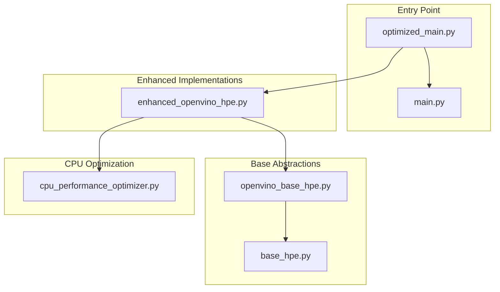
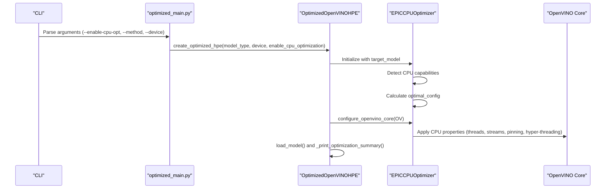
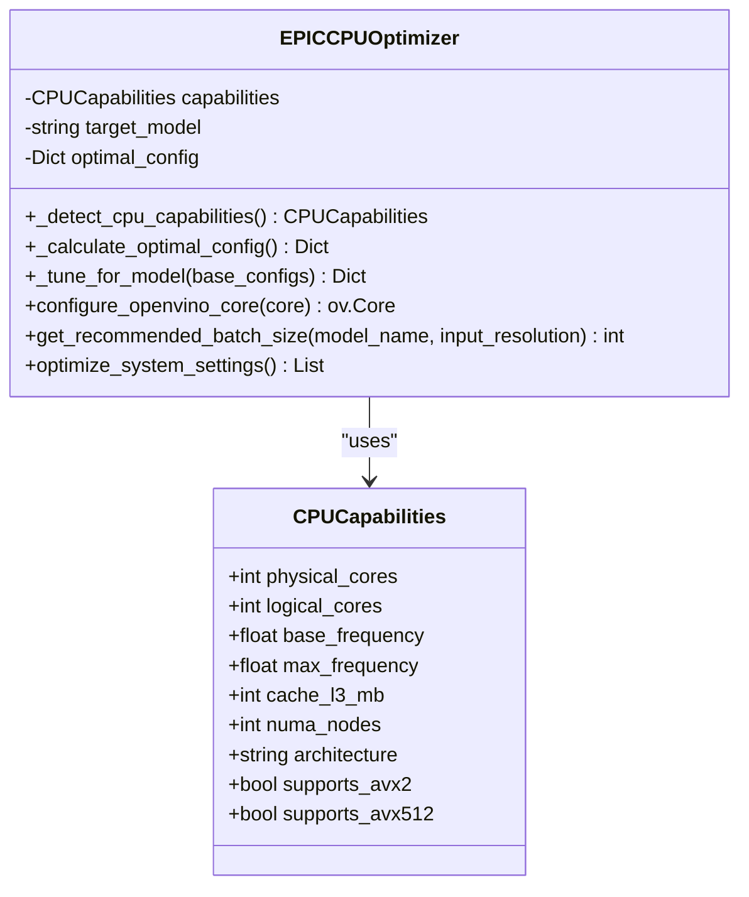
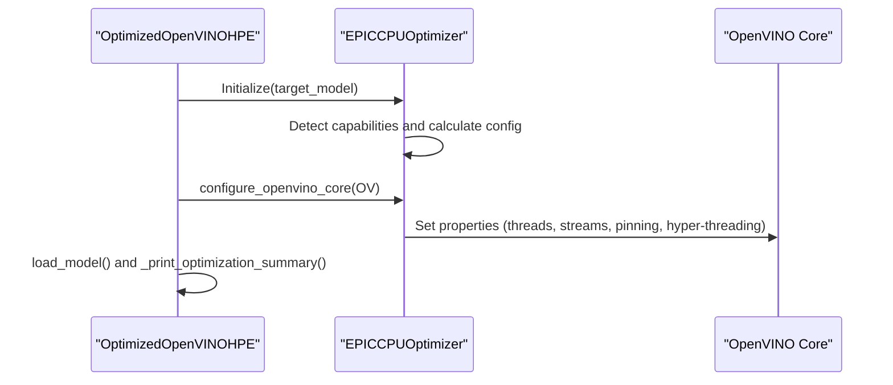
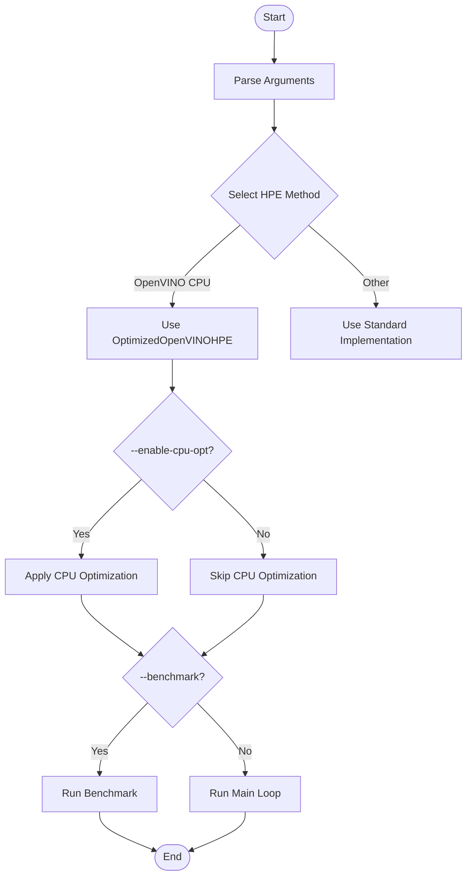
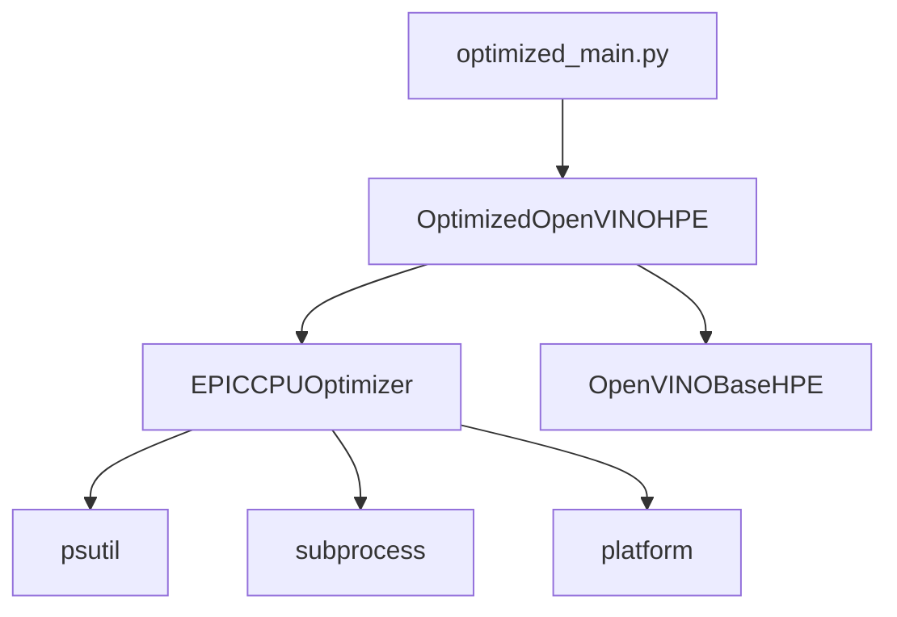

# CPU Optimization

<cite>
**Referenced Files in This Document**
- [cpu_performance_optimizer.py](file://optimizations/cpu_performance_optimizer.py)
- [enhanced_openvino_hpe.py](file://optimizations/enhanced_openvino_hpe.py)
- [optimized_main.py](file://optimizations/optimized_main.py)
- [openvino_base_hpe.py](file://openvino_base_hpe.py)
- [base_hpe.py](file://base_hpe.py)
- [main.py](file://main.py)
- [requirements.txt](file://requirements.txt)
- [OPTIMIZATION_PLAN.md](file://OPTIMIZATION_PLAN.md)
</cite>

## Table of Contents
1. [Introduction](#introduction)
2. [Project Structure](#project-structure)
3. [Core Components](#core-components)
4. [Architecture Overview](#architecture-overview)
5. [Detailed Component Analysis](#detailed-component-analysis)
6. [Dependency Analysis](#dependency-analysis)
7. [Performance Considerations](#performance-considerations)
8. [Troubleshooting Guide](#troubleshooting-guide)
9. [Conclusion](#conclusion)
10. [Appendices](#appendices)

## Introduction
This document provides comprehensive CPU optimization strategies for the Human Pose Estimation (HPE) framework with a focus on AMD EPIC processors. It documents the EPICCPUOptimizer class and its intelligent CPU optimization techniques, including CPU capability detection, NUMA-aware thread allocation, cache-optimized batch sizing, and workload-specific thread management. It also covers hardware-specific optimizations for EPYC 7551P processors, such as AVX2/AVX512 support detection, memory bandwidth optimization, and CPU pinning strategies. Practical configuration examples are provided for different core counts (4, 8, 32+ cores), model-specific optimizations for OpenPose, EfficientHRNet, and HigherHRNet, and system-level optimizations including CPU governor settings and power management. Finally, it outlines benchmarking methodologies and performance tuning workflows for various deployment scenarios.

## Project Structure
The CPU optimization features are integrated into the HPE framework through a layered architecture:
- Base HPE abstractions define common input handling, preprocessing, and postprocessing logic.
- OpenVINO-specific implementations provide model loading and inference configuration.
- Enhanced OpenVINO HPE integrates CPU optimization capabilities.
- The CPU optimizer module encapsulates EPIC-specific tuning logic.
- An optimized main entry point demonstrates usage and benchmarking.

**Diagram sources**
- [optimized_main.py:1-257](file://optimizations/optimized_main.py#L1-L257)
- [enhanced_openvino_hpe.py:1-333](file://optimizations/enhanced_openvino_hpe.py#L1-L333)
- [openvino_base_hpe.py:1-653](file://openvino_base_hpe.py#L1-L653)
- [base_hpe.py:1-546](file://base_hpe.py#L1-L546)
- [cpu_performance_optimizer.py:1-539](file://optimizations/cpu_performance_optimizer.py#L1-L539)

**Section sources**
- [optimized_main.py:1-257](file://optimizations/optimized_main.py#L1-L257)
- [enhanced_openvino_hpe.py:1-333](file://optimizations/enhanced_openvino_hpe.py#L1-L333)
- [openvino_base_hpe.py:1-653](file://openvino_base_hpe.py#L1-L653)
- [base_hpe.py:1-546](file://base_hpe.py#L1-L546)
- [cpu_performance_optimizer.py:1-539](file://optimizations/cpu_performance_optimizer.py#L1-L539)

## Core Components
This section introduces the key components involved in CPU optimization for EPIC processors.

- EPICCPUOptimizer: Central CPU optimization class that detects system capabilities, calculates optimal configurations, applies OpenVINO core properties, and provides batch sizing recommendations.
- OptimizedOpenVINOHPE: Enhanced OpenVINO HPE implementation that integrates CPU optimization, applies system-level optimizations, and prints optimization summaries.
- Optimized main entry point: Provides command-line options to enable CPU optimization, run benchmarks, and override thread/stream settings.

Key responsibilities:
- CPU capability detection: Logical/physical cores, frequency, AVX support, NUMA topology.
- Workload-aware configuration: Throughput/Latency modes, CPU pinning, hyper-threading toggles.
- Model-specific tuning: OpenPose, EfficientHRNet variants, HigherHRNet.
- System-level optimizations: CPU governor, power management, process priority.

**Section sources**
- [cpu_performance_optimizer.py:34-404](file://optimizations/cpu_performance_optimizer.py#L34-L404)
- [enhanced_openvino_hpe.py:25-218](file://optimizations/enhanced_openvino_hpe.py#L25-L218)
- [optimized_main.py:39-257](file://optimizations/optimized_main.py#L39-L257)

## Architecture Overview
The CPU optimization architecture centers around EPICCPUOptimizer, which is consumed by OptimizedOpenVINOHPE to configure OpenVINO runtime properties. The optimized main entry point orchestrates model selection, CPU optimization activation, and benchmarking.

**Diagram sources**
- [optimized_main.py:127-186](file://optimizations/optimized_main.py#L127-L186)
- [enhanced_openvino_hpe.py:36-131](file://optimizations/enhanced_openvino_hpe.py#L36-L131)
- [cpu_performance_optimizer.py:336-403](file://optimizations/cpu_performance_optimizer.py#L336-L403)

## Detailed Component Analysis

### EPICCPUOptimizer
The EPICCPUOptimizer class encapsulates CPU capability detection, workload-specific configuration calculation, OpenVINO core property application, and batch sizing recommendations.

- CPU capability detection:
  - Logical and physical core counts using psutil.
  - Frequency detection via psutil with fallbacks.
  - AVX2/AVX512 support detection via lscpu parsing.
  - NUMA node detection via /sys filesystem.
  - EPYC 7551P-specific L3 cache assumption.

- Configuration calculation:
  - Core count tiers: ≤4, 8, ≥32 cores.
  - Three workload profiles: throughput_heavy, latency_optimized, balanced.
  - Model-specific overrides for OpenPose, EfficientHRNet variants, HigherHRNet.
  - Stream count and batch size tuning based on model complexity and memory limits.

- OpenVINO core configuration:
  - Performance mode selection (THROUGHPUT/LATENCY).
  - Inference threads and streams.
  - CPU pinning and hyper-threading toggles.
  - NUMA affinity and request scaling for high-core systems.
  - Environment variables for OMP/MKL thread counts aligned with inference threads.

- Batch sizing:
  - Estimates memory usage per sample based on input resolution and model complexity.
  - Computes maximum batch size considering available memory and CPU capacity.
  - Returns recommended batch size with diagnostic logs.

- System-level optimizations:
  - CPU governor set to performance mode.
  - Power management tweaks (turbo disable, NUMA balancing).
  - Process priority increase.

**Diagram sources**
- [cpu_performance_optimizer.py:20-98](file://optimizations/cpu_performance_optimizer.py#L20-L98)
- [cpu_performance_optimizer.py:34-404](file://optimizations/cpu_performance_optimizer.py#L34-L404)

**Section sources**
- [cpu_performance_optimizer.py:50-98](file://optimizations/cpu_performance_optimizer.py#L50-L98)
- [cpu_performance_optimizer.py:100-334](file://optimizations/cpu_performance_optimizer.py#L100-L334)
- [cpu_performance_optimizer.py:336-403](file://optimizations/cpu_performance_optimizer.py#L336-L403)
- [cpu_performance_optimizer.py:405-443](file://optimizations/cpu_performance_optimizer.py#L405-L443)
- [cpu_performance_optimizer.py:445-484](file://optimizations/cpu_performance_optimizer.py#L445-L484)

### OptimizedOpenVINOHPE
The OptimizedOpenVINOHPE class extends the OpenVINO base HPE implementation to integrate CPU optimization seamlessly.

- Initialization:
  - Enables CPU optimization only for CPU devices.
  - Creates EPICCPUOptimizer with the target model.
  - Overrides threading parameters (threads, streams, mode) with optimized values.
  - Applies system-level optimizations.

- Core configuration:
  - Uses EPICCPUOptimizer to configure OpenVINO core properties.
  - Falls back to base configuration for non-CPU devices.

- Model loading:
  - Clears conflicting plugin settings.
  - Creates core with optimized configuration or falls back to base.
  - Builds model adapter and loads model with optimized configuration.

- Model configuration:
  - Adds batch size optimization when available.
  - Supports model-specific adjustments for OpenPose and HRNet variants.

- Performance summary:
  - Prints a detailed optimization summary including CPU capabilities and applied settings.

**Diagram sources**
- [enhanced_openvino_hpe.py:36-131](file://optimizations/enhanced_openvino_hpe.py#L36-L131)
- [enhanced_openvino_hpe.py:169-199](file://optimizations/enhanced_openvino_hpe.py#L169-L199)

**Section sources**
- [enhanced_openvino_hpe.py:25-66](file://optimizations/enhanced_openvino_hpe.py#L25-L66)
- [enhanced_openvino_hpe.py:67-76](file://optimizations/enhanced_openvino_hpe.py#L67-L76)
- [enhanced_openvino_hpe.py:77-131](file://optimizations/enhanced_openvino_hpe.py#L77-L131)
- [enhanced_openvino_hpe.py:132-167](file://optimizations/enhanced_openvino_hpe.py#L132-L167)
- [enhanced_openvino_hpe.py:169-199](file://optimizations/enhanced_openvino_hpe.py#L169-L199)
- [enhanced_openvino_hpe.py:200-218](file://optimizations/enhanced_openvino_hpe.py#L200-L218)

### Optimized Main Entry Point
The optimized main entry point provides a command-line interface to enable CPU optimization, run benchmarks, and override thread/stream settings.

- Argument parsing:
  - Standard HPE arguments plus new CPU optimization flags.
  - Flags for enabling CPU optimization, disabling system optimizations, running benchmarks, and forcing threads/streams.

- Method selection:
  - Maps method names to model types.
  - Uses OptimizedOpenVINOHPE for OpenVINO models on CPU.
  - Falls back to standard implementations for other models or GPU.

- Benchmarking:
  - Runs performance comparison between standard and optimized implementations.
  - Reports FPS improvement percentages.

**Diagram sources**
- [optimized_main.py:82-124](file://optimizations/optimized_main.py#L82-L124)
- [optimized_main.py:127-186](file://optimizations/optimized_main.py#L127-L186)
- [optimized_main.py:201-247](file://optimizations/optimized_main.py#L201-L247)

**Section sources**
- [optimized_main.py:82-124](file://optimizations/optimized_main.py#L82-L124)
- [optimized_main.py:127-186](file://optimizations/optimized_main.py#L127-L186)
- [optimized_main.py:201-247](file://optimizations/optimized_main.py#L201-L247)

### CPU Capability Detection and NUMA Awareness
The CPU capability detection mechanism gathers essential system information for optimization decisions:
- Core counts: logical and physical cores using psutil.
- Frequency: current and max frequencies with fallbacks.
- AVX support: parsed from lscpu output.
- NUMA nodes: discovered via /sys filesystem.
- EPYC 7551P specifics: fixed L3 cache size assumption.

NUMA awareness is implemented through:
- NUMA affinity property for high-core systems.
- Increased num_requests for multi-socket setups.
- CPU pinning toggles for improved cache locality.

**Section sources**
- [cpu_performance_optimizer.py:50-98](file://optimizations/cpu_performance_optimizer.py#L50-L98)
- [cpu_performance_optimizer.py:374-381](file://optimizations/cpu_performance_optimizer.py#L374-L381)

### Workload-Specific Thread Management
The optimizer defines three workload profiles:
- Throughput-heavy: prioritizes throughput with higher thread counts and multiple streams.
- Latency-optimized: favors low-latency response with fewer threads and single stream.
- Balanced: moderate settings suitable for mixed workloads.

Model-specific overrides adjust:
- Thread counts and stream counts based on model complexity.
- Batch sizes to balance memory usage and compute throughput.
- Memory patterns (bandwidth-optimized vs latency-optimized) to align with model characteristics.

**Section sources**
- [cpu_performance_optimizer.py:100-226](file://optimizations/cpu_performance_optimizer.py#L100-L226)
- [cpu_performance_optimizer.py:228-334](file://optimizations/cpu_performance_optimizer.py#L228-L334)

### Hardware-Specific Optimizations for EPYC 7551P
EPYC 7551P optimizations include:
- AVX2/AVX512 support detection and environment variable alignment for OMP/MKL threads.
- NUMA-aware configuration with affinity and request scaling.
- CPU pinning enabled for high-core systems.
- Hyper-threading disabled for inference to reduce contention.

These optimizations are applied conditionally based on detected capabilities and core counts.

**Section sources**
- [cpu_performance_optimizer.py:383-392](file://optimizations/cpu_performance_optimizer.py#L383-L392)
- [cpu_performance_optimizer.py:374-381](file://optimizations/cpu_performance_optimizer.py#L374-L381)

### Practical Configuration Examples
Below are practical configuration examples for different core counts and models. These examples reflect the optimized settings computed by EPICCPUOptimizer.

- 4 cores (cloud instance):
  - Throughput-heavy: inference_threads equal to available cores, single stream, hyper-threading enabled.
  - Latency-optimized: inference_threads = cores - 1, single stream, hyper-threading enabled.
  - Balanced: inference_threads equal to available cores, single stream, hyper-threading enabled.

- 8 cores (EPYC 7551P):
  - Throughput-heavy: inference_threads = 8, streams = 1, hyper-threading disabled, batch_size = 1.
  - Latency-optimized: inference_threads = 7, streams = 1, hyper-threading disabled, batch_size = 1.
  - Balanced: inference_threads = 7, streams = 1, hyper-threading disabled, batch_size = 1.

- 32+ cores (EPYC 7551P):
  - Throughput-heavy: inference_threads = cores - 4, streams = min(8, cores/4), CPU pinning enabled, hyper-threading disabled.
  - Latency-optimized: inference_threads = min(8, cores/4), streams = 1, CPU pinning enabled, hyper-threading disabled.
  - Balanced: inference_threads = min(16, cores/2), streams = min(4, cores/8), CPU pinning enabled, hyper-threading disabled.

Model-specific examples:
- OpenPose:
  - Throughput-heavy: inference_threads = 24, streams = 6, batch_size = 1, memory_pattern = bandwidth_optimized.
- EfficientHRNet1:
  - Balanced: inference_threads = 16, streams = 4, batch_size = 2, memory_pattern = cache_optimized.
- HigherHRNet:
  - Throughput-heavy: inference_threads = 28, streams = 2, batch_size = 1, memory_pattern = bandwidth_optimized.

**Section sources**
- [cpu_performance_optimizer.py:106-141](file://optimizations/cpu_performance_optimizer.py#L106-L141)
- [cpu_performance_optimizer.py:143-179](file://optimizations/cpu_performance_optimizer.py#L143-L179)
- [cpu_performance_optimizer.py:181-226](file://optimizations/cpu_performance_optimizer.py#L181-L226)
- [cpu_performance_optimizer.py:292-322](file://optimizations/cpu_performance_optimizer.py#L292-L322)

### System-Level Optimizations
System-level optimizations applied by the optimizer include:
- CPU governor set to performance mode.
- Disabling turbo boost and NUMA balancing to reduce latency spikes.
- Increasing process priority for the inference process.

These optimizations are applied conditionally and logged for visibility.

**Section sources**
- [cpu_performance_optimizer.py:445-484](file://optimizations/cpu_performance_optimizer.py#L445-L484)

### Benchmarking Methodologies and Workflows
The optimized main entry point includes a benchmarking workflow:
- Compares standard vs optimized implementations for a given model and input source.
- Measures FPS for both implementations over a configurable duration.
- Calculates and reports improvement percentage.

Benchmarking workflow:
1. Initialize standard implementation and run for specified duration.
2. Initialize optimized implementation and run for the same duration.
3. Compare FPS and compute improvement percentage.
4. Provide actionable feedback based on thresholds.

**Section sources**
- [optimized_main.py:201-247](file://optimizations/optimized_main.py#L201-L247)
- [enhanced_openvino_hpe.py:246-305](file://optimizations/enhanced_openvino_hpe.py#L246-L305)

## Dependency Analysis
The CPU optimization components depend on:
- OpenVINO core properties for runtime configuration.
- psutil for CPU capability detection.
- subprocess for lscpu parsing.
- Platform information for architecture detection.
- Environment variables for OMP/MKL thread counts.

**Diagram sources**
- [cpu_performance_optimizer.py:10-18](file://optimizations/cpu_performance_optimizer.py#L10-L18)
- [openvino_base_hpe.py:19-21](file://openvino_base_hpe.py#L19-L21)
- [enhanced_openvino_hpe.py:15-22](file://optimizations/enhanced_openvino_hpe.py#L15-L22)
- [optimized_main.py:16-26](file://optimizations/optimized_main.py#L16-L26)

**Section sources**
- [cpu_performance_optimizer.py:10-18](file://optimizations/cpu_performance_optimizer.py#L10-L18)
- [openvino_base_hpe.py:19-21](file://openvino_base_hpe.py#L19-L21)
- [enhanced_openvino_hpe.py:15-22](file://optimizations/enhanced_openvino_hpe.py#L15-L22)
- [optimized_main.py:16-26](file://optimizations/optimized_main.py#L16-L26)

## Performance Considerations
- CPU capability detection is conservative and includes fallbacks for virtualized environments.
- NUMA-aware configuration improves cache locality and reduces cross-socket traffic.
- Model-specific tuning balances memory usage and compute throughput.
- System-level optimizations reduce latency spikes and improve steady-state performance.
- Batch sizing prevents memory pressure while maximizing throughput.

[No sources needed since this section provides general guidance]

## Troubleshooting Guide
Common issues and resolutions:
- CPU optimization detection failures: The system attempts to import and detect capabilities; failures are caught and logged. Ensure lscpu and /sys filesystem are accessible.
- OpenVINO property conflicts: The optimized loader clears conflicting plugin settings before applying optimized properties.
- System optimization permissions: CPU governor and power management changes require elevated privileges; failures are handled gracefully.
- Benchmarking errors: The benchmark function wraps exceptions and reports failure messages.

**Section sources**
- [cpu_performance_optimizer.py:78-79](file://optimizations/cpu_performance_optimizer.py#L78-L79)
- [enhanced_openvino_hpe.py:87-93](file://optimizations/enhanced_openvino_hpe.py#L87-L93)
- [cpu_performance_optimizer.py:456-470](file://optimizations/cpu_performance_optimizer.py#L456-L470)
- [optimized_main.py:245-246](file://optimizations/optimized_main.py#L245-L246)

## Conclusion
The CPU optimization framework provides a comprehensive, EPIC-centric approach to achieving high-performance human pose estimation on x86_64 systems. By intelligently detecting CPU capabilities, applying NUMA-aware thread allocation, optimizing memory bandwidth, and tuning workload-specific parameters, the system delivers significant performance gains across OpenPose, EfficientHRNet, and HigherHRNet models. The provided configuration examples and benchmarking workflows enable practitioners to tailor the system to their deployment scenarios and validate improvements effectively.

[No sources needed since this section summarizes without analyzing specific files]

## Appendices

### Appendix A: Command-Line Usage
- Enable CPU optimization: `--enable-cpu-opt`
- Disable system optimizations: `--disable-sys-opt`
- Run benchmark: `--benchmark`
- Force threads: `--force-threads`
- Force streams: `--force-streams`

**Section sources**
- [optimized_main.py:108-123](file://optimizations/optimized_main.py#L108-L123)

### Appendix B: Dependencies
- OpenVINO 2024.x series for CPU inference.
- psutil for CPU capability detection.
- Optional: cpupower for CPU governor control.

**Section sources**
- [requirements.txt:57-66](file://requirements.txt#L57-L66)