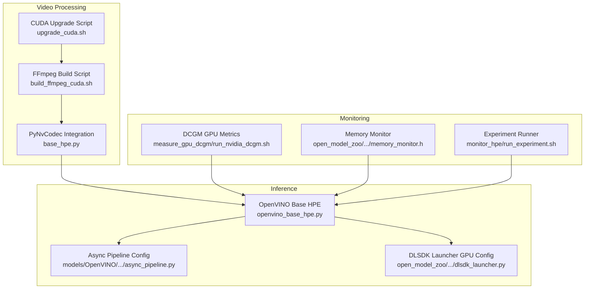
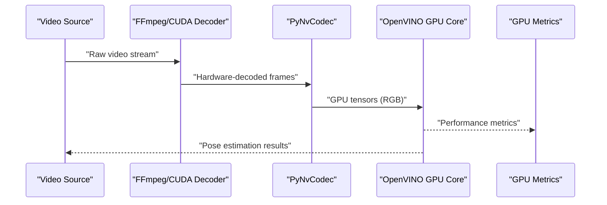
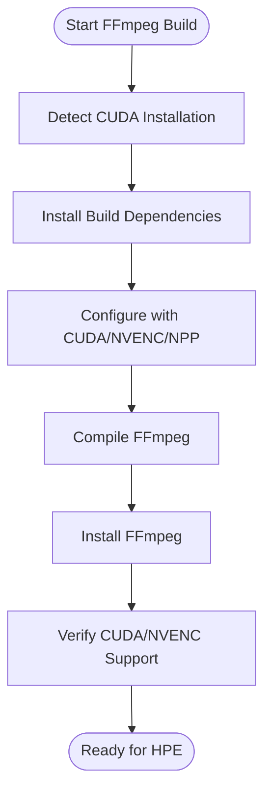
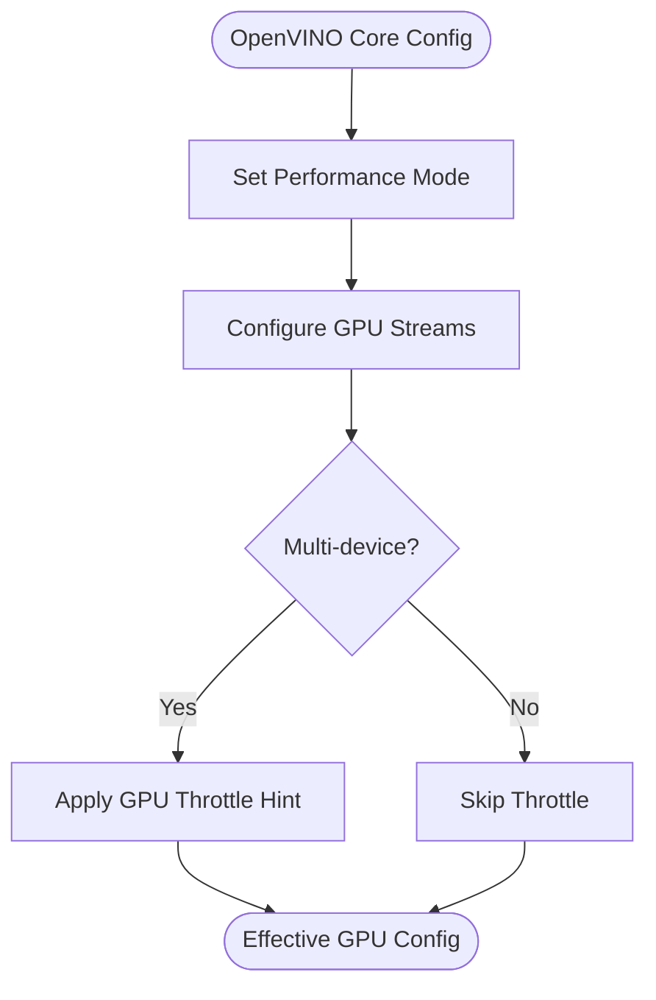
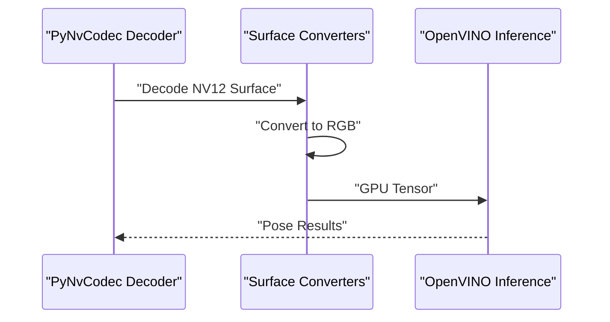
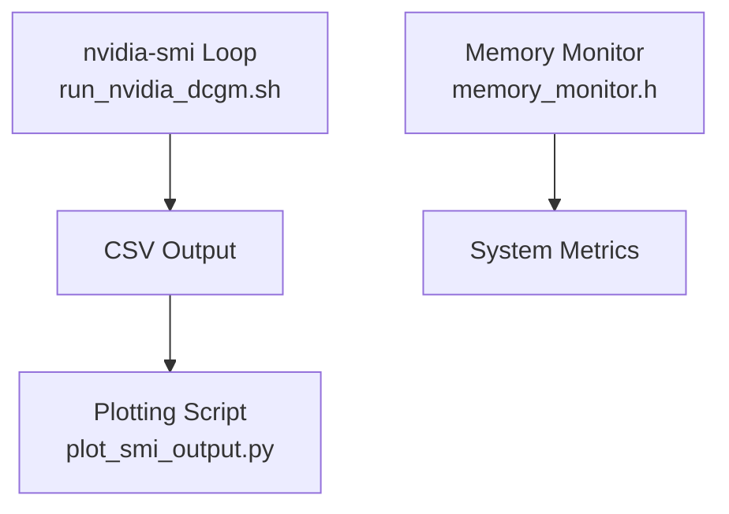
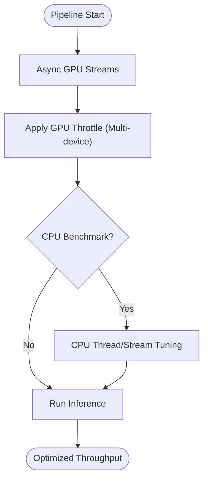
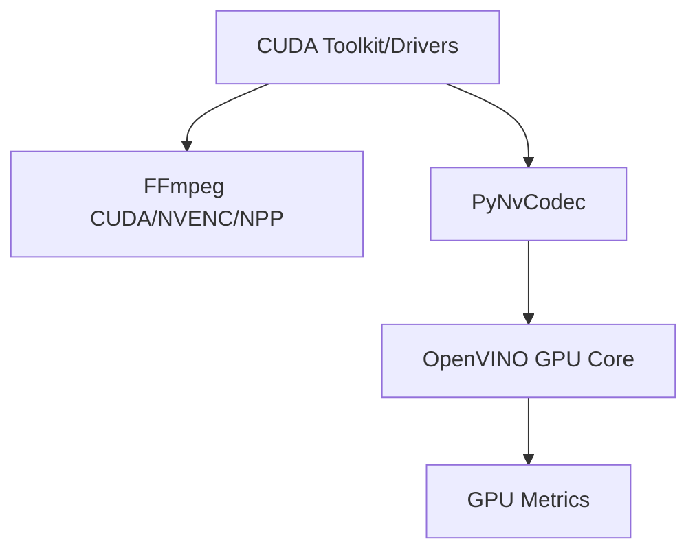

# GPU Acceleration

<cite>
**Referenced Files in This Document**
- [build_ffmpeg_cuda.sh](file://build_ffmpeg_cuda.sh)
- [upgrade_cuda.sh](file://upgrade_cuda.sh)
- [openvino_base_hpe.py](file://openvino_base_hpe.py)
- [base_hpe.py](file://base_hpe.py)
- [main.py](file://main.py)
- [models/OpenVINO/model_api/pipelines/async_pipeline.py](file://models/OpenVINO/model_api/pipelines/async_pipeline.py)
- [open_model_zoo/tools/accuracy_checker/accuracy_checker/launcher/dlsdk_launcher.py](file://open_model_zoo/tools/accuracy_checker/accuracy_checker/launcher/dlsdk_launcher.py)
- [open_model_zoo/demos/multi_channel_common/cpp/input.hpp](file://open_model_zoo/demos/multi_channel_common/cpp/input.hpp)
- [open_model_zoo/demos/multi_channel_common/cpp/decoder.hpp](file://open_model_zoo/demos/multi_channel_common/cpp/decoder.hpp)
- [open_model_zoo/demos/multi_channel_common/cpp/graph.hpp](file://open_model_zoo/demos/multi_channel_common/cpp/graph.hpp)
- [open_model_zoo/demos/common/cpp/monitors/include/monitors/memory_monitor.h](file://open_model_zoo/demos/common/cpp/monitors/include/monitors/memory_monitor.h)
- [optimizations/cpu_performance_optimizer.py](file://optimizations/cpu_performance_optimizer.py)
- [optimizations/enhanced_openvino_hpe.py](file://optimizations/enhanced_openvino_hpe.py)
- [optimizations/optimized_main.py](file://optimizations/optimized_main.py)
- [measure_gpu_dcgm/run_nvidia_dcgm.sh](file://measure_gpu_dcgm/run_nvidia_dcgm.sh)
- [measure_gpu_dcgm/plot_smi_output.py](file://measure_gpu_dcgm/plot_smi_output.py)
- [monitor_hpe/run_experiment.sh](file://monitor_hpe/run_experiment.sh)
- [ffmpeg_hpe/Dockerfile.gpu_metrics](file://ffmpeg_hpe/Dockerfile.gpu_metrics)
- [Measure_gpu_dcgm/Dockerfile.gpu_metrics](file://Measure_gpu_dcgm/Dockerfile.gpu_metrics)
- [show_5fps_env_vars.sh](file://show_5fps_env_vars.sh)
</cite>

## Table of Contents
1. [Introduction](#introduction)
2. [Project Structure](#project-structure)
3. [Core Components](#core-components)
4. [Architecture Overview](#architecture-overview)
5. [Detailed Component Analysis](#detailed-component-analysis)
6. [Dependency Analysis](#dependency-analysis)
7. [Performance Considerations](#performance-considerations)
8. [Troubleshooting Guide](#troubleshooting-guide)
9. [Conclusion](#conclusion)
10. [Appendices](#appendices)

## Introduction
This document provides comprehensive guidance for GPU acceleration in the Human Pose Estimation (HPE) framework. It covers:
- CUDA integration with FFmpeg for hardware-accelerated video processing
- OpenVINO GPU plugin configuration and optimization
- GPU memory management techniques
- Build process for CUDA-enabled FFmpeg
- GPU device selection and optimization strategies
- Performance comparisons across CPU-only, CUDA-accelerated, and OpenVINO GPU inference
- Practical GPU utilization monitoring, memory allocation strategies, and batch processing optimization
- Troubleshooting GPU-related issues, driver compatibility, and bottleneck identification
- Guidelines for selecting optimal GPU configurations based on model complexity and input resolution

## Project Structure
The repository organizes GPU acceleration across three primary areas:
- FFmpeg build and CUDA integration for hardware-accelerated video decoding
- OpenVINO GPU plugin configuration and asynchronous pipeline tuning
- Monitoring and benchmarking tools for GPU utilization and memory metrics

**Diagram sources**
- [build_ffmpeg_cuda.sh:1-219](file://build_ffmpeg_cuda.sh#L1-L219)
- [upgrade_cuda.sh:36-79](file://upgrade_cuda.sh#L36-L79)
- [base_hpe.py:10-15](file://base_hpe.py#L10-L15)
- [openvino_base_hpe.py:153-182](file://openvino_base_hpe.py#L153-L182)
- [models/OpenVINO/model_api/pipelines/async_pipeline.py:63-85](file://models/OpenVINO/model_api/pipelines/async_pipeline.py#L63-L85)
- [open_model_zoo/tools/accuracy_checker/accuracy_checker/launcher/dlsdk_launcher.py:407-433](file://open_model_zoo/tools/accuracy_checker/accuracy_checker/launcher/dlsdk_launcher.py#L407-L433)
- [measure_gpu_dcgm/run_nvidia_dcgm.sh:1-29](file://measure_gpu_dcgm/run_nvidia_dcgm.sh#L1-L29)
- [open_model_zoo/demos/common/cpp/monitors/include/monitors/memory_monitor.h:1-34](file://open_model_zoo/demos/common/cpp/monitors/include/monitors/memory_monitor.h#L1-L34)
- [monitor_hpe/run_experiment.sh:1-138](file://monitor_hpe/run_experiment.sh#L1-L138)

**Section sources**
- [build_ffmpeg_cuda.sh:1-219](file://build_ffmpeg_cuda.sh#L1-L219)
- [openvino_base_hpe.py:153-182](file://openvino_base_hpe.py#L153-L182)
- [measure_gpu_dcgm/run_nvidia_dcgm.sh:1-29](file://measure_gpu_dcgm/run_nvidia_dcgm.sh#L1-L29)

## Core Components
- CUDA-enabled FFmpeg build and verification for hardware-accelerated decoding
- OpenVINO GPU plugin configuration with throughput/latency modes and stream tuning
- PyNvCodec-based GPU video decoding pipeline for low-latency HPE
- GPU monitoring scripts for utilization, memory, and power metrics
- CPU optimization utilities for OpenVINO CPU inference (used for comparative performance)

Key implementation references:
- FFmpeg build with CUDA/NPP/NVENC and compute capability targeting
- OpenVINO core configuration with performance hints and stream settings
- PyNvCodec initialization and frame conversion for GPU tensors
- DCGM-based GPU metrics collection and plotting

**Section sources**
- [build_ffmpeg_cuda.sh:157-183](file://build_ffmpeg_cuda.sh#L157-L183)
- [openvino_base_hpe.py:153-182](file://openvino_base_hpe.py#L153-L182)
- [base_hpe.py:241-261](file://base_hpe.py#L241-L261)
- [measure_gpu_dcgm/run_nvidia_dcgm.sh:7-16](file://measure_gpu_dcgm/run_nvidia_dcgm.sh#L7-L16)

## Architecture Overview
The GPU acceleration architecture integrates hardware decoding, inference, and monitoring:

**Diagram sources**
- [base_hpe.py:241-261](file://base_hpe.py#L241-L261)
- [openvino_base_hpe.py:183-260](file://openvino_base_hpe.py#L183-L260)
- [measure_gpu_dcgm/run_nvidia_dcgm.sh:10-16](file://measure_gpu_dcgm/run_nvidia_dcgm.sh#L10-L16)

## Detailed Component Analysis

### CUDA Integration with FFmpeg
- Build script compiles FFmpeg with CUDA/NPP/NVENC support and sets compute capability for modern GPUs
- Detects CUDA installation and validates nvcc availability
- Installs required dependencies and configures pkg-config paths for CUDA libraries
- Verifies FFmpeg installation and checks for CUDA/NVENC/MJPEG support

**Diagram sources**
- [build_ffmpeg_cuda.sh:67-127](file://build_ffmpeg_cuda.sh#L67-L127)
- [build_ffmpeg_cuda.sh:157-183](file://build_ffmpeg_cuda.sh#L157-L183)
- [build_ffmpeg_cuda.sh:199-216](file://build_ffmpeg_cuda.sh#L199-L216)

**Section sources**
- [build_ffmpeg_cuda.sh:67-127](file://build_ffmpeg_cuda.sh#L67-L127)
- [build_ffmpeg_cuda.sh:157-183](file://build_ffmpeg_cuda.sh#L157-L183)
- [build_ffmpeg_cuda.sh:199-216](file://build_ffmpeg_cuda.sh#L199-L216)

### OpenVINO GPU Plugin Configuration
- Sets performance mode (latency/throughput) and thread/stream counts
- Applies device-specific properties and throttling for multi-device scenarios
- Supports GPU_THROUGHPUT_STREAMS and NUM_STREAMS depending on device capabilities

**Diagram sources**
- [openvino_base_hpe.py:153-182](file://openvino_base_hpe.py#L153-L182)
- [models/OpenVINO/model_api/pipelines/async_pipeline.py:63-85](file://models/OpenVINO/model_api/pipelines/async_pipeline.py#L63-L85)
- [open_model_zoo/tools/accuracy_checker/accuracy_checker/launcher/dlsdk_launcher.py:407-433](file://open_model_zoo/tools/accuracy_checker/accuracy_checker/launcher/dlsdk_launcher.py#L407-L433)

**Section sources**
- [openvino_base_hpe.py:153-182](file://openvino_base_hpe.py#L153-L182)
- [models/OpenVINO/model_api/pipelines/async_pipeline.py:63-85](file://models/OpenVINO/model_api/pipelines/async_pipeline.py#L63-L85)
- [open_model_zoo/tools/accuracy_checker/accuracy_checker/launcher/dlsdk_launcher.py:407-433](file://open_model_zoo/tools/accuracy_checker/accuracy_checker/launcher/dlsdk_launcher.py#L407-L433)

### PyNvCodec GPU Video Decoding Pipeline
- Initializes hardware decoding and converts NV12 surfaces to RGB tensors on GPU
- Integrates with OpenVINO inference for end-to-end GPU acceleration
- Provides fallback to OpenCV when PyNvCodec is unavailable

**Diagram sources**
- [base_hpe.py:241-261](file://base_hpe.py#L241-L261)
- [openvino_base_hpe.py:352-371](file://openvino_base_hpe.py#L352-L371)

**Section sources**
- [base_hpe.py:241-261](file://base_hpe.py#L241-L261)
- [openvino_base_hpe.py:352-371](file://openvino_base_hpe.py#L352-L371)

### GPU Memory Management and Monitoring
- DCGM-based GPU metrics collection for utilization, temperature, memory, and power
- Memory monitor utilities for system memory and swap tracking
- Scripts for plotting GPU metrics over time

**Diagram sources**
- [measure_gpu_dcgm/run_nvidia_dcgm.sh:10-16](file://measure_gpu_dcgm/run_nvidia_dcgm.sh#L10-L16)
- [measure_gpu_dcgm/plot_smi_output.py:13-106](file://measure_gpu_dcgm/plot_smi_output.py#L13-L106)
- [open_model_zoo/demos/common/cpp/monitors/include/monitors/memory_monitor.h:10-34](file://open_model_zoo/demos/common/cpp/monitors/include/monitors/memory_monitor.h#L10-L34)

**Section sources**
- [measure_gpu_dcgm/run_nvidia_dcgm.sh:10-16](file://measure_gpu_dcgm/run_nvidia_dcgm.sh#L10-L16)
- [measure_gpu_dcgm/plot_smi_output.py:13-106](file://measure_gpu_dcgm/plot_smi_output.py#L13-L106)
- [open_model_zoo/demos/common/cpp/monitors/include/monitors/memory_monitor.h:10-34](file://open_model_zoo/demos/common/cpp/monitors/include/monitors/memory_monitor.h#L10-L34)

### Batch Processing Optimization
- Asynchronous pipeline configuration with GPU streams and throttling
- CPU optimization utilities for OpenVINO CPU inference (for comparative analysis)
- Environment variables for achieving target FPS on CPU

**Diagram sources**
- [models/OpenVINO/model_api/pipelines/async_pipeline.py:63-85](file://models/OpenVINO/model_api/pipelines/async_pipeline.py#L63-L85)
- [optimizations/cpu_performance_optimizer.py:162-388](file://optimizations/cpu_performance_optimizer.py#L162-L388)
- [show_5fps_env_vars.sh:8-18](file://show_5fps_env_vars.sh#L8-L18)

**Section sources**
- [models/OpenVINO/model_api/pipelines/async_pipeline.py:63-85](file://models/OpenVINO/model_api/pipelines/async_pipeline.py#L63-L85)
- [optimizations/cpu_performance_optimizer.py:162-388](file://optimizations/cpu_performance_optimizer.py#L162-L388)
- [show_5fps_env_vars.sh:8-18](file://show_5fps_env_vars.sh#L8-L18)

## Dependency Analysis
The GPU acceleration stack depends on:
- CUDA toolkit and drivers for hardware decoding and inference
- OpenVINO runtime for GPU plugin configuration
- FFmpeg with CUDA/NVENC/NPP for hardware-accelerated decoding
- PyNvCodec for GPU surface conversions
- Monitoring tools for GPU metrics

**Diagram sources**
- [build_ffmpeg_cuda.sh:67-93](file://build_ffmpeg_cuda.sh#L67-L93)
- [base_hpe.py:10-15](file://base_hpe.py#L10-L15)
- [openvino_base_hpe.py:153-182](file://openvino_base_hpe.py#L153-L182)
- [measure_gpu_dcgm/run_nvidia_dcgm.sh:10-16](file://measure_gpu_dcgm/run_nvidia_dcgm.sh#L10-L16)

**Section sources**
- [build_ffmpeg_cuda.sh:67-93](file://build_ffmpeg_cuda.sh#L67-L93)
- [base_hpe.py:10-15](file://base_hpe.py#L10-L15)
- [openvino_base_hpe.py:153-182](file://openvino_base_hpe.py#L153-L182)

## Performance Considerations
- Use GPU_THROUGHPUT_STREAMS for throughput-heavy workloads; NUM_STREAMS for CPU fallback
- Enable GPU throttling hints in multi-device setups to reduce CPU polling overhead
- Prefer hardware decoding (PyNvCodec) to minimize CPU load and latency
- Monitor GPU utilization and memory to identify saturation bottlenecks
- Compare CPU-only, CUDA-accelerated, and OpenVINO GPU inference for your workload

[No sources needed since this section provides general guidance]

## Troubleshooting Guide
Common GPU-related issues and resolutions:
- CUDA toolkit not found: ensure nvcc is in PATH and CUDA_HOME is configured
- Driver/CUDA version mismatch: align CUDA toolkit version with driver support
- PyNvCodec not available: fallback to OpenCV video decoding
- GPU memory exhaustion: reduce batch size, adjust model input resolution, or lower GPU streams
- High CPU polling in multi-device setups: apply GPU_PLUGIN_THROTTLE configuration

**Section sources**
- [build_ffmpeg_cuda.sh:95-113](file://build_ffmpeg_cuda.sh#L95-L113)
- [open_model_zoo/tools/accuracy_checker/accuracy_checker/launcher/dlsdk_launcher.py:407-433](file://open_model_zoo/tools/accuracy_checker/accuracy_checker/launcher/dlsdk_launcher.py#L407-L433)
- [base_hpe.py:97-102](file://base_hpe.py#L97-L102)

## Conclusion
The HPE framework leverages CUDA-enabled FFmpeg for hardware-accelerated decoding, OpenVINO GPU plugins for optimized inference, and comprehensive monitoring for performance insights. By configuring GPU streams, applying throttling hints, and monitoring utilization and memory, you can achieve significant acceleration over CPU-only inference. Use the provided scripts and utilities to build, configure, and troubleshoot GPU acceleration tailored to your model complexity and input resolution requirements.

[No sources needed since this section summarizes without analyzing specific files]

## Appendices

### Practical Examples and Commands
- Build CUDA-enabled FFmpeg: [build_ffmpeg_cuda.sh:157-183](file://build_ffmpeg_cuda.sh#L157-L183)
- Upgrade CUDA toolkit: [upgrade_cuda.sh:36-79](file://upgrade_cuda.sh#L36-L79)
- Monitor GPU metrics: [run_nvidia_dcgm.sh:10-16](file://measure_gpu_dcgm/run_nvidia_dcgm.sh#L10-L16), [plot_smi_output.py:13-106](file://measure_gpu_dcgm/plot_smi_output.py#L13-L106)
- Run monitoring experiments: [run_experiment.sh:35-83](file://monitor_hpe/run_experiment.sh#L35-L83)
- Dockerized GPU metrics: [ffmpeg_hpe/Dockerfile.gpu_metrics:1-19](file://ffmpeg_hpe/Dockerfile.gpu_metrics#L1-L19), [Measure_gpu_dcgm/Dockerfile.gpu_metrics:1-11](file://Measure_gpu_dcgm/Dockerfile.gpu_metrics#L1-L11)
- CPU optimization environment variables: [show_5fps_env_vars.sh:8-18](file://show_5fps_env_vars.sh#L8-L18)

**Section sources**
- [build_ffmpeg_cuda.sh:157-183](file://build_ffmpeg_cuda.sh#L157-L183)
- [upgrade_cuda.sh:36-79](file://upgrade_cuda.sh#L36-L79)
- [measure_gpu_dcgm/run_nvidia_dcgm.sh:10-16](file://measure_gpu_dcgm/run_nvidia_dcgm.sh#L10-L16)
- [measure_gpu_dcgm/plot_smi_output.py:13-106](file://measure_gpu_dcgm/plot_smi_output.py#L13-L106)
- [monitor_hpe/run_experiment.sh:35-83](file://monitor_hpe/run_experiment.sh#L35-L83)
- [ffmpeg_hpe/Dockerfile.gpu_metrics:1-19](file://ffmpeg_hpe/Dockerfile.gpu_metrics#L1-L19)
- [Measure_gpu_dcgm/Dockerfile.gpu_metrics:1-11](file://Measure_gpu_dcgm/Dockerfile.gpu_metrics#L1-L11)
- [show_5fps_env_vars.sh:8-18](file://show_5fps_env_vars.sh#L8-L18)