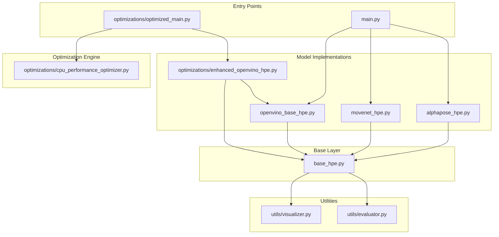
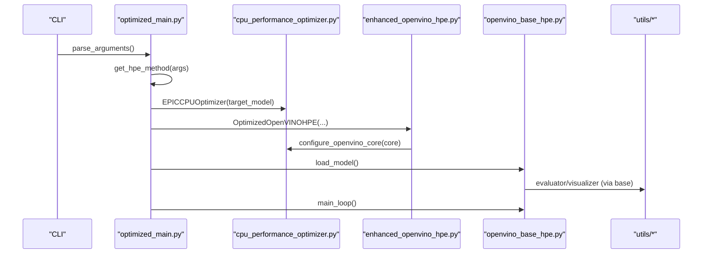
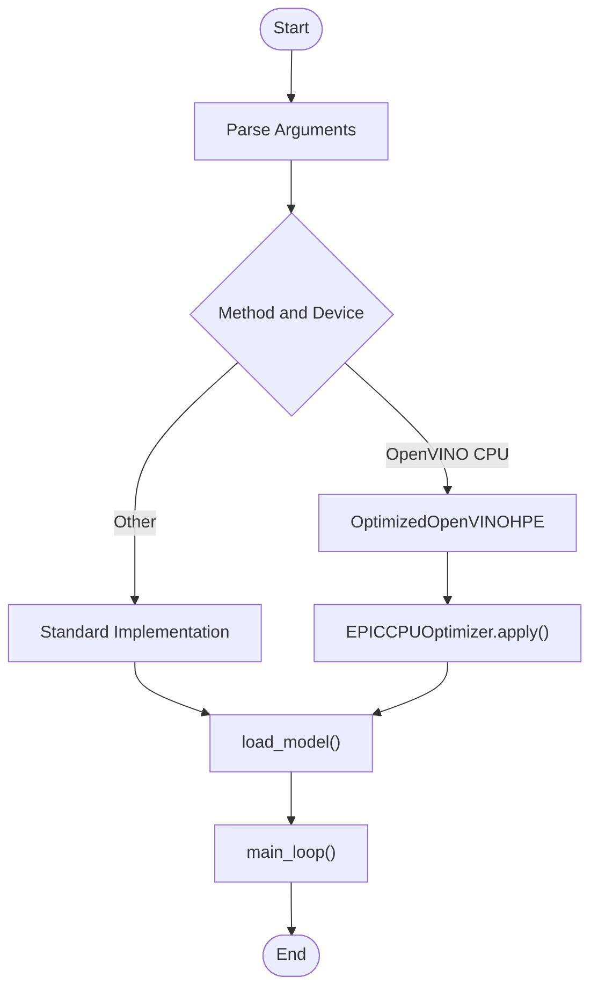
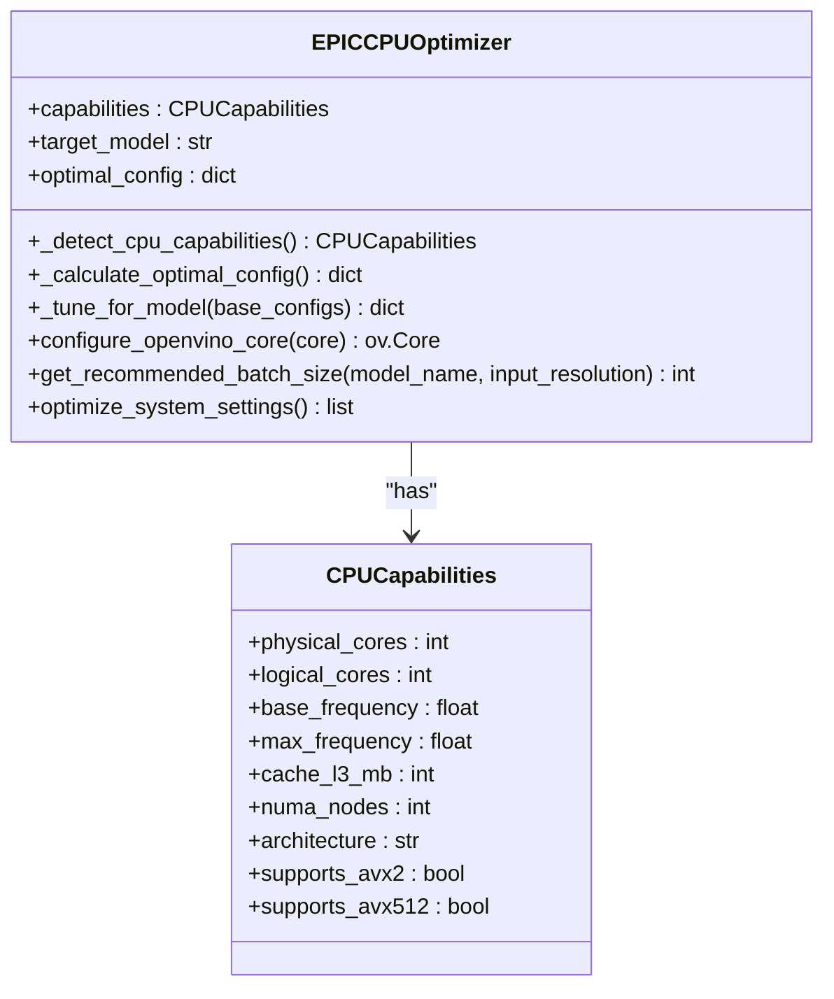
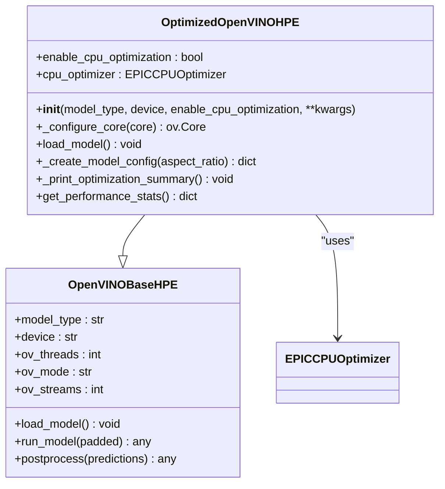
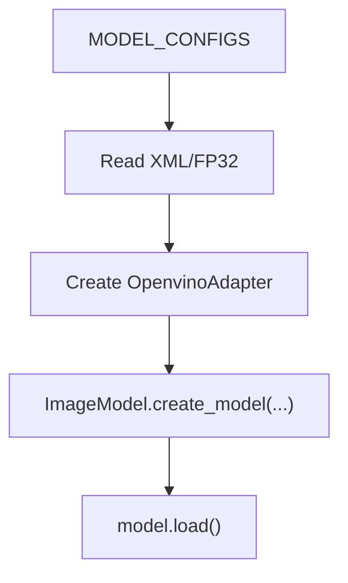
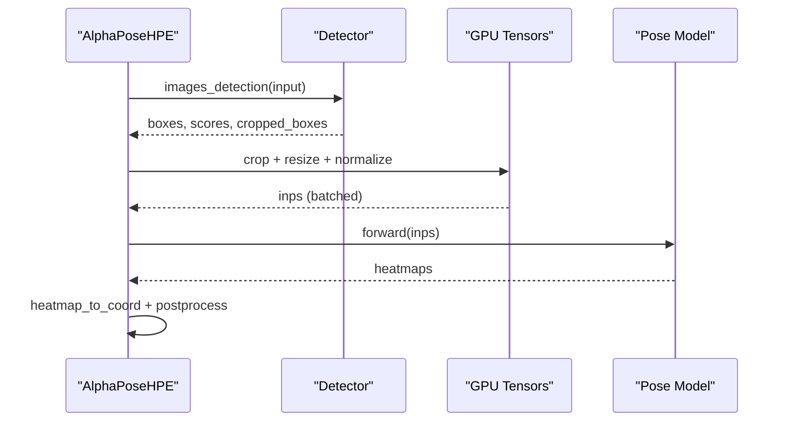
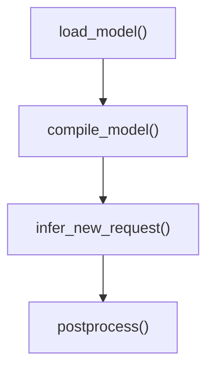
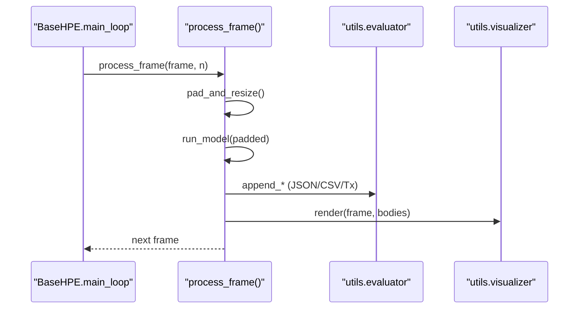
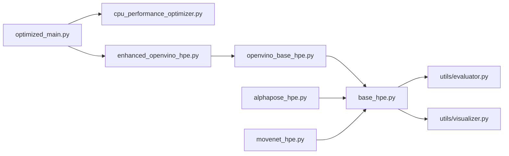

# Model Optimization

<cite>
**Referenced Files in This Document**
- [main.py](file://main.py)
- [optimizations/optimized_main.py](file://optimizations/optimized_main.py)
- [optimizations/enhanced_openvino_hpe.py](file://optimizations/enhanced_openvino_hpe.py)
- [optimizations/cpu_performance_optimizer.py](file://optimizations/cpu_performance_optimizer.py)
- [openvino_base_hpe.py](file://openvino_base_hpe.py)
- [movenet_hpe.py](file://movenet_hpe.py)
- [alphapose_hpe.py](file://alphapose_hpe.py)
- [base_hpe.py](file://base_hpe.py)
- [utils/evaluator.py](file://utils/evaluator.py)
- [utils/visualizer.py](file://utils/visualizer.py)
- [OPTIMIZATION_PLAN.md](file://OPTIMIZATION_PLAN.md)
</cite>

## Table of Contents
1. [Introduction](#introduction)
2. [Project Structure](#project-structure)
3. [Core Components](#core-components)
4. [Architecture Overview](#architecture-overview)
5. [Detailed Component Analysis](#detailed-component-analysis)
6. [Dependency Analysis](#dependency-analysis)
7. [Performance Considerations](#performance-considerations)
8. [Troubleshooting Guide](#troubleshooting-guide)
9. [Conclusion](#conclusion)
10. [Appendices](#appendices)

## Introduction
This document explains model optimization techniques implemented in the Human Pose Estimation (HPE) framework, focusing on CPU and OpenVINO optimizations, model selection logic, and performance benchmarking. It also provides guidance for quantization, pruning, and compression strategies, along with practical workflows for model conversion and evaluation. The content is grounded in the repository’s codebase and optimization plans.

## Project Structure
The HPE system is composed of:
- A base abstraction layer for HPE implementations
- Model-specific runners for AlphaPose, MoveNet, and OpenVINO-backed models
- An optimized orchestration entry point with CPU tuning and benchmarking
- Utilities for evaluation and visualization
- A comprehensive optimization plan detailing GPU memory, CPU threading, and system-level improvements

**Diagram sources**
- [optimizations/optimized_main.py:1-257](file://optimizations/optimized_main.py#L1-L257)
- [openvino_base_hpe.py:1-653](file://openvino_base_hpe.py#L1-L653)
- [movenet_hpe.py:1-111](file://movenet_hpe.py#L1-L111)
- [alphapose_hpe.py:1-334](file://alphapose_hpe.py#L1-L334)
- [base_hpe.py:1-546](file://base_hpe.py#L1-L546)
- [utils/evaluator.py:1-114](file://utils/evaluator.py#L1-L114)
- [utils/visualizer.py:1-49](file://utils/visualizer.py#L1-L49)

**Section sources**
- [main.py:1-99](file://main.py#L1-L99)
- [optimizations/optimized_main.py:1-257](file://optimizations/optimized_main.py#L1-L257)
- [base_hpe.py:1-546](file://base_hpe.py#L1-L546)

## Core Components
- Base HPE abstraction defines input handling, padding/resizing, processing loop, and rendering/export utilities.
- OpenVINO-backed models encapsulate model loading, preprocessing, inference, and postprocessing.
- AlphaPose runner integrates detection and pose estimation with GPU-accelerated preprocessing.
- MoveNet runner provides a lightweight CPU-friendly inference path.
- Optimized orchestrator adds CPU tuning, automatic configuration, and benchmarking for OpenVINO models.

Key responsibilities:
- Model selection logic chooses the appropriate implementation based on method/device.
- CPU optimization engine detects hardware capabilities and applies tuned OpenVINO properties.
- Benchmarking compares standard vs optimized performance for OpenVINO models.

**Section sources**
- [base_hpe.py:36-546](file://base_hpe.py#L36-L546)
- [openvino_base_hpe.py:55-261](file://openvino_base_hpe.py#L55-L261)
- [alphapose_hpe.py:33-334](file://alphapose_hpe.py#L33-L334)
- [movenet_hpe.py:12-111](file://movenet_hpe.py#L12-L111)
- [optimizations/enhanced_openvino_hpe.py:25-218](file://optimizations/enhanced_openvino_hpe.py#L25-L218)
- [optimizations/cpu_performance_optimizer.py:34-404](file://optimizations/cpu_performance_optimizer.py#L34-L404)

## Architecture Overview
The optimized runtime composes:
- CLI entry points selecting model implementations
- CPU optimizer detecting system capabilities and applying OpenVINO tuning
- Enhanced OpenVINO HPE wrapping base OpenVINO with CPU-specific configuration
- Evaluation and visualization utilities integrated into the processing loop

**Diagram sources**
- [optimizations/optimized_main.py:127-186](file://optimizations/optimized_main.py#L127-L186)
- [optimizations/cpu_performance_optimizer.py:336-404](file://optimizations/cpu_performance_optimizer.py#L336-L404)
- [optimizations/enhanced_openvino_hpe.py:67-131](file://optimizations/enhanced_openvino_hpe.py#L67-L131)
- [openvino_base_hpe.py:183-261](file://openvino_base_hpe.py#L183-L261)
- [base_hpe.py:405-519](file://base_hpe.py#L405-L519)

## Detailed Component Analysis

### Optimized Orchestration and Model Selection
- The optimized entry point selects model implementations and enables CPU optimization for OpenVINO models on CPU devices.
- It maps high-level method names to internal model types and passes optional overrides for threads/streams.
- It exposes benchmarking to compare standard vs optimized performance.

**Diagram sources**
- [optimizations/optimized_main.py:127-186](file://optimizations/optimized_main.py#L127-L186)
- [optimizations/optimized_main.py:201-247](file://optimizations/optimized_main.py#L201-L247)

**Section sources**
- [optimizations/optimized_main.py:82-125](file://optimizations/optimized_main.py#L82-L125)
- [optimizations/optimized_main.py:127-186](file://optimizations/optimized_main.py#L127-L186)
- [optimizations/optimized_main.py:201-247](file://optimizations/optimized_main.py#L201-L247)

### CPU Performance Optimizer (EPIC 7551P)
- Detects CPU capabilities (cores, frequency, AVX support, NUMA nodes).
- Calculates optimal configurations for throughput/latency modes, threads, streams, and memory patterns.
- Applies OpenVINO properties and environment variables for CPU pinning, hyper-threading, and thread counts.
- Provides recommended batch sizes based on memory and CPU limits.

**Diagram sources**
- [optimizations/cpu_performance_optimizer.py:20-404](file://optimizations/cpu_performance_optimizer.py#L20-L404)

**Section sources**
- [optimizations/cpu_performance_optimizer.py:34-404](file://optimizations/cpu_performance_optimizer.py#L34-L404)

### Enhanced OpenVINO HPE
- Wraps base OpenVINO HPE with CPU optimization, overriding threading and performance settings.
- Creates optimized model adapters and loads models with tuned configurations.
- Prints optimization summaries and exposes performance statistics.

**Diagram sources**
- [optimizations/enhanced_openvino_hpe.py:25-218](file://optimizations/enhanced_openvino_hpe.py#L25-L218)
- [openvino_base_hpe.py:55-261](file://openvino_base_hpe.py#L55-L261)

**Section sources**
- [optimizations/enhanced_openvino_hpe.py:25-218](file://optimizations/enhanced_openvino_hpe.py#L25-L218)
- [openvino_base_hpe.py:55-261](file://openvino_base_hpe.py#L55-L261)

### OpenVINO Model Configurations and Loading
- Defines model configurations for OpenPose, EfficientHRNet variants, and HigherHRNet.
- Loads models via OpenVINO API, prints network details, and constructs model adapters.
- Supports CPU/GPU devices with model-specific GPU support flags.

**Diagram sources**
- [openvino_base_hpe.py:22-53](file://openvino_base_hpe.py#L22-L53)
- [openvino_base_hpe.py:183-261](file://openvino_base_hpe.py#L183-L261)

**Section sources**
- [openvino_base_hpe.py:22-53](file://openvino_base_hpe.py#L22-L53)
- [openvino_base_hpe.py:183-261](file://openvino_base_hpe.py#L183-L261)

### AlphaPose Implementation
- Integrates detection and pose estimation with GPU-accelerated preprocessing.
- Implements GPU-native cropping and resizing using functional transforms.
- Manages batching and normalization on GPU tensors.

**Diagram sources**
- [alphapose_hpe.py:126-294](file://alphapose_hpe.py#L126-L294)

**Section sources**
- [alphapose_hpe.py:33-334](file://alphapose_hpe.py#L33-L334)

### MoveNet Implementation
- Uses OpenVINO runtime to compile and run a multipose Lightning model.
- Handles video capture and inference with minimal preprocessing.

**Diagram sources**
- [movenet_hpe.py:58-111](file://movenet_hpe.py#L58-L111)

**Section sources**
- [movenet_hpe.py:12-111](file://movenet_hpe.py#L12-L111)

### Base HPE Processing Loop and Utilities
- Central processing loop handles PyNvCodec, OpenCV fallback, and streaming timeouts.
- Rendering and evaluation utilities integrate COCO-format exports and throughput measurements.

**Diagram sources**
- [base_hpe.py:207-398](file://base_hpe.py#L207-L398)
- [utils/evaluator.py:35-114](file://utils/evaluator.py#L35-L114)
- [utils/visualizer.py:4-49](file://utils/visualizer.py#L4-L49)

**Section sources**
- [base_hpe.py:207-398](file://base_hpe.py#L207-L398)
- [utils/evaluator.py:35-114](file://utils/evaluator.py#L35-L114)
- [utils/visualizer.py:4-49](file://utils/visualizer.py#L4-L49)

## Dependency Analysis
- The optimized entry point depends on the CPU optimizer and enhanced OpenVINO HPE to deliver tuned performance.
- OpenVINO models depend on the base HPE for shared processing utilities and evaluation.
- AlphaPose and MoveNet implementations are standalone but leverage the base HPE for IO and rendering.

**Diagram sources**
- [optimizations/optimized_main.py:127-186](file://optimizations/optimized_main.py#L127-L186)
- [optimizations/enhanced_openvino_hpe.py:67-131](file://optimizations/enhanced_openvino_hpe.py#L67-L131)
- [openvino_base_hpe.py:183-261](file://openvino_base_hpe.py#L183-L261)
- [base_hpe.py:405-519](file://base_hpe.py#L405-L519)

**Section sources**
- [optimizations/optimized_main.py:127-186](file://optimizations/optimized_main.py#L127-L186)
- [openvino_base_hpe.py:55-261](file://openvino_base_hpe.py#L55-L261)
- [base_hpe.py:405-519](file://base_hpe.py#L405-L519)

## Performance Considerations
- CPU tuning: The CPU optimizer dynamically sets threads, streams, performance hints, and CPU pinning based on detected hardware and model characteristics.
- Throughput vs latency: Performance hints are selected per workload pattern; higher core counts favor throughput, lower counts favor latency.
- Memory bandwidth: Memory pattern tuning adjusts request counts and stream configurations to reduce contention.
- Batch sizing: Recommended batch sizes balance memory footprint and CPU capacity.

Practical guidance:
- Prefer latency mode for small-core systems and throughput mode for high-core systems.
- Use single-stream configurations for stability; increase streams cautiously.
- Monitor NUMA topology and enable CPU pinning for multi-socket systems.

**Section sources**
- [optimizations/cpu_performance_optimizer.py:100-335](file://optimizations/cpu_performance_optimizer.py#L100-L335)
- [optimizations/enhanced_openvino_hpe.py:67-131](file://optimizations/enhanced_openvino_hpe.py#L67-L131)

## Troubleshooting Guide
Common issues and resolutions:
- GPU-CPU transfer bottlenecks: The optimization plan identifies PCIe transfer overhead and RGB/BGR conversions on CPU as major bottlenecks. Address by keeping tensors on GPU and avoiding unnecessary host-device copies.
- Suboptimal CPU threading: OpenCV threads are limited globally; tune inference threads separately and avoid contention between OpenVINO and OpenCV.
- Inefficient memory allocation: Repeated allocations cause fragmentation; adopt memory pooling and reuse patterns.
- Data export overhead: JSON serialization in loops increases latency; batch and stream results to reduce serialization cost.

Actionable checks:
- Verify OpenVINO properties were applied by inspecting effective settings printed during core configuration.
- Confirm GPU tensors remain on device during preprocessing and inference.
- Validate batch sizes against available memory and CPU capacity.

**Section sources**
- [OPTIMIZATION_PLAN.md:7-78](file://OPTIMIZATION_PLAN.md#L7-L78)
- [openvino_base_hpe.py:153-182](file://openvino_base_hpe.py#L153-L182)
- [base_hpe.py:405-485](file://base_hpe.py#L405-L485)

## Conclusion
The HPE framework integrates CPU-specific tuning for OpenVINO models, streamlined model selection logic, and benchmarking to improve performance. The optimization plan outlines GPU memory pooling, GPU-native preprocessing, and system-level threading improvements. Together, these techniques enable significant throughput gains, reduced memory usage, and predictable performance across diverse deployment environments.

## Appendices

### Model-Specific Optimization Strategies
- OpenPose: Favor throughput mode on high-core systems; use moderate batches and single-stream for stability.
- EfficientHRNet variants: Increase batch sizes and streams for better parallelism; ensure memory bandwidth alignment.
- HigherHRNet: Use throughput mode with pinned CPUs and limited streams due to heavy compute requirements.
- AlphaPose: Keep tensors on GPU; batch crops and resize operations; minimize host-device transfers.
- MoveNet: Leverage CPU-friendly inference; reduce preprocessing overhead.

**Section sources**
- [optimizations/cpu_performance_optimizer.py:228-335](file://optimizations/cpu_performance_optimizer.py#L228-L335)
- [OPTIMIZATION_PLAN.md:154-215](file://OPTIMIZATION_PLAN.md#L154-L215)

### Quantization, Pruning, and Compression Guidelines
- Quantization:
  - Post-training quantization (PTQ): Convert FP32 models to INT8 for reduced memory and improved throughput on CPU.
  - Quantization-aware training (QAT): Retrain models with quantization constraints for accuracy preservation.
  - Calibration: Use representative datasets to select appropriate quantization ranges.
- Pruning:
  - Magnitude-based pruning: Remove low-importance weights iteratively; fine-tune to recover accuracy.
  - Structured pruning: Target channels or layers to improve inference acceleration.
- Compression:
  - Knowledge distillation: Train compact student models guided by teacher models.
  - Low-rank factorization: Decompose weight matrices to reduce parameters.
  - ONNX Runtime optimizations: Enable graph optimization, kernel fusion, and layout optimizations.

Note: These strategies are general best practices. Their application depends on model formats, frameworks, and deployment targets.

[No sources needed since this section provides general guidance]

### Practical Workflows and Evaluation Methodologies
- Quantization workflow:
  - Prepare calibration dataset.
  - Calibrate PTQ or train QAT model.
  - Evaluate accuracy and latency on target hardware.
  - Integrate quantized models into the optimized runtime.
- Model conversion:
  - Convert checkpoints to ONNX.
  - Optimize with ONNX Runtime or OpenVINO model optimizer.
  - Validate correctness and performance.
- Benchmarking:
  - Use the built-in benchmark function to compare standard vs optimized FPS.
  - Measure end-to-end latency and throughput across input types.
  - Track memory usage and GPU utilization with profiling tools.

**Section sources**
- [optimizations/enhanced_openvino_hpe.py:246-305](file://optimizations/enhanced_openvino_hpe.py#L246-L305)
- [OPTIMIZATION_PLAN.md:294-342](file://OPTIMIZATION_PLAN.md#L294-L342)

### Model Selection Guidelines
- Accuracy-performance trade-offs:
  - HigherHRNet offers superior accuracy but heavier compute; suitable for offline or high-performance servers.
  - EfficientHRNet variants balance accuracy and speed; choose based on input resolution and deployment constraints.
  - OpenPose provides good accuracy-speed balance on CPU; use throughput mode for multi-core servers.
  - MoveNet is lightweight and CPU-friendly; ideal for edge devices.
- Deployment constraints:
  - GPU availability: Some models are GPU-only; fallback to CPU when unsupported.
  - Memory budget: Larger models require more VRAM; adjust batch sizes accordingly.
  - Latency requirements: Prefer latency mode and single-stream configurations for real-time applications.

**Section sources**
- [openvino_base_hpe.py:87-91](file://openvino_base_hpe.py#L87-L91)
- [optimizations/cpu_performance_optimizer.py:405-443](file://optimizations/cpu_performance_optimizer.py#L405-L443)