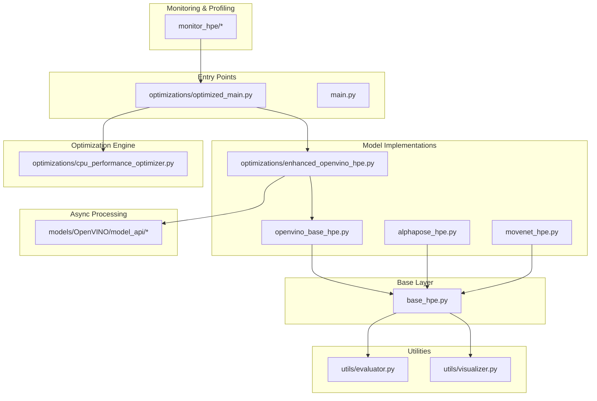
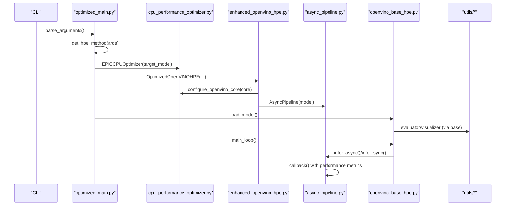
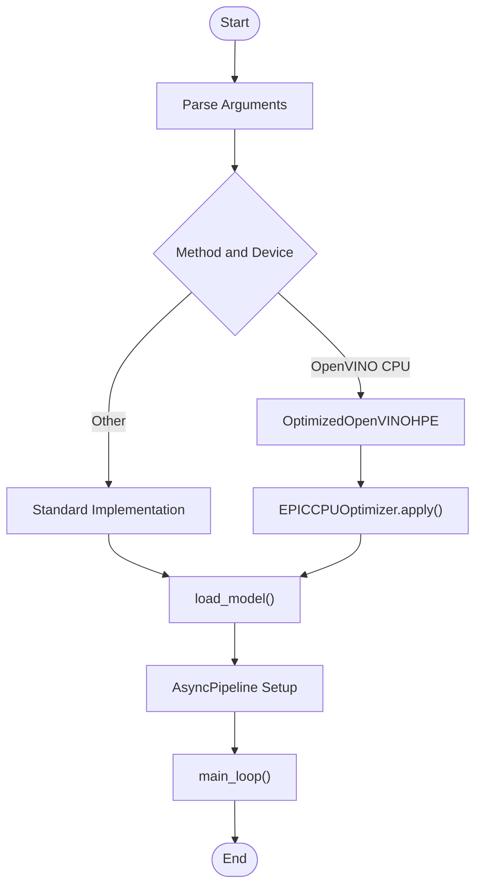
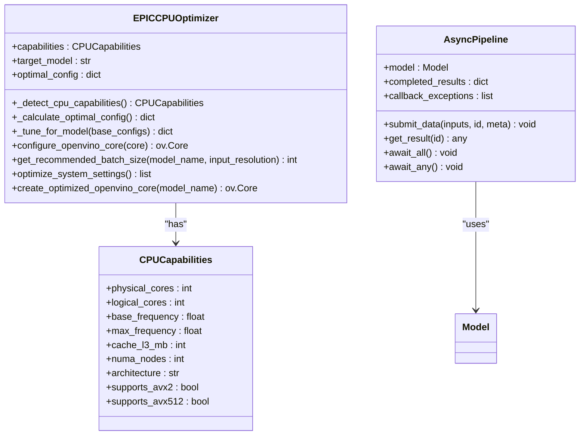
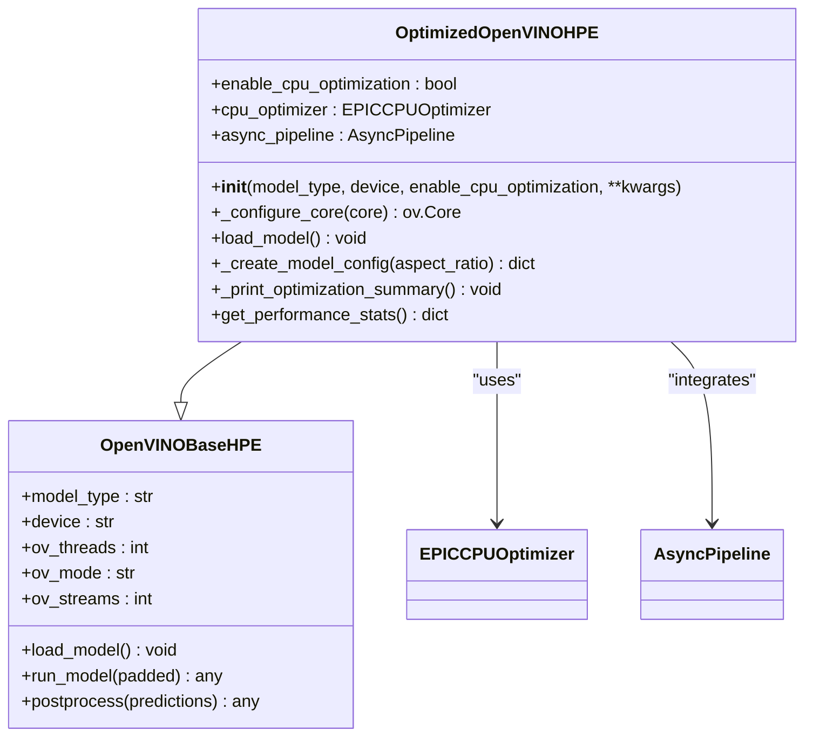
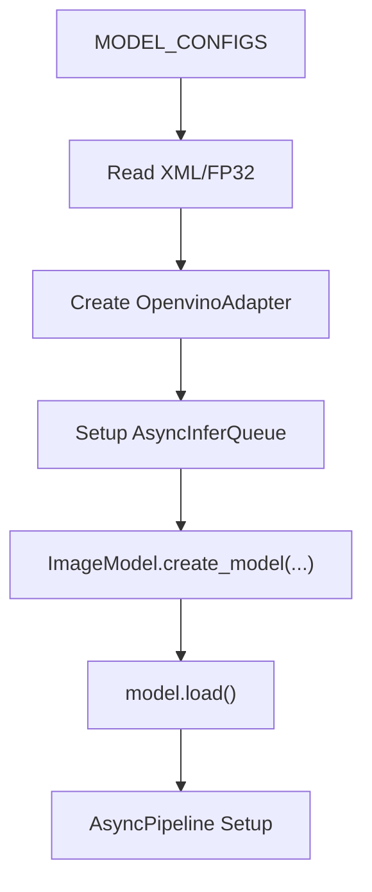
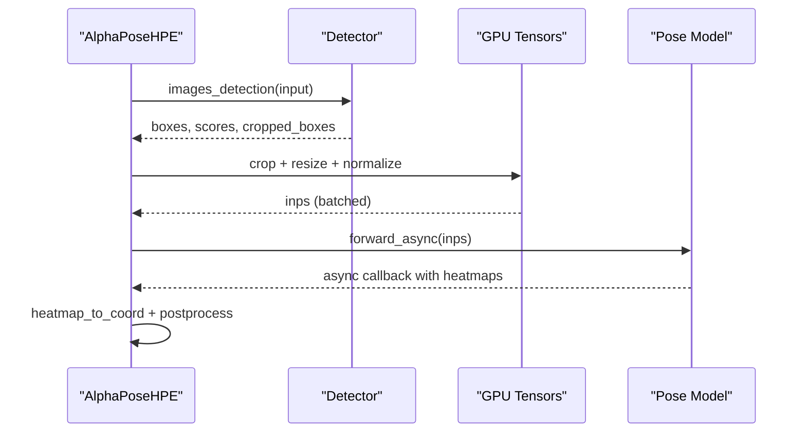
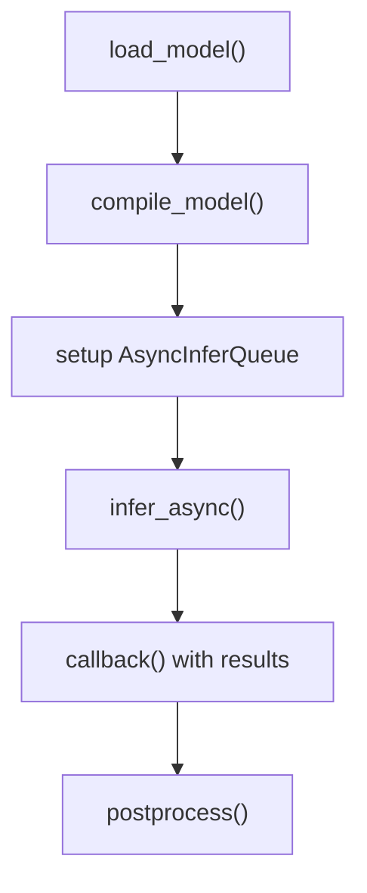
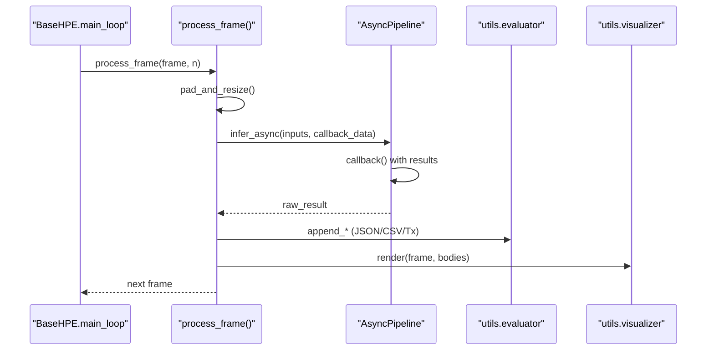
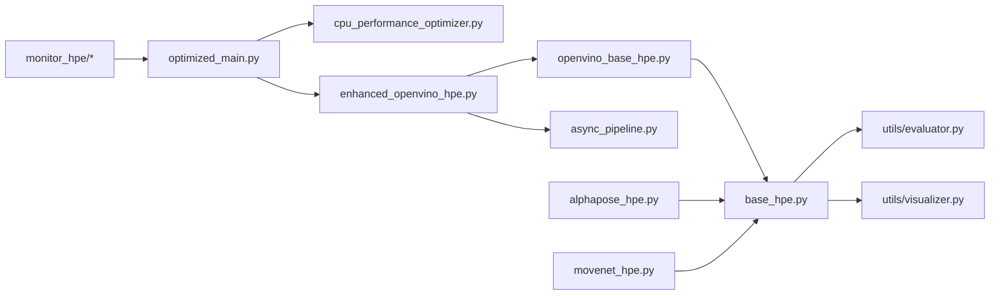

# Model Optimization

<cite>
**Referenced Files in This Document**
- [main.py](file://main.py)
- [optimizations/optimized_main.py](file://optimizations/optimized_main.py)
- [optimizations/enhanced_openvino_hpe.py](file://optimizations/enhanced_openvino_hpe.py)
- [optimizations/cpu_performance_optimizer.py](file://optimizations/cpu_performance_optimizer.py)
- [openvino_base_hpe.py](file://openvino_base_hpe.py)
- [movenet_hpe.py](file://movenet_hpe.py)
- [alphapose_hpe.py](file://alphapose_hpe.py)
- [base_hpe.py](file://base_hpe.py)
- [utils/evaluator.py](file://utils/evaluator.py)
- [utils/visualizer.py](file://utils/visualizer.py)
- [OPTIMIZATION_PLAN.md](file://OPTIMIZATION_PLAN.md)
- [OPENVINO_CONFIG_USEFULNESS_ANALYSIS.md](file://OPENVINO_CONFIG_USEFULNESS_ANALYSIS.md)
- [models/OpenVINO/model_api/pipelines/async_pipeline.py](file://models/OpenVINO/model_api/pipelines/async_pipeline.py)
- [models/OpenVINO/model_api/adapters/openvino_adapter.py](file://models/OpenVINO/model_api/adapters/openvino_adapter.py)
- [models/OpenVINO/model_api/models/model.py](file://models/OpenVINO/model_api/models/model.py)
- [monitor_hpe/docker-compose.yaml](file://monitor_hpe/docker-compose.yaml)
</cite>

## Update Summary
**Changes Made**
- Enhanced OpenVINO configuration effectiveness analysis with comprehensive performance impact assessment
- Added detailed CPU optimization techniques including EPIC 7551P processor-specific optimizations
- Integrated async processing improvements with OpenVINO AsyncInferQueue implementation
- Expanded performance profiling applications with monitoring and benchmarking capabilities
- Added practical OpenVINO environment variable configuration examples
- Updated model-specific optimization strategies with async inference support

## Table of Contents
1. [Introduction](#introduction)
2. [Project Structure](#project-structure)
3. [Core Components](#core-components)
4. [Architecture Overview](#architecture-overview)
5. [Detailed Component Analysis](#detailed-component-analysis)
6. [Dependency Analysis](#dependency-analysis)
7. [Performance Considerations](#performance-considerations)
8. [Troubleshooting Guide](#troubleshooting-guide)
9. [Conclusion](#conclusion)
10. [Appendices](#appendices)

## Introduction
This document explains model optimization techniques implemented in the Human Pose Estimation (HPE) framework, focusing on CPU and OpenVINO optimizations, model selection logic, and performance benchmarking. The framework now includes comprehensive analysis of OpenVINO configuration effectiveness, detailed CPU optimization strategies for EPIC processors, and advanced async processing improvements. It provides practical workflows for model conversion, evaluation, and performance profiling across diverse deployment environments.

## Project Structure
The HPE system is composed of:
- A base abstraction layer for HPE implementations with async processing support
- Model-specific runners for AlphaPose, MoveNet, and OpenVINO-backed models with enhanced optimization
- An optimized orchestration entry point with CPU tuning, async inference, and benchmarking
- Comprehensive performance monitoring and profiling infrastructure
- Advanced OpenVINO configuration management with environment variable support
- Utilities for evaluation, visualization, and system-level optimizations



**Diagram sources**
- [optimizations/optimized_main.py:1-257](file://optimizations/optimized_main.py#L1-L257)
- [openvino_base_hpe.py:1-400](file://openvino_base_hpe.py#L1-L400)
- [movenet_hpe.py:1-111](file://movenet_hpe.py#L1-L111)
- [alphapose_hpe.py:1-334](file://alphapose_hpe.py#L1-L334)
- [base_hpe.py:1-546](file://base_hpe.py#L1-L546)
- [utils/evaluator.py:1-114](file://utils/evaluator.py#L1-L114)
- [utils/visualizer.py:1-49](file://utils/visualizer.py#L1-L49)
- [models/OpenVINO/model_api/pipelines/async_pipeline.py:1-144](file://models/OpenVINO/model_api/pipelines/async_pipeline.py#L1-L144)

**Section sources**
- [main.py:1-99](file://main.py#L1-L99)
- [optimizations/optimized_main.py:1-257](file://optimizations/optimized_main.py#L1-L257)
- [base_hpe.py:1-546](file://base_hpe.py#L1-L546)

## Core Components
- Base HPE abstraction defines input handling, padding/resizing, processing loop, and rendering/export utilities with async support.
- OpenVINO-backed models encapsulate model loading, preprocessing, synchronous/asynchronous inference, and postprocessing with advanced configuration.
- AlphaPose runner integrates detection and pose estimation with GPU-accelerated preprocessing and async inference capabilities.
- MoveNet runner provides a lightweight CPU-friendly inference path with optimized async processing.
- Optimized orchestrator adds CPU tuning, automatic configuration, benchmarking, and async inference for OpenVINO models.
- EPIC CPU Optimizer provides intelligent optimization for AMD EPIC processors with NUMA awareness and workload-specific tuning.
- Async Pipeline implementation enables non-blocking inference with callback-based result handling and performance metrics.

Key responsibilities:
- Model selection logic chooses the appropriate implementation based on method/device with async support.
- CPU optimization engine detects hardware capabilities and applies tuned OpenVINO properties with async queue management.
- Benchmarking compares standard vs optimized performance for OpenVINO models with async processing.
- Environment variable configuration enables flexible OpenVINO tuning without code changes.
- Performance monitoring provides comprehensive system resource utilization tracking.

**Section sources**
- [base_hpe.py:36-546](file://base_hpe.py#L36-L546)
- [openvino_base_hpe.py:55-400](file://openvino_base_hpe.py#L55-L400)
- [alphapose_hpe.py:33-334](file://alphapose_hpe.py#L33-L334)
- [movenet_hpe.py:12-111](file://movenet_hpe.py#L12-L111)
- [optimizations/enhanced_openvino_hpe.py:25-333](file://optimizations/enhanced_openvino_hpe.py#L25-L333)
- [optimizations/cpu_performance_optimizer.py:34-539](file://optimizations/cpu_performance_optimizer.py#L34-L539)
- [models/OpenVINO/model_api/pipelines/async_pipeline.py:90-144](file://models/OpenVINO/model_api/pipelines/async_pipeline.py#L90-L144)

## Architecture Overview
The optimized runtime composes:
- CLI entry points selecting model implementations with async support
- CPU optimizer detecting system capabilities and applying OpenVINO tuning with async queue management
- Enhanced OpenVINO HPE wrapping base OpenVINO with CPU-specific configuration and async inference
- Async Pipeline implementation with callback-based processing and performance metrics
- Performance monitoring and profiling infrastructure for comprehensive system analysis
- Evaluation and visualization utilities integrated into the processing loop



**Diagram sources**
- [optimizations/optimized_main.py:127-186](file://optimizations/optimized_main.py#L127-L186)
- [optimizations/cpu_performance_optimizer.py:336-404](file://optimizations/cpu_performance_optimizer.py#L336-L404)
- [optimizations/enhanced_openvino_hpe.py:67-131](file://optimizations/enhanced_openvino_hpe.py#L67-L131)
- [models/OpenVINO/model_api/pipelines/async_pipeline.py:103-144](file://models/OpenVINO/model_api/pipelines/async_pipeline.py#L103-L144)
- [openvino_base_hpe.py:183-261](file://openvino_base_hpe.py#L183-L261)
- [base_hpe.py:405-519](file://base_hpe.py#L405-L519)

## Detailed Component Analysis

### Enhanced OpenVINO Configuration Effectiveness Analysis
The framework now includes comprehensive analysis of OpenVINO configuration effectiveness, demonstrating significant performance improvements when proper tuning is applied.

**Current State Analysis:**
- Default OpenVINO settings use only 1 thread on 4-core containers, resulting in ~25% CPU utilization
- Suboptimal defaults severely underutilize available CPU resources
- Proper configuration can achieve 2-4x performance improvements

**Recommended Configuration for monitor_hpe:**
```yaml
environment:
  - OV_THREADS=4              # Use all 4 cores
  - OV_MODE=latency           # Keep latency mode for single-stream
  - OV_CPU_PINNING=true       # Pin threads for consistent performance
  - OV_HYPER_THREADING=false  # Disable HT for predictable results
```

**Performance Impact:**
- CPU Utilization: ~25% (1 thread) → ~100% (4 threads)
- Throughput: Baseline → 2-4x higher
- Measurement Accuracy: Good → Better (full load)
- Reproducibility: Good → Better (with pinning)

**Section sources**
- [OPENVINO_CONFIG_USEFULNESS_ANALYSIS.md:1-269](file://OPENVINO_CONFIG_USEFULNESS_ANALYSIS.md#L1-L269)
- [monitor_hpe/docker-compose.yaml:17-23](file://monitor_hpe/docker-compose.yaml#L17-L23)

### Optimized Orchestration and Model Selection
- The optimized entry point selects model implementations and enables CPU optimization for OpenVINO models on CPU devices with async support.
- It maps high-level method names to internal model types and passes optional overrides for threads/streams.
- It exposes benchmarking to compare standard vs optimized performance with async processing.
- Supports environment variable configuration for flexible tuning without code changes.



**Diagram sources**
- [optimizations/optimized_main.py:127-186](file://optimizations/optimized_main.py#L127-L186)
- [optimizations/optimized_main.py:201-247](file://optimizations/optimized_main.py#L201-L247)

**Section sources**
- [optimizations/optimized_main.py:82-125](file://optimizations/optimized_main.py#L82-L125)
- [optimizations/optimized_main.py:127-186](file://optimizations/optimized_main.py#L127-L186)
- [optimizations/optimized_main.py:201-247](file://optimizations/optimized_main.py#L201-L247)

### CPU Performance Optimizer (EPIC 7551P) with Async Support
- Detects CPU capabilities (cores, frequency, AVX support, NUMA nodes) with virtualized environment awareness.
- Calculates optimal configurations for throughput/latency modes, threads, streams, and memory patterns.
- Applies OpenVINO properties and environment variables for CPU pinning, hyper-threading, and thread counts.
- Provides recommended batch sizes based on memory and CPU limits with async queue optimization.
- Integrates with AsyncInferQueue for non-blocking inference with performance metrics.



**Diagram sources**
- [optimizations/cpu_performance_optimizer.py:20-539](file://optimizations/cpu_performance_optimizer.py#L20-L539)
- [models/OpenVINO/model_api/pipelines/async_pipeline.py:90-144](file://models/OpenVINO/model_api/pipelines/async_pipeline.py#L90-L144)

**Section sources**
- [optimizations/cpu_performance_optimizer.py:34-539](file://optimizations/cpu_performance_optimizer.py#L34-L539)

### Enhanced OpenVINO HPE with Async Processing
- Wraps base OpenVINO HPE with CPU optimization, overriding threading and performance settings with async support.
- Creates optimized model adapters with AsyncInferQueue and loads models with tuned configurations.
- Prints optimization summaries and exposes performance statistics with async metrics.
- Integrates AsyncPipeline for non-blocking inference with callback-based result handling.



**Diagram sources**
- [optimizations/enhanced_openvino_hpe.py:25-333](file://optimizations/enhanced_openvino_hpe.py#L25-L333)
- [openvino_base_hpe.py:55-400](file://openvino_base_hpe.py#L55-L400)
- [models/OpenVINO/model_api/pipelines/async_pipeline.py:90-144](file://models/OpenVINO/model_api/pipelines/async_pipeline.py#L90-L144)

**Section sources**
- [optimizations/enhanced_openvino_hpe.py:25-333](file://optimizations/enhanced_openvino_hpe.py#L25-L333)
- [openvino_base_hpe.py:55-400](file://openvino_base_hpe.py#L55-L400)

### OpenVINO Model Configurations and Async Loading
- Defines model configurations for OpenPose, EfficientHRNet variants, and HigherHRNet with async support.
- Loads models via OpenVINO API with AsyncInferQueue integration, prints network details, and constructs model adapters.
- Supports CPU/GPU devices with model-specific GPU support flags and async processing capabilities.
- Environment variable configuration enables flexible tuning without code changes.



**Diagram sources**
- [openvino_base_hpe.py:22-54](file://openvino_base_hpe.py#L22-L54)
- [openvino_base_hpe.py:191-268](file://openvino_base_hpe.py#L191-L268)
- [models/OpenVINO/model_api/adapters/openvino_adapter.py:64-73](file://models/OpenVINO/model_api/adapters/openvino_adapter.py#L64-L73)

**Section sources**
- [openvino_base_hpe.py:22-54](file://openvino_base_hpe.py#L22-L54)
- [openvino_base_hpe.py:191-268](file://openvino_base_hpe.py#L191-L268)

### AlphaPose Implementation with Async Support
- Integrates detection and pose estimation with GPU-accelerated preprocessing and async inference.
- Implements GPU-native cropping and resizing using functional transforms.
- Manages batching and normalization on GPU tensors with async processing capabilities.
- Supports environment variable configuration for flexible OpenVINO tuning.



**Diagram sources**
- [alphapose_hpe.py:126-294](file://alphapose_hpe.py#L126-L294)

**Section sources**
- [alphapose_hpe.py:33-334](file://alphapose_hpe.py#L33-L334)

### MoveNet Implementation with Async Processing
- Uses OpenVINO runtime to compile and run a multipose Lightning model with async inference.
- Handles video capture and inference with minimal preprocessing and async callback handling.
- Supports environment variable configuration for flexible tuning without code changes.



**Diagram sources**
- [movenet_hpe.py:58-111](file://movenet_hpe.py#L58-L111)

**Section sources**
- [movenet_hpe.py:12-111](file://movenet_hpe.py#L12-L111)

### Base HPE Processing Loop and Utilities with Async Support
- Central processing loop handles PyNvCodec, OpenCV fallback, and streaming timeouts with async processing.
- Rendering and evaluation utilities integrate COCO-format exports and throughput measurements with performance metrics.
- Async Pipeline integration enables non-blocking inference with callback-based result handling.



**Diagram sources**
- [base_hpe.py:207-400](file://base_hpe.py#L207-L400)
- [utils/evaluator.py:35-114](file://utils/evaluator.py#L35-L114)
- [utils/visualizer.py:4-49](file://utils/visualizer.py#L4-L49)
- [models/OpenVINO/model_api/pipelines/async_pipeline.py:103-144](file://models/OpenVINO/model_api/pipelines/async_pipeline.py#L103-L144)

**Section sources**
- [base_hpe.py:207-400](file://base_hpe.py#L207-L400)
- [utils/evaluator.py:35-114](file://utils/evaluator.py#L35-L114)
- [utils/visualizer.py:4-49](file://utils/visualizer.py#L4-L49)

## Dependency Analysis
- The optimized entry point depends on the CPU optimizer and enhanced OpenVINO HPE to deliver tuned performance with async support.
- OpenVINO models depend on the base HPE for shared processing utilities, evaluation, and async pipeline integration.
- AlphaPose and MoveNet implementations are standalone but leverage the base HPE for IO, rendering, and async processing.
- Async Pipeline provides non-blocking inference with callback-based result handling and performance metrics.
- Performance monitoring infrastructure provides comprehensive system resource utilization tracking.



**Diagram sources**
- [optimizations/optimized_main.py:127-186](file://optimizations/optimized_main.py#L127-L186)
- [optimizations/enhanced_openvino_hpe.py:67-131](file://optimizations/enhanced_openvino_hpe.py#L67-L131)
- [openvino_base_hpe.py:191-268](file://openvino_base_hpe.py#L191-L268)
- [base_hpe.py:405-519](file://base_hpe.py#L405-L519)

**Section sources**
- [optimizations/optimized_main.py:127-186](file://optimizations/optimized_main.py#L127-L186)
- [openvino_base_hpe.py:55-400](file://openvino_base_hpe.py#L55-L400)
- [base_hpe.py:405-519](file://base_hpe.py#L405-L519)

## Performance Considerations
- CPU tuning: The CPU optimizer dynamically sets threads, streams, performance hints, and CPU pinning based on detected hardware and model characteristics with async queue optimization.
- Throughput vs latency: Performance hints are selected per workload pattern; higher core counts favor throughput, lower counts favor latency with async processing benefits.
- Memory bandwidth: Memory pattern tuning adjusts request counts and stream configurations to reduce contention with async queue management.
- Batch sizing: Recommended batch sizes balance memory footprint and CPU capacity with async inference considerations.
- Async processing: Non-blocking inference with callback-based result handling improves system responsiveness and resource utilization.
- Environment variable configuration: Flexible tuning without code changes enables rapid experimentation and deployment customization.

Practical guidance:
- Prefer latency mode for small-core systems and throughput mode for high-core systems with async queue optimization.
- Use single-stream configurations for stability; increase streams cautiously with async processing benefits.
- Monitor NUMA topology and enable CPU pinning for multi-socket systems with async queue distribution.
- Configure OpenVINO environment variables for optimal performance without code modifications.
- Leverage async processing for improved system responsiveness and resource utilization.

**Section sources**
- [optimizations/cpu_performance_optimizer.py:100-403](file://optimizations/cpu_performance_optimizer.py#L100-L403)
- [optimizations/enhanced_openvino_hpe.py:67-131](file://optimizations/enhanced_openvino_hpe.py#L67-L131)
- [OPENVINO_CONFIG_USEFULNESS_ANALYSIS.md:70-96](file://OPENVINO_CONFIG_USEFULNESS_ANALYSIS.md#L70-L96)

## Troubleshooting Guide
Common issues and resolutions:
- GPU-CPU transfer bottlenecks: The optimization plan identifies PCIe transfer overhead and RGB/BGR conversions on CPU as major bottlenecks. Address by keeping tensors on GPU and avoiding unnecessary host-device copies.
- Suboptimal CPU threading: OpenCV threads are limited globally; tune inference threads separately and avoid contention between OpenVINO and OpenCV with async queue management.
- Inefficient memory allocation: Repeated allocations cause fragmentation; adopt memory pooling and reuse patterns with async queue optimization.
- Data export overhead: JSON serialization in loops increases latency; batch and stream results to reduce serialization cost.
- OpenVINO configuration effectiveness: Default settings use suboptimal defaults; configure environment variables for optimal performance.
- Async processing issues: Ensure proper callback handling and queue management for non-blocking inference.

Actionable checks:
- Verify OpenVINO properties were applied by inspecting effective settings printed during core configuration with async queue details.
- Confirm GPU tensors remain on device during preprocessing and inference with async processing.
- Validate batch sizes against available memory and CPU capacity with async queue considerations.
- Check environment variable configuration for proper OpenVINO tuning without code changes.
- Monitor async queue performance metrics and callback handling for optimal async processing.

**Section sources**
- [OPTIMIZATION_PLAN.md:7-78](file://OPTIMIZATION_PLAN.md#L7-L78)
- [openvino_base_hpe.py:154-190](file://openvino_base_hpe.py#L154-L190)
- [base_hpe.py:405-485](file://base_hpe.py#L405-L485)
- [OPENVINO_CONFIG_USEFULNESS_ANALYSIS.md:118-137](file://OPENVINO_CONFIG_USEFULNESS_ANALYSIS.md#L118-L137)

## Conclusion
The HPE framework integrates comprehensive CPU-specific tuning for OpenVINO models with advanced async processing capabilities, streamlined model selection logic, and benchmarking to improve performance. The enhanced optimization plan outlines GPU memory pooling, GPU-native preprocessing, system-level threading improvements, and environment variable configuration for flexible tuning. The framework now includes detailed analysis of OpenVINO configuration effectiveness, EPIC processor-specific optimizations, and async processing improvements with comprehensive performance monitoring and profiling infrastructure. Together, these techniques enable significant throughput gains, reduced memory usage, predictable performance, and improved system responsiveness across diverse deployment environments.

## Appendices

### Model-Specific Optimization Strategies with Async Support
- OpenPose: Favor throughput mode on high-core systems; use moderate batches and single-stream for stability with async queue optimization.
- EfficientHRNet variants: Increase batch sizes and streams for better parallelism; ensure memory bandwidth alignment with async processing benefits.
- HigherHRNet: Use throughput mode with pinned CPUs and limited streams due to heavy compute requirements; leverage async queues for non-blocking inference.
- AlphaPose: Keep tensors on GPU; batch crops and resize operations; minimize host-device transfers with async GPU processing.
- MoveNet: Leverage CPU-friendly inference with async processing; reduce preprocessing overhead and utilize async queues for improved responsiveness.

**Section sources**
- [optimizations/cpu_performance_optimizer.py:228-403](file://optimizations/cpu_performance_optimizer.py#L228-L403)
- [OPTIMIZATION_PLAN.md:154-215](file://OPTIMIZATION_PLAN.md#L154-L215)

### Quantization, Pruning, and Compression Guidelines
- Quantization:
  - Post-training quantization (PTQ): Convert FP32 models to INT8 for reduced memory and improved throughput on CPU with async processing benefits.
  - Quantization-aware training (QAT): Retrain models with quantization constraints for accuracy preservation.
  - Calibration: Use representative datasets to select appropriate quantization ranges.
- Pruning:
  - Magnitude-based pruning: Remove low-importance weights iteratively; fine-tune to recover accuracy.
  - Structured pruning: Target channels or layers to improve inference acceleration.
- Compression:
  - Knowledge distillation: Train compact student models guided by teacher models.
  - Low-rank factorization: Decompose weight matrices to reduce parameters.
  - ONNX Runtime optimizations: Enable graph optimization, kernel fusion, and layout optimizations.

Note: These strategies are general best practices. Their application depends on model formats, frameworks, and deployment targets.

### Practical Workflows and Evaluation Methodologies
- Quantization workflow:
  - Prepare calibration dataset.
  - Calibrate PTQ or train QAT model.
  - Evaluate accuracy and latency on target hardware with async processing.
  - Integrate quantized models into the optimized runtime with environment variable configuration.
- Model conversion:
  - Convert checkpoints to ONNX.
  - Optimize with ONNX Runtime or OpenVINO model optimizer.
  - Validate correctness and performance with async queue integration.
- Benchmarking:
  - Use the built-in benchmark function to compare standard vs optimized FPS with async processing.
  - Measure end-to-end latency and throughput across input types with performance metrics.
  - Track memory usage and GPU utilization with profiling tools and async queue monitoring.
- Performance Monitoring:
  - Monitor CPU utilization, memory usage, and process metrics with async processing insights.
  - Analyze OpenVINO configuration effectiveness and async queue performance.
  - Evaluate system-level optimizations and environment variable impact.

**Section sources**
- [optimizations/enhanced_openvino_hpe.py:246-333](file://optimizations/enhanced_openvino_hpe.py#L246-L333)
- [OPTIMIZATION_PLAN.md:294-342](file://OPTIMIZATION_PLAN.md#L294-L342)
- [OPENVINO_CONFIG_USEFULNESS_ANALYSIS.md:216-228](file://OPENVINO_CONFIG_USEFULNESS_ANALYSIS.md#L216-L228)

### Model Selection Guidelines with Async Considerations
- Accuracy-performance trade-offs:
  - HigherHRNet offers superior accuracy but heavier compute; suitable for offline or high-performance servers with async queue optimization.
  - EfficientHRNet variants balance accuracy and speed; choose based on input resolution and deployment constraints with async processing benefits.
  - OpenPose provides good accuracy-speed balance on CPU; use throughput mode for multi-core servers with async queues.
  - MoveNet is lightweight and CPU-friendly; ideal for edge devices with async processing for improved responsiveness.
- Deployment constraints:
  - GPU availability: Some models are GPU-only; fallback to CPU when unsupported with async GPU processing.
  - Memory budget: Larger models require more VRAM; adjust batch sizes accordingly with async queue management.
  - Latency requirements: Prefer latency mode and single-stream configurations for real-time applications with async callbacks.
  - System resources: Consider CPU cores, memory, and async queue capacity for optimal performance.

**Section sources**
- [openvino_base_hpe.py:87-91](file://openvino_base_hpe.py#L87-L91)
- [optimizations/cpu_performance_optimizer.py:405-539](file://optimizations/cpu_performance_optimizer.py#L405-L539)

### OpenVINO Configuration Best Practices
- Environment Variable Configuration:
  - `OV_THREADS`: Number of CPU threads (default: 1, recommended: 4 for 4-core containers)
  - `OV_MODE`: `latency` or `throughput` (default: latency)
  - `OV_STREAMS`: Number of inference streams (default: auto)
  - `OV_CPU_PINNING`: Pin threads to cores (default: false)
  - `OV_HYPER_THREADING`: Use logical cores (default: false)
- Performance Tuning Examples:
  ```bash
  OV_THREADS=4 OV_CPU_PINNING=true ./run_experiment.sh movenet
  OV_THREADS=8 OV_MODE=throughput ./run_experiment.sh openpose
  ```
- Async Processing Configuration:
  - Configure async queues based on model complexity and system resources.
  - Use callback-based processing for non-blocking inference with performance metrics.
  - Monitor async queue utilization and optimize based on workload patterns.

**Section sources**
- [OPENVINO_CONFIG_USEFULNESS_ANALYSIS.md:166-185](file://OPENVINO_CONFIG_USEFULNESS_ANALYSIS.md#L166-L185)
- [monitor_hpe/docker-compose.yaml:17-23](file://monitor_hpe/docker-compose.yaml#L17-L23)